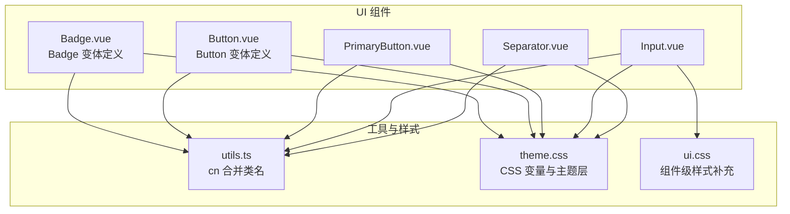
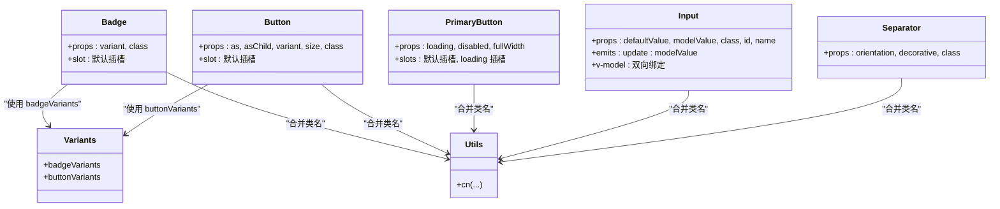
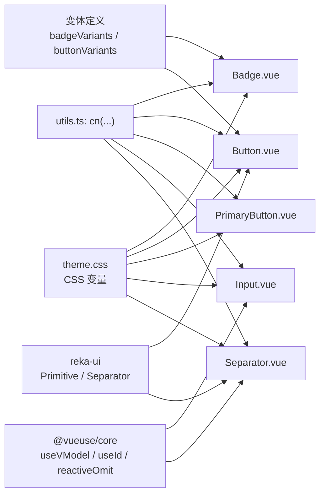

# 基础组件

<cite>
**本文引用的文件**
- [apps/frontend/src/components/ui/badge/Badge.vue](file://apps/frontend/src/components/ui/badge/Badge.vue)
- [apps/frontend/src/components/ui/badge/index.ts](file://apps/frontend/src/components/ui/badge/index.ts)
- [apps/frontend/src/components/ui/button/Button.vue](file://apps/frontend/src/components/ui/button/Button.vue)
- [apps/frontend/src/components/ui/button/PrimaryButton.vue](file://apps/frontend/src/components/ui/button/PrimaryButton.vue)
- [apps/frontend/src/components/ui/button/index.ts](file://apps/frontend/src/components/ui/button/index.ts)
- [apps/frontend/src/components/ui/input/Input.vue](file://apps/frontend/src/components/ui/input/Input.vue)
- [apps/frontend/src/components/ui/input/index.ts](file://apps/frontend/src/components/ui/input/index.ts)
- [apps/frontend/src/components/ui/separator/Separator.vue](file://apps/frontend/src/components/ui/separator/Separator.vue)
- [apps/frontend/src/components/ui/separator/index.ts](file://apps/frontend/src/components/ui/separator/index.ts)
- [apps/frontend/src/lib/utils.ts](file://apps/frontend/src/lib/utils.ts)
- [apps/frontend/src/styles/theme.css](file://apps/frontend/src/styles/theme.css)
- [apps/frontend/src/styles/ui.css](file://apps/frontend/src/styles/ui.css)
- [apps/frontend/tests/components/ui/button/Button.spec.ts](file://apps/frontend/tests/components/ui/button/Button.spec.ts)
</cite>

## 目录
1. [简介](#简介)
2. [项目结构](#项目结构)
3. [核心组件](#核心组件)
4. [架构总览](#架构总览)
5. [详细组件分析](#详细组件分析)
6. [依赖分析](#依赖分析)
7. [性能考虑](#性能考虑)
8. [故障排查指南](#故障排查指南)
9. [结论](#结论)
10. [附录](#附录)

## 简介
本文件聚焦于前端应用中的基础UI组件：Badge徽章、Button按钮、Input输入框、Separator分隔符。文档从设计与实现角度出发，系统阐述各组件的属性接口、事件处理与插槽使用；说明状态管理、样式变体与尺寸选项；给出无障碍与键盘导航建议；提供可定制化与CSS变量覆盖方法，并结合仓库内的测试与样式文件，总结最佳实践与常见问题定位思路。

## 项目结构
这些基础组件位于统一的UI目录下，采用按功能模块划分的组织方式，便于复用与扩展。组件通过变体系统（cva）统一生成样式类名，并借助工具函数合并类名，确保一致的外观与行为。

**图示来源**
- [apps/frontend/src/components/ui/badge/Badge.vue:1-18](file://apps/frontend/src/components/ui/badge/Badge.vue#L1-L18)
- [apps/frontend/src/components/ui/badge/index.ts:1-26](file://apps/frontend/src/components/ui/badge/index.ts#L1-L26)
- [apps/frontend/src/components/ui/button/Button.vue:1-32](file://apps/frontend/src/components/ui/button/Button.vue#L1-L32)
- [apps/frontend/src/components/ui/button/PrimaryButton.vue:1-62](file://apps/frontend/src/components/ui/button/PrimaryButton.vue#L1-L62)
- [apps/frontend/src/components/ui/button/index.ts:1-38](file://apps/frontend/src/components/ui/button/index.ts#L1-L38)
- [apps/frontend/src/components/ui/input/Input.vue:1-42](file://apps/frontend/src/components/ui/input/Input.vue#L1-L42)
- [apps/frontend/src/components/ui/input/index.ts:1-2](file://apps/frontend/src/components/ui/input/index.ts#L1-L2)
- [apps/frontend/src/components/ui/separator/Separator.vue:1-29](file://apps/frontend/src/components/ui/separator/Separator.vue#L1-L29)
- [apps/frontend/src/components/ui/separator/index.ts:1-2](file://apps/frontend/src/components/ui/separator/index.ts#L1-L2)
- [apps/frontend/src/lib/utils.ts:1-33](file://apps/frontend/src/lib/utils.ts#L1-L33)
- [apps/frontend/src/styles/theme.css:1-146](file://apps/frontend/src/styles/theme.css#L1-L146)
- [apps/frontend/src/styles/ui.css:1-36](file://apps/frontend/src/styles/ui.css#L1-L36)

**章节来源**
- [apps/frontend/src/components/ui/badge/Badge.vue:1-18](file://apps/frontend/src/components/ui/badge/Badge.vue#L1-L18)
- [apps/frontend/src/components/ui/button/Button.vue:1-32](file://apps/frontend/src/components/ui/button/Button.vue#L1-L32)
- [apps/frontend/src/components/ui/button/PrimaryButton.vue:1-62](file://apps/frontend/src/components/ui/button/PrimaryButton.vue#L1-L62)
- [apps/frontend/src/components/ui/input/Input.vue:1-42](file://apps/frontend/src/components/ui/input/Input.vue#L1-L42)
- [apps/frontend/src/components/ui/separator/Separator.vue:1-29](file://apps/frontend/src/components/ui/separator/Separator.vue#L1-L29)
- [apps/frontend/src/lib/utils.ts:1-33](file://apps/frontend/src/lib/utils.ts#L1-L33)
- [apps/frontend/src/styles/theme.css:1-146](file://apps/frontend/src/styles/theme.css#L1-L146)
- [apps/frontend/src/styles/ui.css:1-36](file://apps/frontend/src/styles/ui.css#L1-L36)

## 核心组件
- Badge 徽章：用于展示标签、状态或计数信息，支持多变体与插槽。
- Button 按钮：通用按钮容器，支持多种变体与尺寸，可透传原生属性。
- PrimaryButton 主按钮：强调型按钮，内置加载态与全宽选项，提供动画与阴影效果。
- Input 输入框：受控/非受控均可，自动生成ID，支持name、v-model与原生命令。
- Separator 分隔符：水平/垂直方向的分隔线，支持装饰性与无障碍语义。

**章节来源**
- [apps/frontend/src/components/ui/badge/Badge.vue:1-18](file://apps/frontend/src/components/ui/badge/Badge.vue#L1-L18)
- [apps/frontend/src/components/ui/badge/index.ts:1-26](file://apps/frontend/src/components/ui/badge/index.ts#L1-L26)
- [apps/frontend/src/components/ui/button/Button.vue:1-32](file://apps/frontend/src/components/ui/button/Button.vue#L1-L32)
- [apps/frontend/src/components/ui/button/PrimaryButton.vue:1-62](file://apps/frontend/src/components/ui/button/PrimaryButton.vue#L1-L62)
- [apps/frontend/src/components/ui/button/index.ts:1-38](file://apps/frontend/src/components/ui/button/index.ts#L1-L38)
- [apps/frontend/src/components/ui/input/Input.vue:1-42](file://apps/frontend/src/components/ui/input/Input.vue#L1-L42)
- [apps/frontend/src/components/ui/input/index.ts:1-2](file://apps/frontend/src/components/ui/input/index.ts#L1-L2)
- [apps/frontend/src/components/ui/separator/Separator.vue:1-29](file://apps/frontend/src/components/ui/separator/Separator.vue#L1-L29)
- [apps/frontend/src/components/ui/separator/index.ts:1-2](file://apps/frontend/src/components/ui/separator/index.ts#L1-L2)

## 架构总览
组件遵循“变体驱动 + 工具函数合并类名”的架构模式：
- 使用 class-variance-authority 定义变体映射，生成统一的样式类名。
- 使用 cn 合并工具函数，确保用户自定义类名与变体类名正确叠加。
- 主题通过 CSS 变量集中管理，组件样式依赖于语义化变量，便于全局切换明暗主题与品牌色。

**图示来源**
- [apps/frontend/src/components/ui/badge/Badge.vue:1-18](file://apps/frontend/src/components/ui/badge/Badge.vue#L1-L18)
- [apps/frontend/src/components/ui/badge/index.ts:1-26](file://apps/frontend/src/components/ui/badge/index.ts#L1-L26)
- [apps/frontend/src/components/ui/button/Button.vue:1-32](file://apps/frontend/src/components/ui/button/Button.vue#L1-L32)
- [apps/frontend/src/components/ui/button/index.ts:1-38](file://apps/frontend/src/components/ui/button/index.ts#L1-L38)
- [apps/frontend/src/components/ui/button/PrimaryButton.vue:1-62](file://apps/frontend/src/components/ui/button/PrimaryButton.vue#L1-L62)
- [apps/frontend/src/components/ui/input/Input.vue:1-42](file://apps/frontend/src/components/ui/input/Input.vue#L1-L42)
- [apps/frontend/src/components/ui/separator/Separator.vue:1-29](file://apps/frontend/src/components/ui/separator/Separator.vue#L1-L29)
- [apps/frontend/src/lib/utils.ts:1-33](file://apps/frontend/src/lib/utils.ts#L1-L33)

## 详细组件分析

### Badge 徽章
- 属性接口
  - variant: 变体类型，来自 badgeVariants 的 variant 映射，默认值由变体定义提供。
  - class: 用户自定义类名，与变体类名合并。
- 插槽
  - 默认插槽：承载徽章内容。
- 样式与尺寸
  - 通过变体系统生成不同风格（如默认、次要、破坏性、描边），配合圆角、内边距、字体大小等。
- 无障碍与键盘导航
  - 作为静态展示元素，建议在需要焦点时配合 aria-label 或 role="status" 等语义属性。
- 使用示例与最佳实践
  - 在列表项右侧显示未读数或状态标签，优先使用语义明确的 variant。
  - 自定义样式时仅追加 class，避免覆盖变体关键类名。
- 可定制化与CSS变量
  - 通过覆盖主题变量调整主色、前景色与阴影，从而影响所有变体表现。

**章节来源**
- [apps/frontend/src/components/ui/badge/Badge.vue:1-18](file://apps/frontend/src/components/ui/badge/Badge.vue#L1-L18)
- [apps/frontend/src/components/ui/badge/index.ts:1-26](file://apps/frontend/src/components/ui/badge/index.ts#L1-L26)
- [apps/frontend/src/styles/theme.css:1-146](file://apps/frontend/src/styles/theme.css#L1-L146)

### Button 按钮
- 属性接口
  - as / asChild：来自 reka-ui 的 PrimitiveProps，允许渲染为任意元素或子元素。
  - variant：变体类型，支持 default、destructive、outline、secondary、ghost、link。
  - size：尺寸类型，支持 default、xs、sm、lg、icon、icon-sm、icon-lg。
  - class：用户自定义类名。
- 插槽
  - 默认插槽：承载按钮内容。
- 事件与状态
  - 作为容器组件，不直接处理业务事件；可通过父组件绑定 click 等原生事件。
  - 支持禁用态与聚焦态样式，符合无障碍要求。
- 使用示例与最佳实践
  - 优先使用语义化变体表达操作意图；图标按钮使用 icon 系列尺寸。
  - 与 PrimaryButton 协同使用：主流程使用 PrimaryButton，次要操作使用 Button。
- 可定制化与CSS变量
  - 通过覆盖主题变量控制主色、前景色、边框色等，影响所有变体。

**章节来源**
- [apps/frontend/src/components/ui/button/Button.vue:1-32](file://apps/frontend/src/components/ui/button/Button.vue#L1-L32)
- [apps/frontend/src/components/ui/button/index.ts:1-38](file://apps/frontend/src/components/ui/button/index.ts#L1-L38)
- [apps/frontend/src/styles/theme.css:1-146](file://apps/frontend/src/styles/theme.css#L1-L146)

### PrimaryButton 主按钮
- 属性接口
  - loading: 加载态开关，显示旋转指示器与 loading 插槽。
  - disabled: 禁用态，阻止交互。
  - fullWidth: 全宽布局。
- 插槽
  - 默认插槽：正常状态下显示的内容。
  - loading 插槽：自定义加载态文案。
- 行为特性
  - 内置渐变光效动画与阴影变化，提升视觉反馈。
  - 禁用与加载态下移除动画，保证可读性与可预测性。
- 使用示例与最佳实践
  - 适用于提交、确认等关键动作；避免在同一页面出现过多强调按钮。
  - 结合 loading 控制提交流程，提供即时反馈。
- 可定制化与CSS变量
  - 通过主题变量调整主色与阴影参数，影响整体视觉风格。

**章节来源**
- [apps/frontend/src/components/ui/button/PrimaryButton.vue:1-62](file://apps/frontend/src/components/ui/button/PrimaryButton.vue#L1-L62)
- [apps/frontend/src/styles/theme.css:1-146](file://apps/frontend/src/styles/theme.css#L1-L146)

### Input 输入框
- 属性接口
  - defaultValue / modelValue：受控/非受控两种模式。
  - class：用户自定义类名。
  - id / name：标识与表单字段名称。
- 事件
  - update:modelValue：双向绑定事件，内部通过 v-model 实现。
- 行为特性
  - 自动生成唯一 ID，避免重复 id 导致的可访问性问题。
  - 透传原生属性到 input 元素，支持 type、placeholder、autocapitalize 等。
- 无障碍与键盘导航
  - 自动管理 id 与 v-model，建议配合 label 使用 aria-labelledby 或 for 属性。
  - 支持聚焦态与禁用态样式，满足键盘导航与屏幕阅读器需求。
- 使用示例与最佳实践
  - 与 form 组合时务必设置 name 与 id；复杂场景可结合校验库使用。
  - 需要自定义容器样式时，可在外层包裹容器并应用额外类名。
- 可定制化与CSS变量
  - 通过主题变量统一边框色、背景色、占位符色等，确保输入框在不同主题下的一致性。

**章节来源**
- [apps/frontend/src/components/ui/input/Input.vue:1-42](file://apps/frontend/src/components/ui/input/Input.vue#L1-L42)
- [apps/frontend/src/lib/utils.ts:1-33](file://apps/frontend/src/lib/utils.ts#L1-L33)
- [apps/frontend/src/styles/theme.css:1-146](file://apps/frontend/src/styles/theme.css#L1-L146)

### Separator 分隔符
- 属性接口
  - orientation：方向，horizontal 或 vertical。
  - decorative：是否为装饰性分隔符。
  - class：用户自定义类名。
- 行为特性
  - 通过 reka-ui 的 Separator 组件实现语义化分隔，支持水平/垂直两种形态。
  - 类名根据方向动态计算，保证视觉一致性。
- 使用示例与最佳实践
  - 在卡片、菜单、对话框等容器中分组内容，避免仅用纯色背景区分。
  - 与无障碍语义结合，必要时提供标题或描述文本。
- 可定制化与CSS变量
  - 通过主题变量控制边框色，适配明暗主题切换。

**章节来源**
- [apps/frontend/src/components/ui/separator/Separator.vue:1-29](file://apps/frontend/src/components/ui/separator/Separator.vue#L1-L29)
- [apps/frontend/src/components/ui/separator/index.ts:1-2](file://apps/frontend/src/components/ui/separator/index.ts#L1-L2)
- [apps/frontend/src/styles/theme.css:1-146](file://apps/frontend/src/styles/theme.css#L1-L146)

## 依赖分析
- 组件间关系
  - 所有组件均依赖 cn 工具函数进行类名合并，确保用户自定义类名与变体类名正确叠加。
  - Button 与 Badge 依赖各自的变体定义；Input 依赖工具函数；Separator 依赖 reka-ui。
- 外部依赖
  - class-variance-authority：变体系统，生成条件样式。
  - reka-ui：提供语义化组件与原生属性透传能力。
  - @vueuse/core：提供响应式工具（如 useVModel、useId、reactiveOmit）。
- 主题耦合
  - 组件样式依赖 CSS 变量，主题通过 theme.css 统一注入，实现全局切换。

**图示来源**
- [apps/frontend/src/lib/utils.ts:1-33](file://apps/frontend/src/lib/utils.ts#L1-L33)
- [apps/frontend/src/components/ui/badge/index.ts:1-26](file://apps/frontend/src/components/ui/badge/index.ts#L1-L26)
- [apps/frontend/src/components/ui/button/index.ts:1-38](file://apps/frontend/src/components/ui/button/index.ts#L1-L38)
- [apps/frontend/src/components/ui/button/Button.vue:1-32](file://apps/frontend/src/components/ui/button/Button.vue#L1-L32)
- [apps/frontend/src/components/ui/button/PrimaryButton.vue:1-62](file://apps/frontend/src/components/ui/button/PrimaryButton.vue#L1-L62)
- [apps/frontend/src/components/ui/input/Input.vue:1-42](file://apps/frontend/src/components/ui/input/Input.vue#L1-L42)
- [apps/frontend/src/components/ui/separator/Separator.vue:1-29](file://apps/frontend/src/components/ui/separator/Separator.vue#L1-L29)
- [apps/frontend/src/styles/theme.css:1-146](file://apps/frontend/src/styles/theme.css#L1-L146)

**章节来源**
- [apps/frontend/src/lib/utils.ts:1-33](file://apps/frontend/src/lib/utils.ts#L1-L33)
- [apps/frontend/src/components/ui/button/index.ts:1-38](file://apps/frontend/src/components/ui/button/index.ts#L1-L38)
- [apps/frontend/src/components/ui/badge/index.ts:1-26](file://apps/frontend/src/components/ui/badge/index.ts#L1-L26)
- [apps/frontend/src/components/ui/button/Button.vue:1-32](file://apps/frontend/src/components/ui/button/Button.vue#L1-L32)
- [apps/frontend/src/components/ui/button/PrimaryButton.vue:1-62](file://apps/frontend/src/components/ui/button/PrimaryButton.vue#L1-L62)
- [apps/frontend/src/components/ui/input/Input.vue:1-42](file://apps/frontend/src/components/ui/input/Input.vue#L1-L42)
- [apps/frontend/src/components/ui/separator/Separator.vue:1-29](file://apps/frontend/src/components/ui/separator/Separator.vue#L1-L29)
- [apps/frontend/src/styles/theme.css:1-146](file://apps/frontend/src/styles/theme.css#L1-L146)

## 性能考虑
- 类名合并成本低：cn 通过 twMerge 与 clsx 合并，避免重复类名与冲突。
- 变体系统按需生成：cva 将样式拆分为原子类，减少运行时开销。
- 主题变量集中：CSS 变量减少重排与重绘，适合频繁切换主题。
- 输入框与分隔符无复杂逻辑：渲染路径短，性能稳定。

[本节为通用指导，无需特定文件引用]

## 故障排查指南
- Button 测试参考
  - 插槽内容渲染验证：确保默认插槽被正确渲染。
  - 变体与尺寸类名：断言包含对应尺寸或变体类名。
- 常见问题
  - 类名覆盖失效：检查是否正确传入 class 并与变体类名叠加。
  - 输入框无法聚焦：确认是否设置了正确的 id 与 label 关联。
  - 分隔符方向错误：检查 orientation 与类名计算逻辑。
- 建议
  - 使用测试用例覆盖关键行为，如变体类名、尺寸类名、插槽渲染。
  - 在主题切换前后验证关键颜色与阴影是否符合预期。

**章节来源**
- [apps/frontend/tests/components/ui/button/Button.spec.ts:1-39](file://apps/frontend/tests/components/ui/button/Button.spec.ts#L1-L39)

## 结论
本基础组件库以变体系统为核心，结合工具函数与主题变量，实现了高内聚、低耦合且易于定制的UI体系。Badge、Button、Input、Separator 四个组件分别覆盖了标签、交互、输入与布局四大基础场景，具备良好的可扩展性与可维护性。建议在实际项目中遵循语义化变体与尺寸选择、合理使用插槽与类名覆盖，并结合主题变量实现一致的视觉与交互体验。

[本节为总结，无需特定文件引用]

## 附录

### 组件属性与变体速查
- Badge
  - 属性：variant, class
  - 变体：default, secondary, destructive, outline
- Button
  - 属性：as, asChild, variant, size, class
  - 变体：default, destructive, outline, secondary, ghost, link
  - 尺寸：default, xs, sm, lg, icon, icon-sm, icon-lg
- PrimaryButton
  - 属性：loading, disabled, fullWidth
  - 插槽：默认插槽、loading 插槽
- Input
  - 属性：defaultValue, modelValue, class, id, name
  - 事件：update:modelValue
- Separator
  - 属性：orientation, decorative, class

**章节来源**
- [apps/frontend/src/components/ui/badge/index.ts:1-26](file://apps/frontend/src/components/ui/badge/index.ts#L1-L26)
- [apps/frontend/src/components/ui/button/index.ts:1-38](file://apps/frontend/src/components/ui/button/index.ts#L1-L38)
- [apps/frontend/src/components/ui/button/PrimaryButton.vue:1-62](file://apps/frontend/src/components/ui/button/PrimaryButton.vue#L1-L62)
- [apps/frontend/src/components/ui/input/Input.vue:1-42](file://apps/frontend/src/components/ui/input/Input.vue#L1-L42)
- [apps/frontend/src/components/ui/separator/Separator.vue:1-29](file://apps/frontend/src/components/ui/separator/Separator.vue#L1-L29)

### 可定制化与CSS变量覆盖
- 主题变量位置：theme.css 中定义了背景、前景、主色、次色、警告色、边框、输入、圆角等变量。
- 覆盖方式：在 :root 与 .dark 中修改对应变量值，即可全局生效。
- 组件依赖：Badge、Button、PrimaryButton、Input、Separator 的样式均依赖这些变量，无需改动组件代码即可完成主题切换与品牌定制。

**章节来源**
- [apps/frontend/src/styles/theme.css:1-146](file://apps/frontend/src/styles/theme.css#L1-L146)