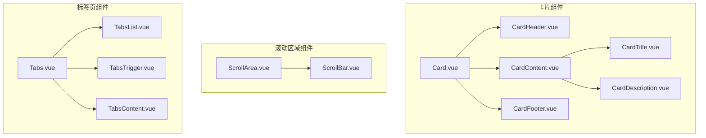
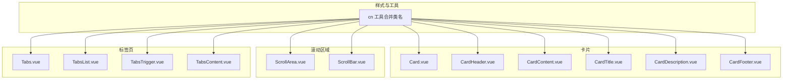
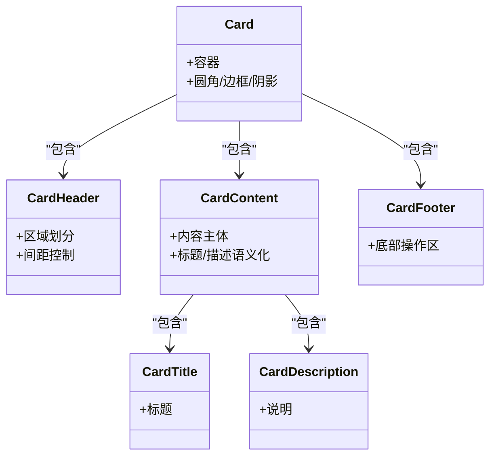
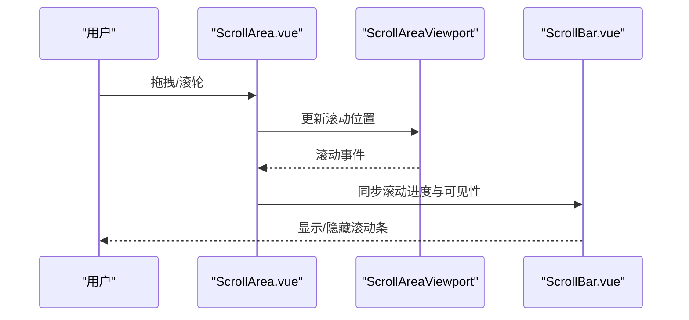
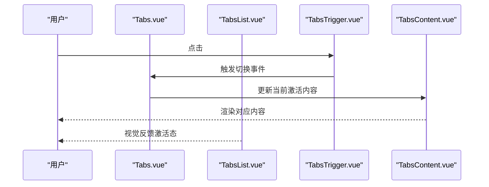
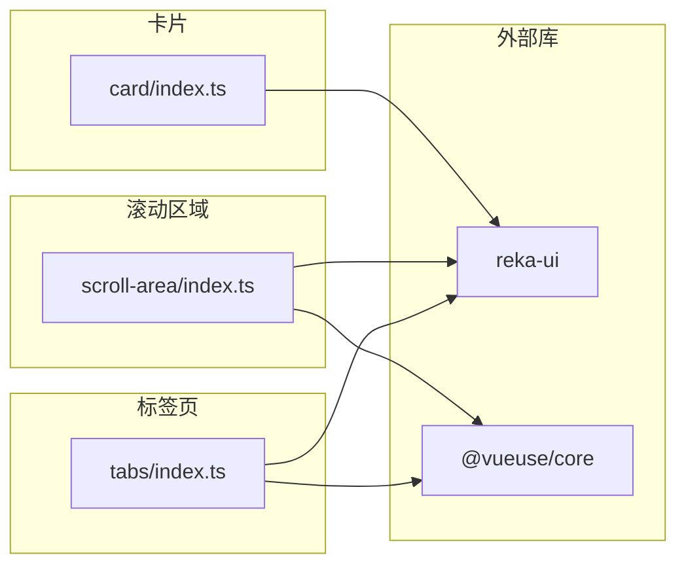

# 布局组件

<cite>
**本文引用的文件**
- [apps/frontend/src/components/ui/card/Card.vue](file://apps/frontend/src/components/ui/card/Card.vue)
- [apps/frontend/src/components/ui/card/CardContent.vue](file://apps/frontend/src/components/ui/card/CardContent.vue)
- [apps/frontend/src/components/ui/card/CardHeader.vue](file://apps/frontend/src/components/ui/card/CardHeader.vue)
- [apps/frontend/src/components/ui/card/CardTitle.vue](file://apps/frontend/src/components/ui/card/CardTitle.vue)
- [apps/frontend/src/components/ui/card/CardDescription.vue](file://apps/frontend/src/components/ui/card/CardDescription.vue)
- [apps/frontend/src/components/ui/card/CardFooter.vue](file://apps/frontend/src/components/ui/card/CardFooter.vue)
- [apps/frontend/src/components/ui/card/index.ts](file://apps/frontend/src/components/ui/card/index.ts)
- [apps/frontend/src/components/ui/scroll-area/ScrollArea.vue](file://apps/frontend/src/components/ui/scroll-area/ScrollArea.vue)
- [apps/frontend/src/components/ui/scroll-area/ScrollBar.vue](file://apps/frontend/src/components/ui/scroll-area/ScrollBar.vue)
- [apps/frontend/src/components/ui/scroll-area/index.ts](file://apps/frontend/src/components/ui/scroll-area/index.ts)
- [apps/frontend/src/components/ui/tabs/Tabs.vue](file://apps/frontend/src/components/ui/tabs/Tabs.vue)
- [apps/frontend/src/components/ui/tabs/TabsList.vue](file://apps/frontend/src/components/ui/tabs/TabsList.vue)
- [apps/frontend/src/components/ui/tabs/TabsTrigger.vue](file://apps/frontend/src/components/ui/tabs/TabsTrigger.vue)
- [apps/frontend/src/components/ui/tabs/TabsContent.vue](file://apps/frontend/src/components/ui/tabs/TabsContent.vue)
- [apps/frontend/src/components/ui/tabs/index.ts](file://apps/frontend/src/components/ui/tabs/index.ts)
</cite>

## 目录
1. [简介](#简介)
2. [项目结构](#项目结构)
3. [核心组件](#核心组件)
4. [架构总览](#架构总览)
5. [详细组件分析](#详细组件分析)
6. [依赖分析](#依赖分析)
7. [性能考虑](#性能考虑)
8. [故障排查指南](#故障排查指南)
9. [结论](#结论)
10. [附录](#附录)

## 简介
本文件聚焦于前端应用中的布局相关UI组件：Card（卡片）、ScrollArea（滚动区域）、Tabs（标签页）。文档从空间组织、内容排列与响应式适配三个维度，系统阐述这些组件的设计与实现；并结合嵌套规则、层级管理与视觉层次，给出组合使用模式与设计模式建议，辅以复杂布局场景的实现思路与不同屏幕尺寸下的优化策略。

## 项目结构
这些组件位于前端应用的通用UI组件目录中，采用按功能域分层的组织方式：
- 卡片组件族：Card 根容器及其子块（Header/Content/Title/Description/Footer）
- 滚动区域组件族：ScrollArea 根容器与 ScrollBar 滚动条
- 标签页组件族：Tabs 根容器、TabsList 列表、TabsTrigger 触发器、TabsContent 内容区

图表来源
- [apps/frontend/src/components/ui/card/Card.vue:1-15](file://apps/frontend/src/components/ui/card/Card.vue#L1-L15)
- [apps/frontend/src/components/ui/card/CardHeader.vue:1-15](file://apps/frontend/src/components/ui/card/CardHeader.vue#L1-L15)
- [apps/frontend/src/components/ui/card/CardContent.vue:1-15](file://apps/frontend/src/components/ui/card/CardContent.vue#L1-L15)
- [apps/frontend/src/components/ui/card/CardTitle.vue:1-15](file://apps/frontend/src/components/ui/card/CardTitle.vue#L1-L15)
- [apps/frontend/src/components/ui/card/CardDescription.vue:1-15](file://apps/frontend/src/components/ui/card/CardDescription.vue#L1-L15)
- [apps/frontend/src/components/ui/card/CardFooter.vue:1-15](file://apps/frontend/src/components/ui/card/CardFooter.vue#L1-L15)
- [apps/frontend/src/components/ui/scroll-area/ScrollArea.vue:1-23](file://apps/frontend/src/components/ui/scroll-area/ScrollArea.vue#L1-L23)
- [apps/frontend/src/components/ui/scroll-area/ScrollBar.vue:1-34](file://apps/frontend/src/components/ui/scroll-area/ScrollBar.vue#L1-L34)
- [apps/frontend/src/components/ui/tabs/Tabs.vue:1-16](file://apps/frontend/src/components/ui/tabs/Tabs.vue#L1-L16)
- [apps/frontend/src/components/ui/tabs/TabsList.vue:1-26](file://apps/frontend/src/components/ui/tabs/TabsList.vue#L1-L26)
- [apps/frontend/src/components/ui/tabs/TabsTrigger.vue:1-28](file://apps/frontend/src/components/ui/tabs/TabsTrigger.vue#L1-L28)
- [apps/frontend/src/components/ui/tabs/TabsContent.vue:1-26](file://apps/frontend/src/components/ui/tabs/TabsContent.vue#L1-L26)

章节来源
- [apps/frontend/src/components/ui/card/index.ts:1-7](file://apps/frontend/src/components/ui/card/index.ts#L1-L7)
- [apps/frontend/src/components/ui/scroll-area/index.ts:1-3](file://apps/frontend/src/components/ui/scroll-area/index.ts#L1-L3)
- [apps/frontend/src/components/ui/tabs/index.ts:1-5](file://apps/frontend/src/components/ui/tabs/index.ts#L1-L5)

## 核心组件
- 卡片（Card）：作为内容容器，提供统一的边框、背景与阴影样式，内部通过 Header/Content/Footer 组织头部、主体与底部操作区；Title/Description 提供标题与说明文本语义化结构。
- 滚动区域（ScrollArea）：基于 reka-ui 的滚动根容器，负责裁剪溢出内容并在需要时显示自定义滚动条；ScrollBar 提供垂直/水平滚动条与拇指样式。
- 标签页（Tabs）：基于 reka-ui 的标签页根容器，配合 TabsList、TabsTrigger、TabsContent 实现可切换的内容面板，支持状态同步与无障碍交互。

章节来源
- [apps/frontend/src/components/ui/card/Card.vue:1-15](file://apps/frontend/src/components/ui/card/Card.vue#L1-L15)
- [apps/frontend/src/components/ui/scroll-area/ScrollArea.vue:1-23](file://apps/frontend/src/components/ui/scroll-area/ScrollArea.vue#L1-L23)
- [apps/frontend/src/components/ui/tabs/Tabs.vue:1-16](file://apps/frontend/src/components/ui/tabs/Tabs.vue#L1-L16)

## 架构总览
这些组件均采用“容器 + 子块”的组合模式，通过 slot 插槽承载内容，并以工具函数合并类名实现样式扩展。它们不直接处理业务逻辑，而是通过属性透传与事件转发，确保与底层UI库（reka-ui）保持一致的交互契约。

图表来源
- [apps/frontend/src/components/ui/card/Card.vue:1-15](file://apps/frontend/src/components/ui/card/Card.vue#L1-L15)
- [apps/frontend/src/components/ui/card/CardHeader.vue:1-15](file://apps/frontend/src/components/ui/card/CardHeader.vue#L1-L15)
- [apps/frontend/src/components/ui/card/CardContent.vue:1-15](file://apps/frontend/src/components/ui/card/CardContent.vue#L1-L15)
- [apps/frontend/src/components/ui/card/CardTitle.vue:1-15](file://apps/frontend/src/components/ui/card/CardTitle.vue#L1-L15)
- [apps/frontend/src/components/ui/card/CardDescription.vue:1-15](file://apps/frontend/src/components/ui/card/CardDescription.vue#L1-L15)
- [apps/frontend/src/components/ui/card/CardFooter.vue:1-15](file://apps/frontend/src/components/ui/card/CardFooter.vue#L1-L15)
- [apps/frontend/src/components/ui/scroll-area/ScrollArea.vue:1-23](file://apps/frontend/src/components/ui/scroll-area/ScrollArea.vue#L1-L23)
- [apps/frontend/src/components/ui/scroll-area/ScrollBar.vue:1-34](file://apps/frontend/src/components/ui/scroll-area/ScrollBar.vue#L1-L34)
- [apps/frontend/src/components/ui/tabs/Tabs.vue:1-16](file://apps/frontend/src/components/ui/tabs/Tabs.vue#L1-L16)
- [apps/frontend/src/components/ui/tabs/TabsList.vue:1-26](file://apps/frontend/src/components/ui/tabs/TabsList.vue#L1-L26)
- [apps/frontend/src/components/ui/tabs/TabsTrigger.vue:1-28](file://apps/frontend/src/components/ui/tabs/TabsTrigger.vue#L1-L28)
- [apps/frontend/src/components/ui/tabs/TabsContent.vue:1-26](file://apps/frontend/src/components/ui/tabs/TabsContent.vue#L1-L26)

## 详细组件分析

### 卡片组件（Card）
- 设计要点
  - 容器 Card 提供统一的圆角、边框、背景与阴影，作为内容的视觉容器。
  - Header/Content/Footer 负责区域划分与间距控制；Content 下的 Title/Description 提供语义化标题与说明。
- 嵌套规则与层级
  - 推荐结构：Card → (CardHeader | CardContent | CardFooter)，其中 Content 可内嵌 Title/Description。
  - 不建议在 Card 外层再包裹额外容器，除非需要外层布局控制（如网格、Flex）。
- 视觉层次
  - 通过背景色与阴影形成层级感；Header/Content/Footer 的内边距与对齐控制内容密度与阅读节奏。
- 响应式适配
  - 使用紧凑内边距（如 Content 的上内边距为零），在窄屏下减少垂直空间占用；标题与描述使用语义化标签提升可读性。
- 组合模式
  - 与按钮、图标、列表等组合时，优先将按钮置于 Footer，标题与描述置于 Header 或 Content 中部。
- 复杂布局示例思路
  - 卡片网格：多列布局中，每个单元为独立 Card，内部用 Header/Content/Footer 组织信息。
  - 带图卡片：Header 放置图片或占位，Content 放标题与描述，Footer 放操作按钮。
- 错误与边界
  - 避免在 Card 内直接放置多个独立的标题元素；优先使用 Title/Description 语义化结构。

图表来源
- [apps/frontend/src/components/ui/card/Card.vue:1-15](file://apps/frontend/src/components/ui/card/Card.vue#L1-L15)
- [apps/frontend/src/components/ui/card/CardHeader.vue:1-15](file://apps/frontend/src/components/ui/card/CardHeader.vue#L1-L15)
- [apps/frontend/src/components/ui/card/CardContent.vue:1-15](file://apps/frontend/src/components/ui/card/CardContent.vue#L1-L15)
- [apps/frontend/src/components/ui/card/CardTitle.vue:1-15](file://apps/frontend/src/components/ui/card/CardTitle.vue#L1-L15)
- [apps/frontend/src/components/ui/card/CardDescription.vue:1-15](file://apps/frontend/src/components/ui/card/CardDescription.vue#L1-L15)
- [apps/frontend/src/components/ui/card/CardFooter.vue:1-15](file://apps/frontend/src/components/ui/card/CardFooter.vue#L1-L15)

章节来源
- [apps/frontend/src/components/ui/card/Card.vue:1-15](file://apps/frontend/src/components/ui/card/Card.vue#L1-L15)
- [apps/frontend/src/components/ui/card/CardHeader.vue:1-15](file://apps/frontend/src/components/ui/card/CardHeader.vue#L1-L15)
- [apps/frontend/src/components/ui/card/CardContent.vue:1-15](file://apps/frontend/src/components/ui/card/CardContent.vue#L1-L15)
- [apps/frontend/src/components/ui/card/CardTitle.vue:1-15](file://apps/frontend/src/components/ui/card/CardTitle.vue#L1-L15)
- [apps/frontend/src/components/ui/card/CardDescription.vue:1-15](file://apps/frontend/src/components/ui/card/CardDescription.vue#L1-L15)
- [apps/frontend/src/components/ui/card/CardFooter.vue:1-15](file://apps/frontend/src/components/ui/card/CardFooter.vue#L1-L15)

### 滚动区域（ScrollArea）
- 设计要点
  - ScrollArea 作为根容器，负责裁剪与滚动上下文；ScrollBar 提供垂直/水平滚动条与拇指样式。
  - 通过类名工具函数合并样式，支持方向与尺寸定制。
- 嵌套规则与层级
  - 内容通过插槽传入；滚动条与角落由组件内部渲染，无需手动插入。
  - 不建议在内容中再次包裹滚动容器，避免滚动上下文冲突。
- 视觉层次
  - 滚动条与内容区域分离，滚动条仅在需要时出现，减少视觉干扰。
- 响应式适配
  - 在移动端与桌面端均可工作；可通过容器尺寸控制是否触发滚动。
- 组合模式
  - 与卡片、列表、表格等组合时，将内容放入 ScrollArea，避免外部容器重复实现滚动。
- 复杂布局示例思路
  - 侧边栏+主内容：侧边栏使用 ScrollArea，主内容固定高度；或两者均使用 ScrollArea 并协调滚动。
- 错误与边界
  - 避免内容高度未超过容器导致滚动条不显示；可通过最小高度或占位内容验证。

图表来源
- [apps/frontend/src/components/ui/scroll-area/ScrollArea.vue:1-23](file://apps/frontend/src/components/ui/scroll-area/ScrollArea.vue#L1-L23)
- [apps/frontend/src/components/ui/scroll-area/ScrollBar.vue:1-34](file://apps/frontend/src/components/ui/scroll-area/ScrollBar.vue#L1-L34)

章节来源
- [apps/frontend/src/components/ui/scroll-area/ScrollArea.vue:1-23](file://apps/frontend/src/components/ui/scroll-area/ScrollArea.vue#L1-L23)
- [apps/frontend/src/components/ui/scroll-area/ScrollBar.vue:1-34](file://apps/frontend/src/components/ui/scroll-area/ScrollBar.vue#L1-L34)

### 标签页（Tabs）
- 设计要点
  - Tabs 根容器负责状态管理；TabsList 提供触发器容器；TabsTrigger 定义单个触发项；TabsContent 定义对应内容区。
  - 通过属性透传与事件转发，保持与 reka-ui 的一致性。
- 嵌套规则与层级
  - 结构：Tabs → (TabsList → TabsTrigger...) 与 (TabsContent...)；触发器与内容区通过标识符关联。
  - 不建议在 TabsList 中直接放置非触发器元素；内容区应与触发器一一对应。
- 视觉层次
  - 触发器在激活态有背景、文字颜色与阴影变化，形成清晰的选中状态。
- 响应式适配
  - 在窄屏下可考虑将触发器改为堆叠布局或使用滑动容器；内容区保持自适应。
- 组合模式
  - 与卡片组合：每个内容区为一个 Card，内部组织标题与正文。
  - 与滚动区域组合：内容较多时，将内容区放入 ScrollArea，避免标签页整体溢出。
- 复杂布局示例思路
  - 选项卡面板 + 辅助面板：左侧为 TabsList，右侧为 TabsContent 区域，内容区使用 ScrollArea。
  - 多级标签页：在某个 TabsContent 内部再次使用 Tabs，实现二级导航。
- 错误与边界
  - 触发器与内容区数量不匹配会导致状态异常；需保证一一对应。

图表来源
- [apps/frontend/src/components/ui/tabs/Tabs.vue:1-16](file://apps/frontend/src/components/ui/tabs/Tabs.vue#L1-L16)
- [apps/frontend/src/components/ui/tabs/TabsList.vue:1-26](file://apps/frontend/src/components/ui/tabs/TabsList.vue#L1-L26)
- [apps/frontend/src/components/ui/tabs/TabsTrigger.vue:1-28](file://apps/frontend/src/components/ui/tabs/TabsTrigger.vue#L1-L28)
- [apps/frontend/src/components/ui/tabs/TabsContent.vue:1-26](file://apps/frontend/src/components/ui/tabs/TabsContent.vue#L1-L26)

章节来源
- [apps/frontend/src/components/ui/tabs/Tabs.vue:1-16](file://apps/frontend/src/components/ui/tabs/Tabs.vue#L1-L16)
- [apps/frontend/src/components/ui/tabs/TabsList.vue:1-26](file://apps/frontend/src/components/ui/tabs/TabsList.vue#L1-L26)
- [apps/frontend/src/components/ui/tabs/TabsTrigger.vue:1-28](file://apps/frontend/src/components/ui/tabs/TabsTrigger.vue#L1-L28)
- [apps/frontend/src/components/ui/tabs/TabsContent.vue:1-26](file://apps/frontend/src/components/ui/tabs/TabsContent.vue#L1-L26)

## 依赖分析
- 组件间依赖
  - 卡片组件彼此独立，通过组合关系组织内容；无循环依赖。
  - 滚动区域组件通过 reka-ui 的根容器与滚动条组件协作，无循环依赖。
  - 标签页组件通过 reka-ui 的根容器与列表/触发器/内容组件协作，无循环依赖。
- 外部依赖
  - reka-ui：提供滚动与标签页的核心能力；组件通过属性透传与事件转发与之对接。
  - @vueuse/core：提供属性剔除工具，用于将非样式属性从 class 中剥离，避免传递给底层UI库。
- 导出结构
  - 各组件族通过各自的 index.ts 统一导出，便于按需引入与 Tree Shaking。

图表来源
- [apps/frontend/src/components/ui/card/index.ts:1-7](file://apps/frontend/src/components/ui/card/index.ts#L1-L7)
- [apps/frontend/src/components/ui/scroll-area/index.ts:1-3](file://apps/frontend/src/components/ui/scroll-area/index.ts#L1-L3)
- [apps/frontend/src/components/ui/tabs/index.ts:1-5](file://apps/frontend/src/components/ui/tabs/index.ts#L1-L5)
- [apps/frontend/src/components/ui/scroll-area/ScrollArea.vue:1-23](file://apps/frontend/src/components/ui/scroll-area/ScrollArea.vue#L1-L23)
- [apps/frontend/src/components/ui/tabs/Tabs.vue:1-16](file://apps/frontend/src/components/ui/tabs/Tabs.vue#L1-L16)

章节来源
- [apps/frontend/src/components/ui/card/index.ts:1-7](file://apps/frontend/src/components/ui/card/index.ts#L1-L7)
- [apps/frontend/src/components/ui/scroll-area/index.ts:1-3](file://apps/frontend/src/components/ui/scroll-area/index.ts#L1-L3)
- [apps/frontend/src/components/ui/tabs/index.ts:1-5](file://apps/frontend/src/components/ui/tabs/index.ts#L1-L5)

## 性能考虑
- 滚动区域
  - 尽量减少滚动容器内的重排与重绘；避免在滚动过程中频繁变更 DOM 结构。
  - 对长列表使用虚拟滚动（若 reka-ui 提供相应能力）以降低内存占用。
- 标签页
  - 懒加载内容：仅在激活时渲染内容，减少初始渲染压力。
  - 控制触发器数量与内容复杂度，避免过多嵌套导致渲染开销增加。
- 卡片
  - 合理使用内边距与阴影，避免过度绘制；在密集列表中适当减小阴影强度。

## 故障排查指南
- 滚动条不显示
  - 检查内容是否超出容器高度；确认 ScrollArea 的尺寸设置正确。
  - 确认未在内容中再次包裹滚动容器导致上下文冲突。
- 标签页切换无效
  - 检查触发器与内容区的数量与标识是否一一对应。
  - 确认未在 TabsList 中放置非触发器元素。
- 卡片样式异常
  - 检查是否覆盖了默认类名；确保未破坏语义化结构（如 Title/Description 的层级）。

## 结论
Card、ScrollArea、Tabs 三类组件分别承担内容容器、滚动上下文与标签切换三大布局职责。通过清晰的嵌套规则、层级管理与视觉层次，它们可以灵活组合，支撑从简单到复杂的页面布局。在实际开发中，建议遵循“容器 + 子块”的组合模式，结合响应式策略与性能优化，构建稳定且可维护的界面。

## 附录
- 组合使用模式参考
  - 卡片 + 滚动区域：在卡片内容区使用 ScrollArea，适用于信息密度高但需限制高度的场景。
  - 标签页 + 卡片：在每个标签页内容区放置一个或多个卡片，适合分类展示与对比。
  - 标签页 + 滚动区域：在标签页内容区使用 ScrollArea，适用于内容较多的分类面板。
- 屏幕尺寸优化策略
  - 移动端：减少内边距与阴影强度；触发器采用堆叠或滑动容器；内容区使用 ScrollArea。
  - 桌面端：增大内边距与阴影，增强视觉层次；触发器横向排列，内容区保持自适应。