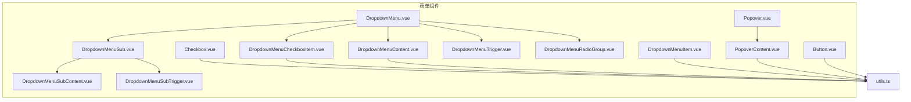
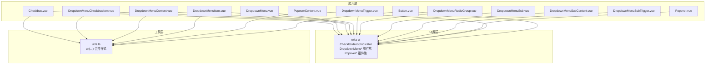
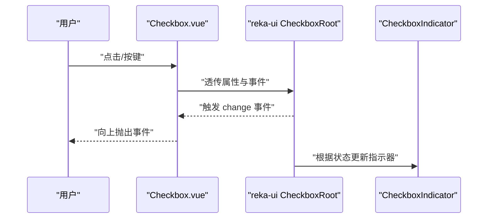
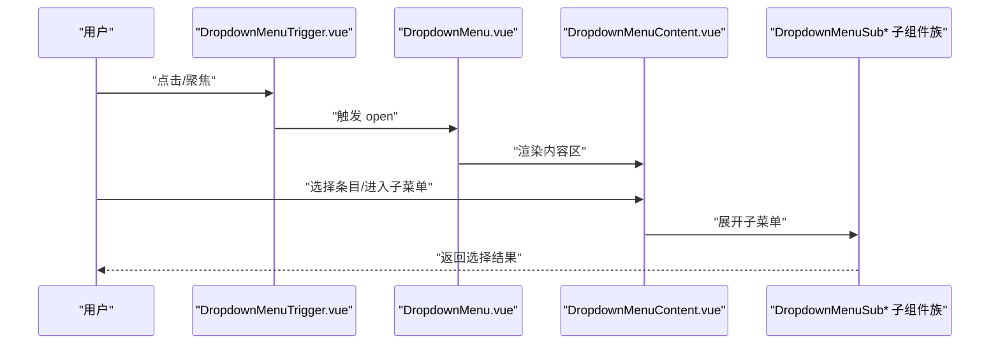
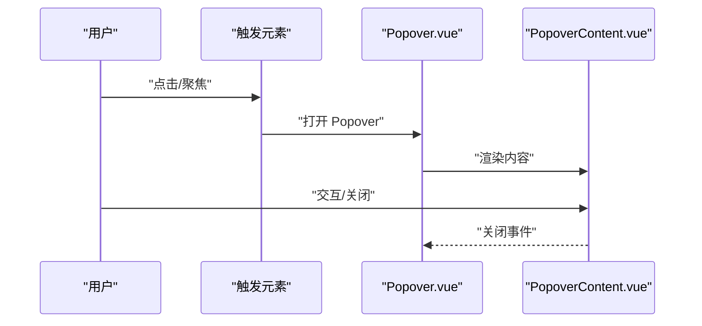
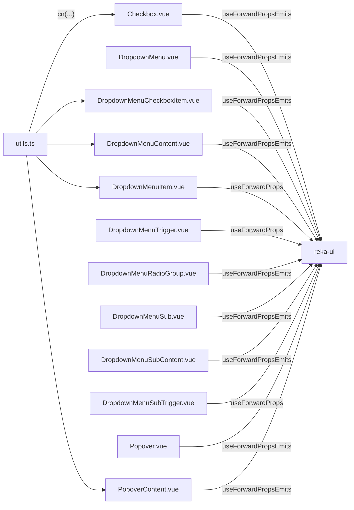

# 表单组件

<cite>
**本文引用的文件**
- [Checkbox.vue](file://apps/frontend/src/components/ui/checkbox/Checkbox.vue)
- [DropdownMenu.vue](file://apps/frontend/src/components/ui/dropdown-menu/DropdownMenu.vue)
- [DropdownMenuCheckboxItem.vue](file://apps/frontend/src/components/ui/dropdown-menu/DropdownMenuCheckboxItem.vue)
- [DropdownMenuContent.vue](file://apps/frontend/src/components/ui/dropdown-menu/DropdownMenuContent.vue)
- [DropdownMenuItem.vue](file://apps/frontend/src/components/ui/dropdown-menu/DropdownMenuItem.vue)
- [DropdownMenuTrigger.vue](file://apps/frontend/src/components/ui/dropdown-menu/DropdownMenuTrigger.vue)
- [DropdownMenuRadioGroup.vue](file://apps/frontend/src/components/ui/dropdown-menu/DropdownMenuRadioGroup.vue)
- [DropdownMenuSub.vue](file://apps/frontend/src/components/ui/dropdown-menu/DropdownMenuSub.vue)
- [DropdownMenuSubContent.vue](file://apps/frontend/src/components/ui/dropdown-menu/DropdownMenuSubContent.vue)
- [DropdownMenuSubTrigger.vue](file://apps/frontend/src/components/ui/dropdown-menu/DropdownMenuSubTrigger.vue)
- [Popover.vue](file://apps/frontend/src/components/ui/popover/Popover.vue)
- [PopoverContent.vue](file://apps/frontend/src/components/ui/popover/PopoverContent.vue)
- [Button.vue](file://apps/frontend/src/components/ui/button/Button.vue)
- [utils.ts](file://apps/frontend/src/lib/utils.ts)
</cite>

## 目录
1. [简介](#简介)
2. [项目结构](#项目结构)
3. [核心组件](#核心组件)
4. [架构总览](#架构总览)
5. [详细组件分析](#详细组件分析)
6. [依赖关系分析](#依赖关系分析)
7. [性能考量](#性能考量)
8. [故障排查指南](#故障排查指南)
9. [结论](#结论)
10. [附录](#附录)

## 简介
本文件聚焦于前端应用中的表单相关UI组件：Checkbox 复选框、DropdownMenu 下拉菜单、Popover 弹出框。文档从设计与实现角度出发，系统阐述这些组件的数据绑定、事件转发、状态管理与交互行为；并结合实际使用模式给出组合与最佳实践，覆盖复杂表单场景与可访问性支持（含屏幕阅读器兼容性建议）。为便于理解，文档在关键处提供可视化图示，并以“章节来源”标注具体文件位置。

## 项目结构
这些表单组件位于前端应用的通用UI组件目录中，采用按功能分层组织的方式：
- checkbox：复选框根组件与指示器封装
- dropdown-menu：下拉菜单体系（根容器、触发器、内容区、条目、分组、子菜单等）
- popover：弹出框根组件与内容区封装
- button：通用按钮组件（用于表单操作与示例演示）
- utils：工具函数（如类名合并）

图表来源
- [Checkbox.vue:1-34](file://apps/frontend/src/components/ui/checkbox/Checkbox.vue#L1-L34)
- [DropdownMenu.vue:1-16](file://apps/frontend/src/components/ui/dropdown-menu/DropdownMenu.vue#L1-L16)
- [DropdownMenuCheckboxItem.vue:1-35](file://apps/frontend/src/components/ui/dropdown-menu/DropdownMenuCheckboxItem.vue#L1-L35)
- [DropdownMenuContent.vue:1-37](file://apps/frontend/src/components/ui/dropdown-menu/DropdownMenuContent.vue#L1-L37)
- [DropdownMenuItem.vue:1-31](file://apps/frontend/src/components/ui/dropdown-menu/DropdownMenuItem.vue#L1-L31)
- [DropdownMenuTrigger.vue:1-15](file://apps/frontend/src/components/ui/dropdown-menu/DropdownMenuTrigger.vue#L1-L15)
- [DropdownMenuRadioGroup.vue:1-16](file://apps/frontend/src/components/ui/dropdown-menu/DropdownMenuRadioGroup.vue#L1-L16)
- [DropdownMenuSub.vue:1-16](file://apps/frontend/src/components/ui/dropdown-menu/DropdownMenuSub.vue#L1-L16)
- [DropdownMenuSubContent.vue:1-29](file://apps/frontend/src/components/ui/dropdown-menu/DropdownMenuSubContent.vue#L1-L29)
- [DropdownMenuSubTrigger.vue:1-30](file://apps/frontend/src/components/ui/dropdown-menu/DropdownMenuSubTrigger.vue#L1-L30)
- [Popover.vue:1-20](file://apps/frontend/src/components/ui/popover/Popover.vue#L1-L20)
- [PopoverContent.vue:1-35](file://apps/frontend/src/components/ui/popover/PopoverContent.vue#L1-L35)
- [Button.vue:1-32](file://apps/frontend/src/components/ui/button/Button.vue#L1-L32)
- [utils.ts:1-33](file://apps/frontend/src/lib/utils.ts#L1-L33)

章节来源
- [Checkbox.vue:1-34](file://apps/frontend/src/components/ui/checkbox/Checkbox.vue#L1-L34)
- [DropdownMenu.vue:1-16](file://apps/frontend/src/components/ui/dropdown-menu/DropdownMenu.vue#L1-L16)
- [Popover.vue:1-20](file://apps/frontend/src/components/ui/popover/Popover.vue#L1-L20)
- [utils.ts:1-33](file://apps/frontend/src/lib/utils.ts#L1-L33)

## 核心组件
本节概述三个表单组件的关键职责与共性特征：
- Checkbox 复选框：基于 reka-ui 的 CheckboxRoot/CheckboxIndicator，负责勾选态切换与视觉反馈，支持禁用、焦点环、尺寸与颜色等样式定制。
- DropdownMenu 下拉菜单：提供根容器、触发器、内容区、条目、分组、子菜单等子组件，形成完整的上下文菜单生态，支持键盘导航、焦点管理与动画过渡。
- Popover 弹出框：提供根容器与内容区，配合 Portal 将内容渲染到指定挂载点，支持对齐方式与偏移量配置，内置开合动画。

这些组件均通过 useForwardPropsEmits 将外部属性与事件透传至 reka-ui 原子组件，确保行为一致且可扩展。

章节来源
- [Checkbox.vue:1-34](file://apps/frontend/src/components/ui/checkbox/Checkbox.vue#L1-L34)
- [DropdownMenu.vue:1-16](file://apps/frontend/src/components/ui/dropdown-menu/DropdownMenu.vue#L1-L16)
- [DropdownMenuContent.vue:1-37](file://apps/frontend/src/components/ui/dropdown-menu/DropdownMenuContent.vue#L1-L37)
- [DropdownMenuItem.vue:1-31](file://apps/frontend/src/components/ui/dropdown-menu/DropdownMenuItem.vue#L1-L31)
- [DropdownMenuTrigger.vue:1-15](file://apps/frontend/src/components/ui/dropdown-menu/DropdownMenuTrigger.vue#L1-L15)
- [DropdownMenuCheckboxItem.vue:1-35](file://apps/frontend/src/components/ui/dropdown-menu/DropdownMenuCheckboxItem.vue#L1-L35)
- [DropdownMenuRadioGroup.vue:1-16](file://apps/frontend/src/components/ui/dropdown-menu/DropdownMenuRadioGroup.vue#L1-L16)
- [DropdownMenuSub.vue:1-16](file://apps/frontend/src/components/ui/dropdown-menu/DropdownMenuSub.vue#L1-L16)
- [DropdownMenuSubContent.vue:1-29](file://apps/frontend/src/components/ui/dropdown-menu/DropdownMenuSubContent.vue#L1-L29)
- [DropdownMenuSubTrigger.vue:1-30](file://apps/frontend/src/components/ui/dropdown-menu/DropdownMenuSubTrigger.vue#L1-L30)
- [Popover.vue:1-20](file://apps/frontend/src/components/ui/popover/Popover.vue#L1-L20)
- [PopoverContent.vue:1-35](file://apps/frontend/src/components/ui/popover/PopoverContent.vue#L1-L35)

## 架构总览
下图展示表单组件与 reka-ui 的关系以及与工具函数的协作：

图表来源
- [Checkbox.vue:1-34](file://apps/frontend/src/components/ui/checkbox/Checkbox.vue#L1-L34)
- [DropdownMenu.vue:1-16](file://apps/frontend/src/components/ui/dropdown-menu/DropdownMenu.vue#L1-L16)
- [DropdownMenuCheckboxItem.vue:1-35](file://apps/frontend/src/components/ui/dropdown-menu/DropdownMenuCheckboxItem.vue#L1-L35)
- [DropdownMenuContent.vue:1-37](file://apps/frontend/src/components/ui/dropdown-menu/DropdownMenuContent.vue#L1-L37)
- [DropdownMenuItem.vue:1-31](file://apps/frontend/src/components/ui/dropdown-menu/DropdownMenuItem.vue#L1-L31)
- [DropdownMenuTrigger.vue:1-15](file://apps/frontend/src/components/ui/dropdown-menu/DropdownMenuTrigger.vue#L1-L15)
- [DropdownMenuRadioGroup.vue:1-16](file://apps/frontend/src/components/ui/dropdown-menu/DropdownMenuRadioGroup.vue#L1-L16)
- [DropdownMenuSub.vue:1-16](file://apps/frontend/src/components/ui/dropdown-menu/DropdownMenuSub.vue#L1-L16)
- [DropdownMenuSubContent.vue:1-29](file://apps/frontend/src/components/ui/dropdown-menu/DropdownMenuSubContent.vue#L1-L29)
- [DropdownMenuSubTrigger.vue:1-30](file://apps/frontend/src/components/ui/dropdown-menu/DropdownMenuSubTrigger.vue#L1-L30)
- [Popover.vue:1-20](file://apps/frontend/src/components/ui/popover/Popover.vue#L1-L20)
- [PopoverContent.vue:1-35](file://apps/frontend/src/components/ui/popover/PopoverContent.vue#L1-L35)
- [Button.vue:1-32](file://apps/frontend/src/components/ui/button/Button.vue#L1-L32)
- [utils.ts:1-33](file://apps/frontend/src/lib/utils.ts#L1-L33)

## 详细组件分析

### Checkbox 复选框
- 设计要点
  - 使用 CheckboxRoot 作为容器，CheckboxIndicator 提供勾选态指示器。
  - 支持禁用、焦点可见环、阴影与尺寸等外观控制，状态通过 data-[state=checked] 切换。
  - 通过 useForwardPropsEmits 将外部属性与事件透传，保持与 reka-ui 的一致性。
- 数据绑定与状态管理
  - 组件内部不维护本地状态，完全受控于父级数据源（v-model 或 checked 属性）。
  - 通过 emits 事件向上抛出变更，便于表单校验与联动。
- 交互行为与事件
  - 支持点击、键盘激活（空格）、Tab 导航与焦点管理。
  - 可通过 slot 插槽自定义图标或指示器内容。
- 最佳实践
  - 与表单字段配合时，建议提供清晰的标签与错误提示。
  - 在多选列表中，优先使用受控组件并集中管理选中集合。

图表来源
- [Checkbox.vue:1-34](file://apps/frontend/src/components/ui/checkbox/Checkbox.vue#L1-L34)

章节来源
- [Checkbox.vue:1-34](file://apps/frontend/src/components/ui/checkbox/Checkbox.vue#L1-L34)

### DropdownMenu 下拉菜单
- 设计要点
  - 根容器负责整体状态与定位；Trigger 触发显示；Content 定位与动画；Item/CheckboxItem/RadioGroup/Sub 等子组件提供不同交互类型。
  - 通过 Portal 将内容渲染到文档流之外，避免被父级裁剪。
- 数据绑定与状态管理
  - 通过 useForwardPropsEmits 透传 props 与 emits，保证与 reka-ui 的行为一致。
  - 子组件（如 CheckboxItem、RadioGroup）各自维护内部状态，但最终由根容器统一协调。
- 交互行为与事件
  - 支持鼠标悬停、点击、键盘方向键与回车选择；支持子菜单展开/收起。
  - 内置开闭动画与侧向滑入/缩放效果。
- 最佳实践
  - 为每个 Item 提供明确的可访问性标签与快捷键提示。
  - 避免在 Content 中放置需要频繁重排的重型内容，以减少布局抖动。

图表来源
- [DropdownMenuTrigger.vue:1-15](file://apps/frontend/src/components/ui/dropdown-menu/DropdownMenuTrigger.vue#L1-L15)
- [DropdownMenu.vue:1-16](file://apps/frontend/src/components/ui/dropdown-menu/DropdownMenu.vue#L1-L16)
- [DropdownMenuContent.vue:1-37](file://apps/frontend/src/components/ui/dropdown-menu/DropdownMenuContent.vue#L1-L37)
- [DropdownMenuSub.vue:1-16](file://apps/frontend/src/components/ui/dropdown-menu/DropdownMenuSub.vue#L1-L16)
- [DropdownMenuSubContent.vue:1-29](file://apps/frontend/src/components/ui/dropdown-menu/DropdownMenuSubContent.vue#L1-L29)
- [DropdownMenuSubTrigger.vue:1-30](file://apps/frontend/src/components/ui/dropdown-menu/DropdownMenuSubTrigger.vue#L1-L30)

章节来源
- [DropdownMenu.vue:1-16](file://apps/frontend/src/components/ui/dropdown-menu/DropdownMenu.vue#L1-L16)
- [DropdownMenuContent.vue:1-37](file://apps/frontend/src/components/ui/dropdown-menu/DropdownMenuContent.vue#L1-L37)
- [DropdownMenuItem.vue:1-31](file://apps/frontend/src/components/ui/dropdown-menu/DropdownMenuItem.vue#L1-L31)
- [DropdownMenuTrigger.vue:1-15](file://apps/frontend/src/components/ui/dropdown-menu/DropdownMenuTrigger.vue#L1-L15)
- [DropdownMenuCheckboxItem.vue:1-35](file://apps/frontend/src/components/ui/dropdown-menu/DropdownMenuCheckboxItem.vue#L1-L35)
- [DropdownMenuRadioGroup.vue:1-16](file://apps/frontend/src/components/ui/dropdown-menu/DropdownMenuRadioGroup.vue#L1-L16)
- [DropdownMenuSub.vue:1-16](file://apps/frontend/src/components/ui/dropdown-menu/DropdownMenuSub.vue#L1-L16)
- [DropdownMenuSubContent.vue:1-29](file://apps/frontend/src/components/ui/dropdown-menu/DropdownMenuSubContent.vue#L1-L29)
- [DropdownMenuSubTrigger.vue:1-30](file://apps/frontend/src/components/ui/dropdown-menu/DropdownMenuSubTrigger.vue#L1-L30)

### Popover 弹出框
- 设计要点
  - Root 负责状态管理；Content 提供定位、对齐与动画；Portal 确保渲染位置可控。
  - 默认居中对齐与固定偏移量，支持侧边滑入动画。
- 数据绑定与状态管理
  - 通过 useForwardPropsEmits 透传 props 与 emits，保持与 reka-ui 的一致性。
- 交互行为与事件
  - 支持点击外部关闭、Esc 关闭、焦点陷阱与键盘导航。
- 最佳实践
  - 在复杂表单中，将 Popover 作为辅助输入面板（如日期选择器、选项预览），避免遮挡主表单区域。

图表来源
- [Popover.vue:1-20](file://apps/frontend/src/components/ui/popover/Popover.vue#L1-L20)
- [PopoverContent.vue:1-35](file://apps/frontend/src/components/ui/popover/PopoverContent.vue#L1-L35)

章节来源
- [Popover.vue:1-20](file://apps/frontend/src/components/ui/popover/Popover.vue#L1-L20)
- [PopoverContent.vue:1-35](file://apps/frontend/src/components/ui/popover/PopoverContent.vue#L1-L35)

### 组合使用模式与最佳实践
- 复选框 + 下拉菜单
  - 场景：多选项筛选（如标签过滤）。CheckboxItem 与 RadioGroup 结合，实现互斥与非互斥两种模式。
  - 建议：为每个选项提供简短说明与快捷键；在 Content 中加入搜索与分组。
- 弹出框 + 按钮
  - 场景：确认对话、设置面板、帮助信息。Popover 作为轻量级容器承载简单交互。
  - 建议：将确认/取消按钮置于底部栏，使用 Button 组件统一风格。
- 复杂表单场景
  - 示例思路：表单页包含多个 FieldSet，每个 FieldSet 内部使用 Checkbox、DropdownMenu、Popover 组合完成输入与校验。
  - 状态管理：推荐使用受控组件与集中式表单状态（如 Pinia Store），在提交前统一校验并生成 payload。

章节来源
- [Button.vue:1-32](file://apps/frontend/src/components/ui/button/Button.vue#L1-L32)

## 依赖关系分析
- 组件耦合
  - 所有表单组件均依赖 reka-ui 的原子组件与工具方法，耦合度低、内聚性强。
  - 通过 useForwardPropsEmits 与 reactiveOmit 实现属性与事件的透明转发，降低样板代码。
- 外部依赖
  - 工具函数 cn(...) 用于类名合并与冲突修复，确保 Tailwind 样式生效。
- 潜在风险
  - 若 reka-ui 版本升级导致 API 变更，需同步更新透传参数与事件名称。
  - Portal 渲染位置不当可能导致 z-index 冲突，应统一挂载策略。

图表来源
- [Checkbox.vue:1-34](file://apps/frontend/src/components/ui/checkbox/Checkbox.vue#L1-L34)
- [DropdownMenu.vue:1-16](file://apps/frontend/src/components/ui/dropdown-menu/DropdownMenu.vue#L1-L16)
- [DropdownMenuCheckboxItem.vue:1-35](file://apps/frontend/src/components/ui/dropdown-menu/DropdownMenuCheckboxItem.vue#L1-L35)
- [DropdownMenuContent.vue:1-37](file://apps/frontend/src/components/ui/dropdown-menu/DropdownMenuContent.vue#L1-L37)
- [DropdownMenuItem.vue:1-31](file://apps/frontend/src/components/ui/dropdown-menu/DropdownMenuItem.vue#L1-L31)
- [DropdownMenuTrigger.vue:1-15](file://apps/frontend/src/components/ui/dropdown-menu/DropdownMenuTrigger.vue#L1-L15)
- [DropdownMenuRadioGroup.vue:1-16](file://apps/frontend/src/components/ui/dropdown-menu/DropdownMenuRadioGroup.vue#L1-L16)
- [DropdownMenuSub.vue:1-16](file://apps/frontend/src/components/ui/dropdown-menu/DropdownMenuSub.vue#L1-L16)
- [DropdownMenuSubContent.vue:1-29](file://apps/frontend/src/components/ui/dropdown-menu/DropdownMenuSubContent.vue#L1-L29)
- [DropdownMenuSubTrigger.vue:1-30](file://apps/frontend/src/components/ui/dropdown-menu/DropdownMenuSubTrigger.vue#L1-L30)
- [Popover.vue:1-20](file://apps/frontend/src/components/ui/popover/Popover.vue#L1-L20)
- [PopoverContent.vue:1-35](file://apps/frontend/src/components/ui/popover/PopoverContent.vue#L1-L35)
- [utils.ts:1-33](file://apps/frontend/src/lib/utils.ts#L1-L33)

章节来源
- [utils.ts:1-33](file://apps/frontend/src/lib/utils.ts#L1-L33)

## 性能考量
- 渲染优化
  - 使用 Portal 将内容渲染到独立节点，减少父级布局影响。
  - 动画使用 CSS 过渡与缩放，避免昂贵的 JS 动画。
- 事件处理
  - 通过 useForwardPropsEmits 仅转发必要属性，减少不必要的响应式开销。
- 样式合并
  - 使用 cn(...) 合并类名，避免重复与冲突，提升样式计算效率。

## 故障排查指南
- 无法接收事件
  - 检查是否正确使用 emits 并通过 useForwardPropsEmits 透传事件。
- 样式异常
  - 确认 cn(...) 是否正确合并类名；检查 Tailwind 配置与冲突。
- 内容未显示
  - 确认 Portal 挂载点是否存在；检查 z-index 与定位属性。
- 键盘不可用
  - 确保根容器具备正确的 role 与 aria-* 属性；为条目提供可聚焦的 tabindex。

章节来源
- [Checkbox.vue:1-34](file://apps/frontend/src/components/ui/checkbox/Checkbox.vue#L1-L34)
- [DropdownMenuContent.vue:1-37](file://apps/frontend/src/components/ui/dropdown-menu/DropdownMenuContent.vue#L1-L37)
- [PopoverContent.vue:1-35](file://apps/frontend/src/components/ui/popover/PopoverContent.vue#L1-L35)
- [utils.ts:1-33](file://apps/frontend/src/lib/utils.ts#L1-L33)

## 结论
本文档梳理了 Checkbox、DropdownMenu、Popover 三类表单组件的设计与实现，强调了受控状态、事件透传与样式合并等关键点。通过合理的组合与最佳实践，可在复杂表单场景中实现一致、可访问且高性能的用户体验。建议在团队内统一组件使用规范与可访问性标准，持续优化交互细节与性能表现。

## 附录
- 可访问性与屏幕阅读器兼容性建议
  - 为所有可交互元素提供语义化标签与 aria-* 属性（如 role、aria-expanded、aria-disabled）。
  - 确保键盘可达性：Tab 导航顺序合理，Esc 关闭，Enter/Space 触发。
  - 对动态内容变化提供无障碍通知（如 live region），避免仅依赖视觉反馈。
  - 在 Popover/下拉菜单中，使用合适的定位与焦点陷阱，避免焦点丢失。