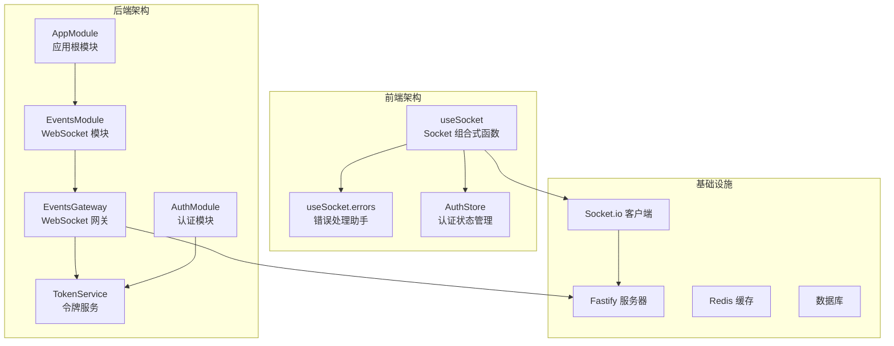
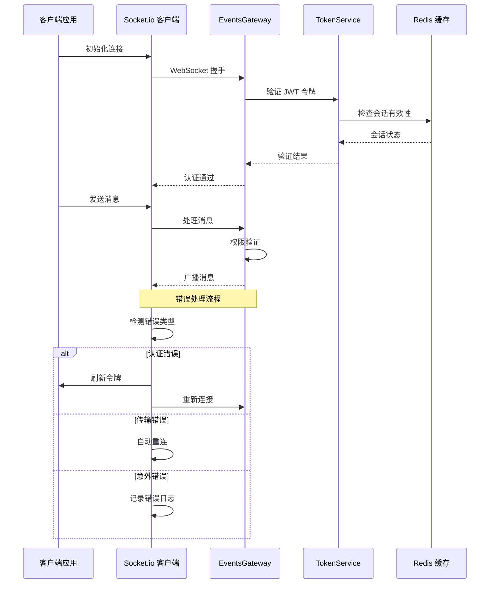
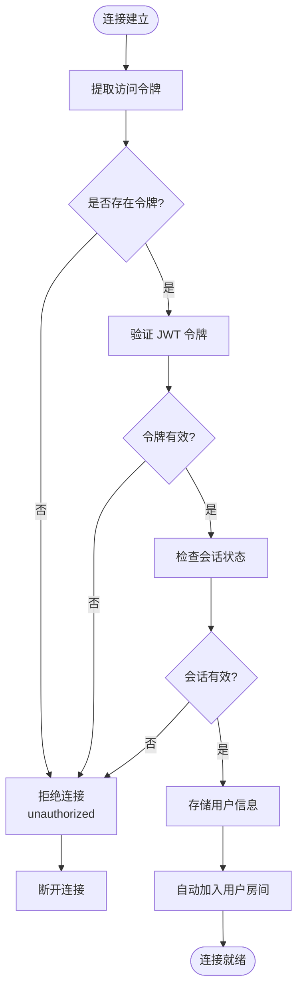
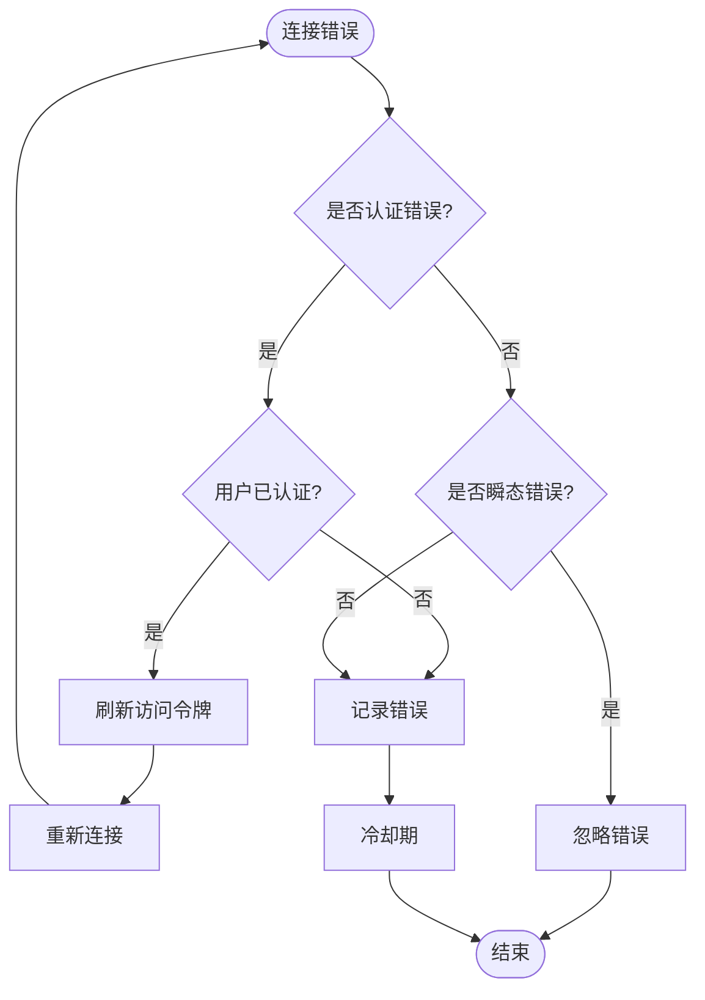
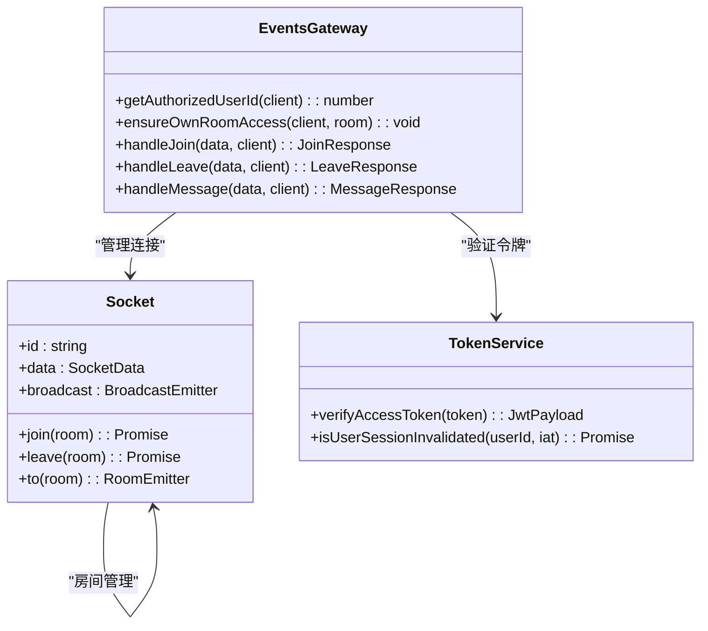
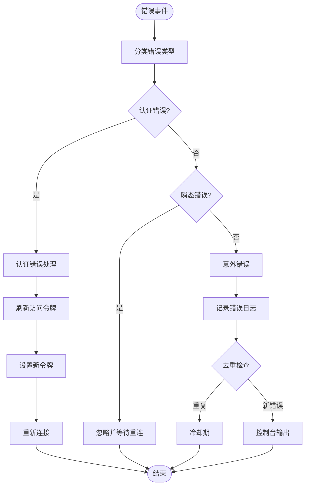
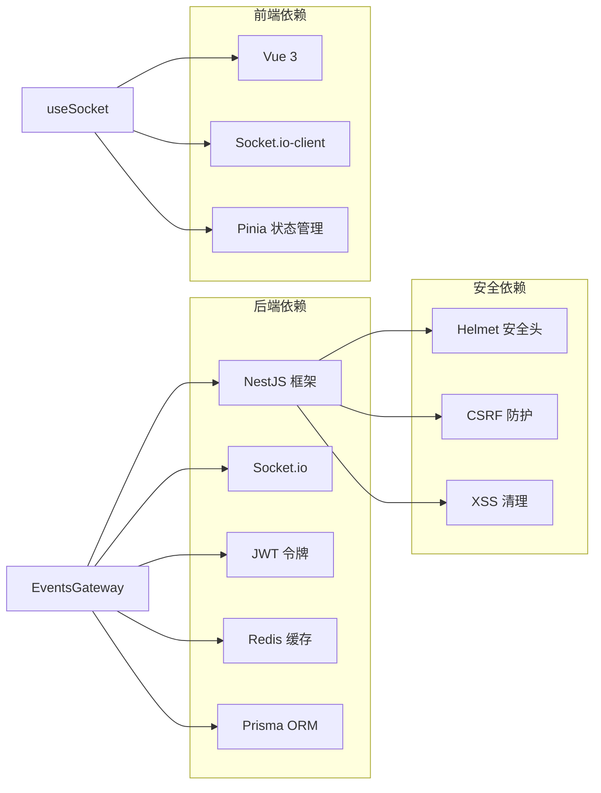
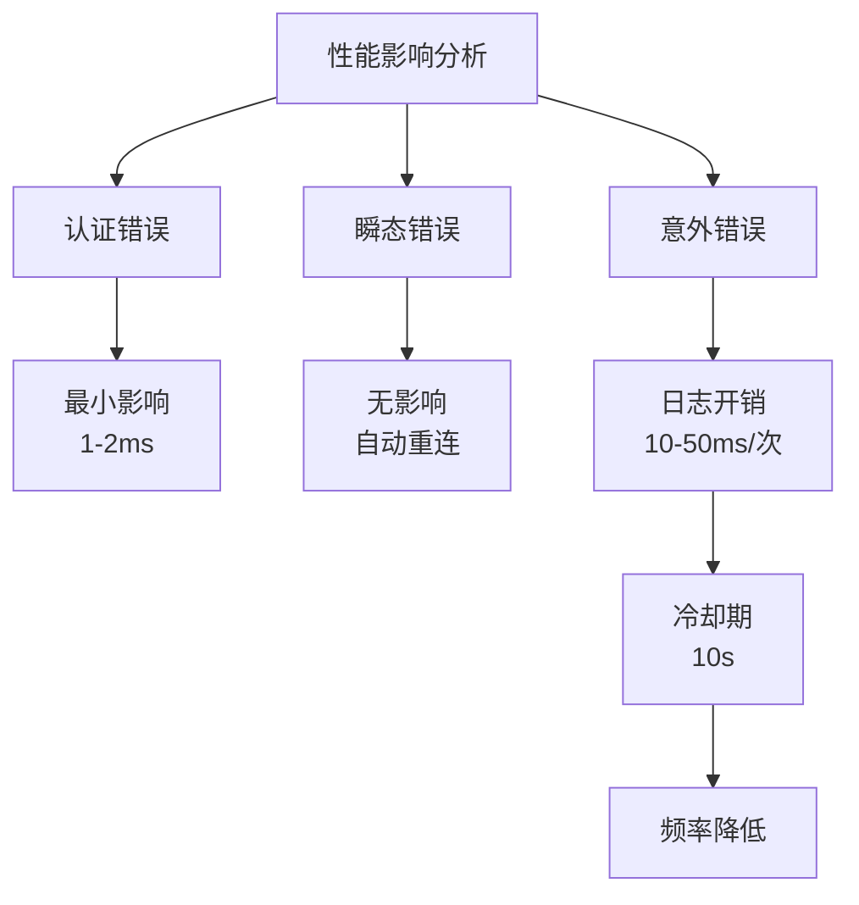

# WebSocket 错误处理增强

<cite>
**本文档引用的文件**
- [apps/backend/src/events/events.gateway.ts](file://apps/backend/src/events/events.gateway.ts)
- [apps/backend/src/events/events.module.ts](file://apps/backend/src/events/events.module.ts)
- [apps/frontend/src/composables/useSocket.ts](file://apps/frontend/src/composables/useSocket.ts)
- [apps/frontend/src/composables/useSocket.errors.ts](file://apps/frontend/src/composables/useSocket.errors.ts)
- [apps/backend/src/common/filters/all-exceptions.filter.ts](file://apps/backend/src/common/filters/all-exceptions.filter.ts)
- [apps/backend/src/main.ts](file://apps/backend/src/main.ts)
- [apps/backend/tests/events/events.gateway.spec.ts](file://apps/backend/tests/events/events.gateway.spec.ts)
- [apps/frontend/tests/composables/useSocket.errors.spec.ts](file://apps/frontend/tests/composables/useSocket.errors.spec.ts)
</cite>

## 目录
1. [简介](#简介)
2. [项目结构](#项目结构)
3. [核心组件](#核心组件)
4. [架构概览](#架构概览)
5. [详细组件分析](#详细组件分析)
6. [依赖关系分析](#依赖关系分析)
7. [性能考虑](#性能考虑)
8. [故障排除指南](#故障排除指南)
9. [结论](#结论)

## 简介

本文档详细分析了本项目中 WebSocket 错误处理的增强实现。项目采用 NestJS + Socket.io 架构，实现了前后端协同的完整错误处理机制。通过认证中间件、房间权限控制、传输层错误分类和自动重连策略，提供了健壮的实时通信解决方案。

该系统的核心特点包括：
- 基于 JWT 的多层认证机制
- 房间级别的权限控制
- 传输层错误的智能分类和处理
- 自动令牌刷新和重连机制
- 结构化的错误日志记录

## 项目结构

项目采用模块化架构，WebSocket 功能主要分布在以下目录：

**图表来源**
- [apps/backend/src/app.module.ts:28-155](file://apps/backend/src/app.module.ts#L28-L155)
- [apps/backend/src/events/events.module.ts:1-14](file://apps/backend/src/events/events.module.ts#L1-L14)

**章节来源**
- [apps/backend/src/app.module.ts:1-160](file://apps/backend/src/app.module.ts#L1-L160)
- [apps/backend/src/events/events.module.ts:1-14](file://apps/backend/src/events/events.module.ts#L1-L14)

## 核心组件

### 后端 WebSocket 网关

EventsGateway 是整个 WebSocket 系统的核心组件，负责处理所有实时通信逻辑。

**关键特性：**
- **认证中间件**：基于 JWT 的多层验证机制
- **房间权限控制**：确保用户只能访问自己的房间
- **CORS 配置**：灵活的安全策略配置
- **广播优化**：防抖机制减少重复广播

### 前端 Socket 组合式函数

useSocket 提供了完整的 Socket.io 客户端封装，实现了智能错误处理和自动重连。

**核心功能：**
- **错误类型识别**：区分认证错误和传输错误
- **自动令牌刷新**：无缝处理 JWT 过期
- **重连策略**：指数退避算法
- **连接状态管理**：实时连接状态跟踪

**章节来源**
- [apps/backend/src/events/events.gateway.ts:57-266](file://apps/backend/src/events/events.gateway.ts#L57-L266)
- [apps/frontend/src/composables/useSocket.ts:56-191](file://apps/frontend/src/composables/useSocket.ts#L56-L191)

## 架构概览

系统采用客户端-服务器对称架构，通过 Socket.io 实现实时双向通信：

**图表来源**
- [apps/backend/src/events/events.gateway.ts:86-145](file://apps/backend/src/events/events.gateway.ts#L86-L145)
- [apps/frontend/src/composables/useSocket.ts:93-108](file://apps/frontend/src/composables/useSocket.ts#L93-L108)

## 详细组件分析

### 认证与授权机制

#### 后端认证流程

**图表来源**
- [apps/backend/src/events/events.gateway.ts:89-115](file://apps/backend/src/events/events.gateway.ts#L89-L115)
- [apps/backend/src/events/events.gateway.ts:126-141](file://apps/backend/src/events/events.gateway.ts#L126-L141)

#### 前端错误处理策略

**图表来源**
- [apps/frontend/src/composables/useSocket.ts:93-108](file://apps/frontend/src/composables/useSocket.ts#L93-L108)
- [apps/frontend/src/composables/useSocket.errors.ts:8-32](file://apps/frontend/src/composables/useSocket.errors.ts#L8-L32)

**章节来源**
- [apps/backend/src/events/events.gateway.ts:68-84](file://apps/backend/src/events/events.gateway.ts#L68-L84)
- [apps/frontend/src/composables/useSocket.ts:32-51](file://apps/frontend/src/composables/useSocket.ts#L32-L51)

### 房间权限控制系统

系统实现了严格的房间访问控制，确保用户只能访问自己的专属房间：

**图表来源**
- [apps/backend/src/events/events.gateway.ts:68-84](file://apps/backend/src/events/events.gateway.ts#L68-L84)
- [apps/backend/src/events/events.gateway.ts:207-250](file://apps/backend/src/events/events.gateway.ts#L207-L250)

**章节来源**
- [apps/backend/src/events/events.gateway.ts:77-84](file://apps/backend/src/events/events.gateway.ts#L77-L84)
- [apps/backend/src/events/events.gateway.ts:207-226](file://apps/backend/src/events/events.gateway.ts#L207-L226)

### 错误分类与处理

#### 错误类型定义

系统将 WebSocket 错误分为三类：

1. **认证错误** (`unauthorized`, `token`, `jwt`, `authentication`)
2. **瞬态传输错误** (`timeout`, `transport close`, `transport error`, `websocket error`)
3. **意外错误** (其他所有错误)

#### 错误处理流程

**图表来源**
- [apps/frontend/src/composables/useSocket.errors.ts:8-32](file://apps/frontend/src/composables/useSocket.errors.ts#L8-L32)
- [apps/frontend/src/composables/useSocket.ts:93-108](file://apps/frontend/src/composables/useSocket.ts#L93-L108)

**章节来源**
- [apps/frontend/src/composables/useSocket.errors.ts:1-33](file://apps/frontend/src/composables/useSocket.errors.ts#L1-L33)
- [apps/frontend/src/composables/useSocket.ts:93-108](file://apps/frontend/src/composables/useSocket.ts#L93-L108)

## 依赖关系分析

系统的关键依赖关系如下：

**图表来源**
- [apps/backend/src/app.module.ts:134-146](file://apps/backend/src/app.module.ts#L134-L146)
- [apps/frontend/src/composables/useSocket.ts:1-8](file://apps/frontend/src/composables/useSocket.ts#L1-L8)

**章节来源**
- [apps/backend/src/main.ts:48-63](file://apps/backend/src/main.ts#L48-L63)
- [apps/backend/src/app.module.ts:134-146](file://apps/backend/src/app.module.ts#L134-L146)

## 性能考虑

### 连接池和资源管理

系统实现了多项性能优化措施：

1. **连接复用**：单例模式管理 Socket 实例
2. **内存泄漏防护**：自动清理定时器和事件监听器
3. **防抖机制**：广播操作的去重处理
4. **连接池优化**：合理的重连策略

### 错误处理性能影响

## 故障排除指南

### 常见问题诊断

#### 认证失败问题

**症状**：连接立即断开，错误信息包含 `unauthorized`

**诊断步骤**：
1. 检查 JWT 令牌格式和有效期
2. 验证 Redis 会话状态
3. 确认 CORS 配置正确

**解决方案**：
- 更新过期令牌
- 检查服务器时间同步
- 验证跨域配置

#### 房间访问被拒

**症状**：发送消息时抛出 `forbidden room` 异常

**诊断步骤**：
1. 验证用户 ID 和房间名称匹配
2. 检查用户房间加入状态
3. 确认权限验证逻辑

**解决方案**：
- 确保发送到正确的用户房间
- 检查房间名称格式
- 验证用户认证状态

#### 连接不稳定

**症状**：频繁断线和重连

**诊断步骤**：
1. 检查网络连接稳定性
2. 分析传输错误类型
3. 监控服务器负载

**解决方案**：
- 调整重连参数
- 优化服务器性能
- 检查防火墙配置

**章节来源**
- [apps/backend/tests/events/events.gateway.spec.ts:37-59](file://apps/backend/tests/events/events.gateway.spec.ts#L37-L59)
- [apps/frontend/tests/composables/useSocket.errors.spec.ts:4-17](file://apps/frontend/tests/composables/useSocket.errors.spec.ts#L4-L17)

## 结论

本项目的 WebSocket 错误处理增强方案实现了以下目标：

### 主要成就

1. **完整的认证体系**：多层 JWT 验证确保安全性
2. **智能错误分类**：自动识别和处理不同类型的错误
3. **无缝用户体验**：自动重连和令牌刷新机制
4. **健壮的权限控制**：房间级别的访问限制
5. **完善的监控机制**：详细的错误日志和去重处理

### 技术亮点

- **前后端协作**：客户端和服务端共同处理错误
- **可扩展性设计**：模块化架构便于功能扩展
- **性能优化**：防抖和去重机制提升系统效率
- **测试覆盖**：完整的单元测试确保代码质量

### 未来改进方向

1. **增强监控**：添加更详细的性能指标
2. **错误恢复**：实现更智能的错误恢复策略
3. **日志分析**：集成日志分析工具
4. **安全加固**：进一步强化安全防护机制

该实现为实时通信应用提供了可靠的错误处理基础，能够有效提升系统的稳定性和用户体验。