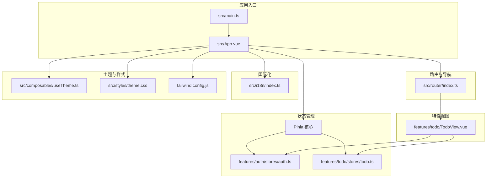
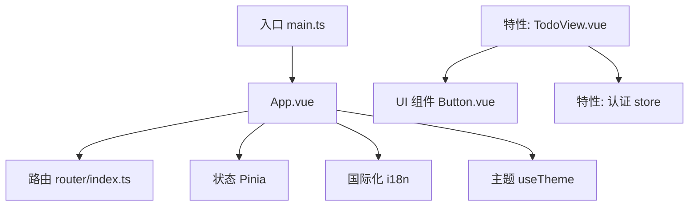
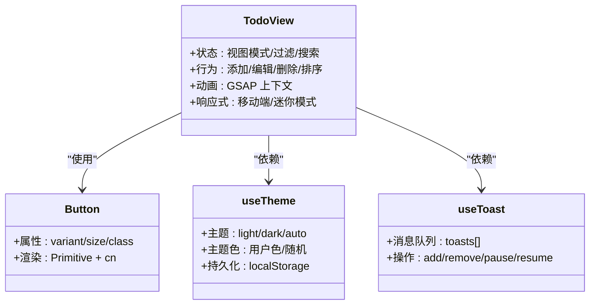
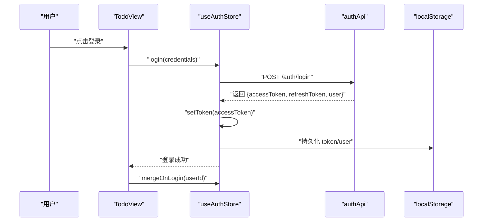
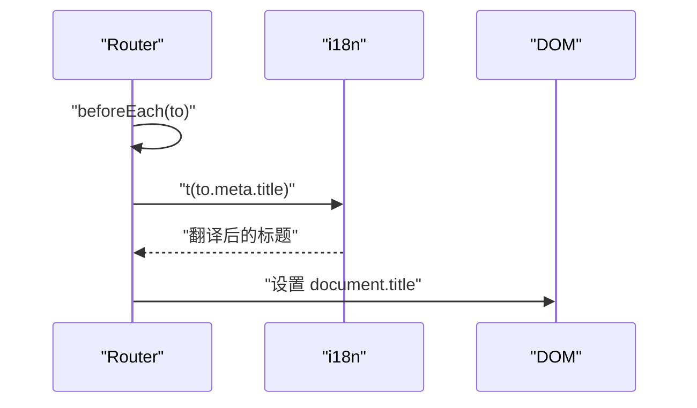
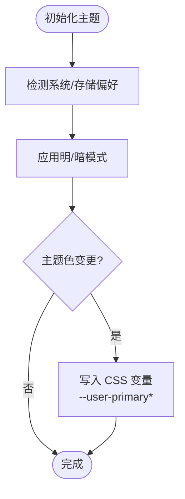
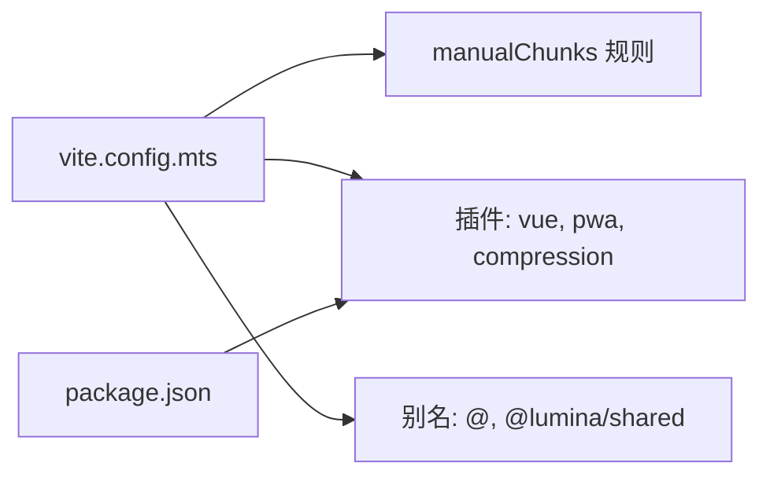

# 前端开发

<cite>
**本文引用的文件**   
- [apps/frontend/package.json](file://apps/frontend/package.json)
- [apps/frontend/vite.config.mts](file://apps/frontend/vite.config.mts)
- [apps/frontend/src/main.ts](file://apps/frontend/src/main.ts)
- [apps/frontend/src/router/index.ts](file://apps/frontend/src/router/index.ts)
- [apps/frontend/src/i18n/index.ts](file://apps/frontend/src/i18n/index.ts)
- [apps/frontend/src/App.vue](file://apps/frontend/src/App.vue)
- [apps/frontend/src/features/todo/stores/todo.ts](file://apps/frontend/src/features/todo/stores/todo.ts)
- [apps/frontend/src/features/auth/stores/auth.ts](file://apps/frontend/src/features/auth/stores/auth.ts)
- [apps/frontend/src/composables/useTheme.ts](file://apps/frontend/src/composables/useTheme.ts)
- [apps/frontend/src/composables/useToast.ts](file://apps/frontend/src/composables/useToast.ts)
- [apps/frontend/src/styles/theme.css](file://apps/frontend/src/styles/theme.css)
- [apps/frontend/tailwind.config.js](file://apps/frontend/tailwind.config.js)
- [apps/frontend/src/components/ui/button/Button.vue](file://apps/frontend/src/components/ui/button/Button.vue)
- [apps/frontend/src/features/todo/TodoView.vue](file://apps/frontend/src/features/todo/TodoView.vue)
- [apps/frontend/pwa-assets.config.ts](file://apps/frontend/pwa-assets.config.ts)
</cite>

## 目录
1. [简介](#简介)
2. [项目结构](#项目结构)
3. [核心组件](#核心组件)
4. [架构总览](#架构总览)
5. [组件详解](#组件详解)
6. [依赖关系分析](#依赖关系分析)
7. [性能考量](#性能考量)
8. [故障排查指南](#故障排查指南)
9. [结论](#结论)
10. [附录](#附录)

## 简介
本指南面向 Lumina Todo 前端团队与贡献者，系统讲解基于 Vue.js 3 + TypeScript + Vite 的现代前端技术栈在本项目中的落地实践。内容涵盖组件架构（功能组件、UI 组件、组合式函数）、状态管理（Pinia store 设计与持久化）、路由系统与页面导航、UI 组件库与自定义组件开发规范、响应式设计与主题系统、国际化（i18n）配置与使用、文件上传与图片处理、多媒体支持、性能优化与用户体验提升、移动端适配与 PWA 实现等。

## 项目结构
前端工程位于 apps/frontend，采用多特征域（feature-based）组织方式，按功能域划分 features（如 todo、auth、ai、mcp），并辅以通用层 components、composables、styles、router、i18n、services 等。Vite 作为构建工具，配合 Tailwind CSS 与自定义主题变量实现统一的设计系统；Pinia 负责状态管理，并通过持久化插件保障用户体验；Vue Router 提供页面级导航；i18n 支持中英双语；PWA 插件提供离线与安装能力。

**图表来源**
- [apps/frontend/src/main.ts:1-138](file://apps/frontend/src/main.ts#L1-L138)
- [apps/frontend/src/App.vue:1-77](file://apps/frontend/src/App.vue#L1-L77)
- [apps/frontend/src/router/index.ts:1-73](file://apps/frontend/src/router/index.ts#L1-L73)
- [apps/frontend/src/i18n/index.ts:1-37](file://apps/frontend/src/i18n/index.ts#L1-L37)
- [apps/frontend/src/composables/useTheme.ts:1-248](file://apps/frontend/src/composables/useTheme.ts#L1-L248)
- [apps/frontend/src/styles/theme.css:1-146](file://apps/frontend/src/styles/theme.css#L1-L146)
- [apps/frontend/tailwind.config.js:1-303](file://apps/frontend/tailwind.config.js#L1-L303)
- [apps/frontend/src/features/todo/TodoView.vue:1-466](file://apps/frontend/src/features/todo/TodoView.vue#L1-L466)
- [apps/frontend/src/features/todo/stores/todo.ts:1-3](file://apps/frontend/src/features/todo/stores/todo.ts#L1-L3)
- [apps/frontend/src/features/auth/stores/auth.ts:1-391](file://apps/frontend/src/features/auth/stores/auth.ts#L1-L391)

**章节来源**
- [apps/frontend/package.json:1-104](file://apps/frontend/package.json#L1-L104)
- [apps/frontend/vite.config.mts:1-185](file://apps/frontend/vite.config.mts#L1-L185)

## 核心组件
- 应用入口与全局配置：在入口文件中初始化 Pinia、Vue Query、i18n、ECharts、全局错误处理与 PWA 注册，挂载应用。
- 路由系统：基于 Vue Router，支持 History/Hash 模式（根据运行环境自动选择），并注入页面标题国际化。
- 状态管理：Pinia + 持久化插件，认证状态与待办状态分别封装在独立 store 中，支持跨页恢复。
- 主题系统：基于 CSS 变量与 useTheme 组合式函数，支持明暗模式与用户主题色（含随机模式）。
- 国际化：Vue i18n，支持 zh-CN/en-US，自动检测浏览器语言或本地存储偏好。
- UI 组件：基于 reka-ui 的 Button 等基础组件，结合 Tailwind CSS 实现一致的视觉与交互体验。
- 特性视图：TodoView 作为主界面，聚合搜索、过滤、列表/可视化/统计视图、AI 助手抽屉、番茄钟等模块。

**章节来源**
- [apps/frontend/src/main.ts:1-138](file://apps/frontend/src/main.ts#L1-L138)
- [apps/frontend/src/router/index.ts:1-73](file://apps/frontend/src/router/index.ts#L1-L73)
- [apps/frontend/src/features/auth/stores/auth.ts:1-391](file://apps/frontend/src/features/auth/stores/auth.ts#L1-L391)
- [apps/frontend/src/features/todo/stores/todo.ts:1-3](file://apps/frontend/src/features/todo/stores/todo.ts#L1-L3)
- [apps/frontend/src/composables/useTheme.ts:1-248](file://apps/frontend/src/composables/useTheme.ts#L1-L248)
- [apps/frontend/src/i18n/index.ts:1-37](file://apps/frontend/src/i18n/index.ts#L1-L37)
- [apps/frontend/src/components/ui/button/Button.vue:1-32](file://apps/frontend/src/components/ui/button/Button.vue#L1-L32)
- [apps/frontend/src/features/todo/TodoView.vue:1-466](file://apps/frontend/src/features/todo/TodoView.vue#L1-L466)

## 架构总览
前端采用“入口装配 + 特性域 + 通用层”的分层架构：
- 入口装配：main.ts 负责依赖注入、全局错误处理、插件注册与应用挂载。
- 特性域：features 下按业务拆分（auth、todo、ai、mcp），每个域包含 api、stores、components、views、composables 等子目录。
- 通用层：components（UI 组件与可复用容器）、composables（组合式函数）、styles（主题与样式）、router、i18n、services 等。

**图表来源**
- [apps/frontend/src/main.ts:1-138](file://apps/frontend/src/main.ts#L1-L138)
- [apps/frontend/src/App.vue:1-77](file://apps/frontend/src/App.vue#L1-L77)
- [apps/frontend/src/router/index.ts:1-73](file://apps/frontend/src/router/index.ts#L1-L73)
- [apps/frontend/src/i18n/index.ts:1-37](file://apps/frontend/src/i18n/index.ts#L1-L37)
- [apps/frontend/src/composables/useTheme.ts:1-248](file://apps/frontend/src/composables/useTheme.ts#L1-L248)
- [apps/frontend/src/components/ui/button/Button.vue:1-32](file://apps/frontend/src/components/ui/button/Button.vue#L1-L32)
- [apps/frontend/src/features/todo/TodoView.vue:1-466](file://apps/frontend/src/features/todo/TodoView.vue#L1-L466)
- [apps/frontend/src/features/auth/stores/auth.ts:1-391](file://apps/frontend/src/features/auth/stores/auth.ts#L1-L391)

## 组件详解

### 组件架构设计
- 功能组件：TodoView 聚合多个子组件（头部、输入、过滤、搜索、列表/可视化/统计、AI 抽屉、番茄钟），通过组合式函数 useTodo、GSAP 动画上下文、响应式布局实现复杂交互。
- UI 组件：Button.vue 基于 reka-ui 的 Primitive 与 variants，通过 cn 工具类合并样式，遵循设计系统。
- 组合式函数：useTheme、useToast、useWindowSize、useSmartScroll、useRequest 等，封装横切关注点，提高复用性与可测试性。

**图表来源**
- [apps/frontend/src/features/todo/TodoView.vue:1-466](file://apps/frontend/src/features/todo/TodoView.vue#L1-L466)
- [apps/frontend/src/components/ui/button/Button.vue:1-32](file://apps/frontend/src/components/ui/button/Button.vue#L1-L32)
- [apps/frontend/src/composables/useTheme.ts:1-248](file://apps/frontend/src/composables/useTheme.ts#L1-L248)
- [apps/frontend/src/composables/useToast.ts:1-87](file://apps/frontend/src/composables/useToast.ts#L1-L87)

**章节来源**
- [apps/frontend/src/features/todo/TodoView.vue:1-466](file://apps/frontend/src/features/todo/TodoView.vue#L1-L466)
- [apps/frontend/src/components/ui/button/Button.vue:1-32](file://apps/frontend/src/components/ui/button/Button.vue#L1-L32)
- [apps/frontend/src/composables/useTheme.ts:1-248](file://apps/frontend/src/composables/useTheme.ts#L1-L248)
- [apps/frontend/src/composables/useToast.ts:1-87](file://apps/frontend/src/composables/useToast.ts#L1-L87)

### 状态管理策略（Pinia）
- 认证状态（auth store）：集中管理 token、refreshToken、user、loading、error、fieldErrors，提供登录、注册、忘记/重置密码、刷新令牌、登出、获取当前用户等方法，并通过持久化插件将关键字段写入 localStorage。
- 待办状态（todo store）：对外导出 useTodoStore 与类型定义，负责待办数据获取、变更预览、冲突处理、WebSocket 监听初始化等。
- 共享策略：store 内部通过懒加载 import 避免循环依赖；持久化 pick 指定字段，减少存储体积。

**图表来源**
- [apps/frontend/src/features/auth/stores/auth.ts:148-179](file://apps/frontend/src/features/auth/stores/auth.ts#L148-L179)
- [apps/frontend/src/features/todo/stores/todo.ts:1-3](file://apps/frontend/src/features/todo/stores/todo.ts#L1-L3)

**章节来源**
- [apps/frontend/src/features/auth/stores/auth.ts:1-391](file://apps/frontend/src/features/auth/stores/auth.ts#L1-L391)
- [apps/frontend/src/features/todo/stores/todo.ts:1-3](file://apps/frontend/src/features/todo/stores/todo.ts#L1-L3)

### 路由系统与页面导航
- 路由历史模式：根据 IS_WAILS 环境变量选择 Hash 或 History 模式，保证桌面端与 Web 端一致性。
- 页面标题国际化：beforeEach 中读取路由 meta.title，结合 i18n.global.t 动态设置 document.title。
- 路由守卫：可扩展鉴权、埋点、权限校验等逻辑。

**图表来源**
- [apps/frontend/src/router/index.ts:56-70](file://apps/frontend/src/router/index.ts#L56-L70)
- [apps/frontend/src/i18n/index.ts:24-34](file://apps/frontend/src/i18n/index.ts#L24-L34)

**章节来源**
- [apps/frontend/src/router/index.ts:1-73](file://apps/frontend/src/router/index.ts#L1-L73)
- [apps/frontend/src/i18n/index.ts:1-37](file://apps/frontend/src/i18n/index.ts#L1-L37)

### UI 组件库与自定义组件开发规范
- 基础组件：Button.vue 通过 Primitive + variants + cn 合并样式，支持 variant/size/class 扩展。
- 设计系统：Tailwind 配置映射 CSS 变量，提供 colors、fontFamily、borderRadius、boxShadow、spacing、animation 等扩展，确保风格一致。
- 自定义组件：建议遵循“最小职责”原则，通过 props/events/expose 暴露接口，内部使用组合式函数解耦逻辑。

**章节来源**
- [apps/frontend/src/components/ui/button/Button.vue:1-32](file://apps/frontend/src/components/ui/button/Button.vue#L1-L32)
- [apps/frontend/tailwind.config.js:1-303](file://apps/frontend/tailwind.config.js#L1-L303)

### 响应式设计与主题系统
- 主题变量：theme.css 定义大量 CSS 变量，区分明/暗两套值，支持用户主题色覆盖与随机模式。
- 主题控制：useTheme 基于 @vueuse/core 的 useColorMode 与 useStorage，watch 主题色变化并动态写入 CSS 变量。
- 移动端适配：TodoView 中使用响应式断点与 isMobile 切换布局，配合 Tailwind 屏幕断点与安全区域变量。

**图表来源**
- [apps/frontend/src/composables/useTheme.ts:188-247](file://apps/frontend/src/composables/useTheme.ts#L188-L247)
- [apps/frontend/src/styles/theme.css:1-146](file://apps/frontend/src/styles/theme.css#L1-L146)

**章节来源**
- [apps/frontend/src/composables/useTheme.ts:1-248](file://apps/frontend/src/composables/useTheme.ts#L1-L248)
- [apps/frontend/src/styles/theme.css:1-146](file://apps/frontend/src/styles/theme.css#L1-L146)
- [apps/frontend/tailwind.config.js:1-303](file://apps/frontend/tailwind.config.js#L1-L303)

### 国际化（i18n）配置与使用
- 配置：createI18n 支持 zh-CN/en-US，fallbackLocale 为 zh-CN；locale 默认来自 localStorage 或浏览器语言。
- 类型：通过 DeepStringify 生成 MessageSchema，确保编译期类型安全。
- 页面标题：路由 beforeEach 中读取 meta.title 并进行翻译，统一设置页面标题。

**章节来源**
- [apps/frontend/src/i18n/index.ts:1-37](file://apps/frontend/src/i18n/index.ts#L1-L37)
- [apps/frontend/src/router/index.ts:56-70](file://apps/frontend/src/router/index.ts#L56-L70)

### 文件上传、图片处理与多媒体支持
- 上传模块：apps/backend/apps/backend/src/upload 提供文件解析与存储服务；前端通过 api/upload.ts 与后端交互。
- 图片处理：项目引入 highlight.js、katex、mermaid、three.js、vue-echarts 等，支持富文本、公式、流程图、3D 场景与图表渲染。
- 多媒体：GSAP 用于动画，Canvas Confetti 用于庆祝效果，Socket.IO 用于实时通信。

**章节来源**
- [apps/frontend/package.json:30-69](file://apps/frontend/package.json#L30-L69)
- [apps/frontend/src/main.ts:14-25](file://apps/frontend/src/main.ts#L14-L25)

### PWA 与移动端适配
- PWA：VitePWA 插件启用 autoUpdate、devOptions、manifest 与图标资源清单，支持安装与离线缓存。
- 移动端：TodoView 与 useWindowSize 结合，针对移动端调整布局与交互；Wails 模式下通过 HashHistory 与拖拽区域适配。

**章节来源**
- [apps/frontend/vite.config.mts:104-146](file://apps/frontend/vite.config.mts#L104-L146)
- [apps/frontend/src/App.vue:17-27](file://apps/frontend/src/App.vue#L17-L27)
- [apps/frontend/src/router/index.ts:8-10](file://apps/frontend/src/router/index.ts#L8-L10)

## 依赖关系分析
- 构建与打包：Vite 配置按依赖类型拆分 chunk，启用 gzip/brotli 压缩，设置别名与代理，支持 Wails 与 PWA 开发模式。
- 运行时依赖：Vue 3、Pinia、Vue Router、Vue i18n、@tanstack/vue-query、reka-ui、Tailwind CSS、GSAP、mermaid、echarts、socket.io-client 等。
- 开发依赖：@vitejs/plugin-vue、vite-plugin-pwa、tailwindcss、typescript、vitest、eslint 等。

**图表来源**
- [apps/frontend/vite.config.mts:23-78](file://apps/frontend/vite.config.mts#L23-L78)
- [apps/frontend/vite.config.mts:86-146](file://apps/frontend/vite.config.mts#L86-L146)
- [apps/frontend/package.json:30-69](file://apps/frontend/package.json#L30-L69)

**章节来源**
- [apps/frontend/vite.config.mts:1-185](file://apps/frontend/vite.config.mts#L1-L185)
- [apps/frontend/package.json:1-104](file://apps/frontend/package.json#L1-L104)

## 性能考量
- 代码分割：按依赖类型拆分 vendor chunk，减少重复与首屏体积。
- 缓存与压缩：启用 gzip/brotli 压缩，合理设置 staleTime 与 retry，降低网络压力。
- 动画与渲染：GSAP 动画使用 ctx 自动清理，避免内存泄漏；Tailwind 提供 will-change/transform 优化；禁用全局过渡元素排除 canvas/echarts。
- 错误恢复：入口统一捕获动态模块加载错误与 Promise 拒绝，限制刷新频率，提升稳定性。

**章节来源**
- [apps/frontend/vite.config.mts:23-78](file://apps/frontend/vite.config.mts#L23-L78)
- [apps/frontend/src/main.ts:59-113](file://apps/frontend/src/main.ts#L59-L113)
- [apps/frontend/src/styles/theme.css:120-144](file://apps/frontend/src/styles/theme.css#L120-L144)

## 故障排查指南
- 动态模块加载失败：入口中 handleChunkError 会识别并尝试自动刷新，若频繁报错需检查部署与缓存策略。
- ResizeObserver 错误：全局忽略该类良性错误，避免控制台噪音影响调试。
- 路由标题异常：确认路由 meta.title 是否存在对应 i18n 键，以及 i18n 初始化顺序。
- 主题色不生效：检查 useTheme 是否正确写入 CSS 变量，确认 theme-color 存储值格式是否合法。
- Toast 消失异常：确认 addToast 的 duration 与 pause/resume 时机，避免计时器泄漏。

**章节来源**
- [apps/frontend/src/main.ts:59-113](file://apps/frontend/src/main.ts#L59-L113)
- [apps/frontend/src/router/index.ts:56-70](file://apps/frontend/src/router/index.ts#L56-L70)
- [apps/frontend/src/composables/useTheme.ts:132-186](file://apps/frontend/src/composables/useTheme.ts#L132-L186)
- [apps/frontend/src/composables/useToast.ts:17-87](file://apps/frontend/src/composables/useToast.ts#L17-L87)

## 结论
本项目以 Vue 3 + TypeScript + Vite 为基础，结合 Pinia、Vue Router、i18n、Tailwind CSS、PWA 等生态工具，构建了可维护、可扩展、具备良好用户体验的前端架构。通过特性域划分、组合式函数封装、主题与国际化体系、完善的错误处理与性能优化策略，能够支撑 Lumina Todo 的持续演进与高质量交付。

## 附录
- PWA 图标生成：pwa-assets-generator 配置与 public/logo.png 对齐，便于生成多尺寸图标。
- 本地开发：Vite 代理指向后端服务，支持 WebSocket 代理与超时配置；Docker 环境下 host 设置为 0.0.0.0。

**章节来源**
- [apps/frontend/pwa-assets.config.ts:1-7](file://apps/frontend/pwa-assets.config.ts#L1-L7)
- [apps/frontend/vite.config.mts:154-174](file://apps/frontend/vite.config.mts#L154-L174)