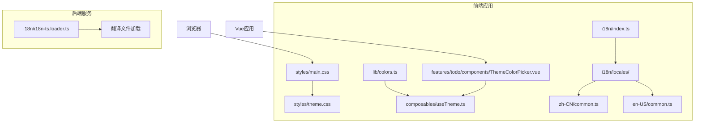
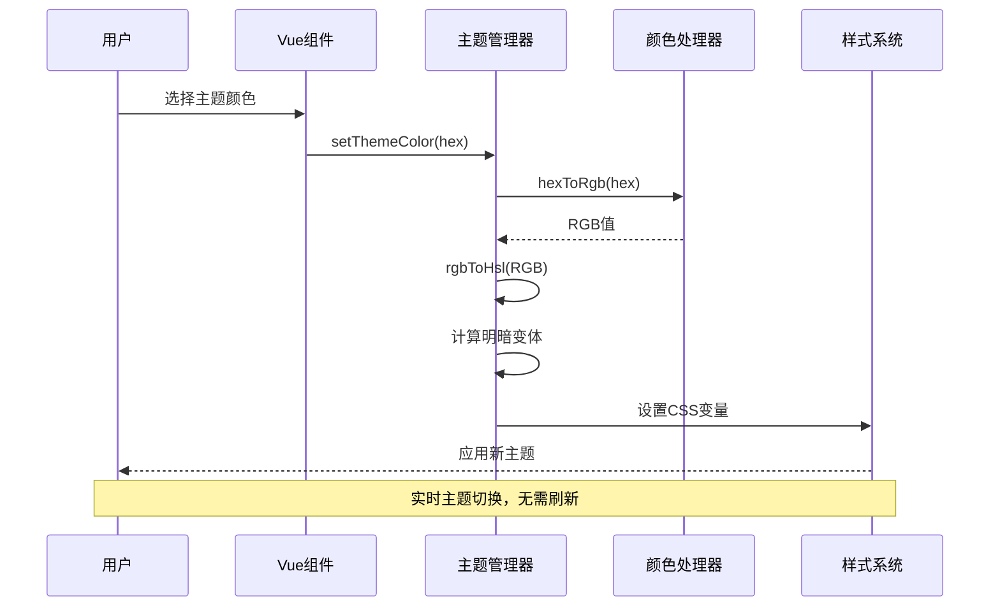
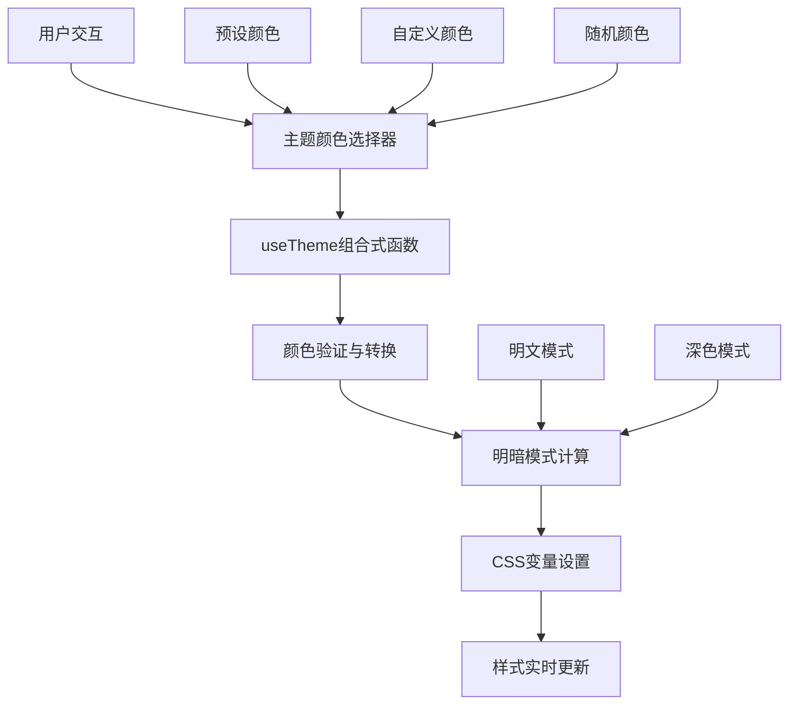
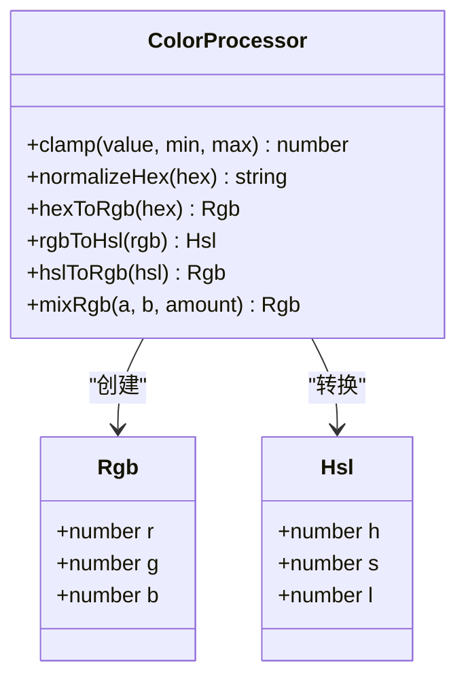
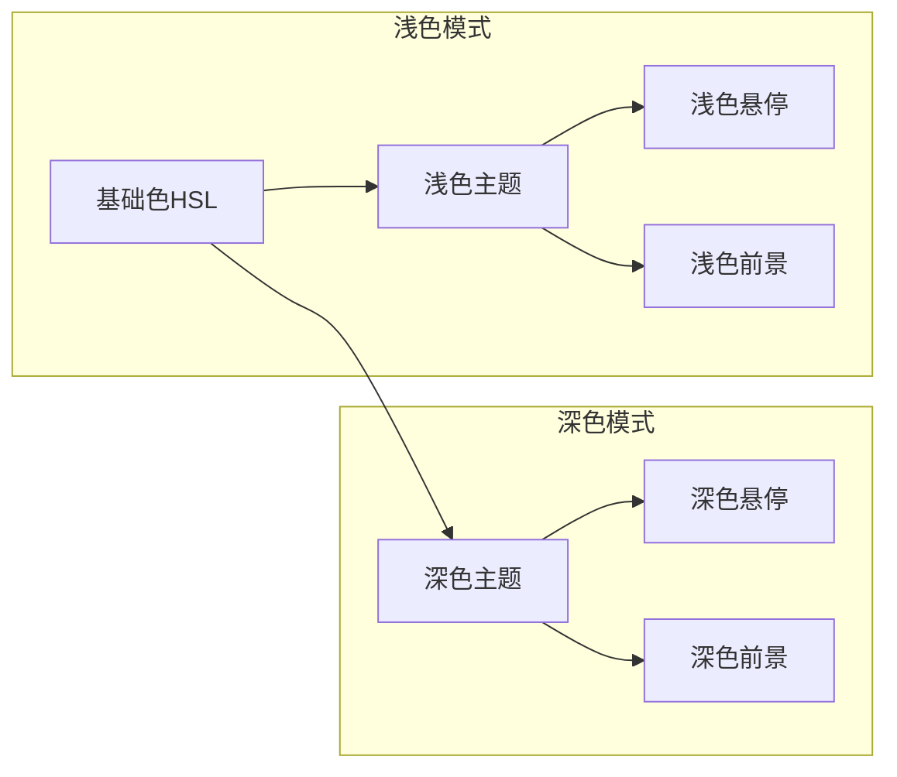
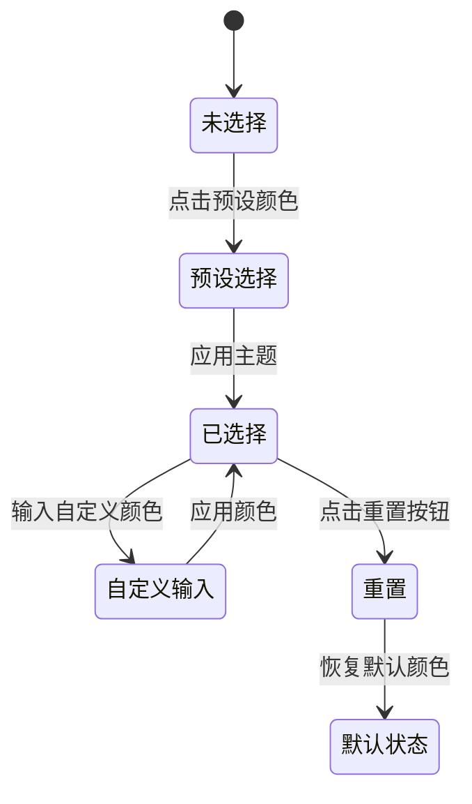
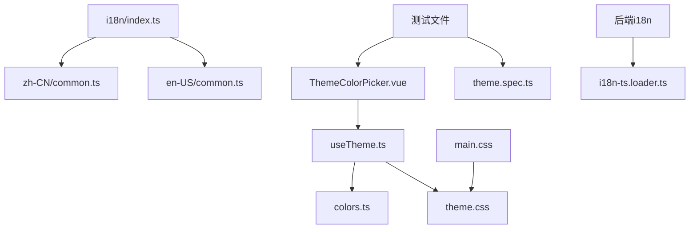

# 主题颜色本地化支持

<cite>
**本文档引用的文件**
- [colors.ts](file://apps/frontend/src/lib/colors.ts)
- [theme.css](file://apps/frontend/src/styles/theme.css)
- [useTheme.ts](file://apps/frontend/src/composables/useTheme.ts)
- [index.ts](file://apps/frontend/src/i18n/index.ts)
- [ThemeColorPicker.vue](file://apps/frontend/src/features/todo/components/ThemeColorPicker.vue)
- [common.ts (中文)](file://apps/frontend/src/i18n/locales/zh-CN/common.ts)
- [common.ts (英文)](file://apps/frontend/src/i18n/locales/en-US/common.ts)
- [i18n-ts.loader.ts](file://apps/backend/src/i18n/i18n-ts.loader.ts)
- [main.css](file://apps/frontend/src/styles/main.css)
- [ThemeColorPicker.spec.ts](file://apps/frontend/tests/features/todo/components/ThemeColorPicker.spec.ts)
- [theme.spec.ts](file://apps/frontend/tests/styles/theme.spec.ts)
</cite>

## 目录
1. [简介](#简介)
2. [项目结构](#项目结构)
3. [核心组件](#核心组件)
4. [架构概览](#架构概览)
5. [详细组件分析](#详细组件分析)
6. [依赖关系分析](#依赖关系分析)
7. [性能考虑](#性能考虑)
8. [故障排除指南](#故障排除指南)
9. [结论](#结论)

## 简介

本文档详细分析了Todo项目中的主题颜色本地化支持功能。该项目实现了完整的多语言主题颜色系统，包括CSS自定义属性、JavaScript主题管理、国际化支持以及响应式设计。系统支持中英文双语界面，提供多种预设主题颜色，并允许用户自定义颜色选择。

该功能的核心价值在于为用户提供个性化的视觉体验，同时确保在不同语言环境下的一致性和可访问性。通过CSS变量和JavaScript动态计算，系统能够智能生成主题色及其变体，包括悬停状态和明暗模式下的颜色调整。

## 项目结构

项目采用前后端分离架构，主题颜色功能主要集中在前端应用中实现：

**图表来源**
- [main.css:1-7](file://apps/frontend/src/styles/main.css#L1-L7)
- [useTheme.ts:1-369](file://apps/frontend/src/composables/useTheme.ts#L1-L369)
- [ThemeColorPicker.vue:1-190](file://apps/frontend/src/features/todo/components/ThemeColorPicker.vue#L1-L190)

**章节来源**
- [main.css:1-7](file://apps/frontend/src/styles/main.css#L1-L7)
- [index.ts:1-37](file://apps/frontend/src/i18n/index.ts#L1-L37)

## 核心组件

### 颜色处理库

颜色处理库提供了完整的色彩空间转换和颜色混合功能：

- **RGB/HSL转换**：支持十六进制到RGB的转换，以及RGB到HSL的转换
- **颜色混合**：提供RGB颜色混合算法，用于生成主题色变体
- **CSS变量操作**：封装了CSS自定义属性的获取和设置方法
- **颜色验证**：包含十六进制颜色格式验证和范围限制

### 主题管理系统

主题管理系统是整个功能的核心，负责：

- **主题预设管理**：定义了9种预设主题颜色，包括青瓷、薄雾、苔青等
- **动态颜色应用**：根据用户选择的颜色动态生成CSS变量
- **明暗模式适配**：为浅色和深色模式分别生成合适的颜色变体
- **可访问性保证**：确保文本颜色与背景颜色有足够的对比度

### 国际化支持

系统实现了完整的多语言支持：

- **语言检测**：自动检测浏览器语言偏好，优先中文，否则英文
- **翻译键值**：为主题颜色相关的UI元素提供翻译键值
- **动态语言切换**：支持运行时语言切换而无需刷新页面

**章节来源**
- [colors.ts:1-96](file://apps/frontend/src/lib/colors.ts#L1-L96)
- [useTheme.ts:56-66](file://apps/frontend/src/composables/useTheme.ts#L56-L66)
- [index.ts:12-20](file://apps/frontend/src/i18n/index.ts#L12-L20)

## 架构概览

系统采用分层架构设计，各组件职责明确：

**图表来源**
- [ThemeColorPicker.vue:45-55](file://apps/frontend/src/features/todo/components/ThemeColorPicker.vue#L45-L55)
- [useTheme.ts:237-306](file://apps/frontend/src/composables/useTheme.ts#L237-L306)
- [colors.ts:77-89](file://apps/frontend/src/lib/colors.ts#L77-L89)

### 数据流分析

**图表来源**
- [ThemeColorPicker.vue:30-37](file://apps/frontend/src/features/todo/components/ThemeColorPicker.vue#L30-L37)
- [useTheme.ts:332-346](file://apps/frontend/src/composables/useTheme.ts#L332-L346)

## 详细组件分析

### 颜色处理模块

颜色处理模块提供了基础的颜色操作能力：

#### 核心功能特性

- **格式支持**：支持十六进制、RGB、HSL等多种颜色格式
- **范围验证**：自动限制数值范围，确保颜色值的有效性
- **精度控制**：提供颜色值的四舍五入和精度控制
- **性能优化**：使用高效的数学算法进行颜色转换

#### 关键算法实现

**图表来源**
- [colors.ts:1-96](file://apps/frontend/src/lib/colors.ts#L1-L96)

**章节来源**
- [colors.ts:77-89](file://apps/frontend/src/lib/colors.ts#L77-L89)
- [colors.ts:91-124](file://apps/frontend/src/lib/colors.ts#L91-L124)

### 主题管理组合式函数

useTheme组合式函数是系统的核心，提供了完整的主题管理功能：

#### 主题预设系统

系统内置了9种精心设计的主题预设：

| 预设名称 | 颜色值 | 特性描述 |
|---------|--------|----------|
| celadon | #78958e | 青瓷绿，推荐使用 |
| twilightAmber | #9b8574 | 暮色琥珀，温暖色调 |
| mistBlue | #728ba1 | 薄雾蓝，冷色调 |
| mossGreen | #7c9585 | 苔藓绿，自然风格 |
| lilacGray | #948ac0 | 丁香灰，优雅紫色 |
| sunsetRose | #ae8792 | 晚霞玫瑰，暖粉色 |
| graphite | #647587 | 石墨灰，现代简约 |
| indigo | #4f6284 | 靛青蓝，深邃色彩 |
| random | random | 随机模式 |

#### 明暗模式适配

系统为每种预设都提供了明暗两种模式的适配：

**图表来源**
- [useTheme.ts:269-303](file://apps/frontend/src/composables/useTheme.ts#L269-L303)

**章节来源**
- [useTheme.ts:56-66](file://apps/frontend/src/composables/useTheme.ts#L56-L66)
- [useTheme.ts:237-306](file://apps/frontend/src/composables/useTheme.ts#L237-L306)

### 主题颜色选择器组件

主题颜色选择器是一个功能完整的Vue组件，提供了直观的颜色选择界面：

#### 组件功能特性

- **预设颜色展示**：网格布局展示所有可用的预设颜色
- **自定义颜色输入**：支持颜色选择器和文本输入两种方式
- **实时预览**：显示当前选中的颜色效果
- **推荐标识**：突出显示推荐的预设颜色
- **重置功能**：一键恢复到默认主题颜色

#### 用户交互流程

**图表来源**
- [ThemeColorPicker.vue:45-55](file://apps/frontend/src/features/todo/components/ThemeColorPicker.vue#L45-L55)

**章节来源**
- [ThemeColorPicker.vue:102-159](file://apps/frontend/src/features/todo/components/ThemeColorPicker.vue#L102-L159)
- [ThemeColorPicker.vue:161-181](file://apps/frontend/src/features/todo/components/ThemeColorPicker.vue#L161-L181)

### 国际化集成

系统实现了完整的多语言支持，主题颜色相关的UI元素都有对应的翻译：

#### 中文翻译键值

| 键值 | 翻译内容 |
|------|----------|
| common.themeColor.label | 主题色 |
| common.themeColor.desc | 选择经典配色，或使用调色盘自定义 |
| common.themeColor.reset | 恢复默认 |
| common.themeColor.custom | 自定义 |
| common.themeColor.recommended | 推荐 |
| common.themeColor.recommendedShort | 优选 |

#### 英文翻译键值

| 键值 | 翻译内容 |
|------|----------|
| common.themeColor.label | Theme Color |
| common.themeColor.desc | Pick a classic palette or choose a custom color |
| common.themeColor.reset | Reset to default |
| common.themeColor.custom | Custom |
| common.themeColor.recommended | Recommended |
| common.themeColor.recommendedShort | Curated |

**章节来源**
- [common.ts (中文):54-72](file://apps/frontend/src/i18n/locales/zh-CN/common.ts#L54-L72)
- [common.ts (英文):54-72](file://apps/frontend/src/i18n/locales/en-US/common.ts#L54-L72)

## 依赖关系分析

系统各组件之间的依赖关系清晰明确：

**图表来源**
- [ThemeColorPicker.vue:6](file://apps/frontend/src/features/todo/components/ThemeColorPicker.vue#L6)
- [useTheme.ts:1](file://apps/frontend/src/composables/useTheme.ts#L1)
- [main.css:2](file://apps/frontend/src/styles/main.css#L2)

### 组件耦合度分析

- **低耦合高内聚**：每个组件职责单一，通过明确的接口进行通信
- **数据流单向**：从用户交互到状态管理再到样式更新，数据流向清晰
- **可测试性强**：组件间依赖通过依赖注入实现，便于单元测试

**章节来源**
- [ThemeColorPicker.vue:1-10](file://apps/frontend/src/features/todo/components/ThemeColorPicker.vue#L1-L10)
- [useTheme.ts:1-369](file://apps/frontend/src/composables/useTheme.ts#L1-L369)

## 性能考虑

系统在设计时充分考虑了性能优化：

### 样式性能优化

- **CSS变量缓存**：通过CSS变量避免重复的样式计算
- **硬件加速**：利用transform和opacity属性启用GPU加速
- **过渡动画**：使用cubic-bezier曲线优化动画流畅度

### JavaScript性能优化

- **防抖处理**：颜色变化事件经过防抖处理，避免频繁更新
- **内存管理**：及时清理定时器和事件监听器
- **懒加载**：主题颜色选择器按需加载，减少初始包大小

### 缓存策略

- **本地存储**：用户偏好的主题颜色保存在localStorage中
- **预计算缓存**：颜色转换结果进行缓存，避免重复计算
- **样式缓存**：已应用的CSS变量缓存，提高更新效率

## 故障排除指南

### 常见问题及解决方案

#### 主题颜色不生效

**问题描述**：用户选择了新的主题颜色，但界面没有变化

**可能原因**：
1. 浏览器不支持CSS变量
2. 样式文件加载失败
3. JavaScript执行错误

**解决步骤**：
1. 检查浏览器开发者工具的Console是否有错误信息
2. 验证theme.css文件是否正确加载
3. 确认useTheme组合式函数正常工作

#### 颜色格式无效

**问题描述**：用户输入的颜色值无法被识别

**可能原因**：
1. 颜色格式不符合要求
2. 数值超出有效范围

**解决步骤**：
1. 确认颜色值为有效的十六进制格式（#RRGGBB）
2. 检查RGB数值是否在0-255范围内
3. 验证HSL数值的有效性

#### 国际化显示异常

**问题描述**：主题颜色相关的UI文本显示为键值而非翻译

**可能原因**：
1. 翻译文件加载失败
2. 语言检测逻辑错误
3. i18n配置问题

**解决步骤**：
1. 检查翻译文件是否存在且格式正确
2. 验证getDefaultLocale函数的返回值
3. 确认i18n实例的初始化配置

**章节来源**
- [ThemeColorPicker.spec.ts:42-76](file://apps/frontend/tests/features/todo/components/ThemeColorPicker.spec.ts#L42-L76)
- [theme.spec.ts:7-19](file://apps/frontend/tests/styles/theme.spec.ts#L7-L19)

## 结论

Todo项目的主题颜色本地化支持功能展现了现代Web应用的最佳实践：

### 技术亮点

1. **完整的多语言支持**：实现了中英文双语界面，包括主题颜色相关的完整翻译
2. **灵活的主题系统**：支持9种预设颜色和自定义颜色，满足不同用户的个性化需求
3. **智能的颜色处理**：通过数学算法确保颜色的可访问性和视觉一致性
4. **优秀的用户体验**：提供直观的颜色选择界面和实时预览功能

### 架构优势

- **模块化设计**：各功能模块职责明确，便于维护和扩展
- **性能优化**：通过多种技术手段确保系统的高性能运行
- **可测试性**：完善的测试覆盖，保证代码质量

### 改进建议

1. **移动端优化**：可以进一步优化移动端的颜色选择体验
2. **无障碍支持**：增加更多的无障碍功能支持
3. **主题导入导出**：考虑添加主题分享和导入导出功能

该功能为用户提供了丰富而个性化的视觉体验，同时保持了系统的稳定性和可维护性，是现代Web应用主题系统设计的优秀范例。