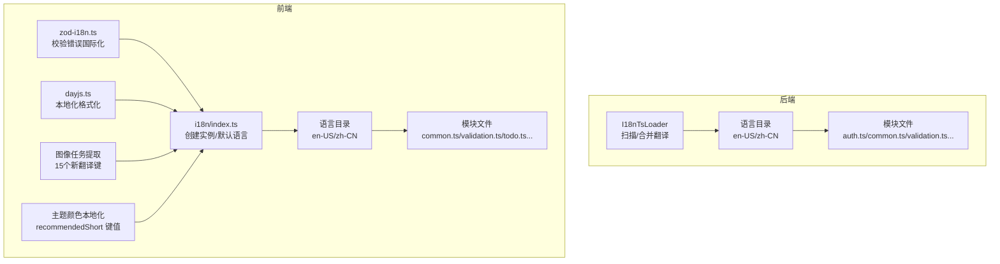
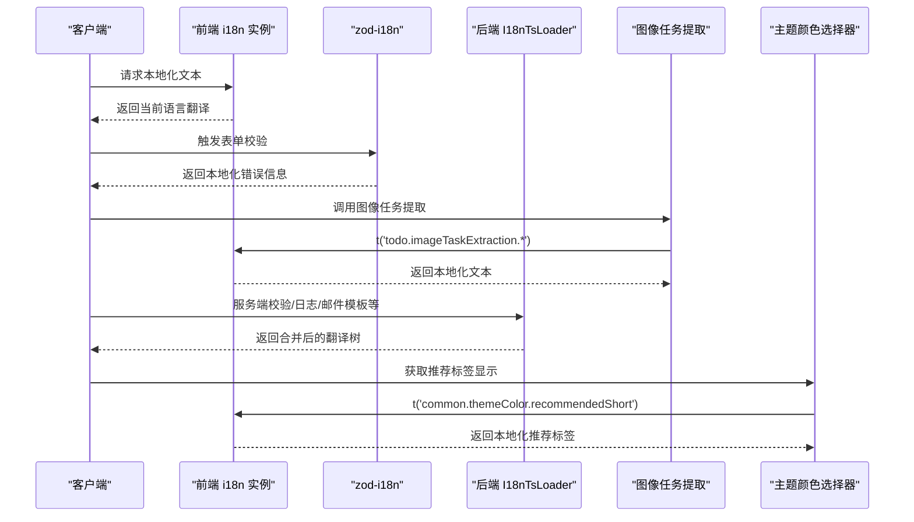
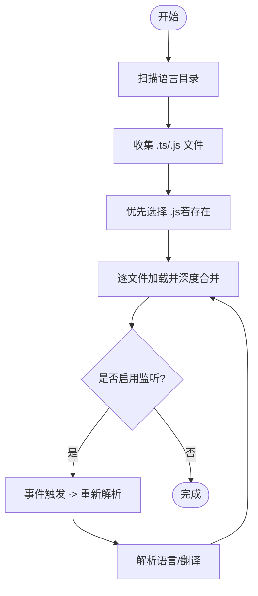
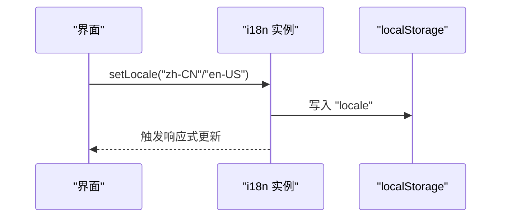
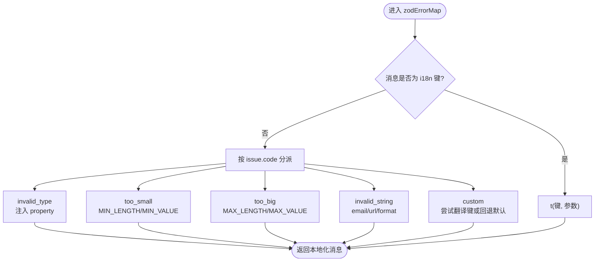
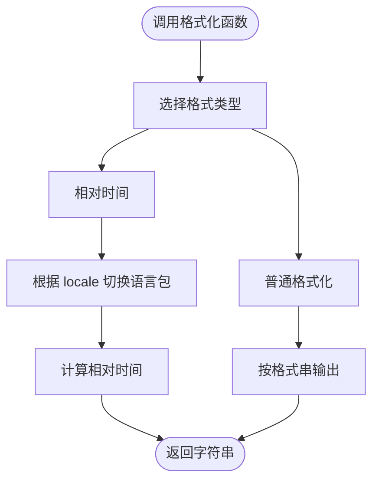
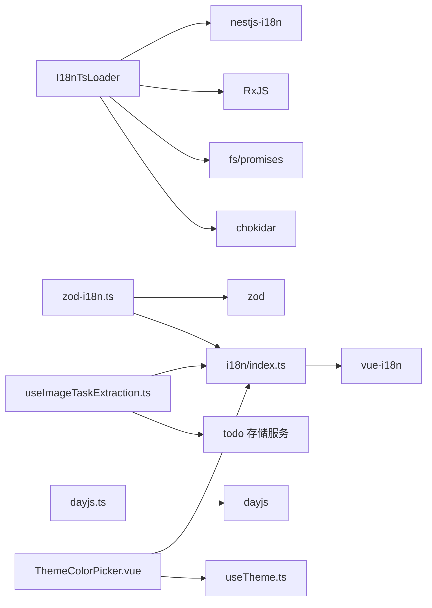

# 国际化

<cite>
**本文档引用的文件**
- [apps/backend/src/i18n/i18n-ts.loader.ts](file://apps/backend/src/i18n/i18n-ts.loader.ts)
- [apps/backend/src/i18n/en-US/validation.ts](file://apps/backend/src/i18n/en-US/validation.ts)
- [apps/backend/src/i18n/zh-CN/validation.ts](file://apps/backend/src/i18n/zh-CN/validation.ts)
- [apps/frontend/src/i18n/index.ts](file://apps/frontend/src/i18n/index.ts)
- [apps/frontend/src/i18n/locales/en-US/common.ts](file://apps/frontend/src/i18n/locales/en-US/common.ts)
- [apps/frontend/src/i18n/locales/zh-CN/common.ts](file://apps/frontend/src/i18n/locales/zh-CN/common.ts)
- [apps/frontend/src/i18n/locales/en-US/validation.ts](file://apps/frontend/src/i18n/locales/en-US/validation.ts)
- [apps/frontend/src/i18n/locales/zh-CN/validation.ts](file://apps/frontend/src/i18n/locales/zh-CN/validation.ts)
- [apps/frontend/src/i18n/locales/en-US/todo.ts](file://apps/frontend/src/i18n/locales/en-US/todo.ts)
- [apps/frontend/src/i18n/locales/zh-CN/todo.ts](file://apps/frontend/src/i18n/locales/zh-CN/todo.ts)
- [apps/frontend/src/lib/zod-i18n.ts](file://apps/frontend/src/lib/zod-i18n.ts)
- [apps/frontend/src/lib/dayjs.ts](file://apps/frontend/src/lib/dayjs.ts)
- [apps/frontend/src/features/todo/components/ThemeColorPicker.vue](file://apps/frontend/src/features/todo/components/ThemeColorPicker.vue)
- [apps/frontend/src/composables/useTheme.ts](file://apps/frontend/src/composables/useTheme.ts)
- [apps/frontend/src/features/todo/composables/useImageTaskExtraction.ts](file://apps/frontend/src/features/todo/composables/useImageTaskExtraction.ts)
- [apps/frontend/tests/features/todo/components/ThemeColorPicker.spec.ts](file://apps/frontend/tests/features/todo/components/ThemeColorPicker.spec.ts)
- [apps/backend/tests/i18n/i18n-ts-loader.spec.ts](file://apps/backend/tests/i18n/i18n-ts-loader.spec.ts)
- [apps/frontend/tests/features/todo/components/TodoHeader.spec.ts](file://apps/frontend/tests/features/todo/components/TodoHeader.spec.ts)
</cite>

## 更新摘要
**所做更改**
- 新增图像任务提取相关的15个翻译键，涵盖英文和中文版本
- 新增 todo.imageTaskExtraction 命名空间下的完整翻译键集
- 完善图像任务提取功能的本地化支持，包括错误提示、成功反馈和用户引导
- 扩展前端 todo 模块的语言包组织结构

## 目录
1. [简介](#简介)
2. [项目结构](#项目结构)
3. [核心组件](#核心组件)
4. [架构总览](#架构总览)
5. [详细组件分析](#详细组件分析)
6. [依赖关系分析](#依赖关系分析)
7. [性能考量](#性能考量)
8. [故障排查指南](#故障排查指南)
9. [结论](#结论)
10. [附录](#附录)

## 简介
本文件系统性阐述 Lumina Todo 的国际化（i18n）体系：后端基于 nestjs-i18n 的 TypeScript/JavaScript 翻译文件加载器，前端采用 vue-i18n 并结合 zod 错误国际化与 dayjs 本地化格式化。文档覆盖语言包组织、翻译键值管理、动态语言切换、验证国际化、本地化格式化（日期/数值/货币）、RTL 支持现状与建议、以及翻译覆盖率监控与优化策略。

**更新** 新增图像任务提取相关的15个翻译键，扩展了 todo 模块的本地化支持，完善了 AI 图像任务提取功能的多语言体验。

## 项目结构
- 后端 i18n 路径：apps/backend/src/i18n
  - 按语言分目录，每个语言目录下按业务模块拆分翻译文件（如 auth、common、mail、upload、validation）
  - 使用自定义加载器 I18nTsLoader 扫描语言目录、合并模块级翻译、支持热更新
- 前端 i18n 路径：apps/frontend/src/i18n
  - 通过 index.ts 创建 i18n 实例，按语言分目录，每个目录下按模块拆分（如 common、auth、todo、validation 等）
  - 提供默认语言选择逻辑（localStorage > 浏览器语言），并设置回退语言
  - **新增**：todo 模块包含完整的图像任务提取相关翻译键
- 共享与工具
  - zod-i18n.ts：将 zod 校验错误映射到 i18n 键，统一输出本地化错误信息
  - dayjs.ts：封装日期格式化与相对时间本地化

**图表来源**
- [apps/backend/src/i18n/i18n-ts.loader.ts:163-183](file://apps/backend/src/i18n/i18n-ts.loader.ts#L163-L183)
- [apps/frontend/src/i18n/index.ts:24-34](file://apps/frontend/src/i18n/index.ts#L24-L34)
- [apps/frontend/src/lib/zod-i18n.ts:18-87](file://apps/frontend/src/lib/zod-i18n.ts#L18-L87)
- [apps/frontend/src/lib/dayjs.ts:17-32](file://apps/frontend/src/lib/dayjs.ts#L17-L32)
- [apps/frontend/src/features/todo/composables/useImageTaskExtraction.ts:125-132](file://apps/frontend/src/features/todo/composables/useImageTaskExtraction.ts#L125-L132)
- [apps/frontend/src/features/todo/components/ThemeColorPicker.vue:115-121](file://apps/frontend/src/features/todo/components/ThemeColorPicker.vue#L115-L121)

**章节来源**
- [apps/backend/src/i18n/i18n-ts.loader.ts:1-185](file://apps/backend/src/i18n/i18n-ts.loader.ts#L1-L185)
- [apps/frontend/src/i18n/index.ts:1-37](file://apps/frontend/src/i18n/index.ts#L1-L37)

## 核心组件
- 后端 I18nTsLoader
  - 递归扫描语言目录，收集 .ts/.js 翻译文件，优先选择 .js（若存在则覆盖 .ts）
  - 深度合并同一语言下的模块翻译，生成语言级完整树
  - 可选监听文件变化，触发重新解析与热更新
- 前端 i18n 实例
  - 基于 vue-i18n，按模块拆分 messages，支持 zh-CN/en-US，并兼容 zh/en 简写
  - 默认语言选择顺序：localStorage > 浏览器语言 > 回退语言 zh-CN
- zod 错误国际化
  - 自定义 zod 错误映射，优先使用共享 schema 中的 i18n 键，其次根据 issue.code 映射到预设键
  - 自动注入字段路径翻译（common.fields.*），支持最小/最大长度/值等参数替换
- 本地化格式化
  - dayjs 封装：相对时间按语言切换 locale；普通格式化支持传入格式串
- **新增**：图像任务提取本地化
  - todo.imageTaskExtraction 命名空间包含15个翻译键，支持 AI 图像任务提取功能的完整本地化
  - 包括提取标题、描述、分析状态、用户提示、错误处理和成功反馈等场景
- 主题颜色本地化
  - 新增 recommendedShort 键值支持中英文推荐标签显示
  - 主题颜色预设的国际化管理，包括推荐标签的本地化显示

**更新** 新增图像任务提取相关的15个翻译键，扩展了 todo 模块的本地化支持，完善了 AI 图像任务提取功能的多语言体验。

**章节来源**
- [apps/backend/src/i18n/i18n-ts.loader.ts:86-184](file://apps/backend/src/i18n/i18n-ts.loader.ts#L86-L184)
- [apps/frontend/src/i18n/index.ts:12-34](file://apps/frontend/src/i18n/index.ts#L12-L34)
- [apps/frontend/src/lib/zod-i18n.ts:18-95](file://apps/frontend/src/lib/zod-i18n.ts#L18-L95)
- [apps/frontend/src/lib/dayjs.ts:17-32](file://apps/frontend/src/lib/dayjs.ts#L17-L32)
- [apps/frontend/src/features/todo/composables/useImageTaskExtraction.ts:125-132](file://apps/frontend/src/features/todo/composables/useImageTaskExtraction.ts#L125-L132)
- [apps/frontend/src/features/todo/components/ThemeColorPicker.vue:56-71](file://apps/frontend/src/features/todo/components/ThemeColorPicker.vue#L56-L71)

## 架构总览
后端与前端的 i18n 架构相互独立又协同工作：
- 后端通过 I18nTsLoader 统一加载与合并翻译，供服务层在运行时按需查询
- 前端通过 i18n 实例提供 UI 层本地化，配合 zod-i18n 在表单校验阶段即时反馈本地化错误
- dayjs 提供日期/相对时间的本地化展示
- **新增**：图像任务提取功能通过 todo.imageTaskExtraction 命名空间提供完整的本地化支持
- 主题颜色系统通过 i18n 键值实现推荐标签的国际化显示

**图表来源**
- [apps/frontend/src/i18n/index.ts:24-34](file://apps/frontend/src/i18n/index.ts#L24-L34)
- [apps/frontend/src/lib/zod-i18n.ts:18-87](file://apps/frontend/src/lib/zod-i18n.ts#L18-L87)
- [apps/frontend/src/features/todo/composables/useImageTaskExtraction.ts:125-132](file://apps/frontend/src/features/todo/composables/useImageTaskExtraction.ts#L125-L132)
- [apps/backend/src/i18n/i18n-ts.loader.ts:136-144](file://apps/backend/src/i18n/i18n-ts.loader.ts#L136-L144)
- [apps/frontend/src/features/todo/components/ThemeColorPicker.vue:115-121](file://apps/frontend/src/features/todo/components/ThemeColorPicker.vue#L115-L121)

## 详细组件分析

### 后端 I18nTsLoader 加载器
- 文件扫描与去重
  - 递归遍历语言目录，仅接受 .ts/.js，排除 .d.ts
  - 当同名 .ts 与 .js 同时存在时，优先采用 .js
- 深度合并
  - 对同一语言内的多个模块文件进行深度合并，确保键冲突时后者覆盖前者
- 热更新
  - 可选启用 chokidar 监听，事件触发后重新解析语言与翻译
- 错误处理
  - 单文件加载异常记录日志并跳过，不影响整体翻译树构建

**图表来源**
- [apps/backend/src/i18n/i18n-ts.loader.ts:31-75](file://apps/backend/src/i18n/i18n-ts.loader.ts#L31-L75)
- [apps/backend/src/i18n/i18n-ts.loader.ts:136-183](file://apps/backend/src/i18n/i18n-ts.loader.ts#L136-L183)

**章节来源**
- [apps/backend/src/i18n/i18n-ts.loader.ts:1-185](file://apps/backend/src/i18n/i18n-ts.loader.ts#L1-L185)
- [apps/backend/tests/i18n/i18n-ts-loader.spec.ts:32-101](file://apps/backend/tests/i18n/i18n-ts-loader.spec.ts#L32-L101)

### 前端 i18n 实例与动态语言切换
- 默认语言选择
  - 优先读取 localStorage 中的 locale；否则依据 navigator.language 判断 zh 开头为 zh-CN，其余为 en-US；最终回退至 zh-CN
- 语言与模块拆分
  - 每个语言目录下按模块拆分（common、auth、todo、validation 等），便于维护与按需加载
  - **新增**：todo 模块包含完整的图像任务提取相关翻译键
- 动态切换
  - 通过修改 i18n.global.locale 实现切换；测试用例验证了切换后 localStorage 写入与界面文案变更

**图表来源**
- [apps/frontend/src/i18n/index.ts:12-20](file://apps/frontend/src/i18n/index.ts#L12-L20)
- [apps/frontend/tests/features/todo/components/TodoHeader.spec.ts:176-179](file://apps/frontend/tests/features/todo/components/TodoHeader.spec.ts#L176-L179)

**章节来源**
- [apps/frontend/src/i18n/index.ts:1-37](file://apps/frontend/src/i18n/index.ts#L1-L37)
- [apps/frontend/tests/features/todo/components/TodoHeader.spec.ts:181-204](file://apps/frontend/tests/features/todo/components/TodoHeader.spec.ts#L181-L204)

### zod 校验国际化
- 错误映射策略
  - 若自定义消息为单一英文点号分隔的键名，直接作为 i18n 键渲染
  - 根据 issue.code 分派到预设键（如 REQUIRED、INVALID_EMAIL、MIN_LENGTH 等）
  - 自动注入字段路径翻译（common.fields.*），并替换最小/最大等参数
- 全局初始化
  - 通过 initZodI18n 设置全局 zod 错误映射，同时对共享 schema 生效

**图表来源**
- [apps/frontend/src/lib/zod-i18n.ts:18-87](file://apps/frontend/src/lib/zod-i18n.ts#L18-L87)

**章节来源**
- [apps/frontend/src/lib/zod-i18n.ts:1-96](file://apps/frontend/src/lib/zod-i18n.ts#L1-L96)

### 本地化格式化（日期/相对时间）
- 相对时间
  - 根据传入 locale 切换 dayjs 语言包，返回对应语言的相对时间表达
- 普通格式化
  - 支持自定义格式串，默认格式化日期时间
- 数字/货币
  - 当前未见专门的数字/货币本地化封装；可在需要时扩展（例如 Intl.NumberFormat）

**图表来源**
- [apps/frontend/src/lib/dayjs.ts:17-32](file://apps/frontend/src/lib/dayjs.ts#L17-L32)

**章节来源**
- [apps/frontend/src/lib/dayjs.ts:1-35](file://apps/frontend/src/lib/dayjs.ts#L1-L35)

### 语言包组织与翻译键值管理
- 后端
  - 语言目录：en-US、zh-CN
  - 模块文件：auth.ts、common.ts、mail.ts、upload.ts、validation.ts
  - 示例键值：validation 下的 REQUIRED、INVALID_EMAIL、MIN_LENGTH 等
- 前端
  - 语言目录：en-US、zh-CN
  - 模块文件：common.ts、auth.ts、todo.ts、validation.ts 等
  - **新增**：todo.ts 包含完整的图像任务提取相关翻译键
  - 示例键值：common.fields.* 用于 zod 字段路径翻译；validation 下的 REQUIRED、INVALID_TYPE 等
  - **新增**：todo.imageTaskExtraction.* 用于图像任务提取功能的本地化
  - **新增**：common.themeColor.recommendedShort 键值用于推荐标签的本地化显示

**更新** 新增图像任务提取相关的15个翻译键，扩展了 todo 模块的语言包组织结构，完善了 AI 图像任务提取功能的本地化支持。

**章节来源**
- [apps/backend/src/i18n/en-US/validation.ts:1-12](file://apps/backend/src/i18n/en-US/validation.ts#L1-L12)
- [apps/backend/src/i18n/zh-CN/validation.ts:1-12](file://apps/backend/src/i18n/zh-CN/validation.ts#L1-L12)
- [apps/frontend/src/i18n/locales/en-US/common.ts:54-72](file://apps/frontend/src/i18n/locales/en-US/common.ts#L54-L72)
- [apps/frontend/src/i18n/locales/zh-CN/common.ts:54-72](file://apps/frontend/src/i18n/locales/zh-CN/common.ts#L54-L72)
- [apps/frontend/src/i18n/locales/en-US/validation.ts:1-14](file://apps/frontend/src/i18n/locales/en-US/validation.ts#L1-L14)
- [apps/frontend/src/i18n/locales/zh-CN/validation.ts:1-14](file://apps/frontend/src/i18n/locales/zh-CN/validation.ts#L1-L14)
- [apps/frontend/src/i18n/locales/en-US/todo.ts:104-118](file://apps/frontend/src/i18n/locales/en-US/todo.ts#L104-L118)
- [apps/frontend/src/i18n/locales/zh-CN/todo.ts:104-118](file://apps/frontend/src/i18n/locales/zh-CN/todo.ts#L104-L118)

### 图像任务提取本地化支持
- **新增**：todo.imageTaskExtraction 命名空间
  - 包含15个完整的翻译键，覆盖图像任务提取的完整生命周期
  - 键值包括：title、description、analyzing、editHint、noTasksFound、confirmAdd、extractionFailed、addTask、taskPlaceholder、imageTooLarge、tasksAdded、someTasksSkipped、addFailed
  - 支持参数化翻译，如 imageTooLarge 和 tasksAdded 中的 {maxSize} 和 {count} 占位符
- **新增**：useImageTaskExtraction 组合式函数集成
  - 在提取成功时显示本地化成功消息（tasksAdded）
  - 在部分任务被跳过时显示本地化提示（someTasksSkipped）
  - 在添加失败时显示本地化错误消息（addFailed）
  - 在图像过大时显示本地化错误消息（imageTooLarge）
- **新增**：组件级本地化集成
  - 通过 t() 函数调用 todo.imageTaskExtraction.* 键值
  - 支持动态参数传递和本地化格式化

**更新** 新增图像任务提取相关的15个翻译键，扩展了 todo 模块的本地化支持，完善了 AI 图像任务提取功能的完整多语言体验。

**章节来源**
- [apps/frontend/src/i18n/locales/en-US/todo.ts:104-118](file://apps/frontend/src/i18n/locales/en-US/todo.ts#L104-L118)
- [apps/frontend/src/i18n/locales/zh-CN/todo.ts:104-118](file://apps/frontend/src/i18n/locales/zh-CN/todo.ts#L104-L118)
- [apps/frontend/src/features/todo/composables/useImageTaskExtraction.ts:52](file://apps/frontend/src/features/todo/composables/useImageTaskExtraction.ts#L52)
- [apps/frontend/src/features/todo/composables/useImageTaskExtraction.ts:97](file://apps/frontend/src/features/todo/composables/useImageTaskExtraction.ts#L97)
- [apps/frontend/src/features/todo/composables/useImageTaskExtraction.ts:125-132](file://apps/frontend/src/features/todo/composables/useImageTaskExtraction.ts#L125-L132)

### 主题颜色本地化支持
- 推荐标签国际化
  - 新增 recommendedShort 键值，支持中英文推荐标签显示
  - 中文：优选，英文：Curated
  - 在主题颜色选择器中用于显示推荐预设的颜色标签
- 主题颜色预设管理
  - THEME_PRESETS 数组中的推荐预设通过 recommended 属性标识
  - 通过 i18n.t 函数获取本地化的推荐标签文本
- 组件集成
  - ThemeColorPicker 组件使用 t('common.themeColor.recommendedShort') 获取本地化文本
  - 条件渲染推荐标签，仅对标记为推荐的预设显示

**更新** 新增主题颜色本地化的 recommendedShort 键值支持，完善推荐标签的国际化显示逻辑。

**章节来源**
- [apps/frontend/src/i18n/locales/en-US/common.ts:58-59](file://apps/frontend/src/i18n/locales/en-US/common.ts#L58-L59)
- [apps/frontend/src/i18n/locales/zh-CN/common.ts:58-59](file://apps/frontend/src/i18n/locales/zh-CN/common.ts#L58-L59)
- [apps/frontend/src/features/todo/components/ThemeColorPicker.vue:115-121](file://apps/frontend/src/features/todo/components/ThemeColorPicker.vue#L115-L121)
- [apps/frontend/src/composables/useTheme.ts:56-66](file://apps/frontend/src/composables/useTheme.ts#L56-L66)

### RTL（从右到左）语言支持
- 现状
  - 未发现针对 RTL 语言（如阿拉伯语、希伯来语）的专门样式或布局适配
- 建议
  - 引入方向性检测（如通过 DOM dir 或 CSS 方向属性）
  - 为 RTL 语言提供专用样式覆盖（如文本对齐、图标镜像、边距调整）
  - 在路由或用户设置中增加方向性开关，避免硬编码

## 依赖关系分析
- 后端
  - I18nTsLoader 依赖 nestjs-i18n 的 I18nLoader 接口与 RxJS Observable 流
  - 通过 chokidar 实现文件系统监听
- 前端
  - i18n 实例依赖 vue-i18n
  - zod-i18n 依赖 zod 与 i18n 实例
  - dayjs 依赖 dayjs 及其插件
  - **新增**：useImageTaskExtraction 依赖 i18n 实例和 todo 存储服务
  - **新增**：ThemeColorPicker 依赖 useTheme 组合式函数和 i18n 实例

**图表来源**
- [apps/backend/src/i18n/i18n-ts.loader.ts:1-10](file://apps/backend/src/i18n/i18n-ts.loader.ts#L1-L10)
- [apps/frontend/src/i18n/index.ts](file://apps/frontend/src/i18n/index.ts#L1)
- [apps/frontend/src/lib/zod-i18n.ts:1-3](file://apps/frontend/src/lib/zod-i18n.ts#L1-L3)
- [apps/frontend/src/lib/dayjs.ts:1-5](file://apps/frontend/src/lib/dayjs.ts#L1-L5)
- [apps/frontend/src/features/todo/composables/useImageTaskExtraction.ts:1-10](file://apps/frontend/src/features/todo/composables/useImageTaskExtraction.ts#L1-L10)
- [apps/frontend/src/features/todo/components/ThemeColorPicker.vue:1-10](file://apps/frontend/src/features/todo/components/ThemeColorPicker.vue#L1-L10)

**章节来源**
- [apps/backend/src/i18n/i18n-ts.loader.ts:1-185](file://apps/backend/src/i18n/i18n-ts.loader.ts#L1-L185)
- [apps/frontend/src/i18n/index.ts:1-37](file://apps/frontend/src/i18n/index.ts#L1-L37)
- [apps/frontend/src/lib/zod-i18n.ts:1-96](file://apps/frontend/src/lib/zod-i18n.ts#L1-L96)
- [apps/frontend/src/lib/dayjs.ts:1-35](file://apps/frontend/src/lib/dayjs.ts#L1-L35)
- [apps/frontend/src/features/todo/composables/useImageTaskExtraction.ts:1-10](file://apps/frontend/src/features/todo/composables/useImageTaskExtraction.ts#L1-L10)
- [apps/frontend/src/features/todo/components/ThemeColorPicker.vue:1-10](file://apps/frontend/src/features/todo/components/ThemeColorPicker.vue#L1-L10)

## 性能考量
- 后端
  - 文件扫描与合并发生在启动与监听事件触发时，建议在开发环境启用监听，在生产环境禁用以减少 IO
  - 优先选择 .js 文件可避免重复编译，提升加载速度
- 前端
  - 按模块拆分 messages 有利于按需加载与 Tree Shaking
  - 默认语言选择逻辑简单高效，localStorage 访问为 O(1)
  - **新增**：图像任务提取功能通过组合式函数实现，避免重复的 i18n 查询
  - **新增**：主题颜色本地化通过计算属性缓存，避免重复的 i18n 查询
- 校验与格式化
  - zod 错误映射为纯函数，开销极低
  - dayjs 本地化切换为轻量操作，避免频繁创建实例

## 故障排查指南
- 后端翻译文件加载失败
  - 现象：某语言翻译为空或缺失
  - 排查：检查翻译文件语法错误；查看加载器日志；确认文件扩展名与命名规范
  - 参考测试：i18n-ts-loader.spec.ts 中对语法错误的处理与断言
- 前端语言切换无效
  - 现象：切换语言后界面未更新
  - 排查：确认 i18n.global.locale 已变更；localStorage 是否正确写入；组件是否响应式更新
  - 参考测试：TodoHeader.spec.ts 中对切换行为的断言
- zod 错误未本地化
  - 现象：错误仍为英文或未替换参数
  - 排查：确认自定义消息是否为合法 i18n 键；common.fields.* 是否存在对应字段路径；initZodI18n 是否已调用
- **新增**：图像任务提取翻译键缺失
  - 现象：图像任务提取功能显示英文键名而非本地化文本
  - 排查：确认 todo.imageTaskExtraction.* 键值存在于翻译文件中；检查 useImageTaskExtraction 组件的 i18n.t 调用；验证参数传递是否正确
- **新增**：主题颜色推荐标签显示问题
  - 现象：推荐标签未正确显示或显示为键名而非本地化文本
  - 排查：确认 recommendedShort 键值存在于翻译文件中；检查 ThemeColorPicker 组件的 i18n.t 调用；验证 THEME_PRESETS 中的推荐预设标识

**章节来源**
- [apps/backend/tests/i18n/i18n-ts-loader.spec.ts:83-101](file://apps/backend/tests/i18n/i18n-ts-loader.spec.ts#L83-L101)
- [apps/frontend/tests/features/todo/components/TodoHeader.spec.ts:176-179](file://apps/frontend/tests/features/todo/components/TodoHeader.spec.ts#L176-L179)
- [apps/frontend/src/lib/zod-i18n.ts:92-95](file://apps/frontend/src/lib/zod-i18n.ts#L92-L95)
- [apps/frontend/tests/features/todo/components/ThemeColorPicker.spec.ts:106-112](file://apps/frontend/tests/features/todo/components/ThemeColorPicker.spec.ts#L106-L112)
- [apps/frontend/src/features/todo/composables/useImageTaskExtraction.ts:125-132](file://apps/frontend/src/features/todo/composables/useImageTaskExtraction.ts#L125-L132)

## 结论
Lumina Todo 的 i18n 体系在前后端分别实现了清晰的模块化与可维护性：后端通过 I18nTsLoader 实现自动扫描与合并，前端通过 vue-i18n 提供动态切换与类型安全；zod-i18n 与 dayjs 为用户体验提供了高质量的本地化反馈与展示。

**更新** 最新更新显著扩展了图像任务提取功能的本地化支持，新增15个翻译键覆盖完整的 AI 图像任务提取流程，完善了 todo 模块的语言包组织结构。同时增强了主题颜色的本地化支持，通过新增 recommendedShort 键值实现了中英文推荐标签的国际化显示，进一步完善了主题系统的本地化体验。后续可在 RTL 支持、数字/货币本地化、覆盖率监控等方面持续增强。

## 附录

### 翻译文件维护与更新流程
- 新增语言
  - 后端：在 apps/backend/src/i18n 下新增语言目录，按模块补充翻译文件
  - 前端：在 apps/frontend/src/i18n/locales 下新增语言目录，按模块补充翻译文件
  - **新增**：确保新增语言包含 todo.imageTaskExtraction.* 完整的图像任务提取相关键值
- 更新现有语言
  - 保持模块文件划分一致，避免键名变更导致的运行时错误
  - 通过测试用例验证切换与渲染
  - **新增**：验证图像任务提取功能的本地化显示，包括参数化翻译的正确性
  - **新增**：验证主题颜色推荐标签的本地化显示
- 发布前检查
  - 确认所有模块文件均存在对应键值
  - 验证 zod 错误映射覆盖常用场景
  - 验证 dayjs 相对时间在目标语言下的表现
  - **新增**：验证图像任务提取相关键值的完整性与参数化翻译的正确性
  - **新增**：验证主题颜色本地化键值的完整性

### 翻译覆盖率监控与优化策略
- 监控
  - 建立键值清单与覆盖率报告（缺失键/冗余键）
  - 在 CI 中加入翻译文件静态检查与测试用例覆盖率统计
  - **新增**：监控图像任务提取相关键值的覆盖率，特别是参数化翻译的正确性
  - **新增**：监控主题颜色相关键值的覆盖率
- 优化
  - 模块化拆分保持稳定，避免频繁重构键名
  - 为常用字段建立 common.fields.* 规范，降低重复翻译
  - 对高频错误码建立统一映射，减少重复配置
  - **新增**：为主题颜色预设建立标准化的本地化键值规范
  - **新增**：为图像任务提取功能建立标准化的翻译键值命名约定

**章节来源**
- [apps/frontend/src/i18n/locales/en-US/todo.ts:104-118](file://apps/frontend/src/i18n/locales/en-US/todo.ts#L104-L118)
- [apps/frontend/src/i18n/locales/zh-CN/todo.ts:104-118](file://apps/frontend/src/i18n/locales/zh-CN/todo.ts#L104-L118)
- [apps/frontend/src/i18n/locales/en-US/common.ts:58-59](file://apps/frontend/src/i18n/locales/en-US/common.ts#L58-L59)
- [apps/frontend/src/i18n/locales/zh-CN/common.ts:58-59](file://apps/frontend/src/i18n/locales/zh-CN/common.ts#L58-L59)
- [apps/frontend/tests/features/todo/components/ThemeColorPicker.spec.ts:106-112](file://apps/frontend/tests/features/todo/components/ThemeColorPicker.spec.ts#L106-L112)
- [apps/frontend/src/features/todo/composables/useImageTaskExtraction.ts:125-132](file://apps/frontend/src/features/todo/composables/useImageTaskExtraction.ts#L125-L132)