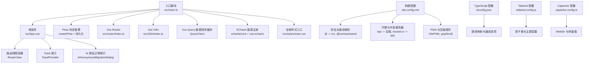
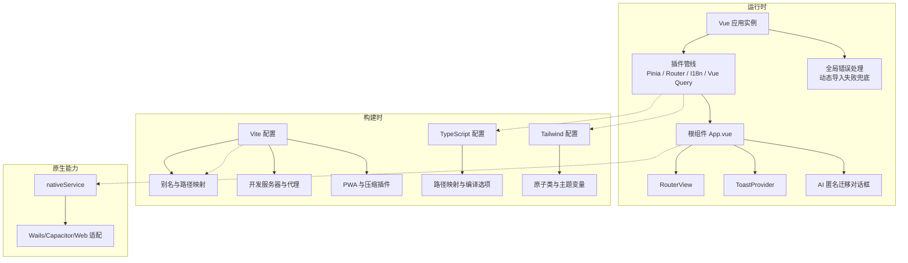
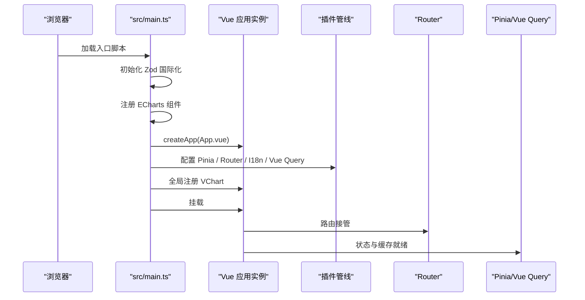
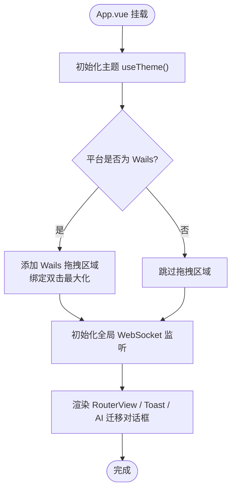
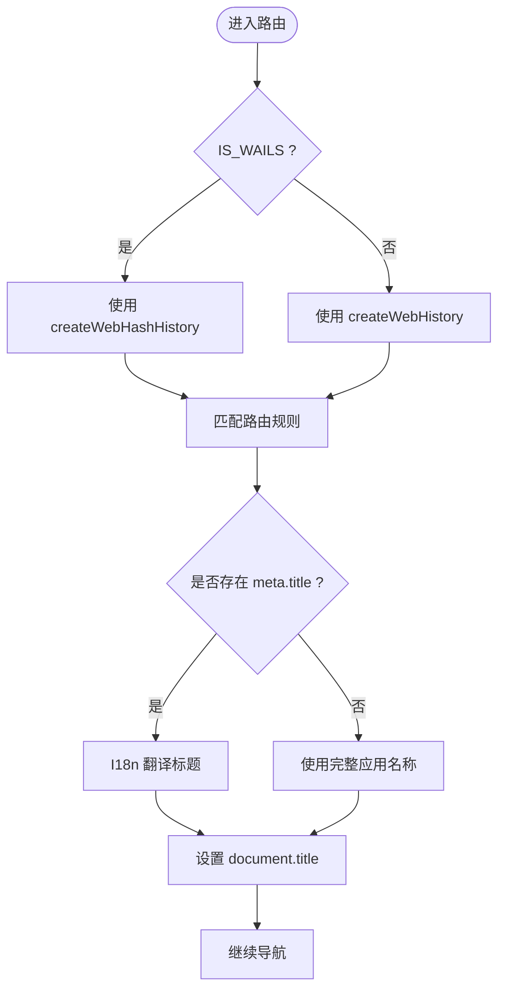
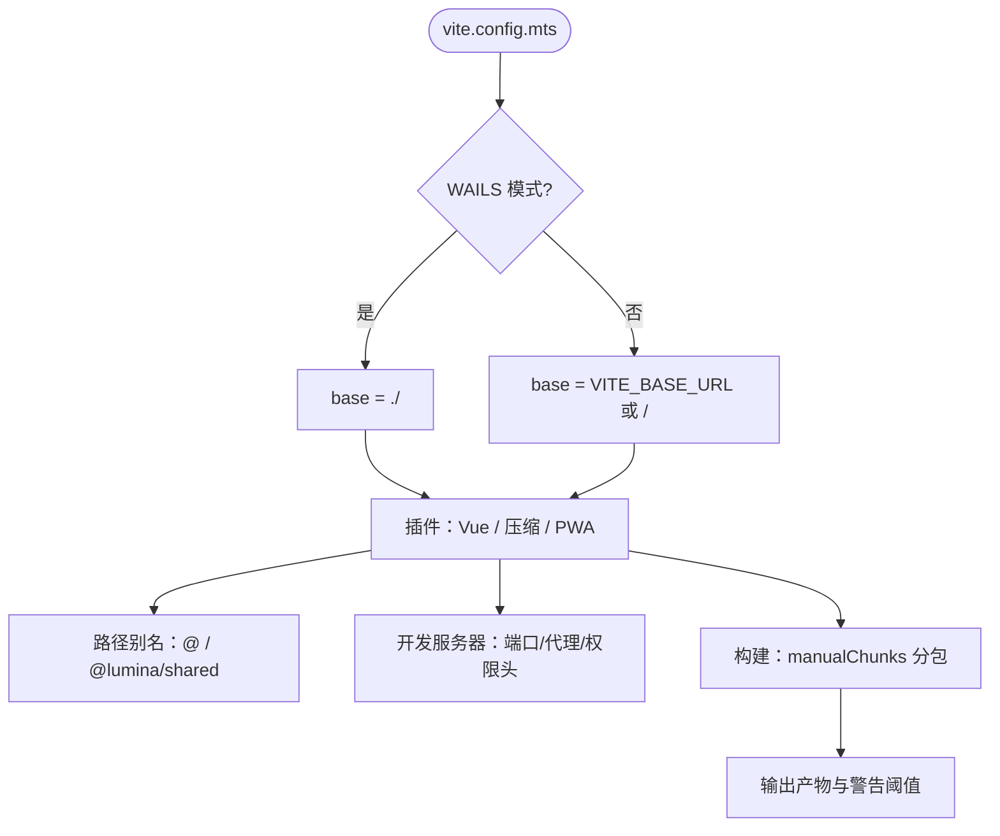
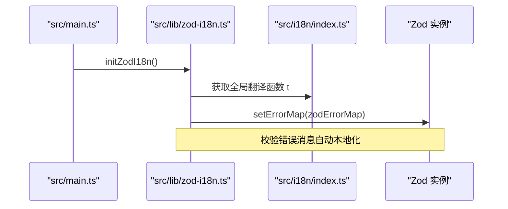
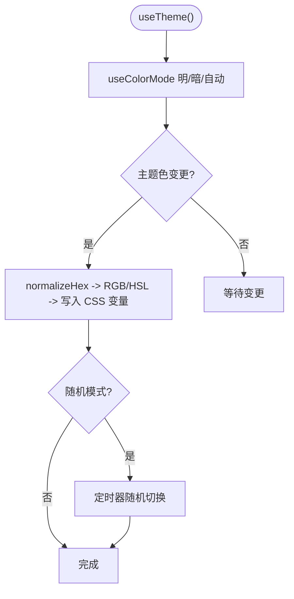
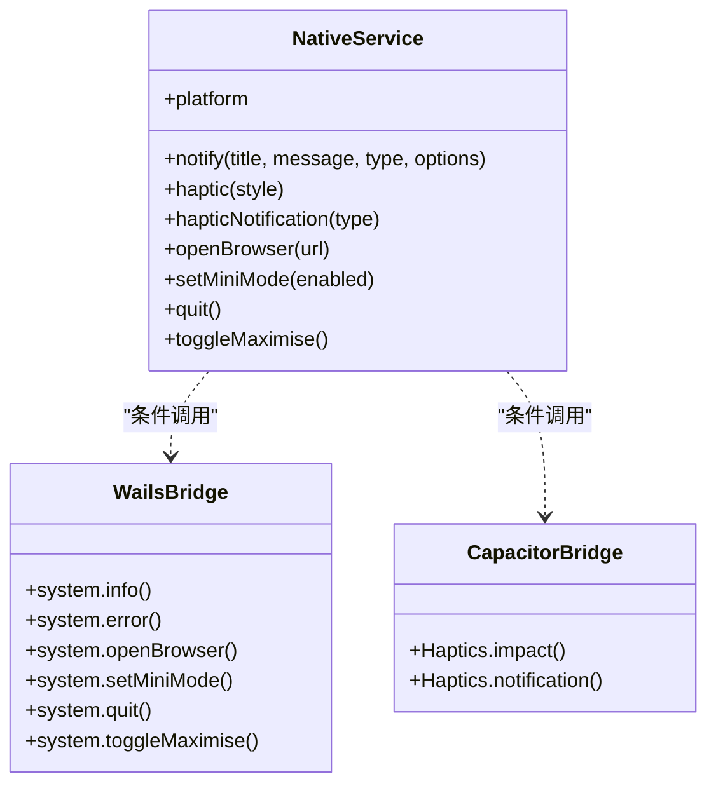
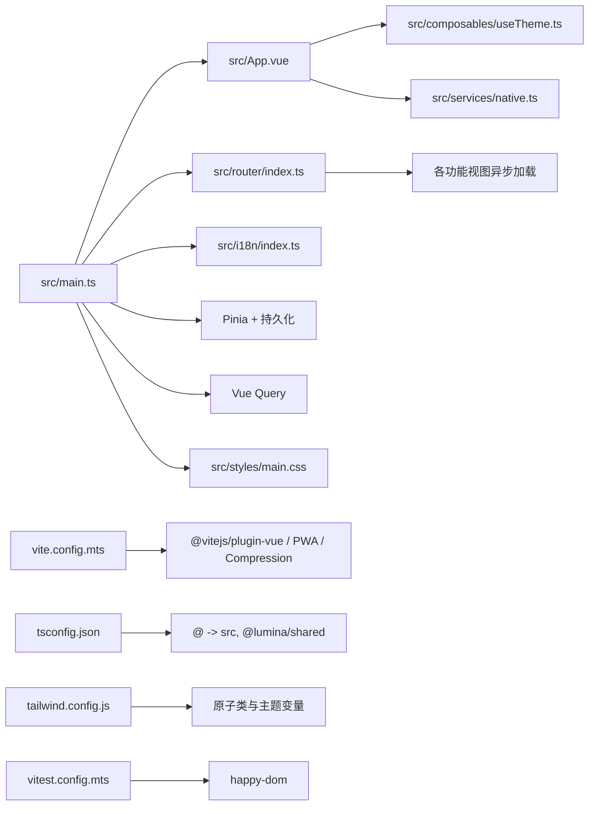

# 应用架构

<cite>
**本文引用的文件**
- [apps/frontend/package.json](file://apps/frontend/package.json)
- [apps/frontend/vite.config.mts](file://apps/frontend/vite.config.mts)
- [apps/frontend/src/main.ts](file://apps/frontend/src/main.ts)
- [apps/frontend/src/App.vue](file://apps/frontend/src/App.vue)
- [apps/frontend/src/router/index.ts](file://apps/frontend/src/router/index.ts)
- [apps/frontend/tsconfig.json](file://apps/frontend/tsconfig.json)
- [apps/frontend/capacitor.config.ts](file://apps/frontend/capacitor.config.ts)
- [apps/frontend/tailwind.config.js](file://apps/frontend/tailwind.config.js)
- [apps/frontend/postcss.config.js](file://apps/frontend/postcss.config.js)
- [apps/frontend/src/i18n/index.ts](file://apps/frontend/src/i18n/index.ts)
- [apps/frontend/index.html](file://apps/frontend/index.html)
- [apps/frontend/src/composables/useTheme.ts](file://apps/frontend/src/composables/useTheme.ts)
- [apps/frontend/src/services/native.ts](file://apps/frontend/src/services/native.ts)
- [apps/frontend/pwa-assets.config.ts](file://apps/frontend/pwa-assets.config.ts)
- [apps/frontend/vitest.config.mts](file://apps/frontend/vitest.config.mts)
- [apps/frontend/src/lib/zod-i18n.ts](file://apps/frontend/src/lib/zod-i18n.ts)
- [apps/frontend/src/styles/main.css](file://apps/frontend/src/styles/main.css)
</cite>

## 目录
1. [引言](#引言)
2. [项目结构](#项目结构)
3. [核心组件](#核心组件)
4. [架构总览](#架构总览)
5. [详细组件分析](#详细组件分析)
6. [依赖关系分析](#依赖关系分析)
7. [性能考量](#性能考量)
8. [故障排查指南](#故障排查指南)
9. [结论](#结论)
10. [附录](#附录)

## 引言
本文件面向 Lumina Todo 前端应用，系统梳理其整体架构设计与实现细节，涵盖入口文件配置、根组件结构、路由系统、Vite 构建与优化策略、初始化流程与生命周期管理、TypeScript 类型系统、环境变量与配置组织、开发服务器与热重载、构建产物优化与打包策略等。文档旨在帮助开发者快速理解并高效维护该前端工程。

## 项目结构
前端应用位于 apps/frontend，采用模块化与功能域划分相结合的组织方式：
- 应用入口与根组件：src/main.ts、src/App.vue
- 路由系统：src/router/index.ts
- 国际化：src/i18n/index.ts 及 locales
- 主题与样式：src/composables/useTheme.ts、src/styles/main.css、tailwind.config.js
- 原生桥接：src/services/native.ts
- 构建与配置：vite.config.mts、tsconfig.json、package.json、capacitor.config.ts、postcss.config.js、pwa-assets.config.ts、vitest.config.mts
- PWA 与压缩：vite.config.mts 中的 VitePWA 与 gzip/brotli 插件
- 测试：vitest.config.mts 与 tests 目录

图表来源
- [apps/frontend/src/main.ts:1-138](file://apps/frontend/src/main.ts#L1-L138)
- [apps/frontend/src/App.vue:1-77](file://apps/frontend/src/App.vue#L1-L77)
- [apps/frontend/src/router/index.ts:1-73](file://apps/frontend/src/router/index.ts#L1-L73)
- [apps/frontend/vite.config.mts:1-185](file://apps/frontend/vite.config.mts#L1-L185)
- [apps/frontend/tsconfig.json:1-28](file://apps/frontend/tsconfig.json#L1-L28)
- [apps/frontend/tailwind.config.js:1-303](file://apps/frontend/tailwind.config.js#L1-L303)
- [apps/frontend/capacitor.config.ts:1-23](file://apps/frontend/capacitor.config.ts#L1-L23)

章节来源
- [apps/frontend/package.json:1-104](file://apps/frontend/package.json#L1-L104)
- [apps/frontend/vite.config.mts:1-185](file://apps/frontend/vite.config.mts#L1-L185)
- [apps/frontend/src/main.ts:1-138](file://apps/frontend/src/main.ts#L1-L138)
- [apps/frontend/src/App.vue:1-77](file://apps/frontend/src/App.vue#L1-L77)
- [apps/frontend/src/router/index.ts:1-73](file://apps/frontend/src/router/index.ts#L1-L73)
- [apps/frontend/tsconfig.json:1-28](file://apps/frontend/tsconfig.json#L1-L28)
- [apps/frontend/tailwind.config.js:1-303](file://apps/frontend/tailwind.config.js#L1-L303)
- [apps/frontend/capacitor.config.ts:1-23](file://apps/frontend/capacitor.config.ts#L1-L23)
- [apps/frontend/postcss.config.js:1-8](file://apps/frontend/postcss.config.js#L1-L8)
- [apps/frontend/pwa-assets.config.ts:1-7](file://apps/frontend/pwa-assets.config.ts#L1-L7)
- [apps/frontend/vitest.config.mts:1-23](file://apps/frontend/vitest.config.mts#L1-L23)

## 核心组件
- 应用入口与初始化
  - 创建 Vue 应用实例，注册 Pinia、Router、I18n、Vue Query，并全局注册图表组件；配置全局错误处理与动态导入失败兜底刷新；挂载根节点。
- 根组件
  - 初始化主题、注入全局提示与 AI 迁移对话框；在 Wails 平台下添加拖拽区域与双击最大化行为；作为路由视图容器承载 RouterView。
- 路由系统
  - 基于 History/Hash 模式（受 IS_WAILS 控制），按需异步加载视图；在 beforeEach 中根据 meta.title 动态设置页面标题。
- 国际化
  - 基于 vue-i18n，支持 zh-CN/en-US；自动检测浏览器语言或本地存储偏好；提供强类型消息 Schema。
- 主题与样式
  - useTheme 提供明暗模式与主题色（含随机色）持久化；Tailwind 配置扩展丰富的颜色、阴影、动画与响应式断点；主样式入口聚合基础、主题、动画、markdown、vendor、UI 样式。
- 原生桥接
  - nativeService 抽象 Wails/Capacitor/Web 差异，统一通知、触感反馈、打开浏览器、窗口操作等能力。
- 构建与测试
  - Vite 配置包含别名、代理、PWA、压缩、分包策略；TypeScript 配置启用 bundler 解析与路径映射；Vitest 配置使用 happy-dom 环境与别名。

章节来源
- [apps/frontend/src/main.ts:1-138](file://apps/frontend/src/main.ts#L1-L138)
- [apps/frontend/src/App.vue:1-77](file://apps/frontend/src/App.vue#L1-L77)
- [apps/frontend/src/router/index.ts:1-73](file://apps/frontend/src/router/index.ts#L1-L73)
- [apps/frontend/src/i18n/index.ts:1-37](file://apps/frontend/src/i18n/index.ts#L1-L37)
- [apps/frontend/src/composables/useTheme.ts:1-248](file://apps/frontend/src/composables/useTheme.ts#L1-L248)
- [apps/frontend/src/services/native.ts:1-116](file://apps/frontend/src/services/native.ts#L1-L116)
- [apps/frontend/src/styles/main.css:1-7](file://apps/frontend/src/styles/main.css#L1-L7)

## 架构总览
Lumina Todo 前端采用“入口初始化 + 根组件 + 路由 + 状态与数据 + 主题与样式 + 原生桥接”的分层架构。构建阶段通过 Vite 与插件链路完成代码分割、资源压缩、PWA 生成与开发服务器代理；运行时通过 Pinia/Pinia Persisted、Vue Query 实现状态持久化与缓存，通过 I18n 与 Tailwind 提升国际化与视觉一致性。

图表来源
- [apps/frontend/src/main.ts:1-138](file://apps/frontend/src/main.ts#L1-L138)
- [apps/frontend/src/App.vue:1-77](file://apps/frontend/src/App.vue#L1-L77)
- [apps/frontend/vite.config.mts:1-185](file://apps/frontend/vite.config.mts#L1-L185)
- [apps/frontend/tsconfig.json:1-28](file://apps/frontend/tsconfig.json#L1-L28)
- [apps/frontend/tailwind.config.js:1-303](file://apps/frontend/tailwind.config.js#L1-L303)
- [apps/frontend/src/services/native.ts:1-116](file://apps/frontend/src/services/native.ts#L1-L116)

## 详细组件分析

### 入口与初始化流程（src/main.ts）
- 初始化步骤
  - 初始化 Zod 国际化错误映射，确保校验错误消息可本地化。
  - 注册 ECharts 必要渲染器与图表组件，以便全局使用 vue-echarts。
  - 创建应用实例，配置全局错误处理器：捕获动态导入失败并限制 10 秒内仅刷新一次；忽略 ResizeObserver 相关良性错误；记录未处理异常。
  - 配置 Pinia 与持久化插件；配置 Vue Query，默认查询缓存 1 分钟，重试 1 次。
  - 全局注册 VChart 组件；挂载到 #app。
- 生命周期要点
  - 全局错误处理在应用启动后即生效，保障运行期稳定性。
  - 动态导入失败兜底刷新避免新部署导致的 Chunk 404。

图表来源
- [apps/frontend/src/main.ts:1-138](file://apps/frontend/src/main.ts#L1-L138)

章节来源
- [apps/frontend/src/main.ts:1-138](file://apps/frontend/src/main.ts#L1-L138)

### 根组件与平台适配（src/App.vue）
- 功能职责
  - 初始化主题（useTheme），在 Wails 平台下添加拖拽区域与双击最大化行为。
  - 初始化全局 WebSocket 监听（TodoStore）。
  - 提供全局 Toast 与 AI 匿名迁移提示。
- 平台差异
  - 通过 nativeService.platform 判断运行环境，Wails 下为界面增加拖拽层与样式约束，避免误触拖拽。

图表来源
- [apps/frontend/src/App.vue:1-77](file://apps/frontend/src/App.vue#L1-L77)
- [apps/frontend/src/services/native.ts:1-116](file://apps/frontend/src/services/native.ts#L1-L116)

章节来源
- [apps/frontend/src/App.vue:1-77](file://apps/frontend/src/App.vue#L1-L77)
- [apps/frontend/src/services/native.ts:1-116](file://apps/frontend/src/services/native.ts#L1-L116)

### 路由系统设计（src/router/index.ts）
- 路由模式
  - 在 Wails 模式下使用 HashHistory，在 Web 模式下使用 History。
- 路由配置
  - 首页、登录、注册、忘记密码、重置密码、MCP 设置、以及 404 页面均采用异步加载组件。
- 导航守卫
  - beforeEach 中根据 meta.title 使用 I18n 翻译页面标题；若无特定标题则回退为完整应用名称，保持与 index.html 一致。

图表来源
- [apps/frontend/src/router/index.ts:1-73](file://apps/frontend/src/router/index.ts#L1-L73)
- [apps/frontend/src/i18n/index.ts:1-37](file://apps/frontend/src/i18n/index.ts#L1-L37)

章节来源
- [apps/frontend/src/router/index.ts:1-73](file://apps/frontend/src/router/index.ts#L1-L73)
- [apps/frontend/src/i18n/index.ts:1-37](file://apps/frontend/src/i18n/index.ts#L1-L37)

### TypeScript 与类型系统（tsconfig.json）
- 编译选项
  - 模块与解析：ESNext、bundler；保留 JSX；开启 noEmit。
  - 路径映射：@ -> src，@lumina/shared -> packages/shared。
  - 类库：ES2022、DOM、DOM.Iterable。
- 类型安全
  - 通过 vue-i18n 的深度字符串化生成 MessageSchema，确保 i18n 键值均为字符串类型，降低运行时错误风险。

章节来源
- [apps/frontend/tsconfig.json:1-28](file://apps/frontend/tsconfig.json#L1-L28)
- [apps/frontend/src/i18n/index.ts:1-37](file://apps/frontend/src/i18n/index.ts#L1-L37)

### Vite 构建与优化策略（vite.config.mts）
- 基础配置
  - base：根据 WAILS 模式与环境变量动态决定；IS_WAILS 定义为 import.meta.env.IS_WAILS。
- 插件链
  - Vue 插件、gzip 压缩、brotli 压缩、VitePWA（自动更新、开发模式开关、清单与图标）。
- 路径别名
  - @ -> src，@lumina/shared -> packages/shared/src/index.ts。
- 开发服务器
  - 端口 5173，host 0.0.0.0（便于 Docker 外部访问）；代理 /api 与 /socket.io，支持 WS 与超时设置；设置权限策略头。
- 构建优化
  - Rollup 输出 manualChunks：按依赖库分组（vue-vendor、ui-vendor、chart-vendor、mermaid-vendor、markdown-vendor、utils-vendor 等），提升缓存命中率；调整 chunkSizeWarningLimit。
- PWA 与资源
  - PWA 清单与图标；pwa-assets-generator 预设生成图标资源。

图表来源
- [apps/frontend/vite.config.mts:1-185](file://apps/frontend/vite.config.mts#L1-L185)

章节来源
- [apps/frontend/vite.config.mts:1-185](file://apps/frontend/vite.config.mts#L1-L185)
- [apps/frontend/pwa-assets.config.ts:1-7](file://apps/frontend/pwa-assets.config.ts#L1-L7)

### 国际化与 Zod 校验（src/i18n/index.ts、src/lib/zod-i18n.ts）
- 国际化
  - 自动选择 zh-CN/en-US；fallbackLocale 为 zh-CN；提供强类型 MessageSchema。
- Zod 国际化
  - 自定义错误映射：优先处理共享 schema 的 i18n 键；其次按 issue.code 映射到通用键；支持属性路径翻译与边界值参数注入；初始化时设置全局错误映射。

图表来源
- [apps/frontend/src/lib/zod-i18n.ts:1-96](file://apps/frontend/src/lib/zod-i18n.ts#L1-L96)
- [apps/frontend/src/i18n/index.ts:1-37](file://apps/frontend/src/i18n/index.ts#L1-L37)

章节来源
- [apps/frontend/src/i18n/index.ts:1-37](file://apps/frontend/src/i18n/index.ts#L1-L37)
- [apps/frontend/src/lib/zod-i18n.ts:1-96](file://apps/frontend/src/lib/zod-i18n.ts#L1-L96)

### 主题与样式体系（src/composables/useTheme.ts、tailwind.config.js、src/styles/main.css）
- 主题
  - useTheme 提供明暗模式与主题色（含随机色）持久化；根据 HSL 范围计算亮/暗两套色阶与前景色；watch 监听变化并写入 CSS 变量。
- Tailwind
  - 扩展颜色系统、字体族、圆角、阴影、动画、尺寸、z-index、过渡曲线等；content 覆盖 src 与 components/views/pages。
- 样式入口
  - main.css 聚合 base/theme/animations/markdown/vendors/ui。

图表来源
- [apps/frontend/src/composables/useTheme.ts:1-248](file://apps/frontend/src/composables/useTheme.ts#L1-L248)
- [apps/frontend/tailwind.config.js:1-303](file://apps/frontend/tailwind.config.js#L1-L303)
- [apps/frontend/src/styles/main.css:1-7](file://apps/frontend/src/styles/main.css#L1-L7)

章节来源
- [apps/frontend/src/composables/useTheme.ts:1-248](file://apps/frontend/src/composables/useTheme.ts#L1-L248)
- [apps/frontend/tailwind.config.js:1-303](file://apps/frontend/tailwind.config.js#L1-L303)
- [apps/frontend/src/styles/main.css:1-7](file://apps/frontend/src/styles/main.css#L1-L7)

### 原生桥接与平台适配（src/services/native.ts）
- 设计模式
  - Bridge Pattern：统一对外接口，内部根据平台（Wails/Capacitor/Web）选择实现。
- 能力范围
  - 通知（info/error）、触感反馈、打开浏览器、窗口操作（最小化/最大化）、退出应用（Wails）。
- 降级策略
  - Web 平台优先使用浏览器 Notification API；未授权时请求权限；错误路径回退到 console。

图表来源
- [apps/frontend/src/services/native.ts:1-116](file://apps/frontend/src/services/native.ts#L1-L116)

章节来源
- [apps/frontend/src/services/native.ts:1-116](file://apps/frontend/src/services/native.ts#L1-L116)

### 开发服务器与热重载（vite.config.mts、capacitor.config.ts）
- Vite 开发服务器
  - 端口 5173，host 0.0.0.0；代理 /api 与 /socket.io，WS 支持与超时；设置 Permissions-Policy。
- Capacitor 热重载
  - server.cleartext 与 androidScheme；注释中提供本地 IP 开发热重载示例（需按需启用）。

章节来源
- [apps/frontend/vite.config.mts:154-174](file://apps/frontend/vite.config.mts#L154-L174)
- [apps/frontend/capacitor.config.ts:1-23](file://apps/frontend/capacitor.config.ts#L1-L23)

### 构建产物优化与打包策略（vite.config.mts、package.json）
- 分包策略
  - manualChunks 按库分组：vue-vendor、ui-vendor、chart-vendor、mermaid-vendor、markdown-vendor、utils-vendor，提升缓存复用。
- 压缩策略
  - gzip 与 brotli 双通道压缩，阈值 1KB。
- PWA 与清单
  - 自动更新、图标与清单配置。
- 体积监控
  - chunkSizeWarningLimit 调整为 2000KB，避免大体积包频繁告警。

章节来源
- [apps/frontend/vite.config.mts:23-78](file://apps/frontend/vite.config.mts#L23-L78)
- [apps/frontend/vite.config.mts:80-185](file://apps/frontend/vite.config.mts#L80-L185)
- [apps/frontend/package.json:9-29](file://apps/frontend/package.json#L9-L29)

## 依赖关系分析
- 入口依赖
  - src/main.ts 依赖 App.vue、router、i18n、Pinia、Vue Query、ECharts、样式入口。
- 组件依赖
  - App.vue 依赖 useTheme、nativeService、TodoStore（socket 初始化）、ToastProvider、AI 匿名迁移对话框。
- 构建依赖
  - vite.config.mts 依赖 @vitejs/plugin-vue、vite-plugin-pwa、vite-plugin-compression；tsconfig.json 依赖 bundler 解析与路径映射；tailwind.config.js 依赖 tailwindcss-animate 与自定义插件。
- 测试依赖
  - vitest.config.mts 依赖 @vitejs/plugin-vue、happy-dom、setupFiles。

图表来源
- [apps/frontend/src/main.ts:1-138](file://apps/frontend/src/main.ts#L1-L138)
- [apps/frontend/src/App.vue:1-77](file://apps/frontend/src/App.vue#L1-L77)
- [apps/frontend/src/router/index.ts:1-73](file://apps/frontend/src/router/index.ts#L1-L73)
- [apps/frontend/vite.config.mts:1-185](file://apps/frontend/vite.config.mts#L1-L185)
- [apps/frontend/tsconfig.json:1-28](file://apps/frontend/tsconfig.json#L1-L28)
- [apps/frontend/tailwind.config.js:1-303](file://apps/frontend/tailwind.config.js#L1-L303)
- [apps/frontend/vitest.config.mts:1-23](file://apps/frontend/vitest.config.mts#L1-L23)

章节来源
- [apps/frontend/src/main.ts:1-138](file://apps/frontend/src/main.ts#L1-L138)
- [apps/frontend/src/App.vue:1-77](file://apps/frontend/src/App.vue#L1-L77)
- [apps/frontend/src/router/index.ts:1-73](file://apps/frontend/src/router/index.ts#L1-L73)
- [apps/frontend/vite.config.mts:1-185](file://apps/frontend/vite.config.mts#L1-L185)
- [apps/frontend/tsconfig.json:1-28](file://apps/frontend/tsconfig.json#L1-L28)
- [apps/frontend/tailwind.config.js:1-303](file://apps/frontend/tailwind.config.js#L1-L303)
- [apps/frontend/vitest.config.mts:1-23](file://apps/frontend/vitest.config.mts#L1-L23)

## 性能考量
- 代码分割与缓存
  - manualChunks 将常用第三方库拆分为稳定 chunk，提升浏览器缓存命中率，降低重复下载。
- 压缩与传输
  - gzip/brotli 双通道压缩，显著降低静态资源体积，缩短首屏加载时间。
- 查询缓存
  - Vue Query 默认 staleTime 与 retry 策略，平衡实时性与网络压力。
- 主题与样式
  - CSS 变量驱动的主题系统避免运行时大量样式重排；Tailwind content 精准扫描，减少未使用样式体积。
- 动态导入兜底
  - 全局错误处理器在部署更新后自动刷新，避免 Chunk 404 导致的白屏。

## 故障排查指南
- 动态导入失败（Chunk 加载错误）
  - 现象：控制台出现“Failed to fetch dynamically imported module”等错误。
  - 处理：入口全局错误处理器会识别并限制 10 秒内仅刷新一次，避免无限循环；建议检查后端部署与 base 路径配置。
- ResizeObserver 相关错误
  - 现象：控制台出现“ResizeObserver loop limit exceeded”等警告。
  - 处理：入口全局错误处理器忽略此类良性错误，不影响功能。
- WebSocket 与代理
  - 现象：长连接断开或超时。
  - 处理：开发服务器已设置 proxyTimeout 与 timeout；确认 VITE_PROXY_TARGET 指向正确后端地址。
- PWA 更新与缓存
  - 现象：页面未及时更新。
  - 处理：VitePWA 自动更新策略；如需强制更新，可在开发模式下启用 devOptions 或清理浏览器缓存。
- 国际化与校验
  - 现象：校验错误未本地化或键缺失。
  - 处理：检查 i18n 键是否存在；Zod 错误映射优先使用共享 schema 的键，确保键格式正确。

章节来源
- [apps/frontend/src/main.ts:56-113](file://apps/frontend/src/main.ts#L56-L113)
- [apps/frontend/vite.config.mts:157-170](file://apps/frontend/vite.config.mts#L157-L170)
- [apps/frontend/src/lib/zod-i18n.ts:18-87](file://apps/frontend/src/lib/zod-i18n.ts#L18-L87)

## 结论
Lumina Todo 前端以清晰的分层架构与完善的构建优化策略为基础，结合 Pinia/Pinia Persisted、Vue Query、I18n、Tailwind 与 PWA 插件，实现了跨平台（Web/Wails/Capacitor）的一致体验与高性能交付。入口初始化流程稳健，路由与主题系统灵活，开发服务器与代理配置完备，构建产物体积与缓存策略合理。建议在后续迭代中持续关注 chunk 分包效果与 PWA 更新策略，配合严格的类型与国际化键校验，进一步提升可维护性与用户体验。

## 附录
- 环境变量与配置
  - WAILS：控制 base 与路由模式（Hash/History）。
  - VITE_BASE_URL：生产环境 base 路径。
  - VITE_PROXY_TARGET：开发代理后端地址。
  - VITE_PWA_DEV：开发模式下启用 PWA。
- HTML 入口
  - index.html 提前设置标题与主题色，避免语言切换闪烁；引入 favicon/apple-touch-icon 与预连接 CDN。

章节来源
- [apps/frontend/vite.config.mts:12-21](file://apps/frontend/vite.config.mts#L12-L21)
- [apps/frontend/index.html:1-39](file://apps/frontend/index.html#L1-L39)