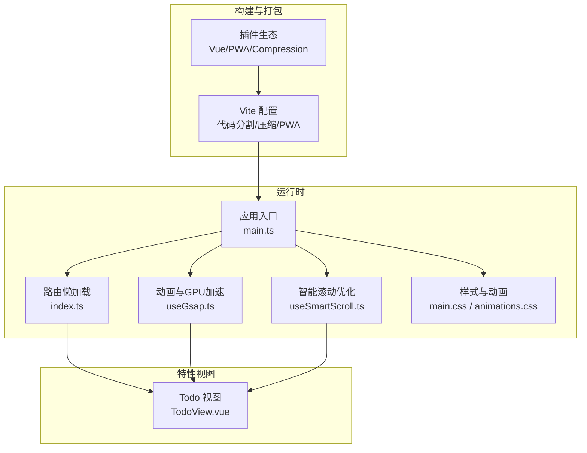
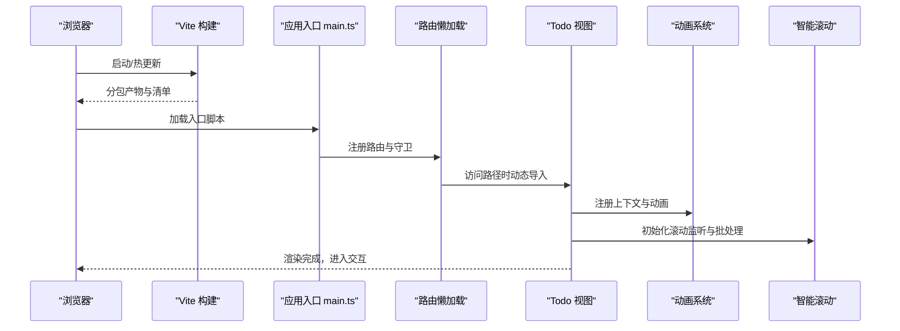
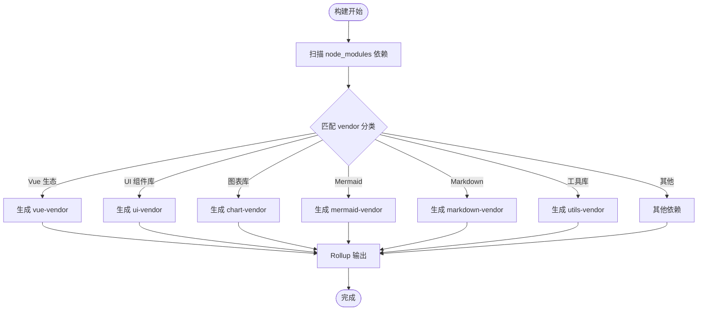
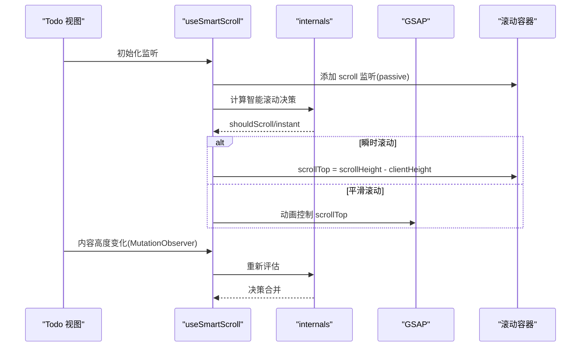
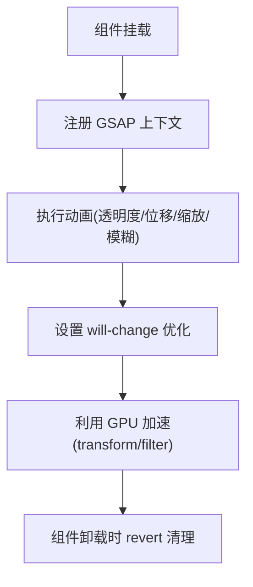
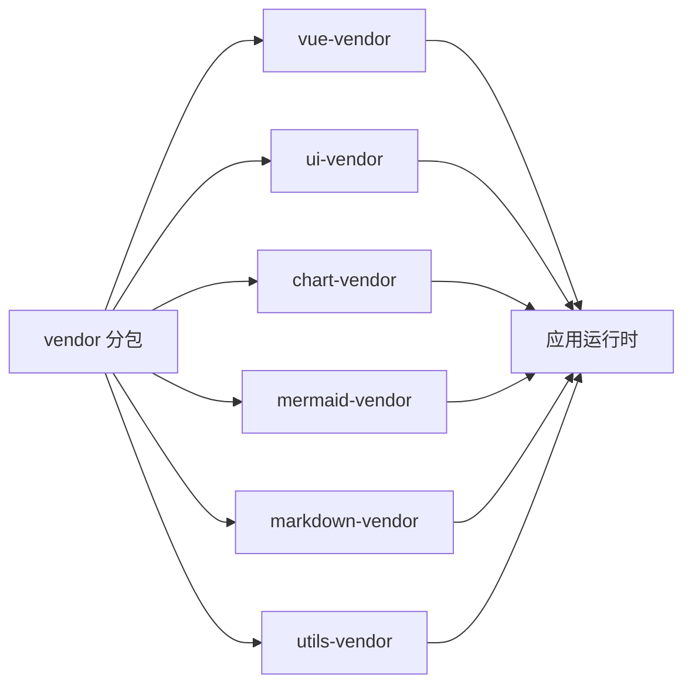

# 性能优化

<cite>
**本文引用的文件**
- [apps/frontend/vite.config.mts](file://apps/frontend/vite.config.mts)
- [apps/frontend/package.json](file://apps/frontend/package.json)
- [apps/frontend/src/main.ts](file://apps/frontend/src/main.ts)
- [apps/frontend/src/router/index.ts](file://apps/frontend/src/router/index.ts)
- [apps/frontend/src/composables/useGsap.ts](file://apps/frontend/src/composables/useGsap.ts)
- [apps/frontend/src/composables/useSmartScroll.ts](file://apps/frontend/src/composables/useSmartScroll.ts)
- [apps/frontend/src/composables/useSmartScroll.internals.ts](file://apps/frontend/src/composables/useSmartScroll.internals.ts)
- [apps/frontend/src/composables/useWindowSize.ts](file://apps/frontend/src/composables/useWindowSize.ts)
- [apps/frontend/src/composables/useRequest.ts](file://apps/frontend/src/composables/useRequest.ts)
- [apps/frontend/src/styles/main.css](file://apps/frontend/src/styles/main.css)
- [apps/frontend/src/styles/animations.css](file://apps/frontend/src/styles/animations.css)
- [apps/frontend/src/features/todo/TodoView.vue](file://apps/frontend/src/features/todo/TodoView.vue)
</cite>

## 目录
1. [简介](#简介)
2. [项目结构](#项目结构)
3. [核心组件](#核心组件)
4. [架构总览](#架构总览)
5. [详细组件分析](#详细组件分析)
6. [依赖分析](#依赖分析)
7. [性能考量](#性能考量)
8. [故障排查指南](#故障排查指南)
9. [结论](#结论)
10. [附录](#附录)

## 简介
本文件聚焦 Lumina Todo 前端性能优化策略与最佳实践，覆盖代码分割与懒加载、组件渲染优化、虚拟滚动技术、缓存与预加载、动画与 GPU 加速、性能监控与分析工具、构建与打包优化、以及内存与垃圾回收优化。文档以仓库现有实现为基础，结合可视化图示帮助读者快速理解与落地。

## 项目结构
前端位于 apps/frontend，采用 Vite + Vue 3 技术栈，配合 PWA、压缩与分包策略；路由基于 Vue Router 实现懒加载；动画通过 GSAP 与 CSS 动画协同；滚动优化通过自研 SmartScroll Hook 与 RAF 批处理/节流实现；全局错误处理与动态导入回退保障稳定性。

**图表来源**
- [apps/frontend/vite.config.mts:80-184](file://apps/frontend/vite.config.mts#L80-L184)
- [apps/frontend/src/main.ts:54-138](file://apps/frontend/src/main.ts#L54-L138)
- [apps/frontend/src/router/index.ts:7-54](file://apps/frontend/src/router/index.ts#L7-L54)
- [apps/frontend/src/composables/useGsap.ts:1-20](file://apps/frontend/src/composables/useGsap.ts#L1-L20)
- [apps/frontend/src/composables/useSmartScroll.ts:33-441](file://apps/frontend/src/composables/useSmartScroll.ts#L33-L441)
- [apps/frontend/src/styles/main.css:1-7](file://apps/frontend/src/styles/main.css#L1-L7)
- [apps/frontend/src/styles/animations.css:1-159](file://apps/frontend/src/styles/animations.css#L1-L159)
- [apps/frontend/src/features/todo/TodoView.vue:1-466](file://apps/frontend/src/features/todo/TodoView.vue#L1-L466)

**章节来源**
- [apps/frontend/vite.config.mts:1-185](file://apps/frontend/vite.config.mts#L1-L185)
- [apps/frontend/src/main.ts:1-138](file://apps/frontend/src/main.ts#L1-L138)
- [apps/frontend/src/router/index.ts:1-73](file://apps/frontend/src/router/index.ts#L1-L73)

## 核心组件
- 代码分割与懒加载：通过 Vite 的 getManualChunk 与路由动态导入实现 vendor 与业务包分离，降低首屏体积与提升缓存命中率。
- 智能滚动优化：useSmartScroll 结合 RAF 批处理、节流、GSAP 平滑滚动与“程序化滚动标记”，在高频更新场景下保持流畅体验。
- 动画与 GPU 加速：useGsap 注册上下文并在组件卸载时自动清理；TodoView 中使用 GSAP 与 will-change/transform 优化，配合 CSS 动画实现轻量过渡。
- 缓存与预加载：VitePWA 提供 Service Worker 与清单，结合路由懒加载与静态资源指纹化，减少重复下载。
- 全局错误处理：对动态导入失败与 ResizeObserver 常见问题进行兜底，避免白屏与无限刷新。
- 构建优化：Gzip/Brotli 双压缩、chunkSizeWarningLimit 警告阈值调整、别名与代理配置优化开发体验。

**章节来源**
- [apps/frontend/vite.config.mts:23-78](file://apps/frontend/vite.config.mts#L23-L78)
- [apps/frontend/src/router/index.ts:14-52](file://apps/frontend/src/router/index.ts#L14-L52)
- [apps/frontend/src/composables/useSmartScroll.ts:164-195](file://apps/frontend/src/composables/useSmartScroll.ts#L164-L195)
- [apps/frontend/src/composables/useGsap.ts:7-19](file://apps/frontend/src/composables/useGsap.ts#L7-L19)
- [apps/frontend/src/main.ts:59-113](file://apps/frontend/src/main.ts#L59-L113)

## 架构总览
下图展示前端启动、路由与懒加载、动画与滚动优化、构建与缓存的整体流程。

**图表来源**
- [apps/frontend/vite.config.mts:80-184](file://apps/frontend/vite.config.mts#L80-L184)
- [apps/frontend/src/main.ts:54-138](file://apps/frontend/src/main.ts#L54-L138)
- [apps/frontend/src/router/index.ts:7-54](file://apps/frontend/src/router/index.ts#L7-L54)
- [apps/frontend/src/features/todo/TodoView.vue:24-56](file://apps/frontend/src/features/todo/TodoView.vue#L24-L56)
- [apps/frontend/src/composables/useSmartScroll.ts:304-342](file://apps/frontend/src/composables/useSmartScroll.ts#L304-L342)

## 详细组件分析

### 代码分割与懒加载
- Vite 手动分包策略：按依赖来源拆分为 vue-vendor、ui-vendor、chart-vendor、mermaid-vendor、markdown-vendor、utils-vendor 等，提升缓存复用与并行加载效率。
- 路由懒加载：TodoView、AI 助手抽屉、统计/可视化组件均通过 defineAsyncComponent 或路由级动态导入实现按需加载。
- 构建警告阈值：chunkSizeWarningLimit 提升至 2MB，便于在大包出现时提前预警。

**图表来源**
- [apps/frontend/vite.config.mts:23-78](file://apps/frontend/vite.config.mts#L23-L78)
- [apps/frontend/src/router/index.ts:14-52](file://apps/frontend/src/router/index.ts#L14-L52)
- [apps/frontend/src/features/todo/TodoView.vue:26-28](file://apps/frontend/src/features/todo/TodoView.vue#L26-L28)

**章节来源**
- [apps/frontend/vite.config.mts:23-78](file://apps/frontend/vite.config.mts#L23-L78)
- [apps/frontend/src/router/index.ts:14-52](file://apps/frontend/src/router/index.ts#L14-L52)
- [apps/frontend/src/features/todo/TodoView.vue:26-28](file://apps/frontend/src/features/todo/TodoView.vue#L26-L28)

### 组件渲染优化与虚拟滚动
- 按需渲染与 KeepAlive：TodoView 对三个核心视图（列表/可视化/统计）使用 KeepAlive 包裹，减少重复挂载成本。
- 视图切换动画：通过 Transition + GSAP 实现入场/离场的 will-change 与滤镜优化，避免布局抖动。
- 智能滚动与高频更新：useSmartScroll 采用 RAF 批处理与节流，合并多次滚动计算，GSAP 控制平滑滚动，避免主线程阻塞。
- 内容变更监听：MutationObserver 监听 DOM 高度变化，结合 isAtBottom 判定与“程序化滚动标记”避免误触用户交互。

**图表来源**
- [apps/frontend/src/composables/useSmartScroll.ts:304-342](file://apps/frontend/src/composables/useSmartScroll.ts#L304-L342)
- [apps/frontend/src/composables/useSmartScroll.internals.ts:28-64](file://apps/frontend/src/composables/useSmartScroll.internals.ts#L28-L64)
- [apps/frontend/src/features/todo/TodoView.vue:358-421](file://apps/frontend/src/features/todo/TodoView.vue#L358-L421)

**章节来源**
- [apps/frontend/src/features/todo/TodoView.vue:411-421](file://apps/frontend/src/features/todo/TodoView.vue#L411-L421)
- [apps/frontend/src/composables/useSmartScroll.ts:164-195](file://apps/frontend/src/composables/useSmartScroll.ts#L164-L195)
- [apps/frontend/src/composables/useSmartScroll.internals.ts:66-109](file://apps/frontend/src/composables/useSmartScroll.internals.ts#L66-L109)

### 动画性能优化与 GPU 加速
- 动画上下文：useGsap 注册 GSAP 上下文，在组件卸载时自动 revert，避免泄漏与残留动画。
- 视图层动画：TodoView 使用 GSAP 控制透明度、位移、缩放与模糊，配合 will-change 与 transform 优化，减少重排与重绘。
- CSS 动画：animations.css 定义轻量级 shimmer/pulse/spin 等动画，适合占位与反馈场景，不占用 JS 主线程。
- 3D 效果：卡片倾斜与透视通过 transform 与 will-change 实现，避免复杂滤镜带来的 GPU 压力。

**图表来源**
- [apps/frontend/src/composables/useGsap.ts:7-19](file://apps/frontend/src/composables/useGsap.ts#L7-L19)
- [apps/frontend/src/features/todo/TodoView.vue:34-56](file://apps/frontend/src/features/todo/TodoView.vue#L34-L56)
- [apps/frontend/src/styles/animations.css:1-159](file://apps/frontend/src/styles/animations.css#L1-L159)

**章节来源**
- [apps/frontend/src/composables/useGsap.ts:1-20](file://apps/frontend/src/composables/useGsap.ts#L1-L20)
- [apps/frontend/src/features/todo/TodoView.vue:34-56](file://apps/frontend/src/features/todo/TodoView.vue#L34-L56)
- [apps/frontend/src/styles/animations.css:1-159](file://apps/frontend/src/styles/animations.css#L1-L159)

### 缓存策略与资源预加载
- PWA 与 Service Worker：VitePWA 自动生成清单与 SW，支持离线缓存与自动更新，结合静态资源指纹化提升缓存命中。
- 资源压缩：同时启用 gzip 与 brotli 压缩，显著降低传输体积。
- 路由懒加载：按需加载模块，减少首屏 JS 体积，配合 vendor 分包提升缓存复用。
- 样式组织：main.css 按需引入主题、动画、markdown、vendor 与 UI 样式，避免一次性加载过多无关样式。

**章节来源**
- [apps/frontend/vite.config.mts:104-147](file://apps/frontend/vite.config.mts#L104-L147)
- [apps/frontend/src/styles/main.css:1-7](file://apps/frontend/src/styles/main.css#L1-L7)

### 性能监控与分析工具
- 构建阶段：VitePWA 与压缩插件输出产物与清单，便于分析体积与缓存命中情况。
- 运行时：全局错误处理捕获动态导入失败与 ResizeObserver 问题，避免白屏；路由守卫中可扩展性能指标埋点（如页面停留时长、首屏时间）。
- 建议：结合浏览器性能面板（记录合成帧、JS 执行时间、布局/绘制耗时）与 Lighthouse 进行持续评估。

**章节来源**
- [apps/frontend/src/main.ts:59-113](file://apps/frontend/src/main.ts#L59-L113)
- [apps/frontend/src/router/index.ts:56-70](file://apps/frontend/src/router/index.ts#L56-L70)

### 构建优化与打包策略
- 分包策略：getManualChunk 明确划分 vendor 类型，降低缓存失效范围。
- 压缩策略：gzip/brotli 双通道，阈值与算法可调，平衡压缩比与 CPU 开销。
- 别名与代理：@ 别名指向 src，开发代理到后端服务，减少跨域与网络延迟。
- 环境变量：IS_WAILS 与 BASE_URL 控制路由历史模式与静态资源路径，适配多端部署。

**章节来源**
- [apps/frontend/vite.config.mts:16-21](file://apps/frontend/vite.config.mts#L16-L21)
- [apps/frontend/vite.config.mts:148-174](file://apps/frontend/vite.config.mts#L148-L174)
- [apps/frontend/package.json:9-29](file://apps/frontend/package.json#L9-L29)

### 内存管理与垃圾回收优化
- 动画上下文清理：useGsap 在卸载时 revert，避免动画队列与回调泄漏。
- 滚动监听清理：useSmartScroll 在卸载时移除事件、停止 RAF、清理 MutationObserver/ResizeObserver，防止内存泄漏。
- 全局错误处理：对动态导入失败与常见运行时错误进行兜底，避免异常导致的资源未释放。
- 请求状态管理：useRequest 统一封装加载/错误状态，避免重复请求与悬挂状态引发的内存压力。

**章节来源**
- [apps/frontend/src/composables/useGsap.ts:10-12](file://apps/frontend/src/composables/useGsap.ts#L10-L12)
- [apps/frontend/src/composables/useSmartScroll.ts:347-370](file://apps/frontend/src/composables/useSmartScroll.ts#L347-L370)
- [apps/frontend/src/main.ts:59-113](file://apps/frontend/src/main.ts#L59-L113)
- [apps/frontend/src/composables/useRequest.ts:1-45](file://apps/frontend/src/composables/useRequest.ts#L1-L45)

## 依赖分析
- 运行时依赖：Vue 3、Vue Router、Pinia、@tanstack/vue-query、GSAP、ECharts、Mermaid、Socket.IO、Tailwind 系列等。
- 构建依赖：Vite、@vitejs/plugin-vue、vite-plugin-pwa、vite-plugin-compression。
- 通过 vendor 分包策略将第三方库拆分，降低单包体积，提升缓存命中与并行加载能力。

**图表来源**
- [apps/frontend/vite.config.mts:23-78](file://apps/frontend/vite.config.mts#L23-L78)

**章节来源**
- [apps/frontend/vite.config.mts:23-78](file://apps/frontend/vite.config.mts#L23-L78)
- [apps/frontend/package.json:30-69](file://apps/frontend/package.json#L30-L69)

## 性能考量
- 首屏与交互：路由懒加载 + vendor 分包 + PWA 缓存，显著缩短首屏与交互可用时间。
- 高频更新：useSmartScroll 的 RAF 批处理与节流、GSAP 平滑滚动，保证消息流或列表频繁插入时的顺滑体验。
- 动画与 GPU：优先使用 transform/opacity 与 will-change，配合 CSS 动画与 GSAP，减少主线程压力。
- 网络与缓存：Brotli/gzip 压缩与 PWA 清单，结合静态资源指纹化，提升缓存命中与传输效率。
- 错误与回退：动态导入失败与 ResizeObserver 问题的全局兜底，避免白屏与无限刷新。

## 故障排查指南
- 动态导入失败：当新部署导致 chunk 名称变化时，全局错误处理器会尝试刷新页面；若短时间内多次失败，建议手动刷新或检查 CDN 缓存。
- ResizeObserver 错误：忽略 ResizeObserver 循环限制相关错误，不影响功能；如出现卡顿，检查是否存在大量 ResizeObserver 监听未清理。
- 路由跳转慢：确认目标路由组件是否已懒加载；检查网络状况与 PWA 缓存命中情况。
- 滚动卡顿：检查 MutationObserver 与滚动事件是否过多；必要时减少监听粒度或延后初始化。

**章节来源**
- [apps/frontend/src/main.ts:59-113](file://apps/frontend/src/main.ts#L59-L113)
- [apps/frontend/src/composables/useSmartScroll.ts:304-342](file://apps/frontend/src/composables/useSmartScroll.ts#L304-L342)

## 结论
Lumina Todo 的前端性能优化围绕“分包与懒加载、智能滚动、动画与 GPU 加速、缓存与预加载、全局错误兜底、构建与打包优化、内存与 GC 管理”七大维度展开。通过 Vite 的精细分包策略、路由与组件级懒加载、useSmartScroll 的 RAF 批处理与节流、GSAP 与 CSS 动画的协同，以及 PWA 与压缩插件的配合，整体实现了更快的首屏、更顺滑的交互与更高的稳定性。后续可在路由守卫中扩展性能指标埋点，并持续使用浏览器性能面板与 Lighthouse 进行回归评估。

## 附录
- 术语
  - vendor 分包：将第三方依赖按类别拆分为独立 chunk，提升缓存复用与并行加载效率。
  - RAF 批处理/节流：在下一帧批量执行或限流处理，避免主线程阻塞。
  - will-change：提示浏览器某元素即将改变，以便启用相应优化（如合成层）。
  - PWA：通过 Service Worker 与清单实现离线缓存与自动更新。