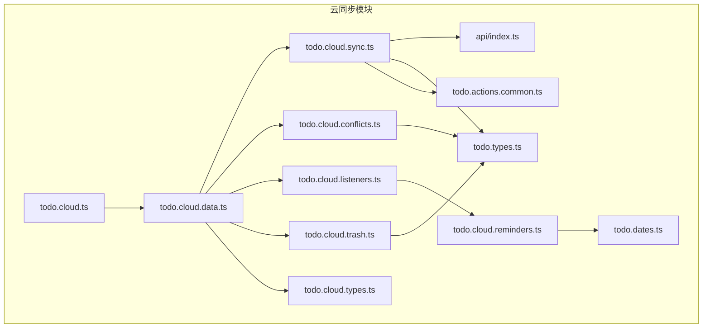
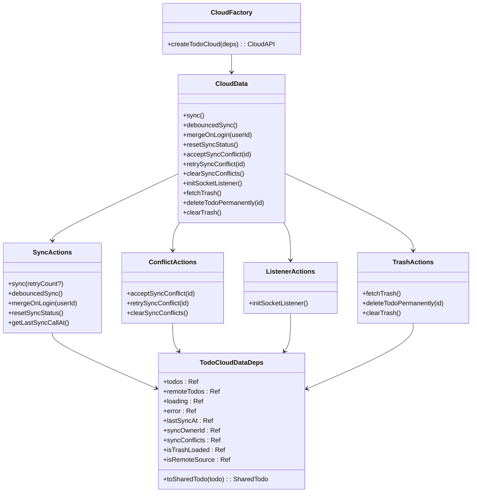
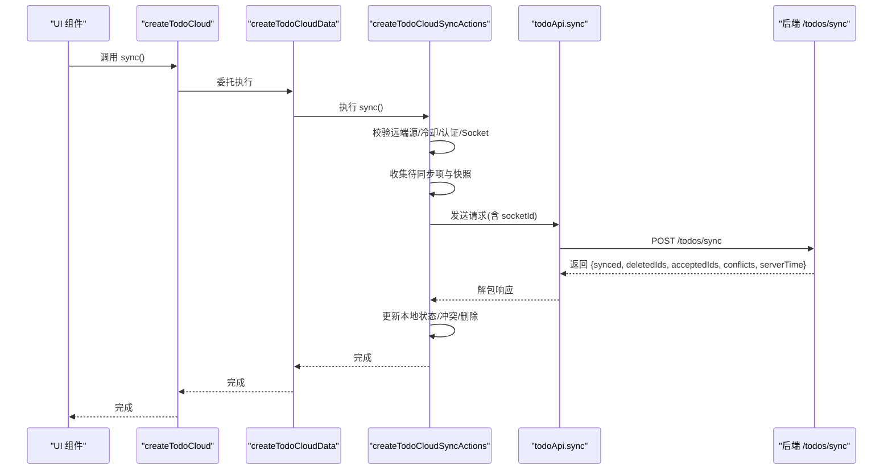
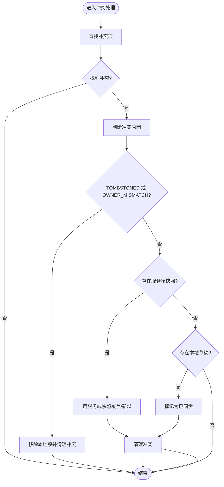
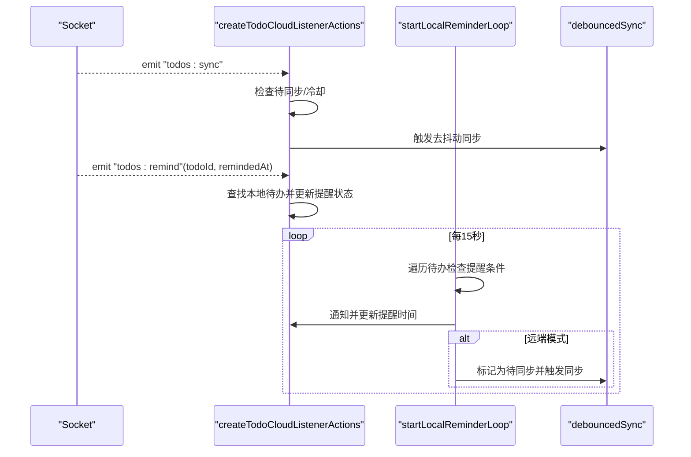
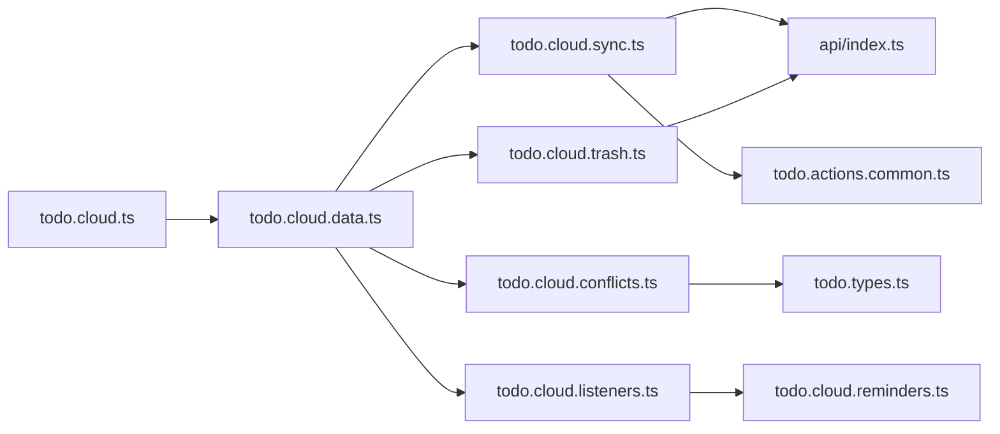

# 云端同步状态

<cite>
**本文引用的文件**
- [apps/frontend/src/features/todo/stores/todo.cloud.ts](file://apps/frontend/src/features/todo/stores/todo.cloud.ts)
- [apps/frontend/src/features/todo/stores/todo.cloud.data.ts](file://apps/frontend/src/features/todo/stores/todo.cloud.data.ts)
- [apps/frontend/src/features/todo/stores/todo.cloud.sync.ts](file://apps/frontend/src/features/todo/stores/todo.cloud.sync.ts)
- [apps/frontend/src/features/todo/stores/todo.cloud.conflicts.ts](file://apps/frontend/src/features/todo/stores/todo.cloud.conflicts.ts)
- [apps/frontend/src/features/todo/stores/todo.cloud.listeners.ts](file://apps/frontend/src/features/todo/stores/todo.cloud.listeners.ts)
- [apps/frontend/src/features/todo/stores/todo.cloud.reminders.ts](file://apps/frontend/src/features/todo/stores/todo.cloud.reminders.ts)
- [apps/frontend/src/features/todo/stores/todo.cloud.trash.ts](file://apps/frontend/src/features/todo/stores/todo.cloud.trash.ts)
- [apps/frontend/src/features/todo/stores/todo.cloud.types.ts](file://apps/frontend/src/features/todo/stores/todo.cloud.types.ts)
- [apps/frontend/src/features/todo/stores/todo.types.ts](file://apps/frontend/src/features/todo/stores/todo.types.ts)
- [apps/frontend/src/features/todo/stores/todo.dates.ts](file://apps/frontend/src/features/todo/stores/todo.dates.ts)
- [apps/frontend/src/features/todo/stores/todo.actions.common.ts](file://apps/frontend/src/features/todo/stores/todo.actions.common.ts)
- [apps/frontend/src/features/todo/api/index.ts](file://apps/frontend/src/features/todo/api/index.ts)
- [apps/frontend/tests/features/todo/stores/todo.cloud.reminders.spec.ts](file://apps/frontend/tests/features/todo/stores/todo.cloud.reminders.spec.ts)
</cite>

## 目录
1. [简介](#简介)
2. [项目结构](#项目结构)
3. [核心组件](#核心组件)
4. [架构总览](#架构总览)
5. [详细组件分析](#详细组件分析)
6. [依赖关系分析](#依赖关系分析)
7. [性能考量](#性能考量)
8. [故障排除指南](#故障排除指南)
9. [结论](#结论)
10. [附录](#附录)

## 简介
本文件系统性阐述 todo.cloud.* 系列模块的云端同步状态管理机制，覆盖以下主题：
- 数据同步生命周期：从触发到完成、重试与冷却控制
- 冲突解决策略：三类冲突原因及用户决策流程
- 离线缓存与持久化：本地状态与远端状态的协调与一致性
- 同步监听器与事件处理：Socket 事件驱动的增量同步与提醒
- 垃圾回收与数据清理：回收站拉取、永久删除与清空
- 提醒功能的状态管理：本地提醒循环与远程同步联动
- 调试与故障排除：错误分类、重试策略与常见问题定位

## 项目结构
todo.cloud.* 文件位于前端 todo 功能域的 stores 目录下，围绕 Todo 的云端同步与本地状态管理形成清晰分层：
- 入口工厂：创建云同步能力的聚合器
- 数据层：将各子功能模块组合为统一的数据依赖对象
- 同步层：负责与后端 API 交互、状态更新与冲突构建
- 冲突层：冲突展示、接受与重试
- 监听层：Socket 事件订阅与本地提醒循环
- 回收站层：回收站数据拉取与清理
- 类型与工具：共享类型定义与日期/克隆等工具函数
- API 层：对后端 /todos 接口的封装

图表来源
- [apps/frontend/src/features/todo/stores/todo.cloud.ts:1-44](file://apps/frontend/src/features/todo/stores/todo.cloud.ts#L1-L44)
- [apps/frontend/src/features/todo/stores/todo.cloud.data.ts:1-43](file://apps/frontend/src/features/todo/stores/todo.cloud.data.ts#L1-L43)
- [apps/frontend/src/features/todo/stores/todo.cloud.sync.ts:1-214](file://apps/frontend/src/features/todo/stores/todo.cloud.sync.ts#L1-L214)
- [apps/frontend/src/features/todo/stores/todo.cloud.conflicts.ts:1-91](file://apps/frontend/src/features/todo/stores/todo.cloud.conflicts.ts#L1-L91)
- [apps/frontend/src/features/todo/stores/todo.cloud.listeners.ts:1-90](file://apps/frontend/src/features/todo/stores/todo.cloud.listeners.ts#L1-L90)
- [apps/frontend/src/features/todo/stores/todo.cloud.reminders.ts:1-40](file://apps/frontend/src/features/todo/stores/todo.cloud.reminders.ts#L1-L40)
- [apps/frontend/src/features/todo/stores/todo.cloud.trash.ts:1-81](file://apps/frontend/src/features/todo/stores/todo.cloud.trash.ts#L1-L81)
- [apps/frontend/src/features/todo/stores/todo.cloud.types.ts:1-17](file://apps/frontend/src/features/todo/stores/todo.cloud.types.ts#L1-L17)
- [apps/frontend/src/features/todo/stores/todo.types.ts:1-68](file://apps/frontend/src/features/todo/stores/todo.types.ts#L1-L68)
- [apps/frontend/src/features/todo/stores/todo.dates.ts:1-56](file://apps/frontend/src/features/todo/stores/todo.dates.ts#L1-L56)
- [apps/frontend/src/features/todo/stores/todo.actions.common.ts:1-84](file://apps/frontend/src/features/todo/stores/todo.actions.common.ts#L1-L84)
- [apps/frontend/src/features/todo/api/index.ts:1-62](file://apps/frontend/src/features/todo/api/index.ts#L1-L62)

章节来源
- [apps/frontend/src/features/todo/stores/todo.cloud.ts:1-44](file://apps/frontend/src/features/todo/stores/todo.cloud.ts#L1-L44)
- [apps/frontend/src/features/todo/stores/todo.cloud.data.ts:1-43](file://apps/frontend/src/features/todo/stores/todo.cloud.data.ts#L1-L43)

## 核心组件
- 云同步入口工厂：对外暴露同步、冲突处理、监听初始化、回收站操作等方法，并将内部状态通过 Ref 暴露给上层组件使用
- 数据依赖接口：统一 Todos 列表、远端 Todos、加载/错误状态、最后同步时间、同步所有者 ID、冲突列表、是否已加载回收站、是否远端源等
- 同步动作：带冷却与指数退避重试；根据服务端返回更新本地状态、冲突列表与删除集合
- 冲突动作：接受冲突（含删除与覆盖）、重试冲突（基于本地草稿重建版本）
- 监听动作：Socket 订阅 todos:sync 与 todos:remind 事件；本地定时检查提醒并触发同步
- 回收站动作：按需拉取远端回收站、永久删除与清空
- 类型与工具：统一 Todo 结构、冲突原因枚举、日期转换与深拷贝、服务端映射

章节来源
- [apps/frontend/src/features/todo/stores/todo.cloud.ts:6-44](file://apps/frontend/src/features/todo/stores/todo.cloud.ts#L6-L44)
- [apps/frontend/src/features/todo/stores/todo.cloud.types.ts:5-16](file://apps/frontend/src/features/todo/stores/todo.cloud.types.ts#L5-L16)
- [apps/frontend/src/features/todo/stores/todo.types.ts:3-29](file://apps/frontend/src/features/todo/stores/todo.types.ts#L3-L29)
- [apps/frontend/src/features/todo/stores/todo.dates.ts:3-51](file://apps/frontend/src/features/todo/stores/todo.dates.ts#L3-L51)
- [apps/frontend/src/features/todo/stores/todo.actions.common.ts:27-51](file://apps/frontend/src/features/todo/stores/todo.actions.common.ts#L27-L51)

## 架构总览
todo.cloud.* 将“状态”“动作”“监听”“工具”解耦，通过依赖注入的方式在数据层聚合，形成可测试、可维护的模块化架构。

图表来源
- [apps/frontend/src/features/todo/stores/todo.cloud.ts:6-44](file://apps/frontend/src/features/todo/stores/todo.cloud.ts#L6-L44)
- [apps/frontend/src/features/todo/stores/todo.cloud.data.ts:7-42](file://apps/frontend/src/features/todo/stores/todo.cloud.data.ts#L7-L42)
- [apps/frontend/src/features/todo/stores/todo.cloud.sync.ts:25-213](file://apps/frontend/src/features/todo/stores/todo.cloud.sync.ts#L25-L213)
- [apps/frontend/src/features/todo/stores/todo.cloud.conflicts.ts:21-90](file://apps/frontend/src/features/todo/stores/todo.cloud.conflicts.ts#L21-L90)
- [apps/frontend/src/features/todo/stores/todo.cloud.listeners.ts:7-89](file://apps/frontend/src/features/todo/stores/todo.cloud.listeners.ts#L7-L89)
- [apps/frontend/src/features/todo/stores/todo.cloud.trash.ts:5-80](file://apps/frontend/src/features/todo/stores/todo.cloud.trash.ts#L5-L80)
- [apps/frontend/src/features/todo/stores/todo.cloud.types.ts:5-16](file://apps/frontend/src/features/todo/stores/todo.cloud.types.ts#L5-L16)

## 详细组件分析

### 同步生命周期与冷却控制
- 触发条件：仅当处于远端源且未在加载中时允许同步；若距离上次调用小于冷却时间则跳过
- 认证与连接：在执行前确保认证状态可用，并等待 Socket 连接建立
- 待同步集合：筛选非“已同步”的本地待办，生成快照时间用于后续一致性校验
- 请求与响应：向 /todos/sync 发送待同步列表与上次同步时间，接收服务端返回的已同步、删除、接受、冲突与服务器时间
- 状态更新：
  - 对于被接受或无冲突且无明确接受列表时，标记为“已同步”
  - 对于冲突项，构建冲突对象并加入冲突列表
  - 对于服务端下发的新数据，进行本地合并（存在则覆盖，不存在则新增）
  - 对于删除集合，移除本地对应项并清理冲突
- 错误处理：动态导入 Socket 模块失败时区分“新部署导致的模块加载失败”，提示版本更新；否则最多三次指数退避重试，超过阈值设置错误码
- 最终状态：更新最后同步时间，清除错误，恢复加载态

图表来源
- [apps/frontend/src/features/todo/stores/todo.cloud.sync.ts:36-181](file://apps/frontend/src/features/todo/stores/todo.cloud.sync.ts#L36-L181)
- [apps/frontend/src/features/todo/api/index.ts:8-20](file://apps/frontend/src/features/todo/api/index.ts#L8-L20)

章节来源
- [apps/frontend/src/features/todo/stores/todo.cloud.sync.ts:36-181](file://apps/frontend/src/features/todo/stores/todo.cloud.sync.ts#L36-L181)

### 冲突解决策略
- 冲突构建：根据服务端冲突信息与本地草稿/服务端快照构造冲突对象
- 接受冲突：
  - 若原因为“墓碑/所有者不匹配”，直接从本地移除该项并清理冲突
  - 若存在服务端快照，则用服务端快照覆盖本地（不存在则新增），随后清理冲突
  - 若无服务端快照但有本地草稿，将本地项标记为“已同步”
- 重试冲突：仅对“版本冲突”生效，使用本地草稿重建版本号、更新时间与状态，移除冲突并触发一次去抖动同步

图表来源
- [apps/frontend/src/features/todo/stores/todo.cloud.conflicts.ts:33-58](file://apps/frontend/src/features/todo/stores/todo.cloud.conflicts.ts#L33-L58)

章节来源
- [apps/frontend/src/features/todo/stores/todo.cloud.conflicts.ts:6-90](file://apps/frontend/src/features/todo/stores/todo.cloud.conflicts.ts#L6-L90)

### 离线缓存与持久化
- 本地状态：通过 Ref 暴露 todos、remoteTodos、loading、error、lastSyncAt、syncConflicts、isTrashLoaded、isRemoteSource 等，便于组件响应式更新
- 本地快照：在发起同步前对待同步项生成快照时间，用于后续一致性校验（若本地项在此期间被修改则跳过标记）
- 服务端映射：将服务端 Todo 映射为本地 Todo，统一日期字段与同步状态
- 日期规范化：提供 toDate 与 cloneTodo 工具，确保日期字段稳定与深拷贝安全
- 持久化建议：当前模块未直接写入持久存储；可通过上层组件在 todos 变更时自行持久化；lastSyncAt 可作为下次增量同步的起点

章节来源
- [apps/frontend/src/features/todo/stores/todo.cloud.sync.ts:78-113](file://apps/frontend/src/features/todo/stores/todo.cloud.sync.ts#L78-L113)
- [apps/frontend/src/features/todo/stores/todo.actions.common.ts:27-51](file://apps/frontend/src/features/todo/stores/todo.actions.common.ts#L27-L51)
- [apps/frontend/src/features/todo/stores/todo.dates.ts:3-51](file://apps/frontend/src/features/todo/stores/todo.dates.ts#L3-L51)

### 同步监听器与事件处理
- Socket 订阅：
  - todos:sync：当远端有变更时，若存在待同步项或距离上次同步超过冷却时间，则触发去抖动同步
  - todos:remind：收到提醒事件后，若本地存在对应未完成/未提醒的待办，则更新提醒时间戳与同步状态
- 本地提醒循环：每 15 秒扫描一次，若到达提醒时间且未提醒过，则触发通知、更新提醒时间与本地更新时间；在远端模式下同时标记为“待同步”并触发去抖动同步
- 认证联动：监听认证状态变化，令牌出现时自动重新 attach Socket

图表来源
- [apps/frontend/src/features/todo/stores/todo.cloud.listeners.ts:24-45](file://apps/frontend/src/features/todo/stores/todo.cloud.listeners.ts#L24-L45)
- [apps/frontend/src/features/todo/stores/todo.cloud.reminders.ts:20-38](file://apps/frontend/src/features/todo/stores/todo.cloud.reminders.ts#L20-L38)

章节来源
- [apps/frontend/src/features/todo/stores/todo.cloud.listeners.ts:47-84](file://apps/frontend/src/features/todo/stores/todo.cloud.listeners.ts#L47-L84)
- [apps/frontend/src/features/todo/stores/todo.cloud.reminders.ts:11-39](file://apps/frontend/src/features/todo/stores/todo.cloud.reminders.ts#L11-L39)

### 垃圾回收与数据清理
- 拉取回收站：仅在首次加载且处于远端源时拉取远端回收站，合并到本地 todos 并标记已加载
- 永久删除：递归删除父项及其子项，先从本地移除，再在认证且远端源时调用后端接口
- 清空回收站：本地立即过滤掉已删除项；在认证且远端源时调用后端接口清空

章节来源
- [apps/frontend/src/features/todo/stores/todo.cloud.trash.ts:10-73](file://apps/frontend/src/features/todo/stores/todo.cloud.trash.ts#L10-L73)

### 提醒功能的状态管理
- 本地提醒循环：定时扫描待办，满足提醒条件即触发通知与本地状态更新
- 远端联动：在远端模式下，提醒触发后将本地项标记为“待同步”，并触发一次去抖动同步
- 测试验证：单元测试覆盖了本地提醒不触发同步、远端提醒触发同步的行为

章节来源
- [apps/frontend/src/features/todo/stores/todo.cloud.reminders.ts:11-39](file://apps/frontend/src/features/todo/stores/todo.cloud.reminders.ts#L11-L39)
- [apps/frontend/tests/features/todo/stores/todo.cloud.reminders.spec.ts:48-99](file://apps/frontend/tests/features/todo/stores/todo.cloud.reminders.spec.ts#L48-L99)

## 依赖关系分析
- 模块内聚与耦合：
  - 数据层聚合各子动作，降低上层调用复杂度
  - 同步动作依赖 API 层与通用映射工具
  - 监听动作依赖 Socket 与本地提醒循环
  - 冲突与回收站动作均依赖统一的 Todo 类型与日期工具
- 外部依赖：
  - @lumina/shared：共享 Todo 与同步响应类型
  - i18n 与 useToast：国际化与消息提示
  - httpClient：HTTP 客户端封装
- 潜在环依赖：当前模块未见循环依赖，但注意动态导入与运行时 attach 的顺序

图表来源
- [apps/frontend/src/features/todo/stores/todo.cloud.sync.ts:1-14](file://apps/frontend/src/features/todo/stores/todo.cloud.sync.ts#L1-L14)
- [apps/frontend/src/features/todo/stores/todo.cloud.conflicts.ts:1-4](file://apps/frontend/src/features/todo/stores/todo.cloud.conflicts.ts#L1-L4)
- [apps/frontend/src/features/todo/stores/todo.cloud.trash.ts:1-3](file://apps/frontend/src/features/todo/stores/todo.cloud.trash.ts#L1-L3)
- [apps/frontend/src/features/todo/stores/todo.cloud.listeners.ts:1-5](file://apps/frontend/src/features/todo/stores/todo.cloud.listeners.ts#L1-L5)
- [apps/frontend/src/features/todo/stores/todo.cloud.data.ts:1-6](file://apps/frontend/src/features/todo/stores/todo.cloud.data.ts#L1-L6)
- [apps/frontend/src/features/todo/stores/todo.cloud.ts:1-4](file://apps/frontend/src/features/todo/stores/todo.cloud.ts#L1-L4)

章节来源
- [apps/frontend/src/features/todo/stores/todo.cloud.data.ts:1-43](file://apps/frontend/src/features/todo/stores/todo.cloud.data.ts#L1-L43)

## 性能考量
- 去抖动同步：SYNC_COOLDOWN_MS 控制频繁触发，减少网络与计算压力
- 指数退避重试：最大三次，避免雪崩效应
- 快照一致性：同步前记录 updatedAt 快照，防止并发修改导致的误判
- 本地提醒循环：15 秒轮询，兼顾实时性与资源消耗
- 条件加载：仅在需要时拉取回收站，避免不必要的网络请求

## 故障排除指南
- 版本更新导致的模块加载失败：
  - 现象：动态导入 Socket 模块报错，提示动态模块加载失败
  - 处理：显示“版本已更新”提示，停止本次同步并等待用户刷新
  - 参考路径：[apps/frontend/src/features/todo/stores/todo.cloud.sync.ts:52-72](file://apps/frontend/src/features/todo/stores/todo.cloud.sync.ts#L52-L72)
- 同步失败与重试：
  - 现象：多次同步失败后显示“同步失败”
  - 处理：检查网络、认证状态与 Socket 连接；等待自动重试或手动触发
  - 参考路径：[apps/frontend/src/features/todo/stores/todo.cloud.sync.ts:165-181](file://apps/frontend/src/features/todo/stores/todo.cloud.sync.ts#L165-L181)
- 冲突未解决：
  - 现象：冲突列表持续存在
  - 处理：选择接受或重试；确认本地草稿与服务端版本一致
  - 参考路径：[apps/frontend/src/features/todo/stores/todo.cloud.conflicts.ts:33-83](file://apps/frontend/src/features/todo/stores/todo.cloud.conflicts.ts#L33-L83)
- 回收站不同步：
  - 现象：拉取回收站后本地仍显示旧数据
  - 处理：确认 isRemoteSource 与认证状态；检查 isTrashLoaded 标志
  - 参考路径：[apps/frontend/src/features/todo/stores/todo.cloud.trash.ts:10-39](file://apps/frontend/src/features/todo/stores/todo.cloud.trash.ts#L10-L39)
- 提醒未触发：
  - 现象：到达提醒时间未弹出通知
  - 处理：检查 remindAt/remindedAt 字段与 isRemoteSource；确认本地提醒循环定时器
  - 参考路径：[apps/frontend/src/features/todo/stores/todo.cloud.reminders.ts:20-38](file://apps/frontend/src/features/todo/stores/todo.cloud.reminders.ts#L20-L38)

章节来源
- [apps/frontend/src/features/todo/stores/todo.cloud.sync.ts:52-72](file://apps/frontend/src/features/todo/stores/todo.cloud.sync.ts#L52-L72)
- [apps/frontend/src/features/todo/stores/todo.cloud.conflicts.ts:33-83](file://apps/frontend/src/features/todo/stores/todo.cloud.conflicts.ts#L33-L83)
- [apps/frontend/src/features/todo/stores/todo.cloud.trash.ts:10-39](file://apps/frontend/src/features/todo/stores/todo.cloud.trash.ts#L10-L39)
- [apps/frontend/src/features/todo/stores/todo.cloud.reminders.ts:20-38](file://apps/frontend/src/features/todo/stores/todo.cloud.reminders.ts#L20-L38)

## 结论
todo.cloud.* 模块通过清晰的职责划分与稳健的错误处理，实现了可靠的云端同步状态管理。其关键特性包括：
- 基于冷却与快照的一致性保障
- 完整的冲突建模与用户可控的解决路径
- Socket 事件驱动的增量同步与本地提醒联动
- 回收站的按需拉取与安全清理
- 可测试的模块化设计，便于扩展与维护

## 附录
- 关键类型与字段：
  - Todo：扩展自共享 Todo，增加日期与同步状态字段
  - 冲突原因：TOMBSTONED、OWNER_MISMATCH、VERSION_CONFLICT
  - 同步状态：synced、pending、error
- 常用 API：
  - /todos/sync：同步并合并
  - /todos/trash：获取回收站
  - /todos/{id}/restore：恢复
  - /todos/{id}/permanent：永久删除
  - /todos/trash/clear：清空回收站

章节来源
- [apps/frontend/src/features/todo/stores/todo.types.ts:3-29](file://apps/frontend/src/features/todo/stores/todo.types.ts#L3-L29)
- [apps/frontend/src/features/todo/api/index.ts:8-61](file://apps/frontend/src/features/todo/api/index.ts#L8-L61)