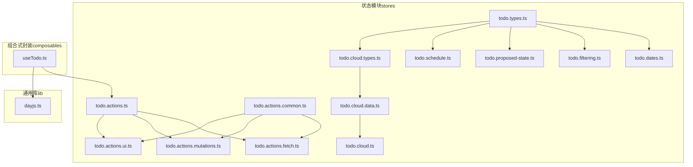
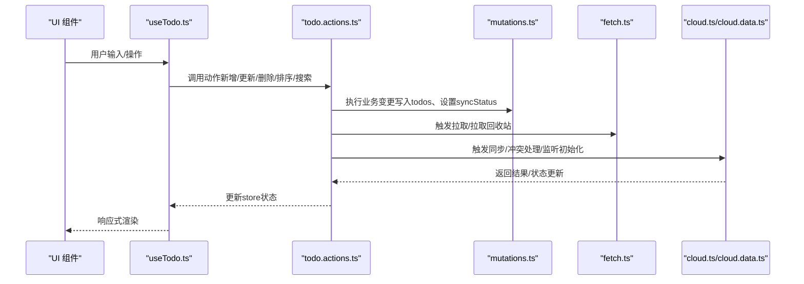
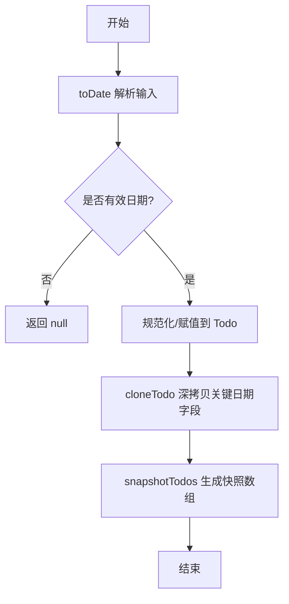
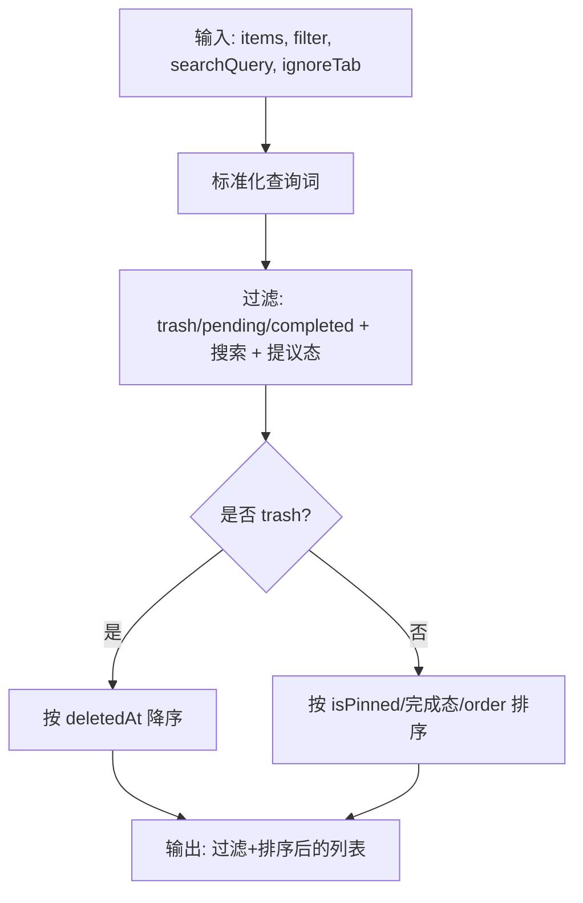
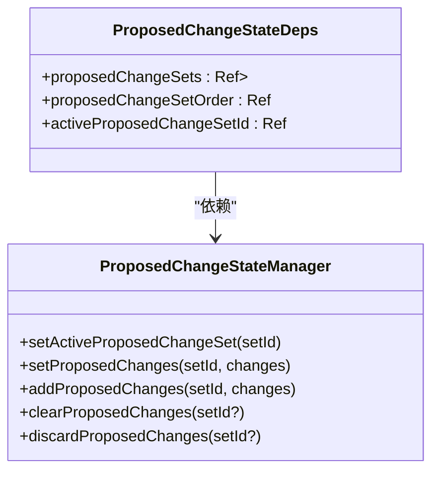
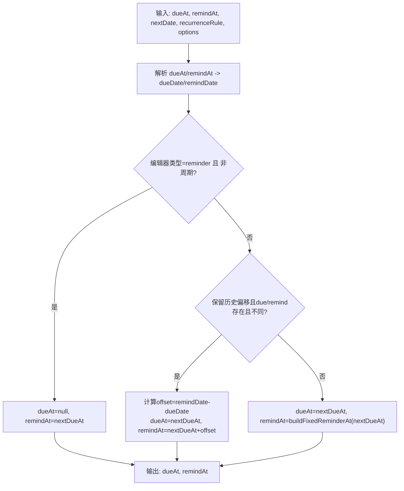
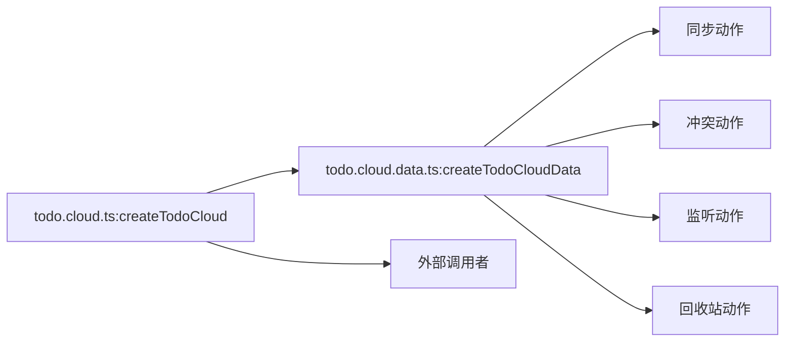
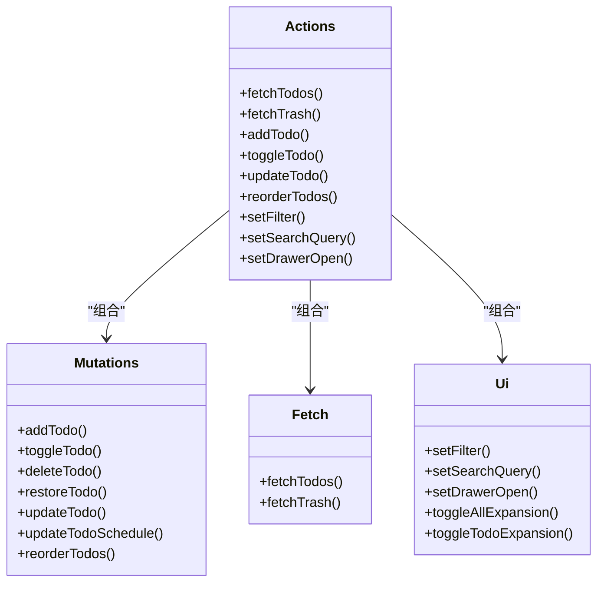
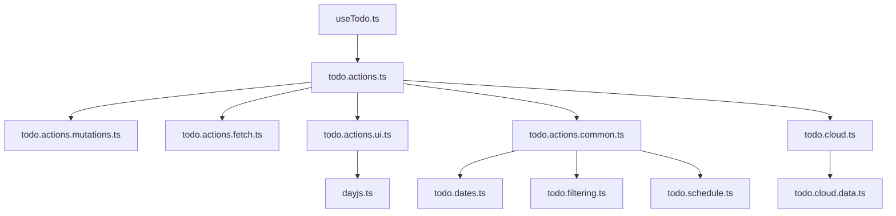

# 工具状态

<cite>
**本文引用的文件**
- [apps/frontend/src/features/todo/stores/todo.dates.ts](file://apps/frontend/src/features/todo/stores/todo.dates.ts)
- [apps/frontend/src/features/todo/stores/todo.filtering.ts](file://apps/frontend/src/features/todo/stores/todo.filtering.ts)
- [apps/frontend/src/features/todo/stores/todo.proposed-state.ts](file://apps/frontend/src/features/todo/stores/todo.proposed-state.ts)
- [apps/frontend/src/features/todo/stores/todo.schedule.ts](file://apps/frontend/src/features/todo/stores/todo.schedule.ts)
- [apps/frontend/src/features/todo/stores/todo.cloud.ts](file://apps/frontend/src/features/todo/stores/todo.cloud.ts)
- [apps/frontend/src/features/todo/stores/todo.cloud.data.ts](file://apps/frontend/src/features/todo/stores/todo.cloud.data.ts)
- [apps/frontend/src/features/todo/stores/todo.cloud.types.ts](file://apps/frontend/src/features/todo/stores/todo.cloud.types.ts)
- [apps/frontend/src/features/todo/stores/todo.types.ts](file://apps/frontend/src/features/todo/stores/todo.types.ts)
- [apps/frontend/src/lib/dayjs.ts](file://apps/frontend/src/lib/dayjs.ts)
- [apps/frontend/src/features/todo/composables/useTodo.ts](file://apps/frontend/src/features/todo/composables/useTodo.ts)
- [apps/frontend/src/features/todo/stores/todo.actions.ts](file://apps/frontend/src/features/todo/stores/todo.actions.ts)
- [apps/frontend/src/features/todo/stores/todo.actions.common.ts](file://apps/frontend/src/features/todo/stores/todo.actions.common.ts)
- [apps/frontend/src/features/todo/stores/todo.actions.mutations.ts](file://apps/frontend/src/features/todo/stores/todo.actions.mutations.ts)
- [apps/frontend/src/features/todo/stores/todo.actions.fetch.ts](file://apps/frontend/src/features/todo/stores/todo.actions.fetch.ts)
- [apps/frontend/src/features/todo/stores/todo.actions.ui.ts](file://apps/frontend/src/features/todo/stores/todo.actions.ui.ts)
</cite>

## 目录
1. [简介](#简介)
2. [项目结构](#项目结构)
3. [核心组件](#核心组件)
4. [架构总览](#架构总览)
5. [详细组件分析](#详细组件分析)
6. [依赖关系分析](#依赖关系分析)
7. [性能考量](#性能考量)
8. [故障排查指南](#故障排查指南)
9. [结论](#结论)
10. [附录](#附录)

## 简介
本文件系统性梳理前端“工具状态”体系，聚焦于任务管理中的辅助状态模块：日期处理、过滤与排序、提议状态、计划调度、云同步与快照、数据源管理。文档从代码级视角解析各模块的职责边界、状态设计、计算与派生属性、模块间协作与数据流，并给出序列化/反序列化机制说明、测试与验证方法以及使用模式与最佳实践。

## 项目结构
围绕“待办事项”功能，状态相关代码主要位于：
- stores：状态定义与动作工厂（日期、过滤、提议、调度、云同步、类型）
- composables：UI层对store的封装与副作用处理
- lib：通用工具（如日期格式化）

**图表来源**
- [apps/frontend/src/features/todo/stores/todo.types.ts:1-68](file://apps/frontend/src/features/todo/stores/todo.types.ts#L1-L68)
- [apps/frontend/src/features/todo/stores/todo.dates.ts:1-56](file://apps/frontend/src/features/todo/stores/todo.dates.ts#L1-L56)
- [apps/frontend/src/features/todo/stores/todo.filtering.ts:1-54](file://apps/frontend/src/features/todo/stores/todo.filtering.ts#L1-L54)
- [apps/frontend/src/features/todo/stores/todo.proposed-state.ts:1-79](file://apps/frontend/src/features/todo/stores/todo.proposed-state.ts#L1-L79)
- [apps/frontend/src/features/todo/stores/todo.schedule.ts:1-98](file://apps/frontend/src/features/todo/stores/todo.schedule.ts#L1-L98)
- [apps/frontend/src/features/todo/stores/todo.cloud.types.ts:1-17](file://apps/frontend/src/features/todo/stores/todo.cloud.types.ts#L1-L17)
- [apps/frontend/src/features/todo/stores/todo.cloud.data.ts:1-43](file://apps/frontend/src/features/todo/stores/todo.cloud.data.ts#L1-L43)
- [apps/frontend/src/features/todo/stores/todo.cloud.ts:1-44](file://apps/frontend/src/features/todo/stores/todo.cloud.ts#L1-L44)
- [apps/frontend/src/features/todo/stores/todo.actions.common.ts:1-84](file://apps/frontend/src/features/todo/stores/todo.actions.common.ts#L1-L84)
- [apps/frontend/src/features/todo/stores/todo.actions.fetch.ts:1-69](file://apps/frontend/src/features/todo/stores/todo.actions.fetch.ts#L1-L69)
- [apps/frontend/src/features/todo/stores/todo.actions.mutations.ts:1-417](file://apps/frontend/src/features/todo/stores/todo.actions.mutations.ts#L1-L417)
- [apps/frontend/src/features/todo/stores/todo.actions.ui.ts:1-95](file://apps/frontend/src/features/todo/stores/todo.actions.ui.ts#L1-L95)
- [apps/frontend/src/features/todo/stores/todo.actions.ts:1-105](file://apps/frontend/src/features/todo/stores/todo.actions.ts#L1-L105)
- [apps/frontend/src/features/todo/composables/useTodo.ts:1-186](file://apps/frontend/src/features/todo/composables/useTodo.ts#L1-L186)
- [apps/frontend/src/lib/dayjs.ts:1-35](file://apps/frontend/src/lib/dayjs.ts#L1-L35)

**章节来源**
- [apps/frontend/src/features/todo/stores/todo.types.ts:1-68](file://apps/frontend/src/features/todo/stores/todo.types.ts#L1-L68)
- [apps/frontend/src/features/todo/stores/todo.actions.ts:1-105](file://apps/frontend/src/features/todo/stores/todo.actions.ts#L1-L105)
- [apps/frontend/src/features/todo/composables/useTodo.ts:1-186](file://apps/frontend/src/features/todo/composables/useTodo.ts#L1-L186)

## 核心组件
- 数据模型与类型：统一的 Todo 类型扩展、过滤类型、视图模式、数据源类型、树形数据结构、提议变更类型、同步冲突类型等。
- 日期处理：安全解析、规范化、深拷贝与快照生成。
- 过滤与排序：支持“待办/完成/回收站”三类过滤、搜索关键字、置顶优先、完成态继承（父子联动）。
- 提议状态：变更集的增删改查、激活集切换、顺序维护。
- 计划调度：到期日/提醒日解析、固定/偏移提醒策略、规则兼容。
- 云同步：分层动作聚合（同步、冲突、监听、回收站），对外暴露统一入口。
- 数据源管理：本地/远程双源标识与切换逻辑。
- UI/动作聚合：获取/变更/排序/搜索/抽屉/展开等UI行为与业务动作的组合。

**章节来源**
- [apps/frontend/src/features/todo/stores/todo.types.ts:1-68](file://apps/frontend/src/features/todo/stores/todo.types.ts#L1-L68)
- [apps/frontend/src/features/todo/stores/todo.dates.ts:1-56](file://apps/frontend/src/features/todo/stores/todo.dates.ts#L1-L56)
- [apps/frontend/src/features/todo/stores/todo.filtering.ts:1-54](file://apps/frontend/src/features/todo/stores/todo.filtering.ts#L1-L54)
- [apps/frontend/src/features/todo/stores/todo.proposed-state.ts:1-79](file://apps/frontend/src/features/todo/stores/todo.proposed-state.ts#L1-L79)
- [apps/frontend/src/features/todo/stores/todo.schedule.ts:1-98](file://apps/frontend/src/features/todo/stores/todo.schedule.ts#L1-L98)
- [apps/frontend/src/features/todo/stores/todo.cloud.ts:1-44](file://apps/frontend/src/features/todo/stores/todo.cloud.ts#L1-L44)
- [apps/frontend/src/features/todo/stores/todo.cloud.data.ts:1-43](file://apps/frontend/src/features/todo/stores/todo.cloud.data.ts#L1-L43)
- [apps/frontend/src/features/todo/stores/todo.actions.ts:1-105](file://apps/frontend/src/features/todo/stores/todo.actions.ts#L1-L105)

## 架构总览
整体采用“类型定义 + 动作工厂 + 组合式封装”的分层设计：
- 类型层：集中定义 Todo 及其扩展字段、过滤/视图/数据源枚举、提议变更与冲突结构。
- 动作层：按职责拆分 fetch/mutations/ui/ai 等动作工厂，统一由 todo.actions.ts 聚合导出。
- 云同步层：todo.cloud.ts 暴露高层接口；内部委托给 cloud.data.ts 的子动作模块。
- 日期/过滤/调度/提议：独立工具函数，被动作层复用。
- UI 层：useTodo.ts 将 store 状态与用户交互绑定，处理错误提示、防抖搜索、全局快捷键等。

**图表来源**
- [apps/frontend/src/features/todo/composables/useTodo.ts:1-186](file://apps/frontend/src/features/todo/composables/useTodo.ts#L1-L186)
- [apps/frontend/src/features/todo/stores/todo.actions.ts:1-105](file://apps/frontend/src/features/todo/stores/todo.actions.ts#L1-L105)
- [apps/frontend/src/features/todo/stores/todo.actions.mutations.ts:1-417](file://apps/frontend/src/features/todo/stores/todo.actions.mutations.ts#L1-L417)
- [apps/frontend/src/features/todo/stores/todo.actions.fetch.ts:1-69](file://apps/frontend/src/features/todo/stores/todo.actions.fetch.ts#L1-L69)
- [apps/frontend/src/features/todo/stores/todo.cloud.ts:1-44](file://apps/frontend/src/features/todo/stores/todo.cloud.ts#L1-L44)
- [apps/frontend/src/features/todo/stores/todo.cloud.data.ts:1-43](file://apps/frontend/src/features/todo/stores/todo.cloud.data.ts#L1-L43)

## 详细组件分析

### 日期处理与快照（todo.dates.ts）
- 安全解析：toDate 对空值、Date、数字、字符串进行容错解析，返回合法日期或空。
- 规范化：normalizeTodoDatesInPlace 将 Todo 的多类时间字段统一为 Date 实例。
- 深拷贝与快照：cloneTodo 对关键日期字段做深拷贝；snapshotTodos 对一组 Todo 做快照备份。
- 序列化/反序列化：通过 Date 构造与 JSON 序列化天然支持；注意时区与精度需在上层统一约定。

**图表来源**
- [apps/frontend/src/features/todo/stores/todo.dates.ts:1-56](file://apps/frontend/src/features/todo/stores/todo.dates.ts#L1-L56)

**章节来源**
- [apps/frontend/src/features/todo/stores/todo.dates.ts:1-56](file://apps/frontend/src/features/todo/stores/todo.dates.ts#L1-L56)

### 过滤与排序（todo.filtering.ts）
- 有效完成态：isEffectivelyCompleted 支持父子联动的完成态继承，确保父节点随子节点完成而完成。
- 过滤与排序：applyFilterAndSort 支持 trash/pending/completed 三类过滤、搜索关键字、置顶优先、完成/未完成优先、order 排序；对提议态（新增/删除）有特殊展示逻辑。

**图表来源**
- [apps/frontend/src/features/todo/stores/todo.filtering.ts:1-54](file://apps/frontend/src/features/todo/stores/todo.filtering.ts#L1-L54)

**章节来源**
- [apps/frontend/src/features/todo/stores/todo.filtering.ts:1-54](file://apps/frontend/src/features/todo/stores/todo.filtering.ts#L1-L54)

### 提议状态管理（todo.proposed-state.ts）
- 状态依赖：proposedChangeSets（按集ID存储变更）、proposedChangeSetOrder（变更集顺序）、activeProposedChangeSetId（当前激活集）。
- 行为接口：设置/追加/清空/丢弃变更集；自动维护激活集与顺序；清空时自动回退到最近的变更集。
- 设计要点：以“变更集”为单位组织提议，便于批量提交/撤销；通过 Ref 暴露响应式状态，便于 UI 绑定。

**图表来源**
- [apps/frontend/src/features/todo/stores/todo.proposed-state.ts:1-79](file://apps/frontend/src/features/todo/stores/todo.proposed-state.ts#L1-L79)

**章节来源**
- [apps/frontend/src/features/todo/stores/todo.proposed-state.ts:1-79](file://apps/frontend/src/features/todo/stores/todo.proposed-state.ts#L1-L79)

### 计划调度（todo.schedule.ts）
- 解析到期日/提醒日：resolveScheduleDate 优先使用 dueAt，否则回退到 remindAt。
- 固定/偏移提醒：buildFixedReminderAt 固定为 dueAt 当天；hasDistinctReminderTime 判断是否与 dueAt 不同；hasLegacyReminderOffset 判断是否保留历史偏移。
- 更新策略：resolveScheduleUpdate 在指定编辑器类型（due/reminder）下，决定如何更新 dueAt/remindAt；当保留历史偏移且 dueAt/remindAt 存在差异时，基于 offset 推算新提醒时间；否则固定为 dueAt 当天。

**图表来源**
- [apps/frontend/src/features/todo/stores/todo.schedule.ts:1-98](file://apps/frontend/src/features/todo/stores/todo.schedule.ts#L1-L98)

**章节来源**
- [apps/frontend/src/features/todo/stores/todo.schedule.ts:1-98](file://apps/frontend/src/features/todo/stores/todo.schedule.ts#L1-L98)

### 云同步与数据源管理（todo.cloud.*）
- 统一入口：createTodoCloud 将云同步能力聚合为 sync、debouncedSync、mergeOnLogin、accept/retry/clear 冲突、socket 监听、永久删除、清空回收站等。
- 分层实现：createTodoCloudData 将同步、冲突、监听、回收站等动作解耦，分别由对应模块提供；todo.cloud.types.ts 定义依赖接口。
- 数据源：通过 isRemoteSource 与 isTrashLoaded 控制是否启用远程数据与回收站加载；toSharedTodo 用于本地与共享模型转换。

**图表来源**
- [apps/frontend/src/features/todo/stores/todo.cloud.ts:1-44](file://apps/frontend/src/features/todo/stores/todo.cloud.ts#L1-L44)
- [apps/frontend/src/features/todo/stores/todo.cloud.data.ts:1-43](file://apps/frontend/src/features/todo/stores/todo.cloud.data.ts#L1-L43)
- [apps/frontend/src/features/todo/stores/todo.cloud.types.ts:1-17](file://apps/frontend/src/features/todo/stores/todo.cloud.types.ts#L1-L17)

**章节来源**
- [apps/frontend/src/features/todo/stores/todo.cloud.ts:1-44](file://apps/frontend/src/features/todo/stores/todo.cloud.ts#L1-L44)
- [apps/frontend/src/features/todo/stores/todo.cloud.data.ts:1-43](file://apps/frontend/src/features/todo/stores/todo.cloud.data.ts#L1-L43)
- [apps/frontend/src/features/todo/stores/todo.cloud.types.ts:1-17](file://apps/frontend/src/features/todo/stores/todo.cloud.types.ts#L1-L17)

### 动作聚合与UI交互（todo.actions.* 与 useTodo.ts）
- 动作聚合：todo.actions.ts 将 fetch/mutations/ui/ai 动作工厂聚合，统一导出；各工厂仅关注单一职责。
- 通用工具：todo.actions.common.ts 提供 ID 生成、服务端模型映射、重复校验、路径查找等。
- 业务动作：
  - 获取：fetchTodos、fetchTrash
  - 变更：add/toggle/delete/restore/update/reorder/schedule 等
  - UI：过滤、搜索、抽屉、展开/折叠、全局快捷键
- UI 封装：useTodo.ts 将 store 状态与用户交互绑定，处理防抖搜索、错误提示、全局快捷键、动画等。

**图表来源**
- [apps/frontend/src/features/todo/stores/todo.actions.ts:1-105](file://apps/frontend/src/features/todo/stores/todo.actions.ts#L1-L105)
- [apps/frontend/src/features/todo/stores/todo.actions.mutations.ts:1-417](file://apps/frontend/src/features/todo/stores/todo.actions.mutations.ts#L1-L417)
- [apps/frontend/src/features/todo/stores/todo.actions.fetch.ts:1-69](file://apps/frontend/src/features/todo/stores/todo.actions.fetch.ts#L1-L69)
- [apps/frontend/src/features/todo/stores/todo.actions.ui.ts:1-95](file://apps/frontend/src/features/todo/stores/todo.actions.ui.ts#L1-L95)

**章节来源**
- [apps/frontend/src/features/todo/stores/todo.actions.ts:1-105](file://apps/frontend/src/features/todo/stores/todo.actions.ts#L1-L105)
- [apps/frontend/src/features/todo/stores/todo.actions.common.ts:1-84](file://apps/frontend/src/features/todo/stores/todo.actions.common.ts#L1-L84)
- [apps/frontend/src/features/todo/stores/todo.actions.mutations.ts:1-417](file://apps/frontend/src/features/todo/stores/todo.actions.mutations.ts#L1-L417)
- [apps/frontend/src/features/todo/stores/todo.actions.fetch.ts:1-69](file://apps/frontend/src/features/todo/stores/todo.actions.fetch.ts#L1-L69)
- [apps/frontend/src/features/todo/stores/todo.actions.ui.ts:1-95](file://apps/frontend/src/features/todo/stores/todo.actions.ui.ts#L1-L95)
- [apps/frontend/src/features/todo/composables/useTodo.ts:1-186](file://apps/frontend/src/features/todo/composables/useTodo.ts#L1-L186)

## 依赖关系分析
- 模块内聚：各动作工厂内部职责清晰，通过 todo.actions.ts 聚合，降低 UI 与业务耦合。
- 外部依赖：云同步依赖共享模型转换（toSharedTodo）、认证状态（isRemoteSource）、API（todoApi）；日期处理依赖 dayjs；UI 层依赖 Vue 响应式与组合式 API。
- 循环依赖：当前文件组织避免了循环导入；如需扩展，建议继续沿用“工厂 + 聚合”的分层模式。

**图表来源**
- [apps/frontend/src/features/todo/composables/useTodo.ts:1-186](file://apps/frontend/src/features/todo/composables/useTodo.ts#L1-L186)
- [apps/frontend/src/features/todo/stores/todo.actions.ts:1-105](file://apps/frontend/src/features/todo/stores/todo.actions.ts#L1-L105)
- [apps/frontend/src/features/todo/stores/todo.actions.mutations.ts:1-417](file://apps/frontend/src/features/todo/stores/todo.actions.mutations.ts#L1-L417)
- [apps/frontend/src/features/todo/stores/todo.actions.fetch.ts:1-69](file://apps/frontend/src/features/todo/stores/todo.actions.fetch.ts#L1-L69)
- [apps/frontend/src/features/todo/stores/todo.actions.ui.ts:1-95](file://apps/frontend/src/features/todo/stores/todo.actions.ui.ts#L1-L95)
- [apps/frontend/src/features/todo/stores/todo.actions.common.ts:1-84](file://apps/frontend/src/features/todo/stores/todo.actions.common.ts#L1-L84)
- [apps/frontend/src/features/todo/stores/todo.dates.ts:1-56](file://apps/frontend/src/features/todo/stores/todo.dates.ts#L1-L56)
- [apps/frontend/src/features/todo/stores/todo.filtering.ts:1-54](file://apps/frontend/src/features/todo/stores/todo.filtering.ts#L1-L54)
- [apps/frontend/src/features/todo/stores/todo.schedule.ts:1-98](file://apps/frontend/src/features/todo/stores/todo.schedule.ts#L1-L98)
- [apps/frontend/src/features/todo/stores/todo.cloud.ts:1-44](file://apps/frontend/src/features/todo/stores/todo.cloud.ts#L1-L44)
- [apps/frontend/src/features/todo/stores/todo.cloud.data.ts:1-43](file://apps/frontend/src/features/todo/stores/todo.cloud.data.ts#L1-L43)
- [apps/frontend/src/lib/dayjs.ts:1-35](file://apps/frontend/src/lib/dayjs.ts#L1-L35)

**章节来源**
- [apps/frontend/src/features/todo/stores/todo.actions.ts:1-105](file://apps/frontend/src/features/todo/stores/todo.actions.ts#L1-L105)
- [apps/frontend/src/features/todo/composables/useTodo.ts:1-186](file://apps/frontend/src/features/todo/composables/useTodo.ts#L1-L186)

## 性能考量
- 防抖搜索：UI 层对搜索输入使用防抖，减少频繁刷新与同步触发。
- 批量变更：reorderTodos 一次性重排并延迟同步，避免多次网络请求。
- 派生状态：过滤与排序在内存中进行，建议控制数据规模或引入虚拟滚动。
- 日期处理：深拷贝与快照成本与数量成正比，建议在必要场景使用快照并及时清理。
- 云同步：debouncedSync 降低频繁写入带来的压力；冲突处理与监听初始化按需触发。

[本节为通用指导，无需特定文件引用]

## 故障排查指南
- 错误传播：动作工厂通过 error Ref 抛出错误码（如重复、标题为空、提醒晚于到期、周期需到期日等），UI 层监听并在非静默状态下弹出提示。
- 云同步失败：捕获异常并设置错误状态，可结合 accept/retry/clear 冲突流程恢复。
- 日期异常：toDate 对非法输入返回空，需在上层校验；更新日程时检查 dueAt/remindAt 的时间关系。
- 快照与回滚：利用 cloneTodo/snapshotTodos 生成快照，在提交前可对比差异；提议状态支持丢弃当前变更集。

**章节来源**
- [apps/frontend/src/features/todo/stores/todo.actions.mutations.ts:350-400](file://apps/frontend/src/features/todo/stores/todo.actions.mutations.ts#L350-L400)
- [apps/frontend/src/features/todo/stores/todo.actions.fetch.ts:33-62](file://apps/frontend/src/features/todo/stores/todo.actions.fetch.ts#L33-L62)
- [apps/frontend/src/features/todo/composables/useTodo.ts:26-40](file://apps/frontend/src/features/todo/composables/useTodo.ts#L26-L40)

## 结论
该工具状态体系以“类型 + 工厂 + 聚合 + 组合式封装”的方式实现了高内聚、低耦合的状态管理。日期、过滤、提议、调度、云同步与数据源管理各司其职，通过动作聚合与 UI 封装形成清晰的数据流。建议在扩展新功能时遵循现有分层模式，确保状态变更可追踪、可回滚、可测试。

[本节为总结，无需特定文件引用]

## 附录

### 状态的计算属性与派生状态
- 过滤后的待办列表：由 applyFilterAndSort 产出，作为 UI 渲染的基础。
- 全部展开状态：computed 由 filteredTodos 推导，用于一键展开/折叠。
- 路径信息：getTodoPath 通过父子关系向上查找，派生于 todos 与目标 id。
- 日期格式化：dayjs.ts 提供格式化与相对时间，作为 UI 展示的派生。

**章节来源**
- [apps/frontend/src/features/todo/stores/todo.filtering.ts:1-54](file://apps/frontend/src/features/todo/stores/todo.filtering.ts#L1-L54)
- [apps/frontend/src/features/todo/stores/todo.actions.ui.ts:67-72](file://apps/frontend/src/features/todo/stores/todo.actions.ui.ts#L67-L72)
- [apps/frontend/src/features/todo/stores/todo.actions.common.ts:70-83](file://apps/frontend/src/features/todo/stores/todo.actions.common.ts#L70-L83)
- [apps/frontend/src/lib/dayjs.ts:17-32](file://apps/frontend/src/lib/dayjs.ts#L17-L32)

### 序列化与反序列化机制
- 本地持久化：Todo 中的关键日期字段为 Date 实例，JSON 序列化时会丢失原型链；反序列化时需通过 toDate/cloneTodo 进行重建。
- 云传输：toSharedTodo 将本地 Todo 映射为共享模型，确保跨端一致性。
- 建议：在应用层统一使用 toDate/cloneTodo/snapshotTodos，避免直接操作原始 Date 对象。

**章节来源**
- [apps/frontend/src/features/todo/stores/todo.dates.ts:39-56](file://apps/frontend/src/features/todo/stores/todo.dates.ts#L39-L56)
- [apps/frontend/src/features/todo/stores/todo.actions.common.ts:27-51](file://apps/frontend/src/features/todo/stores/todo.actions.common.ts#L27-L51)
- [apps/frontend/src/features/todo/stores/todo.cloud.types.ts:14-16](file://apps/frontend/src/features/todo/stores/todo.cloud.types.ts#L14-L16)

### 测试与验证方法
- 单元测试：针对日期解析、过滤算法、提议状态管理、调度更新策略编写断言，覆盖边界条件（空值、非法日期、父子联动、重复项）。
- 集成测试：模拟 UI 交互（防抖、全局快捷键、拖拽排序），验证动作聚合与状态一致性。
- 端到端测试：登录/登出、远程/本地切换、冲突解决流程，验证云同步链路。
- 性能测试：大数据量下的过滤/排序/快照生成，评估虚拟滚动与懒加载策略。

[本节为通用指导，无需特定文件引用]

### 使用模式与最佳实践
- 使用 createTodoCloud 初始化云同步，按需调用 sync/debouncedSync。
- 在 UI 层通过 useTodo 封装交互，避免直接修改 store 状态。
- 对外暴露的动作通过 todo.actions.ts 聚合，便于替换与扩展。
- 日期相关务必使用 toDate/cloneTodo，避免直接比较或赋值原始 Date。
- 提议状态适合批处理场景，提交前进行预览与合并。

[本节为通用指导，无需特定文件引用]