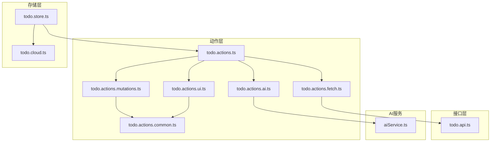
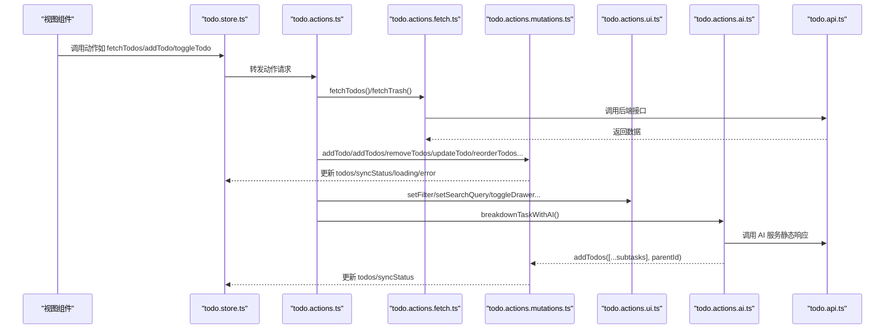
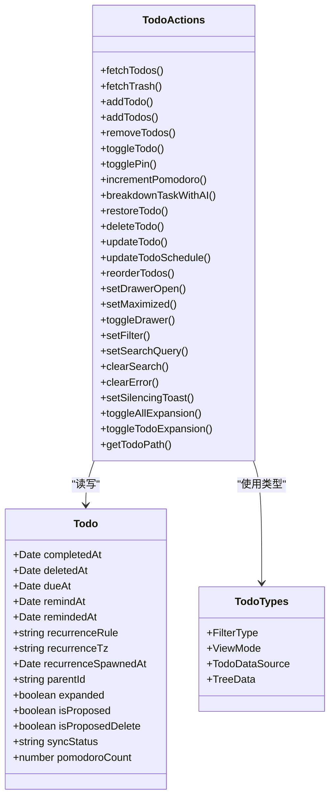
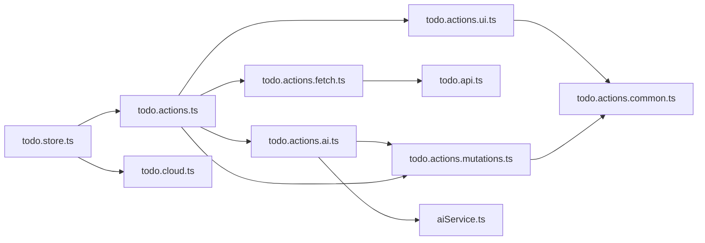

# 待办事项动作

<cite>
**本文引用的文件**
- [apps/frontend/src/features/todo/stores/todo.actions.ts](file://apps/frontend/src/features/todo/stores/todo.actions.ts)
- [apps/frontend/src/features/todo/stores/todo.actions.fetch.ts](file://apps/frontend/src/features/todo/stores/todo.actions.fetch.ts)
- [apps/frontend/src/features/todo/stores/todo.actions.mutations.ts](file://apps/frontend/src/features/todo/stores/todo.actions.mutations.ts)
- [apps/frontend/src/features/todo/stores/todo.actions.ui.ts](file://apps/frontend/src/features/todo/stores/todo.actions.ui.ts)
- [apps/frontend/src/features/todo/stores/todo.actions.ai.ts](file://apps/frontend/src/features/todo/stores/todo.actions.ai.ts)
- [apps/frontend/src/features/todo/stores/todo.actions.common.ts](file://apps/frontend/src/features/todo/stores/todo.actions.common.ts)
- [apps/frontend/src/features/todo/api/index.ts](file://apps/frontend/src/features/todo/api/index.ts)
- [apps/frontend/src/features/todo/stores/todo.types.ts](file://apps/frontend/src/features/todo/stores/todo.types.ts)
- [apps/frontend/src/features/todo/stores/todo.store.ts](file://apps/frontend/src/features/todo/stores/todo.store.ts)
- [apps/frontend/src/features/todo/stores/todo.cloud.ts](file://apps/frontend/src/features/todo/stores/todo.cloud.ts)
- [apps/frontend/src/features/ai/services/aiService.ts](file://apps/frontend/src/features/ai/services/aiService.ts)
</cite>

## 目录
1. [简介](#简介)
2. [项目结构](#项目结构)
3. [核心组件](#核心组件)
4. [架构总览](#架构总览)
5. [详细组件分析](#详细组件分析)
6. [依赖分析](#依赖分析)
7. [性能考虑](#性能考虑)
8. [故障排查指南](#故障排查指南)
9. [结论](#结论)
10. [附录](#附录)

## 简介
本文件系统化梳理前端“待办事项”功能的动作体系，围绕 fetch（数据获取）、ai（AI 集成）、ui（用户界面）、mutations（状态变更）、common（通用操作）五大类动作，逐项说明其作用域、参数、返回值与异步处理流程，并给出动作间的依赖关系、调用顺序、组合使用方式与最佳实践，以及调试与监控异步操作的方法。

## 项目结构
- 动作层位于 todo 功能域的 stores 下，按职责拆分为独立模块：
  - todo.actions.ts：动作工厂，聚合各子动作并注入依赖
  - todo.actions.fetch.ts：数据拉取相关动作（本地/远程）
  - todo.actions.mutations.ts：本地状态变更动作（增删改、排序、计划时间等）
  - todo.actions.ui.ts：UI 行为动作（过滤、搜索、抽屉、展开折叠等）
  - todo.actions.ai.ts：AI 辅助动作（基于提示词的任务拆解）
  - todo.actions.common.ts：通用工具（ID 生成、映射、去重、路径解析）
- Store 层在 todo.store.ts 中装配动作与云同步能力，统一暴露给视图使用
- API 层在 todo.api.ts 中封装后端接口，供 fetch 动作调用

图表来源
- [apps/frontend/src/features/todo/stores/todo.actions.ts:1-105](file://apps/frontend/src/features/todo/stores/todo.actions.ts#L1-L105)
- [apps/frontend/src/features/todo/stores/todo.actions.fetch.ts:1-69](file://apps/frontend/src/features/todo/stores/todo.actions.fetch.ts#L1-L69)
- [apps/frontend/src/features/todo/stores/todo.actions.mutations.ts:1-417](file://apps/frontend/src/features/todo/stores/todo.actions.mutations.ts#L1-L417)
- [apps/frontend/src/features/todo/stores/todo.actions.ui.ts:1-95](file://apps/frontend/src/features/todo/stores/todo.actions.ui.ts#L1-L95)
- [apps/frontend/src/features/todo/stores/todo.actions.ai.ts:1-89](file://apps/frontend/src/features/todo/stores/todo.actions.ai.ts#L1-L89)
- [apps/frontend/src/features/todo/stores/todo.actions.common.ts:1-84](file://apps/frontend/src/features/todo/stores/todo.actions.common.ts#L1-L84)
- [apps/frontend/src/features/todo/stores/todo.store.ts:1-335](file://apps/frontend/src/features/todo/stores/todo.store.ts#L1-L335)
- [apps/frontend/src/features/todo/stores/todo.cloud.ts:1-44](file://apps/frontend/src/features/todo/stores/todo.cloud.ts#L1-L44)
- [apps/frontend/src/features/todo/api/index.ts:1-62](file://apps/frontend/src/features/todo/api/index.ts#L1-L62)
- [apps/frontend/src/features/ai/services/aiService.ts:1-6](file://apps/frontend/src/features/ai/services/aiService.ts#L1-L6)

章节来源
- [apps/frontend/src/features/todo/stores/todo.store.ts:1-335](file://apps/frontend/src/features/todo/stores/todo.store.ts#L1-L335)
- [apps/frontend/src/features/todo/stores/todo.actions.ts:1-105](file://apps/frontend/src/features/todo/stores/todo.actions.ts#L1-L105)

## 核心组件
- 动作工厂 createTodoActions：将 fetch、mutations、ui、ai 四类动作组合为统一的对外 API，同时注入 Pinia store 的响应式状态与回调
- 数据获取动作（fetch）：负责初始化加载、垃圾箱拉取、与云端同步的触发
- 状态变更动作（mutations）：负责本地 Todo 列表的增删改、父子级联动、排序、计划时间等
- 用户界面动作（ui）：负责过滤、搜索、抽屉、展开折叠、错误清空等 UI 行为
- AI 动作（ai）：基于提示词与 AI 服务，对指定任务进行智能拆解并批量添加子任务
- 通用工具（common）：ID 生成、服务端到本地模型映射、重复检测、路径解析

章节来源
- [apps/frontend/src/features/todo/stores/todo.actions.ts:8-104](file://apps/frontend/src/features/todo/stores/todo.actions.ts#L8-L104)
- [apps/frontend/src/features/todo/stores/todo.actions.fetch.ts:15-67](file://apps/frontend/src/features/todo/stores/todo.actions.fetch.ts#L15-L67)
- [apps/frontend/src/features/todo/stores/todo.actions.mutations.ts:13-416](file://apps/frontend/src/features/todo/stores/todo.actions.mutations.ts#L13-L416)
- [apps/frontend/src/features/todo/stores/todo.actions.ui.ts:19-94](file://apps/frontend/src/features/todo/stores/todo.actions.ui.ts#L19-L94)
- [apps/frontend/src/features/todo/stores/todo.actions.ai.ts:53-87](file://apps/frontend/src/features/todo/stores/todo.actions.ai.ts#L53-L87)
- [apps/frontend/src/features/todo/stores/todo.actions.common.ts:4-83](file://apps/frontend/src/features/todo/stores/todo.actions.common.ts#L4-L83)

## 架构总览
- Store 层在 todo.store.ts 中：
  - 维护 todos、filter、viewMode、searchQuery、loading、error、isDrawerOpen、isMaximized、isSilencingToast、isTrashLoaded 等响应式状态
  - 注入 createTodoActions 返回的统一动作集合
  - 注入 createTodoCloud 提供的云端同步能力（debouncedSync、sync、冲突处理等）
- 动作层内部：
  - fetch 动作依赖 todo.api 接口与鉴权状态，必要时触发云端同步
  - mutations 动作直接修改 todos 并标记 syncStatus，随后通过 debouncedSync 触发云端合并
  - ui 动作仅影响 UI 状态与过滤展示
  - ai 动作构建提示词，调用 AI 服务，解析结果后委托 mutations 批量新增子任务

图表来源
- [apps/frontend/src/features/todo/stores/todo.store.ts:186-203](file://apps/frontend/src/features/todo/stores/todo.store.ts#L186-L203)
- [apps/frontend/src/features/todo/stores/todo.actions.ts:59-95](file://apps/frontend/src/features/todo/stores/todo.actions.ts#L59-L95)
- [apps/frontend/src/features/todo/stores/todo.actions.fetch.ts:19-62](file://apps/frontend/src/features/todo/stores/todo.actions.fetch.ts#L19-L62)
- [apps/frontend/src/features/todo/stores/todo.actions.mutations.ts:90-200](file://apps/frontend/src/features/todo/stores/todo.actions.mutations.ts#L90-L200)
- [apps/frontend/src/features/todo/stores/todo.actions.ui.ts:32-49](file://apps/frontend/src/features/todo/stores/todo.actions.ui.ts#L32-L49)
- [apps/frontend/src/features/todo/stores/todo.actions.ai.ts:56-83](file://apps/frontend/src/features/todo/stores/todo.actions.ai.ts#L56-L83)
- [apps/frontend/src/features/todo/api/index.ts:4-61](file://apps/frontend/src/features/todo/api/index.ts#L4-L61)

## 详细组件分析

### fetch 动作（数据获取）
- 作用域
  - 初始化加载：为无序的本地 todos 补充 order 字段
  - 远程同步：当用户已登录且数据源为远程时，触发云端同步
  - 垃圾箱拉取：仅在未加载过且满足条件时从后端拉取
- 关键函数
  - fetchTodos：补全 order，检查认证与数据源，必要时调用 sync
  - fetchTrash：拉取后端垃圾箱数据，合并到本地 todos，标记 isTrashLoaded
- 异步与错误
  - 使用 loading/error 控制 UI 状态；异常时设置 error 并恢复 loading
- 参数与返回
  - fetchTodos：无参数，Promise<void>
  - fetchTrash：无参数，Promise<void>

章节来源
- [apps/frontend/src/features/todo/stores/todo.actions.fetch.ts:19-62](file://apps/frontend/src/features/todo/stores/todo.actions.fetch.ts#L19-L62)
- [apps/frontend/src/features/todo/api/index.ts:33-36](file://apps/frontend/src/features/todo/api/index.ts#L33-L36)

### mutations 动作（状态变更）
- 作用域
  - 新增/批量新增：校验标题与重复，设置初始字段，插入列表，标记 syncStatus 并触发防抖同步
  - 删除/彻底删除/恢复：递归删除子任务，更新父级完成态，标记 syncStatus 并触发防抖同步
  - 完成状态切换：支持级联切换子任务，更新父级完成态与完成时间
  - 置顶：切换 isPinned，标记 syncStatus 并触发防抖同步
  - 番茄钟计数：增加 pomodoroCount，标记 syncStatus 并触发防抖同步
  - 排序：校验重复后更新 order 与 parentId，标记 syncStatus 并触发防抖同步
  - 更新：校验标题非空与重复，更新字段，标记 syncStatus 并触发防抖同步
  - 计划时间：校验 dueAt/remindAt 合法性与先后关系，更新 recurrence 相关字段，标记 syncStatus 并触发防抖同步
- 关键函数
  - addTodo/addTodos/removeTodos/deleteTodo/restoreTodo/toggleTodo/togglePin/incrementPomodoro/reorderTodos/updateTodo/updateTodoSchedule/isDuplicate
- 异步与错误
  - 多数为本地同步操作，但会设置 error 以反馈业务规则错误（如重复、父任务已完成、标题为空、提醒时间晚于到期时间等）
  - 所有变更均设置 syncStatus='pending'，随后由 debouncedSync 触发云端合并
- 参数与返回
  - addTodo：(title, parentId?, id?) -> Promise<string|null>
  - addTodos：(titles, parentId?) -> Promise<string[]>
  - removeTodos：(ids) -> Promise<void>
  - deleteTodo：(id) -> Promise<void>
  - restoreTodo：(id) -> Promise<void>
  - toggleTodo：(id) -> Promise<void>
  - togglePin：(id) -> Promise<void>
  - incrementPomodoro：(id) -> void
  - reorderTodos：(orderedIds, parentId?) -> void
  - updateTodo：(id, title?, parentId?) -> Promise<boolean>
  - updateTodoSchedule：(id, dueAt, remindAt, recurrenceRule?) -> boolean
  - isDuplicate：(title, parentId?, excludeId?) -> boolean

章节来源
- [apps/frontend/src/features/todo/stores/todo.actions.mutations.ts:13-416](file://apps/frontend/src/features/todo/stores/todo.actions.mutations.ts#L13-L416)
- [apps/frontend/src/features/todo/stores/todo.actions.common.ts:53-68](file://apps/frontend/src/features/todo/stores/todo.actions.common.ts#L53-L68)

### ui 动作（用户界面）
- 作用域
  - 抽屉控制：打开/关闭/切换
  - 最大化：窗口最大化状态
  - 过滤：设置过滤器；当过滤器为 trash 时触发 fetchTrash
  - 搜索：设置/清空搜索词
  - 错误清空：清除 error
  - 吐司静音：控制是否静音 toast
  - 展开/折叠：全部展开/折叠或单个任务展开/折叠
  - 路径查询：根据 todoId 生成从根到当前节点的标题路径
- 关键函数
  - setDrawerOpen/setMaximized/toggleDrawer/setFilter/setSearchQuery/clearSearch/clearError/setSilencingToast/toggleAllExpansion/toggleTodoExpansion/getTodoPath
- 异步与错误
  - 仅影响 UI 状态，不涉及网络请求
- 参数与返回
  - setDrawerOpen/setMaximized/toggleDrawer：无返回
  - setFilter：无返回
  - setSearchQuery/clearSearch/clearError/setSilencingToast：无返回
  - toggleAllExpansion/toggleTodoExpansion：无返回
  - getTodoPath：(todoId) -> string[]

章节来源
- [apps/frontend/src/features/todo/stores/todo.actions.ui.ts:19-94](file://apps/frontend/src/features/todo/stores/todo.actions.ui.ts#L19-L94)
- [apps/frontend/src/features/todo/stores/todo.actions.common.ts:70-83](file://apps/frontend/src/features/todo/stores/todo.actions.common.ts#L70-L83)

### ai 动作（AI 集成）
- 作用域
  - 任务拆解：基于提示词与 AI 服务，将目标任务拆解为若干原子动作，批量作为子任务添加
- 关键函数
  - breakdownTaskWithAI：构建提示词，调用 AI 服务，解析响应，若成功则通过 addTodos 添加子任务并展开父任务
- 异步与错误
  - 设置 loading/error；失败时记录日志并设置 error
- 参数与返回
  - breakdownTaskWithAI：(id) -> Promise<string[]>（返回新增子任务的 ID 列表）

章节来源
- [apps/frontend/src/features/todo/stores/todo.actions.ai.ts:53-87](file://apps/frontend/src/features/todo/stores/todo.actions.ai.ts#L53-L87)
- [apps/frontend/src/features/ai/services/aiService.ts:5-6](file://apps/frontend/src/features/ai/services/aiService.ts#L5-L6)

### common 工具（通用操作）
- 作用域
  - ID 生成：兼容浏览器/Node 环境的 UUID 生成
  - 映射：将服务端 Todo 结构映射为本地 Todo 结构（含日期转换与字段补齐）
  - 重复检测：在同级下检测是否存在相同标题的未完成/未删除任务
  - 路径解析：从任意 todoId 出发，向上遍历父节点，生成标题路径数组
- 关键函数
  - generateTodoId/mapServerTodoToLocalTodo/isDuplicateTodo/getTodoPath
- 参数与返回
  - generateTodoId：无参数，返回字符串
  - mapServerTodoToLocalTodo：(serverTodo) -> Todo
  - isDuplicateTodo：(todos, title, parentId?, excludeId?) -> boolean
  - getTodoPath：(todos, todoId) -> string[]

章节来源
- [apps/frontend/src/features/todo/stores/todo.actions.common.ts:4-83](file://apps/frontend/src/features/todo/stores/todo.actions.common.ts#L4-L83)

### 类关系图（动作与类型）

图表来源
- [apps/frontend/src/features/todo/stores/todo.types.ts:3-68](file://apps/frontend/src/features/todo/stores/todo.types.ts#L3-L68)
- [apps/frontend/src/features/todo/stores/todo.actions.ts:25-103](file://apps/frontend/src/features/todo/stores/todo.actions.ts#L25-L103)

## 依赖分析
- 动作间依赖
  - ui 动作依赖 common 的 getTodoPath
  - fetch 动作依赖 todo.api 与鉴权状态，必要时调用 sync
  - mutations 动作依赖 common 的 ID 生成与重复检测
  - ai 动作依赖 AI 服务与 mutations 的 addTodos
- 存储层依赖
  - todo.store.ts 将 createTodoActions 与 createTodoCloud 的能力统一导出，供视图使用
- 外部依赖
  - todo.api.ts 提供后端接口封装
  - aiService.ts 提供 AI 服务入口

图表来源
- [apps/frontend/src/features/todo/stores/todo.actions.ui.ts:1-17](file://apps/frontend/src/features/todo/stores/todo.actions.ui.ts#L1-L17)
- [apps/frontend/src/features/todo/stores/todo.actions.fetch.ts:1-13](file://apps/frontend/src/features/todo/stores/todo.actions.fetch.ts#L1-L13)
- [apps/frontend/src/features/todo/stores/todo.actions.mutations.ts:1-11](file://apps/frontend/src/features/todo/stores/todo.actions.mutations.ts#L1-L11)
- [apps/frontend/src/features/todo/stores/todo.actions.ai.ts:1-11](file://apps/frontend/src/features/todo/stores/todo.actions.ai.ts#L1-L11)
- [apps/frontend/src/features/todo/stores/todo.store.ts:186-203](file://apps/frontend/src/features/todo/stores/todo.store.ts#L186-L203)
- [apps/frontend/src/features/todo/api/index.ts:1-61](file://apps/frontend/src/features/todo/api/index.ts#L1-L61)
- [apps/frontend/src/features/ai/services/aiService.ts:5-6](file://apps/frontend/src/features/ai/services/aiService.ts#L5-L6)

章节来源
- [apps/frontend/src/features/todo/stores/todo.store.ts:186-203](file://apps/frontend/src/features/todo/stores/todo.store.ts#L186-L203)
- [apps/frontend/src/features/todo/stores/todo.actions.ts:59-95](file://apps/frontend/src/features/todo/stores/todo.actions.ts#L59-L95)

## 性能考虑
- 防抖同步：mutations 动作统一通过 debouncedSync 触发云端合并，避免频繁网络请求
- 批量操作：addTodos 与 removeTodos 支持批量处理，减少多次渲染与同步
- 条件加载：fetchTodos 在未初始化 order 时才补全，fetchTrash 仅在未加载过时才拉取
- 本地优先：UI 动作与大部分 mutations 为本地操作，降低网络延迟对交互的影响
- 日期标准化：store 层在 todos 变更时统一标准化日期，避免比较与显示问题

## 故障排查指南
- 常见错误码与定位
  - todo.duplicate：新增/更新时标题重复或父级下存在相同未完成任务
  - todo.parentCompleted：父任务已完成，禁止新增子任务
  - todo.titleEmpty：更新标题为空
  - todo.remindAfterDue：提醒时间晚于到期时间
  - todo.recurrenceNeedsDue：周期规则需要同时设置到期时间
  - todo.syncFailed：拉取垃圾箱失败
  - AI breakdown failed：AI 拆解失败
- 调试建议
  - 观察 loading/error 状态：所有异步动作在开始前设置 loading，失败时设置 error
  - 使用浏览器开发者工具断点：在 mutations 的 finally 分支与 fetch 的 catch 分支设置断点
  - 日志输出：AI 动作与 fetch 动作均输出错误日志，便于定位
  - 云端冲突：通过 store 的 syncConflicts 与 accept/retry/clear 方法处理冲突
- 监控异步操作
  - 在 store 中持久化关键状态（如 lastSyncAt、syncConflicts），便于回放与诊断
  - 通过 setSilencingToast 控制是否屏蔽提示，避免干扰日志观察

章节来源
- [apps/frontend/src/features/todo/stores/todo.actions.mutations.ts:98-101](file://apps/frontend/src/features/todo/stores/todo.actions.mutations.ts#L98-L101)
- [apps/frontend/src/features/todo/stores/todo.actions.mutations.ts:324-327](file://apps/frontend/src/features/todo/stores/todo.actions.mutations.ts#L324-L327)
- [apps/frontend/src/features/todo/stores/todo.actions.mutations.ts:363-371](file://apps/frontend/src/features/todo/stores/todo.actions.mutations.ts#L363-L371)
- [apps/frontend/src/features/todo/stores/todo.actions.fetch.ts:56-61](file://apps/frontend/src/features/todo/stores/todo.actions.fetch.ts#L56-L61)
- [apps/frontend/src/features/todo/stores/todo.actions.ai.ts:76-82](file://apps/frontend/src/features/todo/stores/todo.actions.ai.ts#L76-L82)
- [apps/frontend/src/features/todo/stores/todo.store.ts:162-184](file://apps/frontend/src/features/todo/stores/todo.store.ts#L162-L184)

## 结论
该动作系统以 todo.actions.ts 为核心枢纽，将 fetch、mutations、ui、ai 四类动作解耦并注入统一依赖，配合 todo.store.ts 的状态管理与 todo.cloud.ts 的云端能力，形成清晰的职责边界与稳定的异步处理流程。通过 common 工具保证跨模块一致性，借助防抖与批量操作优化性能，结合完善的错误处理与监控手段，能够支撑复杂场景下的待办事项管理需求。

## 附录
- 动作组合使用示例
  - 任务拆解：先调用 ui 的 setFilter('pending')，再调用 ai 的 breakdownTaskWithAI(id)，最后等待 mutations 的 addTodos 完成并自动触发同步
  - 批量导入：调用 mutations 的 addTodos(titles, parentId)，在完成后由 debouncedSync 自动合并
  - 垃圾箱恢复：调用 ui 的 setFilter('trash')，触发 fetchTrash，再调用 mutations 的 restoreTodo(id)
- 最佳实践
  - 优先使用 mutations 的批量接口（addTodos、removeTodos）以减少渲染与同步次数
  - 在更新计划时间时，先校验 dueAt/remindAt 的合法性，避免无效状态
  - 使用 getTodoPath 为 AI 提供上下文，提升拆解质量
  - 对于长列表拖拽排序，先调用 reorderTodos，再等待 debouncedSync 合并