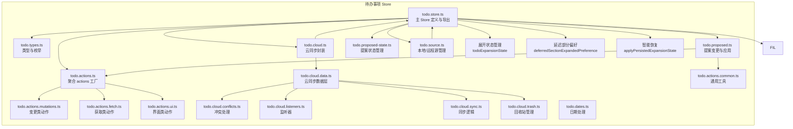
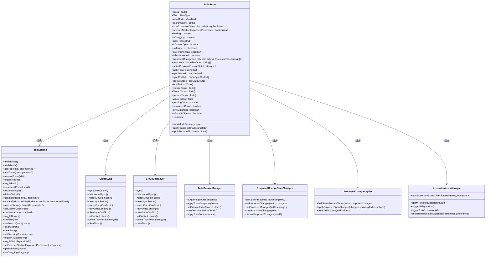
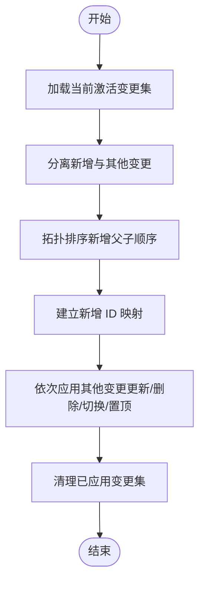
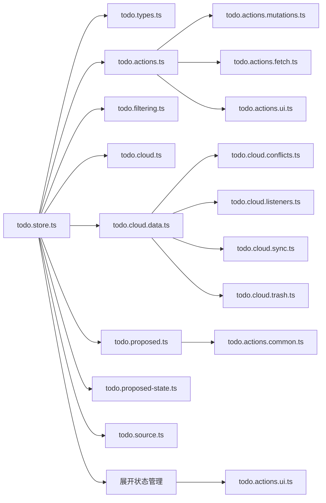

# 待办事项状态

<cite>
**本文引用的文件**
- [apps/frontend/src/features/todo/stores/todo.store.ts](file://apps/frontend/src/features/todo/stores/todo.store.ts)
- [apps/frontend/src/features/todo/stores/todo.types.ts](file://apps/frontend/src/features/todo/stores/todo.types.ts)
- [apps/frontend/src/features/todo/stores/todo.actions.ts](file://apps/frontend/src/features/todo/stores/todo.actions.ts)
- [apps/frontend/src/features/todo/stores/todo.actions.mutations.ts](file://apps/frontend/src/features/todo/stores/todo.actions.mutations.ts)
- [apps/frontend/src/features/todo/stores/todo.actions.fetch.ts](file://apps/frontend/src/features/todo/stores/todo.actions.fetch.ts)
- [apps/frontend/src/features/todo/stores/todo.actions.ui.ts](file://apps/frontend/src/features/todo/stores/todo.actions.ui.ts)
- [apps/frontend/src/features/todo/stores/todo.cloud.ts](file://apps/frontend/src/features/todo/stores/todo.cloud.ts)
- [apps/frontend/src/features/todo/stores/todo.cloud.data.ts](file://apps/frontend/src/features/todo/stores/todo.cloud.data.ts)
- [apps/frontend/src/features/todo/stores/todo.cloud.conflicts.ts](file://apps/frontend/src/features/todo/stores/todo.cloud.conflicts.ts)
- [apps/frontend/src/features/todo/stores/todo.cloud.listeners.ts](file://apps/frontend/src/features/todo/stores/todo.cloud.listeners.ts)
- [apps/frontend/src/features/todo/stores/todo.cloud.sync.ts](file://apps/frontend/src/features/todo/stores/todo.cloud.sync.ts)
- [apps/frontend/src/features/todo/stores/todo.cloud.trash.ts](file://apps/frontend/src/features/todo/stores/todo.cloud.trash.ts)
- [apps/frontend/src/features/todo/stores/todo.cloud.types.ts](file://apps/frontend/src/features/todo/stores/todo.cloud.types.ts)
- [apps/frontend/src/features/todo/stores/todo.filtering.ts](file://apps/frontend/src/features/todo/stores/todo.filtering.ts)
- [apps/frontend/src/features/todo/stores/todo.proposed.ts](file://apps/frontend/src/features/todo/stores/todo.proposed.ts)
- [apps/frontend/src/features/todo/stores/todo.proposed-state.ts](file://apps/frontend/src/features/todo/stores/todo.proposed-state.ts)
- [apps/frontend/src/features/todo/stores/todo.source.ts](file://apps/frontend/src/features/todo/stores/todo.source.ts)
- [apps/frontend/src/features/todo/stores/todo.actions.common.ts](file://apps/frontend/src/features/todo/stores/todo.actions.common.ts)
- [apps/frontend/src/features/todo/stores/todo.dates.ts](file://apps/frontend/src/features/todo/stores/todo.dates.ts)
- [apps/frontend/tests/features/todo/stores/todo.spec.ts](file://apps/frontend/tests/features/todo/stores/todo.spec.ts)
- [apps/frontend/tests/features/todo/stores/todo.expansion.spec.ts](file://apps/frontend/tests/features/todo/stores/todo.expansion.spec.ts)
- [apps/frontend/src/features/todo/components/TodoItem.vue](file://apps/frontend/src/features/todo/components/TodoItem.vue)
- [apps/frontend/src/features/todo/components/TodoList.vue](file://apps/frontend/src/features/todo/components/TodoList.vue)
</cite>

## 更新摘要
**所做更改**
- 新增了待办事项展开/折叠状态管理的详细说明，包括todoExpansionState状态字段和applyPersistedExpansionState方法
- 更新了状态持久化机制，新增todoExpansionState和deferredSectionExpandedPreference的持久化支持
- 完善了展开状态的watchers机制，包括todoExpansionState、todoSource、localTodos、remoteTodos的响应式处理
- 增强了展开状态的UI交互，包括toggleAllExpansion和toggleTodoExpansion的实现
- 新增了展开状态的测试用例和验证逻辑
- 新增了延迟部分展开偏好的用户偏好设置功能

## 目录
1. [简介](#简介)
2. [项目结构](#项目结构)
3. [核心组件](#核心组件)
4. [架构总览](#架构总览)
5. [详细组件分析](#详细组件分析)
6. [依赖分析](#依赖分析)
7. [性能考量](#性能考量)
8. [故障排查指南](#故障排查指南)
9. [结论](#结论)
10. [附录](#附录)

## 简介
本文件围绕前端 todo.store.ts 的状态设计与 Pinia Store 实现进行系统化说明，覆盖以下主题：
- 待办事项数据结构、状态字段与类型定义
- 状态初始化、更新与持久化策略
- CRUD 与 UI/云同步等动作（actions）的实现与调用链
- 响应式更新与副作用处理（含过滤、排序、父子联动、展开状态管理）
- 提案变更（Proposed Changes）与冲突处理
- 本地/远程源切换与同步集成
- 展开状态持久化与恢复机制
- 延迟部分展开偏好设置
- 最佳实践与性能优化建议
- 与其他 store 的交互模式与依赖关系

## 项目结构
todo.store.ts 所在目录采用"按功能域划分"的组织方式，将待办事项相关的状态、类型、过滤器、云同步、UI 动作、提案变更与源管理拆分为独立模块，便于维护与测试。

**图表来源**
- [apps/frontend/src/features/todo/stores/todo.store.ts:1-362](file://apps/frontend/src/features/todo/stores/todo.store.ts#L1-L362)
- [apps/frontend/src/features/todo/stores/todo.types.ts:1-69](file://apps/frontend/src/features/todo/stores/todo.types.ts#L1-L69)
- [apps/frontend/src/features/todo/stores/todo.actions.ts:1-111](file://apps/frontend/src/features/todo/stores/todo.actions.ts#L1-L111)
- [apps/frontend/src/features/todo/stores/todo.actions.mutations.ts:1-437](file://apps/frontend/src/features/todo/stores/todo.actions.mutations.ts#L1-L437)
- [apps/frontend/src/features/todo/stores/todo.actions.fetch.ts:1-69](file://apps/frontend/src/features/todo/stores/todo.actions.fetch.ts#L1-L69)
- [apps/frontend/src/features/todo/stores/todo.actions.ui.ts:1-105](file://apps/frontend/src/features/todo/stores/todo.actions.ui.ts#L1-L105)
- [apps/frontend/src/features/todo/stores/todo.cloud.ts:1-44](file://apps/frontend/src/features/todo/stores/todo.cloud.ts#L1-L44)
- [apps/frontend/src/features/todo/stores/todo.cloud.data.ts:1-43](file://apps/frontend/src/features/todo/stores/todo.cloud.data.ts#L1-L43)
- [apps/frontend/src/features/todo/stores/todo.cloud.conflicts.ts](file://apps/frontend/src/features/todo/stores/todo.cloud.conflicts.ts)
- [apps/frontend/src/features/todo/stores/todo.cloud.listeners.ts](file://apps/frontend/src/features/todo/stores/todo.cloud.listeners.ts)
- [apps/frontend/src/features/todo/stores/todo.cloud.sync.ts](file://apps/frontend/src/features/todo/stores/todo.cloud.sync.ts)
- [apps/frontend/src/features/todo/stores/todo.cloud.trash.ts](file://apps/frontend/src/features/todo/stores/todo.cloud.trash.ts)
- [apps/frontend/src/features/todo/stores/todo.proposed.ts:1-197](file://apps/frontend/src/features/todo/stores/todo.proposed.ts#L1-L197)
- [apps/frontend/src/features/todo/stores/todo.proposed-state.ts:1-79](file://apps/frontend/src/features/todo/stores/todo.proposed-state.ts#L1-L79)
- [apps/frontend/src/features/todo/stores/todo.source.ts:1-73](file://apps/frontend/src/features/todo/stores/todo.source.ts#L1-L73)
- [apps/frontend/src/features/todo/stores/todo.actions.common.ts:1-84](file://apps/frontend/src/features/todo/stores/todo.actions.common.ts#L1-L84)
- [apps/frontend/src/features/todo/stores/todo.dates.ts:1-56](file://apps/frontend/src/features/todo/stores/todo.dates.ts#L1-L56)

**章节来源**
- [apps/frontend/src/features/todo/stores/todo.store.ts:1-362](file://apps/frontend/src/features/todo/stores/todo.store.ts#L1-L362)

## 核心组件
- 主 Store（useTodoStore）
  - 负责集中管理待办事项状态、过滤器、视图模式、搜索、拖拽、错误、抽屉、最大化、静默提示、回收站加载标记、提案变更集、同步元信息、数据源以及本地/远程快照。
  - **新增** todoExpansionState：用于跟踪每个待办事项的展开/折叠状态，支持在本地快照间持久化和恢复。
  - **新增** deferredSectionExpandedPreference：用于存储延迟部分的展开偏好设置。
  - 通过计算属性提供过滤后的列表、可视化视图、计数统计、是否全部展开等派生状态。
  - **增强** 响应式更新：watch todoExpansionState、todoSource、localTodos、remoteTodos 等多个状态，自动应用展开状态持久化和快照恢复。
  - 导出 actions、云同步方法、源切换、冲突处理、提案应用等能力。

- 类型系统（todo.types.ts）
  - Todo：扩展共享类型，增加本地字段如 completedAt、deletedAt、dueAt、remindAt、recurrence*、parentId、**expanded**、isProposed、isProposedDelete、syncStatus、pomodoroCount。
  - 过滤与视图：FilterType、ViewMode、TodoDataSource。
  - 同步冲突：TodoSyncConflict、SyncConflictReason。
  - 提案变更：ProposedTodoChange。
  - 树形渲染数据：TreeData。

- 动作工厂（todo.actions.ts）
  - 将 fetch、mutations、ui、ai 四类动作聚合为统一接口，注入对 todos、loading、error、debouncedSync、sync、isRemoteSource、**todoExpansionState**、**deferredSectionExpandedPreference** 等依赖的访问。

- 变更动作（todo.actions.mutations.ts）
  - 实现新增、批量新增、删除、恢复、切换完成、置顶、番茄钟计数、重排、更新标题/父级、更新计划（到期/提醒/周期规则）等。
  - 内置父子联动：子级完成/取消时同步更新父级完成状态，并回溯更新父链。
  - 统一设置 updatedAt、syncStatus 并触发防抖同步。

- 获取动作（todo.actions.fetch.ts）
  - 首次加载时补全缺失的 order；若已认证且使用远程源，则触发同步。
  - 拉取回收站：仅在未加载过时拉取服务端回收站并合并到本地。

- 界面动作（todo.actions.ui.ts）
  - **增强** 抽屉开关、最大化、筛选、搜索、清空错误、静默提示、**展开/折叠**、**延迟部分展开偏好**、路径查询等。
  - **新增** toggleAllExpansion：切换所有可见待办事项的展开状态。
  - **新增** toggleTodoExpansion：切换指定待办事项的展开状态。
  - **新增** setDeferredSectionExpandedPreference：设置延迟部分的展开偏好。

- 云同步（todo.cloud.ts）
  - 包装云端数据层（具体实现位于 todo.cloud.data.ts），暴露 sync、debouncedSync、mergeOnLogin、冲突接受/重试/清空、socket 初始化、永久删除、清空回收站等。

- 云同步数据层（todo.cloud.data.ts）
  - 将同步、冲突处理、监听器、回收站管理等功能模块化，提供统一的云同步接口。

- 冲突处理（todo.cloud.conflicts.ts）
  - 处理 TOMBSTONED、OWNER_MISMATCH、VERSION_CONFLICT 等不同类型的同步冲突。
  - 提供冲突接受、重试、清空等操作。

- 监听器（todo.cloud.listeners.ts）
  - 处理实时消息推送，包括待办事项更新、删除、同步状态变化等事件。

- 同步逻辑（todo.cloud.sync.ts）
  - 实现增量同步、全量同步、登录合并等核心同步功能。
  - 管理同步队列和重试机制。

- 回收站管理（todo.cloud.trash.ts）
  - 处理回收站数据的获取、永久删除、清空等操作。

- 过滤与排序（todo.filtering.ts）
  - 支持 pending/completed/trash 三态过滤，支持搜索关键词匹配。
  - 有效完成（effectivelyCompleted）：当存在父任务时，父任务完成则子任务视为完成。
  - 排序优先级：置顶 > 未完成 > 完成 > order。

- 提案变更（todo.proposed.ts）
  - 构建基础预览列表（基于现有 todos + 提案变更），用于 UI 即时反馈。
  - 应用提案变更：先拓扑排序处理新增（保证父子顺序），再执行更新/删除/切换/置顶等操作。

- 提案状态管理（todo.proposed-state.ts）
  - 维护多个提案变更集、变更顺序、当前激活集；支持设置、追加、清空、丢弃。

- 源管理（todo.source.ts）
  - 统一管理本地/远程 todos 快照，避免重复写入；在源切换时应用目标快照并清理冲突与回收站标记；远程源下为未同步项标注 pending。

- 日期处理（todo.dates.ts）
  - 提供日期标准化、克隆、快照等工具函数，确保日期数据的一致性和可序列化。

- 通用工具（todo.actions.common.ts）
  - 生成唯一 ID、服务端/本地映射、去重判断、路径查询。

**章节来源**
- [apps/frontend/src/features/todo/stores/todo.store.ts:21-362](file://apps/frontend/src/features/todo/stores/todo.store.ts#L21-L362)
- [apps/frontend/src/features/todo/stores/todo.types.ts:1-69](file://apps/frontend/src/features/todo/stores/todo.types.ts#L1-L69)
- [apps/frontend/src/features/todo/stores/todo.actions.ts:1-111](file://apps/frontend/src/features/todo/stores/todo.actions.ts#L1-L111)
- [apps/frontend/src/features/todo/stores/todo.actions.mutations.ts:1-437](file://apps/frontend/src/features/todo/stores/todo.actions.mutations.ts#L1-L437)
- [apps/frontend/src/features/todo/stores/todo.actions.fetch.ts:1-69](file://apps/frontend/src/features/todo/stores/todo.actions.fetch.ts#L1-L69)
- [apps/frontend/src/features/todo/stores/todo.actions.ui.ts:1-105](file://apps/frontend/src/features/todo/stores/todo.actions.ui.ts#L1-L105)
- [apps/frontend/src/features/todo/stores/todo.cloud.ts:1-44](file://apps/frontend/src/features/todo/stores/todo.cloud.ts#L1-L44)
- [apps/frontend/src/features/todo/stores/todo.cloud.data.ts:1-43](file://apps/frontend/src/features/todo/stores/todo.cloud.data.ts#L1-L43)
- [apps/frontend/src/features/todo/stores/todo.proposed.ts:1-197](file://apps/frontend/src/features/todo/stores/todo.proposed.ts#L1-L197)
- [apps/frontend/src/features/todo/stores/todo.proposed-state.ts:1-79](file://apps/frontend/src/features/todo/stores/todo.proposed-state.ts#L1-L79)
- [apps/frontend/src/features/todo/stores/todo.source.ts:1-73](file://apps/frontend/src/features/todo/stores/todo.source.ts#L1-L73)
- [apps/frontend/src/features/todo/stores/todo.actions.common.ts:1-84](file://apps/frontend/src/features/todo/stores/todo.actions.common.ts#L1-L84)
- [apps/frontend/src/features/todo/stores/todo.dates.ts:1-56](file://apps/frontend/src/features/todo/stores/todo.dates.ts#L1-L56)

## 架构总览
下面的类图展示 todo.store.ts 的核心对象与依赖关系，包括新增的展开状态管理：

**图表来源**
- [apps/frontend/src/features/todo/stores/todo.store.ts:21-362](file://apps/frontend/src/features/todo/stores/todo.store.ts#L21-L362)
- [apps/frontend/src/features/todo/stores/todo.actions.ts:8-110](file://apps/frontend/src/features/todo/stores/todo.actions.ts#L8-L110)
- [apps/frontend/src/features/todo/stores/todo.cloud.ts:6-43](file://apps/frontend/src/features/todo/stores/todo.cloud.ts#L6-L43)
- [apps/frontend/src/features/todo/stores/todo.cloud.data.ts:7-42](file://apps/frontend/src/features/todo/stores/todo.cloud.data.ts#L7-L42)
- [apps/frontend/src/features/todo/stores/todo.source.ts:23-72](file://apps/frontend/src/features/todo/stores/todo.source.ts#L23-L72)
- [apps/frontend/src/features/todo/stores/todo.proposed-state.ts:18-79](file://apps/frontend/src/features/todo/stores/todo.proposed-state.ts#L18-L79)
- [apps/frontend/src/features/todo/stores/todo.proposed.ts:124-197](file://apps/frontend/src/features/todo/stores/todo.proposed.ts#L124-L197)
- [apps/frontend/src/features/todo/stores/todo.store.ts:27-29](file://apps/frontend/src/features/todo/stores/todo.store.ts#L27-L29)
- [apps/frontend/src/features/todo/stores/todo.store.ts:63-71](file://apps/frontend/src/features/todo/stores/todo.store.ts#L63-L71)
- [apps/frontend/src/features/todo/stores/todo.actions.ui.ts:21-104](file://apps/frontend/src/features/todo/stores/todo.actions.ui.ts#L21-L104)

## 详细组件分析

### 数据结构与类型定义
- Todo 字段
  - 基础来自共享类型，本地扩展字段包括完成时间、删除时间、到期/提醒时间、周期规则与时区、父任务 ID、**expanded**、提案标记、同步状态、番茄钟计数等。
- 新增状态字段
  - **todoExpansionState**：Record<string, boolean> 类型，用于存储每个待办事项的展开/折叠状态映射。
  - **deferredSectionExpandedPreference**：boolean | null 类型，用于存储延迟部分的展开偏好设置。
- 过滤与视图
  - FilterType：pending/completed/trash
  - ViewMode：list/visual/stats
  - TodoDataSource：local/remote
- 同步冲突
  - TodoSyncConflict：包含原因、服务器版本、本地草稿、服务器快照、发生时间。
  - SyncConflictReason：TOMBSTONED、OWNER_MISMATCH、VERSION_CONFLICT
- 提案变更
  - ProposedTodoChange：支持 add/update/delete/toggle/pin，携带变更数据与目标 ID。

**章节来源**
- [apps/frontend/src/features/todo/stores/todo.types.ts:3-69](file://apps/frontend/src/features/todo/stores/todo.types.ts#L3-L69)
- [apps/frontend/src/features/todo/stores/todo.store.ts:27-29](file://apps/frontend/src/features/todo/stores/todo.store.ts#L27-L29)

### 状态初始化与持久化
- 初始化
  - todos、filter、viewMode、searchQuery、**todoExpansionState**、**deferredSectionExpandedPreference**、loading、isDragging、error、isDrawerOpen、isMaximized、isSilencingToast、isTrashLoaded、proposedChangeSets、proposedChangeSetOrder、activeProposedChangeSetId、lastSyncAt、syncOwnerId、syncConflicts、todoSource、localTodos、remoteTodos 等。
- 持久化
  - 使用 Pinia 持久化配置，键名 todos，存储于 localStorage，选择性持久化 todoSource、localTodos、remoteTodos、filter、viewMode、**todoExpansionState**、**deferredSectionExpandedPreference**、lastSyncAt、syncOwnerId、isDrawerOpen、isMaximized 等关键字段。

**章节来源**
- [apps/frontend/src/features/todo/stores/todo.store.ts:24-46](file://apps/frontend/src/features/todo/stores/todo.store.ts#L24-L46)
- [apps/frontend/src/features/todo/stores/todo.store.ts:342-361](file://apps/frontend/src/features/todo/stores/todo.store.ts#L342-L361)

### 响应式更新与副作用
- watch(todos, …)
  - 深度监听 todos，规范化日期并持久化当前源；避免在应用快照期间重复持久化。
- **新增** watch(todoExpansionState, …)
  - 监听展开状态变化，自动应用持久化的展开状态到 todos。
- **增强** watch([todoSource, localTodos, remoteTodos], …)
  - 当源或源快照变化时，应用目标快照到 todos，并清理冲突与回收站标记。
  - **新增** 在应用快照后调用 applyPersistedExpansionState，确保展开状态正确恢复。
- watch(searchQuery, …)
  - 搜索时展开所有父节点，提升可发现性。
- watch(viewMode, …)
  - 视图为 visual 且当前为 trash 时，自动切换为 pending，避免不可见的视觉混乱。
- 计算属性
  - filteredTodos、previewTodos、visualTodos、pendingCount、completedCount、**isAllExpanded**、isRemoteSource 等，均基于 todos 与过滤条件动态计算。

**章节来源**
- [apps/frontend/src/features/todo/stores/todo.store.ts:84-125](file://apps/frontend/src/features/todo/stores/todo.store.ts#L84-L125)
- [apps/frontend/src/features/todo/stores/todo.store.ts:63-71](file://apps/frontend/src/features/todo/stores/todo.store.ts#L63-L71)

### 展开状态管理
- **新增** applyPersistedExpansionState 方法
  - 在应用快照或恢复持久化状态时，遍历 todos 并根据 todoExpansionState 中的记录恢复每个待办事项的展开状态。
  - 仅当持久化状态存在时才覆盖默认的 expanded 值。
- **增强** isAllExpanded 计算属性
  - 基于当前过滤结果中的父级待办事项，智能判断是否应该显示"全部展开"状态。
  - 仅考虑可见的父级节点，避免隐藏内容影响状态判断。
- **新增** 展开状态的UI交互
  - toggleAllExpansion：切换所有可见待办事项的展开状态，并同步更新 todoExpansionState。
  - toggleTodoExpansion：切换指定待办事项的展开状态，并同步更新 todoExpansionState。
  - setDeferredSectionExpandedPreference：设置延迟部分的展开偏好，支持 null 值表示未设置。

**章节来源**
- [apps/frontend/src/features/todo/stores/todo.store.ts:63-71](file://apps/frontend/src/features/todo/stores/todo.store.ts#L63-L71)
- [apps/frontend/src/features/todo/stores/todo.store.ts:51-58](file://apps/frontend/src/features/todo/stores/todo.store.ts#L51-L58)
- [apps/frontend/src/features/todo/stores/todo.actions.ui.ts:74-88](file://apps/frontend/src/features/todo/stores/todo.actions.ui.ts#L74-88)
- [apps/frontend/src/features/todo/stores/todo.actions.ui.ts:70-72](file://apps/frontend/src/features/todo/stores/todo.actions.ui.ts#L70-L72)

### 延迟部分展开偏好
- **新增** deferredSectionExpandedPreference 状态
  - 用于存储用户对延迟部分（deferred section）的展开偏好设置。
  - 支持 true、false、null 三种状态：true 表示始终展开，false 表示始终折叠，null 表示根据活动待办事项数量自动决定。
- **智能恢复逻辑**
  - 在 TodoList 组件中，当 deferredSectionExpandedPreference 为 null 时，如果活动待办事项为空，则展开延迟部分；否则保持折叠。
  - 用户手动切换后，偏好设置会被持久化保存。
- **UI 交互**
  - TodoList 组件提供延迟部分的展开/折叠按钮，使用 aria-expanded 属性提供无障碍支持。
  - 切换时通过 setDeferredSectionExpandedPreference 更新状态。

**章节来源**
- [apps/frontend/src/features/todo/components/TodoList.vue:123-129](file://apps/frontend/src/features/todo/components/TodoList.vue#L123-L129)
- [apps/frontend/src/features/todo/stores/todo.actions.ui.ts:70-72](file://apps/frontend/src/features/todo/stores/todo.actions.ui.ts#L70-L72)

### CRUD 与 UI 动作
- 新增/批量新增
  - 校验标题非空与去重；父任务完成时禁止新增；设置初始 order、expanded、version、syncStatus；触发防抖同步。
- 删除/恢复
  - 删除时递归删除子任务并标记 deletedAt；恢复时清除 deletedAt 并必要时恢复父任务。
- 切换完成
  - 子级完成/取消时同步更新父级完成状态并回溯父链；同时更新 completedAt。
- 置顶/番茄钟
  - 更新 isPinned 与 pomodoroCount，并标记同步状态。
- 重排
  - 校验重复后更新 order 与 parentId，并标记同步状态。
- 更新标题/父级/计划
  - 标题为空时返回错误；父级变更时校验去重；到期/提醒时间合法性检查；周期规则需配合到期时间。
- **增强** UI 行为
  - 抽屉开关、最大化、筛选、搜索、清空错误、静默提示、**展开/折叠**、**延迟部分展开偏好**、路径查询。

**章节来源**
- [apps/frontend/src/features/todo/stores/todo.actions.mutations.ts:91-437](file://apps/frontend/src/features/todo/stores/todo.actions.mutations.ts#L91-L437)
- [apps/frontend/src/features/todo/stores/todo.actions.ui.ts:35-104](file://apps/frontend/src/features/todo/stores/todo.actions.ui.ts#L35-L104)

### 云同步与冲突处理
- 同步入口
  - 通过 createTodoCloud 包装，提供 sync、debouncedSync、mergeOnLogin、resetSyncStatus、accept/retry/clearConflicts、initSocketListener、永久删除、清空回收站。
- 数据层架构
  - todo.cloud.data.ts 将功能分解为 sync、conflicts、listeners、trash 等模块，提高可维护性。
- 登录合并
  - 切换到远程源时，若 ownerId 不一致则清空本地/远程状态并重置同步状态，随后执行合并。
- 冲突类型
  - 包含墓碑（TOMBSTONED）、拥有者不匹配（OWNER_MISMATCH）、版本冲突（VERSION_CONFLICT）等。

**章节来源**
- [apps/frontend/src/features/todo/stores/todo.store.ts:183-205](file://apps/frontend/src/features/todo/stores/todo.store.ts#L183-L205)
- [apps/frontend/src/features/todo/stores/todo.store.ts:228-243](file://apps/frontend/src/features/todo/stores/todo.store.ts#L228-L243)
- [apps/frontend/src/features/todo/stores/todo.store.ts:245-261](file://apps/frontend/src/features/todo/stores/todo.store.ts#L245-L261)
- [apps/frontend/src/features/todo/stores/todo.store.ts:263-272](file://apps/frontend/src/features/todo/stores/todo.store.ts#L263-L272)
- [apps/frontend/src/features/todo/stores/todo.types.ts:21-30](file://apps/frontend/src/features/todo/stores/todo.types.ts#L21-L30)
- [apps/frontend/src/features/todo/stores/todo.cloud.data.ts:7-42](file://apps/frontend/src/features/todo/stores/todo.cloud.data.ts#L7-L42)

### 提案变更与应用流程
- 提案构建
  - 基于现有 todos 与当前激活的变更集构建预览列表，支持 add/update/delete/toggle/pin 的即时反馈。
- 应用流程
  - 先拓扑排序处理新增（保证父子顺序），再执行其他变更；对新增项建立 ID 映射，确保后续变更引用正确。
- 状态管理
  - 维护多个变更集、变更顺序与当前激活集；支持设置、追加、清空、丢弃。

**图表来源**
- [apps/frontend/src/features/todo/stores/todo.proposed.ts:124-197](file://apps/frontend/src/features/todo/stores/todo.proposed.ts#L124-L197)
- [apps/frontend/src/features/todo/stores/todo.proposed-state.ts:18-79](file://apps/frontend/src/features/todo/stores/todo.proposed-state.ts#L18-L79)

**章节来源**
- [apps/frontend/src/features/todo/stores/todo.proposed.ts:11-197](file://apps/frontend/src/features/todo/stores/todo.proposed.ts#L11-L197)
- [apps/frontend/src/features/todo/stores/todo.proposed-state.ts:1-79](file://apps/frontend/src/features/todo/stores/todo.proposed-state.ts#L1-L79)

### 过滤与排序逻辑
- 有效完成
  - 若存在父任务，父任务完成则子任务视为完成。
- 过滤
  - trash：仅显示已删除且匹配搜索；其他：排除已删除项。
- 排序
  - trash：按删除时间倒序；其他：置顶 > 未完成 > 完成 > order。

**章节来源**
- [apps/frontend/src/features/todo/stores/todo.filtering.ts:3-53](file://apps/frontend/src/features/todo/stores/todo.filtering.ts#L3-L53)

### 源切换与快照应用
- 源切换
  - 切换前持久化当前源 todos；切换后应用目标源快照；清空冲突与回收站标记；远程源下为未同步项标注 pending。
  - **增强** 在应用快照后调用 applyPersistedExpansionState，确保展开状态正确恢复。
- 快照一致性
  - 通过 snapshotTodos 与 isSameTodoList 避免重复写入。

**章节来源**
- [apps/frontend/src/features/todo/stores/todo.source.ts:23-72](file://apps/frontend/src/features/todo/stores/todo.source.ts#L23-L72)
- [apps/frontend/src/features/todo/stores/todo.store.ts:94-102](file://apps/frontend/src/features/todo/stores/todo.store.ts#L94-L102)

### 与认证/云服务的交互
- 首次加载
  - 若已认证且使用远程源，自动触发同步。
- 回收站
  - 仅在未加载过时拉取服务端回收站并合并。
- 登录合并
  - 切换远程源并合并用户数据，必要时重置同步状态。

**章节来源**
- [apps/frontend/src/features/todo/stores/todo.actions.fetch.ts:19-62](file://apps/frontend/src/features/todo/stores/todo.actions.fetch.ts#L19-L62)
- [apps/frontend/src/features/todo/stores/todo.store.ts:228-243](file://apps/frontend/src/features/todo/stores/todo.store.ts#L228-L243)

## 依赖分析
- 组件耦合
  - todo.store.ts 对 actions、cloud、filtering、proposed、proposed-state、source、**expansion** 等模块强依赖；通过函数注入降低耦合。
- 外部依赖
  - @lumina/shared 提供共享 Todo 类型；localStorage 用于持久化；异步导入认证 store 以避免循环依赖。
- 可能的循环依赖
  - todo.store.ts 异步导入认证 store，避免直接循环引用。

**图表来源**
- [apps/frontend/src/features/todo/stores/todo.store.ts:1-362](file://apps/frontend/src/features/todo/stores/todo.store.ts#L1-L362)
- [apps/frontend/src/features/todo/stores/todo.actions.ts:1-111](file://apps/frontend/src/features/todo/stores/todo.actions.ts#L1-L111)
- [apps/frontend/src/features/todo/stores/todo.proposed.ts:1-197](file://apps/frontend/src/features/todo/stores/todo.proposed.ts#L1-L197)
- [apps/frontend/src/features/todo/stores/todo.cloud.data.ts:1-43](file://apps/frontend/src/features/todo/stores/todo.cloud.data.ts#L1-L43)
- [apps/frontend/src/features/todo/stores/todo.store.ts:27-29](file://apps/frontend/src/features/todo/stores/todo.store.ts#L27-L29)

**章节来源**
- [apps/frontend/src/features/todo/stores/todo.store.ts:1-362](file://apps/frontend/src/features/todo/stores/todo.store.ts#L1-L362)

## 性能考量
- 响应式与深度监听
  - 对 todos 使用深监听并在变更时规范化日期与持久化，建议在高频操作中结合防抖（debouncedSync）减少写入次数。
  - **新增** 对 todoExpansionState 的监听确保展开状态的及时应用，但要注意避免过度频繁的状态更新。
- 过滤与排序
  - 过滤与排序在计算属性中执行，建议保持 todos 规模可控；对超大列表可考虑分页或虚拟滚动。
  - **增强** isAllExpanded 计算属性仅考虑可见父级节点，减少不必要的计算开销。
- 提案变更
  - 应用前先拓扑排序新增，避免无效重排；变更集过多时定期清理历史集。
- 源切换
  - 切换源时进行快照对比，避免重复写入；远程源首次切换时批量标记 pending，减少后续同步压力。
  - **增强** applyPersistedExpansionState 在源切换后自动应用展开状态，确保用户体验连贯性。
- 持久化
  - 仅持久化必要字段，避免 localStorage 过载；注意浏览器限制与存储空间。
  - **新增** todoExpansionState 和 deferredSectionExpandedPreference 的持久化支持，确保用户偏好设置跨会话保持。
- 云同步优化
  - 使用增量同步减少网络传输；合理设置重试间隔；批量处理同步冲突。
- 内存管理
  - 定期清理过期的提案变更集；监控内存使用情况。
  - **新增** 展开状态映射的内存管理，避免大量待办事项导致的状态对象膨胀。

## 故障排查指南
- 常见错误码
  - todo.duplicate：标题重复或父级重复
  - todo.parentCompleted：父任务已完成时禁止新增
  - todo.titleEmpty：标题为空
  - todo.remindAfterDue：提醒时间晚于到期时间
  - todo.recurrenceNeedsDue：周期规则需要到期时间
  - todo.syncFailed：同步失败
  - todo.addError/deleteError：新增/删除异常
- 排查步骤
  - 检查 todos 结构与日期字段是否规范化（normalizeAllTodos）。
  - 确认过滤条件与搜索词是否导致 UI 不一致。
  - 查看 syncConflicts 与 lastSyncAt，定位冲突与最后同步时间。
  - 在源切换前后确认 localTodos/remoteTodos 是否正确更新。
  - **新增** 检查 todoExpansionState 是否正确持久化和恢复。
  - **新增** 验证 applyPersistedExpansionState 方法是否在适当的时机被调用。
  - 清理提案变更集或重置同步状态后重试。
- 冲突处理
  - 检查冲突原因类型，选择合适的处理策略。
  - 使用 acceptSyncConflict 或 retrySyncConflict 解决冲突。
  - 定期清理已解决的冲突。

**章节来源**
- [apps/frontend/src/features/todo/stores/todo.actions.mutations.ts:98-140](file://apps/frontend/src/features/todo/stores/todo.actions.mutations.ts#L98-L140)
- [apps/frontend/src/features/todo/stores/todo.actions.mutations.ts:363-371](file://apps/frontend/src/features/todo/stores/todo.actions.mutations.ts#L363-L371)
- [apps/frontend/src/features/todo/stores/todo.actions.fetch.ts:56-61](file://apps/frontend/src/features/todo/stores/todo.actions.fetch.ts#L56-L61)
- [apps/frontend/src/features/todo/stores/todo.store.ts:30-31](file://apps/frontend/src/features/todo/stores/todo.store.ts#L30-L31)
- [apps/frontend/src/features/todo/stores/todo.store.ts:63-71](file://apps/frontend/src/features/todo/stores/todo.store.ts#L63-L71)

## 结论
todo.store.ts 通过清晰的模块化设计与 Pinia 的响应式能力，实现了从数据模型、过滤排序、CRUD 动作、云同步、提案变更到源管理的完整闭环。**新增的展开状态管理功能**进一步增强了用户体验，通过以下关键改进：
- **展开状态持久化**：todoExpansionState 确保用户的展开/折叠偏好在本地快照间保持一致。
- **智能状态恢复**：applyPersistedExpansionState 方法在应用快照时自动恢复展开状态。
- **响应式更新**：多个 watchers 确保展开状态在各种场景下都能正确应用。
- **用户偏好管理**：deferredSectionExpandedPreference 支持延迟部分的展开偏好设置。
- **性能优化**：智能的 isAllExpanded 计算和最小化的状态更新开销。

其关键优势在于：
- 分层职责明确：类型、动作、过滤、云同步、提案、源管理、**展开状态管理**各司其职
- 响应式与副作用控制：watch 与计算属性确保状态一致性，包括**展开状态的自动恢复**
- 可扩展与可维护：通过函数注入与模块拆分降低耦合
- 用户体验：预览变更、自动展开、冲突处理与远程同步无缝衔接，**展开状态持久化提升用户体验连贯性**
- 现代化架构：云同步功能模块化，便于维护和扩展

建议在实际使用中结合性能优化与错误治理策略，持续完善边界场景与大规模数据下的稳定性，**特别关注展开状态的内存管理和持久化性能**。

## 附录
- 关键 API 一览（部分）
  - 状态读取：todos、filteredTodos、previewTodos、visualTodos、pendingCount、completedCount、**isAllExpanded**、**isRemoteSource**
  - **新增** 展开状态管理：**todoExpansionState**、**deferredSectionExpandedPreference**、**applyPersistedExpansionState**
  - 源切换：switchTodoSource(source)
  - 提案：setProposedChanges/addProposedChanges/clearProposedChanges/applyProposedChanges/discardProposedChanges
  - 同步：sync、debouncedSync、mergeOnLogin、resetSyncStatus、acceptSyncConflict/retrySyncConflict/clearSyncConflicts、initSocketListener、deleteTodoPermanently、clearTrash
  - 动作：addTodo/addTodos/removeTodos/toggleTodo/togglePin/incrementPomodoro/restoreTodo/deleteTodo/updateTodo/updateTodoSchedule/reorderTodos/setDrawerOpen/setMaximized/toggleDrawer/setFilter/setSearchQuery/clearSearch/clearError/setSilencingToast/**toggleAllExpansion**/**toggleTodoExpansion**/**setDeferredSectionExpandedPreference**/getTodoPath/setDragging