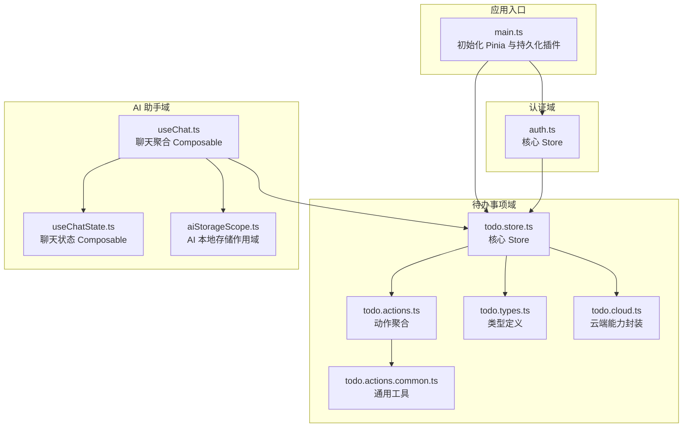
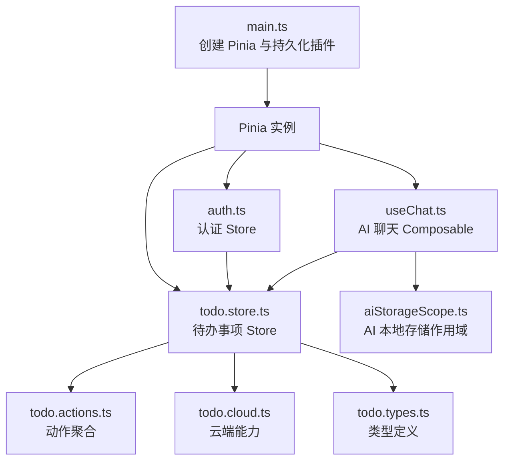
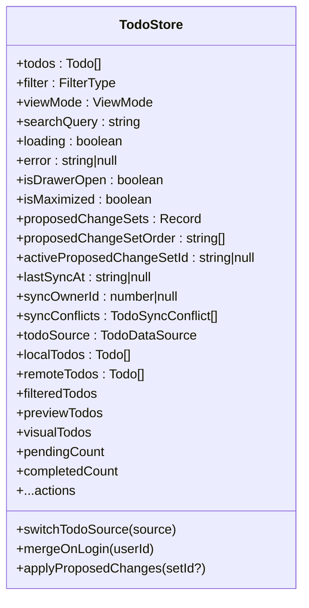
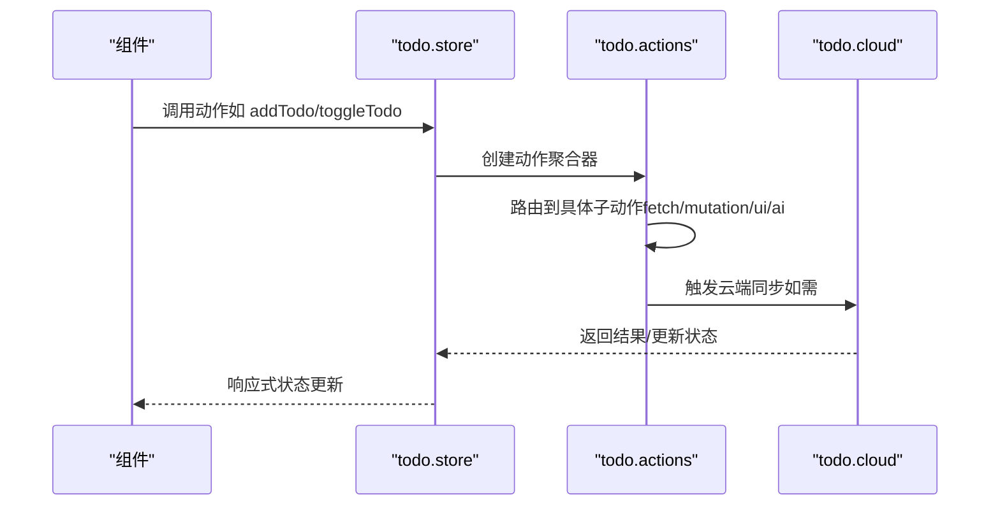
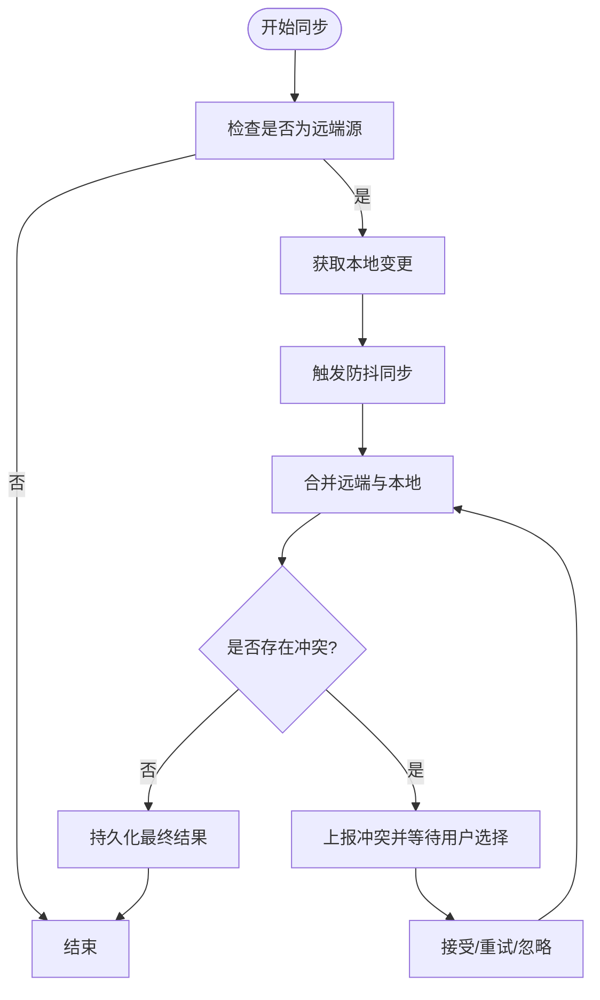
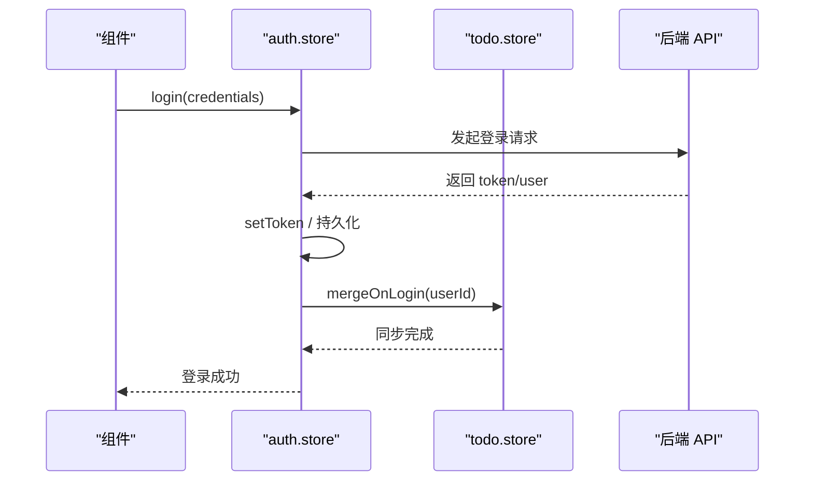
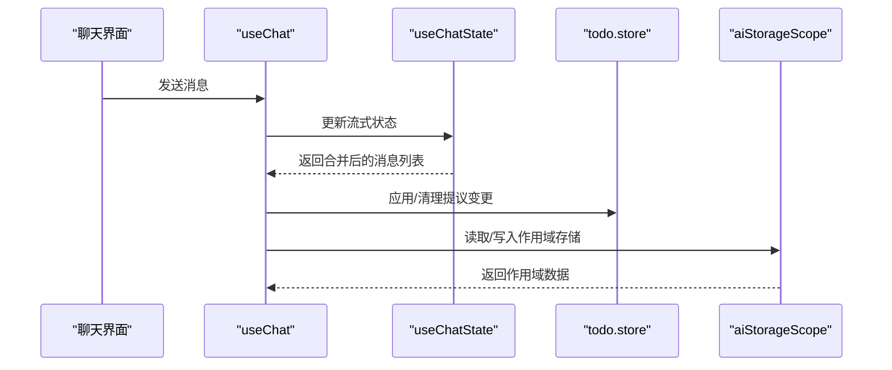
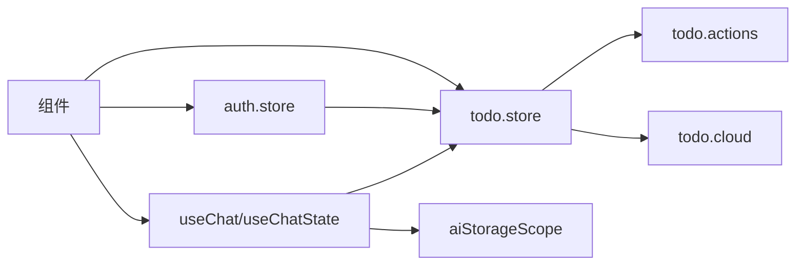

# 状态管理

<cite>
**本文档引用的文件**
- [apps/frontend/src/main.ts](file://apps/frontend/src/main.ts)
- [apps/frontend/src/features/todo/stores/todo.store.ts](file://apps/frontend/src/features/todo/stores/todo.store.ts)
- [apps/frontend/src/features/todo/stores/todo.ts](file://apps/frontend/src/features/todo/stores/todo.ts)
- [apps/frontend/src/features/todo/stores/todo.types.ts](file://apps/frontend/src/features/todo/stores/todo.types.ts)
- [apps/frontend/src/features/todo/stores/todo.actions.ts](file://apps/frontend/src/features/todo/stores/todo.actions.ts)
- [apps/frontend/src/features/todo/stores/todo.actions.common.ts](file://apps/frontend/src/features/todo/stores/todo.actions.common.ts)
- [apps/frontend/src/features/todo/stores/todo.cloud.ts](file://apps/frontend/src/features/todo/stores/todo.cloud.ts)
- [apps/frontend/src/features/auth/stores/auth.ts](file://apps/frontend/src/features/auth/stores/auth.ts)
- [apps/frontend/src/features/ai/composables/useChatState.ts](file://apps/frontend/src/features/ai/composables/useChatState.ts)
- [apps/frontend/src/features/ai/composables/useChat.ts](file://apps/frontend/src/features/ai/composables/useChat.ts)
- [apps/frontend/src/features/ai/composables/aiStorageScope.ts](file://apps/frontend/src/features/ai/composables/aiStorageScope.ts)
</cite>

## 目录
1. [简介](#简介)
2. [项目结构](#项目结构)
3. [核心组件](#核心组件)
4. [架构总览](#架构总览)
5. [详细组件分析](#详细组件分析)
6. [依赖关系分析](#依赖关系分析)
7. [性能考量](#性能考量)
8. [故障排查指南](#故障排查指南)
9. [结论](#结论)
10. [附录](#附录)

## 简介
本文件系统性梳理 Lumina Todo 前端的状态管理体系，围绕 Pinia 状态管理的设计与实现展开，重点覆盖以下方面：
- Store 的组织结构与模块化设计
- 待办事项、用户认证、AI 助手三大功能域的状态设计与交互
- 状态持久化机制与本地存储策略
- 异步操作处理与副作用管理
- 状态调试与监控方法
- 最佳实践与性能优化建议
- 不同组件间的状态共享与访问模式

## 项目结构
前端采用 Pinia 进行状态管理，并通过模块化拆分将各功能域的状态与行为解耦。整体结构如下：
- 应用入口初始化 Pinia 并启用持久化插件，同时配置全局错误处理与查询缓存策略
- 待办事项域：以 todo.store 为核心，配合 actions、cloud、types 等模块化文件组织状态与行为
- 用户认证域：以 auth.store 为核心，负责登录、登出、令牌刷新与持久化
- AI 助手域：以 useChatState/useChat 等 composable 为核心，管理聊天状态与流式响应，结合 AI 存储作用域工具进行本地持久化隔离

图表来源
- [apps/frontend/src/main.ts:115-132](file://apps/frontend/src/main.ts#L115-L132)
- [apps/frontend/src/features/todo/stores/todo.store.ts:21-316](file://apps/frontend/src/features/todo/stores/todo.store.ts#L21-L316)
- [apps/frontend/src/features/todo/stores/todo.actions.ts:8-104](file://apps/frontend/src/features/todo/stores/todo.actions.ts#L8-L104)
- [apps/frontend/src/features/todo/stores/todo.cloud.ts:6-43](file://apps/frontend/src/features/todo/stores/todo.cloud.ts#L6-L43)
- [apps/frontend/src/features/todo/stores/todo.types.ts:1-68](file://apps/frontend/src/features/todo/stores/todo.types.ts#L1-L68)
- [apps/frontend/src/features/auth/stores/auth.ts:23-390](file://apps/frontend/src/features/auth/stores/auth.ts#L23-L390)
- [apps/frontend/src/features/ai/composables/useChat.ts:21-118](file://apps/frontend/src/features/ai/composables/useChat.ts#L21-L118)
- [apps/frontend/src/features/ai/composables/useChatState.ts:41-143](file://apps/frontend/src/features/ai/composables/useChatState.ts#L41-L143)
- [apps/frontend/src/features/ai/composables/aiStorageScope.ts:45-100](file://apps/frontend/src/features/ai/composables/aiStorageScope.ts#L45-L100)

章节来源
- [apps/frontend/src/main.ts:115-132](file://apps/frontend/src/main.ts#L115-L132)
- [apps/frontend/src/features/todo/stores/todo.store.ts:21-316](file://apps/frontend/src/features/todo/stores/todo.store.ts#L21-L316)
- [apps/frontend/src/features/todo/stores/todo.actions.ts:8-104](file://apps/frontend/src/features/todo/stores/todo.actions.ts#L8-L104)
- [apps/frontend/src/features/todo/stores/todo.cloud.ts:6-43](file://apps/frontend/src/features/todo/stores/todo.cloud.ts#L6-L43)
- [apps/frontend/src/features/todo/stores/todo.types.ts:1-68](file://apps/frontend/src/features/todo/stores/todo.types.ts#L1-L68)
- [apps/frontend/src/features/auth/stores/auth.ts:23-390](file://apps/frontend/src/features/auth/stores/auth.ts#L23-L390)
- [apps/frontend/src/features/ai/composables/useChat.ts:21-118](file://apps/frontend/src/features/ai/composables/useChat.ts#L21-L118)
- [apps/frontend/src/features/ai/composables/useChatState.ts:41-143](file://apps/frontend/src/features/ai/composables/useChatState.ts#L41-L143)
- [apps/frontend/src/features/ai/composables/aiStorageScope.ts:45-100](file://apps/frontend/src/features/ai/composables/aiStorageScope.ts#L45-L100)

## 核心组件
- Pinia 初始化与持久化
  - 在应用入口创建 Pinia 实例并安装持久化插件，为后续各 Store 的持久化提供统一基础
  - 同时配置全局错误处理与查询缓存策略，提升用户体验与稳定性
- 待办事项 Store（todo.store）
  - 聚合状态、计算属性、副作用与动作，形成完整的 Todo 生命周期管理
  - 将过滤、排序、预览、源切换、冲突处理、云端同步等能力模块化封装
- 认证 Store（auth.store）
  - 管理令牌、用户信息与错误状态，提供登录、注册、刷新、登出等完整流程
  - 支持从本地存储恢复认证状态，并在登录/登出时联动待办数据合并与清理
- AI 助手 Composable（useChatState/useChat）
  - 提供聊天状态、流式响应、教学问答等能力，支持与待办变更提议联动
  - 通过 AI 存储作用域工具实现匿名与用户态的本地数据隔离

章节来源
- [apps/frontend/src/main.ts:115-132](file://apps/frontend/src/main.ts#L115-L132)
- [apps/frontend/src/features/todo/stores/todo.store.ts:21-316](file://apps/frontend/src/features/todo/stores/todo.store.ts#L21-L316)
- [apps/frontend/src/features/auth/stores/auth.ts:23-390](file://apps/frontend/src/features/auth/stores/auth.ts#L23-L390)
- [apps/frontend/src/features/ai/composables/useChatState.ts:41-143](file://apps/frontend/src/features/ai/composables/useChatState.ts#L41-L143)
- [apps/frontend/src/features/ai/composables/useChat.ts:21-118](file://apps/frontend/src/features/ai/composables/useChat.ts#L21-L118)

## 架构总览
下图展示状态管理在应用中的总体交互：入口初始化 -> Store 注入 -> 功能域协同 -> 云端与本地持久化。

图表来源
- [apps/frontend/src/main.ts:115-132](file://apps/frontend/src/main.ts#L115-L132)
- [apps/frontend/src/features/todo/stores/todo.store.ts:21-316](file://apps/frontend/src/features/todo/stores/todo.store.ts#L21-L316)
- [apps/frontend/src/features/todo/stores/todo.actions.ts:8-104](file://apps/frontend/src/features/todo/stores/todo.actions.ts#L8-L104)
- [apps/frontend/src/features/todo/stores/todo.cloud.ts:6-43](file://apps/frontend/src/features/todo/stores/todo.cloud.ts#L6-L43)
- [apps/frontend/src/features/todo/stores/todo.types.ts:1-68](file://apps/frontend/src/features/todo/stores/todo.types.ts#L1-L68)
- [apps/frontend/src/features/auth/stores/auth.ts:23-390](file://apps/frontend/src/features/auth/stores/auth.ts#L23-L390)
- [apps/frontend/src/features/ai/composables/useChat.ts:21-118](file://apps/frontend/src/features/ai/composables/useChat.ts#L21-L118)
- [apps/frontend/src/features/ai/composables/aiStorageScope.ts:45-100](file://apps/frontend/src/features/ai/composables/aiStorageScope.ts#L45-L100)

## 详细组件分析

### 待办事项状态管理（todo.store）
- 状态组织
  - 核心状态：待办列表、过滤器、视图模式、搜索词、加载/错误状态、抽屉开关与最大化状态、垃圾箱加载状态、提议变更集与活动集 ID、最后同步时间与同步拥有者、同步冲突、数据源（本地/远端）及本地/远端副本
  - 计算属性：全展开判断、待完成/已完成数量、基于提议变更的预览列表、视觉模式列表等
- 模块化设计
  - 过滤与排序：基于过滤器与搜索词的组合计算
  - 源管理：根据数据源自动切换并持久化当前源的待办
  - 日期标准化：统一时间字段格式，保证序列化一致性
  - 提议变更：构建基线预览与活动提议集，支持应用/丢弃/清理
  - 云端集成：封装同步、冲突处理、监听与垃圾箱清理
- 异步与副作用
  - 监听待办列表变化，自动标准化日期并持久化当前源
  - 监听数据源变化，应用对应源的快照
  - 监听搜索词与视图模式变化，驱动 UI 行为
- 导出接口
  - 返回状态、计算属性与动作集合，便于组件直接注入使用

图表来源
- [apps/frontend/src/features/todo/stores/todo.store.ts:21-316](file://apps/frontend/src/features/todo/stores/todo.store.ts#L21-L316)
- [apps/frontend/src/features/todo/stores/todo.types.ts:3-39](file://apps/frontend/src/features/todo/stores/todo.types.ts#L3-L39)

章节来源
- [apps/frontend/src/features/todo/stores/todo.store.ts:21-316](file://apps/frontend/src/features/todo/stores/todo.store.ts#L21-L316)
- [apps/frontend/src/features/todo/stores/todo.types.ts:1-68](file://apps/frontend/src/features/todo/stores/todo.types.ts#L1-L68)

### 动作模块化（todo.actions）
- 动作聚合器将 Fetch、Mutations、UI、AI 等子动作组合，统一对外暴露
- 通过依赖注入的方式，将 Store 内部状态与计算属性传递给子动作模块，避免重复订阅与耦合

图表来源
- [apps/frontend/src/features/todo/stores/todo.actions.ts:8-104](file://apps/frontend/src/features/todo/stores/todo.actions.ts#L8-L104)
- [apps/frontend/src/features/todo/stores/todo.store.ts:186-203](file://apps/frontend/src/features/todo/stores/todo.store.ts#L186-L203)
- [apps/frontend/src/features/todo/stores/todo.cloud.ts:6-43](file://apps/frontend/src/features/todo/stores/todo.cloud.ts#L6-L43)

章节来源
- [apps/frontend/src/features/todo/stores/todo.actions.ts:8-104](file://apps/frontend/src/features/todo/stores/todo.actions.ts#L8-L104)
- [apps/frontend/src/features/todo/stores/todo.store.ts:186-203](file://apps/frontend/src/features/todo/stores/todo.store.ts#L186-L203)
- [apps/frontend/src/features/todo/stores/todo.cloud.ts:6-43](file://apps/frontend/src/features/todo/stores/todo.cloud.ts#L6-L43)

### 云端同步与冲突处理（todo.cloud）
- 能力封装：提供同步、防抖同步、登录合并、冲突接受/重试/清理、Socket 监听、永久删除、清空垃圾箱等
- 与 Store 协作：通过回调与状态引用，驱动 Store 内部的冲突列表、最后同步时间、拥有者等状态更新

图表来源
- [apps/frontend/src/features/todo/stores/todo.cloud.ts:6-43](file://apps/frontend/src/features/todo/stores/todo.cloud.ts#L6-L43)
- [apps/frontend/src/features/todo/stores/todo.store.ts:173-184](file://apps/frontend/src/features/todo/stores/todo.store.ts#L173-L184)

章节来源
- [apps/frontend/src/features/todo/stores/todo.cloud.ts:6-43](file://apps/frontend/src/features/todo/stores/todo.cloud.ts#L6-L43)
- [apps/frontend/src/features/todo/stores/todo.store.ts:173-184](file://apps/frontend/src/features/todo/stores/todo.store.ts#L173-L184)

### 认证状态管理（auth.store）
- 关键职责：登录/注册/忘记密码/重置密码、获取当前用户、刷新访问令牌、登出
- 持久化策略：将 token、refreshToken、user 保存至 localStorage，并在登录后立即同步到请求拦截器
- 与待办联动：登录成功后触发待办数据合并；登出时清理远程数据并回退到本地视图

图表来源
- [apps/frontend/src/features/auth/stores/auth.ts:148-179](file://apps/frontend/src/features/auth/stores/auth.ts#L148-L179)
- [apps/frontend/src/features/todo/stores/todo.store.ts:205-220](file://apps/frontend/src/features/todo/stores/todo.store.ts#L205-L220)

章节来源
- [apps/frontend/src/features/auth/stores/auth.ts:148-179](file://apps/frontend/src/features/auth/stores/auth.ts#L148-L179)
- [apps/frontend/src/features/todo/stores/todo.store.ts:205-220](file://apps/frontend/src/features/todo/stores/todo.store.ts#L205-L220)

### AI 助手状态管理（useChatState/useChat）
- useChatState：维护聊天的流式响应、思考内容、推理细节、讨论步骤、待办提议、错误与重试次数等
- useChat：聚合状态与动作，计算“合并消息列表”（含流式解析），并与待办 Store 协作处理提议
- AI 本地存储作用域：根据用户 ID 或匿名态生成作用域键，实现本地数据隔离与迁移

图表来源
- [apps/frontend/src/features/ai/composables/useChat.ts:21-118](file://apps/frontend/src/features/ai/composables/useChat.ts#L21-L118)
- [apps/frontend/src/features/ai/composables/useChatState.ts:41-143](file://apps/frontend/src/features/ai/composables/useChatState.ts#L41-L143)
- [apps/frontend/src/features/ai/composables/aiStorageScope.ts:45-100](file://apps/frontend/src/features/ai/composables/aiStorageScope.ts#L45-L100)

章节来源
- [apps/frontend/src/features/ai/composables/useChat.ts:21-118](file://apps/frontend/src/features/ai/composables/useChat.ts#L21-L118)
- [apps/frontend/src/features/ai/composables/useChatState.ts:41-143](file://apps/frontend/src/features/ai/composables/useChatState.ts#L41-L143)
- [apps/frontend/src/features/ai/composables/aiStorageScope.ts:45-100](file://apps/frontend/src/features/ai/composables/aiStorageScope.ts#L45-L100)

## 依赖关系分析
- 组件与 Store 的依赖
  - 组件通过依赖注入方式使用 Store，避免直接导入造成循环依赖
  - 动作模块通过参数注入状态与计算属性，降低耦合度
- Store 之间的协作
  - 认证 Store 在登录/登出时与待办 Store 协作，确保数据源切换与清理一致
  - AI 助手与待办 Store 通过提议变更进行联动
- 外部依赖
  - Pinia 持久化插件用于本地持久化
  - Vue Query 用于数据请求缓存与重试策略

图表来源
- [apps/frontend/src/features/todo/stores/todo.store.ts:21-316](file://apps/frontend/src/features/todo/stores/todo.store.ts#L21-L316)
- [apps/frontend/src/features/todo/stores/todo.actions.ts:8-104](file://apps/frontend/src/features/todo/stores/todo.actions.ts#L8-L104)
- [apps/frontend/src/features/todo/stores/todo.cloud.ts:6-43](file://apps/frontend/src/features/todo/stores/todo.cloud.ts#L6-L43)
- [apps/frontend/src/features/auth/stores/auth.ts:23-390](file://apps/frontend/src/features/auth/stores/auth.ts#L23-L390)
- [apps/frontend/src/features/ai/composables/useChat.ts:21-118](file://apps/frontend/src/features/ai/composables/useChat.ts#L21-L118)
- [apps/frontend/src/features/ai/composables/useChatState.ts:41-143](file://apps/frontend/src/features/ai/composables/useChatState.ts#L41-L143)
- [apps/frontend/src/features/ai/composables/aiStorageScope.ts:45-100](file://apps/frontend/src/features/ai/composables/aiStorageScope.ts#L45-L100)

章节来源
- [apps/frontend/src/features/todo/stores/todo.store.ts:21-316](file://apps/frontend/src/features/todo/stores/todo.store.ts#L21-L316)
- [apps/frontend/src/features/todo/stores/todo.actions.ts:8-104](file://apps/frontend/src/features/todo/stores/todo.actions.ts#L8-L104)
- [apps/frontend/src/features/todo/stores/todo.cloud.ts:6-43](file://apps/frontend/src/features/todo/stores/todo.cloud.ts#L6-L43)
- [apps/frontend/src/features/auth/stores/auth.ts:23-390](file://apps/frontend/src/features/auth/stores/auth.ts#L23-L390)
- [apps/frontend/src/features/ai/composables/useChat.ts:21-118](file://apps/frontend/src/features/ai/composables/useChat.ts#L21-L118)
- [apps/frontend/src/features/ai/composables/useChatState.ts:41-143](file://apps/frontend/src/features/ai/composables/useChatState.ts#L41-L143)
- [apps/frontend/src/features/ai/composables/aiStorageScope.ts:45-100](file://apps/frontend/src/features/ai/composables/aiStorageScope.ts#L45-L100)

## 性能考量
- 响应式与计算属性
  - 使用 computed 对过滤/排序/预览等昂贵操作进行缓存，减少不必要重渲染
- 深度监听与去抖
  - 对待办列表变化采用深度监听并结合防抖同步，避免频繁网络请求
- 数据源切换
  - 在本地/远端源之间切换时，优先应用快照并延迟持久化，降低同步成本
- 查询缓存
  - 通过 Vue Query 的默认缓存策略与重试次数控制，平衡网络波动与用户体验
- 本地存储
  - 仅持久化必要字段，避免存储超大数据，减少序列化/反序列化开销

## 故障排查指南
- 登录/令牌刷新失败
  - 检查认证 Store 的错误状态与字段错误，确认是否为未授权错误或瞬时网络错误
  - 若为未授权，触发登出流程并清理本地状态
- 同步冲突
  - 查看同步冲突列表，区分墓碑、拥有者不匹配、版本冲突等类型
  - 提供接受/重试/清理操作，必要时回滚本地变更
- 流式响应异常
  - 检查聊天状态中的错误与重试次数，确认是否为网络中断或服务端异常
  - 清理流式状态并重试
- 本地存储异常
  - 确认持久化键与 pick 字段是否正确，必要时清理过期或损坏的数据

章节来源
- [apps/frontend/src/features/auth/stores/auth.ts:71-97](file://apps/frontend/src/features/auth/stores/auth.ts#L71-L97)
- [apps/frontend/src/features/todo/stores/todo.store.ts:162-184](file://apps/frontend/src/features/todo/stores/todo.store.ts#L162-L184)
- [apps/frontend/src/features/ai/composables/useChatState.ts:75-77](file://apps/frontend/src/features/ai/composables/useChatState.ts#L75-L77)

## 结论
本状态管理体系以 Pinia 为核心，通过模块化与动作聚合实现高内聚低耦合的状态管理。待办事项域提供完善的本地/云端协同与冲突处理；认证域保障安全与会话生命周期；AI 助手域通过作用域存储实现数据隔离与迁移。整体设计兼顾可维护性与性能，适合在复杂业务场景中持续演进。

## 附录
- 类型与常量
  - 待办类型、过滤器类型、视图模式、数据源类型、同步冲突原因等集中定义于类型文件
- 工具函数
  - 通用 ID 生成、服务器待办映射、重复校验、路径查找等工具函数提升复用性

章节来源
- [apps/frontend/src/features/todo/stores/todo.types.ts:1-68](file://apps/frontend/src/features/todo/stores/todo.types.ts#L1-L68)
- [apps/frontend/src/features/todo/stores/todo.actions.common.ts:4-84](file://apps/frontend/src/features/todo/stores/todo.actions.common.ts#L4-L84)