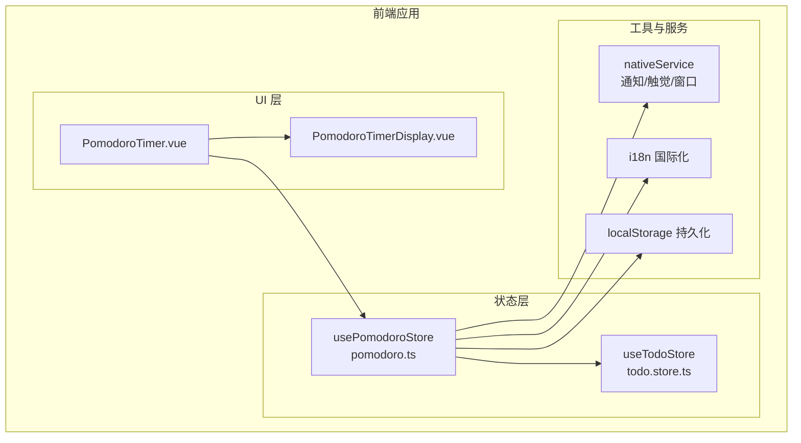
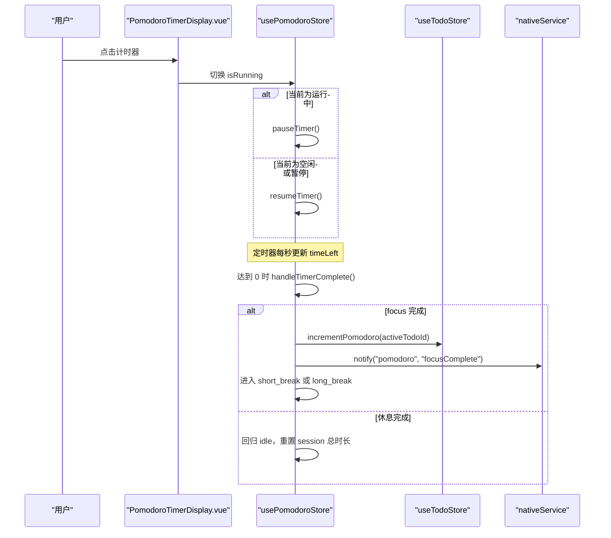
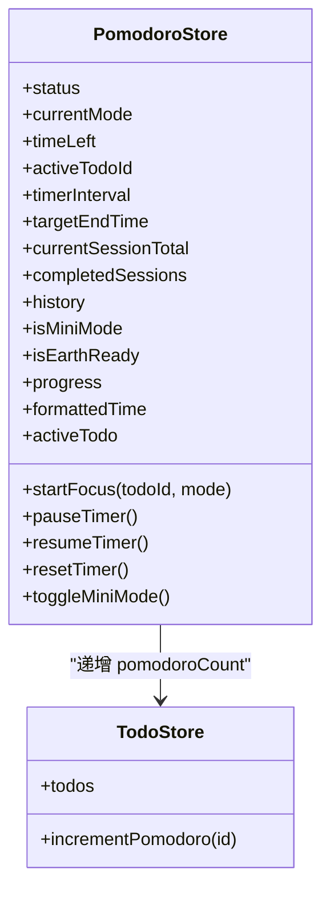
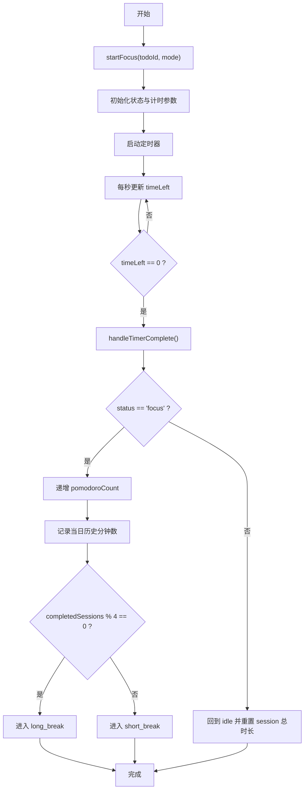
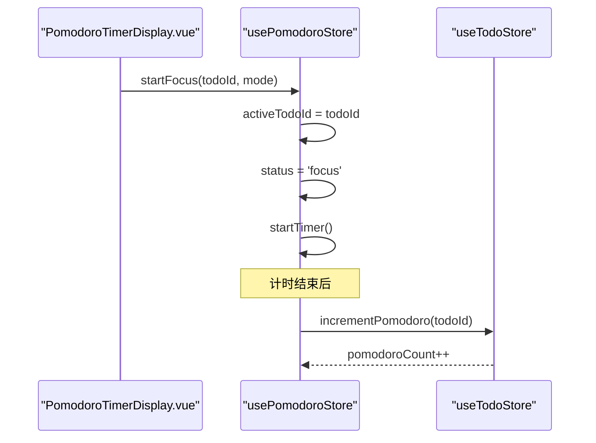
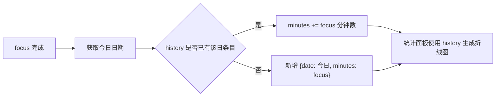
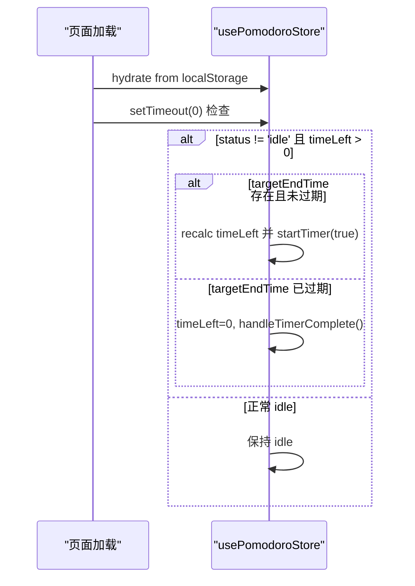
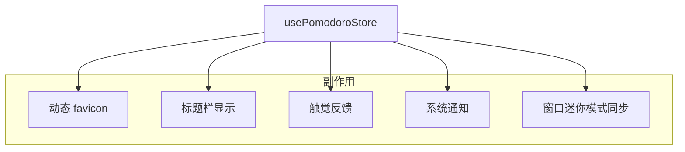
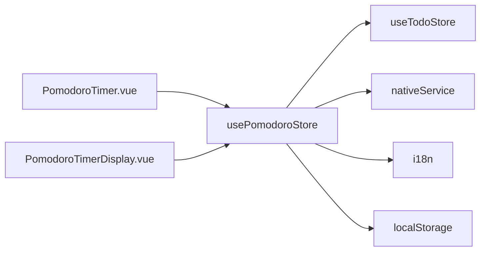

# 番茄钟状态

<cite>
**本文引用的文件**
- [pomodoro.ts](file://apps/frontend/src/features/todo/stores/pomodoro.ts)
- [pomodoro.spec.ts](file://apps/frontend/tests/features/todo/stores/pomodoro.spec.ts)
- [PomodoroTimer.vue](file://apps/frontend/src/features/todo/components/PomodoroTimer.vue)
- [PomodoroTimerDisplay.vue](file://apps/frontend/src/features/todo/components/pomodoro/PomodoroTimerDisplay.vue)
- [todo.store.ts](file://apps/frontend/src/features/todo/stores/todo.store.ts)
- [todo.types.ts](file://apps/frontend/src/features/todo/stores/todo.types.ts)
- [todo.actions.mutations.ts](file://apps/frontend/src/features/todo/stores/todo.actions.mutations.ts)
- [useTodoStatisticsOptions.ts](file://apps/frontend/src/features/todo/composables/useTodoStatisticsOptions.ts)
- [pomodoro.ts（中文国际化）](file://apps/frontend/src/i18n/locales/zh-CN/pomodoro.ts)
</cite>

## 目录
1. [简介](#简介)
2. [项目结构](#项目结构)
3. [核心组件](#核心组件)
4. [架构总览](#架构总览)
5. [详细组件分析](#详细组件分析)
6. [依赖关系分析](#依赖关系分析)
7. [性能考量](#性能考量)
8. [故障排查指南](#故障排查指南)
9. [结论](#结论)
10. [附录](#附录)

## 简介
本文件系统性阐述前端“番茄钟”状态管理的设计与实现，围绕 pomodoro.ts 展开，覆盖以下主题：
- 计时器状态与工作/休息周期的状态机设计
- 启动、暂停、恢复、重置等操作的状态变化
- 与待办事项的集成与任务绑定机制
- 统计数据采集与可视化展示
- 本地持久化与恢复策略
- 用户体验优化与状态同步机制

## 项目结构
番茄钟相关代码位于前端应用的 todo 功能域内，采用 Pinia 状态管理，配合 Vue 组合式 API 与可选的原生服务（如通知、触觉反馈、窗口迷你模式），并以本地存储进行状态持久化。

**图表来源**
- [pomodoro.ts:32-401](file://apps/frontend/src/features/todo/stores/pomodoro.ts#L32-L401)
- [PomodoroTimer.vue:1-174](file://apps/frontend/src/features/todo/components/PomodoroTimer.vue#L1-L174)
- [PomodoroTimerDisplay.vue:1-142](file://apps/frontend/src/features/todo/components/pomodoro/PomodoroTimerDisplay.vue#L1-L142)
- [todo.store.ts:21-335](file://apps/frontend/src/features/todo/stores/todo.store.ts#L21-L335)

**章节来源**
- [pomodoro.ts:1-402](file://apps/frontend/src/features/todo/stores/pomodoro.ts#L1-L402)
- [PomodoroTimer.vue:1-174](file://apps/frontend/src/features/todo/components/PomodoroTimer.vue#L1-L174)

## 核心组件
- 番茄钟状态仓库：usePomodoroStore
  - 负责计时器状态、当前模式、剩余时间、会话统计、历史记录、迷你模式等
  - 提供启动、暂停、恢复、重置、切换迷你模式等动作
  - 集成触觉反馈、桌面通知、动态 favicon、标题栏显示
  - 基于 localStorage 进行关键字段的持久化
- 待办事项仓库：useTodoStore
  - 提供任务增删改查、父子级联动、同步与冲突处理
  - 在番茄钟完成时递增任务的 pomodoroCount
- UI 组件
  - PomodoroTimer.vue：迷你模式容器、动画与布局
  - PomodoroTimerDisplay.vue：倒计时显示、进度环、点击切换运行/暂停
- 统计与展示
  - useTodoStatisticsOptions.ts：基于 pomodoro.history 构建周焦点时长折线图
- 国际化
  - pomodoro.ts（中文）：状态文案、提示语等

**章节来源**
- [pomodoro.ts:32-401](file://apps/frontend/src/features/todo/stores/pomodoro.ts#L32-L401)
- [todo.store.ts:21-335](file://apps/frontend/src/features/todo/stores/todo.store.ts#L21-L335)
- [PomodoroTimer.vue:1-174](file://apps/frontend/src/features/todo/components/PomodoroTimer.vue#L1-L174)
- [PomodoroTimerDisplay.vue:1-142](file://apps/frontend/src/features/todo/components/pomodoro/PomodoroTimerDisplay.vue#L1-L142)
- [useTodoStatisticsOptions.ts:245-343](file://apps/frontend/src/features/todo/composables/useTodoStatisticsOptions.ts#L245-L343)
- [pomodoro.ts（中文国际化）:1-23](file://apps/frontend/src/i18n/locales/zh-CN/pomodoro.ts#L1-L23)

## 架构总览
番茄钟状态管理采用“状态驱动 + 主动副作用”的模式：
- 状态驱动：通过 ref/computed/watch 驱动 UI 与副作用（标题、favicon、通知）
- 主动副作用：定时器、触觉反馈、原生通知、窗口迷你模式同步
- 数据持久化：仅对关键状态字段进行本地持久化，避免冗余与跨版本兼容问题

**图表来源**
- [pomodoro.ts:267-356](file://apps/frontend/src/features/todo/stores/pomodoro.ts#L267-L356)
- [todo.actions.mutations.ts:265-273](file://apps/frontend/src/features/todo/stores/todo.actions.mutations.ts#L265-L273)

**章节来源**
- [pomodoro.ts:196-356](file://apps/frontend/src/features/todo/stores/pomodoro.ts#L196-L356)
- [todo.actions.mutations.ts:265-273](file://apps/frontend/src/features/todo/stores/todo.actions.mutations.ts#L265-L273)

## 详细组件分析

### 番茄钟状态模型与模式配置
- 状态类型
  - 状态枚举：idle/focus/short_break/long_break
  - 模式枚举：classic/icebreaker/flow/cosmos
- 模式配置
  - 每个模式包含 focus、shortBreak、longBreak 三段时长（分钟）
- 关键状态字段
  - status、currentMode、timeLeft、activeTodoId、timerInterval、targetEndTime、currentSessionTotal、completedSessions、history、isMiniMode、isEarthReady
- 计算派生
  - progress：基于当前 session 总时长与剩余时间计算百分比
  - formattedTime：MM:SS 格式化
  - activeTodo：根据 activeTodoId 从 todoStore 获取当前任务

**图表来源**
- [pomodoro.ts:10-52](file://apps/frontend/src/features/todo/stores/pomodoro.ts#L10-L52)
- [pomodoro.ts:362-382](file://apps/frontend/src/features/todo/stores/pomodoro.ts#L362-L382)
- [todo.store.ts:21-335](file://apps/frontend/src/features/todo/stores/todo.store.ts#L21-L335)
- [todo.actions.mutations.ts:265-273](file://apps/frontend/src/features/todo/stores/todo.actions.mutations.ts#L265-L273)

**章节来源**
- [pomodoro.ts:10-52](file://apps/frontend/src/features/todo/stores/pomodoro.ts#L10-L52)
- [pomodoro.ts:362-382](file://apps/frontend/src/features/todo/stores/pomodoro.ts#L362-L382)

### 计时器与状态机
- 启动流程
  - 清理旧定时器
  - 设置 activeTodoId、currentMode、status=focus
  - 初始化 currentSessionTotal 与 timeLeft
  - 开启定时器
  - 触发触觉反馈
- 运行逻辑
  - 使用 targetEndTime 与 Date.now() 计算剩余时间，确保跨页面刷新后的时间一致性
  - 每秒更新一次 timeLeft
  - 到达 0 时触发 handleTimerComplete
- 完成处理
  - focus 完成：累计 completedSessions；按 4 次一周期决定进入 short_break 或 long_break；记录当日历史分钟数；递增任务 pomodoroCount；发送成功通知与触觉反馈
  - 休息完成：回到 idle，重置当前 session 总时长与剩余时间；发送信息类通知
- 暂停/恢复/重置
  - pauseTimer：清理定时器、清空 targetEndTime
  - resumeTimer：若处于 idle 且存在 activeTodo，则重启 focus；否则继续当前状态
  - resetTimer：停止计时，重置为 idle，清除 activeTodoId，恢复默认模式与 session 总时长

**图表来源**
- [pomodoro.ts:196-356](file://apps/frontend/src/features/todo/stores/pomodoro.ts#L196-L356)
- [todo.actions.mutations.ts:265-273](file://apps/frontend/src/features/todo/stores/todo.actions.mutations.ts#L265-L273)

**章节来源**
- [pomodoro.ts:196-356](file://apps/frontend/src/features/todo/stores/pomodoro.ts#L196-L356)
- [pomodoro.spec.ts:112-126](file://apps/frontend/tests/features/todo/stores/pomodoro.spec.ts#L112-L126)

### 与待办事项的集成与任务绑定
- 任务绑定
  - startFocus 接收 todoId，并将其写入 activeTodoId
  - activeTodo 计算属性基于 activeTodoId 从 todoStore.todos 查询当前任务
- 统计与追踪
  - focus 完成时调用 todoStore.incrementPomodoro(activeTodoId)，将 pomodoroCount 加 1
  - pomodoro.history 记录当日累计分钟数，用于统计面板
- 同步与持久化
  - todoStore 本身具备本地持久化（todos、过滤器、视图等）
  - pomodoroStore 也具备独立的本地持久化（关键状态字段）

**图表来源**
- [pomodoro.ts:196-209](file://apps/frontend/src/features/todo/stores/pomodoro.ts#L196-L209)
- [todo.actions.mutations.ts:265-273](file://apps/frontend/src/features/todo/stores/todo.actions.mutations.ts#L265-L273)

**章节来源**
- [pomodoro.ts:74-76](file://apps/frontend/src/features/todo/stores/pomodoro.ts#L74-L76)
- [todo.types.ts:17-17](file://apps/frontend/src/features/todo/stores/todo.types.ts#L17-L17)
- [todo.actions.mutations.ts:265-273](file://apps/frontend/src/features/todo/stores/todo.actions.mutations.ts#L265-L273)

### 统计数据采集与展示
- 历史记录
  - pomodoro.history：每日累计分钟数数组，键为日期字符串（YYYY-MM-DD），值为分钟数
  - focus 完成时按当前模式的 focus 分钟数累加或新增当日条目
- 统计面板
  - useTodoStatisticsOptions 将 pomodoro.history 转换为最近七天的折线图数据，用于展示“周焦点时长”
- 多语言
  - pomodoro.ts（中文）提供状态文案与提示语，国际化由 i18n 全局提供

**图表来源**
- [pomodoro.ts:325-332](file://apps/frontend/src/features/todo/stores/pomodoro.ts#L325-L332)
- [useTodoStatisticsOptions.ts:262-268](file://apps/frontend/src/features/todo/composables/useTodoStatisticsOptions.ts#L262-L268)

**章节来源**
- [pomodoro.ts:325-332](file://apps/frontend/src/features/todo/stores/pomodoro.ts#L325-L332)
- [useTodoStatisticsOptions.ts:245-343](file://apps/frontend/src/features/todo/composables/useTodoStatisticsOptions.ts#L245-L343)
- [pomodoro.ts（中文国际化）:1-23](file://apps/frontend/src/i18n/locales/zh-CN/pomodoro.ts#L1-L23)

### 本地持久化与恢复策略
- pomodoroStore 持久化字段
  - completedSessions、history、isMiniMode、status、timeLeft、activeTodoId、currentMode、targetEndTime、currentSessionTotal
- 恢复策略
  - 页面加载后延时检查：若 status 不为 idle 且 timeLeft > 0，则根据 targetEndTime 重新计算剩余时间并恢复定时器
  - 若 targetEndTime 已过期，则直接触发完成逻辑（保证状态一致性）
- 注意
  - 未持久化的中间态（如 timerInterval）在刷新后自动恢复运行，避免丢失正在进行的工作会话

**图表来源**
- [pomodoro.ts:247-265](file://apps/frontend/src/features/todo/stores/pomodoro.ts#L247-L265)

**章节来源**
- [pomodoro.ts:247-265](file://apps/frontend/src/features/todo/stores/pomodoro.ts#L247-L265)
- [pomodoro.ts:384-400](file://apps/frontend/src/features/todo/stores/pomodoro.ts#L384-L400)

### 用户体验优化与状态同步
- 动态 favicon 与标题栏
  - 根据 progress 与主题色绘制进度环 favicon
  - 在非 idle 状态下显示“(MM:SS) 应用名”，idle 状态恢复全名
- 触觉反馈与通知
  - 成功完成时发送成功触觉反馈与系统通知
  - 失败降级：异常不中断计时
- 迷你模式与窗口同步
  - isMiniMode 变化时同步至原生窗口（Wails）
  - UI 层根据 isMiniMode 与平台渲染不同布局
- 动画与视觉
  - 状态变更时的入场动画
  - 运行中显示脉冲光晕效果

**图表来源**
- [pomodoro.ts:96-125](file://apps/frontend/src/features/todo/stores/pomodoro.ts#L96-L125)
- [pomodoro.ts:131-193](file://apps/frontend/src/features/todo/stores/pomodoro.ts#L131-L193)
- [pomodoro.ts:310-320](file://apps/frontend/src/features/todo/stores/pomodoro.ts#L310-L320)
- [pomodoro.ts:55-71](file://apps/frontend/src/features/todo/stores/pomodoro.ts#L55-L71)
- [PomodoroTimer.vue:49-76](file://apps/frontend/src/features/todo/components/PomodoroTimer.vue#L49-L76)

**章节来源**
- [pomodoro.ts:96-125](file://apps/frontend/src/features/todo/stores/pomodoro.ts#L96-L125)
- [pomodoro.ts:131-193](file://apps/frontend/src/features/todo/stores/pomodoro.ts#L131-L193)
- [pomodoro.ts:310-320](file://apps/frontend/src/features/todo/stores/pomodoro.ts#L310-L320)
- [pomodoro.ts:55-71](file://apps/frontend/src/features/todo/stores/pomodoro.ts#L55-L71)
- [PomodoroTimer.vue:49-76](file://apps/frontend/src/features/todo/components/PomodoroTimer.vue#L49-L76)

## 依赖关系分析
- 组件耦合
  - PomodoroTimer.vue 依赖 usePomodoroStore 与 GSAP 动画
  - PomodoroTimerDisplay.vue 依赖 usePomodoroStore 与主题色
  - usePomodoroStore 依赖 useTodoStore、nativeService、i18n、localStorage
- 数据流向
  - UI -> Store：启动/暂停/恢复/重置
  - Store -> Store：状态流转与副作用
  - Store -> Todo：递增 pomodoroCount
  - Store -> nativeService：触觉、通知、窗口
- 潜在风险
  - 定时器与页面生命周期：通过 targetEndTime 与恢复逻辑规避跨页丢失
  - 国际化与主题色：通过 computed 与 watch 确保动态更新

**图表来源**
- [PomodoroTimer.vue:1-174](file://apps/frontend/src/features/todo/components/PomodoroTimer.vue#L1-L174)
- [PomodoroTimerDisplay.vue:1-142](file://apps/frontend/src/features/todo/components/pomodoro/PomodoroTimerDisplay.vue#L1-L142)
- [pomodoro.ts:32-401](file://apps/frontend/src/features/todo/stores/pomodoro.ts#L32-L401)

**章节来源**
- [pomodoro.ts:32-401](file://apps/frontend/src/features/todo/stores/pomodoro.ts#L32-L401)
- [todo.store.ts:21-335](file://apps/frontend/src/features/todo/stores/todo.store.ts#L21-L335)

## 性能考量
- 定时器精度
  - 使用 Date.now() 与 targetEndTime 计算剩余时间，避免 setInterval 累积误差
- 渲染优化
  - 仅在非 idle 时更新标题与 favicon，减少不必要 DOM 操作
  - progress 与 formattedTime 作为计算属性，按需重算
- 存储策略
  - 仅持久化关键字段，降低序列化成本与跨版本兼容风险
- 动画与触觉
  - 动画与触觉在状态变更时触发，避免频繁调用

## 故障排查指南
- 计时器未运行
  - 检查是否已 startFocus，确认 status 是否为 focus
  - 查看 timerInterval 是否存在
- 恢复后时间不正确
  - 确认 targetEndTime 是否被持久化
  - 页面加载后是否执行了恢复逻辑
- 触觉/通知失败
  - nativeService 的 haptic/notify 抛错会被捕获并降级，不影响计时
- 迷你模式不同步
  - 检查 isMiniMode 变更是否触发 syncWailsWindow
- 统计无数据
  - 确认 focus 完成后是否写入 history
  - 检查 useTodoStatisticsOptions 的日期格式与数据源

**章节来源**
- [pomodoro.ts:55-71](file://apps/frontend/src/features/todo/stores/pomodoro.ts#L55-L71)
- [pomodoro.ts:247-265](file://apps/frontend/src/features/todo/stores/pomodoro.ts#L247-L265)
- [pomodoro.spec.ts:54-65](file://apps/frontend/tests/features/todo/stores/pomodoro.spec.ts#L54-L65)

## 结论
pomodoro.ts 通过清晰的状态机、可靠的定时器与目标时间机制、完善的副作用与本地持久化，构建了稳定可复用的番茄钟状态管理方案。其与待办事项的集成简洁高效，统计面板的数据来源明确，用户体验在触觉反馈、动态 favicon、标题栏与窗口同步等方面得到增强。建议后续关注：
- 对移动端/桌面端的定时器精度与后台限制进行适配
- 扩展更多模式与自定义时长
- 增强错误边界与可观测性（埋点/日志）

## 附录
- 测试要点参考
  - 初始化默认值
  - 不同模式下的初始时间
  - 4 次会话后的长休逻辑
  - 计时递减与完成回调
  - 暂停/恢复行为
  - 触觉失败时的降级策略

**章节来源**
- [pomodoro.spec.ts:38-154](file://apps/frontend/tests/features/todo/stores/pomodoro.spec.ts#L38-L154)