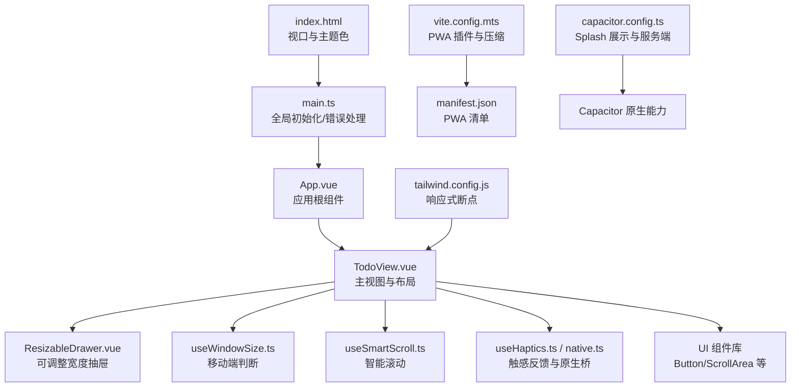
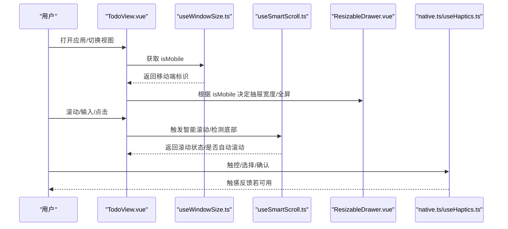
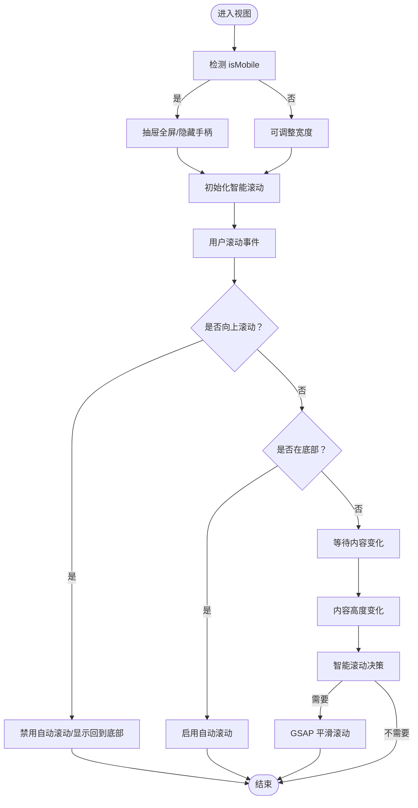
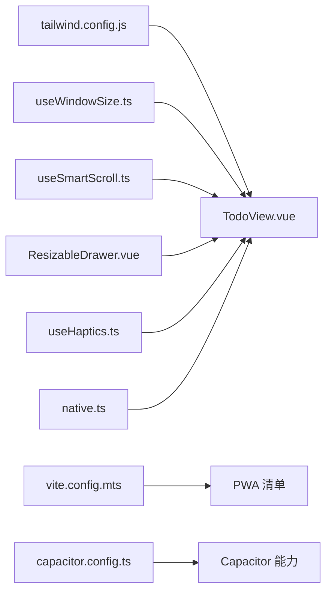

# 移动端适配

<cite>
**本文引用的文件**
- [apps/frontend/index.html](file://apps/frontend/index.html)
- [apps/frontend/src/styles/main.css](file://apps/frontend/src/styles/main.css)
- [apps/frontend/src/main.ts](file://apps/frontend/src/main.ts)
- [apps/frontend/tailwind.config.js](file://apps/frontend/tailwind.config.js)
- [apps/frontend/vite.config.mts](file://apps/frontend/vite.config.mts)
- [apps/frontend/capacitor.config.ts](file://apps/frontend/capacitor.config.ts)
- [apps/frontend/pwa-assets.config.ts](file://apps/frontend/pwa-assets.config.ts)
- [apps/frontend/src/composables/useWindowSize.ts](file://apps/frontend/src/composables/useWindowSize.ts)
- [apps/frontend/src/composables/useSmartScroll.ts](file://apps/frontend/src/composables/useSmartScroll.ts)
- [apps/frontend/src/composables/useHaptics.ts](file://apps/frontend/src/composables/useHaptics.ts)
- [apps/frontend/src/services/native.ts](file://apps/frontend/src/services/native.ts)
- [apps/frontend/src/components/ResizableDrawer.vue](file://apps/frontend/src/components/ResizableDrawer.vue)
- [apps/frontend/src/components/ui/button/Button.vue](file://apps/frontend/src/components/ui/button/Button.vue)
- [apps/frontend/src/components/ui/scroll-area/ScrollArea.vue](file://apps/frontend/src/components/ui/scroll-area/ScrollArea.vue)
- [apps/frontend/src/features/todo/TodoView.vue](file://apps/frontend/src/features/todo/TodoView.vue)
</cite>

## 目录
1. [简介](#简介)
2. [项目结构](#项目结构)
3. [核心组件](#核心组件)
4. [架构总览](#架构总览)
5. [详细组件分析](#详细组件分析)
6. [依赖关系分析](#依赖关系分析)
7. [性能考量](#性能考量)
8. [故障排查指南](#故障排查指南)
9. [结论](#结论)
10. [附录](#附录)

## 简介
本文件面向 Lumina Todo 移动端适配，系统性阐述响应式设计策略、断点配置、触摸手势与交互优化、视口与缩放控制、移动端特有组件与模式、PWA 实现与配置、性能优化技巧、多尺寸适配策略以及移动端调试与测试方法。文档同时提供可视化图示，帮助开发者快速理解代码与配置之间的关系。

## 项目结构
前端采用 Vue 3 + Vite 构建，配合 TailwindCSS 作为原子化样式工具；Capacitor 用于跨平台原生能力桥接；VitePWA 提供 PWA 能力；项目通过组合式函数与可复用组件实现移动端交互与性能优化。

图表来源
- [apps/frontend/index.html:1-39](file://apps/frontend/index.html#L1-L39)
- [apps/frontend/src/main.ts:1-138](file://apps/frontend/src/main.ts#L1-L138)
- [apps/frontend/src/features/todo/TodoView.vue:1-466](file://apps/frontend/src/features/todo/TodoView.vue#L1-L466)
- [apps/frontend/src/components/ResizableDrawer.vue:1-408](file://apps/frontend/src/components/ResizableDrawer.vue#L1-L408)
- [apps/frontend/src/composables/useWindowSize.ts:1-45](file://apps/frontend/src/composables/useWindowSize.ts#L1-L45)
- [apps/frontend/src/composables/useSmartScroll.ts:1-442](file://apps/frontend/src/composables/useSmartScroll.ts#L1-L442)
- [apps/frontend/src/composables/useHaptics.ts:1-62](file://apps/frontend/src/composables/useHaptics.ts#L1-L62)
- [apps/frontend/src/services/native.ts:1-116](file://apps/frontend/src/services/native.ts#L1-L116)
- [apps/frontend/src/components/ui/button/Button.vue:1-32](file://apps/frontend/src/components/ui/button/Button.vue#L1-L32)
- [apps/frontend/src/components/ui/scroll-area/ScrollArea.vue:1-23](file://apps/frontend/src/components/ui/scroll-area/ScrollArea.vue#L1-L23)
- [apps/frontend/tailwind.config.js:1-303](file://apps/frontend/tailwind.config.js#L1-L303)
- [apps/frontend/vite.config.mts:1-185](file://apps/frontend/vite.config.mts#L1-L185)
- [apps/frontend/capacitor.config.ts:1-23](file://apps/frontend/capacitor.config.ts#L1-L23)
- [apps/frontend/pwa-assets.config.ts:1-7](file://apps/frontend/pwa-assets.config.ts#L1-L7)

章节来源
- [apps/frontend/index.html:1-39](file://apps/frontend/index.html#L1-L39)
- [apps/frontend/src/main.ts:1-138](file://apps/frontend/src/main.ts#L1-L138)
- [apps/frontend/tailwind.config.js:1-303](file://apps/frontend/tailwind.config.js#L1-L303)
- [apps/frontend/vite.config.mts:1-185](file://apps/frontend/vite.config.mts#L1-L185)
- [apps/frontend/capacitor.config.ts:1-23](file://apps/frontend/capacitor.config.ts#L1-L23)
- [apps/frontend/pwa-assets.config.ts:1-7](file://apps/frontend/pwa-assets.config.ts#L1-L7)

## 核心组件
- 视口与主题色：通过 meta viewport 控制缩放与安全区域，设置主题色与图标，提升首屏体验与 PWA 安装感知。
- 响应式断点：Tailwind 配置 xs/sm/md/lg/xl/2xl/3xl，覆盖从手机到桌面的多设备场景。
- 移动端判断：基于窗口宽度的组合式函数，统一在组件中进行断点判断与布局切换。
- 智能滚动：针对移动端滚动性能与交互体验优化，结合 RAF 批处理与 GSAP 平滑滚动。
- 触感反馈：Capacitor Haptics 能力封装，按平台条件性调用，增强触觉反馈。
- 抽屉组件：可调整宽度、移动端全屏、遮罩层与过渡动画，兼顾桌面与移动端交互。
- PWA 能力：VitePWA 插件生成清单与资源，支持自动更新与开发模式开关。

章节来源
- [apps/frontend/index.html:1-39](file://apps/frontend/index.html#L1-L39)
- [apps/frontend/tailwind.config.js:15-24](file://apps/frontend/tailwind.config.js#L15-L24)
- [apps/frontend/src/composables/useWindowSize.ts:1-45](file://apps/frontend/src/composables/useWindowSize.ts#L1-L45)
- [apps/frontend/src/composables/useSmartScroll.ts:1-442](file://apps/frontend/src/composables/useSmartScroll.ts#L1-L442)
- [apps/frontend/src/composables/useHaptics.ts:1-62](file://apps/frontend/src/composables/useHaptics.ts#L1-L62)
- [apps/frontend/src/components/ResizableDrawer.vue:1-408](file://apps/frontend/src/components/ResizableDrawer.vue#L1-L408)
- [apps/frontend/vite.config.mts:104-146](file://apps/frontend/vite.config.mts#L104-L146)

## 架构总览
移动端适配围绕“视口与基础配置—断点与布局—交互与性能—PWA 与原生能力”四条主线展开。下图展示关键模块与数据/事件流：

图表来源
- [apps/frontend/src/features/todo/TodoView.vue:1-466](file://apps/frontend/src/features/todo/TodoView.vue#L1-L466)
- [apps/frontend/src/composables/useWindowSize.ts:1-45](file://apps/frontend/src/composables/useWindowSize.ts#L1-L45)
- [apps/frontend/src/composables/useSmartScroll.ts:1-442](file://apps/frontend/src/composables/useSmartScroll.ts#L1-L442)
- [apps/frontend/src/components/ResizableDrawer.vue:1-408](file://apps/frontend/src/components/ResizableDrawer.vue#L1-L408)
- [apps/frontend/src/services/native.ts:1-116](file://apps/frontend/src/services/native.ts#L1-L116)
- [apps/frontend/src/composables/useHaptics.ts:1-62](file://apps/frontend/src/composables/useHaptics.ts#L1-L62)

## 详细组件分析

### 响应式设计与断点策略
- 视口与缩放：通过 meta viewport 控制 initial-scale 与 viewport-fit=cover，适配刘海屏与安全区域。
- 断点配置：Tailwind screens 定义 xs(320)、sm(375)、md(640)、lg(768)、xl(1024)、2xl(1280)、3xl(1536)，满足移动端到桌面的完整覆盖。
- 布局切换：在 TodoView 中依据 isMobile 切换输入区高度、过滤器与搜索栏布局，减少移动端滚动与层级复杂度。
- 字体与排版：在 TodoView 中对移动端字体进行降级，保证可读性与性能平衡。

章节来源
- [apps/frontend/index.html:9](file://apps/frontend/index.html#L9)
- [apps/frontend/tailwind.config.js:15-24](file://apps/frontend/tailwind.config.js#L15-L24)
- [apps/frontend/src/features/todo/TodoView.vue:111-115](file://apps/frontend/src/features/todo/TodoView.vue#L111-L115)
- [apps/frontend/src/features/todo/TodoView.vue:457-464](file://apps/frontend/src/features/todo/TodoView.vue#L457-L464)

### 触摸手势与移动端交互优化
- 智能滚动：useSmartScroll 结合 RAF 批处理、GSAP 平滑滚动、ResizeObserver/MutationObserver 监听容器变化，自动判断是否粘附底部、是否允许用户向上滚动，避免滚动冲突。
- 抽屉交互：ResizableDrawer 在移动端自动全屏，隐藏拖拽手柄，遮罩层支持点击关闭；支持 ESC 关闭与滚动区域 overscroll-behavior: contain。
- 触感反馈：useHaptics 与 native 服务在原生平台提供 Impact/Selection/Vibrate 等反馈，提升触控确认感。
- 输入与滚动：在移动端输入区高度固定为 56px，配合 GSAP 过渡动画，减少布局抖动。

图表来源
- [apps/frontend/src/components/ResizableDrawer.vue:38-78](file://apps/frontend/src/components/ResizableDrawer.vue#L38-L78)
- [apps/frontend/src/composables/useSmartScroll.ts:162-195](file://apps/frontend/src/composables/useSmartScroll.ts#L162-L195)
- [apps/frontend/src/composables/useSmartScroll.ts:208-240](file://apps/frontend/src/composables/useSmartScroll.ts#L208-L240)
- [apps/frontend/src/composables/useSmartScroll.ts:304-342](file://apps/frontend/src/composables/useSmartScroll.ts#L304-L342)

章节来源
- [apps/frontend/src/components/ResizableDrawer.vue:1-408](file://apps/frontend/src/components/ResizableDrawer.vue#L1-L408)
- [apps/frontend/src/composables/useSmartScroll.ts:1-442](file://apps/frontend/src/composables/useSmartScroll.ts#L1-L442)
- [apps/frontend/src/composables/useHaptics.ts:1-62](file://apps/frontend/src/composables/useHaptics.ts#L1-L62)
- [apps/frontend/src/services/native.ts:1-116](file://apps/frontend/src/services/native.ts#L1-L116)

### 视口配置与缩放控制
- 视口：设置 width=device-width、initial-scale=1.0、viewport-fit=cover，确保在刘海屏与横竖屏切换时正确显示。
- 主题色与图标：设置 theme-color 与 apple-touch-icon，提升 PWA 安装后的系统集成体验。
- 首屏标题同步：在 index.html 中根据本地语言设置初始标题，避免切换语言时闪烁。

章节来源
- [apps/frontend/index.html:9](file://apps/frontend/index.html#L9)
- [apps/frontend/index.html:10](file://apps/frontend/index.html#L10)
- [apps/frontend/index.html:13-32](file://apps/frontend/index.html#L13-L32)

### 移动端特有组件与交互模式
- ResizableDrawer：移动端全屏、遮罩层点击关闭、ESC 关闭、过渡动画；非移动端保留手柄与可调整宽度。
- Button/ScrollArea：UI 组件库提供移动端友好的尺寸与交互，配合 Tailwind 断点类实现自适应。
- TodoView：根据 isMobile 动态调整输入区高度、过滤器与搜索栏布局，配合 Transition 实现流畅切换。

章节来源
- [apps/frontend/src/components/ResizableDrawer.vue:1-408](file://apps/frontend/src/components/ResizableDrawer.vue#L1-L408)
- [apps/frontend/src/components/ui/button/Button.vue:1-32](file://apps/frontend/src/components/ui/button/Button.vue#L1-L32)
- [apps/frontend/src/components/ui/scroll-area/ScrollArea.vue:1-23](file://apps/frontend/src/components/ui/scroll-area/ScrollArea.vue#L1-L23)
- [apps/frontend/src/features/todo/TodoView.vue:111-115](file://apps/frontend/src/features/todo/TodoView.vue#L111-L115)

### PWA 功能实现与配置
- VitePWA 插件：在开发模式下可按环境变量启用 PWA Dev，生产模式自动生成 manifest 与静态资源清单。
- 清单与图标：配置 name、short_name、description、theme_color 与多尺寸图标，支持 maskable 图标。
- 资源生成：通过 pwa-assets.config.ts 使用 minimal2023 预设与 logo 生成多尺寸图标，便于安装与启动页展示。
- 压缩与缓存：Vite 配置 gzip/brotli 压缩，提升移动端加载速度；PWA 自动更新策略降低维护成本。

章节来源
- [apps/frontend/vite.config.mts:104-146](file://apps/frontend/vite.config.mts#L104-L146)
- [apps/frontend/pwa-assets.config.ts:1-7](file://apps/frontend/pwa-assets.config.ts#L1-7)

### 移动端性能优化技巧
- 滚动性能：useSmartScroll 使用 RAF 批处理与 GSAP 平滑滚动，避免频繁重排；ResizeObserver/MutationObserver 监听容器变化，减少不必要计算。
- 动画与合成：在 TodoView 中使用 will-change 与 GPU 合成属性，配合过渡动画减少主线程压力。
- 资源优化：Vite 压缩与分包策略，减少首屏体积；PWA 缓存与自动更新，降低重复加载成本。
- 错误与异常：全局错误处理忽略 ResizeObserver 循环警告，避免移动端常见报错影响体验。

章节来源
- [apps/frontend/src/composables/useSmartScroll.ts:162-195](file://apps/frontend/src/composables/useSmartScroll.ts#L162-L195)
- [apps/frontend/src/features/todo/TodoView.vue:34-56](file://apps/frontend/src/features/todo/TodoView.vue#L34-L56)
- [apps/frontend/vite.config.mts:88-103](file://apps/frontend/vite.config.mts#L88-L103)
- [apps/frontend/src/main.ts:58-113](file://apps/frontend/src/main.ts#L58-L113)

### 不同屏幕尺寸的适配策略
- xs/sm：强调单列布局与紧凑间距，输入区高度固定为 56px，过滤器与搜索栏折叠。
- md/lg：保留抽屉宽度与手柄，提供更丰富的侧边功能；卡片圆角与阴影增强层次感。
- 3xl+：大屏下使用更大容器与更宽松的留白，保证信息密度与可读性。

章节来源
- [apps/frontend/tailwind.config.js:15-31](file://apps/frontend/tailwind.config.js#L15-L31)
- [apps/frontend/src/features/todo/TodoView.vue:111-115](file://apps/frontend/src/features/todo/TodoView.vue#L111-L115)
- [apps/frontend/src/components/ResizableDrawer.vue:38-78](file://apps/frontend/src/components/ResizableDrawer.vue#L38-L78)

### 移动端调试与测试方法
- 视口与主题色：在浏览器 DevTools 中切换设备模式，验证 viewport-fit 与安全区域表现。
- 滚动与动画：使用 Performance 面板观察 useSmartScroll 的 RAF 调用频率与 GSAP 动画帧率，定位卡顿点。
- PWA：在 Application 面板检查 Manifest、Service Worker 与缓存命中情况，验证自动更新流程。
- 原生能力：在 Capacitor/WebView 环境中测试触感反馈与启动页，确认 SplashScreen 配置生效。
- 错误处理：关注全局错误处理器对动态模块加载失败与 ResizeObserver 警告的处理逻辑。

章节来源
- [apps/frontend/index.html:9](file://apps/frontend/index.html#L9)
- [apps/frontend/src/main.ts:58-113](file://apps/frontend/src/main.ts#L58-L113)
- [apps/frontend/vite.config.mts:104-146](file://apps/frontend/vite.config.mts#L104-L146)
- [apps/frontend/capacitor.config.ts:13-19](file://apps/frontend/capacitor.config.ts#L13-L19)

## 依赖关系分析
- 组件耦合：TodoView 依赖 useWindowSize、useSmartScroll、ResizableDrawer 等组合式函数与组件，形成清晰的职责边界。
- 外部依赖：Tailwind 提供断点与原子类；VitePWA 提供 PWA 能力；Capacitor 提供原生桥接；GSAP 优化滚动动画。
- 潜在风险：过度使用全局错误处理可能掩盖真实问题，建议在开发环境保留详细日志；抽屉宽度与窗口变化需在生命周期中正确清理监听器。

图表来源
- [apps/frontend/tailwind.config.js:1-303](file://apps/frontend/tailwind.config.js#L1-L303)
- [apps/frontend/src/features/todo/TodoView.vue:1-466](file://apps/frontend/src/features/todo/TodoView.vue#L1-L466)
- [apps/frontend/src/composables/useWindowSize.ts:1-45](file://apps/frontend/src/composables/useWindowSize.ts#L1-L45)
- [apps/frontend/src/composables/useSmartScroll.ts:1-442](file://apps/frontend/src/composables/useSmartScroll.ts#L1-L442)
- [apps/frontend/src/components/ResizableDrawer.vue:1-408](file://apps/frontend/src/components/ResizableDrawer.vue#L1-L408)
- [apps/frontend/src/composables/useHaptics.ts:1-62](file://apps/frontend/src/composables/useHaptics.ts#L1-L62)
- [apps/frontend/src/services/native.ts:1-116](file://apps/frontend/src/services/native.ts#L1-L116)
- [apps/frontend/vite.config.mts:104-146](file://apps/frontend/vite.config.mts#L104-L146)
- [apps/frontend/capacitor.config.ts:1-23](file://apps/frontend/capacitor.config.ts#L1-L23)

章节来源
- [apps/frontend/src/features/todo/TodoView.vue:1-466](file://apps/frontend/src/features/todo/TodoView.vue#L1-L466)
- [apps/frontend/src/composables/useWindowSize.ts:1-45](file://apps/frontend/src/composables/useWindowSize.ts#L1-L45)
- [apps/frontend/src/composables/useSmartScroll.ts:1-442](file://apps/frontend/src/composables/useSmartScroll.ts#L1-L442)
- [apps/frontend/src/components/ResizableDrawer.vue:1-408](file://apps/frontend/src/components/ResizableDrawer.vue#L1-L408)
- [apps/frontend/src/composables/useHaptics.ts:1-62](file://apps/frontend/src/composables/useHaptics.ts#L1-L62)
- [apps/frontend/src/services/native.ts:1-116](file://apps/frontend/src/services/native.ts#L1-L116)
- [apps/frontend/vite.config.mts:104-146](file://apps/frontend/vite.config.mts#L104-L146)
- [apps/frontend/capacitor.config.ts:1-23](file://apps/frontend/capacitor.config.ts#L1-L23)

## 性能考量
- 滚动与动画：使用 RAF 批处理与 GSAP 替代原生滚动监听，减少主线程阻塞；合理设置 will-change 与 GPU 合成。
- 资源与缓存：启用 gzip/brotli 压缩与 PWA 缓存，缩短移动端首屏加载时间；分包策略避免单个包过大。
- 错误与稳定性：全局错误处理忽略 ResizeObserver 循环警告，避免页面异常；对动态模块加载失败进行刷新兜底。

章节来源
- [apps/frontend/src/composables/useSmartScroll.ts:162-195](file://apps/frontend/src/composables/useSmartScroll.ts#L162-L195)
- [apps/frontend/vite.config.mts:88-103](file://apps/frontend/vite.config.mts#L88-L103)
- [apps/frontend/src/main.ts:58-113](file://apps/frontend/src/main.ts#L58-L113)

## 故障排查指南
- 动态模块加载失败：全局错误处理器会识别并尝试刷新页面，若短时间内多次失败，建议手动刷新或检查部署版本。
- ResizeObserver 警告：忽略 ResizeObserver loop limit exceeded 等良性错误，避免干扰正常功能。
- PWA 安装与更新：在 Application 面板检查 Service Worker 注册与更新队列，确认 manifest 与静态资源生成。
- 触感反馈不可用：在非原生平台（Web）时，useHaptics 与 native 服务会降级输出到控制台，确认 Capacitor 环境与权限。

章节来源
- [apps/frontend/src/main.ts:58-113](file://apps/frontend/src/main.ts#L58-L113)
- [apps/frontend/vite.config.mts:104-146](file://apps/frontend/vite.config.mts#L104-L146)
- [apps/frontend/src/composables/useHaptics.ts:1-62](file://apps/frontend/src/composables/useHaptics.ts#L1-L62)
- [apps/frontend/src/services/native.ts:1-116](file://apps/frontend/src/services/native.ts#L1-L116)

## 结论
Lumina Todo 的移动端适配以“视口与断点—智能滚动—触感反馈—PWA 能力”为核心，结合组合式函数与可复用组件，在保证性能的同时提供流畅自然的移动端交互体验。通过合理的资源优化与错误处理策略，项目在多设备与多环境下具备良好的稳定性与可维护性。

## 附录
- 关键配置参考
  - 视口与图标：[apps/frontend/index.html:9](file://apps/frontend/index.html#L9)
  - 断点配置：[apps/frontend/tailwind.config.js:15-24](file://apps/frontend/tailwind.config.js#L15-L24)
  - PWA 清单与资源：[apps/frontend/vite.config.mts:104-146](file://apps/frontend/vite.config.mts#L104-L146)、[apps/frontend/pwa-assets.config.ts:1-7](file://apps/frontend/pwa-assets.config.ts#L1-L7)
  - Capacitor 配置：[apps/frontend/capacitor.config.ts:13-19](file://apps/frontend/capacitor.config.ts#L13-L19)
- 组件与组合式函数参考
  - 移动端判断：[apps/frontend/src/composables/useWindowSize.ts:1-45](file://apps/frontend/src/composables/useWindowSize.ts#L1-L45)
  - 智能滚动：[apps/frontend/src/composables/useSmartScroll.ts:1-442](file://apps/frontend/src/composables/useSmartScroll.ts#L1-L442)
  - 触感反馈：[apps/frontend/src/composables/useHaptics.ts:1-62](file://apps/frontend/src/composables/useHaptics.ts#L1-L62)
  - 原生桥接：[apps/frontend/src/services/native.ts:1-116](file://apps/frontend/src/services/native.ts#L1-L116)
  - 抽屉组件：[apps/frontend/src/components/ResizableDrawer.vue:1-408](file://apps/frontend/src/components/ResizableDrawer.vue#L1-L408)
  - 主视图布局：[apps/frontend/src/features/todo/TodoView.vue:1-466](file://apps/frontend/src/features/todo/TodoView.vue#L1-L466)