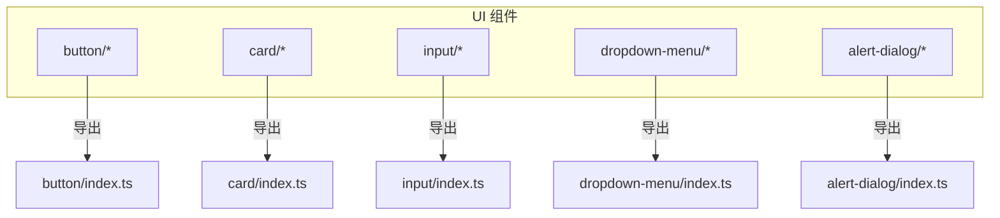
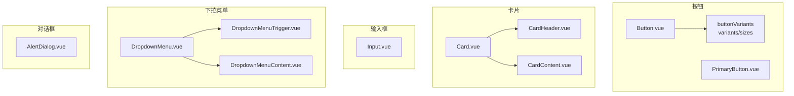
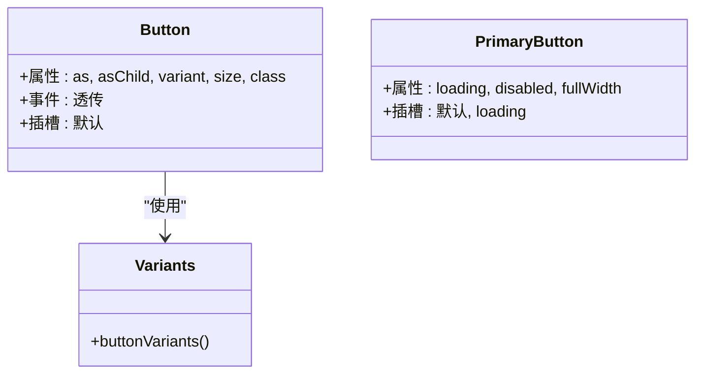
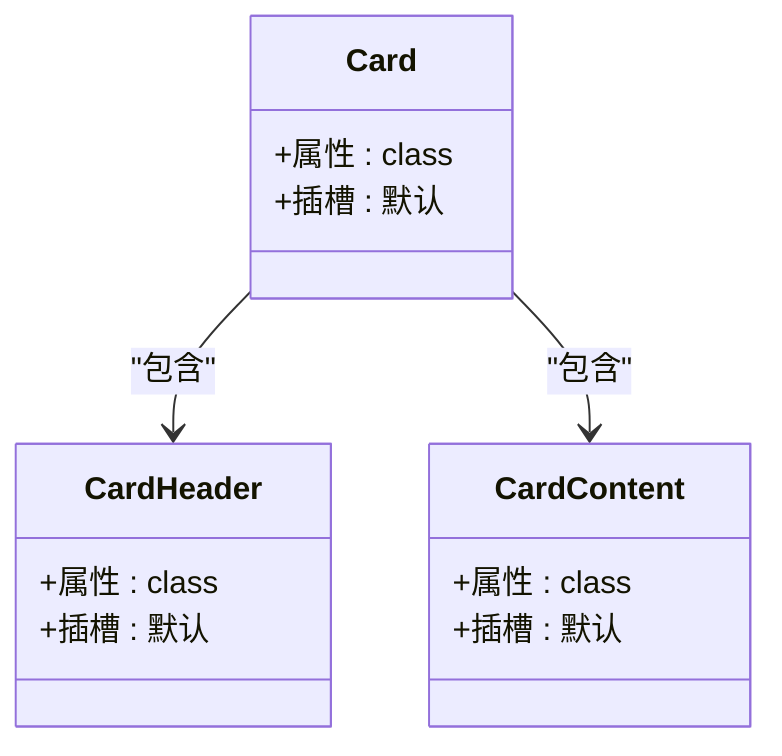
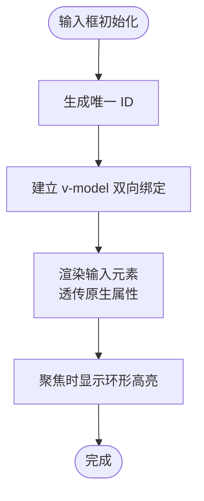
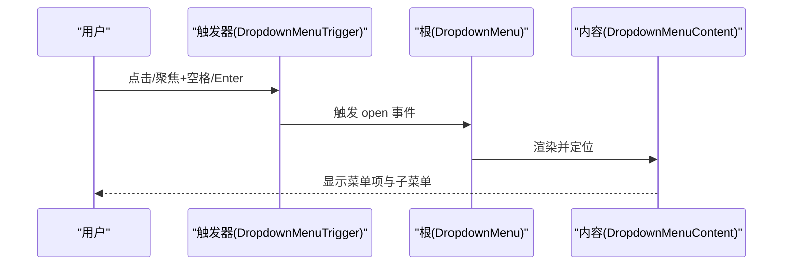
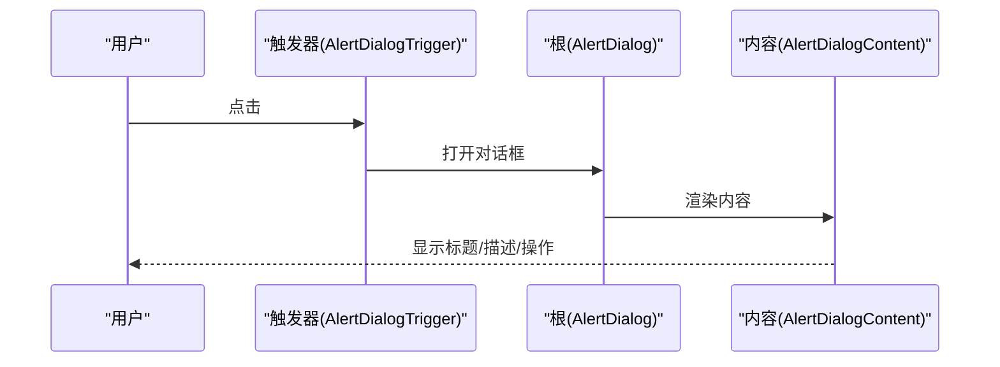
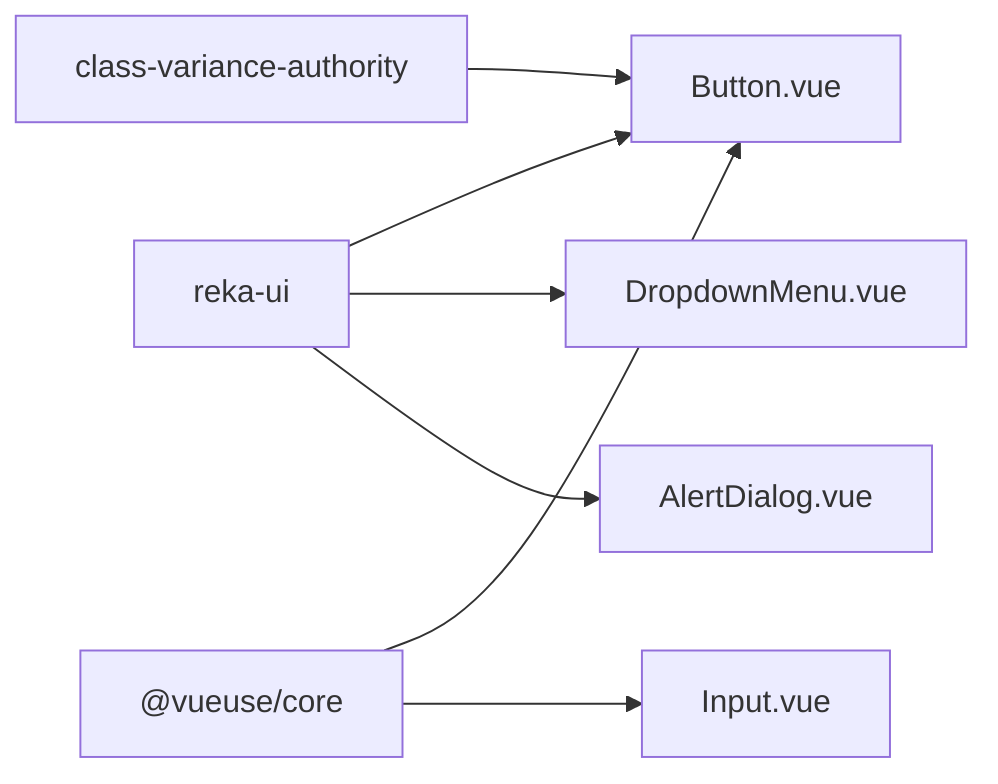

# UI 组件库

<cite>
**本文引用的文件**
- [apps/frontend/src/components/ui/button/Button.vue](file://apps/frontend/src/components/ui/button/Button.vue)
- [apps/frontend/src/components/ui/button/PrimaryButton.vue](file://apps/frontend/src/components/ui/button/PrimaryButton.vue)
- [apps/frontend/src/components/ui/button/index.ts](file://apps/frontend/src/components/ui/button/index.ts)
- [apps/frontend/src/components/ui/card/Card.vue](file://apps/frontend/src/components/ui/card/Card.vue)
- [apps/frontend/src/components/ui/card/CardContent.vue](file://apps/frontend/src/components/ui/card/CardContent.vue)
- [apps/frontend/src/components/ui/card/CardHeader.vue](file://apps/frontend/src/components/ui/card/CardHeader.vue)
- [apps/frontend/src/components/ui/card/index.ts](file://apps/frontend/src/components/ui/card/index.ts)
- [apps/frontend/src/components/ui/input/Input.vue](file://apps/frontend/src/components/ui/input/Input.vue)
- [apps/frontend/src/components/ui/input/index.ts](file://apps/frontend/src/components/ui/input/index.ts)
- [apps/frontend/src/components/ui/dropdown-menu/DropdownMenu.vue](file://apps/frontend/src/components/ui/dropdown-menu/DropdownMenu.vue)
- [apps/frontend/src/components/ui/dropdown-menu/DropdownMenuContent.vue](file://apps/frontend/src/components/ui/dropdown-menu/DropdownMenuContent.vue)
- [apps/frontend/src/components/ui/dropdown-menu/DropdownMenuTrigger.vue](file://apps/frontend/src/components/ui/dropdown-menu/DropdownMenuTrigger.vue)
- [apps/frontend/src/components/ui/dropdown-menu/index.ts](file://apps/frontend/src/components/ui/dropdown-menu/index.ts)
- [apps/frontend/src/components/ui/alert-dialog/AlertDialog.vue](file://apps/frontend/src/components/ui/alert-dialog/AlertDialog.vue)
- [apps/frontend/src/components/ui/alert-dialog/index.ts](file://apps/frontend/src/components/ui/alert-dialog/index.ts)
</cite>

## 目录
1. [简介](#简介)
2. [项目结构](#项目结构)
3. [核心组件](#核心组件)
4. [架构总览](#架构总览)
5. [详细组件分析](#详细组件分析)
6. [依赖关系分析](#依赖关系分析)
7. [性能考量](#性能考量)
8. [故障排查指南](#故障排查指南)
9. [结论](#结论)
10. [附录](#附录)

## 简介
本文件为 Lumina Todo 前端应用中的 UI 组件库文档，聚焦于基于 Radix UI（通过 reka-ui 封装）与 Vue 3 的组件系统。文档覆盖按钮、卡片、输入框、下拉菜单、对话框等基础 UI 组件的设计理念、属性/事件/插槽、样式定制、无障碍与键盘导航、主题与响应式、动画效果、组合与复用策略，以及测试与调试建议。

## 项目结构
UI 组件集中位于前端应用的组件目录中，按功能域分层组织：
- 按功能域划分：ui、auth、features 等
- UI 组件位于 apps/frontend/src/components/ui 下，采用“功能域/子组件”的扁平化导出结构
- 主要组件族：button、card、input、dropdown-menu、alert-dialog 等

图表来源
- [apps/frontend/src/components/ui/button/index.ts:1-38](file://apps/frontend/src/components/ui/button/index.ts#L1-L38)
- [apps/frontend/src/components/ui/card/index.ts:1-7](file://apps/frontend/src/components/ui/card/index.ts#L1-L7)
- [apps/frontend/src/components/ui/input/index.ts:1-2](file://apps/frontend/src/components/ui/input/index.ts#L1-L2)
- [apps/frontend/src/components/ui/dropdown-menu/index.ts:1-17](file://apps/frontend/src/components/ui/dropdown-menu/index.ts#L1-L17)
- [apps/frontend/src/components/ui/alert-dialog/index.ts:1-10](file://apps/frontend/src/components/ui/alert-dialog/index.ts#L1-L10)

章节来源
- [apps/frontend/src/components/ui/button/index.ts:1-38](file://apps/frontend/src/components/ui/button/index.ts#L1-L38)
- [apps/frontend/src/components/ui/card/index.ts:1-7](file://apps/frontend/src/components/ui/card/index.ts#L1-L7)
- [apps/frontend/src/components/ui/input/index.ts:1-2](file://apps/frontend/src/components/ui/input/index.ts#L1-L2)
- [apps/frontend/src/components/ui/dropdown-menu/index.ts:1-17](file://apps/frontend/src/components/ui/dropdown-menu/index.ts#L1-L17)
- [apps/frontend/src/components/ui/alert-dialog/index.ts:1-10](file://apps/frontend/src/components/ui/alert-dialog/index.ts#L1-L10)

## 核心组件
本节概述各组件族的职责与共性：
- 按钮：提供基础与强调风格，支持尺寸与变体；另提供富样式 PrimaryButton 用于强调操作
- 卡片：容器组件，支持头部、标题、描述、内容、页脚等语义化子组件
- 输入框：受控表单输入，自动处理 v-model、ID 生成与可访问性属性
- 下拉菜单：基于 reka-ui 的 Radix 风格菜单体系，提供触发器、内容、子菜单、勾选/单选项等
- 对话框：基于 reka-ui 的 AlertDialog 根组件，配合标题、描述、操作、页脚等子组件

章节来源
- [apps/frontend/src/components/ui/button/Button.vue:1-32](file://apps/frontend/src/components/ui/button/Button.vue#L1-L32)
- [apps/frontend/src/components/ui/button/PrimaryButton.vue:1-62](file://apps/frontend/src/components/ui/button/PrimaryButton.vue#L1-L62)
- [apps/frontend/src/components/ui/card/Card.vue:1-15](file://apps/frontend/src/components/ui/card/Card.vue#L1-L15)
- [apps/frontend/src/components/ui/input/Input.vue:1-42](file://apps/frontend/src/components/ui/input/Input.vue#L1-L42)
- [apps/frontend/src/components/ui/dropdown-menu/DropdownMenu.vue:1-16](file://apps/frontend/src/components/ui/dropdown-menu/DropdownMenu.vue#L1-L16)
- [apps/frontend/src/components/ui/alert-dialog/AlertDialog.vue:1-16](file://apps/frontend/src/components/ui/alert-dialog/AlertDialog.vue#L1-L16)

## 架构总览
组件库以“根组件 + 子组件”模式组织，根组件负责透传属性与事件，子组件负责具体渲染与样式。下图展示关键组件的依赖与组合关系：

图表来源
- [apps/frontend/src/components/ui/button/Button.vue:1-32](file://apps/frontend/src/components/ui/button/Button.vue#L1-L32)
- [apps/frontend/src/components/ui/button/PrimaryButton.vue:1-62](file://apps/frontend/src/components/ui/button/PrimaryButton.vue#L1-L62)
- [apps/frontend/src/components/ui/button/index.ts:1-38](file://apps/frontend/src/components/ui/button/index.ts#L1-L38)
- [apps/frontend/src/components/ui/card/Card.vue:1-15](file://apps/frontend/src/components/ui/card/Card.vue#L1-L15)
- [apps/frontend/src/components/ui/card/CardHeader.vue:1-15](file://apps/frontend/src/components/ui/card/CardHeader.vue#L1-L15)
- [apps/frontend/src/components/ui/card/CardContent.vue:1-15](file://apps/frontend/src/components/ui/card/CardContent.vue#L1-L15)
- [apps/frontend/src/components/ui/input/Input.vue:1-42](file://apps/frontend/src/components/ui/input/Input.vue#L1-L42)
- [apps/frontend/src/components/ui/dropdown-menu/DropdownMenu.vue:1-16](file://apps/frontend/src/components/ui/dropdown-menu/DropdownMenu.vue#L1-L16)
- [apps/frontend/src/components/ui/dropdown-menu/DropdownMenuTrigger.vue:1-15](file://apps/frontend/src/components/ui/dropdown-menu/DropdownMenuTrigger.vue#L1-L15)
- [apps/frontend/src/components/ui/dropdown-menu/DropdownMenuContent.vue:1-37](file://apps/frontend/src/components/ui/dropdown-menu/DropdownMenuContent.vue#L1-L37)
- [apps/frontend/src/components/ui/alert-dialog/AlertDialog.vue:1-16](file://apps/frontend/src/components/ui/alert-dialog/AlertDialog.vue#L1-L16)

## 详细组件分析

### 按钮 Button 与 PrimaryButton
- 设计理念
  - Button 作为通用按钮，基于 cva 定义变体与尺寸，统一风格与交互
  - PrimaryButton 提供强调视觉与动效，适合主操作
- 属性/事件/插槽
  - Button
    - 属性：as、asChild、variant、size、class
    - 事件：透传自原生或 reka-ui
    - 插槽：默认插槽
  - PrimaryButton
    - 属性：loading、disabled、fullWidth
    - 插槽：默认插槽、loading 插槽
- 样式与动画
  - 使用工具类与渐变光效、阴影与过渡动画
  - 支持禁用态、加载态与悬停/焦点/按压反馈
- 无障碍与键盘
  - 保持原生按钮语义与键盘可达性
- 使用示例与最佳实践
  - 优先使用 Button 进行常规操作；对关键动作使用 PrimaryButton
  - 通过 variant/size 控制风格与密度；在移动端考虑 icon 尺寸
- 复用策略
  - 将样式封装在 buttonVariants 中，避免重复定义
  - 通过组合不同变体与尺寸实现一致的视觉语言

图表来源
- [apps/frontend/src/components/ui/button/Button.vue:1-32](file://apps/frontend/src/components/ui/button/Button.vue#L1-L32)
- [apps/frontend/src/components/ui/button/PrimaryButton.vue:1-62](file://apps/frontend/src/components/ui/button/PrimaryButton.vue#L1-L62)
- [apps/frontend/src/components/ui/button/index.ts:1-38](file://apps/frontend/src/components/ui/button/index.ts#L1-L38)

章节来源
- [apps/frontend/src/components/ui/button/Button.vue:1-32](file://apps/frontend/src/components/ui/button/Button.vue#L1-L32)
- [apps/frontend/src/components/ui/button/PrimaryButton.vue:1-62](file://apps/frontend/src/components/ui/button/PrimaryButton.vue#L1-L62)
- [apps/frontend/src/components/ui/button/index.ts:1-38](file://apps/frontend/src/components/ui/button/index.ts#L1-L38)

### 卡片 Card 系列
- 设计理念
  - 语义化卡片容器，支持头部、标题、描述、内容、页脚等模块化子组件
- 属性/事件/插槽
  - Card：class
  - CardHeader：class
  - CardContent：class
  - 其他：class
- 样式与主题
  - 使用语义化颜色变量与阴影，支持通过 class 扩展
- 无障碍与键盘
  - 无特殊交互，遵循容器语义即可
- 使用示例与最佳实践
  - 将标题与描述置于头部，内容区放置主体信息，页脚放置操作
  - 在密集列表中控制内边距与阴影强度
- 复用策略
  - 通过组合不同子组件实现一致布局与风格

图表来源
- [apps/frontend/src/components/ui/card/Card.vue:1-15](file://apps/frontend/src/components/ui/card/Card.vue#L1-L15)
- [apps/frontend/src/components/ui/card/CardHeader.vue:1-15](file://apps/frontend/src/components/ui/card/CardHeader.vue#L1-L15)
- [apps/frontend/src/components/ui/card/CardContent.vue:1-15](file://apps/frontend/src/components/ui/card/CardContent.vue#L1-L15)

章节来源
- [apps/frontend/src/components/ui/card/Card.vue:1-15](file://apps/frontend/src/components/ui/card/Card.vue#L1-L15)
- [apps/frontend/src/components/ui/card/CardHeader.vue:1-15](file://apps/frontend/src/components/ui/card/CardHeader.vue#L1-L15)
- [apps/frontend/src/components/ui/card/CardContent.vue:1-15](file://apps/frontend/src/components/ui/card/CardContent.vue#L1-L15)
- [apps/frontend/src/components/ui/card/index.ts:1-7](file://apps/frontend/src/components/ui/card/index.ts#L1-L7)

### 输入框 Input
- 设计理念
  - 受控输入，自动处理 v-model、ID 生成与可访问性属性
- 属性/事件/插槽
  - 属性：defaultValue、modelValue、class、id、name
  - 事件：update:modelValue
  - 插槽：无
- 样式与主题
  - 使用语义化颜色与边框、阴影、聚焦环
- 无障碍与键盘
  - 自动分配唯一 ID，支持 name 与原生属性透传
- 使用示例与最佳实践
  - 表单场景使用 v-model；需要校验时结合外部逻辑
  - 通过 class 覆盖样式，避免破坏语义化外观
- 复用策略
  - 作为表单字段基元，配合表单布局与验证体系

图表来源
- [apps/frontend/src/components/ui/input/Input.vue:1-42](file://apps/frontend/src/components/ui/input/Input.vue#L1-L42)

章节来源
- [apps/frontend/src/components/ui/input/Input.vue:1-42](file://apps/frontend/src/components/ui/input/Input.vue#L1-L42)
- [apps/frontend/src/components/ui/input/index.ts:1-2](file://apps/frontend/src/components/ui/input/index.ts#L1-L2)

### 下拉菜单 Dropdown Menu
- 设计理念
  - 基于 reka-ui 的 Radix 风格菜单，提供触发器、内容、子菜单、勾选/单选项等
- 属性/事件/插槽
  - DropdownMenu：透传根属性与事件
  - DropdownMenuTrigger：透传触发器属性
  - DropdownMenuContent：支持 sideOffset 与 class，内置动画类
  - 其他子组件：透传各自属性
- 样式与主题
  - 内置动画与定位类，支持通过 class 扩展
- 无障碍与键盘
  - 遵循 Radix 菜单的 ARIA 与键盘导航约定
- 使用示例与最佳实践
  - 触发器使用按钮或链接；内容区放置菜单项与分隔符
  - 子菜单使用 DropdownMenuSub/Trigger/Content 形成层级
- 复用策略
  - 通过 Portal 渲染到合适位置，避免布局遮挡

图表来源
- [apps/frontend/src/components/ui/dropdown-menu/DropdownMenu.vue:1-16](file://apps/frontend/src/components/ui/dropdown-menu/DropdownMenu.vue#L1-L16)
- [apps/frontend/src/components/ui/dropdown-menu/DropdownMenuTrigger.vue:1-15](file://apps/frontend/src/components/ui/dropdown-menu/DropdownMenuTrigger.vue#L1-L15)
- [apps/frontend/src/components/ui/dropdown-menu/DropdownMenuContent.vue:1-37](file://apps/frontend/src/components/ui/dropdown-menu/DropdownMenuContent.vue#L1-L37)

章节来源
- [apps/frontend/src/components/ui/dropdown-menu/DropdownMenu.vue:1-16](file://apps/frontend/src/components/ui/dropdown-menu/DropdownMenu.vue#L1-L16)
- [apps/frontend/src/components/ui/dropdown-menu/DropdownMenuTrigger.vue:1-15](file://apps/frontend/src/components/ui/dropdown-menu/DropdownMenuTrigger.vue#L1-L15)
- [apps/frontend/src/components/ui/dropdown-menu/DropdownMenuContent.vue:1-37](file://apps/frontend/src/components/ui/dropdown-menu/DropdownMenuContent.vue#L1-L37)
- [apps/frontend/src/components/ui/dropdown-menu/index.ts:1-17](file://apps/frontend/src/components/ui/dropdown-menu/index.ts#L1-L17)

### 对话框 AlertDialog
- 设计理念
  - 基于 reka-ui 的 AlertDialog 根组件，配合标题、描述、操作、页脚等子组件
- 属性/事件/插槽
  - AlertDialog：透传根属性与事件
  - 子组件：标题、描述、操作、取消、内容、页脚、触发器等
- 样式与主题
  - 通过 class 扩展，保持与整体主题一致
- 无障碍与键盘
  - 遵循模态对话框的 ARIA 与键盘导航约定
- 使用示例与最佳实践
  - 重要操作前使用确认对话框；提供明确的操作与取消路径
- 复用策略
  - 将通用确认流程抽象为模板组件，减少重复代码

图表来源
- [apps/frontend/src/components/ui/alert-dialog/AlertDialog.vue:1-16](file://apps/frontend/src/components/ui/alert-dialog/AlertDialog.vue#L1-L16)
- [apps/frontend/src/components/ui/alert-dialog/index.ts:1-10](file://apps/frontend/src/components/ui/alert-dialog/index.ts#L1-L10)

章节来源
- [apps/frontend/src/components/ui/alert-dialog/AlertDialog.vue:1-16](file://apps/frontend/src/components/ui/alert-dialog/AlertDialog.vue#L1-L16)
- [apps/frontend/src/components/ui/alert-dialog/index.ts:1-10](file://apps/frontend/src/components/ui/alert-dialog/index.ts#L1-L10)

## 依赖关系分析
- 组件间耦合
  - 各组件族内部低耦合，通过根组件统一透传属性与事件
  - 下拉菜单与对话框均依赖 reka-ui 的根组件与工具函数
- 外部依赖
  - reka-ui：Radix 风格组件与工具
  - class-variance-authority：变体与尺寸样式生成
  - @vueuse/core：v-model 辅助与响应式工具
- 导出与入口
  - 各组件族通过 index.ts 汇总导出，便于统一引入

图表来源
- [apps/frontend/src/components/ui/button/Button.vue:1-32](file://apps/frontend/src/components/ui/button/Button.vue#L1-L32)
- [apps/frontend/src/components/ui/input/Input.vue:1-42](file://apps/frontend/src/components/ui/input/Input.vue#L1-L42)
- [apps/frontend/src/components/ui/dropdown-menu/DropdownMenu.vue:1-16](file://apps/frontend/src/components/ui/dropdown-menu/DropdownMenu.vue#L1-L16)
- [apps/frontend/src/components/ui/alert-dialog/AlertDialog.vue:1-16](file://apps/frontend/src/components/ui/alert-dialog/AlertDialog.vue#L1-L16)

章节来源
- [apps/frontend/src/components/ui/button/Button.vue:1-32](file://apps/frontend/src/components/ui/button/Button.vue#L1-L32)
- [apps/frontend/src/components/ui/input/Input.vue:1-42](file://apps/frontend/src/components/ui/input/Input.vue#L1-L42)
- [apps/frontend/src/components/ui/dropdown-menu/DropdownMenu.vue:1-16](file://apps/frontend/src/components/ui/dropdown-menu/DropdownMenu.vue#L1-L16)
- [apps/frontend/src/components/ui/alert-dialog/AlertDialog.vue:1-16](file://apps/frontend/src/components/ui/alert-dialog/AlertDialog.vue#L1-L16)

## 性能考量
- 渲染与更新
  - 使用受控组件与 v-model，避免不必要的重渲染
  - 下拉菜单与对话框使用 Portal 渲染，减少布局抖动
- 动画与交互
  - 合理使用过渡与动画，避免在低端设备上造成卡顿
- 样式与主题
  - 通过变体与尺寸统一管理样式，减少重复计算
- 响应式与无障碍
  - 在小屏设备上优先使用紧凑尺寸与图标按钮
  - 确保键盘可达性与 ARIA 属性正确设置

## 故障排查指南
- 常见问题
  - 下拉菜单不显示：检查 Portal 渲染目标与 z-index
  - 对话框无法关闭：确认触发器与事件绑定是否正确
  - 输入框值不同步：检查 v-model 与 defaultValue 的使用
- 调试技巧
  - 使用浏览器开发者工具查看 DOM 结构与样式类
  - 在组件中添加最小可复现示例，逐步排除问题
  - 利用单元测试覆盖关键交互与边界条件

## 结论
该 UI 组件库以 Radix 风格为基础，结合 Vue 3 的响应式能力，提供了高可复用、可定制的基础组件体系。通过统一的变体与尺寸、清晰的子组件结构、完善的无障碍与键盘支持，能够满足复杂业务场景下的界面构建需求。建议在实际项目中遵循组件的组合与复用策略，确保风格一致性与开发效率。

## 附录
- 测试建议
  - 为按钮、输入框、下拉菜单与对话框编写单元测试，覆盖交互、状态与可访问性
  - 使用 Vitest 与 Vue Test Utils 进行组件测试
- 最佳实践清单
  - 使用变体与尺寸控制风格，避免硬编码样式
  - 为所有交互元素提供明确的 ARIA 属性与键盘导航
  - 在移动端优先考虑触摸目标大小与反馈