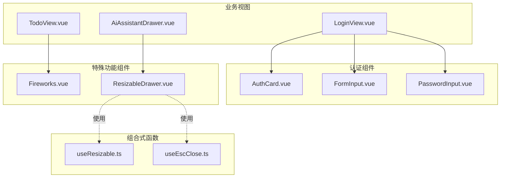
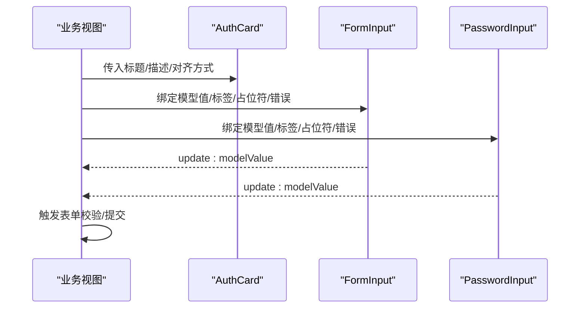
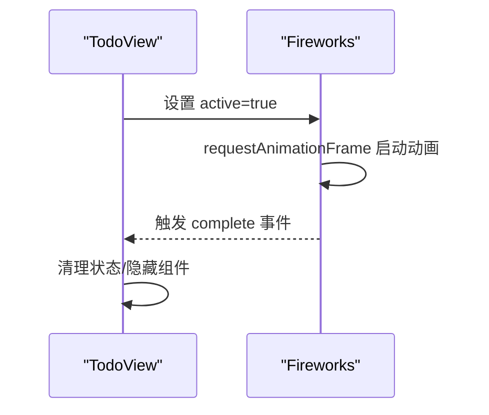
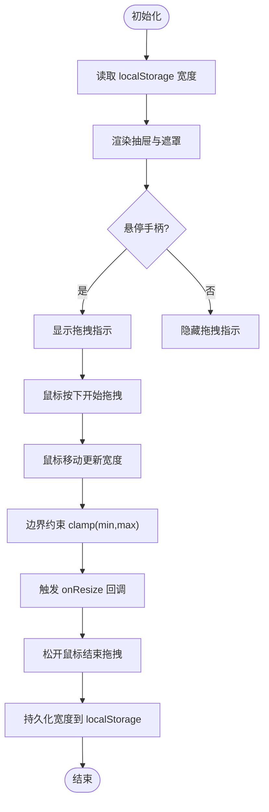
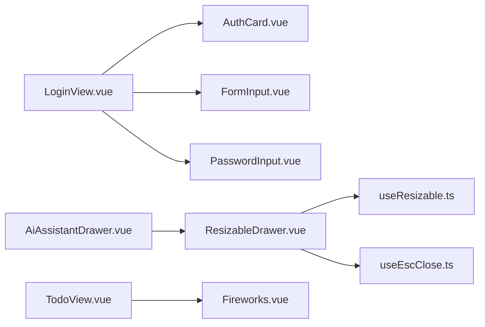

# 功能组件

<cite>
**本文档引用的文件**
- [AuthCard.vue](file://apps/frontend/src/components/auth/AuthCard.vue)
- [FormInput.vue](file://apps/frontend/src/components/auth/FormInput.vue)
- [PasswordInput.vue](file://apps/frontend/src/components/auth/PasswordInput.vue)
- [Fireworks.vue](file://apps/frontend/src/components/Fireworks.vue)
- [ResizableDrawer.vue](file://apps/frontend/src/components/ResizableDrawer.vue)
- [useResizable.ts](file://apps/frontend/src/composables/useResizable.ts)
- [useEscClose.ts](file://apps/frontend/src/composables/useEscClose.ts)
- [common.ts(zh-CN)](file://apps/frontend/src/i18n/locales/zh-CN/common.ts)
- [common.ts(en-US)](file://apps/frontend/src/i18n/locales/en-US/common.ts)
- [LoginView.vue](file://apps/frontend/src/features/auth/views/LoginView.vue)
- [AiAssistantDrawer.vue](file://apps/frontend/src/features/ai/components/AiAssistantDrawer.vue)
- [TodoView.vue](file://apps/frontend/src/features/todo/TodoView.vue)
</cite>

## 目录
1. [简介](#简介)
2. [项目结构](#项目结构)
3. [核心组件](#核心组件)
4. [架构总览](#架构总览)
5. [详细组件分析](#详细组件分析)
6. [依赖关系分析](#依赖关系分析)
7. [性能考量](#性能考量)
8. [故障排查指南](#故障排查指南)
9. [结论](#结论)
10. [附录](#附录)

## 简介
本文件聚焦 Lumina Todo 前端的功能组件，围绕认证相关组件（AuthCard、FormInput、PasswordInput）与特殊功能组件（Fireworks、ResizableDrawer）进行系统化说明。内容涵盖设计与实现、表单验证与错误处理、用户体验优化、与业务逻辑的集成方式、配置项与事件处理、状态管理方法，以及性能优化与内存管理策略。

## 项目结构
- 认证组件位于 apps/frontend/src/components/auth/，提供统一的卡片布局、基础输入与密码输入控件。
- 特殊功能组件位于 apps/frontend/src/components/，包括烟花特效 Fireworks 与可调整抽屉 ResizableDrawer。
- 组合式函数位于 apps/frontend/src/composables/，为可复用的交互能力提供支撑，如拖拽调整尺寸 useResizable 与 ESC 关闭 useEscClose。
- 国际化资源位于 apps/frontend/src/i18n/locales/*/，用于组件文案与字段名称的本地化。
- 实际业务使用场景分布在 features/auth、features/ai、features/todo 等视图中。

图表来源
- [AuthCard.vue:1-116](file://apps/frontend/src/components/auth/AuthCard.vue#L1-L116)
- [FormInput.vue:1-134](file://apps/frontend/src/components/auth/FormInput.vue#L1-L134)
- [PasswordInput.vue:1-137](file://apps/frontend/src/components/auth/PasswordInput.vue#L1-L137)
- [Fireworks.vue:1-45](file://apps/frontend/src/components/Fireworks.vue#L1-L45)
- [ResizableDrawer.vue:1-408](file://apps/frontend/src/components/ResizableDrawer.vue#L1-L408)
- [useResizable.ts:1-70](file://apps/frontend/src/composables/useResizable.ts#L1-L70)
- [useEscClose.ts:1-66](file://apps/frontend/src/composables/useEscClose.ts#L1-L66)
- [LoginView.vue:1-97](file://apps/frontend/src/features/auth/views/LoginView.vue#L1-L97)
- [AiAssistantDrawer.vue:200-336](file://apps/frontend/src/features/ai/components/AiAssistantDrawer.vue#L200-L336)
- [TodoView.vue:420-466](file://apps/frontend/src/features/todo/TodoView.vue#L420-L466)

章节来源
- [AuthCard.vue:1-116](file://apps/frontend/src/components/auth/AuthCard.vue#L1-L116)
- [FormInput.vue:1-134](file://apps/frontend/src/components/auth/FormInput.vue#L1-L134)
- [PasswordInput.vue:1-137](file://apps/frontend/src/components/auth/PasswordInput.vue#L1-L137)
- [Fireworks.vue:1-45](file://apps/frontend/src/components/Fireworks.vue#L1-L45)
- [ResizableDrawer.vue:1-408](file://apps/frontend/src/components/ResizableDrawer.vue#L1-L408)
- [useResizable.ts:1-70](file://apps/frontend/src/composables/useResizable.ts#L1-L70)
- [useEscClose.ts:1-66](file://apps/frontend/src/composables/useEscClose.ts#L1-L66)
- [LoginView.vue:1-97](file://apps/frontend/src/features/auth/views/LoginView.vue#L1-L97)
- [AiAssistantDrawer.vue:200-336](file://apps/frontend/src/features/ai/components/AiAssistantDrawer.vue#L200-L336)
- [TodoView.vue:420-466](file://apps/frontend/src/features/todo/TodoView.vue#L420-L466)

## 核心组件
- 认证卡片 AuthCard：提供统一的认证页布局、返回首页按钮、背景装饰与动画入场，支持图标插槽与标题/描述展示。
- 表单输入 FormInput：通用文本/邮箱/密码输入框，内置标签、占位符、禁用态、错误提示与插槽图标，支持基于 i18n 的字段名与错误信息翻译。
- 密码输入 PasswordInput：在 FormInput 基础上增加显示/隐藏密码开关，增强可访问性与易用性。
- 烟花特效 Fireworks：基于 canvas-confetti 的一次性视觉反馈，通过属性控制激活与完成事件。
- 可调整抽屉 ResizableDrawer：全屏/移动端适配、拖拽调整宽度、ESC 关闭、遮罩层与过渡动画，结合 useResizable 与 useEscClose 提供一致的交互体验。

章节来源
- [AuthCard.vue:1-116](file://apps/frontend/src/components/auth/AuthCard.vue#L1-L116)
- [FormInput.vue:1-134](file://apps/frontend/src/components/auth/FormInput.vue#L1-L134)
- [PasswordInput.vue:1-137](file://apps/frontend/src/components/auth/PasswordInput.vue#L1-L137)
- [Fireworks.vue:1-45](file://apps/frontend/src/components/Fireworks.vue#L1-L45)
- [ResizableDrawer.vue:1-408](file://apps/frontend/src/components/ResizableDrawer.vue#L1-L408)

## 架构总览
认证组件与业务视图之间通过 v-model 与事件进行数据流传递；特殊功能组件通过属性与事件与宿主组件协作；组合式函数提供跨组件的可复用能力。

图表来源
- [LoginView.vue:23-37](file://apps/frontend/src/features/auth/views/LoginView.vue#L23-L37)
- [FormInput.vue:16-27](file://apps/frontend/src/components/auth/FormInput.vue#L16-L27)
- [PasswordInput.vue:16-28](file://apps/frontend/src/components/auth/PasswordInput.vue#L16-L28)
- [AuthCard.vue:8-12](file://apps/frontend/src/components/auth/AuthCard.vue#L8-L12)

## 详细组件分析

### 认证卡片 AuthCard
- 设计要点
  - 卡片布局与背景装饰：使用渐变与模糊背景提升视觉层次，提供动画入场效果。
  - 返回首页按钮：集成 Tooltip，支持国际化文案。
  - 插槽支持：通过 icon 插槽注入品牌图标。
- 交互与动画
  - 使用 GSAP 在挂载时对卡片与返回按钮执行平滑入场动画。
- 国际化
  - 通过 vue-i18n 获取“返回首页”等文案。
- 适用场景
  - 登录、注册、忘记密码、重置密码等认证页。

章节来源
- [AuthCard.vue:1-116](file://apps/frontend/src/components/auth/AuthCard.vue#L1-L116)
- [common.ts(zh-CN):12-12](file://apps/frontend/src/i18n/locales/zh-CN/common.ts#L12-L12)
- [common.ts(en-US):12-12](file://apps/frontend/src/i18n/locales/en-US/common.ts#L12-L12)

### 表单输入 FormInput
- 数据绑定
  - 通过 v-model 与 update:modelValue 实现双向绑定。
- 校验与错误处理
  - 支持外部传入错误字符串；若为 i18n 键名，自动翻译并注入字段名、最小/最大长度等上下文参数。
  - 字段约束映射：email/name/password/confirmPassword 的最小/最大长度。
- 可访问性与可用性
  - 自动生成唯一 ID，label 与 input 关联；禁用态与焦点态样式区分。
  - 插槽图标支持左侧装饰图标。
- 国际化
  - 字段名优先从 common.fields.* 翻译，否则回退到字段名本身。

章节来源
- [FormInput.vue:1-134](file://apps/frontend/src/components/auth/FormInput.vue#L1-L134)
- [common.ts(zh-CN):71-80](file://apps/frontend/src/i18n/locales/zh-CN/common.ts#L71-L80)
- [common.ts(en-US):71-80](file://apps/frontend/src/i18n/locales/en-US/common.ts#L71-L80)

### 密码输入 PasswordInput
- 扩展能力
  - 在 FormInput 基础上增加“显示/隐藏密码”开关，使用 Lucide 图标。
  - 默认类型为 password，支持通过点击切换。
- 错误处理与国际化
  - 与 FormInput 相同的错误键名翻译与上下文注入机制。
- 可访问性
  - 按钮具备 title 文案与键盘可达性。

章节来源
- [PasswordInput.vue:1-137](file://apps/frontend/src/components/auth/PasswordInput.vue#L1-L137)
- [common.ts(zh-CN):71-80](file://apps/frontend/src/i18n/locales/zh-CN/common.ts#L71-L80)
- [common.ts(en-US):71-80](file://apps/frontend/src/i18n/locales/en-US/common.ts#L71-L80)

### 烟花特效 Fireworks
- 功能概述
  - 当 active 为 true 时触发一次性烟花动画，约 2.5 秒后发出 complete 事件。
  - 支持减少动画偏好（prefers-reduced-motion）。
- 性能与体验
  - 使用 requestAnimationFrame 保证渲染时机；动画完成后及时发出事件便于上层清理状态。

图表来源
- [TodoView.vue:426-431](file://apps/frontend/src/features/todo/TodoView.vue#L426-L431)
- [Fireworks.vue:13-26](file://apps/frontend/src/components/Fireworks.vue#L13-L26)

章节来源
- [Fireworks.vue:1-45](file://apps/frontend/src/components/Fireworks.vue#L1-L45)
- [TodoView.vue:420-466](file://apps/frontend/src/features/todo/TodoView.vue#L420-L466)

### 可调整抽屉 ResizableDrawer
- 核心能力
  - 宽度计算：默认宽度、最小/最大宽度、右侧边距限制、移动端/全屏适配。
  - 拖拽调整：基于 useResizable，支持鼠标拖拽与回调 onResize/onResizeEnd。
  - 关闭逻辑：支持 ESC 关闭（useEscClose），点击遮罩层关闭，锁定 body 滚动。
  - 动画与样式：遮罩层与抽屉滑入/滑出过渡，移动端样式降级。
- 配置项
  - modelValue：控制显隐
  - defaultWidth/minWidth/maxWidth/rightGap/storageKey/isFullscreen
- 事件
  - update:modelValue：显隐状态变更
  - complete：由子组件触发（如 Fireworks）

图表来源
- [ResizableDrawer.vue:46-74](file://apps/frontend/src/components/ResizableDrawer.vue#L46-L74)
- [useResizable.ts:12-68](file://apps/frontend/src/composables/useResizable.ts#L12-L68)

章节来源
- [ResizableDrawer.vue:1-408](file://apps/frontend/src/components/ResizableDrawer.vue#L1-L408)
- [useResizable.ts:1-70](file://apps/frontend/src/composables/useResizable.ts#L1-L70)
- [useEscClose.ts:1-66](file://apps/frontend/src/composables/useEscClose.ts#L1-L66)

## 依赖关系分析
- 认证组件依赖
  - AuthCard 依赖 GSAP、Tooltip 组件与路由跳转。
  - FormInput/PasswordInput 依赖 vue-i18n、Lucide 图标与 Transition 动画。
- 特殊功能组件依赖
  - Fireworks 依赖 canvas-confetti。
  - ResizableDrawer 依赖 useResizable、useEscClose、Teleport、Transition。
- 业务视图集成
  - LoginView 将 FormInput/PasswordInput 与 vee-validate 校验结合，并通过 authStore 管理错误与加载状态。
  - AiAssistantDrawer 将 ResizableDrawer 作为容器，承载 AI 助手对话与历史面板。
  - TodoView 将 Fireworks 作为成就反馈组件。

图表来源
- [LoginView.vue:1-97](file://apps/frontend/src/features/auth/views/LoginView.vue#L1-L97)
- [AiAssistantDrawer.vue:200-336](file://apps/frontend/src/features/ai/components/AiAssistantDrawer.vue#L200-L336)
- [TodoView.vue:420-466](file://apps/frontend/src/features/todo/TodoView.vue#L420-L466)
- [AuthCard.vue:1-116](file://apps/frontend/src/components/auth/AuthCard.vue#L1-L116)
- [FormInput.vue:1-134](file://apps/frontend/src/components/auth/FormInput.vue#L1-L134)
- [PasswordInput.vue:1-137](file://apps/frontend/src/components/auth/PasswordInput.vue#L1-L137)
- [ResizableDrawer.vue:1-408](file://apps/frontend/src/components/ResizableDrawer.vue#L1-L408)
- [useResizable.ts:1-70](file://apps/frontend/src/composables/useResizable.ts#L1-L70)
- [useEscClose.ts:1-66](file://apps/frontend/src/composables/useEscClose.ts#L1-L66)
- [Fireworks.vue:1-45](file://apps/frontend/src/components/Fireworks.vue#L1-L45)

章节来源
- [LoginView.vue:1-97](file://apps/frontend/src/features/auth/views/LoginView.vue#L1-L97)
- [AiAssistantDrawer.vue:200-336](file://apps/frontend/src/features/ai/components/AiAssistantDrawer.vue#L200-L336)
- [TodoView.vue:420-466](file://apps/frontend/src/features/todo/TodoView.vue#L420-L466)

## 性能考量
- 动画与渲染
  - AuthCard 使用 GSAP 控制入场动画，建议在组件卸载时清理动画实例，避免内存泄漏。
  - ResizableDrawer 在拖拽过程中使用 will-change 与 transform 优化 GPU 加速，减少重排。
- 事件与监听
  - useEscClose 采用全局键盘监听与栈式管理，确保多层抽屉时仅顶层响应 ESC，注意在组件卸载时移除回调。
  - useResizable 在拖拽期间移除/恢复全局 mousemove/mouseup 监听，避免重复绑定导致的性能问题。
- 资源与体积
  - canvas-confetti 仅在需要时触发，避免常驻占用；可通过减少粒子数或禁用动画偏好降低开销。
- 国际化与计算
  - 错误信息翻译与字段名解析在组件内完成，建议在上层缓存常用键值，减少重复查找。

## 故障排查指南
- 表单错误不显示或显示为键名
  - 检查错误字符串是否为 i18n 键名（包含点号且不含大括号），确保 common.ts 中存在对应键。
  - 确认字段名与约束映射正确，避免翻译失败回退为原始键名。
- 密码可见性切换无效
  - 确认点击事件绑定与 showPassword 状态切换逻辑正常。
- 抽屉无法拖拽或宽度异常
  - 检查 useResizable 的最小/最大宽度配置与窗口宽度限制；确认 localStorage 中保存的宽度未超出范围。
  - 移动端或全屏模式下拖拽手柄会隐藏，需检查 isMobile/isFullscreen 判断。
- ESC 关闭冲突
  - 若多层抽屉同时打开，仅最上层应响应 ESC；确认 useEscClose 的栈式管理是否正确维护。
- 烟花动画不触发
  - 确认 active 属性变化路径与事件监听；检查 complete 事件是否被正确消费。

章节来源
- [FormInput.vue:43-69](file://apps/frontend/src/components/auth/FormInput.vue#L43-L69)
- [PasswordInput.vue:42-68](file://apps/frontend/src/components/auth/PasswordInput.vue#L42-L68)
- [useResizable.ts:27-61](file://apps/frontend/src/composables/useResizable.ts#L27-L61)
- [useEscClose.ts:34-65](file://apps/frontend/src/composables/useEscClose.ts#L34-L65)
- [ResizableDrawer.vue:65-97](file://apps/frontend/src/components/ResizableDrawer.vue#L65-L97)
- [Fireworks.vue:13-26](file://apps/frontend/src/components/Fireworks.vue#L13-L26)

## 结论
上述组件通过清晰的职责划分与组合式函数实现了高复用性与良好的用户体验。认证组件提供一致的视觉与交互基线，特殊功能组件在业务场景中承担关键的增强体验角色。通过合理的国际化、错误处理与性能优化策略，这些组件能够稳定地服务于 Lumina Todo 的核心功能。

## 附录
- 组件配置与事件清单
  - AuthCard
    - 属性：title、description、alignTop
    - 插槽：icon
  - FormInput
    - 属性：modelValue、label、name、id、placeholder、type、error、disabled
    - 事件：update:modelValue
  - PasswordInput
    - 属性：modelValue、label、name、id、placeholder、error、disabled
    - 事件：update:modelValue
  - Fireworks
    - 属性：active
    - 事件：complete
  - ResizableDrawer
    - 属性：modelValue、defaultWidth、minWidth、maxWidth、rightGap、storageKey、isFullscreen
    - 事件：update:modelValue
- 业务集成要点
  - LoginView：将 FormInput/PasswordInput 与 vee-validate 结合，通过 authStore 管理错误与加载状态。
  - AiAssistantDrawer：以 ResizableDrawer 为容器，承载 AI 助手对话与历史面板。
  - TodoView：在特定状态下触发 Fireworks 并监听完成事件清理状态。

章节来源
- [LoginView.vue:23-37](file://apps/frontend/src/features/auth/views/LoginView.vue#L23-L37)
- [AiAssistantDrawer.vue:204-212](file://apps/frontend/src/features/ai/components/AiAssistantDrawer.vue#L204-L212)
- [TodoView.vue:426-431](file://apps/frontend/src/features/todo/TodoView.vue#L426-L431)