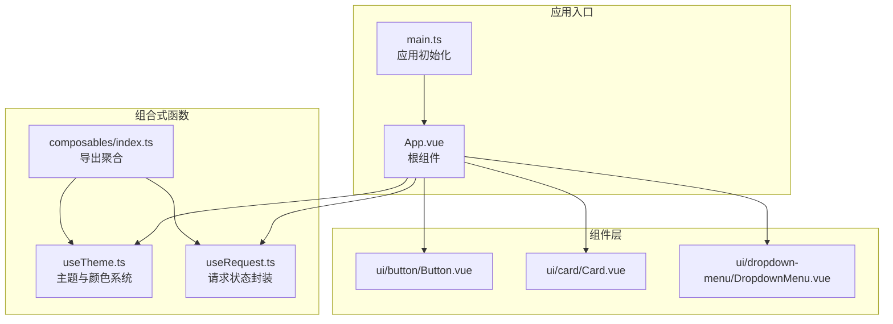
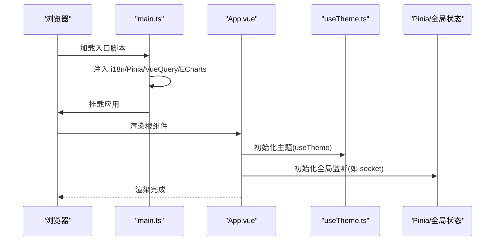
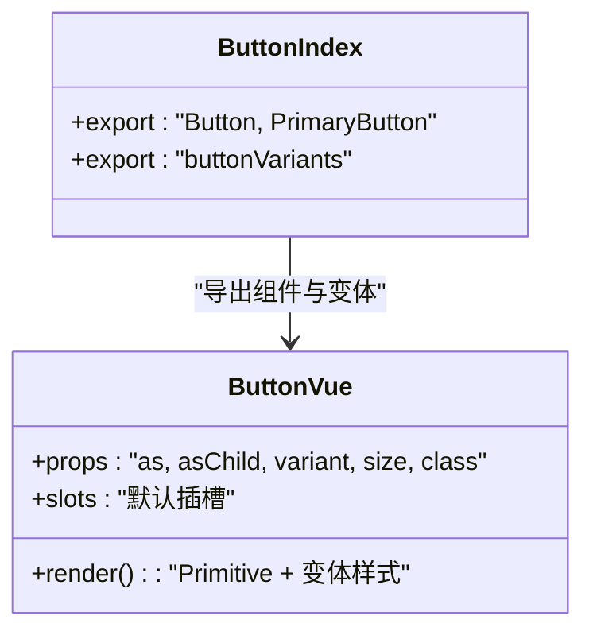
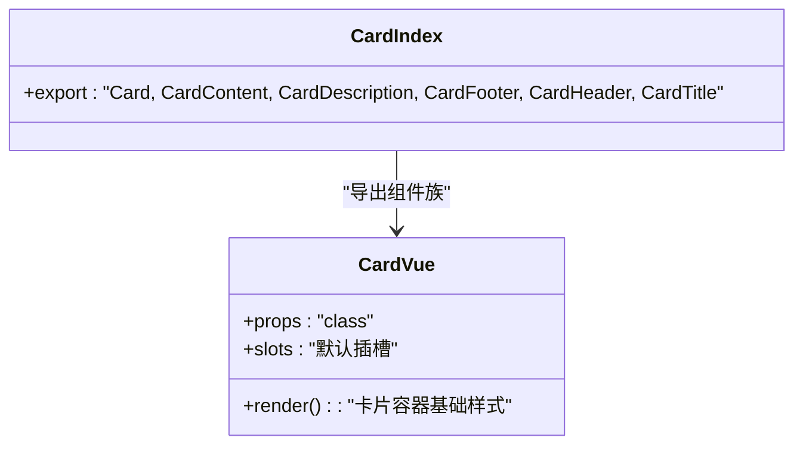
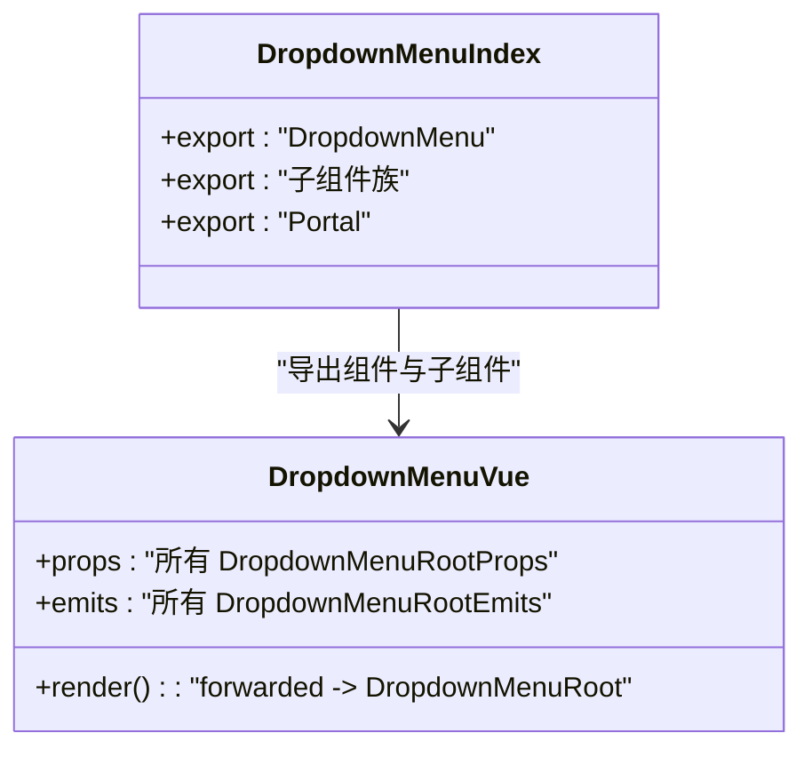
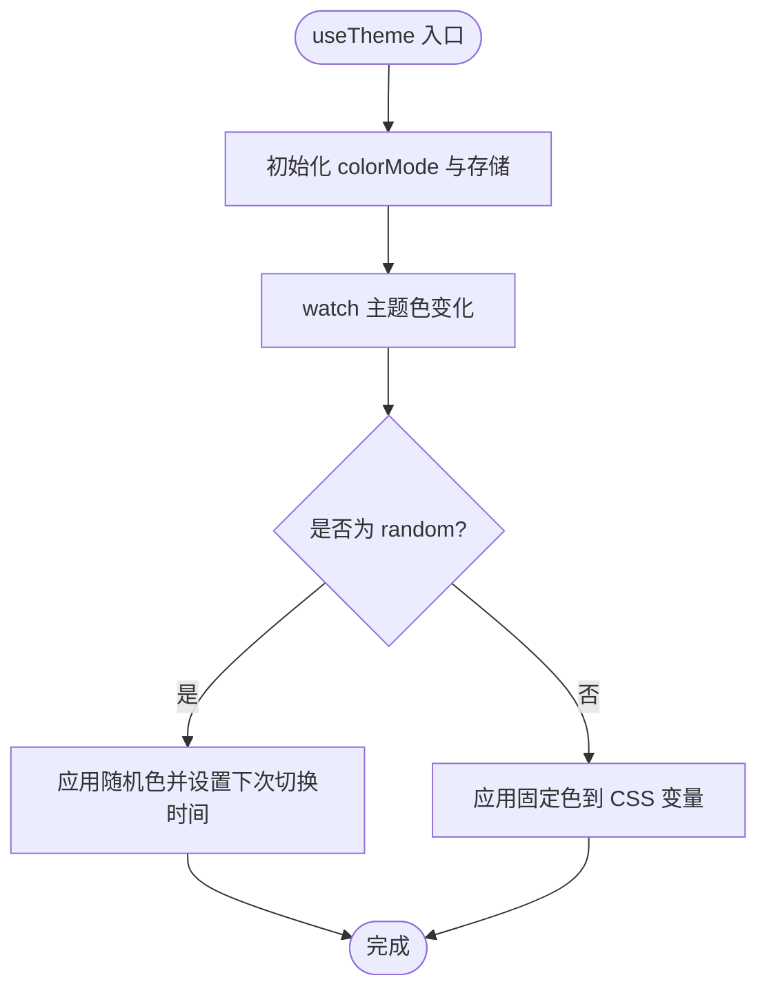
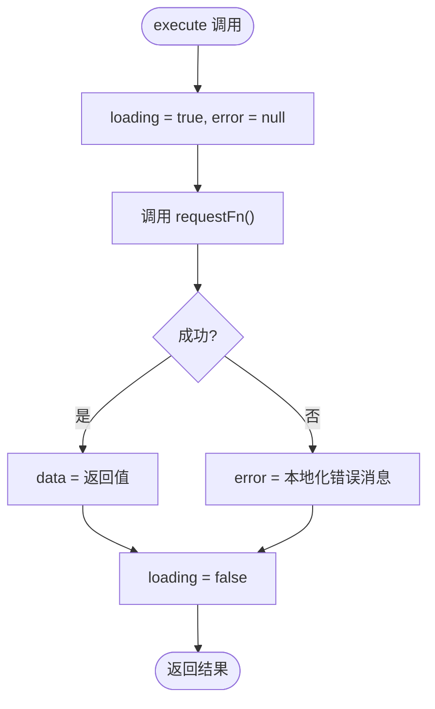
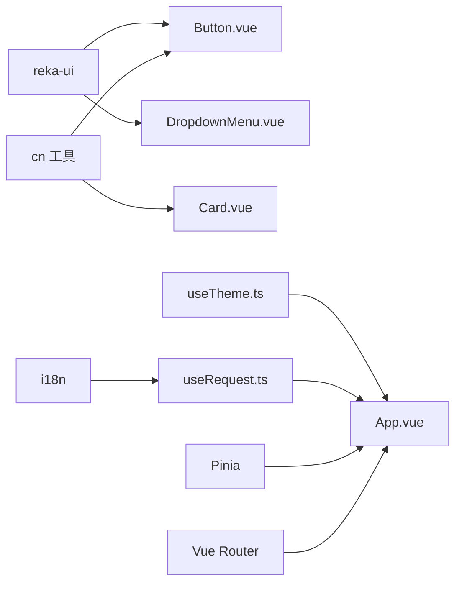

# 组件系统

<cite>
**本文引用的文件**
- [apps/frontend/src/App.vue](file://apps/frontend/src/App.vue)
- [apps/frontend/src/main.ts](file://apps/frontend/src/main.ts)
- [apps/frontend/src/composables/index.ts](file://apps/frontend/src/composables/index.ts)
- [apps/frontend/src/composables/useTheme.ts](file://apps/frontend/src/composables/useTheme.ts)
- [apps/frontend/src/composables/useRequest.ts](file://apps/frontend/src/composables/useRequest.ts)
- [apps/frontend/src/components/ui/button/index.ts](file://apps/frontend/src/components/ui/button/index.ts)
- [apps/frontend/src/components/ui/button/Button.vue](file://apps/frontend/src/components/ui/button/Button.vue)
- [apps/frontend/src/components/ui/card/index.ts](file://apps/frontend/src/components/ui/card/index.ts)
- [apps/frontend/src/components/ui/card/Card.vue](file://apps/frontend/src/components/ui/card/Card.vue)
- [apps/frontend/src/components/ui/dropdown-menu/index.ts](file://apps/frontend/src/components/ui/dropdown-menu/index.ts)
- [apps/frontend/src/components/ui/dropdown-menu/DropdownMenu.vue](file://apps/frontend/src/components/ui/dropdown-menu/DropdownMenu.vue)
</cite>

## 目录
1. 引言
2. 项目结构
3. 核心组件
4. 架构总览
5. 详细组件分析
6. 依赖关系分析
7. 性能考量
8. 故障排查指南
9. 结论
10. 附录

## 引言
本文件系统性梳理 Lumina Todo 前端组件体系，聚焦 Vue.js 组件架构设计与实践，涵盖功能组件、UI 组件与组合式函数（composables）的使用模式；解释命名规范、文件组织与复用策略；阐述组件间通信机制（props、events、provide/inject）；总结组合式函数的设计模式与复用逻辑；给出生命周期管理与性能优化建议；提供组件测试与调试方法；说明样式封装与主题系统集成方式。

## 项目结构
前端应用位于 apps/frontend，采用按功能域分层的目录组织：
- components：基础 UI 组件与业务功能组件
- composables：跨组件可复用的组合式逻辑
- features：特性域模块（如 todo、ai、auth、mcp）
- styles：样式入口与主题变量
- router、i18n、services：基础设施
- main.ts 作为应用入口，集中初始化依赖与全局配置

图表来源
- [apps/frontend/src/main.ts:1-138](file://apps/frontend/src/main.ts#L1-L138)
- [apps/frontend/src/App.vue:1-77](file://apps/frontend/src/App.vue#L1-L77)
- [apps/frontend/src/composables/index.ts:1-11](file://apps/frontend/src/composables/index.ts#L1-L11)
- [apps/frontend/src/composables/useTheme.ts:1-248](file://apps/frontend/src/composables/useTheme.ts#L1-L248)
- [apps/frontend/src/composables/useRequest.ts:1-45](file://apps/frontend/src/composables/useRequest.ts#L1-L45)
- [apps/frontend/src/components/ui/button/Button.vue:1-32](file://apps/frontend/src/components/ui/button/Button.vue#L1-L32)
- [apps/frontend/src/components/ui/card/Card.vue:1-15](file://apps/frontend/src/components/ui/card/Card.vue#L1-L15)
- [apps/frontend/src/components/ui/dropdown-menu/DropdownMenu.vue:1-16](file://apps/frontend/src/components/ui/dropdown-menu/DropdownMenu.vue#L1-L16)

章节来源
- [apps/frontend/src/main.ts:1-138](file://apps/frontend/src/main.ts#L1-L138)
- [apps/frontend/src/App.vue:1-77](file://apps/frontend/src/App.vue#L1-L77)

## 核心组件
- 功能组件：以业务功能为主，如 TodoView、AI 助手面板等，负责数据流与视图编排。
- UI 组件：通用基础 UI，如 Button、Card、DropdownMenu 等，强调可复用与一致性。
- 组合式函数：跨组件共享的状态、副作用与逻辑封装，如 useTheme、useRequest、useWindowSize 等。

章节来源
- [apps/frontend/src/components/ui/button/index.ts:1-38](file://apps/frontend/src/components/ui/button/index.ts#L1-L38)
- [apps/frontend/src/components/ui/card/index.ts:1-7](file://apps/frontend/src/components/ui/card/index.ts#L1-L7)
- [apps/frontend/src/components/ui/dropdown-menu/index.ts:1-17](file://apps/frontend/src/components/ui/dropdown-menu/index.ts#L1-L17)
- [apps/frontend/src/composables/index.ts:1-11](file://apps/frontend/src/composables/index.ts#L1-L11)

## 架构总览
应用通过 main.ts 完成依赖注入、全局错误处理、缓存与查询客户端配置；App.vue 作为根组件，统一挂载 TooltipProvider、ToastProvider 等上下文容器，并在挂载时初始化主题与全局 WebSocket 监听。UI 组件通过 reka-ui 提供的语义化原语与变体系统实现一致的外观与行为；组合式函数在组件间共享状态与副作用，降低重复逻辑。

图表来源
- [apps/frontend/src/main.ts:115-138](file://apps/frontend/src/main.ts#L115-L138)
- [apps/frontend/src/App.vue:11-27](file://apps/frontend/src/App.vue#L11-L27)
- [apps/frontend/src/composables/useTheme.ts:188-247](file://apps/frontend/src/composables/useTheme.ts#L188-L247)

## 详细组件分析

### UI 组件：Button（按钮）
- 设计要点
  - 使用 Primitive 语义化原语，支持 as/asChild 自定义渲染标签。
  - 通过变体系统（cva）统一尺寸与风格，支持 variant/size/class 扩展。
  - 通过 cn 工具类合并类名，保证样式可控与可扩展。
- 通信与复用
  - 通过 props 接收外部传入的渲染标签与样式，事件透传给内部原语，便于上层统一处理。
  - 在 index.ts 中导出默认与主按钮变体，形成组件族，便于按需引入与复用。
- 生命周期与性能
  - 无副作用，纯渲染组件，性能开销极低；通过透传避免额外包装节点。

图表来源
- [apps/frontend/src/components/ui/button/Button.vue:1-32](file://apps/frontend/src/components/ui/button/Button.vue#L1-L32)
- [apps/frontend/src/components/ui/button/index.ts:1-38](file://apps/frontend/src/components/ui/button/index.ts#L1-L38)

章节来源
- [apps/frontend/src/components/ui/button/Button.vue:1-32](file://apps/frontend/src/components/ui/button/Button.vue#L1-L32)
- [apps/frontend/src/components/ui/button/index.ts:1-38](file://apps/frontend/src/components/ui/button/index.ts#L1-L38)

### UI 组件：Card（卡片）
- 设计要点
  - 以语义化卡片容器为核心，提供 Header/Content/Footer/Title/Description 等子组件，形成卡片组件族。
  - 通过 cn 合并基础卡片样式与外部 class，保持一致的边框、阴影与背景。
- 通信与复用
  - 子组件通过 slot 组合，父组件仅负责布局与样式拼接，职责清晰。
  - index.ts 导出完整组件族，便于按需引入与统一管理。

图表来源
- [apps/frontend/src/components/ui/card/Card.vue:1-15](file://apps/frontend/src/components/ui/card/Card.vue#L1-L15)
- [apps/frontend/src/components/ui/card/index.ts:1-7](file://apps/frontend/src/components/ui/card/index.ts#L1-L7)

章节来源
- [apps/frontend/src/components/ui/card/Card.vue:1-15](file://apps/frontend/src/components/ui/card/Card.vue#L1-L15)
- [apps/frontend/src/components/ui/card/index.ts:1-7](file://apps/frontend/src/components/ui/card/index.ts#L1-L7)

### UI 组件：DropdownMenu（下拉菜单）
- 设计要点
  - 直接包裹 reka-ui 的 DropdownMenuRoot，使用 useForwardPropsEmits 透传属性与事件，确保行为一致。
  - 通过 index.ts 导出完整子组件族，包含触发器、内容区、分组、子菜单等。
- 通信与复用
  - 事件与属性完全透传，便于上层统一绑定与解耦。
  - 子组件按需引入，避免不必要的打包体积。

图表来源
- [apps/frontend/src/components/ui/dropdown-menu/DropdownMenu.vue:1-16](file://apps/frontend/src/components/ui/dropdown-menu/DropdownMenu.vue#L1-L16)
- [apps/frontend/src/components/ui/dropdown-menu/index.ts:1-17](file://apps/frontend/src/components/ui/dropdown-menu/index.ts#L1-L17)

章节来源
- [apps/frontend/src/components/ui/dropdown-menu/DropdownMenu.vue:1-16](file://apps/frontend/src/components/ui/dropdown-menu/DropdownMenu.vue#L1-L16)
- [apps/frontend/src/components/ui/dropdown-menu/index.ts:1-17](file://apps/frontend/src/components/ui/dropdown-menu/index.ts#L1-L17)

### 组合式函数：useTheme（主题与颜色系统）
- 设计要点
  - 基于 useColorMode 切换明暗主题，基于 useStorage 记忆用户选择。
  - 支持固定色板与随机色（preset/random），自动计算亮/暗两套色阶与前景色。
  - 通过 CSS 变量写入 documentElement，驱动全站主题与颜色系统。
- 复用策略
  - 在 App.vue 初始化时调用，全局生效；也可在设置页中动态切换。
  - 提供 setTheme、setThemeColor、resetThemeColor 等 API，便于上层控制。
- 生命周期与性能
  - 通过 watch 监听主题色变化，惰性应用；随机模式定时器节流，避免频繁重绘。

图表来源
- [apps/frontend/src/composables/useTheme.ts:188-247](file://apps/frontend/src/composables/useTheme.ts#L188-L247)

章节来源
- [apps/frontend/src/composables/useTheme.ts:1-248](file://apps/frontend/src/composables/useTheme.ts#L1-L248)
- [apps/frontend/src/App.vue:11-12](file://apps/frontend/src/App.vue#L11-L12)

### 组合式函数：useRequest（请求状态封装）
- 设计要点
  - 返回 data/loading/error 三态与 execute 方法，统一处理异步请求的加载、错误与数据。
  - 内部捕获异常并进行本地化错误提示，finally 清理 loading 状态。
- 复用策略
  - 通过泛型约束 T，适配任意异步请求；在多个页面或组件中复用，减少样板代码。
- 生命周期与性能
  - 无副作用，仅封装状态；执行频率受调用方控制，避免重复请求可通过上层缓存策略配合。

图表来源
- [apps/frontend/src/composables/useRequest.ts:24-44](file://apps/frontend/src/composables/useRequest.ts#L24-L44)

章节来源
- [apps/frontend/src/composables/useRequest.ts:1-45](file://apps/frontend/src/composables/useRequest.ts#L1-L45)

### 组合式函数导出聚合：composables/index.ts
- 设计要点
  - 对外统一导出各领域组合式函数，形成“组合式函数门面”，便于按需引入与维护。
- 复用策略
  - 上层组件仅依赖该索引文件，降低导入路径耦合；新增组合式函数只需在此聚合导出。

章节来源
- [apps/frontend/src/composables/index.ts:1-11](file://apps/frontend/src/composables/index.ts#L1-L11)

## 依赖关系分析
- 组件依赖
  - Button/Card/DropdownMenu 均依赖 reka-ui 的语义化原语与工具函数，保证行为一致性。
  - 组件通过 cn 合并样式，遵循 Tailwind 与主题变量体系。
- 组合式函数依赖
  - useTheme 依赖 @vueuse/core 的 useColorMode/useStorage，以及浏览器 CSS 变量能力。
  - useRequest 依赖 i18n 进行错误本地化。
- 应用级依赖
  - main.ts 注入 Pinia、Vue Router、i18n、Vue Query、ECharts 等，形成应用基础设施。

图表来源
- [apps/frontend/src/components/ui/button/Button.vue:1-32](file://apps/frontend/src/components/ui/button/Button.vue#L1-L32)
- [apps/frontend/src/components/ui/card/Card.vue:1-15](file://apps/frontend/src/components/ui/card/Card.vue#L1-L15)
- [apps/frontend/src/components/ui/dropdown-menu/DropdownMenu.vue:1-16](file://apps/frontend/src/components/ui/dropdown-menu/DropdownMenu.vue#L1-L16)
- [apps/frontend/src/composables/useTheme.ts:1-248](file://apps/frontend/src/composables/useTheme.ts#L1-L248)
- [apps/frontend/src/composables/useRequest.ts:1-45](file://apps/frontend/src/composables/useRequest.ts#L1-L45)
- [apps/frontend/src/App.vue:1-77](file://apps/frontend/src/App.vue#L1-L77)
- [apps/frontend/src/main.ts:115-138](file://apps/frontend/src/main.ts#L115-L138)

## 性能考量
- 组件层面
  - UI 组件尽量保持纯渲染，避免在模板中进行复杂计算；通过 props 与透传事件降低中间层开销。
  - 使用 Primitive 语义化原语，减少 DOM 层级与样式包裹。
- 组合式函数层面
  - useTheme 的随机模式使用定时器节流，避免频繁重绘；颜色计算在变更时触发，避免常驻任务。
  - useRequest 的 execute 仅在调用时发起请求，结合上层缓存策略减少重复请求。
- 应用层面
  - main.ts 中对动态导入失败进行兜底刷新，避免因部署更新导致的白屏；全局错误处理器忽略常见良性错误，减少噪音。
  - Pinia 使用持久化插件，减少刷新后状态丢失带来的重请求成本。

章节来源
- [apps/frontend/src/composables/useTheme.ts:200-210](file://apps/frontend/src/composables/useTheme.ts#L200-L210)
- [apps/frontend/src/composables/useRequest.ts:24-44](file://apps/frontend/src/composables/useRequest.ts#L24-L44)
- [apps/frontend/src/main.ts:59-113](file://apps/frontend/src/main.ts#L59-L113)

## 故障排查指南
- 动态导入失败
  - 现象：控制台出现“Failed to fetch dynamically imported module”等错误。
  - 处理：main.ts 中已内置兜底逻辑，检测到错误后尝试刷新页面；若短时间内多次失败，会输出警告提示手动刷新。
- ResizeObserver 错误
  - 现象：控制台出现“ResizeObserver loop limit exceeded”等警告。
  - 处理：全局错误处理器忽略此类良性错误，不影响功能。
- 请求失败
  - 现象：useRequest 执行失败，error 非空。
  - 处理：检查网络与服务端状态；确认 i18n 是否正确加载本地化文本；查看控制台错误堆栈定位问题。

章节来源
- [apps/frontend/src/main.ts:59-113](file://apps/frontend/src/main.ts#L59-L113)
- [apps/frontend/src/composables/useRequest.ts:28-35](file://apps/frontend/src/composables/useRequest.ts#L28-L35)

## 结论
Lumina Todo 的组件系统以“UI 组件 + 组合式函数 + 功能组件”的分层架构为核心，通过 reka-ui 与变体系统保证 UI 一致性，通过组合式函数抽象跨组件状态与副作用，通过统一入口与导出聚合提升可维护性。整体设计强调可复用、可测试与可扩展，同时在错误处理与性能优化方面提供了稳健的工程实践。

## 附录
- 命名规范与文件组织
  - UI 组件：按功能域分目录，index.ts 聚合导出，组件文件以 PascalCase 命名。
  - 组合式函数：以 use 前缀命名，集中导出至 composables/index.ts。
  - 根组件与入口：App.vue 与 main.ts 分别承担根组件与应用初始化职责。
- 样式封装与主题系统
  - 通过 CSS 变量与 useTheme 控制主题色与明暗模式；UI 组件通过变体系统与 cn 合并样式，确保一致性与可定制性。