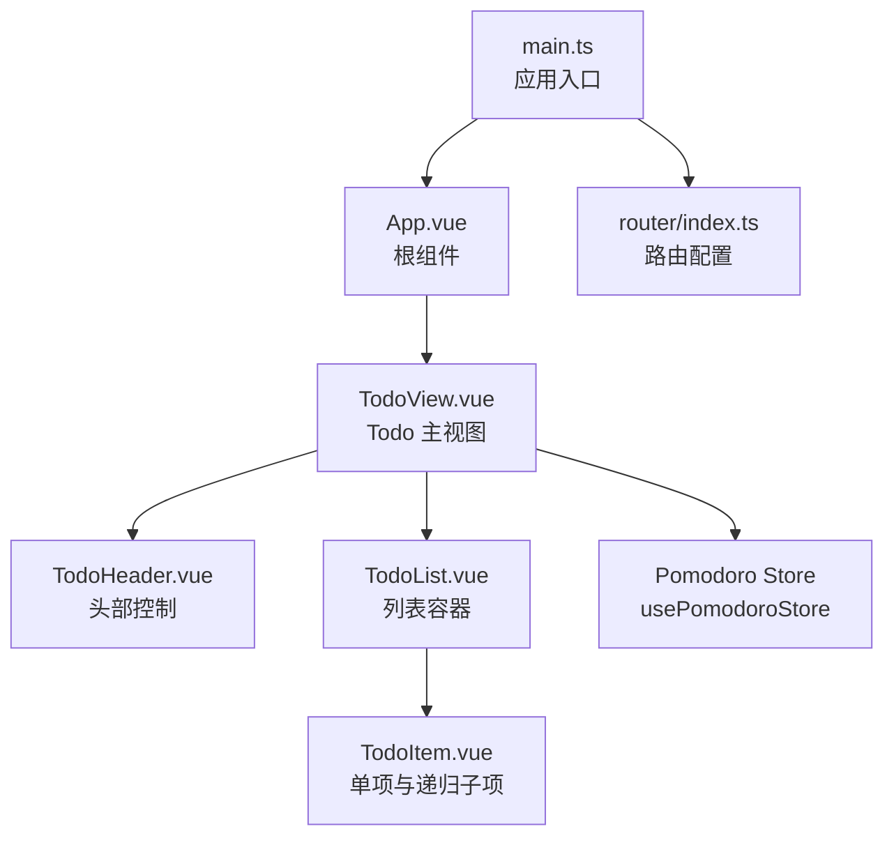
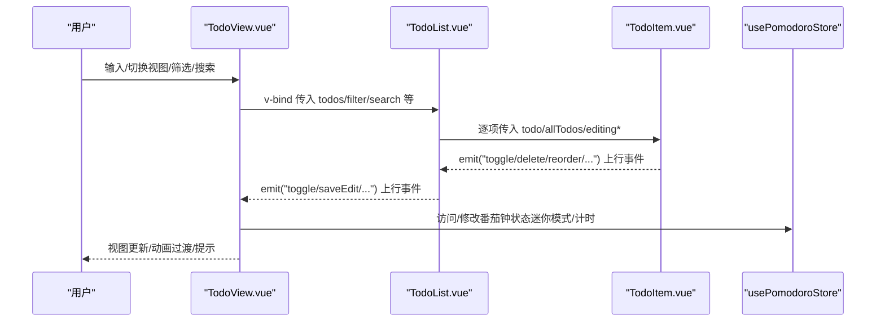
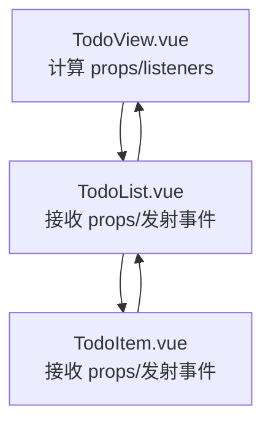
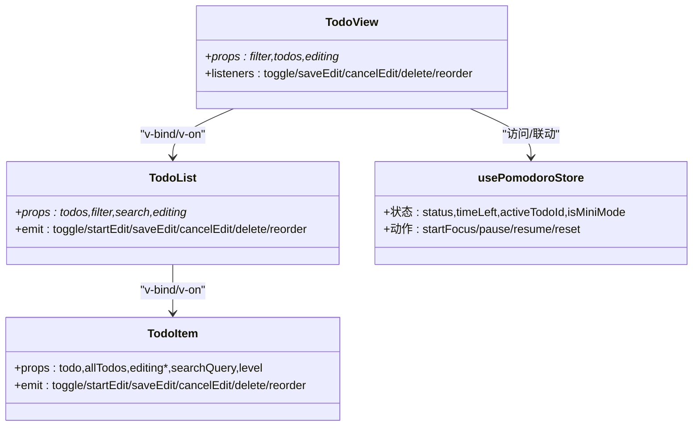
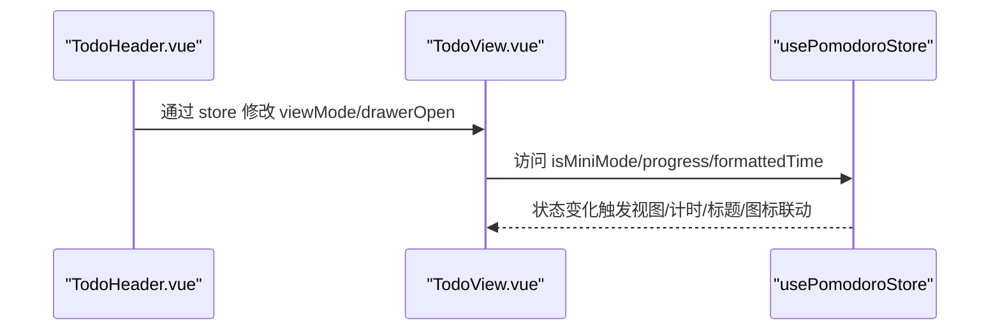
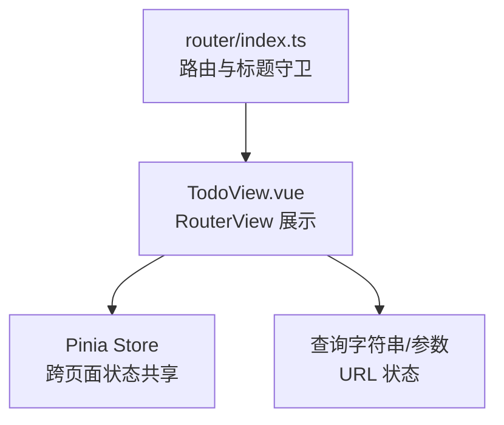
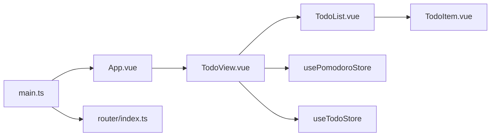

# 组件通信

<cite>
**本文引用的文件**
- [apps/frontend/src/App.vue](file://apps/frontend/src/App.vue)
- [apps/frontend/src/main.ts](file://apps/frontend/src/main.ts)
- [apps/frontend/src/router/index.ts](file://apps/frontend/src/router/index.ts)
- [apps/frontend/src/features/todo/TodoView.vue](file://apps/frontend/src/features/todo/TodoView.vue)
- [apps/frontend/src/features/todo/components/TodoList.vue](file://apps/frontend/src/features/todo/components/TodoList.vue)
- [apps/frontend/src/features/todo/components/TodoItem.vue](file://apps/frontend/src/features/todo/components/TodoItem.vue)
- [apps/frontend/src/features/todo/components/TodoHeader.vue](file://apps/frontend/src/features/todo/components/TodoHeader.vue)
- [apps/frontend/src/features/todo/stores/pomodoro.ts](file://apps/frontend/src/features/todo/stores/pomodoro.ts)
- [apps/frontend/src/features/todo/stores/todo.ts](file://apps/frontend/src/features/todo/stores/todo.ts)
</cite>

## 目录
1. [简介](#简介)
2. [项目结构](#项目结构)
3. [核心组件](#核心组件)
4. [架构总览](#架构总览)
5. [详细组件分析](#详细组件分析)
6. [依赖分析](#依赖分析)
7. [性能考量](#性能考量)
8. [故障排查指南](#故障排查指南)
9. [结论](#结论)
10. [附录](#附录)

## 简介
本文件系统性梳理 Lumina Todo 前端的组件通信机制，围绕 Vue.js 组件间通信的多种方式展开：props 传递、事件发射、provide/inject 使用场景、以及 Pinia 全局状态管理在 Todo 场景中的应用。文档同时覆盖父子组件通信最佳实践与性能考虑、兄弟组件与跨层级通信模式、路由参数与查询字符串处理、页面间数据共享、组件生命周期管理与事件总线思路，并给出组件解耦与模块化策略、常见问题与调试技巧。

## 项目结构
前端采用单页应用架构，入口在 main.ts 中初始化应用、路由、国际化、状态管理与查询缓存等；Todo 主视图 TodoView.vue 作为中枢，协调多个子组件与状态层；TodoList 与 TodoItem 构成典型的父子组件链路；TodoHeader 作为顶层控制面板，连接导航、主题、语言与认证等能力；Pomodoro 状态通过独立 Pinia Store 管理并与 Todo 视图联动。

图表来源
- [apps/frontend/src/main.ts:1-138](file://apps/frontend/src/main.ts#L1-L138)
- [apps/frontend/src/App.vue:1-77](file://apps/frontend/src/App.vue#L1-L77)
- [apps/frontend/src/router/index.ts:1-73](file://apps/frontend/src/router/index.ts#L1-L73)
- [apps/frontend/src/features/todo/TodoView.vue:1-466](file://apps/frontend/src/features/todo/TodoView.vue#L1-L466)
- [apps/frontend/src/features/todo/components/TodoList.vue:1-164](file://apps/frontend/src/features/todo/components/TodoList.vue#L1-L164)
- [apps/frontend/src/features/todo/components/TodoItem.vue:1-344](file://apps/frontend/src/features/todo/components/TodoItem.vue#L1-L344)
- [apps/frontend/src/features/todo/components/TodoHeader.vue:1-354](file://apps/frontend/src/features/todo/components/TodoHeader.vue#L1-L354)
- [apps/frontend/src/features/todo/stores/pomodoro.ts:1-402](file://apps/frontend/src/features/todo/stores/pomodoro.ts#L1-L402)

章节来源
- [apps/frontend/src/main.ts:1-138](file://apps/frontend/src/main.ts#L1-L138)
- [apps/frontend/src/router/index.ts:1-73](file://apps/frontend/src/router/index.ts#L1-L73)

## 核心组件
- TodoView.vue：负责聚合视图切换、输入区、过滤器、搜索、列表/可视化/统计视图渲染、动画过渡、全局冲突面板与 AI 抽屉挂载控制。通过计算属性与 v-bind/v-on 将状态与事件向下传递给子组件。
- TodoList.vue：接收 todos/filter/search/editing 等 props，向上发射 toggle/startEdit/saveEdit/cancelEdit/delete/reorder/update:editingTitle/editKeydown 等事件，内部使用可拖拽组件实现重排。
- TodoItem.vue：单项渲染与编辑、子任务展开/折叠、增删改查、拖拽重排、递归子项渲染、与父组件事件冒泡。
- TodoHeader.vue：视图模式切换、主题/颜色选择、语言切换、本地/云端数据源切换、用户登录态菜单、打开 AI 助手抽屉。
- usePomodoroStore：番茄钟状态与计时逻辑，与 Todo 视图联动（如迷你模式、全局计时显示）。

章节来源
- [apps/frontend/src/features/todo/TodoView.vue:1-466](file://apps/frontend/src/features/todo/TodoView.vue#L1-L466)
- [apps/frontend/src/features/todo/components/TodoList.vue:1-164](file://apps/frontend/src/features/todo/components/TodoList.vue#L1-L164)
- [apps/frontend/src/features/todo/components/TodoItem.vue:1-344](file://apps/frontend/src/features/todo/components/TodoItem.vue#L1-L344)
- [apps/frontend/src/features/todo/components/TodoHeader.vue:1-354](file://apps/frontend/src/features/todo/components/TodoHeader.vue#L1-L354)
- [apps/frontend/src/features/todo/stores/pomodoro.ts:1-402](file://apps/frontend/src/features/todo/stores/pomodoro.ts#L1-L402)

## 架构总览
组件通信路径概览：
- 父子通信：TodoView 通过 props 向 TodoList 传递数据；TodoList 再向 TodoItem 逐级传递。
- 事件冒泡：TodoItem/TodoList 通过 emit 向上触发事件，TodoView 在模板中绑定 v-on 接收并调用组合式函数或 store 方法。
- 全局状态：Pinia store（如 useTodoStore、usePomodoroStore）集中管理跨组件共享的状态与行为。
- 路由与页面：路由守卫根据 meta 更新标题；TodoView 通过 RouterView 展示不同视图；页面间数据可通过路由参数/查询字符串或 store 共享。

图表来源
- [apps/frontend/src/features/todo/TodoView.vue:208-241](file://apps/frontend/src/features/todo/TodoView.vue#L208-L241)
- [apps/frontend/src/features/todo/components/TodoList.vue:25-34](file://apps/frontend/src/features/todo/components/TodoList.vue#L25-L34)
- [apps/frontend/src/features/todo/components/TodoItem.vue:37-46](file://apps/frontend/src/features/todo/components/TodoItem.vue#L37-L46)
- [apps/frontend/src/features/todo/stores/pomodoro.ts:32-382](file://apps/frontend/src/features/todo/stores/pomodoro.ts#L32-L382)

## 详细组件分析

### 父子组件通信与事件发射
- TodoView -> TodoList：通过 v-bind 传入 filter、todos/searchQuery/editingId/editingTitle 等；通过 v-on 绑定 toggle/saveEdit/cancelEdit/delete/reorder 等事件。
- TodoList -> TodoItem：逐项传递 todo/allTodos/editingId/editingTitle/searchQuery/level 等；冒泡事件同上。
- TodoItem：内部处理编辑、展开/折叠、拖拽重排、子任务增删等，统一通过 emit 向上反馈。

图表来源
- [apps/frontend/src/features/todo/TodoView.vue:208-241](file://apps/frontend/src/features/todo/TodoView.vue#L208-L241)
- [apps/frontend/src/features/todo/components/TodoList.vue:17-34](file://apps/frontend/src/features/todo/components/TodoList.vue#L17-L34)
- [apps/frontend/src/features/todo/components/TodoItem.vue:28-46](file://apps/frontend/src/features/todo/components/TodoItem.vue#L28-L46)

章节来源
- [apps/frontend/src/features/todo/TodoView.vue:208-241](file://apps/frontend/src/features/todo/TodoView.vue#L208-L241)
- [apps/frontend/src/features/todo/components/TodoList.vue:17-34](file://apps/frontend/src/features/todo/components/TodoList.vue#L17-L34)
- [apps/frontend/src/features/todo/components/TodoItem.vue:28-46](file://apps/frontend/src/features/todo/components/TodoItem.vue#L28-L46)

### provide/inject 的使用场景
- 当前代码未直接使用 provide/inject。在 Lumina Todo 中，跨层级通信主要通过：
  - Pinia 全局状态（useTodoStore/usePomodoroStore）
  - 事件发射（emit/v-on）
  - 路由与页面间数据共享（路由参数/查询字符串）

若需引入 provide/inject，建议：
- 在根组件 App.vue 或 TodoView.vue 中 provide 全局服务实例（如通知、主题、国际化等），在深层子组件 inject 获取，降低跨层级依赖耦合。
- 仅对“横切关注”或“可替换的服务”使用 provide/inject，避免滥用导致状态来源不清晰。

[本节为概念性说明，不直接分析具体文件，故无章节来源]

### 全局状态管理（Pinia）
- useTodoStore：集中管理 Todo 数据、过滤、搜索、视图模式、编辑态、同步冲突等。
- usePomodoroStore：集中管理番茄钟状态、计时、会话历史、迷你模式、主题色联动等。
- App.vue 在挂载后初始化全局 WebSocket 监听（与 TodoStore 关联），体现全局状态与外部事件的集成。

图表来源
- [apps/frontend/src/features/todo/TodoView.vue:208-241](file://apps/frontend/src/features/todo/TodoView.vue#L208-L241)
- [apps/frontend/src/features/todo/components/TodoList.vue:17-34](file://apps/frontend/src/features/todo/components/TodoList.vue#L17-L34)
- [apps/frontend/src/features/todo/components/TodoItem.vue:28-46](file://apps/frontend/src/features/todo/components/TodoItem.vue#L28-L46)
- [apps/frontend/src/features/todo/stores/pomodoro.ts:32-382](file://apps/frontend/src/features/todo/stores/pomodoro.ts#L32-L382)

章节来源
- [apps/frontend/src/App.vue:14-23](file://apps/frontend/src/App.vue#L14-L23)
- [apps/frontend/src/features/todo/stores/pomodoro.ts:32-382](file://apps/frontend/src/features/todo/stores/pomodoro.ts#L32-L382)

### 兄弟组件与跨层级通信
- 跨层级：TodoHeader 与 TodoView 通过 Pinia 状态（如 viewMode、drawer 打开状态）进行联动；TodoHeader 修改状态，TodoView 响应视图切换与抽屉挂载。
- 兄弟组件：TodoList 与 TodoItem 通过事件冒泡形成兄弟组件协作（例如拖拽排序、编辑态同步）。

图表来源
- [apps/frontend/src/features/todo/components/TodoHeader.vue:21-56](file://apps/frontend/src/features/todo/components/TodoHeader.vue#L21-L56)
- [apps/frontend/src/features/todo/TodoView.vue:19-25](file://apps/frontend/src/features/todo/TodoView.vue#L19-L25)
- [apps/frontend/src/features/todo/stores/pomodoro.ts:74-94](file://apps/frontend/src/features/todo/stores/pomodoro.ts#L74-L94)

章节来源
- [apps/frontend/src/features/todo/components/TodoHeader.vue:21-56](file://apps/frontend/src/features/todo/components/TodoHeader.vue#L21-L56)
- [apps/frontend/src/features/todo/stores/pomodoro.ts:74-94](file://apps/frontend/src/features/todo/stores/pomodoro.ts#L74-L94)

### 路由参数传递、查询字符串处理与页面间数据共享
- 路由配置：router/index.ts 定义了 Todo、登录、注册、忘记密码、重置密码、MCP 设置、404 等页面；在 beforeEach 中根据 meta.title 动态设置页面标题。
- 页面间数据共享：当前 TodoView 通过 RouterView 展示不同视图；页面间数据可通过路由参数/查询字符串或 Pinia store 共享。建议：
  - 对于轻量、可序列化的状态，优先使用 store；
  - 对于需要 URL 可分享或深度链接的场景，使用查询字符串或 params。

图表来源
- [apps/frontend/src/router/index.ts:11-70](file://apps/frontend/src/router/index.ts#L11-L70)
- [apps/frontend/src/features/todo/TodoView.vue:15-16](file://apps/frontend/src/features/todo/TodoView.vue#L15-L16)

章节来源
- [apps/frontend/src/router/index.ts:11-70](file://apps/frontend/src/router/index.ts#L11-L70)

### 组件生命周期管理与事件总线思路
- 生命周期：TodoView 在 onMounted 中拉取数据、初始化全局监听；TodoList/TodoItem 在 mounted/watch 中维护局部状态与副作用。
- 事件总线：当前未见显式事件总线实现。推荐思路：
  - 对高频、跨组件广播的消息，使用自定义事件总线（如 mitt）；
  - 对强关联的父子/兄弟关系，优先使用 props/emit；
  - 对全局系统级消息（如网络状态、主题变更），结合 Pinia 与 provide/inject。

[本节为概念性说明，不直接分析具体文件，故无章节来源]

## 依赖分析
- TodoView 依赖：
  - useTodoStore/usePomodoroStore：集中状态与行为
  - useTodo 组合式函数：封装 Todo 相关交互（新增、切换、编辑等）
  - useGsap/useWindowSize：动画与响应式布局
  - 子组件：TodoHeader/TodoList/TodoSearch/TodoFilter 等
- TodoList/TodoItem 依赖：
  - useTodoStore：读写 Todo 状态
  - vuedraggable：拖拽排序
  - UI 组件：Checkbox/Button/ScrollArea 等
- App.vue 依赖：
  - useTheme：主题初始化
  - useTodoStore：初始化全局 WebSocket 监听
  - RouterView：路由视图容器

图表来源
- [apps/frontend/src/main.ts:1-138](file://apps/frontend/src/main.ts#L1-L138)
- [apps/frontend/src/App.vue:1-77](file://apps/frontend/src/App.vue#L1-L77)
- [apps/frontend/src/router/index.ts:1-73](file://apps/frontend/src/router/index.ts#L1-L73)
- [apps/frontend/src/features/todo/TodoView.vue:1-466](file://apps/frontend/src/features/todo/TodoView.vue#L1-L466)
- [apps/frontend/src/features/todo/components/TodoList.vue:1-164](file://apps/frontend/src/features/todo/components/TodoList.vue#L1-L164)
- [apps/frontend/src/features/todo/components/TodoItem.vue:1-344](file://apps/frontend/src/features/todo/components/TodoItem.vue#L1-L344)
- [apps/frontend/src/features/todo/stores/pomodoro.ts:1-402](file://apps/frontend/src/features/todo/stores/pomodoro.ts#L1-L402)

章节来源
- [apps/frontend/src/features/todo/TodoView.vue:1-466](file://apps/frontend/src/features/todo/TodoView.vue#L1-L466)
- [apps/frontend/src/features/todo/components/TodoList.vue:1-164](file://apps/frontend/src/features/todo/components/TodoList.vue#L1-L164)
- [apps/frontend/src/features/todo/components/TodoItem.vue:1-344](file://apps/frontend/src/features/todo/components/TodoItem.vue#L1-L344)
- [apps/frontend/src/features/todo/stores/pomodoro.ts:1-402](file://apps/frontend/src/features/todo/stores/pomodoro.ts#L1-L402)

## 性能考量
- 渲染与动画
  - TodoView 使用 Transition + GSAP 实现视图切换动画，通过 direction 控制方向，减少不必要的重排。
  - KeepAlive 缓存 TodoList/TodoVisualizer/TodoStatistics，避免重复渲染。
- 事件与状态
  - TodoList 使用 vuedraggable 的 ghost-class/chosen-class 等类名优化拖拽视觉反馈，减少重绘。
  - TodoItem 在编辑/拖拽时通过 store.setDragging 控制全局状态，避免动画干扰。
- 状态与懒加载
  - TodoView 对可视化/统计组件使用 defineAsyncComponent 懒加载，降低首屏负担。
  - usePomodoroStore 使用持久化存储 pick 指定字段，减少持久化体积。

章节来源
- [apps/frontend/src/features/todo/TodoView.vue:34-56](file://apps/frontend/src/features/todo/TodoView.vue#L34-L56)
- [apps/frontend/src/features/todo/TodoView.vue:411-420](file://apps/frontend/src/features/todo/TodoView.vue#L411-L420)
- [apps/frontend/src/features/todo/TodoView.vue:169-178](file://apps/frontend/src/features/todo/TodoView.vue#L169-L178)
- [apps/frontend/src/features/todo/stores/pomodoro.ts:384-401](file://apps/frontend/src/features/todo/stores/pomodoro.ts#L384-L401)

## 故障排查指南
- 全局错误处理
  - main.ts 中配置全局 errorHandler、window.onerror、window.onunhandledrejection，忽略 ResizeObserver 循环警告，检测动态模块加载错误并自动刷新。
- 组件错误定位
  - TodoItem 监听 store.error 并在编辑/新增子任务时触发反馈提示，便于快速定位业务错误。
- 调试建议
  - 使用浏览器开发者工具的 Vue Devtools 查看组件树、props/emit 与 Pinia 状态变化。
  - 对复杂动画与拖拽交互，可在关键阶段打点日志或断点，观察状态变化与 DOM 更新。

章节来源
- [apps/frontend/src/main.ts:59-113](file://apps/frontend/src/main.ts#L59-L113)
- [apps/frontend/src/features/todo/components/TodoItem.vue:181-188](file://apps/frontend/src/features/todo/components/TodoItem.vue#L181-L188)

## 结论
Lumina Todo 的组件通信以“props + emit + Pinia”为主，辅以路由与懒加载优化性能。父子组件通过明确的 props/emit 边界协作，跨层级通过 Pinia 状态与 provide/inject（建议场景化引入）实现。建议在保持现有清晰边界的同时，逐步引入事件总线与更细粒度的 provide/inject，进一步提升模块化与可维护性。

## 附录
- 最佳实践清单
  - 明确父子职责：子组件只负责展示与局部交互，行为统一由父组件或 store 处理。
  - 事件命名规范：使用语义化事件名，避免在子组件内直接操作父组件状态。
  - 状态下沉：将共享状态收敛到 Pinia，避免跨层级 props 传递。
  - 性能优先：对昂贵渲染使用 KeepAlive、懒加载与计算属性缓存。
  - 可测试性：将副作用（如网络请求、定时器）抽象为可注入的服务，便于测试替身。

[本节为总结性内容，不直接分析具体文件，故无章节来源]