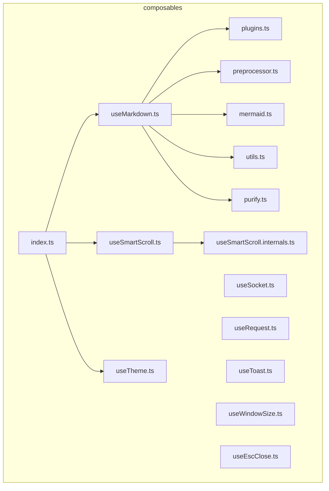
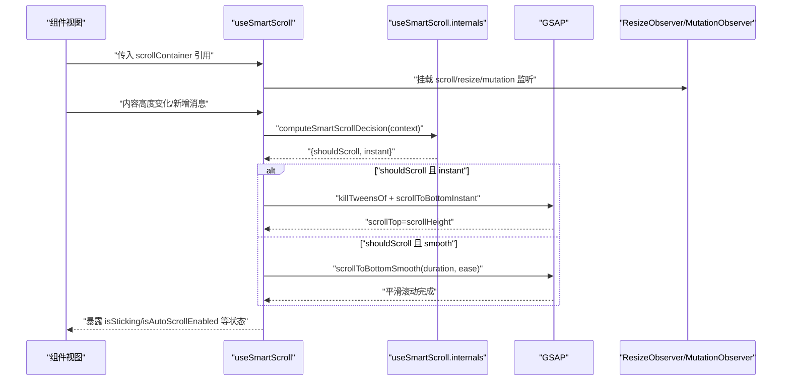
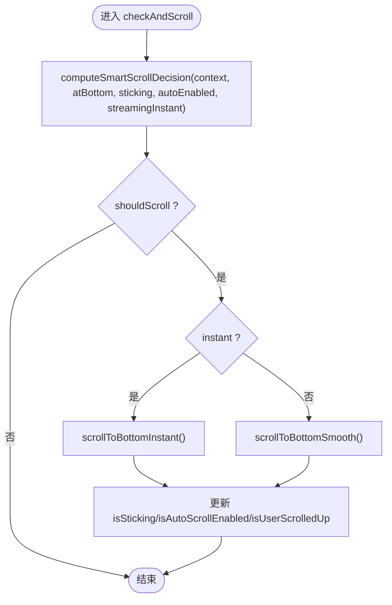
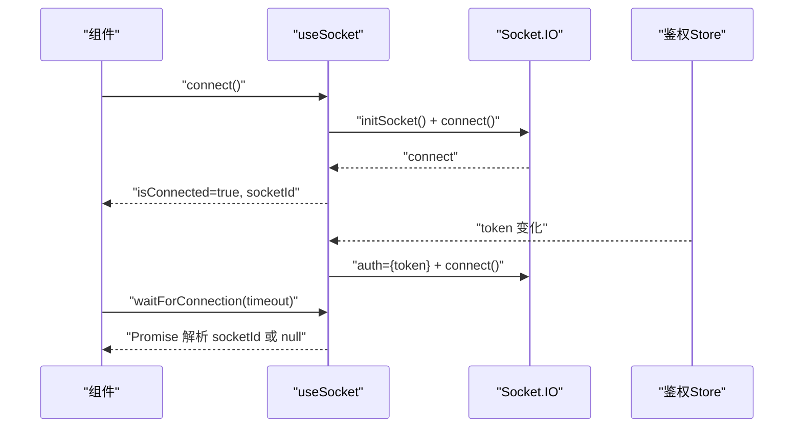
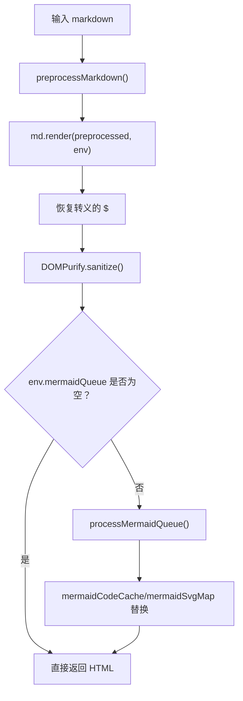
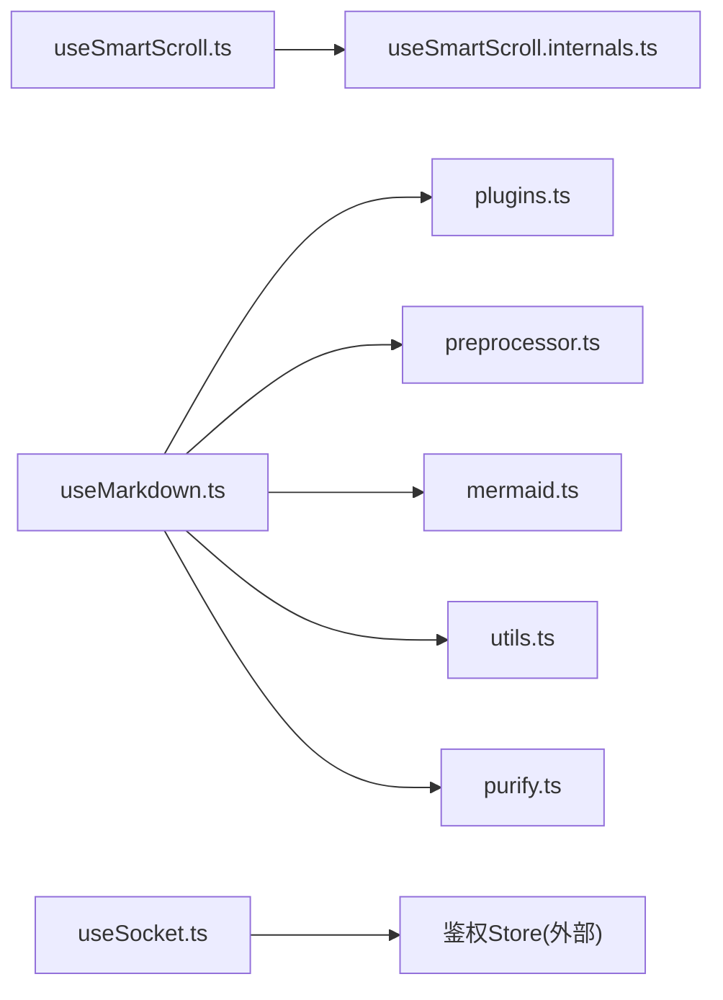

# 组合式函数

<cite>
**本文档引用的文件**
- [useSmartScroll.ts](file://apps/frontend/src/composables/useSmartScroll.ts)
- [useSmartScroll.internals.ts](file://apps/frontend/src/composables/useSmartScroll.internals.ts)
- [useSocket.ts](file://apps/frontend/src/composables/useSocket.ts)
- [useMarkdown.ts](file://apps/frontend/src/composables/useMarkdown.ts)
- [plugins.ts](file://apps/frontend/src/composables/markdown/plugins.ts)
- [preprocessor.ts](file://apps/frontend/src/composables/markdown/preprocessor.ts)
- [mermaid.ts](file://apps/frontend/src/composables/markdown/mermaid.ts)
- [utils.ts](file://apps/frontend/src/composables/markdown/utils.ts)
- [purify.ts](file://apps/frontend/src/composables/markdown/purify.ts)
- [useRequest.ts](file://apps/frontend/src/composables/useRequest.ts)
- [useTheme.ts](file://apps/frontend/src/composables/useTheme.ts)
- [useToast.ts](file://apps/frontend/src/composables/useToast.ts)
- [useWindowSize.ts](file://apps/frontend/src/composables/useWindowSize.ts)
- [useEscClose.ts](file://apps/frontend/src/composables/useEscClose.ts)
- [index.ts](file://apps/frontend/src/composables/index.ts)
- [markdown.css](file://apps/frontend/src/styles/markdown.css)
- [markdown-it-katex.d.ts](file://apps/frontend/src/types/markdown-it-katex.d.ts)
- [preprocessor.spec.ts](file://apps/frontend/tests/composables/markdown/preprocessor.spec.ts)
- [useMarkdown.spec.ts](file://apps/frontend/tests/composables/useMarkdown.spec.ts)
</cite>

## 目录
1. [简介](#简介)
2. [项目结构](#项目结构)
3. [核心组件](#核心组件)
4. [架构总览](#架构总览)
5. [详细组件分析](#详细组件分析)
6. [依赖分析](#依赖分析)
7. [性能考量](#性能考量)
8. [故障排查指南](#故障排查指南)
9. [结论](#结论)
10. [附录](#附录)

## 简介
本文件系统性梳理 Lumina Todo 前端应用中的组合式函数（composables），聚焦设计模式与复用策略，覆盖状态管理、副作用处理与逻辑抽象。重点解析三大核心组合式函数：useSmartScroll（智能滚动）、useSocket（实时通信）、useMarkdown（Markdown 渲染）。同时阐述各组合式函数的功能、参数、返回值、使用场景、依赖关系与组合使用模式，并给出错误处理、内存泄漏防护与测试策略建议。

**更新** 本次更新重点增强了 LaTeX 数学公式支持和任务列表渲染功能，新增标准 LaTeX 定界符支持（\(\)、\[\]、\begin{环境}\end{环境}），包括预处理器增强、KaTeX 渲染集成、样式更新和测试覆盖，以及 Lumina 任务列表处理系统。

## 项目结构
前端 composables 目录位于 apps/frontend/src/composables，按功能域组织：
- 通用工具类：useRequest、useWindowSize、useEscClose、useToast、useTheme
- 业务能力类：useSmartScroll、useSocket、useMarkdown
- Markdown 子模块：markdown/plugins、markdown/preprocessor、markdown/mermaid、markdown/utils、markdown/purify

**图示来源**
- [useSmartScroll.ts:1-442](file://apps/frontend/src/composables/useSmartScroll.ts#L1-L442)
- [useSmartScroll.internals.ts:1-109](file://apps/frontend/src/composables/useSmartScroll.internals.ts#L1-L109)
- [useSocket.ts:1-176](file://apps/frontend/src/composables/useSocket.ts#L1-L176)
- [useMarkdown.ts:1-108](file://apps/frontend/src/composables/useMarkdown.ts#L1-L108)
- [plugins.ts:1-232](file://apps/frontend/src/composables/markdown/plugins.ts#L1-L232)
- [preprocessor.ts:1-235](file://apps/frontend/src/composables/markdown/preprocessor.ts#L1-L235)
- [mermaid.ts:1-188](file://apps/frontend/src/composables/markdown/mermaid.ts#L1-L188)
- [utils.ts:1-60](file://apps/frontend/src/composables/markdown/utils.ts#L1-L60)
- [purify.ts:1-336](file://apps/frontend/src/composables/markdown/purify.ts#L1-L336)
- [index.ts:1-11](file://apps/frontend/src/composables/index.ts#L1-L11)

**章节来源**
- [index.ts:1-11](file://apps/frontend/src/composables/index.ts#L1-L11)

## 核心组件
本节概述关键组合式函数的能力边界与典型用法，便于快速定位与复用。

- useSmartScroll：提供智能滚动决策、平滑/瞬时滚动、流式更新优化、用户交互感知与容器尺寸/内容变化监听，适合消息列表、日志面板、聊天界面等。
- useSocket：封装 Socket.IO 客户端生命周期、认证态联动、重连策略与连接等待，适合实时事件订阅与房间加入。
- useMarkdown：集成预处理、插件渲染、Mermaid 图表异步渲染与缓存、DOMPurify 清洗，适合富文本展示与 AI 输出渲染。
- useRequest：统一封装请求执行、加载与错误状态，适合 API 调用的通用逻辑抽取。
- useTheme：主题与色彩管理，支持随机色与持久化存储。
- useToast：全局通知队列与交互控制。
- useWindowSize/useIsMobile：响应式窗口尺寸与移动端判断。
- useEscClose：ESC 关闭堆叠栈，避免多层弹窗冲突。

**章节来源**
- [useSmartScroll.ts:33-441](file://apps/frontend/src/composables/useSmartScroll.ts#L33-L441)
- [useSocket.ts:22-175](file://apps/frontend/src/composables/useSocket.ts#L22-L175)
- [useMarkdown.ts:14-107](file://apps/frontend/src/composables/useMarkdown.ts#L14-L107)
- [useRequest.ts:17-44](file://apps/frontend/src/composables/useRequest.ts#L17-L44)
- [useTheme.ts:188-247](file://apps/frontend/src/composables/useTheme.ts#L188-L247)
- [useToast.ts:17-86](file://apps/frontend/src/composables/useToast.ts#L17-L86)
- [useWindowSize.ts:6-44](file://apps/frontend/src/composables/useWindowSize.ts#L6-L44)
- [useEscClose.ts:34-65](file://apps/frontend/src/composables/useEscClose.ts#L34-L65)

## 架构总览
以下序列图展示 useSmartScroll 在典型消息流中的工作流，体现"状态-事件-决策-执行"的闭环。

**图示来源**
- [useSmartScroll.ts:164-195](file://apps/frontend/src/composables/useSmartScroll.ts#L164-L195)
- [useSmartScroll.internals.ts:28-64](file://apps/frontend/src/composables/useSmartScroll.internals.ts#L28-L64)

## 详细组件分析

### useSmartScroll：智能滚动
- 设计要点
  - 状态分层：粘附底部、自动滚动、用户上滑、可滚动、流式模式等。
  - 决策引擎：根据上下文（新增消息、内容变更、尺寸变化、手动、流式）与当前状态计算是否滚动及滚动方式。
  - 性能优化：RAF 批处理、RAF 节流、MutationObserver 监听高度变化、ResizeObserver 监听容器尺寸、GSAP 平滑滚动。
  - 交互感知：区分用户滚动与程序化滚动，避免打断用户阅读。
- 参数与返回
  - 输入选项：scrollContainer、stickToBottom、autoScroll、scrollBehavior、atBottomThreshold、streamingInstant、userScrollSensitivity、watchResize。
  - 返回状态：isSticking、isAutoScrollEnabled、isUserScrolledUp、isScrollable、isStreamingMode。
  - 返回方法：scrollToBottom、checkAndScroll、streamingScroll、setStreamingMode、enableAutoScroll、disableAutoScroll、isAtBottom、getScrollSnapshot。
- 使用场景
  - 聊天/消息列表：自动贴底、流式增量渲染、用户上滑暂停自动滚动。
  - 日志面板：内容增长时自动滚动，窗口尺寸变化后保持贴底。
- 关键算法与流程
  - 智能滚动决策：依据上下文与状态选择瞬时或平滑滚动。
  - 用户滚动检测：通过 delta 与阈值判断是否为"向上意图"，中断自动滚动。
  - 高度变化监听：使用 requestAnimationFrame + MutationObserver，避免频繁重排。
  - 尺寸变化处理：ResizeObserver + requestAnimationFrame，必要时强制贴底。

**图示来源**
- [useSmartScroll.ts:182-195](file://apps/frontend/src/composables/useSmartScroll.ts#L182-L195)
- [useSmartScroll.internals.ts:28-64](file://apps/frontend/src/composables/useSmartScroll.internals.ts#L28-L64)

**章节来源**
- [useSmartScroll.ts:14-441](file://apps/frontend/src/composables/useSmartScroll.ts#L14-L441)
- [useSmartScroll.internals.ts:1-109](file://apps/frontend/src/composables/useSmartScroll.internals.ts#L1-L109)

### useSocket：实时通信
- 设计要点
  - 单例管理：全局 socket 实例与连接状态，避免重复连接。
  - 认证联动：监听鉴权 store，token 变化时自动重连并注入新 token。
  - 连接等待：提供超时 Promise，便于业务侧等待连接就绪。
  - 错误处理：区分认证错误与网络错误，必要时刷新 token 并重连。
- 参数与返回
  - 返回：socket、socketId、isConnected、connect、disconnect、waitForConnection。
- 使用场景
  - 订阅用户私有房间事件、跨页面共享连接、等待连接稳定后再发送业务消息。
- 关键流程
  - 初始化：设置 transports、reconnection、path、auth。
  - 连接事件：connect/diconnect/connect_error。
  - 认证错误分支：刷新 token 后重新连接。

**图示来源**
- [useSocket.ts:22-175](file://apps/frontend/src/composables/useSocket.ts#L22-L175)

**章节来源**
- [useSocket.ts:1-176](file://apps/frontend/src/composables/useSocket.ts#L1-L176)

### useMarkdown：Markdown 渲染管线
- 设计要点
  - 预处理：保护代码块、修复加粗/斜体空格、规范化块级公式。
  - 插件渲染：KaTeX 数学公式、Highlight.js 代码高亮、自定义 fence/链接/表格渲染。
  - Mermaid 图表：异步队列渲染、缓存命中、主题感知、DOMPurify 清洗。
  - 安全与性能：DOMPurify 配置、缓存键（主题+哈希）、RAF/批处理优化。
  - **任务列表渲染**：Lumina 任务列表处理系统，支持复选框标记和样式。
- 参数与返回
  - 输入：markdown 文本、isStreaming（流式渲染）。
  - 返回：isRendering、renderMarkdown、getMermaidSvgMap、clearMermaidCache。
- 使用场景
  - AI 输出展示、文档渲染、富文本编辑器预览、任务管理界面。
- 渲染流程
  - 预处理 → 渲染 → 恢复美元符号 → DOMPurify 清洗 → Mermaid 队列处理（缓存命中优先）→ 返回 HTML。

**更新** 新增标准 LaTeX 定界符支持，包括：
- \(\) 内联公式自动转换为 $...$ 格式
- \[...\] 块级公式自动转换为 $$...$$ 格式  
- 裸露的 LaTeX 环境块（如 \begin{align}...\end{align}）自动转换为块级公式
- 支持多行内联公式自动提升为块级公式
- 代码块内的 LaTeX 定界符保持原样不被转换

**更新** 新增 Lumina 任务列表渲染功能：
- 支持标准 Markdown 任务列表语法：[ ] 未完成，[x] 已完成
- 自动移除列表项中的任务标记，仅保留内容
- 生成带有复选框样式的任务列表项
- 支持任务列表项的选中状态样式

**图示来源**
- [useMarkdown.ts:27-96](file://apps/frontend/src/composables/useMarkdown.ts#L27-L96)
- [plugins.ts:60-106](file://apps/frontend/src/composables/markdown/plugins.ts#L60-L106)
- [mermaid.ts:137-187](file://apps/frontend/src/composables/markdown/mermaid.ts#L137-L187)

**章节来源**
- [useMarkdown.ts:1-108](file://apps/frontend/src/composables/useMarkdown.ts#L1-L108)
- [plugins.ts:1-232](file://apps/frontend/src/composables/markdown/plugins.ts#L1-L232)
- [preprocessor.ts:1-235](file://apps/frontend/src/composables/markdown/preprocessor.ts#L1-L235)
- [mermaid.ts:1-188](file://apps/frontend/src/composables/markdown/mermaid.ts#L1-L188)
- [utils.ts:1-60](file://apps/frontend/src/composables/markdown/utils.ts#L1-L60)
- [purify.ts:1-336](file://apps/frontend/src/composables/markdown/purify.ts#L1-L336)

### useRequest：请求状态封装
- 设计要点
  - 统一 loading/error/data 状态，集中处理异常与国际化错误文案。
  - 提供 execute 方法触发请求，避免在模板中直接调用异步函数。
- 参数与返回
  - 输入：requestFn（返回 Promise 的函数）。
  - 返回：data、loading、error、execute。
- 使用场景
  - 登录、列表加载、详情获取等通用请求封装。

**章节来源**
- [useRequest.ts:17-44](file://apps/frontend/src/composables/useRequest.ts#L17-L44)

### useTheme：主题与色彩
- 设计要点
  - 基于 @vueuse/core 的 colorMode 与本地存储，支持明暗主题与用户主色。
  - 随机主题色轮换，定时刷新，避免频繁打扰。
  - HSL↔RGB 转换生成 hover/dark 等变体 CSS 变量。
- 参数与返回
  - 返回：theme、setTheme、themeColor、setThemeColor、resetThemeColor。
- 使用场景
  - 全局主题切换、个性化主色设置。

**章节来源**
- [useTheme.ts:188-247](file://apps/frontend/src/composables/useTheme.ts#L188-L247)

### useToast：全局通知
- 设计要点
  - 基于数组的全局 toast 队列，支持定时消失、暂停/恢复、动作按钮。
- 参数与返回
  - 返回：toasts、addToast、removeToast、pauseToast、resumeToast、success/error/info/warning 快捷方法。
- 使用场景
  - 错误提示、成功反馈、操作确认。

**章节来源**
- [useToast.ts:17-86](file://apps/frontend/src/composables/useToast.ts#L17-L86)

### useWindowSize/useIsMobile：窗口尺寸
- 设计要点
  - 响应式宽高，支持组件与非组件环境；移动端断点基于宽度。
- 参数与返回
  - 返回：width、height；isMobile 基于 width 计算。
- 使用场景
  - 布局自适应、移动端特性开关。

**章节来源**
- [useWindowSize.ts:6-44](file://apps/frontend/src/composables/useWindowSize.ts#L6-L44)

### useEscClose：ESC 关闭堆叠
- 设计要点
  - 全局键盘监听，维护回调栈，仅顶层组件响应 ESC。
- 参数与返回
  - 输入：isOpen（Ref<boolean>）、onClose（回调）。
  - 返回：无（副作用：注册/注销监听）。
- 使用场景
  - 多层抽屉/模态框的 ESC 关闭一致性。

**章节来源**
- [useEscClose.ts:34-65](file://apps/frontend/src/composables/useEscClose.ts#L34-L65)

## 依赖分析
- 组件耦合
  - useSmartScroll 依赖 useSmartScroll.internals 提供的决策与批处理工具。
  - useMarkdown 依赖 plugins、preprocessor、mermaid、utils、purify 形成完整渲染链。
  - useSocket 依赖鉴权 store，实现 token 变化自动重连。
- 外部依赖
  - GSAP（useSmartScroll）、Socket.IO（useSocket）、DOMPurify（useMarkdown）、Mermaid（useMarkdown）、@vueuse/core（useTheme、useWindowSize）、KaTeX（LaTeX 渲染）、markdown-it-katex（LaTeX 插件）。
- 循环依赖
  - 未见循环依赖迹象；各模块职责清晰，通过导出接口解耦。

**图示来源**
- [useSmartScroll.ts:1-12](file://apps/frontend/src/composables/useSmartScroll.ts#L1-L12)
- [useSmartScroll.internals.ts:1-12](file://apps/frontend/src/composables/useSmartScroll.internals.ts#L1-L12)
- [useMarkdown.ts:1-9](file://apps/frontend/src/composables/useMarkdown.ts#L1-L9)
- [plugins.ts:1-9](file://apps/frontend/src/composables/markdown/plugins.ts#L1-L9)
- [preprocessor.ts:1-8](file://apps/frontend/src/composables/markdown/preprocessor.ts#L1-L8)
- [mermaid.ts:1-3](file://apps/frontend/src/composables/markdown/mermaid.ts#L1-L3)
- [utils.ts:1-3](file://apps/frontend/src/composables/markdown/utils.ts#L1-L3)
- [purify.ts:1-3](file://apps/frontend/src/composables/markdown/purify.ts#L1-L3)
- [useSocket.ts:1-3](file://apps/frontend/src/composables/useSocket.ts#L1-L3)

**章节来源**
- [useSmartScroll.ts:1-12](file://apps/frontend/src/composables/useSmartScroll.ts#L1-L12)
- [useMarkdown.ts:1-9](file://apps/frontend/src/composables/useMarkdown.ts#L1-L9)
- [useSocket.ts:1-3](file://apps/frontend/src/composables/useSocket.ts#L1-L3)

## 性能考量
- useSmartScroll
  - RAF 批处理与节流：降低滚动事件频率，避免主线程阻塞。
  - MutationObserver + requestAnimationFrame：在内容高度变化时延迟处理，减少重排。
  - GSAP 平滑滚动：短时动画提升体验，配合 killTweensOf 防止叠加。
  - ResizeObserver：仅在启用时实例化，避免不必要的开销。
- useMarkdown
  - Mermaid 缓存：主题+哈希键缓存 SVG，命中即替换 DOM，避免重复渲染。
  - DOMPurify 配置：严格白名单，兼顾安全与性能。
  - 流式渲染：仅在代码块闭合时渲染 Mermaid，减少中间态闪烁。
  - **LaTeX 预处理优化**：使用高效的正则表达式匹配和替换，避免不必要的字符串处理。
  - **任务列表渲染优化**：通过自定义规则在解析阶段处理任务列表，减少运行时处理开销。
- useSocket
  - transports 优先 websocket，减少 polling 导致的 400 错误。
  - 重连退避：指数退避上限，平衡稳定性与资源消耗。
- useTheme
  - 随机色定时切换：30-60 分钟间隔，降低对专注的影响。
- useWindowSize
  - 非组件环境条件注册监听，避免测试/SSR 场景的副作用。

## 故障排查指南
- useSmartScroll
  - 症状：滚动卡顿或跳动
    - 排查：确认是否频繁触发 checkAndScroll；检查 isProgrammaticScroll 标记是否正确清理。
  - 症状：尺寸变化后未贴底
    - 排查：确认 watchResize 开启且 ResizeObserver 正常；handleResize 中 requestAnimationFrame 调用。
- useSocket
  - 症状：连接失败或反复断开
    - 排查：connect_error 日志与错误类型；认证错误时是否触发 token 刷新与重连。
  - 症状：waitForConnection 一直 pending
    - 排查：超时时间、connect 是否被调用、事件监听是否正确清理。
- useMarkdown
  - 症状：Mermaid 图表渲染失败
    - 排查：processMermaidQueue 异常捕获；缓存键是否包含主题；DOMPurify 清洗后结构是否完整。
  - 症状：XSS 风险或脚本注入
    - 排查：PURIFY_CONFIG 与 MERMAID_PURIFY_CONFIG 配置项；是否遗漏允许标签/属性。
  - **症状：LaTeX 公式显示异常**
    - **排查**：检查预处理器是否正确识别标准 LaTeX 定界符；确认 KaTeX 渲染配置；验证数学环境是否在允许列表中。
  - **症状：任务列表渲染异常**
    - **排查**：检查任务列表标记模式是否正确；确认任务列表项的样式类是否正确应用；验证任务标记是否被正确移除。
- useRequest
  - 症状：错误文案不友好
    - 排查：国际化键是否存在；错误捕获分支是否设置 error。
- useTheme/useToast/useWindowSize/useEscClose
  - 症状：主题不生效/颜色异常
    - 排查：CSS 变量是否写入根元素；随机色定时器是否被清理。
  - 症状：通知不消失/重复
    - 排查：定时器清理与恢复逻辑；去重与唯一 id 生成。
  - 症状：ESC 多层冲突
    - 排查：回调栈是否正确入栈/出栈；全局监听是否仅注册一次。

**章节来源**
- [useSmartScroll.ts:347-370](file://apps/frontend/src/composables/useSmartScroll.ts#L347-L370)
- [useSocket.ts:60-93](file://apps/frontend/src/composables/useSocket.ts#L60-L93)
- [useMarkdown.ts:90-95](file://apps/frontend/src/composables/useMarkdown.ts#L90-L95)
- [useRequest.ts:24-36](file://apps/frontend/src/composables/useRequest.ts#L24-L36)
- [useTheme.ts:200-226](file://apps/frontend/src/composables/useTheme.ts#L200-L226)
- [useToast.ts:18-26](file://apps/frontend/src/composables/useToast.ts#L18-L26)
- [useWindowSize.ts:18-31](file://apps/frontend/src/composables/useWindowSize.ts#L18-L31)
- [useEscClose.ts:34-65](file://apps/frontend/src/composables/useEscClose.ts#L34-L65)

## 结论
本项目通过组合式函数实现了高内聚、低耦合的状态与副作用管理，核心能力围绕"智能滚动、实时通信、富文本渲染"展开。通过 RAf 批处理、缓存与安全清洗等手段，在保证用户体验的同时兼顾性能与安全。**最新的 LaTeX 数学公式支持增强和任务列表渲染功能显著提升了公式的兼容性和易用性，通过智能预处理和标准化转换，使得用户可以自然地使用标准 LaTeX 语法而无需担心渲染问题。任务列表功能提供了直观的任务管理体验，支持复选框标记和样式化显示。** 建议在业务扩展中遵循现有模式：将状态与副作用收敛至组合式函数，对外暴露明确的输入/输出契约，并在测试中覆盖关键分支与边界条件。

## 附录

### 组合式函数间组合使用模式
- useSmartScroll + useMarkdown
  - 在渲染完成后调用 checkAndScroll，确保内容变化后自动贴底；流式渲染时 setStreamingMode(true) 以瞬时滚动。
- useSocket + useRequest
  - 在连接就绪后执行业务请求；若连接失败，结合 useToast 提示用户重试。
- useTheme + useMarkdown
  - 主题切换时清空 Mermaid 缓存，避免主题不一致的图表残留。
- useWindowSize + useSmartScroll
  - 窗口尺寸变化后，若处于粘附状态，触发贴底滚动以适配新布局。

**章节来源**
- [useSmartScroll.ts:377-400](file://apps/frontend/src/composables/useSmartScroll.ts#L377-L400)
- [useMarkdown.ts:18-22](file://apps/frontend/src/composables/useMarkdown.ts#L18-L22)
- [useSocket.ts:116-146](file://apps/frontend/src/composables/useSocket.ts#L116-L146)
- [useWindowSize.ts:18-31](file://apps/frontend/src/composables/useWindowSize.ts#L18-L31)

### LaTeX 数学公式支持增强详解

**更新** 本节详细介绍新增的 LaTeX 数学公式支持功能：

#### 标准 LaTeX 定界符支持
- **内联公式**：\(\) 自动转换为 $...$ 格式，支持单行和多行内联公式
- **块级公式**：\[...\] 自动转换为 $$...$$ 格式，确保正确的块级渲染
- **裸露环境**：\begin{environment}...\end{environment} 自动转换为块级公式，支持多种数学环境

#### 预处理器增强功能
- **智能识别**：使用正则表达式精确匹配 LaTeX 定界符，避免误判
- **上下文感知**：检查公式周围的上下文，确保只转换有效的数学表达式
- **代码块保护**：在代码块内的 LaTeX 定界符保持原样，不被转换
- **多行处理**：自动检测多行内联公式并转换为块级公式

#### 渲染器自定义
- **KaTeX 集成**：通过 markdown-it-katex 插件支持标准 LaTeX 语法
- **样式定制**：自定义数学公式的渲染样式，支持内联和块级两种模式
- **错误处理**：优雅处理渲染错误，提供友好的错误信息

#### 样式更新
- **数学公式容器**：.math-block 类提供块级公式的样式支持
- **内联公式样式**：.math-inline 类确保内联公式的正确显示
- **响应式设计**：支持不同屏幕尺寸下的数学公式显示

#### 测试覆盖
- **单元测试**：完整的测试套件覆盖各种 LaTeX 定界符场景
- **集成测试**：验证预处理、渲染和样式的完整流程
- **边界测试**：测试边缘情况和错误处理

**章节来源**
- [preprocessor.ts:81-113](file://apps/frontend/src/composables/markdown/preprocessor.ts#L81-L113)
- [plugins.ts:79-93](file://apps/frontend/src/composables/markdown/plugins.ts#L79-L93)
- [markdown.css:111-161](file://apps/frontend/src/styles/markdown.css#L111-L161)
- [preprocessor.spec.ts:40-89](file://apps/frontend/tests/composables/markdown/preprocessor.spec.ts#L40-L89)
- [useMarkdown.spec.ts:41-64](file://apps/frontend/tests/composables/useMarkdown.spec.ts#L41-L64)

### 任务列表渲染功能详解

**更新** 本节详细介绍新增的 Lumina 任务列表渲染功能：

#### 任务列表语法支持
- **未完成任务**：使用 [ ] 语法表示未完成的任务项
- **已完成任务**：使用 [x] 或 [X] 语法表示已完成的任务项
- **任务内容**：支持在任务标记后添加任意内容，包括格式化文本

#### 渲染机制
- **解析阶段处理**：通过自定义的 Lumina 任务列表规则在 Markdown 解析阶段处理
- **标记移除**：自动移除任务列表项中的 [ ] 或 [x] 标记，仅保留内容
- **样式应用**：为任务列表项添加 task-list-item 类，支持复选框样式

#### 样式设计
- **复选框标记**：使用 task-list-marker 类显示复选框图标
- **选中状态**：已完成的任务项添加 task-list-item-checked 类
- **样式定制**：支持明暗主题下的不同样式表现

#### 使用场景
- **任务管理**：支持待办事项列表的创建和管理
- **项目规划**：用于项目进度跟踪和里程碑管理
- **学习计划**：支持学习任务的完成状态跟踪

#### 测试覆盖
- **功能测试**：验证任务列表的正确渲染和样式应用
- **状态测试**：测试未完成和已完成任务的不同显示效果
- **格式测试**：验证任务内容中的格式化文本正确处理

**章节来源**
- [plugins.ts:58-101](file://apps/frontend/src/composables/markdown/plugins.ts#L58-L101)
- [markdown.css:292-338](file://apps/frontend/src/styles/markdown.css#L292-L338)
- [useMarkdown.spec.ts:109-125](file://apps/frontend/tests/composables/useMarkdown.spec.ts#L109-L125)

### 最佳实践清单
- 状态收敛：将可观察状态与副作用封装在组合式函数内部，通过 ref/computed 暴露。
- 生命周期：在 onMounted/onUnmounted 中注册/清理监听器，避免内存泄漏。
- 性能优先：使用 RAF/节流/批处理、缓存与最小化 DOM 操作。
- 安全第一：对用户输入进行 DOMPurify 清洗，限制允许标签与属性。
- 错误处理：区分业务错误与系统错误，提供可读的错误文案与回退策略。
- 可测试性：将副作用隔离，提供可注入的依赖（如 store、服务），便于单元测试。
- **LaTeX 公式使用**：推荐使用标准 LaTeX 语法，系统会自动处理转换和优化。
- **任务列表使用**：使用标准 Markdown 语法创建任务列表，支持复选框标记和样式化显示。