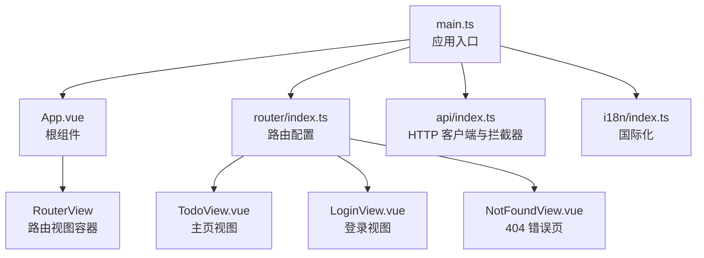
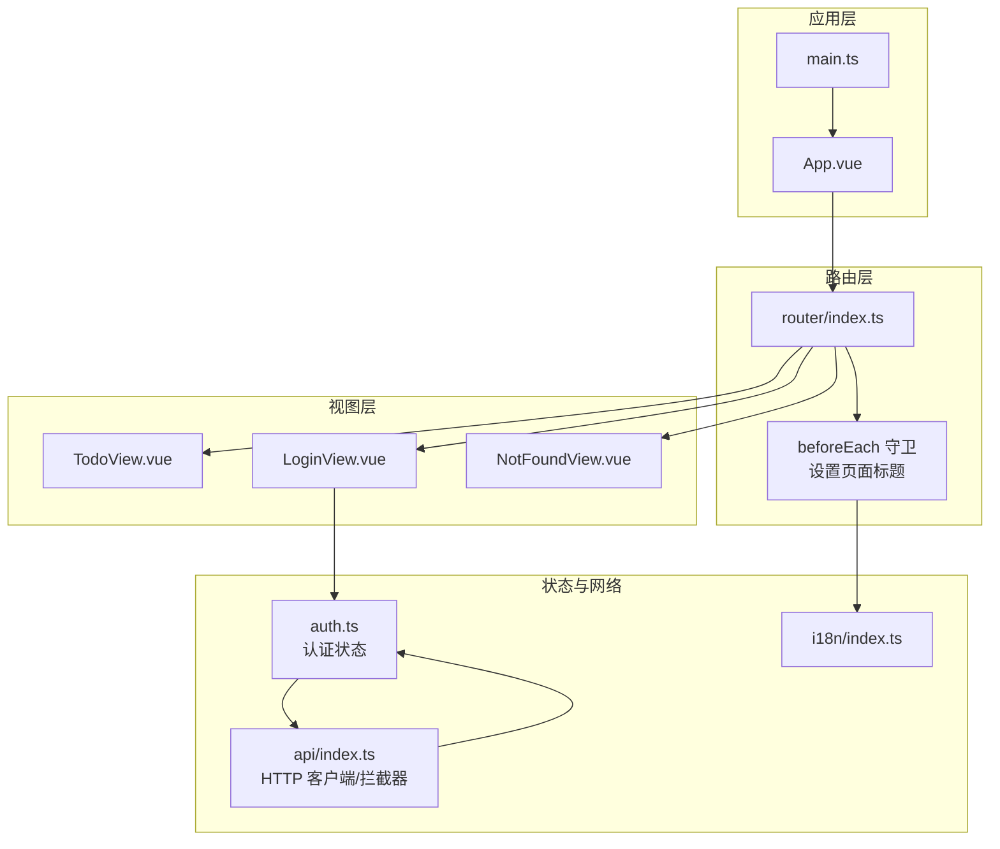
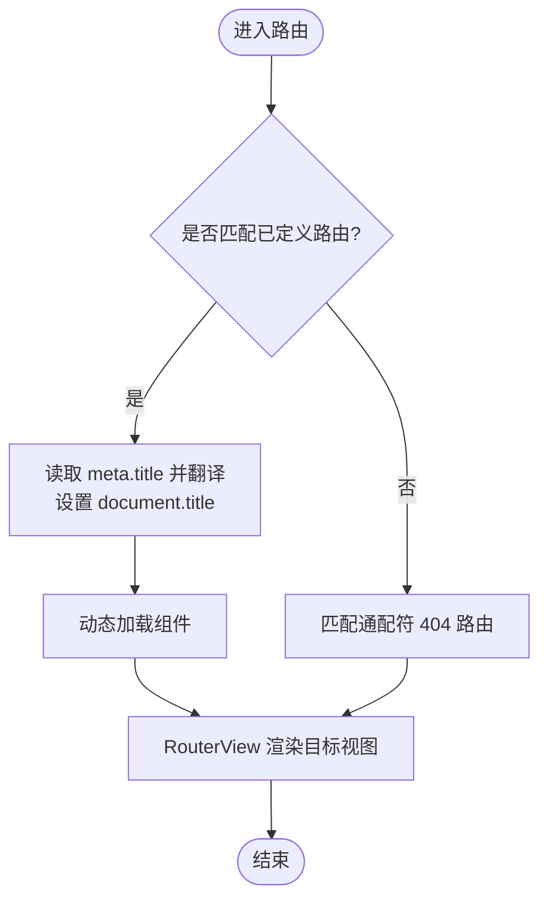
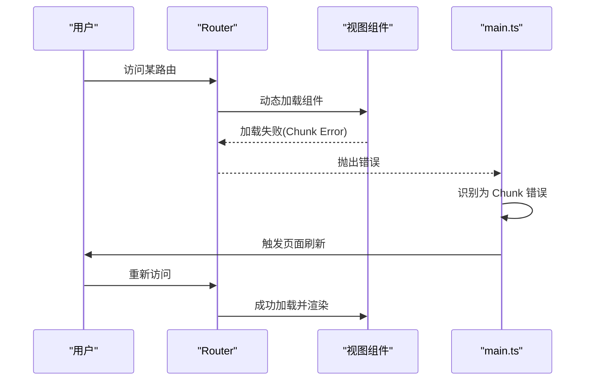
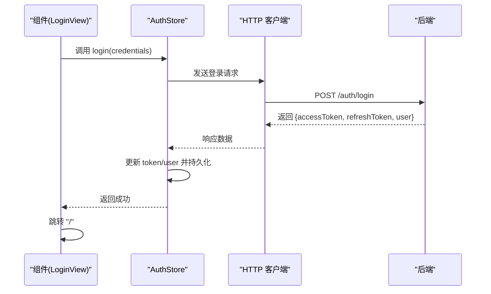
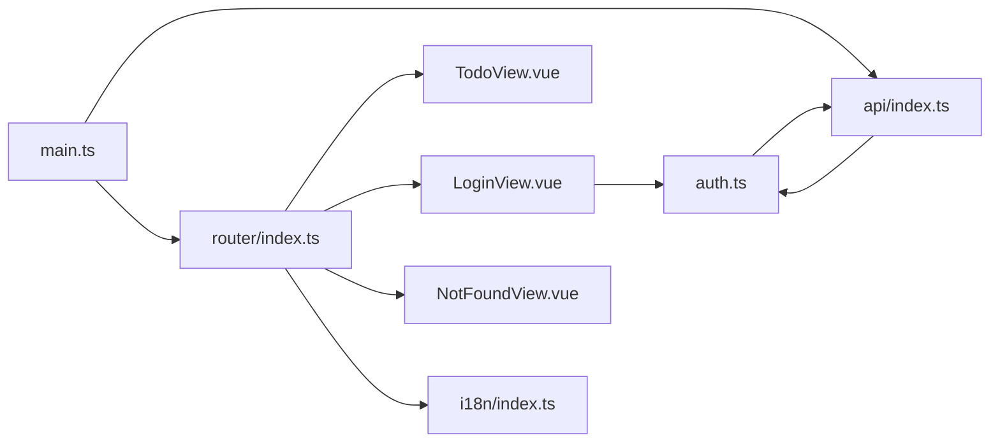

# 路由系统

<cite>
**本文引用的文件**   
- [apps/frontend/src/router/index.ts](file://apps/frontend/src/router/index.ts)
- [apps/frontend/src/views/error/NotFoundView.vue](file://apps/frontend/src/views/error/NotFoundView.vue)
- [apps/frontend/src/main.ts](file://apps/frontend/src/main.ts)
- [apps/frontend/src/App.vue](file://apps/frontend/src/App.vue)
- [apps/frontend/src/features/auth/views/LoginView.vue](file://apps/frontend/src/features/auth/views/LoginView.vue)
- [apps/frontend/src/features/auth/stores/auth.ts](file://apps/frontend/src/features/auth/stores/auth.ts)
- [apps/frontend/src/api/index.ts](file://apps/frontend/src/api/index.ts)
- [apps/frontend/src/i18n/index.ts](file://apps/frontend/src/i18n/index.ts)
- [apps/frontend/tests/router/index.spec.ts](file://apps/frontend/tests/router/index.spec.ts)
- [apps/frontend/src/features/todo/TodoView.vue](file://apps/frontend/src/features/todo/TodoView.vue)
</cite>

## 目录
1. [简介](#简介)
2. [项目结构](#项目结构)
3. [核心组件](#核心组件)
4. [架构总览](#架构总览)
5. [详细组件分析](#详细组件分析)
6. [依赖关系分析](#依赖关系分析)
7. [性能考虑](#性能考虑)
8. [故障排查指南](#故障排查指南)
9. [结论](#结论)
10. [附录](#附录)

## 简介
本文件系统性梳理 Lumina Todo 前端的路由体系，涵盖 Vue Router 的配置与路由守卫、页面导航实现（含动态路由、嵌套路由与懒加载）、路由权限控制与认证保护、路由参数与查询字符串处理、错误页面与回退策略、性能优化与预加载策略，以及 SPA 导航体验优化建议。文档面向技术与非技术读者，既提供高层概览，也给出代码级定位与可视化图表。

## 项目结构
Lumina Todo 的前端路由位于应用入口目录下的 router 子模块，配合 Pinia 状态管理、Axios 拦截器、i18n 标题国际化、以及错误页面组件共同构成完整的导航与安全体系。应用通过 RouterView 承载视图，主应用在 App.vue 中挂载 RouterView，并在 main.ts 中注入路由与全局错误处理。

**图表来源**
- [apps/frontend/src/main.ts:1-138](file://apps/frontend/src/main.ts#L1-L138)
- [apps/frontend/src/App.vue:1-77](file://apps/frontend/src/App.vue#L1-L77)
- [apps/frontend/src/router/index.ts:1-73](file://apps/frontend/src/router/index.ts#L1-L73)
- [apps/frontend/src/features/todo/TodoView.vue:1-466](file://apps/frontend/src/features/todo/TodoView.vue#L1-L466)
- [apps/frontend/src/features/auth/views/LoginView.vue:1-97](file://apps/frontend/src/features/auth/views/LoginView.vue#L1-L97)
- [apps/frontend/src/views/error/NotFoundView.vue:1-21](file://apps/frontend/src/views/error/NotFoundView.vue#L1-L21)
- [apps/frontend/src/api/index.ts:1-199](file://apps/frontend/src/api/index.ts#L1-L199)
- [apps/frontend/src/i18n/index.ts:1-37](file://apps/frontend/src/i18n/index.ts#L1-L37)

**章节来源**
- [apps/frontend/src/router/index.ts:1-73](file://apps/frontend/src/router/index.ts#L1-L73)
- [apps/frontend/src/main.ts:1-138](file://apps/frontend/src/main.ts#L1-L138)
- [apps/frontend/src/App.vue:1-77](file://apps/frontend/src/App.vue#L1-L77)

## 核心组件
- 路由配置与导航
  - 路由历史模式根据运行环境选择 HTML5 History 或 Hash 模式，支持 Wails 桌面端场景。
  - 定义了主页、登录、注册、忘记密码、重置密码、MCP 设置等页面路由。
  - 使用路由懒加载按需加载组件，提升首屏性能。
  - 通过 beforeEach 守卫统一设置页面标题，结合 i18n 实现多语言标题。
  - 通配符路由指向 404 页面，保证未匹配路径的安全回退。
- 错误与回退
  - 404 页面提供“返回首页”的友好引导。
  - 应用入口对动态模块加载失败进行兜底刷新，避免版本更新导致的 Chunk 加载异常。
- 权限与认证
  - 认证状态通过 Pinia 管理，持久化存储 token 与用户信息。
  - Axios 请求拦截器自动附加 Bearer Token；响应拦截器处理 401 并触发令牌刷新。
  - 登录成功后跳转主页，失败时保留错误信息并在表单层展示字段级错误。
- 性能与体验
  - 路由懒加载与组件异步加载相结合，配合 KeepAlive 缓存常用视图。
  - RouterView 内部的过渡动画与 GSAP 动画优化页面切换体验。
  - 全局错误处理器过滤常见无害错误，集中处理动态模块加载异常。

**章节来源**
- [apps/frontend/src/router/index.ts:1-73](file://apps/frontend/src/router/index.ts#L1-L73)
- [apps/frontend/src/views/error/NotFoundView.vue:1-21](file://apps/frontend/src/views/error/NotFoundView.vue#L1-L21)
- [apps/frontend/src/main.ts:56-114](file://apps/frontend/src/main.ts#L56-L114)
- [apps/frontend/src/features/auth/stores/auth.ts:1-391](file://apps/frontend/src/features/auth/stores/auth.ts#L1-L391)
- [apps/frontend/src/api/index.ts:1-199](file://apps/frontend/src/api/index.ts#L1-L199)
- [apps/frontend/src/features/auth/views/LoginView.vue:1-97](file://apps/frontend/src/features/auth/views/LoginView.vue#L1-L97)
- [apps/frontend/src/features/todo/TodoView.vue:1-466](file://apps/frontend/src/features/todo/TodoView.vue#L1-L466)

## 架构总览
下图展示了路由系统在应用中的整体交互：路由配置、守卫、视图渲染、状态管理与 HTTP 客户端之间的协作关系。

**图表来源**
- [apps/frontend/src/main.ts:1-138](file://apps/frontend/src/main.ts#L1-L138)
- [apps/frontend/src/App.vue:1-77](file://apps/frontend/src/App.vue#L1-L77)
- [apps/frontend/src/router/index.ts:1-73](file://apps/frontend/src/router/index.ts#L1-L73)
- [apps/frontend/src/features/todo/TodoView.vue:1-466](file://apps/frontend/src/features/todo/TodoView.vue#L1-L466)
- [apps/frontend/src/features/auth/views/LoginView.vue:1-97](file://apps/frontend/src/features/auth/views/LoginView.vue#L1-L97)
- [apps/frontend/src/views/error/NotFoundView.vue:1-21](file://apps/frontend/src/views/error/NotFoundView.vue#L1-L21)
- [apps/frontend/src/features/auth/stores/auth.ts:1-391](file://apps/frontend/src/features/auth/stores/auth.ts#L1-L391)
- [apps/frontend/src/api/index.ts:1-199](file://apps/frontend/src/api/index.ts#L1-L199)
- [apps/frontend/src/i18n/index.ts:1-37](file://apps/frontend/src/i18n/index.ts#L1-L37)

## 详细组件分析

### 路由配置与导航
- 历史模式选择
  - 在 Wails 环境下使用 Hash 模式，避免桌面端静态资源部署带来的路径问题；其他环境使用 History 模式，利于 SEO 与分享。
- 路由定义
  - 主页路由指向 TodoView，采用懒加载。
  - 认证相关路由（登录、注册、忘记密码、重置密码）均懒加载并设置 meta.title 供守卫使用。
  - MCP 设置路由独立入口。
  - 通配符路由指向 404 页面，确保所有非法路径都有明确回退。
- 路由守卫
  - beforeEach 读取 meta.title，结合 i18n 翻译生成页面标题；若无特定标题则使用完整应用名，保持一致性。
- 路由懒加载
  - 所有页面组件通过动态 import 实现懒加载，减少初始包体与首屏时间。

**图表来源**
- [apps/frontend/src/router/index.ts:56-70](file://apps/frontend/src/router/index.ts#L56-L70)
- [apps/frontend/src/i18n/index.ts:1-37](file://apps/frontend/src/i18n/index.ts#L1-L37)

**章节来源**
- [apps/frontend/src/router/index.ts:1-73](file://apps/frontend/src/router/index.ts#L1-L73)
- [apps/frontend/tests/router/index.spec.ts:1-55](file://apps/frontend/tests/router/index.spec.ts#L1-L55)

### 错误页面与回退策略
- 404 页面
  - 提供清晰的标题、描述与“返回首页”链接，便于用户快速回到可用页面。
- 动态模块加载异常兜底
  - 应用入口捕获动态导入失败错误，识别 Chunk 加载异常后自动刷新页面；限制刷新频率避免死循环。
  - 同时忽略常见的 ResizeObserver 相关无害错误，降低噪音。

**图表来源**
- [apps/frontend/src/main.ts:56-114](file://apps/frontend/src/main.ts#L56-L114)
- [apps/frontend/src/router/index.ts:11-54](file://apps/frontend/src/router/index.ts#L11-L54)

**章节来源**
- [apps/frontend/src/views/error/NotFoundView.vue:1-21](file://apps/frontend/src/views/error/NotFoundView.vue#L1-L21)
- [apps/frontend/src/main.ts:56-114](file://apps/frontend/src/main.ts#L56-L114)

### 权限控制与认证保护
- 认证状态管理
  - 使用 Pinia 管理 token、refreshToken、用户信息，并持久化到 localStorage。
  - 提供登录、注册、刷新令牌、获取当前用户、登出等方法。
- HTTP 客户端与拦截器
  - 请求拦截器自动附加 Authorization 头；响应拦截器处理 401，触发令牌刷新流程。
  - 防并发刷新：通过 isRefreshing 与订阅队列避免重复刷新。
- 登录流程
  - 登录成功后跳转主页；失败时保留错误并在表单层展示字段级错误。
- 令牌刷新与回退
  - 刷新成功后重试原请求；失败则根据是否已认证返回不同提示。

**图表来源**
- [apps/frontend/src/features/auth/views/LoginView.vue:30-37](file://apps/frontend/src/features/auth/views/LoginView.vue#L30-L37)
- [apps/frontend/src/features/auth/stores/auth.ts:148-179](file://apps/frontend/src/features/auth/stores/auth.ts#L148-L179)
- [apps/frontend/src/api/index.ts:65-91](file://apps/frontend/src/api/index.ts#L65-L91)
- [apps/frontend/src/api/index.ts:123-196](file://apps/frontend/src/api/index.ts#L123-L196)

**章节来源**
- [apps/frontend/src/features/auth/stores/auth.ts:1-391](file://apps/frontend/src/features/auth/stores/auth.ts#L1-L391)
- [apps/frontend/src/api/index.ts:1-199](file://apps/frontend/src/api/index.ts#L1-L199)
- [apps/frontend/src/features/auth/views/LoginView.vue:1-97](file://apps/frontend/src/features/auth/views/LoginView.vue#L1-L97)

### 路由参数传递与查询字符串处理
- 当前路由系统未显式声明动态路由参数或查询字符串解析逻辑。
- 若未来需要：
  - 动态路由：可在路由定义中使用命名参数占位符，并在组件中通过 $route.params/$route.query 读取。
  - 查询字符串：可通过 $route.query 获取键值对；如需双向绑定可结合编程式导航的 replace/push 传参。
  - 参数校验：建议结合 vee-validate 或 Zod schema 对参数进行校验，避免无效参数导致的异常。

[本节为概念性说明，不直接分析具体文件，故无“章节来源”]

### 页面导航实现细节
- 路由懒加载
  - 所有页面组件通过动态 import 实现懒加载，减少初始包体与首屏时间。
- 嵌套路由
  - 当前路由表未见嵌套路由配置；如需嵌套路由，可在父路由中定义 children 并在父视图中放置 <router-view>。
- 导航体验
  - RouterView 内部使用 Transition 与 GSAP 动画实现平滑切换；KeepAlive 缓存常用视图，减少重复渲染成本。

**章节来源**
- [apps/frontend/src/router/index.ts:15-50](file://apps/frontend/src/router/index.ts#L15-L50)
- [apps/frontend/src/features/todo/TodoView.vue:358-421](file://apps/frontend/src/features/todo/TodoView.vue#L358-L421)

## 依赖关系分析
- 路由到视图
  - router/index.ts 直接依赖各页面组件（懒加载），形成“路由 → 视图”的单向依赖。
- 路由到国际化
  - beforeEach 守卫依赖 i18n.global.t 进行标题翻译，形成“路由 → i18n”的依赖。
- 路由到状态与网络
  - 登录视图依赖 AuthStore；AuthStore 通过 api/index.ts 的 HTTP 客户端与后端交互；HTTP 客户端依赖 i18n 设置语言头。
- 错误处理
  - main.ts 的全局错误处理器依赖 sessionStorage 控制刷新频率，避免无限循环。

**图表来源**
- [apps/frontend/src/router/index.ts:1-73](file://apps/frontend/src/router/index.ts#L1-L73)
- [apps/frontend/src/i18n/index.ts:1-37](file://apps/frontend/src/i18n/index.ts#L1-L37)
- [apps/frontend/src/features/auth/views/LoginView.vue:1-97](file://apps/frontend/src/features/auth/views/LoginView.vue#L1-L97)
- [apps/frontend/src/features/auth/stores/auth.ts:1-391](file://apps/frontend/src/features/auth/stores/auth.ts#L1-L391)
- [apps/frontend/src/api/index.ts:1-199](file://apps/frontend/src/api/index.ts#L1-L199)
- [apps/frontend/src/main.ts:1-138](file://apps/frontend/src/main.ts#L1-L138)

**章节来源**
- [apps/frontend/src/router/index.ts:1-73](file://apps/frontend/src/router/index.ts#L1-L73)
- [apps/frontend/src/api/index.ts:1-199](file://apps/frontend/src/api/index.ts#L1-L199)
- [apps/frontend/src/main.ts:1-138](file://apps/frontend/src/main.ts#L1-L138)

## 性能考虑
- 路由懒加载
  - 已通过动态 import 实现，建议继续沿用，避免将大体积视图打包进首屏。
- 组件缓存
  - KeepAlive 缓存常用视图，减少重复渲染；可结合路由 key 或视图模式切换策略进一步优化。
- 动画与过渡
  - RouterView 的过渡与 GSAP 动画在移动端需谨慎使用，建议在低性能设备上降级或禁用复杂动画。
- 请求与刷新
  - Axios 拦截器已实现防并发刷新与重试策略；建议在 UI 层增加加载状态反馈，避免频繁点击导致的重复请求。
- 版本更新与缓存
  - 应用入口对动态模块加载失败进行兜底刷新，避免因缓存导致的 404 Chunk 错误。

[本节提供通用建议，不直接分析具体文件，故无“章节来源”]

## 故障排查指南
- 页面标题未更新
  - 检查路由 meta.title 是否正确设置，以及 i18n 翻译键是否存在。
- 登录后无法跳转
  - 确认登录成功回调中执行了路由跳转；检查 AuthStore 的登录流程与错误处理。
- 401 未触发刷新
  - 检查响应拦截器是否正确识别 401；确认刷新接口未被拦截器排除。
- 动态模块加载失败
  - 查看控制台错误信息是否包含“Failed to fetch dynamically imported module”；确认服务端已更新并清理缓存。
- 404 页面未显示
  - 确认通配符路由已定义且未被其他路由覆盖；检查 RouterView 是否正常渲染。

**章节来源**
- [apps/frontend/src/router/index.ts:56-70](file://apps/frontend/src/router/index.ts#L56-L70)
- [apps/frontend/src/features/auth/views/LoginView.vue:30-37](file://apps/frontend/src/features/auth/views/LoginView.vue#L30-L37)
- [apps/frontend/src/features/auth/stores/auth.ts:275-320](file://apps/frontend/src/features/auth/stores/auth.ts#L275-L320)
- [apps/frontend/src/api/index.ts:123-196](file://apps/frontend/src/api/index.ts#L123-L196)
- [apps/frontend/src/main.ts:56-114](file://apps/frontend/src/main.ts#L56-L114)
- [apps/frontend/src/views/error/NotFoundView.vue:1-21](file://apps/frontend/src/views/error/NotFoundView.vue#L1-L21)

## 结论
Lumina Todo 的路由系统以 Vue Router 为核心，结合 Pinia 状态管理、Axios 拦截器与 i18n 国际化，构建了简洁可靠的导航与认证体系。通过路由守卫统一标题、路由懒加载优化性能、404 错误页与全局错误处理保障用户体验，形成了从配置到运行的完整闭环。未来可在嵌套路由、参数校验与更细粒度的缓存策略上持续演进。

## 附录
- 测试验证
  - 路由标题国际化行为已在测试中覆盖，确保首页与登录/注册页标题符合预期。

**章节来源**
- [apps/frontend/tests/router/index.spec.ts:1-55](file://apps/frontend/tests/router/index.spec.ts#L1-L55)