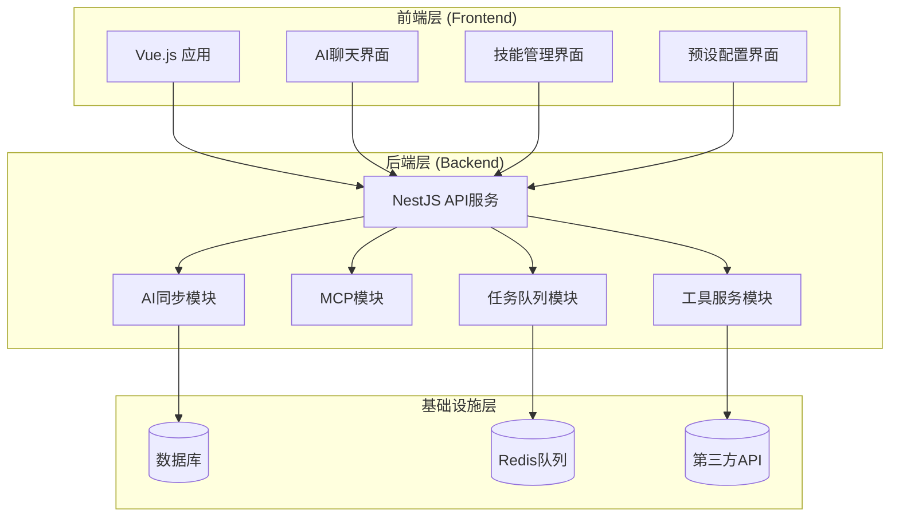
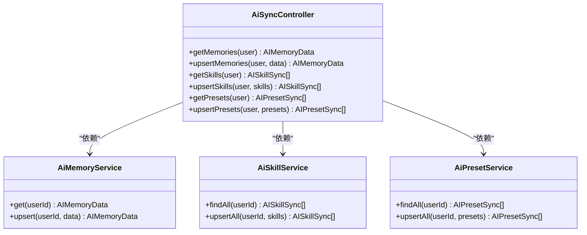
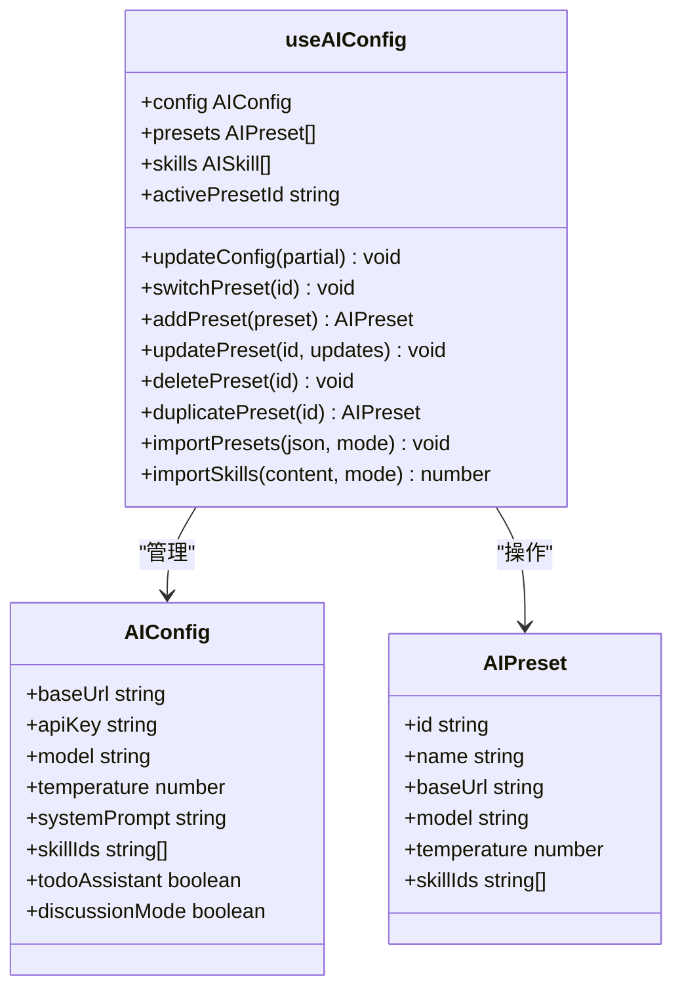
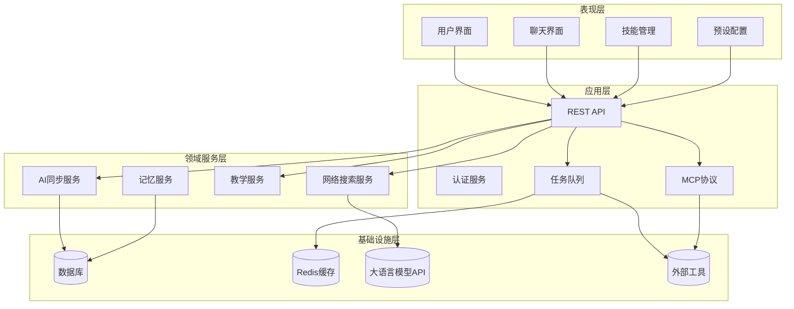
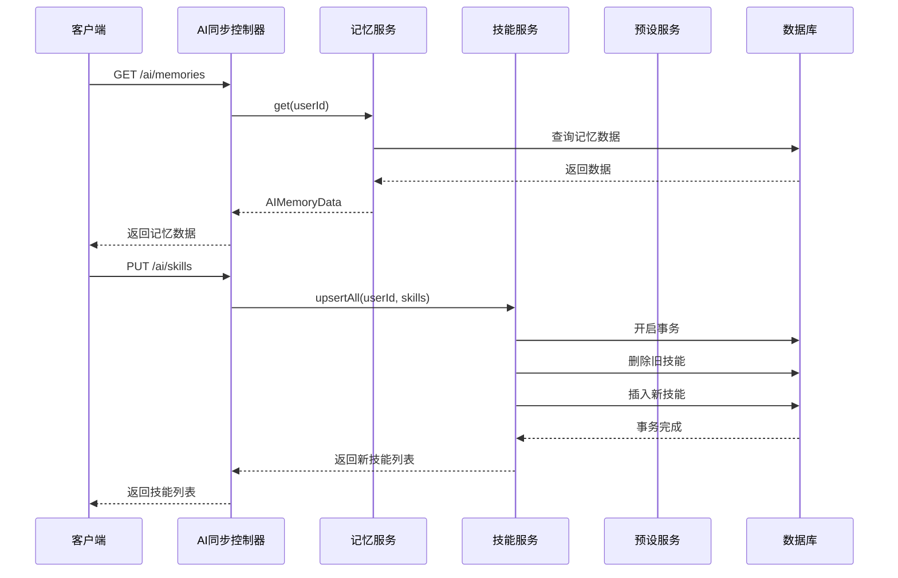
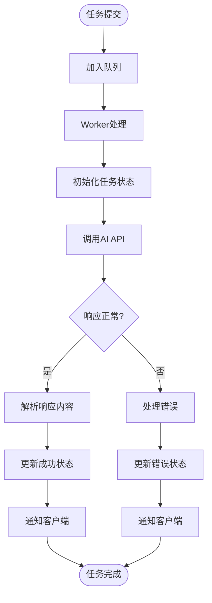
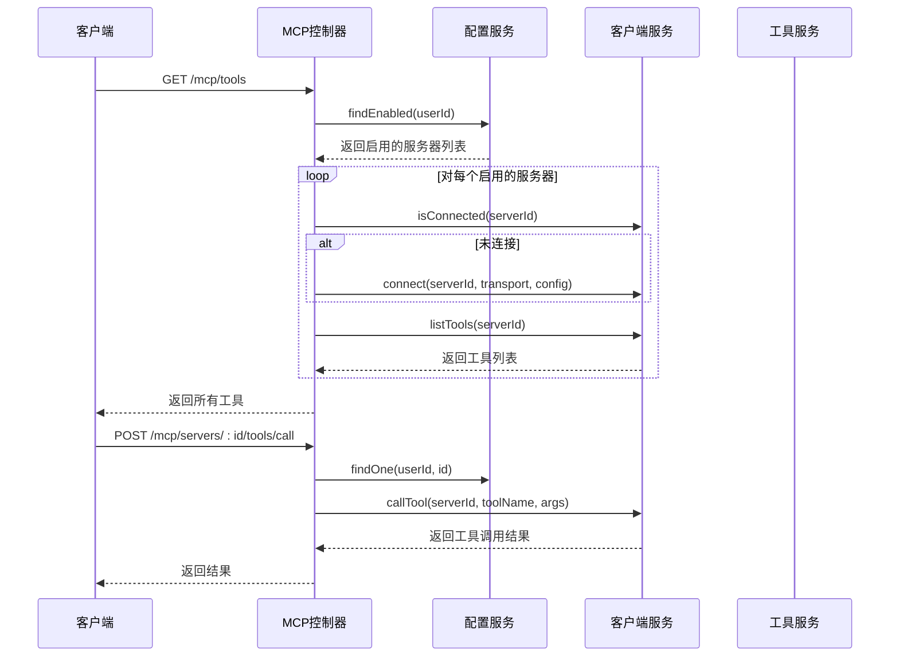
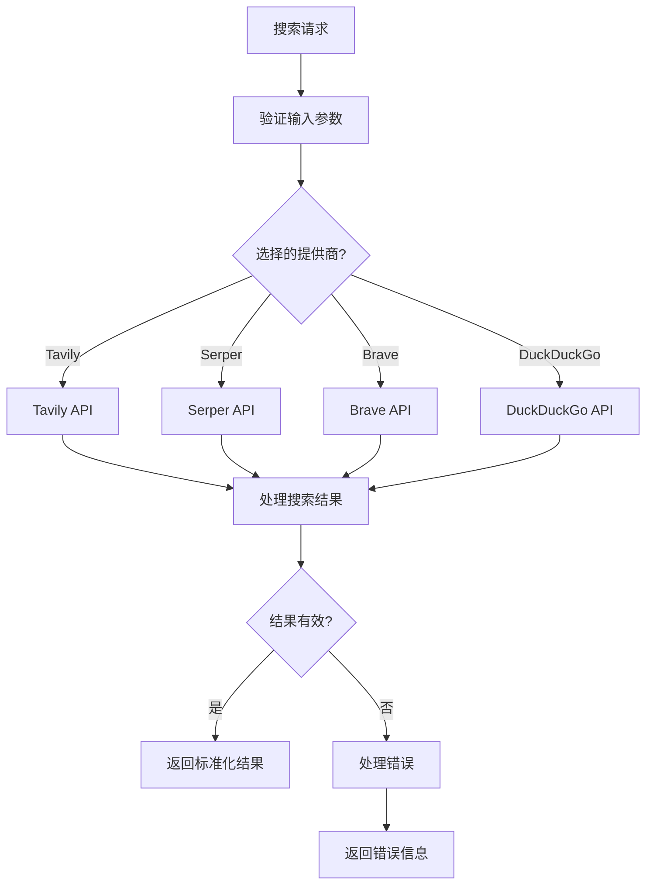
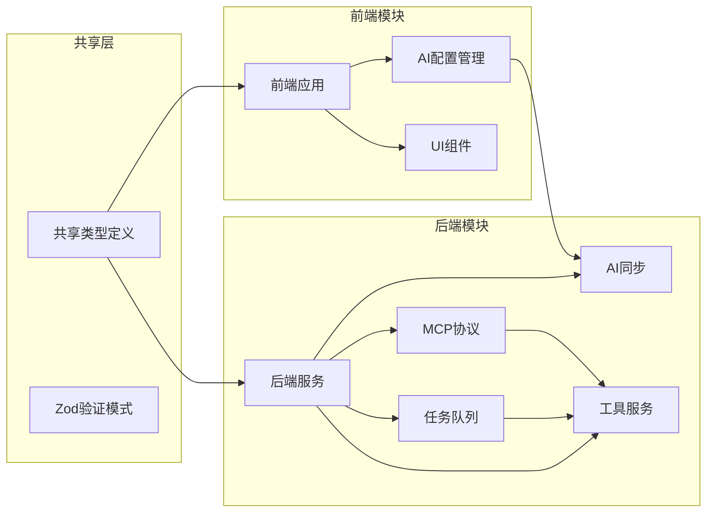

# AI功能架构

<cite>
**本文档引用的文件**
- [apps/backend/src/ai-sync/ai-sync.module.ts](file://apps/backend/src/ai-sync/ai-sync.module.ts)
- [apps/backend/src/ai-sync/ai-sync.controller.ts](file://apps/backend/src/ai-sync/ai-sync.controller.ts)
- [apps/backend/src/ai-sync/ai-memory.service.ts](file://apps/backend/src/ai-sync/ai-memory.service.ts)
- [apps/backend/src/ai-sync/ai-skill.service.ts](file://apps/backend/src/ai-sync/ai-skill.service.ts)
- [apps/backend/src/ai-sync/ai-preset.service.ts](file://apps/backend/src/ai-sync/ai-preset.service.ts)
- [packages/shared/src/schemas/ai-sync.schema.ts](file://packages/shared/src/schemas/ai-sync.schema.ts)
- [apps/frontend/src/features/ai/AGENTS.md](file://apps/frontend/src/features/ai/AGENTS.md)
- [apps/frontend/src/features/ai/composables/useAIConfig/index.ts](file://apps/frontend/src/features/ai/composables/useAIConfig/index.ts)
- [apps/backend/src/agent/task-queue/task-queue.module.ts](file://apps/backend/src/agent/task-queue/task-queue.module.ts)
- [apps/backend/src/agent/task-queue/agent-task.processor.ts](file://apps/backend/src/agent/task-queue/agent-task.processor.ts)
- [apps/backend/src/mcp/mcp.module.ts](file://apps/backend/src/mcp/mcp.module.ts)
- [apps/backend/src/mcp/mcp.controller.ts](file://apps/backend/src/mcp/mcp.controller.ts)
- [apps/backend/src/web-search/web-search.module.ts](file://apps/backend/src/web-search/web-search.module.ts)
- [apps/backend/src/web-search/web-search.service.ts](file://apps/backend/src/web-search/web-search.service.ts)
- [apps/backend/src/teaching/teaching.module.ts](file://apps/backend/src/teaching/teaching.module.ts)
</cite>

## 目录

1. [简介](#简介)
2. [项目结构](#项目结构)
3. [核心组件](#核心组件)
4. [架构概览](#架构概览)
5. [详细组件分析](#详细组件分析)
6. [依赖关系分析](#依赖关系分析)
7. [性能考虑](#性能考虑)
8. [故障排除指南](#故障排除指南)
9. [结论](#结论)

## 简介

本项目是一个完整的AI功能架构系统，包含智能聊天助手、技能管理、预设配置、MCP协议支持、网络搜索、教学模式等多个核心功能模块。该架构采用前后端分离设计，后端使用NestJS框架提供RESTful API服务，前端使用Vue.js构建用户界面，实现了完整的AI功能生态系统。

系统的核心特点包括：

- **多模态AI助手**：支持流式对话、技能调用、图像生成等功能
- **分布式任务处理**：基于BullMQ实现异步任务队列
- **MCP协议集成**：支持外部AI工具和服务的统一接入
- **数据同步机制**：确保多端数据一致性
- **安全防护体系**：包含API密钥管理和访问控制

## 项目结构

整个AI功能架构按照功能域进行模块化组织，主要分为三个层次：

**图表来源**

- [apps/backend/src/ai-sync/ai-sync.module.ts:1-17](file://apps/backend/src/ai-sync/ai-sync.module.ts#L1-L17)
- [apps/backend/src/mcp/mcp.module.ts:1-25](file://apps/backend/src/mcp/mcp.module.ts#L1-L25)
- [apps/backend/src/agent/task-queue/task-queue.module.ts:1-24](file://apps/backend/src/agent/task-queue/task-queue.module.ts#L1-L24)

**章节来源**

- [apps/backend/src/ai-sync/ai-sync.module.ts:1-17](file://apps/backend/src/ai-sync/ai-sync.module.ts#L1-L17)
- [apps/backend/src/mcp/mcp.module.ts:1-25](file://apps/backend/src/mcp/mcp.module.ts#L1-L25)
- [apps/backend/src/agent/task-queue/task-queue.module.ts:1-24](file://apps/backend/src/agent/task-queue/task-queue.module.ts#L1-L24)

## 核心组件

### AI同步模块

AI同步模块是整个系统的核心数据管理层，负责用户AI配置、技能和预设的数据持久化和同步。

**图表来源**

- [apps/backend/src/ai-sync/ai-sync.controller.ts:1-77](file://apps/backend/src/ai-sync/ai-sync.controller.ts#L1-L77)
- [apps/backend/src/ai-sync/ai-memory.service.ts:1-67](file://apps/backend/src/ai-sync/ai-memory.service.ts#L1-L67)
- [apps/backend/src/ai-sync/ai-skill.service.ts:1-50](file://apps/backend/src/ai-sync/ai-skill.service.ts#L1-L50)
- [apps/backend/src/ai-sync/ai-preset.service.ts:1-58](file://apps/backend/src/ai-sync/ai-preset.service.ts#L1-L58)

### 前端AI配置管理

前端提供了完整的AI配置管理功能，包括配置存储、同步、验证等核心能力。

**图表来源**

- [apps/frontend/src/features/ai/composables/useAIConfig/index.ts:1-902](file://apps/frontend/src/features/ai/composables/useAIConfig/index.ts#L1-L902)

**章节来源**

- [apps/backend/src/ai-sync/ai-sync.controller.ts:1-77](file://apps/backend/src/ai-sync/ai-sync.controller.ts#L1-L77)
- [apps/frontend/src/features/ai/composables/useAIConfig/index.ts:1-902](file://apps/frontend/src/features/ai/composables/useAIConfig/index.ts#L1-L902)

## 架构概览

整个AI功能架构采用分层设计，确保了系统的可扩展性和可维护性：

**图表来源**

- [apps/backend/src/ai-sync/ai-sync.module.ts:1-17](file://apps/backend/src/ai-sync/ai-sync.module.ts#L1-L17)
- [apps/backend/src/agent/task-queue/task-queue.module.ts:1-24](file://apps/backend/src/agent/task-queue/task-queue.module.ts#L1-L24)
- [apps/backend/src/mcp/mcp.module.ts:1-25](file://apps/backend/src/mcp/mcp.module.ts#L1-L25)

## 详细组件分析

### AI同步服务流程

AI同步服务实现了完整的数据同步机制，确保用户在不同设备间的配置一致性。

**图表来源**

- [apps/backend/src/ai-sync/ai-sync.controller.ts:25-75](file://apps/backend/src/ai-sync/ai-sync.controller.ts#L25-L75)
- [apps/backend/src/ai-sync/ai-memory.service.ts:23-37](file://apps/backend/src/ai-sync/ai-memory.service.ts#L23-L37)
- [apps/backend/src/ai-sync/ai-skill.service.ts:32-48](file://apps/backend/src/ai-sync/ai-skill.service.ts#L32-L48)

### 任务队列处理流程

系统使用BullMQ实现异步任务处理，支持长时间运行的AI任务。

**图表来源**

- [apps/backend/src/agent/task-queue/agent-task.processor.ts:29-101](file://apps/backend/src/agent/task-queue/agent-task.processor.ts#L29-L101)

**章节来源**

- [apps/backend/src/agent/task-queue/agent-task.processor.ts:1-103](file://apps/backend/src/agent/task-queue/agent-task.processor.ts#L1-L103)

### MCP协议集成

MCP模块实现了对Model Context Protocol的支持，允许系统与外部AI工具和服务进行交互。

**图表来源**

- [apps/backend/src/mcp/mcp.controller.ts:109-201](file://apps/backend/src/mcp/mcp.controller.ts#L109-L201)

**章节来源**

- [apps/backend/src/mcp/mcp.controller.ts:1-203](file://apps/backend/src/mcp/mcp.controller.ts#L1-L203)

### 网络搜索服务

网络搜索服务提供了多种搜索引擎的统一接口，支持Tavily、Serper、Brave和DuckDuckGo等服务。

**图表来源**

- [apps/backend/src/web-search/web-search.service.ts:15-40](file://apps/backend/src/web-search/web-search.service.ts#L15-L40)

**章节来源**

- [apps/backend/src/web-search/web-search.service.ts:1-260](file://apps/backend/src/web-search/web-search.service.ts#L1-L260)

## 依赖关系分析

系统各模块之间的依赖关系清晰明确，遵循了依赖倒置原则：

**图表来源**

- [packages/shared/src/schemas/ai-sync.schema.ts:1-70](file://packages/shared/src/schemas/ai-sync.schema.ts#L1-L70)
- [apps/frontend/src/features/ai/composables/useAIConfig/index.ts:1-902](file://apps/frontend/src/features/ai/composables/useAIConfig/index.ts#L1-L902)

**章节来源**

- [packages/shared/src/schemas/ai-sync.schema.ts:1-70](file://packages/shared/src/schemas/ai-sync.schema.ts#L1-L70)

## 性能考虑

系统在设计时充分考虑了性能优化：

### 缓存策略

- 使用Redis作为缓存层，减少数据库查询压力
- 前端本地存储配置，提升用户体验
- API响应缓存，降低重复计算成本

### 异步处理

- 任务队列处理耗时操作
- 流式响应处理大文本输出
- 并发限制防止资源过载

### 数据优化

- 分页查询避免大数据集传输
- 条件查询减少不必要的数据加载
- 数据压缩减少网络传输

## 故障排除指南

### 常见问题及解决方案

**AI同步问题**

- 检查用户认证状态
- 验证数据格式和约束
- 查看数据库连接状态

**任务队列问题**

- 检查Redis连接
- 查看任务重试机制
- 监控队列长度

**MCP连接问题**

- 验证服务器配置
- 检查网络连通性
- 查看工具发现过程

**搜索服务问题**

- 验证API密钥有效性
- 检查提供商可用性
- 查看请求超时设置

**章节来源**

- [apps/backend/src/agent/task-queue/agent-task.processor.ts:87-100](file://apps/backend/src/agent/task-queue/agent-task.processor.ts#L87-L100)
- [apps/backend/src/web-search/web-search.service.ts:45-56](file://apps/backend/src/web-search/web-search.service.ts#L45-L56)

## 结论

本AI功能架构系统设计合理，具有以下优势：

1. **模块化设计**：清晰的功能模块划分，便于维护和扩展
2. **数据一致性**：完善的同步机制确保多端数据一致
3. **安全性**：多层次的安全防护，保护用户隐私
4. **可扩展性**：插件化的架构支持新功能快速集成
5. **性能优化**：异步处理和缓存策略提升系统性能

未来可以考虑的改进方向：

- 增加更多的AI模型支持
- 优化前端性能和用户体验
- 扩展MCP协议的工具生态
- 增强数据分析和监控能力
