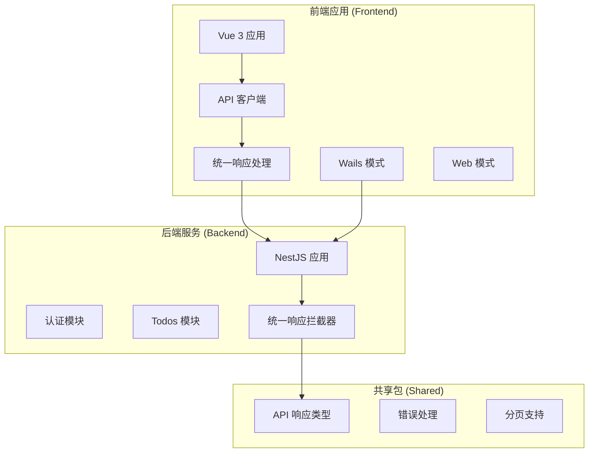
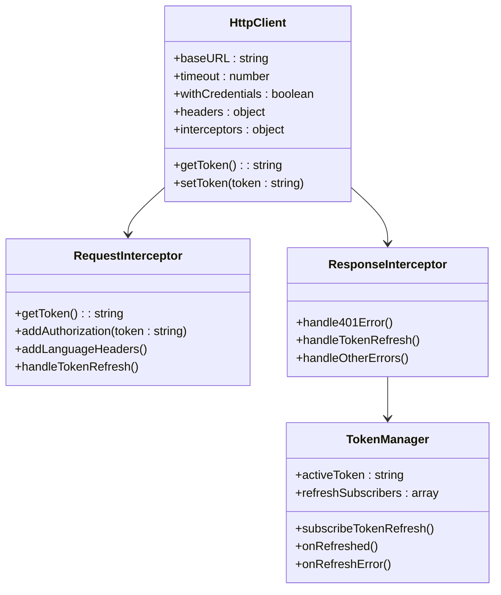
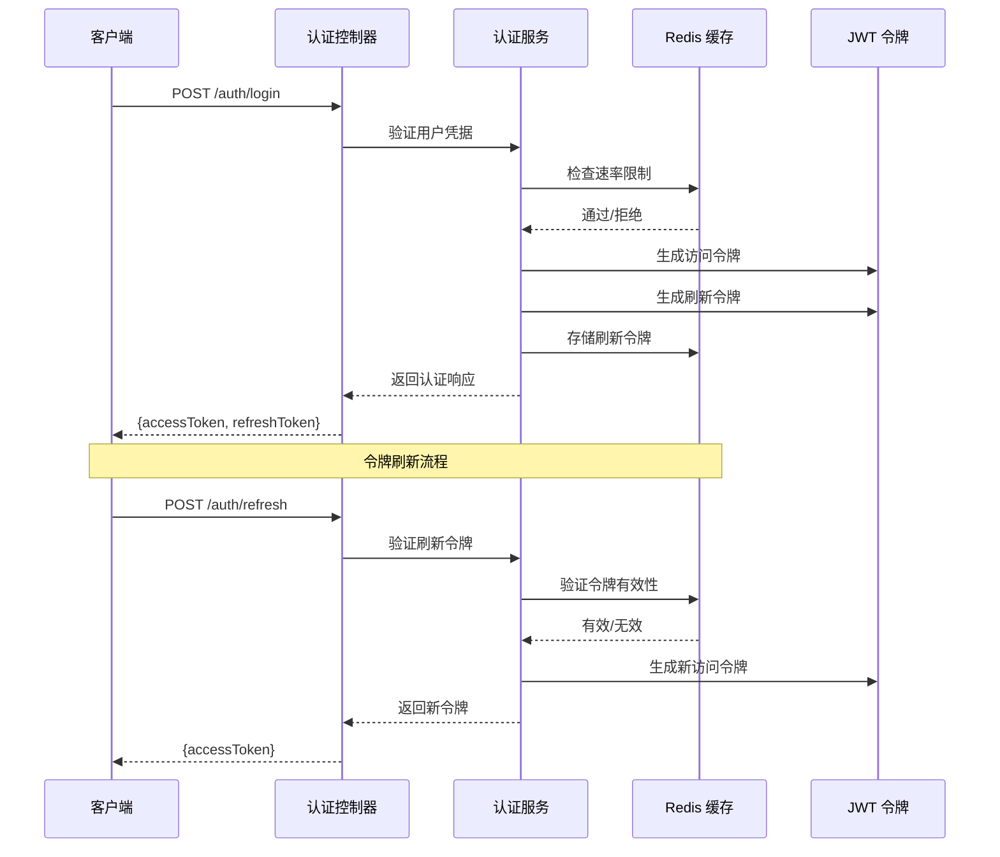
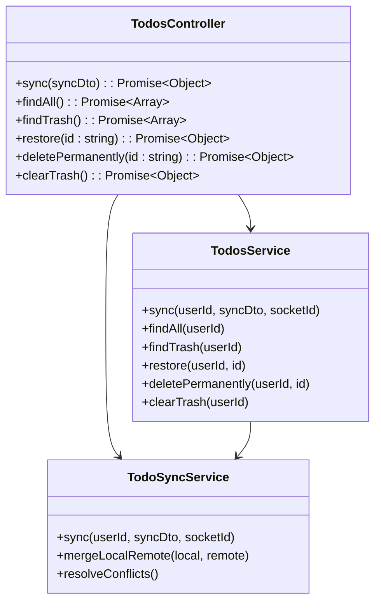
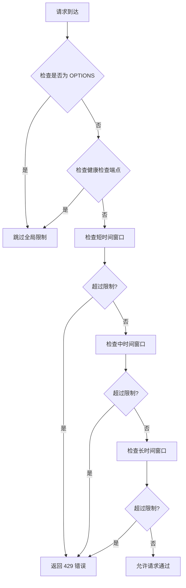
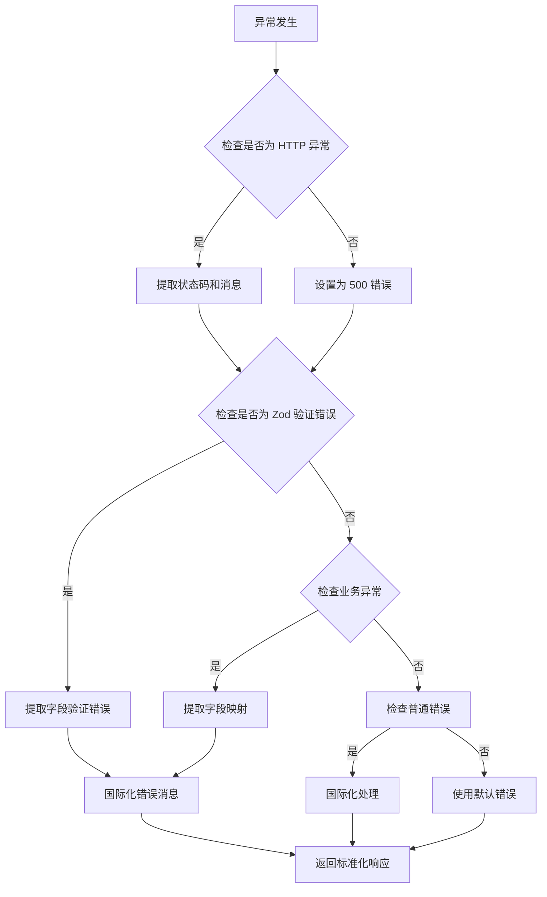
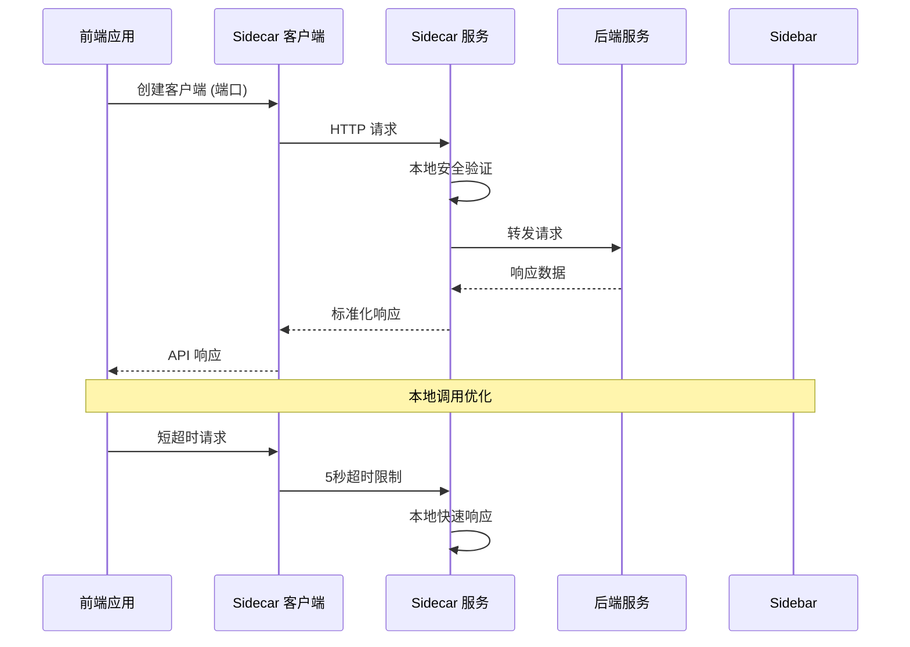
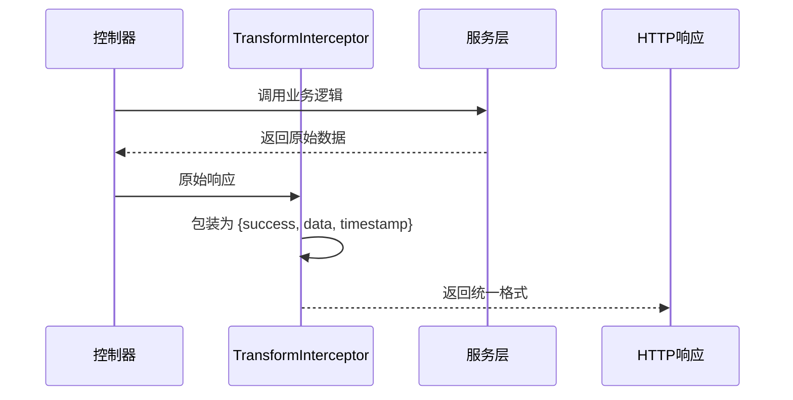
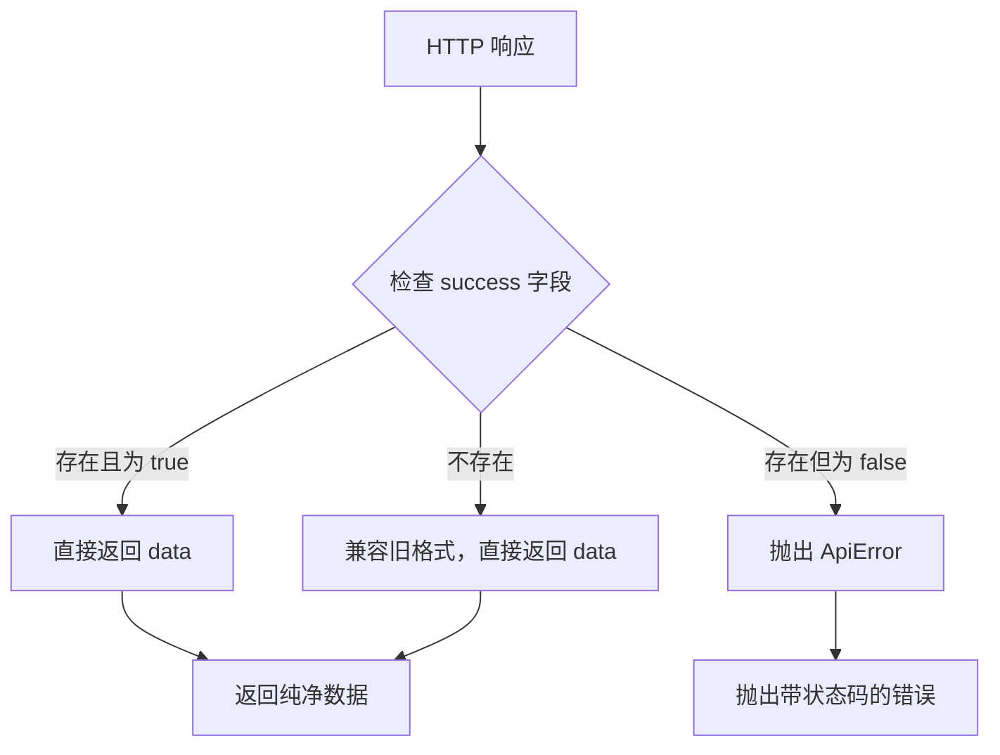
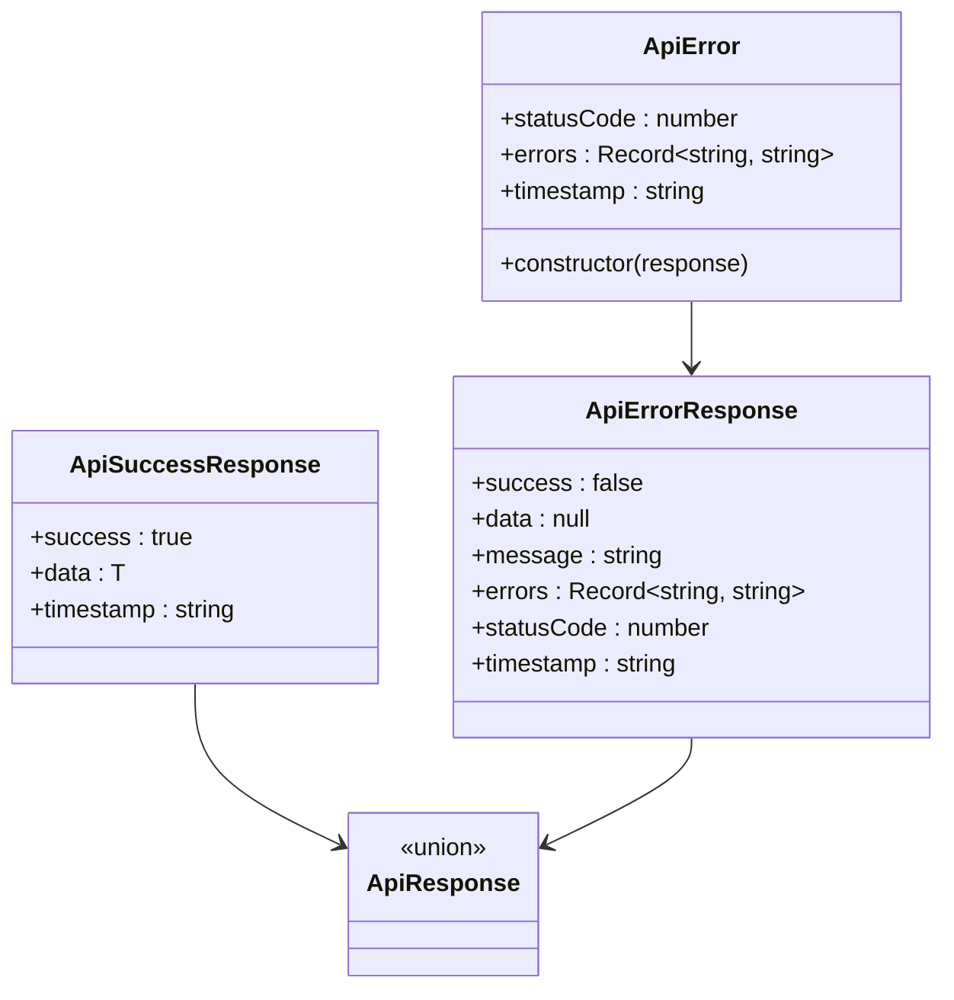

# API配置现代化

<cite>
**本文档引用的文件**
- [apps/backend/src/app.module.ts](file://apps/backend/src/app.module.ts)
- [apps/frontend/src/api/config.ts](file://apps/frontend/src/api/config.ts)
- [apps/frontend/src/api/index.ts](file://apps/frontend/src/api/index.ts)
- [apps/frontend/src/api/unwrap.ts](file://apps/frontend/src/api/unwrap.ts)
- [apps/frontend/src/api/sidecar.ts](file://apps/frontend/src/api/sidecar.ts)
- [apps/frontend/src/api/upload.ts](file://apps/frontend/src/api/upload.ts)
- [apps/backend/src/common/interceptors/transform.interceptor.ts](file://apps/backend/src/common/interceptors/transform.interceptor.ts)
- [packages/shared/src/dto/common.dto.ts](file://packages/shared/src/dto/common.dto.ts)
- [apps/backend/nest-cli.json](file://apps/backend/nest-cli.json)
- [apps/frontend/package.json](file://apps/frontend/package.json)
- [apps/backend/src/common/throttling/index.ts](file://apps/backend/src/common/throttling/index.ts)
- [apps/backend/src/common/filters/all-exceptions.filter.ts](file://apps/backend/src/common/filters/all-exceptions.filter.ts)
- [apps/backend/src/auth/auth.module.ts](file://apps/backend/src/auth/auth.module.ts)
- [apps/backend/src/auth/auth.dto.ts](file://apps/backend/src/auth/auth.dto.ts)
- [apps/backend/src/auth/auth.controller.ts](file://apps/backend/src/auth/auth.controller.ts)
- [apps/backend/src/todos/todos.controller.ts](file://apps/backend/src/todos/todos.controller.ts)
- [apps/backend/src/todos/todos.dto.ts](file://apps/backend/src/todos/todos.dto.ts)
- [apps/backend/src/common/throttling/throttling.constants.ts](file://apps/backend/src/common/throttling/throttling.constants.ts)
- [apps/frontend/src/features/novel/api/novelApi.ts](file://apps/frontend/src/features/novel/api/novelApi.ts)
- [apps/frontend/src/features/teaching/api/teachingApi.ts](file://apps/frontend/src/features/teaching/api/teachingApi.ts)
</cite>

## 更新摘要
**变更内容**
- 新增统一API响应处理系统，提供标准化的响应解包机制
- 实现后端统一响应包装，消除前端手动解包的需要
- 新增共享的API响应类型定义和错误处理机制
- 扩展前端API客户端功能，支持更丰富的HTTP方法

## 目录
1. [简介](#简介)
2. [项目结构](#项目结构)
3. [核心组件](#核心组件)
4. [架构概览](#架构概览)
5. [详细组件分析](#详细组件分析)
6. [统一API响应处理系统](#统一api响应处理系统)
7. [依赖关系分析](#依赖关系分析)
8. [性能考虑](#性能考虑)
9. [故障排除指南](#故障排除指南)
10. [结论](#结论)

## 简介

本项目是一个现代化的Todo应用，采用前后端分离架构，专注于API配置的现代化实践。项目实现了统一的API配置管理、智能的环境变量处理、完善的错误处理机制，以及高效的前端API客户端设计。

**最新更新**：系统现已引入统一API响应处理系统，通过apps/frontend/src/api/unwrap.ts提供getJson、postJson、putJson、patchJson、deleteJson等辅助函数，集中处理后端统一响应包装，消除前端手动解包的需要。

该系统的核心特点包括：
- 统一的API基础URL配置，支持多种部署模式
- 智能的环境变量解析和优先级处理
- 完善的错误处理和国际化支持
- 现代化的前端API客户端设计
- 统一的API响应处理机制
- 可扩展的模块化架构

## 项目结构

项目采用Monorepo架构，主要分为三个核心部分：



**图表来源**
- [apps/backend/src/app.module.ts:28-146](file://apps/backend/src/app.module.ts#L28-L146)
- [apps/frontend/src/api/config.ts:1-47](file://apps/frontend/src/api/config.ts#L1-L47)
- [apps/frontend/src/api/unwrap.ts:1-30](file://apps/frontend/src/api/unwrap.ts#L1-L30)

**章节来源**
- [apps/backend/src/app.module.ts:1-160](file://apps/backend/src/app.module.ts#L1-L160)
- [apps/frontend/package.json:1-105](file://apps/frontend/package.json#L1-L105)

## 核心组件

### API配置管理

系统实现了多层次的API配置管理机制：

```mermaid
flowchart TD
A[API 配置入口] --> B{构建模式判断}
B --> |Wails 模式| C[VITE_SERVER_URL]
B --> |Web 模式| D[/api 相对路径]
C --> E{环境变量检查}
E --> |存在| F[使用 VITE_SERVER_URL]
E --> |不存在| G[默认 http://localhost:3000]
F --> H[拼接 /api 后缀]
G --> H
D --> I[保持相对路径]
H --> J[最终 baseURL]
I --> J
```

**图表来源**
- [apps/frontend/src/api/config.ts:26-46](file://apps/frontend/src/api/config.ts#L26-L46)

### 前端API客户端

前端实现了高度可配置的HTTP客户端：



**图表来源**
- [apps/frontend/src/api/index.ts:9-198](file://apps/frontend/src/api/index.ts#L9-L198)

**章节来源**
- [apps/frontend/src/api/config.ts:1-47](file://apps/frontend/src/api/config.ts#L1-L47)
- [apps/frontend/src/api/index.ts:1-198](file://apps/frontend/src/api/index.ts#L1-L198)

## 架构概览

系统采用现代化的三层架构设计，现已集成了统一的API响应处理机制：

```mermaid
graph TB
subgraph "表现层 (Presentation Layer)"
UI[Vue 3 前端]
API[API 客户端]
UNWRAP[统一响应处理]
SIDE[Sidecar 客户端]
end
subgraph "应用层 (Application Layer)"
AUTH[认证服务]
TODO[Todos 服务]
MAIL[邮件服务]
UPLOAD[文件上传]
SHARED[共享类型定义]
END
subgraph "数据层 (Data Layer)"
PRISMA[Prisma ORM]
REDIS[Redis 缓存]
DB[(数据库)]
END
UI --> API
API --> UNWRAP
UNWRAP --> AUTH
UNWRAP --> TODO
UNWRAP --> MAIL
UNWRAP --> UPLOAD
SIDE --> AUTH
AUTH --> PRISMA
TODO --> PRISMA
MAIL --> REDIS
UPLOAD --> REDIS
PRISMA --> DB
REDIS --> DB
SHARED --> UNWRAP
```

**图表来源**
- [apps/backend/src/app.module.ts:28-146](file://apps/backend/src/app.module.ts#L28-L146)
- [apps/frontend/src/api/index.ts:1-198](file://apps/frontend/src/api/index.ts#L1-L198)
- [apps/frontend/src/api/unwrap.ts:1-30](file://apps/frontend/src/api/unwrap.ts#L1-L30)

## 详细组件分析

### 认证API系统

认证模块实现了完整的用户身份验证流程：



**图表来源**
- [apps/backend/src/auth/auth.controller.ts:23-79](file://apps/backend/src/auth/auth.controller.ts#L23-L79)
- [apps/backend/src/auth/auth.service.ts](file://apps/backend/src/auth/auth.service.ts)

**章节来源**
- [apps/backend/src/auth/auth.controller.ts:1-81](file://apps/backend/src/auth/auth.controller.ts#L1-L81)
- [apps/backend/src/auth/auth.dto.ts:1-41](file://apps/backend/src/auth/auth.dto.ts#L1-L41)
- [apps/backend/src/auth/auth.module.ts:1-41](file://apps/backend/src/auth/auth.module.ts#L1-L41)

### Todos API系统

Todos模块提供了完整的待办事项管理功能：



**图表来源**
- [apps/backend/src/todos/todos.controller.ts:24-69](file://apps/backend/src/todos/todos.controller.ts#L24-L69)
- [apps/backend/src/todos/todos.service.ts](file://apps/backend/src/todos/todos.service.ts)
- [apps/backend/src/todos/todos-sync.service.ts](file://apps/backend/src/todos/todos-sync.service.ts)

**章节来源**
- [apps/backend/src/todos/todos.controller.ts:1-70](file://apps/backend/src/todos/todos.controller.ts#L1-L70)
- [apps/backend/src/todos/todos.dto.ts:1-5](file://apps/backend/src/todos/todos.dto.ts#L1-L5)

### 速率限制系统

系统实现了多维度的速率限制机制：



**图表来源**
- [apps/backend/src/common/throttling/throttling.constants.ts:162-197](file://apps/backend/src/common/throttling/throttling.constants.ts#L162-L197)

**章节来源**
- [apps/backend/src/common/throttling/throttling.constants.ts:1-198](file://apps/backend/src/common/throttling/throttling.constants.ts#L1-198)

### 错误处理系统

实现了统一的错误处理和国际化支持：



**图表来源**
- [apps/backend/src/common/filters/all-exceptions.filter.ts:27-135](file://apps/backend/src/common/filters/all-exceptions.filter.ts#L27-L135)

**章节来源**
- [apps/backend/src/common/filters/all-exceptions.filter.ts:1-137](file://apps/backend/src/common/filters/all-exceptions.filter.ts#L1-L137)

### Sidecar API集成

Sidecar服务提供了本地API访问能力：



**图表来源**
- [apps/frontend/src/api/sidecar.ts:9-17](file://apps/frontend/src/api/sidecar.ts#L9-L17)

**章节来源**
- [apps/frontend/src/api/sidecar.ts:1-20](file://apps/frontend/src/api/sidecar.ts#L1-L20)

## 统一API响应处理系统

**新增功能**：系统现已实现统一的API响应处理机制，通过apps/frontend/src/api/unwrap.ts提供标准化的响应解包功能。

### 后端统一响应包装

后端通过TransformInterceptor将所有成功响应统一包装为标准格式：



**图表来源**
- [apps/backend/src/common/interceptors/transform.interceptor.ts:18-29](file://apps/backend/src/common/interceptors/transform.interceptor.ts#L18-L29)

### 前端统一响应解包

前端通过unwrap.ts提供标准化的响应解包函数：



**图表来源**
- [apps/frontend/src/api/unwrap.ts:11-29](file://apps/frontend/src/api/unwrap.ts#L11-L29)
- [packages/shared/src/dto/common.dto.ts:64-72](file://packages/shared/src/dto/common.dto.ts#L64-L72)

### API响应类型定义

共享包提供了完整的API响应类型定义：



**图表来源**
- [packages/shared/src/dto/common.dto.ts:4-34](file://packages/shared/src/dto/common.dto.ts#L4-L34)
- [packages/shared/src/dto/common.dto.ts:40-52](file://packages/shared/src/dto/common.dto.ts#L40-L52)

### 前端API使用示例

多个前端模块已开始使用统一的响应处理系统：

```mermaid
graph TB
subgraph "前端API模块"
NOVEL[小说API]
TEACHING[教学API]
AUTH[认证API]
TODO[Todos API]
end
subgraph "统一响应处理"
GETJSON[getJson]
POSTJSON[postJson]
PUTJSON[putJson]
PATCHJSON[patchJson]
DELETEJSON[deleteJson]
END
subgraph "共享类型"
RESPONSE[ApiResponse]
ERROR[ApiError]
END
NOVEL --> GETJSON
NOVEL --> POSTJSON
NOVEL --> PUTJSON
NOVEL --> PATCHJSON
NOVEL --> DELETEJSON
TEACHING --> GETJSON
TEACHING --> POSTJSON
TEACHING --> PUTJSON
AUTH --> GETJSON
AUTH --> POSTJSON
TODO --> GETJSON
GETJSON --> RESPONSE
POSTJSON --> RESPONSE
PUTJSON --> RESPONSE
PATCHJSON --> RESPONSE
DELETEJSON --> RESPONSE
RESPONSE --> ERROR
```

**图表来源**
- [apps/frontend/src/features/novel/api/novelApi.ts:1-178](file://apps/frontend/src/features/novel/api/novelApi.ts#L1-L178)
- [apps/frontend/src/features/teaching/api/teachingApi.ts:1-111](file://apps/frontend/src/features/teaching/api/teachingApi.ts#L1-L111)

**章节来源**
- [apps/frontend/src/api/unwrap.ts:1-30](file://apps/frontend/src/api/unwrap.ts#L1-L30)
- [packages/shared/src/dto/common.dto.ts:1-99](file://packages/shared/src/dto/common.dto.ts#L1-L99)
- [apps/backend/src/common/interceptors/transform.interceptor.ts:1-29](file://apps/backend/src/common/interceptors/transform.interceptor.ts#L1-L29)

## 依赖关系分析

系统采用了模块化的依赖管理策略，现已集成了统一的响应处理机制：

```mermaid
graph TB
subgraph "前端依赖"
AX[axios 1.13.5]
VUE[Vue 3.5.26]
PINIA[Pinia 3.0.4]
I18N[vue-i18n 11.2.7]
SOCKET[socket.io-client 4.8.3]
UNWRAP[unwrap.ts]
END
subgraph "后端依赖"
NEST[@nestjs/*]
PRISMA[prisma 5.x]
REDIS[redis 4.x]
BULL[bullmq 1.x]
PASSPORT[@nestjs/passport]
TRANSFORM[TransformInterceptor]
END
subgraph "共享包"
SHARED[@lumina/shared]
SCHEMA[Zod Schema]
APIRESPONSE[ApiResponse类型]
APIERROR[ApiError类]
END
AX --> UNWRAP
UNWRAP --> APIRESPONSE
UNWRAP --> APIERROR
NEST --> TRANSFORM
TRANSFORM --> APIRESPONSE
SHARED --> APIRESPONSE
SHARED --> APIERROR
```

**图表来源**
- [apps/frontend/package.json:31-70](file://apps/frontend/package.json#L31-L70)
- [apps/backend/nest-cli.json:1-11](file://apps/backend/nest-cli.json#L1-L11)
- [apps/frontend/src/api/unwrap.ts:1-3](file://apps/frontend/src/api/unwrap.ts#L1-L3)

**章节来源**
- [apps/frontend/package.json:1-105](file://apps/frontend/package.json#L1-L105)
- [apps/backend/nest-cli.json:1-11](file://apps/backend/nest-cli.json#L1-L11)

## 性能考虑

系统在多个层面实现了性能优化，统一响应处理机制进一步提升了性能：

### 前端性能优化
- **智能缓存策略**：内存中缓存活跃令牌，减少localStorage访问
- **并发控制**：防并发令牌刷新，避免重复请求
- **懒加载**：按需加载API模块和组件
- **压缩传输**：启用Gzip/Brotli压缩
- **响应解包优化**：统一的响应解包减少重复代码

### 后端性能优化
- **连接池管理**：Redis连接池复用
- **队列处理**：BullMQ异步任务处理
- **缓存策略**：多级缓存架构
- **限流保护**：多维度速率限制
- **统一响应包装**：减少重复的响应格式化代码

### 网络优化
- **HTTP/2支持**：提升连接效率
- **CDN集成**：静态资源CDN加速
- **预加载策略**：关键资源预加载
- **响应缓存**：统一的响应格式便于缓存

## 故障排除指南

### 常见问题诊断

#### API连接问题
1. **检查环境变量配置**
   - 验证VITE_API_BASE_URL设置
   - 确认WAILS模式下的VITE_SERVER_URL
   - 检查代理配置

2. **网络连接测试**
   ```bash
   # 测试后端连通性
   curl -I http://localhost:3000/api/health
   
   # 测试前端API
   curl -I http://localhost:5173/api/health
   ```

#### 统一响应处理问题
1. **检查响应格式**
   - 验证后端TransformInterceptor是否正常工作
   - 确认响应包含success、data、timestamp字段
   - 检查旧格式响应的兼容性

2. **调试API响应**
   ```typescript
   // 检查响应结构
   const response = await getJson('/api/endpoint')
   console.log('Response structure:', response)
   
   // 检查错误处理
   try {
     const data = await getJson('/api/endpoint')
   } catch (error) {
     if (error instanceof ApiError) {
       console.log('Status code:', error.statusCode)
       console.log('Message:', error.message)
     }
   }
   ```

#### 认证问题
1. **令牌刷新失败**
   - 检查刷新令牌有效性
   - 验证Redis连接状态
   - 查看令牌过期时间

2. **跨域问题**
   - 配置CORS允许的源
   - 检查Cookie SameSite设置
   - 验证凭证传递

#### 性能问题
1. **API响应缓慢**
   - 检查数据库查询
   - 监控Redis缓存命中率
   - 分析队列积压情况

2. **内存泄漏**
   - 监控前端组件生命周期
   - 检查WebSocket连接
   - 验证定时器清理

**章节来源**
- [apps/backend/src/common/filters/all-exceptions.filter.ts:1-137](file://apps/backend/src/common/filters/all-exceptions.filter.ts#L1-L137)
- [apps/backend/src/common/throttling/throttling.constants.ts:162-197](file://apps/backend/src/common/throttling/throttling.constants.ts#L162-L197)
- [apps/frontend/src/api/unwrap.ts:1-30](file://apps/frontend/src/api/unwrap.ts#L1-L30)

## 结论

本项目展示了现代API配置的最佳实践，通过以下关键特性实现了高质量的API体验：

### 核心优势
- **统一配置管理**：智能的环境变量解析和优先级处理
- **完善的错误处理**：国际化的错误响应和详细的日志记录
- **高性能架构**：多级缓存、异步处理和连接池优化
- **安全可靠**：多维度速率限制和令牌管理
- **可扩展性**：模块化设计和清晰的依赖关系
- **标准化响应**：统一的API响应格式和解包机制

### 技术亮点
- 前后端分离的现代化架构
- 智能的API客户端设计
- 完善的TypeScript类型系统
- 企业级的错误处理机制
- 高效的性能监控和优化
- 统一的API响应处理系统

**最新更新**：新增的统一API响应处理系统显著提升了开发效率和代码质量，通过标准化的响应解包机制消除了前端重复代码，提供了更好的错误处理和类型安全性。

该系统为构建大规模、高可用的API服务提供了完整的解决方案，适合企业级应用开发参考和扩展。