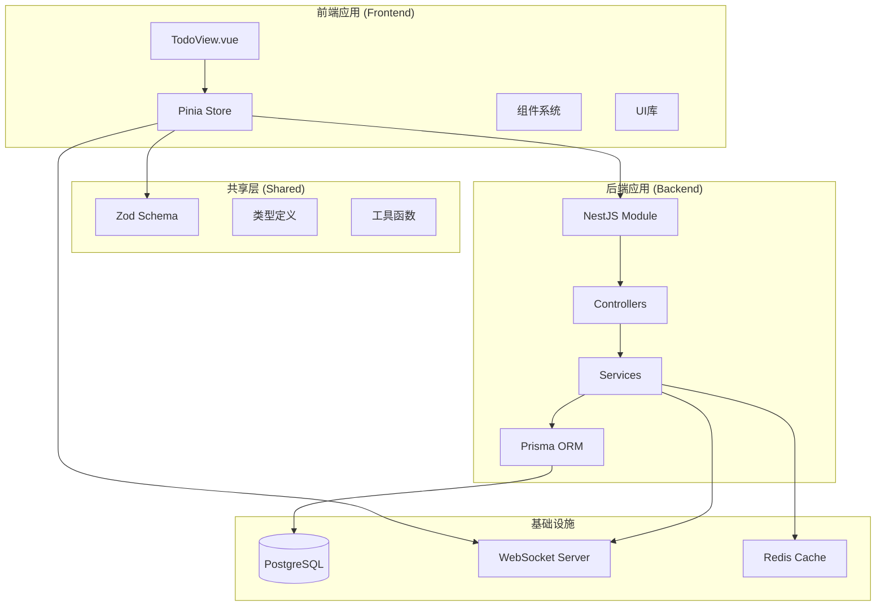
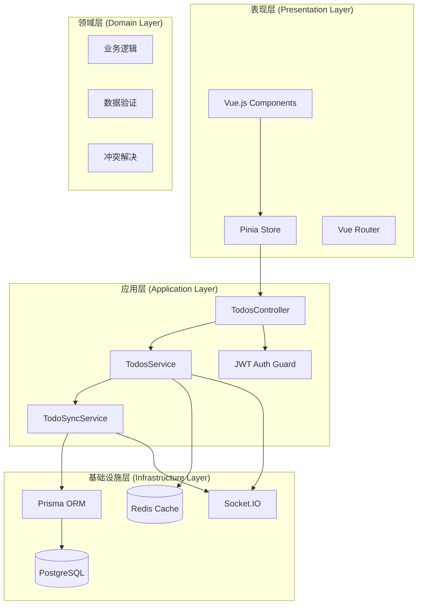
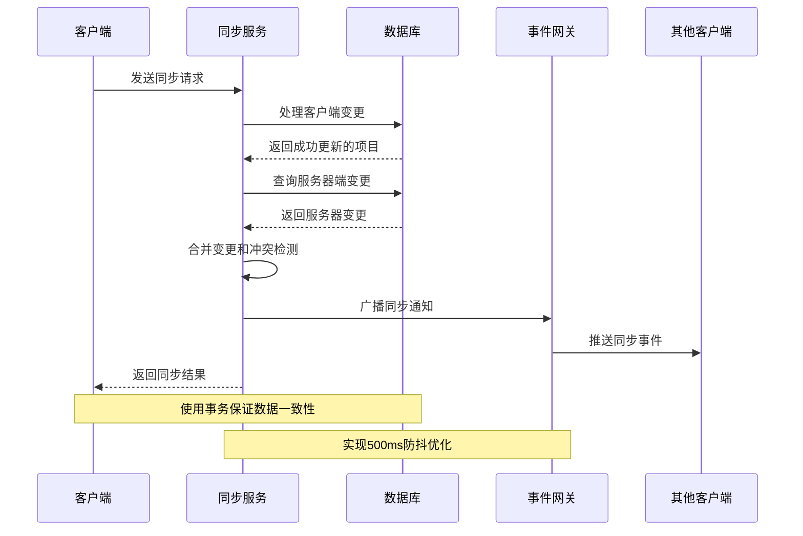
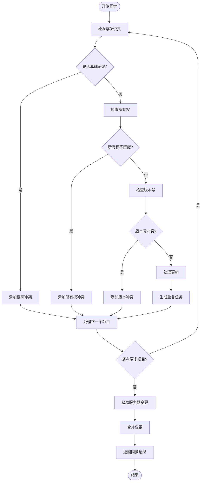
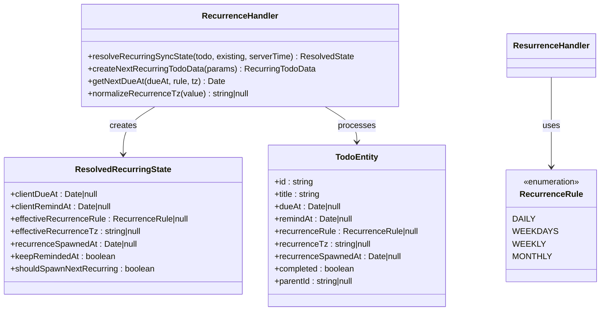
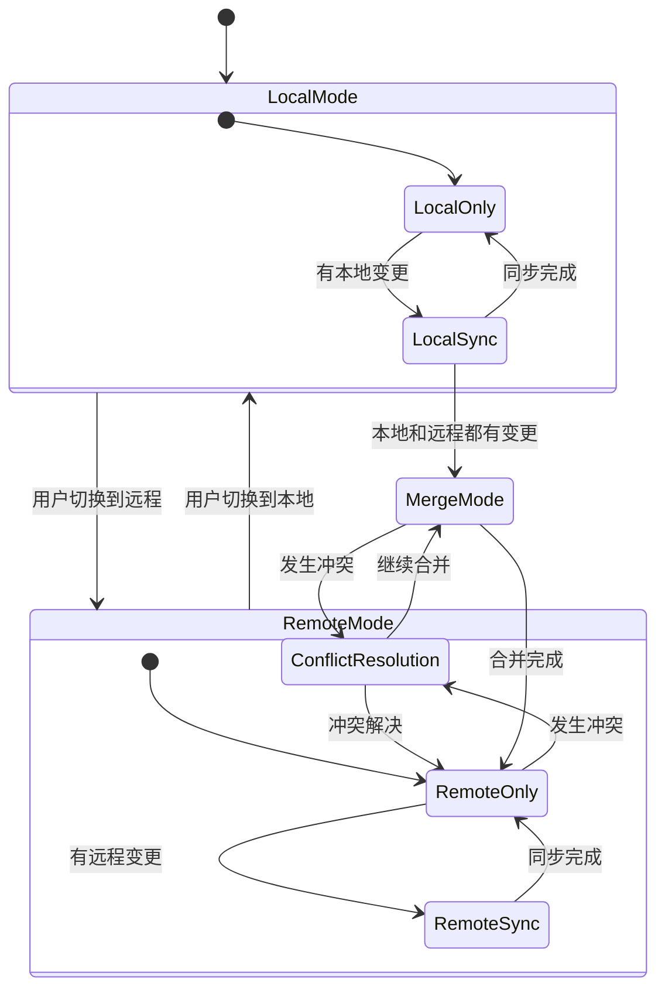

# Todo功能架构

<cite>
**本文档引用的文件**
- [apps/backend/src/todos/todos.module.ts](file://apps/backend/src/todos/todos.module.ts)
- [apps/backend/src/todos/todos.controller.ts](file://apps/backend/src/todos/todos.controller.ts)
- [apps/backend/src/todos/todos.service.ts](file://apps/backend/src/todos/todos.service.ts)
- [apps/backend/src/todos/todos-sync.service.ts](file://apps/backend/src/todos/todos-sync.service.ts)
- [apps/backend/src/todos/todos-sync.recurrence.ts](file://apps/backend/src/todos/todos-sync.recurrence.ts)
- [apps/backend/src/todos/todos.dto.ts](file://apps/backend/src/todos/todos.dto.ts)
- [apps/backend/src/prisma/prisma.service.ts](file://apps/backend/src/prisma/prisma.service.ts)
- [apps/backend/src/events/events.gateway.ts](file://apps/backend/src/events/events.gateway.ts)
- [apps/frontend/src/features/todo/TodoView.vue](file://apps/frontend/src/features/todo/TodoView.vue)
- [apps/frontend/src/features/todo/stores/todo.store.ts](file://apps/frontend/src/features/todo/stores/todo.store.ts)
- [apps/frontend/src/features/todo/stores/todo.types.ts](file://apps/frontend/src/features/todo/stores/todo.types.ts)
- [packages/shared/src/schemas/todo.schema.ts](file://packages/shared/src/schemas/todo.schema.ts)
</cite>

## 目录

1. [简介](#简介)
2. [项目结构](#项目结构)
3. [核心组件](#核心组件)
4. [架构概览](#架构概览)
5. [详细组件分析](#详细组件分析)
6. [依赖关系分析](#依赖关系分析)
7. [性能考虑](#性能考虑)
8. [故障排除指南](#故障排除指南)
9. [结论](#结论)

## 简介

Todo功能是一个现代化的跨平台待办事项管理系统，采用前后端分离架构设计。该系统支持多设备同步、离线优先策略、智能重复任务处理、实时协作和丰富的用户界面交互。系统通过WebSocket实现实时同步，使用PostgreSQL作为数据存储，结合Vue.js前端框架提供流畅的用户体验。

## 项目结构

Todo功能采用模块化的项目组织方式，主要分为三个核心部分：



**图表来源**

- [apps/frontend/src/features/todo/TodoView.vue:1-550](file://apps/frontend/src/features/todo/TodoView.vue#L1-L550)
- [apps/backend/src/todos/todos.module.ts:1-15](file://apps/backend/src/todos/todos.module.ts#L1-L15)
- [apps/backend/src/prisma/prisma.service.ts:1-34](file://apps/backend/src/prisma/prisma.service.ts#L1-L34)

**章节来源**

- [apps/frontend/src/features/todo/TodoView.vue:1-550](file://apps/frontend/src/features/todo/TodoView.vue#L1-L550)
- [apps/backend/src/todos/todos.module.ts:1-15](file://apps/backend/src/todos/todos.module.ts#L1-L15)

## 核心组件

### 前端组件架构

Todo功能的前端采用Vue.js 3 Composition API构建，主要包含以下核心组件：

- **TodoView**: 主视图容器，管理整个Todo应用的状态和布局
- **TodoStore**: Pinia状态管理，处理本地和远程数据同步
- **TodoList**: 待办事项列表渲染组件
- **TodoInput**: 任务创建输入组件
- **TodoFilter**: 过滤和搜索组件
- **TodoVisualizer**: 视觉化展示组件
- **TodoStatistics**: 统计分析组件

### 后端服务架构

后端采用NestJS框架，实现RESTful API和WebSocket实时通信：

- **TodosController**: 处理HTTP请求，提供待办事项API
- **TodosService**: 核心业务逻辑，管理待办事项CRUD操作
- **TodoSyncService**: 同步服务，实现离线优先的数据合并
- **EventsGateway**: WebSocket网关，处理实时通信

**章节来源**

- [apps/frontend/src/features/todo/TodoView.vue:1-550](file://apps/frontend/src/features/todo/TodoView.vue#L1-L550)
- [apps/backend/src/todos/todos.controller.ts:1-70](file://apps/backend/src/todos/todos.controller.ts#L1-L70)
- [apps/backend/src/todos/todos.service.ts:1-147](file://apps/backend/src/todos/todos.service.ts#L1-L147)

## 架构概览

Todo功能采用分层架构设计，实现了清晰的关注点分离：



**图表来源**

- [apps/backend/src/todos/todos.controller.ts:1-70](file://apps/backend/src/todos/todos.controller.ts#L1-L70)
- [apps/backend/src/todos/todos.service.ts:1-147](file://apps/backend/src/todos/todos.service.ts#L1-L147)
- [apps/backend/src/todos/todos-sync.service.ts:1-226](file://apps/backend/src/todos/todos-sync.service.ts#L1-L226)

## 详细组件分析

### 同步机制组件

Todo功能的核心是其强大的同步机制，采用"离线优先"策略：



**图表来源**

- [apps/backend/src/todos/todos-sync.service.ts:52-224](file://apps/backend/src/todos/todos-sync.service.ts#L52-L224)
- [apps/backend/src/events/events.gateway.ts:181-203](file://apps/backend/src/events/events.gateway.ts#L181-L203)

#### 冲突检测算法

同步服务实现了智能的冲突检测机制：



**图表来源**

- [apps/backend/src/todos/todos-sync.service.ts:66-178](file://apps/backend/src/todos/todos-sync.service.ts#L66-L178)

**章节来源**

- [apps/backend/src/todos/todos-sync.service.ts:1-226](file://apps/backend/src/todos/todos-sync.service.ts#L1-L226)
- [apps/backend/src/todos/todos-sync.recurrence.ts:1-210](file://apps/backend/src/todos/todos-sync.recurrence.ts#L1-L210)

### 重复任务处理组件

系统支持智能的重复任务处理机制：



**图表来源**

- [apps/backend/src/todos/todos-sync.recurrence.ts:87-151](file://apps/backend/src/todos/todos-sync.recurrence.ts#L87-L151)

**章节来源**

- [apps/backend/src/todos/todos-sync.recurrence.ts:1-210](file://apps/backend/src/todos/todos-sync.recurrence.ts#L1-L210)

### 前端状态管理组件

Todo功能的前端采用Pinia进行状态管理，实现了复杂的状态同步机制：



**图表来源**

- [apps/frontend/src/features/todo/stores/todo.store.ts:274-290](file://apps/frontend/src/features/todo/stores/todo.store.ts#L274-L290)

**章节来源**

- [apps/frontend/src/features/todo/stores/todo.store.ts:1-401](file://apps/frontend/src/features/todo/stores/todo.store.ts#L1-L401)
- [apps/frontend/src/features/todo/stores/todo.types.ts:1-69](file://apps/frontend/src/features/todo/stores/todo.types.ts#L1-L69)

## 依赖关系分析

Todo功能的依赖关系体现了清晰的分层架构：

```mermaid
graph LR
subgraph "外部依赖"
ZOD[Zod Schema]
DAYJS[Day.js]
SOCKETIO[Socket.IO]
PRISMA[Prisma ORM]
PG[PostgreSQL]
end
subgraph "前端依赖"
VUE[Vue.js 3]
PINIA[Pinia]
COMPOSABLES[Vue Composables]
end
subgraph "后端依赖"
NEST[NestJS]
JWT[JWT Auth]
REDIS[Redis]
end
subgraph "共享依赖"
SHARED[@lumina/shared]
TYPESCHEMA[Zod Types]
end
VUE --> PINIA
PINIA --> SHARED
SHARED --> ZOD
SHARED --> TYPESCHEMA
NEST --> PRISMA
PRISMA --> PG
NEST --> JWT
NEST --> SOCKETIO
NEST --> REDIS
DAYJS --> RECURRING[重复任务处理]
SOCKETIO --> EVENTS[事件系统]
```

**图表来源**

- [packages/shared/src/schemas/todo.schema.ts:1-76](file://packages/shared/src/schemas/todo.schema.ts#L1-L76)
- [apps/backend/src/todos/todos-sync.recurrence.ts:1-8](file://apps/backend/src/todos/todos-sync.recurrence.ts#L1-L8)

**章节来源**

- [packages/shared/src/schemas/todo.schema.ts:1-76](file://packages/shared/src/schemas/todo.schema.ts#L1-L76)
- [apps/backend/src/prisma/prisma.service.ts:1-34](file://apps/backend/src/prisma/prisma.service.ts#L1-L34)

## 性能考虑

### 数据库优化

Todo功能在数据库层面采用了多项优化策略：

- **索引优化**: 对常用查询字段建立适当索引
- **事务处理**: 使用数据库事务保证数据一致性
- **批量操作**: 支持批量插入和更新操作
- **连接池管理**: 使用连接池提高数据库访问效率

### 缓存策略

系统实现了多层次的缓存机制：

- **Redis缓存**: 缓存热点数据和会话信息
- **浏览器缓存**: 前端本地存储和缓存策略
- **内存缓存**: 应用内缓存常用配置和状态

### 实时通信优化

WebSocket通信经过专门优化：

- **防抖机制**: 500ms防抖减少不必要的广播
- **增量更新**: 只传输变化的数据
- **连接管理**: 智能的连接建立和断开处理

## 故障排除指南

### 常见问题诊断

#### 同步冲突问题

当出现同步冲突时，系统会记录详细的冲突信息：

1. **墓碑冲突**: 检查目标项目是否已被删除
2. **所有权冲突**: 验证用户权限和数据归属
3. **版本冲突**: 分析客户端和服务端版本差异

#### 数据库连接问题

如果遇到数据库连接问题：

1. 检查DATABASE_URL环境变量配置
2. 验证PostgreSQL服务状态
3. 查看连接池配置和限制

#### WebSocket连接问题

WebSocket连接异常的排查步骤：

1. 检查CORS配置
2. 验证JWT令牌有效性
3. 确认用户房间权限

**章节来源**

- [apps/backend/src/todos/todos-sync.service.ts:35-39](file://apps/backend/src/todos/todos-sync.service.ts#L35-L39)
- [apps/backend/src/events/events.gateway.ts:69-76](file://apps/backend/src/events/events.gateway.ts#L69-L76)

## 结论

Todo功能架构展现了现代全栈应用的最佳实践。通过精心设计的分层架构、智能的同步机制和丰富的用户界面，系统提供了优秀的用户体验和可靠的数据一致性保障。

### 主要优势

1. **离线优先**: 确保用户在任何网络条件下都能正常工作
2. **实时同步**: 通过WebSocket实现实时数据同步
3. **智能冲突解决**: 自动处理多设备间的数据冲突
4. **可扩展性**: 模块化设计便于功能扩展和维护
5. **性能优化**: 多层次缓存和数据库优化提升响应速度

### 技术亮点

- **前后端分离**: 清晰的职责划分和独立演进能力
- **类型安全**: TypeScript和Zod Schema确保类型安全
- **状态管理**: Pinia提供高效的状态管理方案
- **实时通信**: Socket.IO实现可靠的实时功能
- **数据一致性**: 事务处理和冲突检测保证数据完整性

该架构为Todo功能的长期发展奠定了坚实的基础，能够支持未来更多的功能扩展和性能优化需求。
