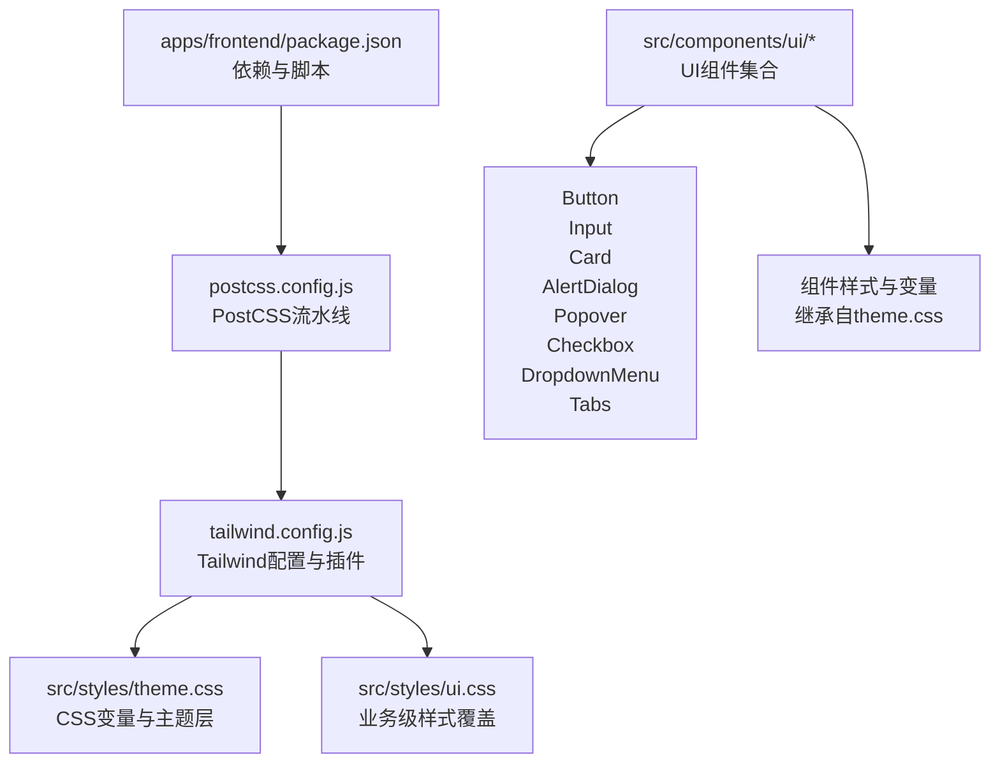
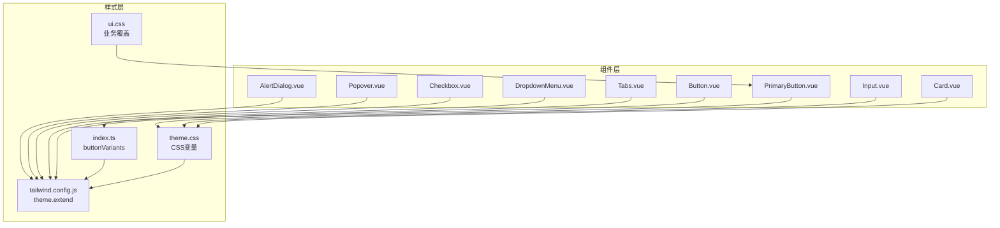
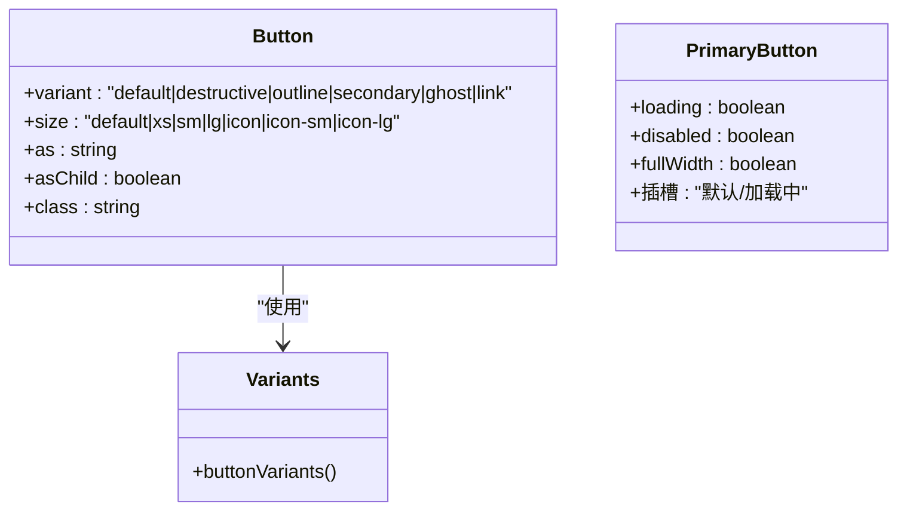
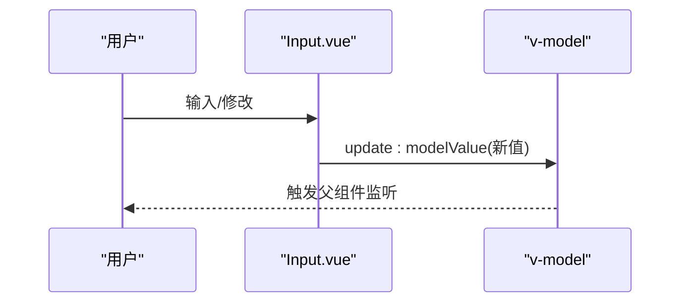
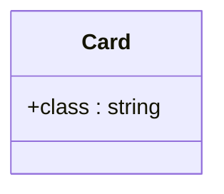
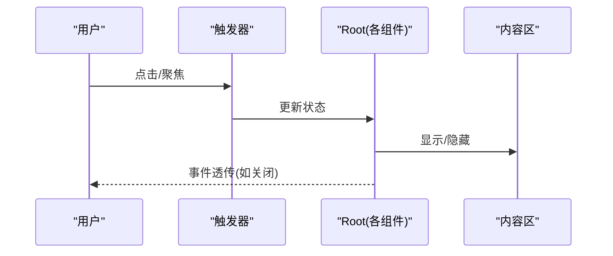
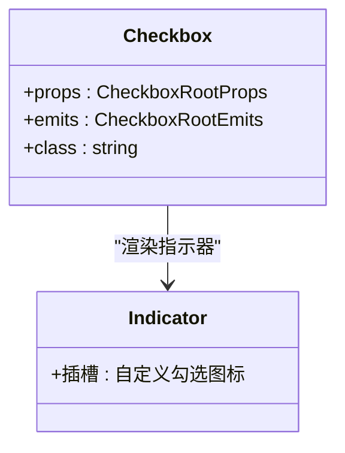
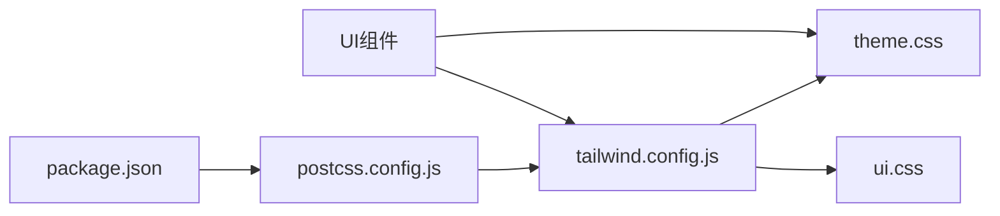

# UI组件库

<cite>
**本文引用的文件**
- [apps/frontend/package.json](file://apps/frontend/package.json)
- [apps/frontend/tailwind.config.js](file://apps/frontend/tailwind.config.js)
- [apps/frontend/postcss.config.js](file://apps/frontend/postcss.config.js)
- [apps/frontend/src/styles/theme.css](file://apps/frontend/src/styles/theme.css)
- [apps/frontend/src/styles/ui.css](file://apps/frontend/src/styles/ui.css)
- [apps/frontend/src/components/ui/button/Button.vue](file://apps/frontend/src/components/ui/button/Button.vue)
- [apps/frontend/src/components/ui/button/index.ts](file://apps/frontend/src/components/ui/button/index.ts)
- [apps/frontend/src/components/ui/button/PrimaryButton.vue](file://apps/frontend/src/components/ui/button/PrimaryButton.vue)
- [apps/frontend/src/components/ui/input/Input.vue](file://apps/frontend/src/components/ui/input/Input.vue)
- [apps/frontend/src/components/ui/card/Card.vue](file://apps/frontend/src/components/ui/card/Card.vue)
- [apps/frontend/src/components/ui/alert-dialog/AlertDialog.vue](file://apps/frontend/src/components/ui/alert-dialog/AlertDialog.vue)
- [apps/frontend/src/components/ui/popover/Popover.vue](file://apps/frontend/src/components/ui/popover/Popover.vue)
- [apps/frontend/src/components/ui/checkbox/Checkbox.vue](file://apps/frontend/src/components/ui/checkbox/Checkbox.vue)
- [apps/frontend/src/components/ui/dropdown-menu/DropdownMenu.vue](file://apps/frontend/src/components/ui/dropdown-menu/DropdownMenu.vue)
- [apps/frontend/src/components/ui/tabs/Tabs.vue](file://apps/frontend/src/components/ui/tabs/Tabs.vue)
</cite>

## 目录

1. [简介](#简介)
2. [项目结构](#项目结构)
3. [核心组件](#核心组件)
4. [架构总览](#架构总览)
5. [组件详解](#组件详解)
6. [依赖关系分析](#依赖关系分析)
7. [性能考量](#性能考量)
8. [故障排查指南](#故障排查指南)
9. [结论](#结论)
10. [附录](#附录)

## 简介

本文件面向Lumina Todo前端UI组件库，系统梳理自定义UI组件的设计理念、实现策略与最佳实践。内容涵盖Tailwind CSS配置与主题系统、样式体系与变量、组件属性与事件、插槽使用、响应式与暗色模式支持、无障碍访问、样式覆盖与CSS变量、动画效果，以及使用指南、定制方法与扩展策略。目标是帮助开发者快速理解并高效使用组件库，同时安全地进行二次定制与扩展。

## 项目结构

前端工程位于apps/frontend，采用Vite+Vue3+TypeScript技术栈，构建工具链包括Tailwind CSS、PostCSS、Autoprefixer等。样式系统由CSS变量驱动，并通过Tailwind的theme.extend映射到原子类，确保一致性与可维护性。

图示来源

- [apps/frontend/package.json:1-105](file://apps/frontend/package.json#L1-L105)
- [apps/frontend/postcss.config.js:1-8](file://apps/frontend/postcss.config.js#L1-L8)
- [apps/frontend/tailwind.config.js:1-303](file://apps/frontend/tailwind.config.js#L1-L303)
- [apps/frontend/src/styles/theme.css:1-170](file://apps/frontend/src/styles/theme.css#L1-L170)
- [apps/frontend/src/styles/ui.css:1-89](file://apps/frontend/src/styles/ui.css#L1-L89)

章节来源

- [apps/frontend/package.json:1-105](file://apps/frontend/package.json#L1-L105)
- [apps/frontend/postcss.config.js:1-8](file://apps/frontend/postcss.config.js#L1-L8)
- [apps/frontend/tailwind.config.js:1-303](file://apps/frontend/tailwind.config.js#L1-L303)
- [apps/frontend/src/styles/theme.css:1-170](file://apps/frontend/src/styles/theme.css#L1-L170)
- [apps/frontend/src/styles/ui.css:1-89](file://apps/frontend/src/styles/ui.css#L1-L89)

## 核心组件

- 组件基础：所有组件均基于reka-ui的语义化原语（Primitive）封装，统一转发属性与事件，保证可组合性与可访问性。
- 样式系统：通过class-variance-authority定义variants，结合Tailwind原子类与CSS变量，实现一致的外观与行为。
- 通用工具：cn函数用于合并类名，确保默认类与用户传入类的有序拼接。
- 无障碍：组件遵循ARIA与键盘导航约定，事件透传满足可访问性要求。

章节来源

- [apps/frontend/src/components/ui/button/Button.vue:1-32](file://apps/frontend/src/components/ui/button/Button.vue#L1-L32)
- [apps/frontend/src/components/ui/button/index.ts:1-38](file://apps/frontend/src/components/ui/button/index.ts#L1-L38)
- [apps/frontend/src/components/ui/input/Input.vue:1-42](file://apps/frontend/src/components/ui/input/Input.vue#L1-L42)
- [apps/frontend/src/components/ui/card/Card.vue:1-15](file://apps/frontend/src/components/ui/card/Card.vue#L1-L15)

## 架构总览

下图展示UI组件与样式系统的整体关系：组件通过cva生成variants类，再由cn合并；Tailwind从theme.css读取CSS变量，最终渲染为原子类；业务样式ui.css在必要时对特定场景进行覆盖。

图示来源

- [apps/frontend/src/components/ui/button/Button.vue:1-32](file://apps/frontend/src/components/ui/button/Button.vue#L1-L32)
- [apps/frontend/src/components/ui/button/index.ts:1-38](file://apps/frontend/src/components/ui/button/index.ts#L1-L38)
- [apps/frontend/src/components/ui/button/PrimaryButton.vue:1-62](file://apps/frontend/src/components/ui/button/PrimaryButton.vue#L1-L62)
- [apps/frontend/src/components/ui/input/Input.vue:1-42](file://apps/frontend/src/components/ui/input/Input.vue#L1-L42)
- [apps/frontend/src/components/ui/card/Card.vue:1-15](file://apps/frontend/src/components/ui/card/Card.vue#L1-L15)
- [apps/frontend/src/components/ui/alert-dialog/AlertDialog.vue:1-16](file://apps/frontend/src/components/ui/alert-dialog/AlertDialog.vue#L1-L16)
- [apps/frontend/src/components/ui/popover/Popover.vue:1-20](file://apps/frontend/src/components/ui/popover/Popover.vue#L1-L20)
- [apps/frontend/src/components/ui/checkbox/Checkbox.vue:1-34](file://apps/frontend/src/components/ui/checkbox/Checkbox.vue#L1-L34)
- [apps/frontend/src/components/ui/dropdown-menu/DropdownMenu.vue:1-16](file://apps/frontend/src/components/ui/dropdown-menu/DropdownMenu.vue#L1-L16)
- [apps/frontend/src/components/ui/tabs/Tabs.vue:1-16](file://apps/frontend/src/components/ui/tabs/Tabs.vue#L1-L16)
- [apps/frontend/src/styles/theme.css:1-170](file://apps/frontend/src/styles/theme.css#L1-L170)
- [apps/frontend/src/styles/ui.css:1-89](file://apps/frontend/src/styles/ui.css#L1-L89)
- [apps/frontend/tailwind.config.js:1-303](file://apps/frontend/tailwind.config.js#L1-L303)

## 组件详解

### Button 与 PrimaryButton

- 设计理念：Button提供标准variants与尺寸，PrimaryButton强调品牌态与动效，二者共享主题色与阴影变量，确保风格一致。
- 属性设计：
  - Button：支持variant、size、as、asChild、class等，通过cva与cn组合生成最终类。
  - PrimaryButton：支持loading、disabled、fullWidth，内置加载态与渐变闪光动画。
- 事件与插槽：Button透传原生事件；PrimaryButton提供默认插槽与loading命名插槽。
- 样式要点：PrimaryButton使用CSS变量--primary-rgb实现动态阴影，动画通过keyframes与Tailwind keyframes组合。

图示来源

- [apps/frontend/src/components/ui/button/Button.vue:1-32](file://apps/frontend/src/components/ui/button/Button.vue#L1-L32)
- [apps/frontend/src/components/ui/button/index.ts:1-38](file://apps/frontend/src/components/ui/button/index.ts#L1-L38)
- [apps/frontend/src/components/ui/button/PrimaryButton.vue:1-62](file://apps/frontend/src/components/ui/button/PrimaryButton.vue#L1-L62)

章节来源

- [apps/frontend/src/components/ui/button/Button.vue:1-32](file://apps/frontend/src/components/ui/button/Button.vue#L1-L32)
- [apps/frontend/src/components/ui/button/index.ts:1-38](file://apps/frontend/src/components/ui/button/index.ts#L1-L38)
- [apps/frontend/src/components/ui/button/PrimaryButton.vue:1-62](file://apps/frontend/src/components/ui/button/PrimaryButton.vue#L1-L62)

### Input

- 设计理念：基于v-model双向绑定与useVModel，自动注入id与name，支持原生属性透传，保证可访问性与易用性。
- 属性与事件：支持defaultValue、modelValue、class、id、name；发出update:modelValue事件；通过$attrs透传原生input属性。
- 样式要点：继承边框、背景、占位符、焦点环等原子类，与CSS变量保持一致。

图示来源

- [apps/frontend/src/components/ui/input/Input.vue:1-42](file://apps/frontend/src/components/ui/input/Input.vue#L1-L42)

章节来源

- [apps/frontend/src/components/ui/input/Input.vue:1-42](file://apps/frontend/src/components/ui/input/Input.vue#L1-L42)

### Card

- 设计理念：最小可用容器，统一圆角、边框、阴影与背景色，适配卡片型布局。
- 使用建议：配合CardHeader、CardContent、CardTitle、CardDescription、CardFooter进行内容分层。

图示来源

- [apps/frontend/src/components/ui/card/Card.vue:1-15](file://apps/frontend/src/components/ui/card/Card.vue#L1-L15)

章节来源

- [apps/frontend/src/components/ui/card/Card.vue:1-15](file://apps/frontend/src/components/ui/card/Card.vue#L1-L15)

### AlertDialog、Popover、DropdownMenu、Tabs

- 设计理念：均基于reka-ui的Root组件，通过useForwardPropsEmits透传props与emits，保持与原语一致的API与可访问性。
- 使用建议：根据交互场景选择合适的触发器与内容容器，注意层级与焦点管理。

图示来源

- [apps/frontend/src/components/ui/alert-dialog/AlertDialog.vue:1-16](file://apps/frontend/src/components/ui/alert-dialog/AlertDialog.vue#L1-L16)
- [apps/frontend/src/components/ui/popover/Popover.vue:1-20](file://apps/frontend/src/components/ui/popover/Popover.vue#L1-L20)
- [apps/frontend/src/components/ui/dropdown-menu/DropdownMenu.vue:1-16](file://apps/frontend/src/components/ui/dropdown-menu/DropdownMenu.vue#L1-L16)
- [apps/frontend/src/components/ui/tabs/Tabs.vue:1-16](file://apps/frontend/src/components/ui/tabs/Tabs.vue#L1-L16)

章节来源

- [apps/frontend/src/components/ui/alert-dialog/AlertDialog.vue:1-16](file://apps/frontend/src/components/ui/alert-dialog/AlertDialog.vue#L1-L16)
- [apps/frontend/src/components/ui/popover/Popover.vue:1-20](file://apps/frontend/src/components/ui/popover/Popover.vue#L1-L20)
- [apps/frontend/src/components/ui/dropdown-menu/DropdownMenu.vue:1-16](file://apps/frontend/src/components/ui/dropdown-menu/DropdownMenu.vue#L1-L16)
- [apps/frontend/src/components/ui/tabs/Tabs.vue:1-16](file://apps/frontend/src/components/ui/tabs/Tabs.vue#L1-L16)

### Checkbox

- 设计理念：基于CheckboxRoot与Indicator，支持自定义指示器图标，统一尺寸与状态样式。
- 使用建议：通过data-state控制选中态，结合label实现无障碍点击区域。

图示来源

- [apps/frontend/src/components/ui/checkbox/Checkbox.vue:1-34](file://apps/frontend/src/components/ui/checkbox/Checkbox.vue#L1-L34)

章节来源

- [apps/frontend/src/components/ui/checkbox/Checkbox.vue:1-34](file://apps/frontend/src/components/ui/checkbox/Checkbox.vue#L1-L34)

## 依赖关系分析

- 构建链路：package.json声明依赖，postcss.config.js串联postcss-import、tailwindcss、autoprefixer；tailwind.config.js定义content、theme.extend与插件。
- 样式链路：theme.css提供CSS变量与暗色模式；ui.css在必要时进行局部覆盖；组件通过cva与cn消费变量与原子类。
- 组件链路：各组件统一基于reka-ui原语，通过useForwardPropsEmits保持API一致性与可访问性。

图示来源

- [apps/frontend/package.json:1-105](file://apps/frontend/package.json#L1-L105)
- [apps/frontend/postcss.config.js:1-8](file://apps/frontend/postcss.config.js#L1-L8)
- [apps/frontend/tailwind.config.js:1-303](file://apps/frontend/tailwind.config.js#L1-L303)
- [apps/frontend/src/styles/theme.css:1-170](file://apps/frontend/src/styles/theme.css#L1-L170)
- [apps/frontend/src/styles/ui.css:1-89](file://apps/frontend/src/styles/ui.css#L1-L89)

章节来源

- [apps/frontend/package.json:1-105](file://apps/frontend/package.json#L1-L105)
- [apps/frontend/postcss.config.js:1-8](file://apps/frontend/postcss.config.js#L1-L8)
- [apps/frontend/tailwind.config.js:1-303](file://apps/frontend/tailwind.config.js#L1-L303)
- [apps/frontend/src/styles/theme.css:1-170](file://apps/frontend/src/styles/theme.css#L1-L170)
- [apps/frontend/src/styles/ui.css:1-89](file://apps/frontend/src/styles/ui.css#L1-L89)

## 性能考量

- 全局过渡优化：theme.css对常用属性设置过渡，同时提供.no-transition排除列表，避免Canvas、图表等高频重绘元素参与过渡。
- GPU加速：提供.scroll-smooth-gpu辅助类，启用backface-visibility、perspective与will-change，提升滚动与动画性能。
- 动画策略：使用Tailwind keyframes与cubic-bezier曲线，减少复杂JS动画依赖，提高渲染效率。

章节来源

- [apps/frontend/src/styles/theme.css:143-169](file://apps/frontend/src/styles/theme.css#L143-L169)

## 故障排查指南

- 样式不生效
  - 检查tailwind.config.js的content路径是否包含组件目录。
  - 确认CSS变量已在:root与.dark中正确声明。
- 暗色模式异常
  - 确保切换逻辑正确写入或移除.dark类。
  - 检查变量覆盖顺序，优先使用--user-\*变量进行用户态定制。
- 动画抖动或卡顿
  - 使用.scroll-smooth-gpu辅助类。
  - 避免对大量DOM节点强制同步布局。
- 可访问性问题
  - 确保按钮、输入框、对话框等具备正确的aria属性与键盘可达性。
  - 对复选框、下拉菜单等组件，使用原语提供的data-state与事件回调。

章节来源

- [apps/frontend/tailwind.config.js:6-13](file://apps/frontend/tailwind.config.js#L6-L13)
- [apps/frontend/src/styles/theme.css:1-170](file://apps/frontend/src/styles/theme.css#L1-L170)

## 结论

Lumina Todo前端UI组件库以CSS变量为核心，结合Tailwind CSS与class-variance-authority，实现了高内聚、低耦合且高度可定制的样式体系。组件基于reka-ui原语，统一了API与可访问性，辅以合理的动画与性能优化策略，既满足产品风格一致性，又便于二次扩展与维护。

## 附录

### Tailwind CSS配置与主题定制

- 内容扫描：包含index.html、src/**/\*.{vue,js,ts,jsx,tsx}、components/**/_.{vue,js,ts,jsx,tsx}、views/\*\*/_.{vue,js,ts,jsx,tsx}、pages/\*_/_.{vue,js,ts,jsx,tsx}。
- 响应式断点：xs至3xl，与UnoCSS保持一致，便于跨端一致性。
- 主题扩展：colors、fontFamily、borderRadius、boxShadow、backdropBlur、spacing、min/maxHeight/Width、zIndex、transitionTimingFunction、keyframes与animation。
- 插件：tailwindcss-animate与自定义animate-sparkle、animate-pulse-custom工具类。

章节来源

- [apps/frontend/tailwind.config.js:6-303](file://apps/frontend/tailwind.config.js#L6-L303)

### 样式系统与CSS变量

- 变量层：theme.css定义:root与.dark两套变量，覆盖background、foreground、primary、secondary、muted、accent、destructive、border、input、ring、圆角、图表色、文本语义色、AI相关变量等。
- 过渡与性能：全局过渡与.no-transition排除规则；.scroll-smooth-gpu辅助类。
- 业务覆盖：ui.css针对AI聊天气泡、输入框、移动端适配等进行变量化与响应式覆盖。

章节来源

- [apps/frontend/src/styles/theme.css:1-170](file://apps/frontend/src/styles/theme.css#L1-L170)
- [apps/frontend/src/styles/ui.css:1-89](file://apps/frontend/src/styles/ui.css#L1-L89)

### 组件属性、事件与插槽清单

- Button
  - 属性：variant、size、as、asChild、class
  - 事件：透传原生事件
  - 插槽：默认插槽
- PrimaryButton
  - 属性：loading、disabled、fullWidth
  - 插槽：默认插槽、loading命名插槽
- Input
  - 属性：defaultValue、modelValue、class、id、name
  - 事件：update:modelValue
  - 插槽：无
- Card
  - 属性：class
  - 插槽：默认插槽
- AlertDialog/Popover/DropdownMenu/Tabs
  - 属性：透传RootProps
  - 事件：透传RootEmits
  - 插槽：默认插槽

章节来源

- [apps/frontend/src/components/ui/button/Button.vue:1-32](file://apps/frontend/src/components/ui/button/Button.vue#L1-L32)
- [apps/frontend/src/components/ui/button/PrimaryButton.vue:1-62](file://apps/frontend/src/components/ui/button/PrimaryButton.vue#L1-L62)
- [apps/frontend/src/components/ui/input/Input.vue:1-42](file://apps/frontend/src/components/ui/input/Input.vue#L1-L42)
- [apps/frontend/src/components/ui/card/Card.vue:1-15](file://apps/frontend/src/components/ui/card/Card.vue#L1-L15)
- [apps/frontend/src/components/ui/alert-dialog/AlertDialog.vue:1-16](file://apps/frontend/src/components/ui/alert-dialog/AlertDialog.vue#L1-L16)
- [apps/frontend/src/components/ui/popover/Popover.vue:1-20](file://apps/frontend/src/components/ui/popover/Popover.vue#L1-L20)
- [apps/frontend/src/components/ui/dropdown-menu/DropdownMenu.vue:1-16](file://apps/frontend/src/components/ui/dropdown-menu/DropdownMenu.vue#L1-L16)
- [apps/frontend/src/components/ui/tabs/Tabs.vue:1-16](file://apps/frontend/src/components/ui/tabs/Tabs.vue#L1-L16)

### 响应式设计与暗色模式

- 响应式断点：xs至3xl，适配移动端与桌面端。
- 暗色模式：基于class开关，dark类下变量重新赋值，确保对比度与视觉舒适度。
- 移动端适配：ui.css在max-width: 640px下调整气泡间距、输入框字体与行高、图标尺寸等。

章节来源

- [apps/frontend/tailwind.config.js:16-24](file://apps/frontend/tailwind.config.js#L16-L24)
- [apps/frontend/src/styles/theme.css:91-141](file://apps/frontend/src/styles/theme.css#L91-L141)
- [apps/frontend/src/styles/ui.css:58-88](file://apps/frontend/src/styles/ui.css#L58-L88)

### 无障碍访问支持

- 原语透传：组件通过useForwardPropsEmits将props与emits透传，确保键盘导航与屏幕阅读器可用。
- 状态与指示：Checkbox等组件使用data-state表达选中态，便于样式与可访问性联动。
- 建议：为按钮、输入、对话框等补充aria-label/aria-describedby等属性，确保上下文清晰。

章节来源

- [apps/frontend/src/components/ui/checkbox/Checkbox.vue:1-34](file://apps/frontend/src/components/ui/checkbox/Checkbox.vue#L1-L34)
- [apps/frontend/src/components/ui/alert-dialog/AlertDialog.vue:1-16](file://apps/frontend/src/components/ui/alert-dialog/AlertDialog.vue#L1-L16)
- [apps/frontend/src/components/ui/popover/Popover.vue:1-20](file://apps/frontend/src/components/ui/popover/Popover.vue#L1-L20)
- [apps/frontend/src/components/ui/dropdown-menu/DropdownMenu.vue:1-16](file://apps/frontend/src/components/ui/dropdown-menu/DropdownMenu.vue#L1-L16)
- [apps/frontend/src/components/ui/tabs/Tabs.vue:1-16](file://apps/frontend/src/components/ui/tabs/Tabs.vue#L1-L16)

### 样式覆盖、CSS变量与动画

- 样式覆盖：ui.css通过CSS变量与媒体查询对AI聊天、输入框等进行局部覆盖，避免全局污染。
- CSS变量：theme.css集中管理颜色、字体、圆角、阴影、过渡等，PrimaryButton使用--primary-rgb实现动态阴影。
- 动画效果：Tailwind keyframes与cubic-bezier曲线定义平滑动画，插件新增animate-sparkle与animate-pulse-custom工具类。

章节来源

- [apps/frontend/src/styles/ui.css:1-89](file://apps/frontend/src/styles/ui.css#L1-L89)
- [apps/frontend/src/styles/theme.css:14-89](file://apps/frontend/src/styles/theme.css#L14-L89)
- [apps/frontend/tailwind.config.js:241-286](file://apps/frontend/tailwind.config.js#L241-L286)
- [apps/frontend/tailwind.config.js:289-301](file://apps/frontend/tailwind.config.js#L289-L301)

### 使用指南、定制方法与扩展策略

- 使用指南
  - 引入组件：从对应目录导入组件与index导出。
  - 属性与事件：按组件清单传参与监听事件。
  - 插槽：根据组件支持情况使用默认或命名插槽。
- 定制方法
  - 主题定制：通过--user-\*变量覆盖默认值，实现品牌色与用户偏好。
  - 样式覆盖：在ui.css中添加或调整变量与媒体查询规则。
  - Tailwind扩展：在tailwind.config.js的theme.extend中新增颜色、尺寸、动画等。
- 扩展策略
  - 新增组件：参考Button/PrimaryButton的cva与cn模式，保持与reka-ui原语一致的API。
  - 动画与过渡：优先使用Tailwind keyframes与cubic-bezier，减少JS动画。
  - 可访问性：始终透传事件与状态，提供aria属性与键盘导航支持。

章节来源

- [apps/frontend/src/components/ui/button/index.ts:1-38](file://apps/frontend/src/components/ui/button/index.ts#L1-L38)
- [apps/frontend/src/styles/theme.css:14-89](file://apps/frontend/src/styles/theme.css#L14-L89)
- [apps/frontend/src/styles/ui.css:1-89](file://apps/frontend/src/styles/ui.css#L1-L89)
- [apps/frontend/tailwind.config.js:32-287](file://apps/frontend/tailwind.config.js#L32-L287)
