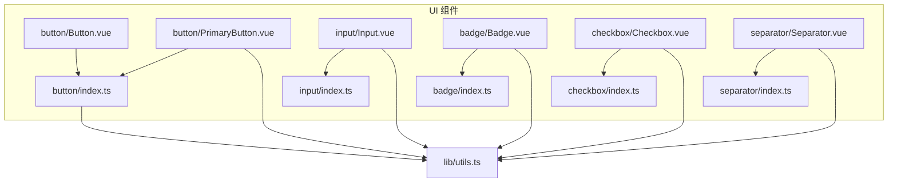
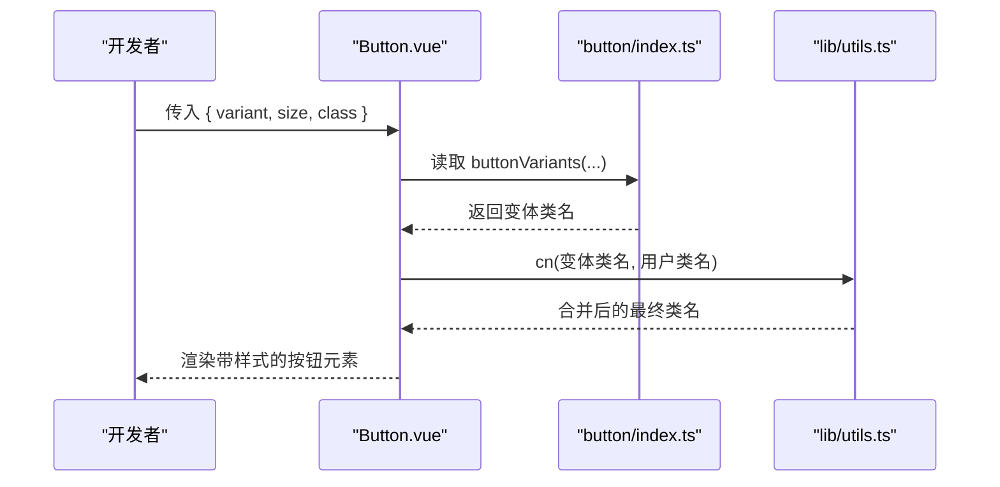
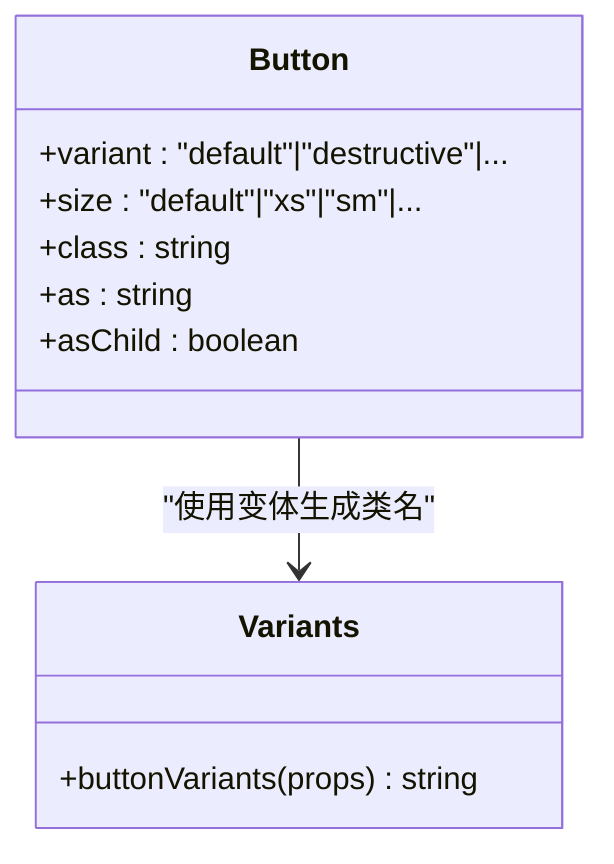
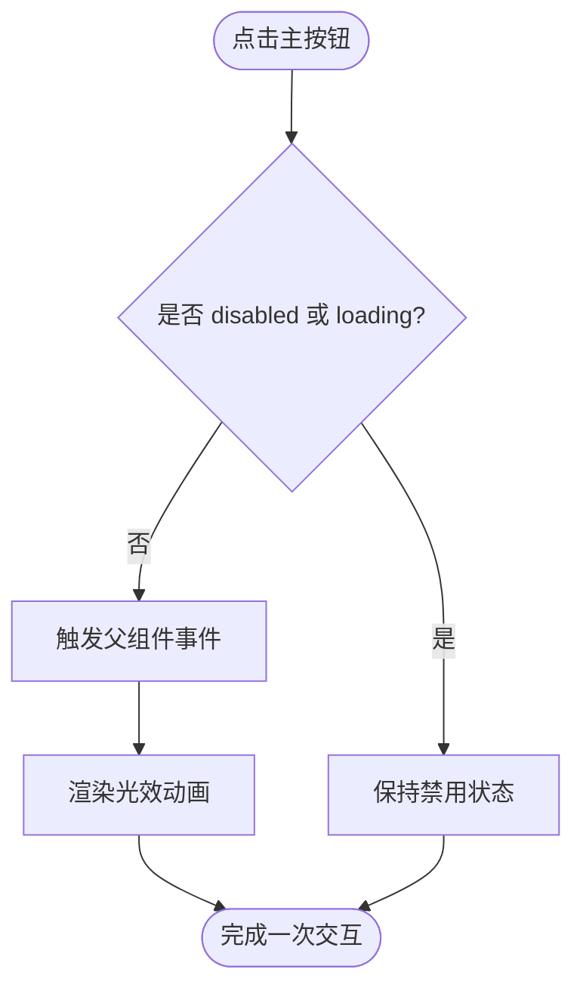
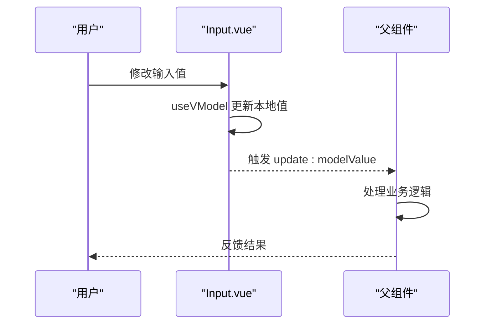
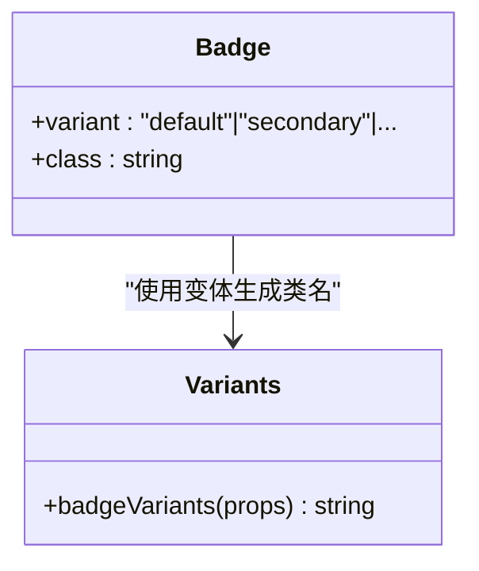
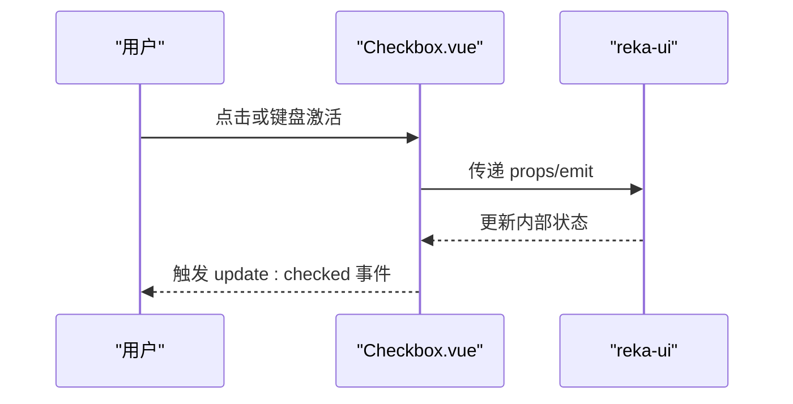
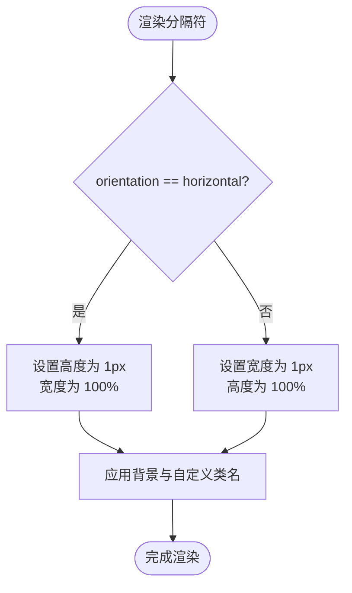
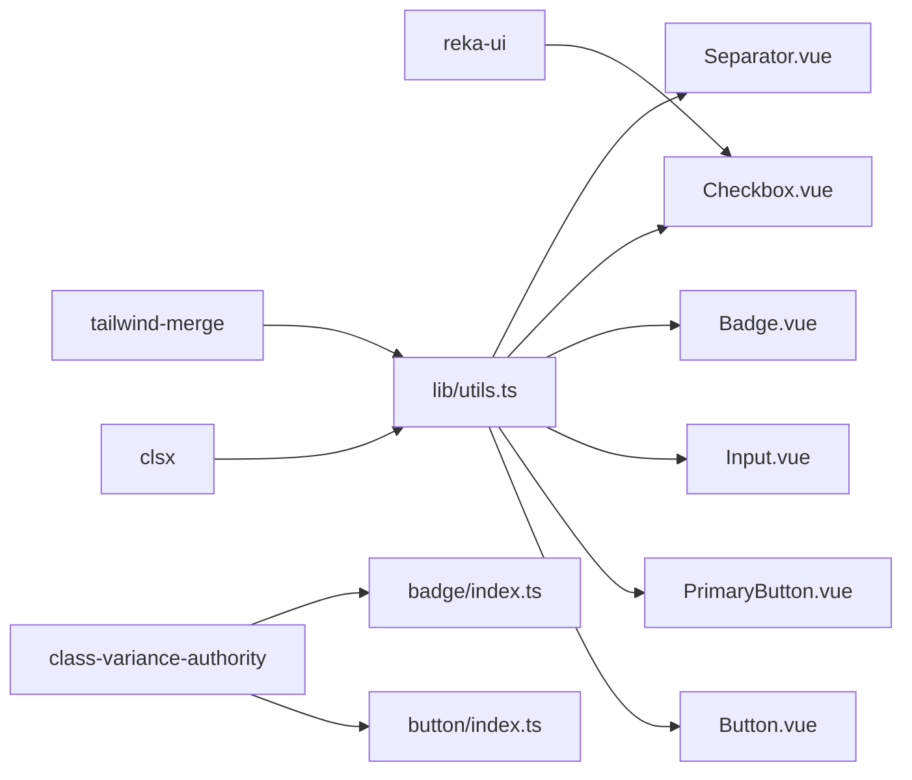

# 基础组件

<cite>
**本文引用的文件**
- [apps/frontend/src/components/ui/button/Button.vue](file://apps/frontend/src/components/ui/button/Button.vue)
- [apps/frontend/src/components/ui/button/index.ts](file://apps/frontend/src/components/ui/button/index.ts)
- [apps/frontend/src/components/ui/button/PrimaryButton.vue](file://apps/frontend/src/components/ui/button/PrimaryButton.vue)
- [apps/frontend/src/components/ui/input/Input.vue](file://apps/frontend/src/components/ui/input/Input.vue)
- [apps/frontend/src/components/ui/input/index.ts](file://apps/frontend/src/components/ui/input/index.ts)
- [apps/frontend/src/components/ui/badge/Badge.vue](file://apps/frontend/src/components/ui/badge/Badge.vue)
- [apps/frontend/src/components/ui/badge/index.ts](file://apps/frontend/src/components/ui/badge/index.ts)
- [apps/frontend/src/components/ui/checkbox/Checkbox.vue](file://apps/frontend/src/components/ui/checkbox/Checkbox.vue)
- [apps/frontend/src/components/ui/checkbox/index.ts](file://apps/frontend/src/components/ui/checkbox/index.ts)
- [apps/frontend/src/components/ui/separator/Separator.vue](file://apps/frontend/src/components/ui/separator/Separator.vue)
- [apps/frontend/src/components/ui/separator/index.ts](file://apps/frontend/src/components/ui/separator/index.ts)
- [apps/frontend/src/lib/utils.ts](file://apps/frontend/src/lib/utils.ts)
</cite>

## 目录

1. [简介](#简介)
2. [项目结构](#项目结构)
3. [核心组件](#核心组件)
4. [架构总览](#架构总览)
5. [详细组件分析](#详细组件分析)
6. [依赖关系分析](#依赖关系分析)
7. [性能考量](#性能考量)
8. [故障排查指南](#故障排查指南)
9. [结论](#结论)
10. [附录](#附录)

## 简介

本章节面向基础UI组件的使用与扩展，聚焦以下组件：按钮（Button）、输入框（Input）、徽章（Badge）、复选框（Checkbox）与分隔符（Separator）。文档从设计理念、属性配置、事件处理、样式定制、可访问性与响应式行为等方面进行系统阐述，并提供组合使用与最佳实践建议。

## 项目结构

基础组件位于前端应用的 UI 组件目录下，采用按功能模块划分的组织方式，便于按需引入与主题化扩展。各组件均通过统一的工具函数进行类名合并与样式拼装，确保一致的外观与行为。

图表来源

- [apps/frontend/src/components/ui/button/Button.vue:1-32](file://apps/frontend/src/components/ui/button/Button.vue#L1-L32)
- [apps/frontend/src/components/ui/button/index.ts:1-38](file://apps/frontend/src/components/ui/button/index.ts#L1-L38)
- [apps/frontend/src/components/ui/button/PrimaryButton.vue:1-62](file://apps/frontend/src/components/ui/button/PrimaryButton.vue#L1-L62)
- [apps/frontend/src/components/ui/input/Input.vue:1-42](file://apps/frontend/src/components/ui/input/Input.vue#L1-L42)
- [apps/frontend/src/components/ui/input/index.ts:1-2](file://apps/frontend/src/components/ui/input/index.ts#L1-L2)
- [apps/frontend/src/components/ui/badge/Badge.vue:1-18](file://apps/frontend/src/components/ui/badge/Badge.vue#L1-L18)
- [apps/frontend/src/components/ui/badge/index.ts:1-26](file://apps/frontend/src/components/ui/badge/index.ts#L1-L26)
- [apps/frontend/src/components/ui/checkbox/Checkbox.vue:1-34](file://apps/frontend/src/components/ui/checkbox/Checkbox.vue#L1-L34)
- [apps/frontend/src/components/ui/checkbox/index.ts:1-2](file://apps/frontend/src/components/ui/checkbox/index.ts#L1-L2)
- [apps/frontend/src/components/ui/separator/Separator.vue:1-29](file://apps/frontend/src/components/ui/separator/Separator.vue#L1-L29)
- [apps/frontend/src/components/ui/separator/index.ts:1-2](file://apps/frontend/src/components/ui/separator/index.ts#L1-L2)
- [apps/frontend/src/lib/utils.ts:1-33](file://apps/frontend/src/lib/utils.ts#L1-L33)

章节来源

- [apps/frontend/src/components/ui/button/Button.vue:1-32](file://apps/frontend/src/components/ui/button/Button.vue#L1-L32)
- [apps/frontend/src/components/ui/button/index.ts:1-38](file://apps/frontend/src/components/ui/button/index.ts#L1-L38)
- [apps/frontend/src/components/ui/button/PrimaryButton.vue:1-62](file://apps/frontend/src/components/ui/button/PrimaryButton.vue#L1-L62)
- [apps/frontend/src/components/ui/input/Input.vue:1-42](file://apps/frontend/src/components/ui/input/Input.vue#L1-L42)
- [apps/frontend/src/components/ui/input/index.ts:1-2](file://apps/frontend/src/components/ui/input/index.ts#L1-L2)
- [apps/frontend/src/components/ui/badge/Badge.vue:1-18](file://apps/frontend/src/components/ui/badge/Badge.vue#L1-L18)
- [apps/frontend/src/components/ui/badge/index.ts:1-26](file://apps/frontend/src/components/ui/badge/index.ts#L1-L26)
- [apps/frontend/src/components/ui/checkbox/Checkbox.vue:1-34](file://apps/frontend/src/components/ui/checkbox/Checkbox.vue#L1-L34)
- [apps/frontend/src/components/ui/checkbox/index.ts:1-2](file://apps/frontend/src/components/ui/checkbox/index.ts#L1-L2)
- [apps/frontend/src/components/ui/separator/Separator.vue:1-29](file://apps/frontend/src/components/ui/separator/Separator.vue#L1-L29)
- [apps/frontend/src/components/ui/separator/index.ts:1-2](file://apps/frontend/src/components/ui/separator/index.ts#L1-L2)
- [apps/frontend/src/lib/utils.ts:1-33](file://apps/frontend/src/lib/utils.ts#L1-L33)

## 核心组件

本节概述五个基础组件的设计理念与通用能力：

- 按钮（Button）：基于变体系统提供多种风格与尺寸，支持原生语义标签渲染与插槽内容。
- 输入框（Input）：双向绑定模型值，自动注入唯一 ID，支持透传原生属性与占位符。
- 徽章（Badge）：用于信息标记与状态提示，通过变体系统控制外观。
- 复选框（Checkbox）：基于 reka-ui 的可访问性控件，支持指示器与自定义图标。
- 分隔符（Separator）：水平或垂直分隔线，支持装饰性与方向控制。

章节来源

- [apps/frontend/src/components/ui/button/Button.vue:1-32](file://apps/frontend/src/components/ui/button/Button.vue#L1-L32)
- [apps/frontend/src/components/ui/input/Input.vue:1-42](file://apps/frontend/src/components/ui/input/Input.vue#L1-L42)
- [apps/frontend/src/components/ui/badge/Badge.vue:1-18](file://apps/frontend/src/components/ui/badge/Badge.vue#L1-L18)
- [apps/frontend/src/components/ui/checkbox/Checkbox.vue:1-34](file://apps/frontend/src/components/ui/checkbox/Checkbox.vue#L1-L34)
- [apps/frontend/src/components/ui/separator/Separator.vue:1-29](file://apps/frontend/src/components/ui/separator/Separator.vue#L1-L29)

## 架构总览

组件层采用“声明式 Props + 变体系统 + 工具函数”的统一模式：

- Props 定义：集中于组件文件顶部，明确默认值与类型约束。
- 变体系统：通过 class-variance-authority 定义 variant/size 组合，生成稳定类名。
- 工具函数：使用 clsx 与 tailwind-merge 合并类名，避免冲突与冗余。
- 可访问性：复选框等控件直接复用 reka-ui 提供的无障碍能力。
- 插槽与透传：按钮与输入框支持默认插槽；输入框透传原生属性到 DOM。

图表来源

- [apps/frontend/src/components/ui/button/Button.vue:1-32](file://apps/frontend/src/components/ui/button/Button.vue#L1-L32)
- [apps/frontend/src/components/ui/button/index.ts:1-38](file://apps/frontend/src/components/ui/button/index.ts#L1-L38)
- [apps/frontend/src/lib/utils.ts:1-33](file://apps/frontend/src/lib/utils.ts#L1-L33)

## 详细组件分析

### 按钮（Button）

- 设计理念
  - 通过变体系统提供多风格与多尺寸，满足不同交互层级与视觉权重。
  - 支持 as/asChild 渲染任意语义标签，兼顾可访问性与语义正确性。
- 属性配置
  - variant: 变体类型（如 default、destructive、outline、secondary、ghost、link）。
  - size: 尺寸类型（如 default、xs、sm、lg、icon、icon-sm、icon-lg）。
  - class: 自定义类名追加。
  - as/asChild: 控制根元素类型与子节点透传。
- 事件处理
  - 无内置事件，遵循原生按钮行为；可通过外层容器或父组件绑定点击事件。
- 样式定制
  - 使用变体生成类名，再与用户传入 class 合并，保证覆盖优先级。
- 使用场景
  - 表单提交、操作入口、导航触发、辅助动作等。
- 代码示例路径
  - [apps/frontend/src/components/ui/button/Button.vue:1-32](file://apps/frontend/src/components/ui/button/Button.vue#L1-L32)
  - [apps/frontend/src/components/ui/button/index.ts:1-38](file://apps/frontend/src/components/ui/button/index.ts#L1-L38)

图表来源

- [apps/frontend/src/components/ui/button/Button.vue:1-32](file://apps/frontend/src/components/ui/button/Button.vue#L1-L32)
- [apps/frontend/src/components/ui/button/index.ts:1-38](file://apps/frontend/src/components/ui/button/index.ts#L1-L38)

章节来源

- [apps/frontend/src/components/ui/button/Button.vue:1-32](file://apps/frontend/src/components/ui/button/Button.vue#L1-L32)
- [apps/frontend/src/components/ui/button/index.ts:1-38](file://apps/frontend/src/components/ui/button/index.ts#L1-L38)

### 主按钮（PrimaryButton）

- 设计理念
  - 强视觉强调的主操作按钮，内置加载态与全宽布局选项，适合关键流程。
- 属性配置
  - loading: 显示加载动画与禁用交互。
  - disabled: 禁用按钮。
  - fullWidth: 宽度铺满容器。
- 事件处理
  - 无内置事件，推荐在父组件中绑定点击事件。
- 样式定制
  - 内置渐变光效与阴影动画，支持通过 class 进一步覆盖。
- 使用场景
  - 登录、注册、提交表单等关键动作。
- 代码示例路径
  - [apps/frontend/src/components/ui/button/PrimaryButton.vue:1-62](file://apps/frontend/src/components/ui/button/PrimaryButton.vue#L1-L62)

图表来源

- [apps/frontend/src/components/ui/button/PrimaryButton.vue:1-62](file://apps/frontend/src/components/ui/button/PrimaryButton.vue#L1-L62)

章节来源

- [apps/frontend/src/components/ui/button/PrimaryButton.vue:1-62](file://apps/frontend/src/components/ui/button/PrimaryButton.vue#L1-L62)

### 输入框（Input）

- 设计理念
  - 基于 v-model 的受控输入，自动分配唯一 ID，支持 name、id 等原生属性透传。
- 属性配置
  - modelValue/defaultValue: 双向绑定值。
  - class: 自定义类名。
  - id/name: 标识与表单关联。
- 事件处理
  - update:modelValue: 值变更事件。
- 样式定制
  - 默认提供圆角、边框、阴影与焦点环等基础样式，可叠加自定义类名。
- 使用场景
  - 文本输入、数字输入、密码输入等。
- 代码示例路径
  - [apps/frontend/src/components/ui/input/Input.vue:1-42](file://apps/frontend/src/components/ui/input/Input.vue#L1-L42)
  - [apps/frontend/src/components/ui/input/index.ts:1-2](file://apps/frontend/src/components/ui/input/index.ts#L1-L2)

图表来源

- [apps/frontend/src/components/ui/input/Input.vue:1-42](file://apps/frontend/src/components/ui/input/Input.vue#L1-L42)

章节来源

- [apps/frontend/src/components/ui/input/Input.vue:1-42](file://apps/frontend/src/components/ui/input/Input.vue#L1-L42)
- [apps/frontend/src/components/ui/input/index.ts:1-2](file://apps/frontend/src/components/ui/input/index.ts#L1-L2)

### 徽章（Badge）

- 设计理念
  - 轻量级信息标记，支持多种变体与插槽内容。
- 属性配置
  - variant: 变体类型（default、secondary、destructive、outline）。
  - class: 自定义类名。
- 事件处理
  - 无内置事件，作为纯展示组件。
- 样式定制
  - 通过变体系统生成类名，支持追加自定义样式。
- 使用场景
  - 标签、状态、计数、分类等。
- 代码示例路径
  - [apps/frontend/src/components/ui/badge/Badge.vue:1-18](file://apps/frontend/src/components/ui/badge/Badge.vue#L1-L18)
  - [apps/frontend/src/components/ui/badge/index.ts:1-26](file://apps/frontend/src/components/ui/badge/index.ts#L1-L26)

图表来源

- [apps/frontend/src/components/ui/badge/Badge.vue:1-18](file://apps/frontend/src/components/ui/badge/Badge.vue#L1-L18)
- [apps/frontend/src/components/ui/badge/index.ts:1-26](file://apps/frontend/src/components/ui/badge/index.ts#L1-L26)

章节来源

- [apps/frontend/src/components/ui/badge/Badge.vue:1-18](file://apps/frontend/src/components/ui/badge/Badge.vue#L1-L18)
- [apps/frontend/src/components/ui/badge/index.ts:1-26](file://apps/frontend/src/components/ui/badge/index.ts#L1-L26)

### 复选框（Checkbox）

- 设计理念
  - 基于 reka-ui 的可访问性控件，支持指示器与自定义图标，符合无障碍标准。
- 属性配置
  - 支持 reka-ui 的 CheckboxRootProps，如 checked/disabled 等。
  - class: 自定义类名。
- 事件处理
  - 支持 reka-ui 的 CheckboxRootEmits，如 update:checked。
- 样式定制
  - 默认提供尺寸、边框、焦点环与选中态样式，支持追加自定义类名。
- 使用场景
  - 协议勾选、批量选择、偏好设置等。
- 代码示例路径
  - [apps/frontend/src/components/ui/checkbox/Checkbox.vue:1-34](file://apps/frontend/src/components/ui/checkbox/Checkbox.vue#L1-L34)
  - [apps/frontend/src/components/ui/checkbox/index.ts:1-2](file://apps/frontend/src/components/ui/checkbox/index.ts#L1-L2)

图表来源

- [apps/frontend/src/components/ui/checkbox/Checkbox.vue:1-34](file://apps/frontend/src/components/ui/checkbox/Checkbox.vue#L1-L34)

章节来源

- [apps/frontend/src/components/ui/checkbox/Checkbox.vue:1-34](file://apps/frontend/src/components/ui/checkbox/Checkbox.vue#L1-L34)
- [apps/frontend/src/components/ui/checkbox/index.ts:1-2](file://apps/frontend/src/components/ui/checkbox/index.ts#L1-L2)

### 分隔符（Separator）

- 设计理念
  - 提供水平与垂直两种方向的分隔线，支持装饰性与结构性区分。
- 属性配置
  - orientation: 方向（horizontal/vertical）。
  - decorative: 是否为装饰性分隔符。
  - class: 自定义类名。
- 事件处理
  - 无内置事件，作为纯展示组件。
- 样式定制
  - 根据方向动态计算高度/宽度与背景色，支持追加自定义类名。
- 使用场景
  - 列表项分隔、面板分区、菜单分组等。
- 代码示例路径
  - [apps/frontend/src/components/ui/separator/Separator.vue:1-29](file://apps/frontend/src/components/ui/separator/Separator.vue#L1-L29)
  - [apps/frontend/src/components/ui/separator/index.ts:1-2](file://apps/frontend/src/components/ui/separator/index.ts#L1-L2)

图表来源

- [apps/frontend/src/components/ui/separator/Separator.vue:1-29](file://apps/frontend/src/components/ui/separator/Separator.vue#L1-L29)

章节来源

- [apps/frontend/src/components/ui/separator/Separator.vue:1-29](file://apps/frontend/src/components/ui/separator/Separator.vue#L1-L29)
- [apps/frontend/src/components/ui/separator/index.ts:1-2](file://apps/frontend/src/components/ui/separator/index.ts#L1-L2)

## 依赖关系分析

- 组件间耦合
  - 各组件相对独立，仅通过工具函数与变体系统间接耦合。
- 外部依赖
  - reka-ui：提供可访问性控件与基础语义。
  - class-variance-authority：提供变体系统。
  - clsx/tailwind-merge：提供类名合并与去重。
- 潜在循环依赖
  - 未发现组件间循环导入。
- 集成点
  - 所有组件均通过 cn(...) 合并类名，确保样式一致性。

图表来源

- [apps/frontend/src/components/ui/button/index.ts:1-38](file://apps/frontend/src/components/ui/button/index.ts#L1-L38)
- [apps/frontend/src/components/ui/badge/index.ts:1-26](file://apps/frontend/src/components/ui/badge/index.ts#L1-L26)
- [apps/frontend/src/components/ui/checkbox/Checkbox.vue:1-34](file://apps/frontend/src/components/ui/checkbox/Checkbox.vue#L1-L34)
- [apps/frontend/src/components/ui/button/Button.vue:1-32](file://apps/frontend/src/components/ui/button/Button.vue#L1-L32)
- [apps/frontend/src/components/ui/button/PrimaryButton.vue:1-62](file://apps/frontend/src/components/ui/button/PrimaryButton.vue#L1-L62)
- [apps/frontend/src/components/ui/input/Input.vue:1-42](file://apps/frontend/src/components/ui/input/Input.vue#L1-L42)
- [apps/frontend/src/components/ui/badge/Badge.vue:1-18](file://apps/frontend/src/components/ui/badge/Badge.vue#L1-L18)
- [apps/frontend/src/components/ui/separator/Separator.vue:1-29](file://apps/frontend/src/components/ui/separator/Separator.vue#L1-L29)
- [apps/frontend/src/lib/utils.ts:1-33](file://apps/frontend/src/lib/utils.ts#L1-L33)

章节来源

- [apps/frontend/src/components/ui/button/index.ts:1-38](file://apps/frontend/src/components/ui/button/index.ts#L1-L38)
- [apps/frontend/src/components/ui/badge/index.ts:1-26](file://apps/frontend/src/components/ui/badge/index.ts#L1-L26)
- [apps/frontend/src/components/ui/checkbox/Checkbox.vue:1-34](file://apps/frontend/src/components/ui/checkbox/Checkbox.vue#L1-L34)
- [apps/frontend/src/components/ui/button/Button.vue:1-32](file://apps/frontend/src/components/ui/button/Button.vue#L1-L32)
- [apps/frontend/src/components/ui/button/PrimaryButton.vue:1-62](file://apps/frontend/src/components/ui/button/PrimaryButton.vue#L1-L62)
- [apps/frontend/src/components/ui/input/Input.vue:1-42](file://apps/frontend/src/components/ui/input/Input.vue#L1-L42)
- [apps/frontend/src/components/ui/badge/Badge.vue:1-18](file://apps/frontend/src/components/ui/badge/Badge.vue#L1-L18)
- [apps/frontend/src/components/ui/separator/Separator.vue:1-29](file://apps/frontend/src/components/ui/separator/Separator.vue#L1-L29)
- [apps/frontend/src/lib/utils.ts:1-33](file://apps/frontend/src/lib/utils.ts#L1-L33)

## 性能考量

- 类名合并
  - 使用 tailwind-merge 合并类名，避免重复与冲突，减少样式抖动。
- 变体系统
  - 通过预定义变体生成固定类名，降低运行时计算成本。
- 受控组件
  - 输入框使用 v-model 与被动更新策略，减少不必要的重渲染。
- 动画与特效
  - 主按钮的光效动画为静态样式，对性能影响极小；建议在需要时按需启用。

## 故障排查指南

- 输入框无法获得焦点
  - 检查是否被外部容器禁用或样式覆盖；确认未误用 disabled 属性。
- 复选框状态不更新
  - 确认父组件正确绑定 v-model 或监听 update:checked；检查是否被禁用。
- 按钮样式错乱
  - 检查是否同时传入了相互冲突的 variant/size；确认自定义 class 未覆盖关键样式。
- 分隔符方向错误
  - 确认 orientation 设置为 horizontal 或 vertical；检查父容器布局是否影响显示。
- 加载态按钮不可交互
  - loading 与 disabled 会同时禁用交互，确认业务逻辑是否正确切换状态。

章节来源

- [apps/frontend/src/components/ui/input/Input.vue:1-42](file://apps/frontend/src/components/ui/input/Input.vue#L1-L42)
- [apps/frontend/src/components/ui/checkbox/Checkbox.vue:1-34](file://apps/frontend/src/components/ui/checkbox/Checkbox.vue#L1-L34)
- [apps/frontend/src/components/ui/button/PrimaryButton.vue:1-62](file://apps/frontend/src/components/ui/button/PrimaryButton.vue#L1-L62)
- [apps/frontend/src/components/ui/separator/Separator.vue:1-29](file://apps/frontend/src/components/ui/separator/Separator.vue#L1-L29)

## 结论

上述基础组件以统一的变体系统与工具函数为基础，提供了高可定制性与强可访问性的 UI 原语。通过合理使用 Props、Slots 与事件回调，可在不同场景下快速构建一致且美观的界面。建议在团队内约定样式命名规范与主题变量，进一步提升组件复用与维护效率。

## 附录

- 最佳实践
  - 优先使用变体系统而非内联样式，确保主题一致性。
  - 对需要无障碍支持的控件（如复选框），遵循 reka-ui 的可访问性约定。
  - 输入类组件尽量提供明确的 id 与 label 关联，提升可访问性。
  - 组合使用时注意层级与间距，避免视觉拥挤。
- 组合示例思路
  - 表单：输入框 + 徽章（状态）+ 按钮（提交）+ 分隔符（分组）。
  - 设置页：复选框（开关）+ 徽章（新特性标识）+ 按钮（保存）。
  - 列表：徽章（计数）+ 分隔符（分段）+ 按钮（更多）。
