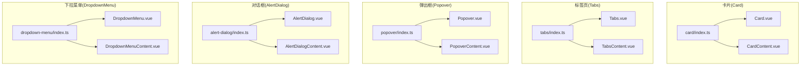
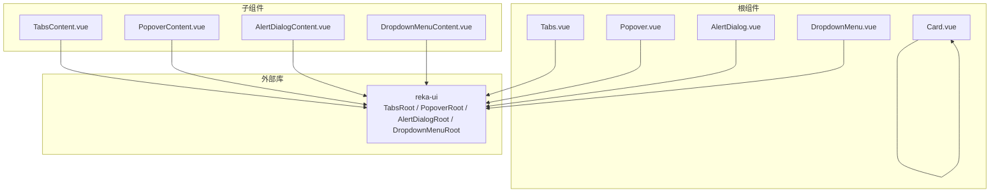
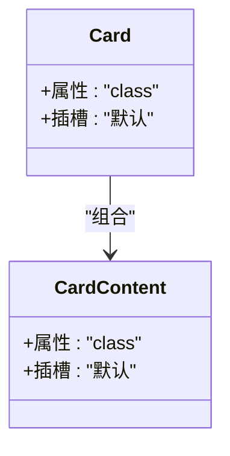
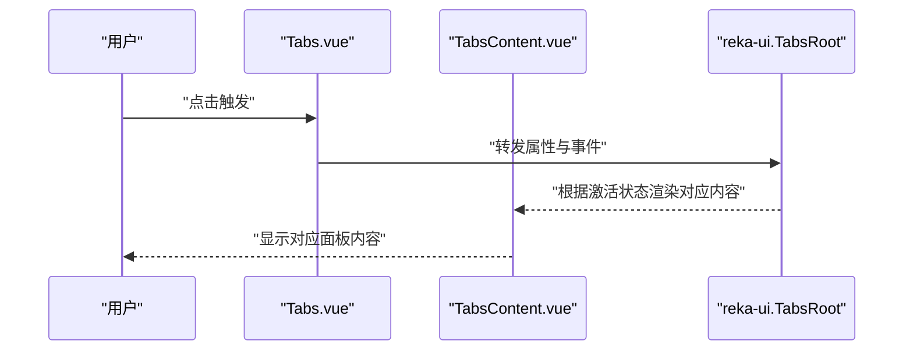
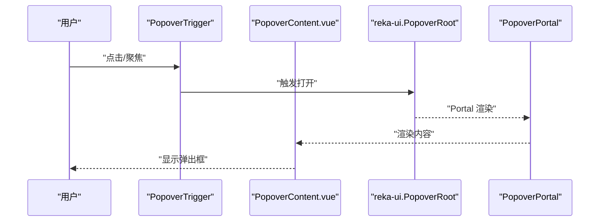
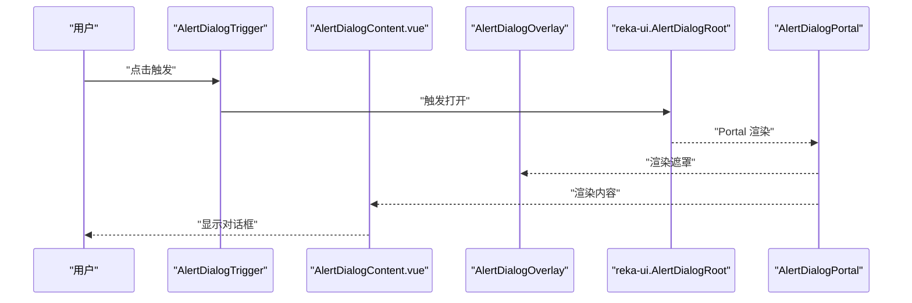
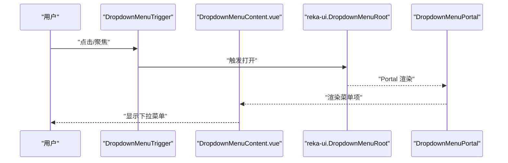
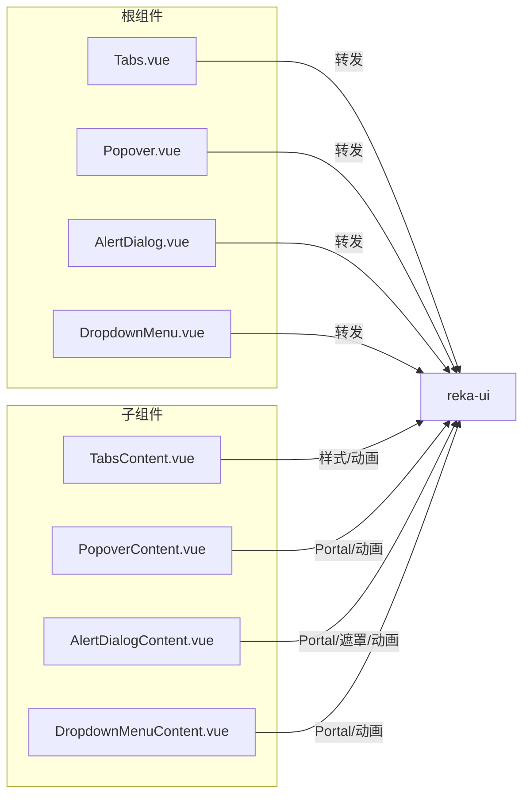

# 复合组件

<cite>
**本文引用的文件**
- [apps/frontend/src/components/ui/card/Card.vue](file://apps/frontend/src/components/ui/card/Card.vue)
- [apps/frontend/src/components/ui/card/CardContent.vue](file://apps/frontend/src/components/ui/card/CardContent.vue)
- [apps/frontend/src/components/ui/card/index.ts](file://apps/frontend/src/components/ui/card/index.ts)
- [apps/frontend/src/components/ui/tabs/Tabs.vue](file://apps/frontend/src/components/ui/tabs/Tabs.vue)
- [apps/frontend/src/components/ui/tabs/TabsContent.vue](file://apps/frontend/src/components/ui/tabs/TabsContent.vue)
- [apps/frontend/src/components/ui/tabs/index.ts](file://apps/frontend/src/components/ui/tabs/index.ts)
- [apps/frontend/src/components/ui/popover/Popover.vue](file://apps/frontend/src/components/ui/popover/Popover.vue)
- [apps/frontend/src/components/ui/popover/PopoverContent.vue](file://apps/frontend/src/components/ui/popover/PopoverContent.vue)
- [apps/frontend/src/components/ui/popover/index.ts](file://apps/frontend/src/components/ui/popover/index.ts)
- [apps/frontend/src/components/ui/alert-dialog/AlertDialog.vue](file://apps/frontend/src/components/ui/alert-dialog/AlertDialog.vue)
- [apps/frontend/src/components/ui/alert-dialog/AlertDialogContent.vue](file://apps/frontend/src/components/ui/alert-dialog/AlertDialogContent.vue)
- [apps/frontend/src/components/ui/alert-dialog/index.ts](file://apps/frontend/src/components/ui/alert-dialog/index.ts)
- [apps/frontend/src/components/ui/dropdown-menu/DropdownMenu.vue](file://apps/frontend/src/components/ui/dropdown-menu/DropdownMenu.vue)
- [apps/frontend/src/components/ui/dropdown-menu/DropdownMenuContent.vue](file://apps/frontend/src/components/ui/dropdown-menu/DropdownMenuContent.vue)
- [apps/frontend/src/components/ui/dropdown-menu/index.ts](file://apps/frontend/src/components/ui/dropdown-menu/index.ts)
</cite>

## 目录

1. [简介](#简介)
2. [项目结构](#项目结构)
3. [核心组件](#核心组件)
4. [架构总览](#架构总览)
5. [组件详解与实现策略](#组件详解与实现策略)
6. [依赖关系分析](#依赖关系分析)
7. [性能考量](#性能考量)
8. [故障排查指南](#故障排查指南)
9. [结论](#结论)
10. [附录](#附录)

## 简介

本文件聚焦于前端应用中的复合UI组件：卡片（Card）、标签页（Tabs）、弹出框（Popover）、对话框（AlertDialog）与下拉菜单（DropdownMenu）。文档从设计架构、实现策略、组件协作、状态管理与数据传递、嵌套使用与事件冒泡、作用域管理、复杂交互方案、性能优化、最佳实践与常见问题等方面进行系统性梳理，并给出可视化图示帮助理解。

## 项目结构

这些复合组件位于前端应用的统一UI组件库目录中，采用“根组件 + 子组件 + 统一导出”的组织方式：

- 根组件负责透传属性与事件，简化上层调用
- 子组件负责具体渲染与样式封装，支持主题变量与动画类名
- 每个模块通过 index.ts 导出根组件与子组件，便于按需引入

图表来源

- [apps/frontend/src/components/ui/card/index.ts:1-7](file://apps/frontend/src/components/ui/card/index.ts#L1-L7)
- [apps/frontend/src/components/ui/tabs/index.ts:1-5](file://apps/frontend/src/components/ui/tabs/index.ts#L1-L5)
- [apps/frontend/src/components/ui/popover/index.ts:1-4](file://apps/frontend/src/components/ui/popover/index.ts#L1-L4)
- [apps/frontend/src/components/ui/alert-dialog/index.ts:1-10](file://apps/frontend/src/components/ui/alert-dialog/index.ts#L1-L10)
- [apps/frontend/src/components/ui/dropdown-menu/index.ts:1-17](file://apps/frontend/src/components/ui/dropdown-menu/index.ts#L1-L17)

章节来源

- [apps/frontend/src/components/ui/card/index.ts:1-7](file://apps/frontend/src/components/ui/card/index.ts#L1-L7)
- [apps/frontend/src/components/ui/tabs/index.ts:1-5](file://apps/frontend/src/components/ui/tabs/index.ts#L1-L5)
- [apps/frontend/src/components/ui/popover/index.ts:1-4](file://apps/frontend/src/components/ui/popover/index.ts#L1-L4)
- [apps/frontend/src/components/ui/alert-dialog/index.ts:1-10](file://apps/frontend/src/components/ui/alert-dialog/index.ts#L1-L10)
- [apps/frontend/src/components/ui/dropdown-menu/index.ts:1-17](file://apps/frontend/src/components/ui/dropdown-menu/index.ts#L1-L17)

## 核心组件

- 卡片（Card）
  - 根组件 Card 负责容器语义与基础边框、阴影、背景等视觉样式，内部通过插槽承载内容。
  - 子组件包括 CardHeader、CardTitle、CardDescription、CardContent、CardFooter，分别承担头部、标题、描述、主体内容与底部区域的布局与间距。
- 标签页（Tabs）
  - 根组件 Tabs 作为容器，透传 reka-ui 的 TabsRoot 能力；TabsContent 提供额外的样式与焦点可见性处理。
- 弹出框（Popover）
  - 根组件 Popover 透传 reka-ui 的 PopoverRoot；PopoverContent 使用 Portal 将内容挂载到文档流之外，确保层级与定位正确，并内置动画类名。
- 对话框（AlertDialog）
  - 根组件 AlertDialog 透传 reka-ui 的 AlertDialogRoot；AlertDialogContent 通过 Portal 与 Overlay 实现模态遮罩与居中布局，并提供统一的动画与层级控制。
- 下拉菜单（DropdownMenu）
  - 根组件 DropdownMenu 透传 reka-ui 的 DropdownMenuRoot；DropdownMenuContent 同样使用 Portal 与动画类名，支持分组、复选/单选项、快捷键提示与子菜单等扩展。

章节来源

- [apps/frontend/src/components/ui/card/Card.vue:1-15](file://apps/frontend/src/components/ui/card/Card.vue#L1-L15)
- [apps/frontend/src/components/ui/card/CardContent.vue:1-15](file://apps/frontend/src/components/ui/card/CardContent.vue#L1-L15)
- [apps/frontend/src/components/ui/tabs/Tabs.vue:1-16](file://apps/frontend/src/components/ui/tabs/Tabs.vue#L1-L16)
- [apps/frontend/src/components/ui/tabs/TabsContent.vue:1-26](file://apps/frontend/src/components/ui/tabs/TabsContent.vue#L1-L26)
- [apps/frontend/src/components/ui/popover/Popover.vue:1-20](file://apps/frontend/src/components/ui/popover/Popover.vue#L1-L20)
- [apps/frontend/src/components/ui/popover/PopoverContent.vue:1-35](file://apps/frontend/src/components/ui/popover/PopoverContent.vue#L1-L35)
- [apps/frontend/src/components/ui/alert-dialog/AlertDialog.vue:1-16](file://apps/frontend/src/components/ui/alert-dialog/AlertDialog.vue#L1-L16)
- [apps/frontend/src/components/ui/alert-dialog/AlertDialogContent.vue:1-39](file://apps/frontend/src/components/ui/alert-dialog/AlertDialogContent.vue#L1-L39)
- [apps/frontend/src/components/ui/dropdown-menu/DropdownMenu.vue:1-16](file://apps/frontend/src/components/ui/dropdown-menu/DropdownMenu.vue#L1-L16)
- [apps/frontend/src/components/ui/dropdown-menu/DropdownMenuContent.vue:1-37](file://apps/frontend/src/components/ui/dropdown-menu/DropdownMenuContent.vue#L1-L37)

## 架构总览

这些复合组件遵循“根组件薄封装 + 子组件强职责”的模式：

- 根组件仅做属性与事件转发，降低上层心智负担
- 子组件负责样式、定位、动画与可访问性增强
- Portal 用于弹层类组件（Popover、AlertDialog、DropdownMenu）的层级与定位隔离
- 动画类名统一由数据属性驱动（如 data-state），保证开闭状态的一致动画

图表来源

- [apps/frontend/src/components/ui/tabs/Tabs.vue:1-16](file://apps/frontend/src/components/ui/tabs/Tabs.vue#L1-L16)
- [apps/frontend/src/components/ui/popover/Popover.vue:1-20](file://apps/frontend/src/components/ui/popover/Popover.vue#L1-L20)
- [apps/frontend/src/components/ui/alert-dialog/AlertDialog.vue:1-16](file://apps/frontend/src/components/ui/alert-dialog/AlertDialog.vue#L1-L16)
- [apps/frontend/src/components/ui/dropdown-menu/DropdownMenu.vue:1-16](file://apps/frontend/src/components/ui/dropdown-menu/DropdownMenu.vue#L1-L16)
- [apps/frontend/src/components/ui/tabs/TabsContent.vue:1-26](file://apps/frontend/src/components/ui/tabs/TabsContent.vue#L1-L26)
- [apps/frontend/src/components/ui/popover/PopoverContent.vue:1-35](file://apps/frontend/src/components/ui/popover/PopoverContent.vue#L1-L35)
- [apps/frontend/src/components/ui/alert-dialog/AlertDialogContent.vue:1-39](file://apps/frontend/src/components/ui/alert-dialog/AlertDialogContent.vue#L1-L39)
- [apps/frontend/src/components/ui/dropdown-menu/DropdownMenuContent.vue:1-37](file://apps/frontend/src/components/ui/dropdown-menu/DropdownMenuContent.vue#L1-L37)

## 组件详解与实现策略

### 卡片（Card）

- 设计要点
  - 容器语义明确，统一圆角、边框、阴影与背景色，适合作为信息区块的外层容器
  - 子组件按职责拆分，避免单一组件承担过多布局逻辑
- 实现策略
  - 根组件通过工具函数合并类名，支持外部传入自定义样式
  - 子组件通过局部类名控制内边距与可见性，保持组合灵活性
- 嵌套与组合
  - 可与标签页、下拉菜单等组合使用，形成“卡片内含标签页”、“卡片内含操作菜单”等场景
- 状态与数据传递
  - 卡片本身不持有状态，通过插槽向子组件传递内容与行为
- 性能
  - 无状态纯展示组件，渲染成本低；注意避免在卡片内放置大量动态列表时未做虚拟滚动

图表来源

- [apps/frontend/src/components/ui/card/Card.vue:1-15](file://apps/frontend/src/components/ui/card/Card.vue#L1-L15)
- [apps/frontend/src/components/ui/card/CardContent.vue:1-15](file://apps/frontend/src/components/ui/card/CardContent.vue#L1-L15)

章节来源

- [apps/frontend/src/components/ui/card/Card.vue:1-15](file://apps/frontend/src/components/ui/card/Card.vue#L1-L15)
- [apps/frontend/src/components/ui/card/CardContent.vue:1-15](file://apps/frontend/src/components/ui/card/CardContent.vue#L1-L15)
- [apps/frontend/src/components/ui/card/index.ts:1-7](file://apps/frontend/src/components/ui/card/index.ts#L1-L7)

### 标签页（Tabs）

- 设计要点
  - 根组件对 reka-ui 的 TabsRoot 进行轻量封装，保留原生行为与无障碍特性
  - TabsContent 在样式层面补充焦点可见性与动画基类，提升交互一致性
- 实现策略
  - 使用属性透传与事件转发，减少重复样板代码
  - 通过 reactiveOmit 将 class 从绑定属性中剔除，避免与样式类名冲突
- 嵌套与组合
  - 可与卡片组合：卡片内含 Tabs，再在各 Tab 内容中放置不同信息块
  - 可与下拉菜单配合：在 Tabs 列表或内容区加入操作菜单
- 状态与数据传递
  - Tabs 的激活状态由 reka-ui 内部管理；通过事件向外抛出变化，便于上层同步
- 性能
  - 避免在每个 TabsContent 中放置重型内容；可结合懒加载与条件渲染

图表来源

- [apps/frontend/src/components/ui/tabs/Tabs.vue:1-16](file://apps/frontend/src/components/ui/tabs/Tabs.vue#L1-L16)
- [apps/frontend/src/components/ui/tabs/TabsContent.vue:1-26](file://apps/frontend/src/components/ui/tabs/TabsContent.vue#L1-L26)

章节来源

- [apps/frontend/src/components/ui/tabs/Tabs.vue:1-16](file://apps/frontend/src/components/ui/tabs/Tabs.vue#L1-L16)
- [apps/frontend/src/components/ui/tabs/TabsContent.vue:1-26](file://apps/frontend/src/components/ui/tabs/TabsContent.vue#L1-L26)
- [apps/frontend/src/components/ui/tabs/index.ts:1-5](file://apps/frontend/src/components/ui/tabs/index.ts#L1-L5)

### 弹出框（Popover）

- 设计要点
  - 使用 Portal 将内容挂载到文档流之外，避免被父级裁剪或层级干扰
  - 默认对齐方式与偏移量可配置，内置动画类名保证开合过渡自然
- 实现策略
  - 通过 useForwardPropsEmits 转发属性与事件，保持与 reka-ui 的一致行为
  - 类名合并策略确保用户传入的 class 与内置样式共存
- 嵌套与组合
  - 可在卡片内放置触发器，在卡片上方或下方弹出说明性内容
  - 可与下拉菜单组合：先弹出菜单，再在菜单项中触发另一个弹出框
- 状态与数据传递
  - 开关状态由 reka-ui 内部维护；通过事件向上抛出，便于上层记录日志或联动其他组件
- 性能
  - 弹出框内容应尽量轻量化；复杂内容建议延迟渲染或懒加载

图表来源

- [apps/frontend/src/components/ui/popover/Popover.vue:1-20](file://apps/frontend/src/components/ui/popover/Popover.vue#L1-L20)
- [apps/frontend/src/components/ui/popover/PopoverContent.vue:1-35](file://apps/frontend/src/components/ui/popover/PopoverContent.vue#L1-L35)

章节来源

- [apps/frontend/src/components/ui/popover/Popover.vue:1-20](file://apps/frontend/src/components/ui/popover/Popover.vue#L1-L20)
- [apps/frontend/src/components/ui/popover/PopoverContent.vue:1-35](file://apps/frontend/src/components/ui/popover/PopoverContent.vue#L1-L35)
- [apps/frontend/src/components/ui/popover/index.ts:1-4](file://apps/frontend/src/components/ui/popover/index.ts#L1-L4)

### 对话框（AlertDialog）

- 设计要点
  - 通过 Portal 与 Overlay 实现模态遮罩，固定居中布局，提供统一的动画与层级
  - 内容区具备良好的可访问性与键盘交互支持
- 实现策略
  - 使用 Portal 将内容与遮罩分离挂载，避免层级与定位问题
  - reactiveOmit 将 class 从绑定属性中剔除，避免与样式类名冲突
- 嵌套与组合
  - 可在卡片中放置触发按钮，打开确认/提示类对话框
  - 可在标签页中作为全局确认动作的入口
- 状态与数据传递
  - 打开/关闭状态由 reka-ui 内部管理；通过事件向上抛出，便于上层执行业务逻辑
- 性能
  - 对话框内容应避免在打开时进行重计算；必要时使用缓存或节流

图表来源

- [apps/frontend/src/components/ui/alert-dialog/AlertDialog.vue:1-16](file://apps/frontend/src/components/ui/alert-dialog/AlertDialog.vue#L1-L16)
- [apps/frontend/src/components/ui/alert-dialog/AlertDialogContent.vue:1-39](file://apps/frontend/src/components/ui/alert-dialog/AlertDialogContent.vue#L1-L39)

章节来源

- [apps/frontend/src/components/ui/alert-dialog/AlertDialog.vue:1-16](file://apps/frontend/src/components/ui/alert-dialog/AlertDialog.vue#L1-L16)
- [apps/frontend/src/components/ui/alert-dialog/AlertDialogContent.vue:1-39](file://apps/frontend/src/components/ui/alert-dialog/AlertDialogContent.vue#L1-L39)
- [apps/frontend/src/components/ui/alert-dialog/index.ts:1-10](file://apps/frontend/src/components/ui/alert-dialog/index.ts#L1-L10)

### 下拉菜单（DropdownMenu）

- 设计要点
  - 支持分组、复选/单选项、快捷键提示与子菜单等丰富能力
  - 通过 Portal 与动画类名确保层级与过渡效果稳定
- 实现策略
  - 通过 useForwardPropsEmits 转发属性与事件，保持与 reka-ui 的一致行为
  - 默认偏移量与最小宽度可配置，满足不同布局需求
- 嵌套与组合
  - 可在卡片标题栏放置触发器，展开多选项操作
  - 可与标签页组合：在 Tabs 触发器旁提供下拉菜单
- 状态与数据传递
  - 选择状态由 reka-ui 内部管理；通过事件向上抛出，便于上层更新模型
- 性能
  - 大型菜单建议分页或虚拟化；避免一次性渲染过多项

图表来源

- [apps/frontend/src/components/ui/dropdown-menu/DropdownMenu.vue:1-16](file://apps/frontend/src/components/ui/dropdown-menu/DropdownMenu.vue#L1-L16)
- [apps/frontend/src/components/ui/dropdown-menu/DropdownMenuContent.vue:1-37](file://apps/frontend/src/components/ui/dropdown-menu/DropdownMenuContent.vue#L1-L37)

章节来源

- [apps/frontend/src/components/ui/dropdown-menu/DropdownMenu.vue:1-16](file://apps/frontend/src/components/ui/dropdown-menu/DropdownMenu.vue#L1-L16)
- [apps/frontend/src/components/ui/dropdown-menu/DropdownMenuContent.vue:1-37](file://apps/frontend/src/components/ui/dropdown-menu/DropdownMenuContent.vue#L1-L37)
- [apps/frontend/src/components/ui/dropdown-menu/index.ts:1-17](file://apps/frontend/src/components/ui/dropdown-menu/index.ts#L1-L17)

## 依赖关系分析

- 组件间耦合度低：根组件仅负责属性/事件转发，子组件各自独立渲染
- 外部依赖集中：均基于 reka-ui 的根组件与内容组件，统一了行为与可访问性
- Portal 使用：Popover、AlertDialog、DropdownMenu 三者均使用 Portal，避免层级与定位问题
- 动画与样式：通过数据属性（data-state）驱动动画类名，保证开闭状态一致

图表来源

- [apps/frontend/src/components/ui/tabs/Tabs.vue:1-16](file://apps/frontend/src/components/ui/tabs/Tabs.vue#L1-L16)
- [apps/frontend/src/components/ui/popover/Popover.vue:1-20](file://apps/frontend/src/components/ui/popover/Popover.vue#L1-L20)
- [apps/frontend/src/components/ui/alert-dialog/AlertDialog.vue:1-16](file://apps/frontend/src/components/ui/alert-dialog/AlertDialog.vue#L1-L16)
- [apps/frontend/src/components/ui/dropdown-menu/DropdownMenu.vue:1-16](file://apps/frontend/src/components/ui/dropdown-menu/DropdownMenu.vue#L1-L16)
- [apps/frontend/src/components/ui/tabs/TabsContent.vue:1-26](file://apps/frontend/src/components/ui/tabs/TabsContent.vue#L1-L26)
- [apps/frontend/src/components/ui/popover/PopoverContent.vue:1-35](file://apps/frontend/src/components/ui/popover/PopoverContent.vue#L1-L35)
- [apps/frontend/src/components/ui/alert-dialog/AlertDialogContent.vue:1-39](file://apps/frontend/src/components/ui/alert-dialog/AlertDialogContent.vue#L1-L39)
- [apps/frontend/src/components/ui/dropdown-menu/DropdownMenuContent.vue:1-37](file://apps/frontend/src/components/ui/dropdown-menu/DropdownMenuContent.vue#L1-L37)

章节来源

- [apps/frontend/src/components/ui/tabs/Tabs.vue:1-16](file://apps/frontend/src/components/ui/tabs/Tabs.vue#L1-L16)
- [apps/frontend/src/components/ui/popover/Popover.vue:1-20](file://apps/frontend/src/components/ui/popover/Popover.vue#L1-L20)
- [apps/frontend/src/components/ui/alert-dialog/AlertDialog.vue:1-16](file://apps/frontend/src/components/ui/alert-dialog/AlertDialog.vue#L1-L16)
- [apps/frontend/src/components/ui/dropdown-menu/DropdownMenu.vue:1-16](file://apps/frontend/src/components/ui/dropdown-menu/DropdownMenu.vue#L1-L16)
- [apps/frontend/src/components/ui/tabs/TabsContent.vue:1-26](file://apps/frontend/src/components/ui/tabs/TabsContent.vue#L1-L26)
- [apps/frontend/src/components/ui/popover/PopoverContent.vue:1-35](file://apps/frontend/src/components/ui/popover/PopoverContent.vue#L1-L35)
- [apps/frontend/src/components/ui/alert-dialog/AlertDialogContent.vue:1-39](file://apps/frontend/src/components/ui/alert-dialog/AlertDialogContent.vue#L1-L39)
- [apps/frontend/src/components/ui/dropdown-menu/DropdownMenuContent.vue:1-37](file://apps/frontend/src/components/ui/dropdown-menu/DropdownMenuContent.vue#L1-L37)

## 性能考量

- 渲染成本控制
  - 卡片与标签页：避免在内容区放置重型计算；必要时使用懒加载与条件渲染
  - 弹出框与下拉菜单：内容尽量轻量化；复杂内容延迟渲染
  - 对话框：避免在打开时进行重计算；必要时使用缓存或节流
- 层级与定位
  - 使用 Portal 避免被父级裁剪；合理设置 z-index，避免层级冲突
- 动画与过渡
  - 通过 data-state 控制动画，避免不必要的重排与重绘
- 可访问性
  - 保持焦点顺序与键盘导航；为交互元素提供语义化标签

## 故障排查指南

- 事件未冒泡或未生效
  - 检查是否正确使用 useForwardPropsEmits 转发属性与事件
  - 确认未在子组件中错误地拦截或阻止事件传播
- 弹出层被遮挡或定位异常
  - 确保使用 Portal 并检查父级是否有 overflow 或 transform 影响
  - 调整 sideOffset 与 align 参数以改善定位
- 对话框无法关闭或遮罩无效
  - 检查触发关闭的事件是否正确绑定至 AlertDialog 的取消/关闭事件
  - 确认 Portal 与 Overlay 是否正确渲染
- 下拉菜单项无响应
  - 检查是否正确使用 DropdownMenu 的事件回调
  - 确认子菜单与快捷键提示的层级与事件捕获

章节来源

- [apps/frontend/src/components/ui/popover/Popover.vue:1-20](file://apps/frontend/src/components/ui/popover/Popover.vue#L1-L20)
- [apps/frontend/src/components/ui/alert-dialog/AlertDialog.vue:1-16](file://apps/frontend/src/components/ui/alert-dialog/AlertDialog.vue#L1-L16)
- [apps/frontend/src/components/ui/dropdown-menu/DropdownMenu.vue:1-16](file://apps/frontend/src/components/ui/dropdown-menu/DropdownMenu.vue#L1-L16)

## 结论

本项目中的复合UI组件通过“根组件薄封装 + 子组件强职责”的设计，实现了高内聚、低耦合的组件体系。借助 reka-ui 的统一能力与 Portal 的层级隔离，弹出框、对话框与下拉菜单在复杂场景中仍能保持稳定的定位与动画表现。结合合理的嵌套与事件管理策略，可在保证可访问性的同时获得良好的用户体验与开发效率。

## 附录

- 最佳实践
  - 优先使用根组件进行属性与事件转发，减少样板代码
  - 在子组件中统一处理样式与动画，避免在上层重复定义
  - 对重型内容采用懒加载与虚拟化策略
  - 使用 Portal 时注意层级与定位，避免被父级样式影响
- 常见问题
  - 事件未生效：检查转发链路与事件绑定
  - 定位异常：调整偏移量与对齐参数，确认父级样式
  - 性能瓶颈：减少一次性渲染的节点数量，使用缓存与节流
