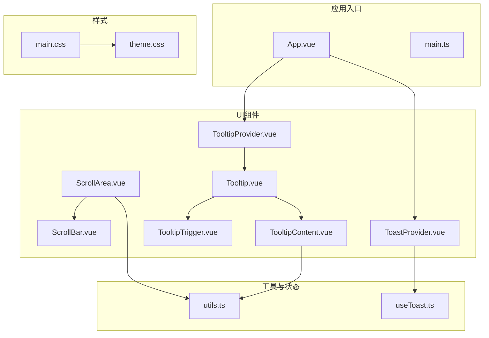
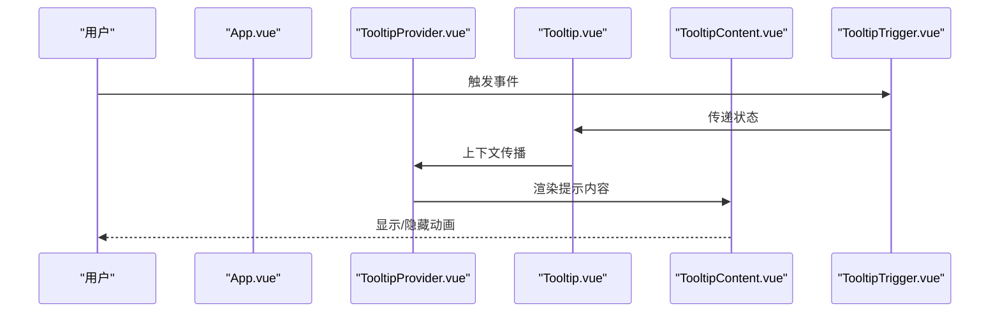
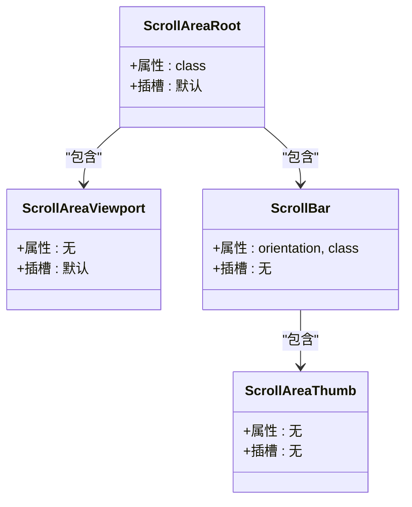
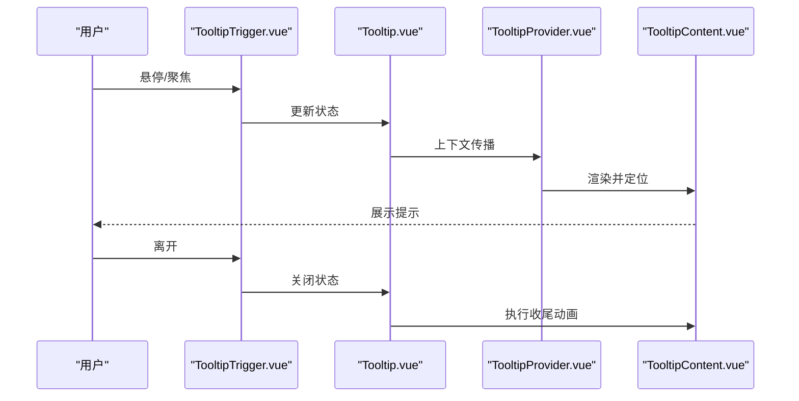
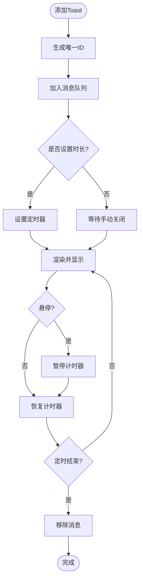
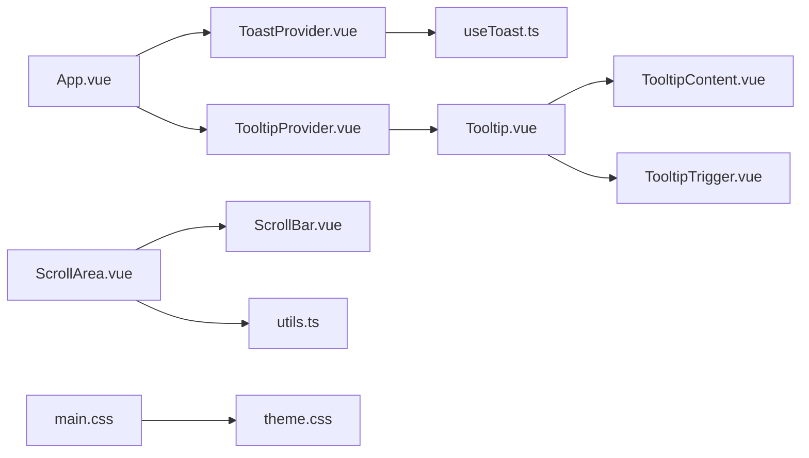

# 布局组件

<cite>
**本文引用的文件**
- [apps/frontend/src/components/ui/scroll-area/ScrollArea.vue](file://apps/frontend/src/components/ui/scroll-area/ScrollArea.vue)
- [apps/frontend/src/components/ui/scroll-area/ScrollBar.vue](file://apps/frontend/src/components/ui/scroll-area/ScrollBar.vue)
- [apps/frontend/src/components/ui/tooltip/Tooltip.vue](file://apps/frontend/src/components/ui/tooltip/Tooltip.vue)
- [apps/frontend/src/components/ui/tooltip/TooltipContent.vue](file://apps/frontend/src/components/ui/tooltip/TooltipContent.vue)
- [apps/frontend/src/components/ui/tooltip/TooltipProvider.vue](file://apps/frontend/src/components/ui/tooltip/TooltipProvider.vue)
- [apps/frontend/src/components/ui/tooltip/TooltipTrigger.vue](file://apps/frontend/src/components/ui/tooltip/TooltipTrigger.vue)
- [apps/frontend/src/components/ui/ToastProvider.vue](file://apps/frontend/src/components/ui/ToastProvider.vue)
- [apps/frontend/src/composables/useToast.ts](file://apps/frontend/src/composables/useToast.ts)
- [apps/frontend/src/lib/utils.ts](file://apps/frontend/src/lib/utils.ts)
- [apps/frontend/src/App.vue](file://apps/frontend/src/App.vue)
- [apps/frontend/src/main.ts](file://apps/frontend/src/main.ts)
- [apps/frontend/src/styles/main.css](file://apps/frontend/src/styles/main.css)
- [apps/frontend/src/styles/theme.css](file://apps/frontend/src/styles/theme.css)
</cite>

## 目录
1. [引言](#引言)
2. [项目结构](#项目结构)
3. [核心组件](#核心组件)
4. [架构总览](#架构总览)
5. [详细组件分析](#详细组件分析)
6. [依赖关系分析](#依赖关系分析)
7. [性能考量](#性能考量)
8. [故障排查指南](#故障排查指南)
9. [结论](#结论)
10. [附录](#附录)

## 引言
本文件聚焦于布局相关UI组件的设计与实现，涵盖滚动区域(ScrollArea)、工具提示(Tooltip)与Toast通知系统。文档从系统架构、组件关系、数据流与处理逻辑入手，结合定位策略、层级管理与视觉反馈机制，给出响应式适配、无障碍支持与跨设备/浏览器表现差异的解决方案，并总结性能优化策略。

## 项目结构
前端应用以Vue生态为主，通过组合式函数与可复用组件构建UI层。布局相关组件位于统一的UI目录下，配合全局样式与主题变量，形成一致的视觉与交互体验。

**图示来源**
- [apps/frontend/src/App.vue:30-56](file://apps/frontend/src/App.vue#L30-L56)
- [apps/frontend/src/components/ui/scroll-area/ScrollArea.vue:14-22](file://apps/frontend/src/components/ui/scroll-area/ScrollArea.vue#L14-L22)
- [apps/frontend/src/components/ui/scroll-area/ScrollBar.vue:20-32](file://apps/frontend/src/components/ui/scroll-area/ScrollBar.vue#L20-L32)
- [apps/frontend/src/components/ui/tooltip/Tooltip.vue:11-15](file://apps/frontend/src/components/ui/tooltip/Tooltip.vue#L11-L15)
- [apps/frontend/src/components/ui/tooltip/TooltipContent.vue:28-41](file://apps/frontend/src/components/ui/tooltip/TooltipContent.vue#L28-L41)
- [apps/frontend/src/components/ui/tooltip/TooltipProvider.vue:8-12](file://apps/frontend/src/components/ui/tooltip/TooltipProvider.vue#L8-L12)
- [apps/frontend/src/components/ui/tooltip/TooltipTrigger.vue:8-12](file://apps/frontend/src/components/ui/tooltip/TooltipTrigger.vue#L8-L12)
- [apps/frontend/src/components/ui/ToastProvider.vue:48-108](file://apps/frontend/src/components/ui/ToastProvider.vue#L48-L108)
- [apps/frontend/src/composables/useToast.ts:17-86](file://apps/frontend/src/composables/useToast.ts#L17-L86)
- [apps/frontend/src/lib/utils.ts:5-7](file://apps/frontend/src/lib/utils.ts#L5-L7)
- [apps/frontend/src/styles/main.css:1-7](file://apps/frontend/src/styles/main.css#L1-L7)
- [apps/frontend/src/styles/theme.css:1-170](file://apps/frontend/src/styles/theme.css#L1-L170)

**章节来源**
- [apps/frontend/src/App.vue:30-56](file://apps/frontend/src/App.vue#L30-L56)
- [apps/frontend/src/styles/main.css:1-7](file://apps/frontend/src/styles/main.css#L1-L7)
- [apps/frontend/src/styles/theme.css:1-170](file://apps/frontend/src/styles/theme.css#L1-L170)

## 核心组件
- 滚动区域(ScrollArea): 基于reka-ui封装，提供自定义滚动条与视口容器，保证内容溢出时的可控滚动与视觉一致性。
- 工具提示(Tooltip): 由Provider、Trigger、Content三部分组成，提供延迟、定位与动画等行为控制。
- Toast通知系统: 基于组合式函数useToast集中管理消息队列、定时器与交互按钮，提供复制、操作与关闭能力。

**章节来源**
- [apps/frontend/src/components/ui/scroll-area/ScrollArea.vue:14-22](file://apps/frontend/src/components/ui/scroll-area/ScrollArea.vue#L14-L22)
- [apps/frontend/src/components/ui/scroll-area/ScrollBar.vue:20-32](file://apps/frontend/src/components/ui/scroll-area/ScrollBar.vue#L20-L32)
- [apps/frontend/src/components/ui/tooltip/Tooltip.vue:11-15](file://apps/frontend/src/components/ui/tooltip/Tooltip.vue#L11-L15)
- [apps/frontend/src/components/ui/tooltip/TooltipContent.vue:28-41](file://apps/frontend/src/components/ui/tooltip/TooltipContent.vue#L28-L41)
- [apps/frontend/src/components/ui/tooltip/TooltipProvider.vue:8-12](file://apps/frontend/src/components/ui/tooltip/TooltipProvider.vue#L8-L12)
- [apps/frontend/src/components/ui/tooltip/TooltipTrigger.vue:8-12](file://apps/frontend/src/components/ui/tooltip/TooltipTrigger.vue#L8-L12)
- [apps/frontend/src/components/ui/ToastProvider.vue:48-108](file://apps/frontend/src/components/ui/ToastProvider.vue#L48-L108)
- [apps/frontend/src/composables/useToast.ts:17-86](file://apps/frontend/src/composables/useToast.ts#L17-L86)

## 架构总览
应用在根组件中注入TooltipProvider与ToastProvider，确保全局范围内工具提示与通知可用；滚动区域组件作为页面内容区的子组件，按需包裹长内容以提升可读性与交互体验。

**图示来源**
- [apps/frontend/src/App.vue:31-56](file://apps/frontend/src/App.vue#L31-L56)
- [apps/frontend/src/components/ui/tooltip/TooltipProvider.vue:8-12](file://apps/frontend/src/components/ui/tooltip/TooltipProvider.vue#L8-L12)
- [apps/frontend/src/components/ui/tooltip/Tooltip.vue:11-15](file://apps/frontend/src/components/ui/tooltip/Tooltip.vue#L11-L15)
- [apps/frontend/src/components/ui/tooltip/TooltipContent.vue:28-41](file://apps/frontend/src/components/ui/tooltip/TooltipContent.vue#L28-L41)
- [apps/frontend/src/components/ui/tooltip/TooltipTrigger.vue:8-12](file://apps/frontend/src/components/ui/tooltip/TooltipTrigger.vue#L8-L12)

## 详细组件分析

### 滚动区域(ScrollArea)与滚动条(ScrollBar)
- 设计要点
  - 容器层: 使用根组件包裹内容，保留相对定位与溢出隐藏，确保滚动区域边界清晰。
  - 视口层: 内容容器占满父级尺寸，继承圆角，避免滚动条遮挡内容边角。
  - 滚动条层: 支持垂直/水平方向，采用轻量边框与透明底色，配合缩放与过渡，提升触控体验。
- 数据流与处理逻辑
  - 将外部属性透传给底层reka-ui组件，内部仅做class合并与默认值处理，降低耦合。
  - 通过工具函数合并类名，保证主题与样式的一致性。
- 复杂度与性能
  - 组件为纯展示型，渲染复杂度低；滚动行为由底层UI库接管，避免重复造轮子。
- 可访问性
  - 依赖底层UI库的键盘导航与ARIA支持；建议在业务侧补充语义标签与焦点管理。

**图示来源**
- [apps/frontend/src/components/ui/scroll-area/ScrollArea.vue:14-22](file://apps/frontend/src/components/ui/scroll-area/ScrollArea.vue#L14-L22)
- [apps/frontend/src/components/ui/scroll-area/ScrollBar.vue:20-32](file://apps/frontend/src/components/ui/scroll-area/ScrollBar.vue#L20-L32)

**章节来源**
- [apps/frontend/src/components/ui/scroll-area/ScrollArea.vue:14-22](file://apps/frontend/src/components/ui/scroll-area/ScrollArea.vue#L14-L22)
- [apps/frontend/src/components/ui/scroll-area/ScrollBar.vue:20-32](file://apps/frontend/src/components/ui/scroll-area/ScrollBar.vue#L20-L32)
- [apps/frontend/src/lib/utils.ts:5-7](file://apps/frontend/src/lib/utils.ts#L5-L7)

### 工具提示(Tooltip)
- 设计要点
  - Provider: 作为上下文根节点，统一管理提示状态与延迟策略。
  - Trigger: 包裹触发元素，负责事件捕获与状态切换。
  - Content: 支持多方位偏移与动画序列，提供淡入/缩放/滑入等入场效果，关闭时具备对应的收尾动画。
- 数据流与处理逻辑
  - 通过属性透传与事件转发，将上层配置与底层UI库解耦。
  - 默认侧向偏移与Portal挂载，避免DOM层级影响定位精度。
- 复杂度与性能
  - 组件体量小，动画基于CSS过渡；在大量提示同时出现时，建议限制并发数量或采用虚拟列表策略。
- 可访问性
  - 建议为触发元素添加aria-describedby指向提示内容，确保读屏器可读。

**图示来源**
- [apps/frontend/src/components/ui/tooltip/TooltipTrigger.vue:8-12](file://apps/frontend/src/components/ui/tooltip/TooltipTrigger.vue#L8-L12)
- [apps/frontend/src/components/ui/tooltip/Tooltip.vue:11-15](file://apps/frontend/src/components/ui/tooltip/Tooltip.vue#L11-L15)
- [apps/frontend/src/components/ui/tooltip/TooltipProvider.vue:8-12](file://apps/frontend/src/components/ui/tooltip/TooltipProvider.vue#L8-L12)
- [apps/frontend/src/components/ui/tooltip/TooltipContent.vue:28-41](file://apps/frontend/src/components/ui/tooltip/TooltipContent.vue#L28-L41)

**章节来源**
- [apps/frontend/src/components/ui/tooltip/Tooltip.vue:11-15](file://apps/frontend/src/components/ui/tooltip/Tooltip.vue#L11-L15)
- [apps/frontend/src/components/ui/tooltip/TooltipContent.vue:28-41](file://apps/frontend/src/components/ui/tooltip/TooltipContent.vue#L28-L41)
- [apps/frontend/src/components/ui/tooltip/TooltipProvider.vue:8-12](file://apps/frontend/src/components/ui/tooltip/TooltipProvider.vue#L8-L12)
- [apps/frontend/src/components/ui/tooltip/TooltipTrigger.vue:8-12](file://apps/frontend/src/components/ui/tooltip/TooltipTrigger.vue#L8-L12)

### Toast通知系统
- 设计要点
  - Provider: 固定定位在页面顶部中央，使用过渡组管理进入/离开动画，支持悬停暂停与恢复。
  - 组合式函数: 维护消息队列、定时器与动作回调，提供成功/错误/信息/警告四类样式与图标。
  - 交互: 支持复制消息到剪贴板、执行动作后关闭、手动关闭。
- 数据流与处理逻辑
  - 添加消息时生成唯一ID并启动定时器；移除时清理定时器，避免内存泄漏。
  - 暂停/恢复逻辑：悬停时清除定时器，移开后按原时长重新计时。
  - 复制流程：防抖避免重复点击，成功后短暂高亮提示。
- 复杂度与性能
  - 列表渲染基于v-for与TransitionGroup，注意在高频弹窗场景下限制最大显示数量与动画时长。
- 可访问性
  - 建议为Toast提供aria-live区域或在关键状态变更时发出通知，确保读屏器可感知。

**图示来源**
- [apps/frontend/src/components/ui/ToastProvider.vue:48-108](file://apps/frontend/src/components/ui/ToastProvider.vue#L48-L108)
- [apps/frontend/src/composables/useToast.ts:17-86](file://apps/frontend/src/composables/useToast.ts#L17-L86)

**章节来源**
- [apps/frontend/src/components/ui/ToastProvider.vue:48-108](file://apps/frontend/src/components/ui/ToastProvider.vue#L48-L108)
- [apps/frontend/src/composables/useToast.ts:17-86](file://apps/frontend/src/composables/useToast.ts#L17-L86)

## 依赖关系分析
- 组件间依赖
  - App.vue注入TooltipProvider与ToastProvider，作为全局上下文根节点。
  - ScrollArea与ScrollBar依赖reka-ui与工具函数cn进行样式合并。
  - Tooltip系列组件依赖reka-ui与Portal，确保内容挂载到正确位置。
  - ToastProvider依赖useToast组合式函数与国际化服务。
- 外部依赖
  - reka-ui: 提供滚动与提示的基础UI能力。
  - lucide-vue-next: 提供图标资源。
  - vue-i18n: 提供国际化文案。
- 样式依赖
  - main.css引入主题与动画基础样式，theme.css定义变量与过渡规则。

**图示来源**
- [apps/frontend/src/App.vue:31-56](file://apps/frontend/src/App.vue#L31-L56)
- [apps/frontend/src/components/ui/scroll-area/ScrollArea.vue:14-22](file://apps/frontend/src/components/ui/scroll-area/ScrollArea.vue#L14-L22)
- [apps/frontend/src/components/ui/scroll-area/ScrollBar.vue:20-32](file://apps/frontend/src/components/ui/scroll-area/ScrollBar.vue#L20-L32)
- [apps/frontend/src/components/ui/tooltip/TooltipProvider.vue:8-12](file://apps/frontend/src/components/ui/tooltip/TooltipProvider.vue#L8-L12)
- [apps/frontend/src/components/ui/tooltip/Tooltip.vue:11-15](file://apps/frontend/src/components/ui/tooltip/Tooltip.vue#L11-L15)
- [apps/frontend/src/components/ui/tooltip/TooltipContent.vue:28-41](file://apps/frontend/src/components/ui/tooltip/TooltipContent.vue#L28-L41)
- [apps/frontend/src/components/ui/tooltip/TooltipTrigger.vue:8-12](file://apps/frontend/src/components/ui/tooltip/TooltipTrigger.vue#L8-L12)
- [apps/frontend/src/components/ui/ToastProvider.vue:48-108](file://apps/frontend/src/components/ui/ToastProvider.vue#L48-L108)
- [apps/frontend/src/composables/useToast.ts:17-86](file://apps/frontend/src/composables/useToast.ts#L17-L86)
- [apps/frontend/src/lib/utils.ts:5-7](file://apps/frontend/src/lib/utils.ts#L5-L7)
- [apps/frontend/src/styles/main.css:1-7](file://apps/frontend/src/styles/main.css#L1-L7)
- [apps/frontend/src/styles/theme.css:1-170](file://apps/frontend/src/styles/theme.css#L1-L170)

**章节来源**
- [apps/frontend/src/App.vue:31-56](file://apps/frontend/src/App.vue#L31-L56)
- [apps/frontend/src/styles/main.css:1-7](file://apps/frontend/src/styles/main.css#L1-L7)
- [apps/frontend/src/styles/theme.css:1-170](file://apps/frontend/src/styles/theme.css#L1-L170)

## 性能考量
- 滚动区域
  - 优先使用GPU加速与will-change优化，减少滚动卡顿。
  - 控制滚动条宽度与背景，避免频繁重绘。
- 工具提示
  - 合理设置延迟阈值，避免过多提示同时展开造成布局抖动。
  - 使用Portal减少DOM层级对定位的影响，降低重排成本。
- Toast通知
  - 限制最大显示数量，避免DOM节点过多导致渲染压力。
  - 过渡动画时长与缓动曲线应适度，避免阻塞主线程。
  - 复制/动作回调应异步处理，避免阻塞UI线程。
- 样式与主题
  - 使用CSS变量与过渡声明，统一动画节奏，减少重复样式计算。

[本节为通用性能指导，不涉及具体文件分析]

## 故障排查指南
- 滚动条不可见或样式异常
  - 检查容器尺寸与overflow设置，确认视口与滚动条的尺寸关系。
  - 核对主题变量与类名合并结果，确保边框与背景生效。
- 工具提示未显示或定位错误
  - 确认TooltipProvider包裹范围覆盖触发元素与内容渲染区域。
  - 检查Portal挂载点与z-index层级，避免被其他元素遮挡。
- Toast无法自动消失或重复弹出
  - 核对定时器ID与移除逻辑，确保每次添加/移除成对出现。
  - 检查暂停/恢复逻辑，避免重复计时导致的时序错乱。
- 复制功能失败
  - 确认剪贴板API权限与HTTPS环境，捕获异常并提示用户。
- 全局错误与兼容性
  - 应用入口已对动态模块加载错误与特定平台错误进行处理，若仍出现异常，检查网络与缓存策略。

**章节来源**
- [apps/frontend/src/components/ui/scroll-area/ScrollArea.vue:14-22](file://apps/frontend/src/components/ui/scroll-area/ScrollArea.vue#L14-L22)
- [apps/frontend/src/components/ui/scroll-area/ScrollBar.vue:20-32](file://apps/frontend/src/components/ui/scroll-area/ScrollBar.vue#L20-L32)
- [apps/frontend/src/components/ui/tooltip/TooltipProvider.vue:8-12](file://apps/frontend/src/components/ui/tooltip/TooltipProvider.vue#L8-L12)
- [apps/frontend/src/components/ui/ToastProvider.vue:48-108](file://apps/frontend/src/components/ui/ToastProvider.vue#L48-L108)
- [apps/frontend/src/composables/useToast.ts:17-86](file://apps/frontend/src/composables/useToast.ts#L17-L86)
- [apps/frontend/src/main.ts:58-113](file://apps/frontend/src/main.ts#L58-L113)

## 结论
本项目的布局组件通过统一的Provider与可复用的UI封装，实现了滚动、提示与通知的标准化与可扩展性。借助主题变量与过渡动画，组件在视觉与交互上保持一致；通过组合式函数与Portal等技术手段，兼顾了性能与可访问性。建议在实际业务中根据场景进一步优化动画参数与交互策略，确保在多设备与浏览器环境下稳定运行。

[本节为总结性内容，不涉及具体文件分析]

## 附录
- 响应式布局适配
  - 滚动区域: 在窄屏设备上适当增大滚动条宽度与间距，保证触控可达性。
  - 工具提示: 在移动端使用触摸长按或悬浮策略，避免误触。
  - Toast通知: 在小屏设备上缩短消息长度与动画时长，确保快速阅读。
- 屏幕尺寸兼容
  - 使用相对单位与CSS变量，避免固定像素导致的布局断裂。
  - 在极小/极大屏下调整最大宽度与内边距，保证信息密度合理。
- 无障碍访问支持
  - 为触发元素提供aria-label或aria-describedby，确保读屏器可读。
  - 为Toast提供aria-live区域或关键状态变更通知。
  - 为滚动区域提供键盘导航与焦点可见性保障。
- 不同设备与浏览器表现
  - 滚动区域: 在iOS Safari上关注指针事件与滚动惯性差异，必要时增加回弹与阻尼配置。
  - 工具提示: 在Android Chrome上测试Portal挂载与z-index层级，避免被模态框遮挡。
  - Toast通知: 在旧版浏览器上降级动画与过渡，保证基本可用性。

[本节为通用指导，不涉及具体文件分析]