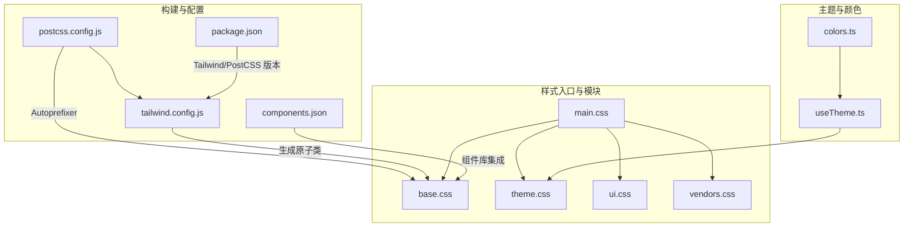
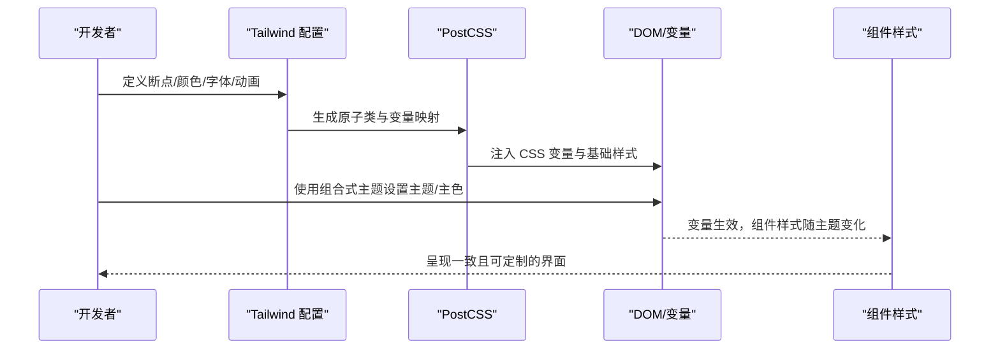
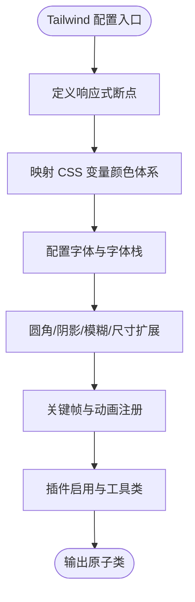
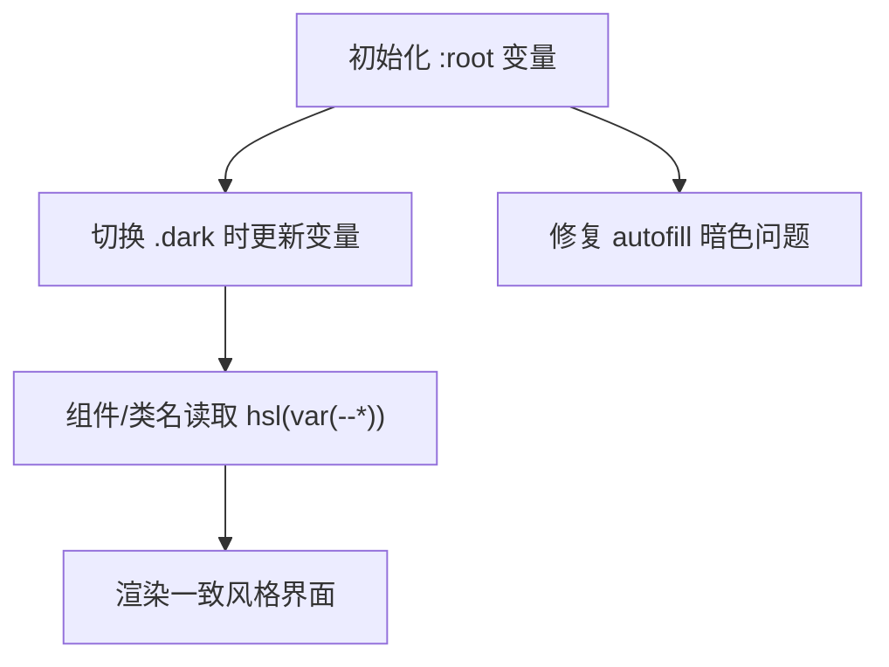
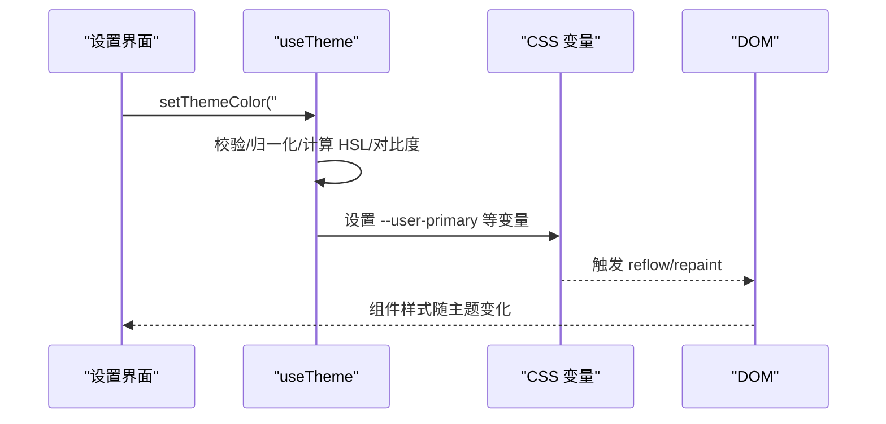
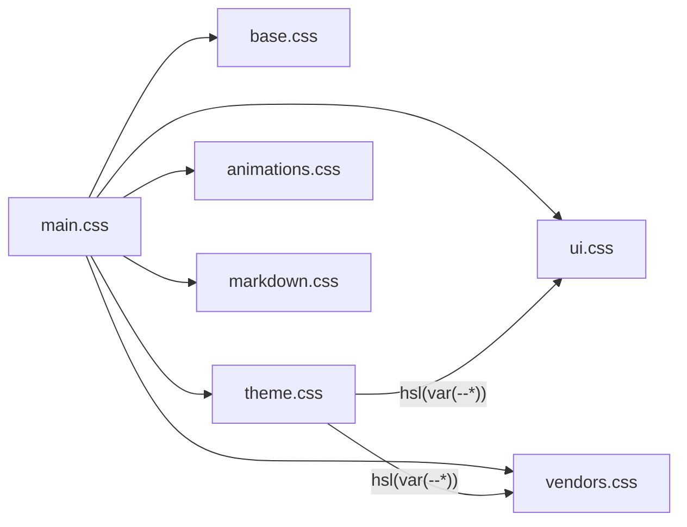
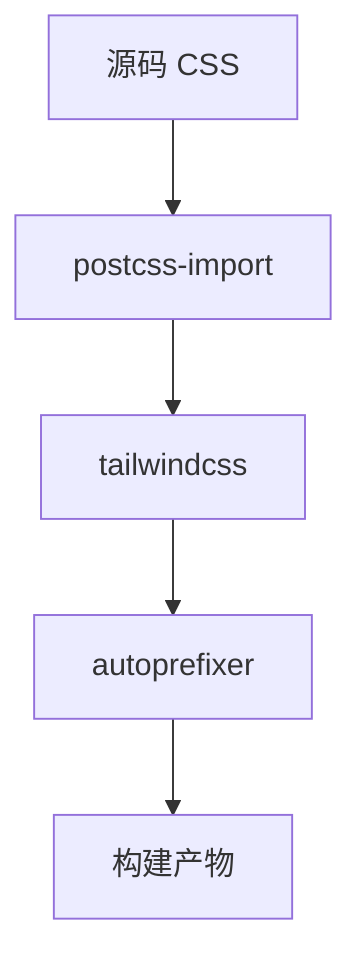
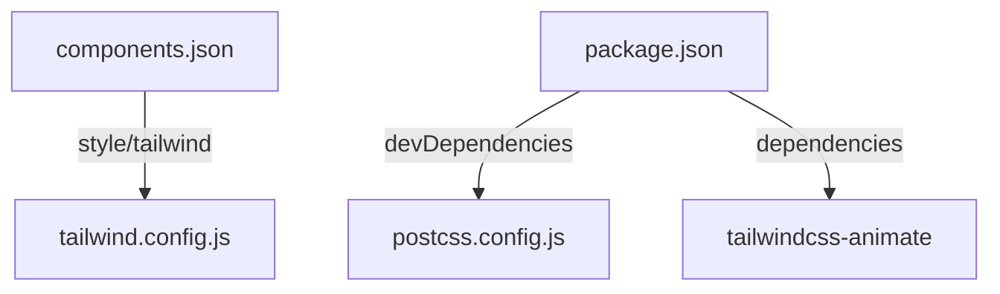

# 样式系统

<cite>
**本文引用的文件**
- [tailwind.config.js](file://apps/frontend/tailwind.config.js)
- [postcss.config.js](file://apps/frontend/postcss.config.js)
- [components.json](file://apps/frontend/components.json)
- [package.json](file://apps/frontend/package.json)
- [main.css](file://apps/frontend/src/styles/main.css)
- [base.css](file://apps/frontend/src/styles/base.css)
- [theme.css](file://apps/frontend/src/styles/theme.css)
- [ui.css](file://apps/frontend/src/styles/ui.css)
- [vendors.css](file://apps/frontend/src/styles/vendors.css)
- [useTheme.ts](file://apps/frontend/src/composables/useTheme.ts)
- [colors.ts](file://apps/frontend/src/lib/colors.ts)
</cite>

## 目录
1. [简介](#简介)
2. [项目结构](#项目结构)
3. [核心组件](#核心组件)
4. [架构总览](#架构总览)
5. [详细组件分析](#详细组件分析)
6. [依赖关系分析](#依赖关系分析)
7. [性能考量](#性能考量)
8. [故障排查指南](#故障排查指南)
9. [结论](#结论)
10. [附录](#附录)

## 简介
本文件系统性梳理 Lumina Todo 前端样式体系，围绕 Tailwind CSS 配置策略、基于 CSS 变量的主题与颜色系统、字体规范、响应式断点、暗色模式切换与主题定制、样式覆盖与模块化、组件样式隔离、调试技巧、性能优化与浏览器兼容、PostCSS 插件链路与构建优化，以及最佳实践与维护建议展开。目标是帮助开发者快速理解并高效维护样式系统。

## 项目结构
样式系统采用“CSS 变量 + Tailwind 扩展 + 组合式主题管理”的分层架构：
- CSS 变量层：在基础层集中定义明/暗两套主题令牌与语义变量，确保全站统一风格与可定制性。
- Tailwind 层：通过扩展 theme.colors、fontFamily、borderRadius、boxShadow、spacing、keyframes/animation 等，将 CSS 变量注入到原子类中，实现“变量即类名”。
- 组合式主题层：useTheme 提供主题模式、用户主色、随机主题等运行时控制，动态写入 CSS 变量。
- 样式模块层：按功能拆分 main.css → base.css → theme.css → 动画/Markdown/Vendors/UI，保证职责清晰与加载顺序正确。
- 构建层：PostCSS 负责导入、Tailwind 处理与 Autoprefixer 兼容补全。

**图示来源**
- [postcss.config.js:1-8](file://apps/frontend/postcss.config.js#L1-L8)
- [tailwind.config.js:1-303](file://apps/frontend/tailwind.config.js#L1-L303)
- [components.json:1-22](file://apps/frontend/components.json#L1-L22)
- [package.json:1-105](file://apps/frontend/package.json#L1-L105)
- [main.css:1-7](file://apps/frontend/src/styles/main.css#L1-L7)
- [base.css:1-89](file://apps/frontend/src/styles/base.css#L1-L89)
- [theme.css:1-170](file://apps/frontend/src/styles/theme.css#L1-L170)
- [ui.css:1-89](file://apps/frontend/src/styles/ui.css#L1-L89)
- [vendors.css:1-92](file://apps/frontend/src/styles/vendors.css#L1-L92)
- [useTheme.ts:1-378](file://apps/frontend/src/composables/useTheme.ts#L1-L378)
- [colors.ts:1-96](file://apps/frontend/src/lib/colors.ts#L1-L96)

**章节来源**
- [postcss.config.js:1-8](file://apps/frontend/postcss.config.js#L1-L8)
- [tailwind.config.js:1-303](file://apps/frontend/tailwind.config.js#L1-L303)
- [components.json:1-22](file://apps/frontend/components.json#L1-L22)
- [package.json:1-105](file://apps/frontend/package.json#L1-L105)
- [main.css:1-7](file://apps/frontend/src/styles/main.css#L1-L7)
- [base.css:1-89](file://apps/frontend/src/styles/base.css#L1-L89)
- [theme.css:1-170](file://apps/frontend/src/styles/theme.css#L1-L170)
- [ui.css:1-89](file://apps/frontend/src/styles/ui.css#L1-L89)
- [vendors.css:1-92](file://apps/frontend/src/styles/vendors.css#L1-L92)
- [useTheme.ts:1-378](file://apps/frontend/src/composables/useTheme.ts#L1-L378)
- [colors.ts:1-96](file://apps/frontend/src/lib/colors.ts#L1-L96)

## 核心组件
- Tailwind 配置与扩展
  - 响应式断点：xs/sm/md/lg/xl/2xl/3xl，与 UnoCSS 保持一致，便于跨端一致性。
  - 容器与内边距：容器居中、最大宽度与内边距配置，确保内容区在不同视口下的可读性。
  - 颜色系统：基于 CSS 变量的 hsl(var(--*)) 映射，支持默认 shadcn-vue 语义色与 UnoCSS 迁移后的自定义别名色（如 bg/text/button/filter 等）。
  - 字体：sans 与 mono 字体栈，优先使用 CSS 变量与本地字体资源。
  - 圆角、阴影、模糊、间距、z-index、缓动函数、关键帧与动画等均通过 extend 注入，统一由 CSS 变量驱动。
  - 插件：tailwindcss-animate 与自定义工具类（如动画别名），增强交互表现力。
- CSS 变量与主题
  - theme.css 定义 :root 与 .dark 两套变量，覆盖背景、前景、卡片、弹出层、主色/次色/强调色、边框/输入/环、圆角、图表色、语义色、AI 助手相关变量，并提供全局过渡与 GPU 加速辅助类。
  - base.css 引入 Tailwind 三段式指令与全局基线样式，设置 body 的背景与可选文本区域，同时修复浏览器自动填充在暗色模式下的颜色问题。
- 主题组合式逻辑
  - useTheme.ts 提供主题模式（light/dark/auto）、有效主题、是否暗色、设置主题、主题色（含预设与随机）、重置主题色等能力；通过 CSS 变量持久化与动态计算，确保对比度与可访问性。
- 样式模块化
  - main.css 作为聚合入口，按顺序引入 base/theme/animations/markdown/vendors/ui，保证依赖链与作用域隔离。
  - ui.css 与 vendors.css 分别承载组件级样式与第三方库覆盖，避免全局污染。
- PostCSS 与构建
  - postcss.config.js 串联 postcss-import、tailwindcss、autoprefixer，确保 CSS 模块化与浏览器兼容。
  - package.json 指定 Tailwind 与 PostCSS 版本，保障构建稳定性。

**章节来源**
- [tailwind.config.js:14-287](file://apps/frontend/tailwind.config.js#L14-L287)
- [theme.css:1-170](file://apps/frontend/src/styles/theme.css#L1-L170)
- [base.css:1-89](file://apps/frontend/src/styles/base.css#L1-L89)
- [main.css:1-7](file://apps/frontend/src/styles/main.css#L1-L7)
- [ui.css:1-89](file://apps/frontend/src/styles/ui.css#L1-L89)
- [vendors.css:1-92](file://apps/frontend/src/styles/vendors.css#L1-L92)
- [useTheme.ts:308-377](file://apps/frontend/src/composables/useTheme.ts#L308-L377)
- [postcss.config.js:1-8](file://apps/frontend/postcss.config.js#L1-L8)
- [package.json:72-103](file://apps/frontend/package.json#L72-L103)

## 架构总览
样式系统以“变量驱动 + 类名复用 + 组合式主题”为核心，形成从构建到运行时的完整闭环：

**图示来源**
- [tailwind.config.js:14-287](file://apps/frontend/tailwind.config.js#L14-L287)
- [postcss.config.js:1-8](file://apps/frontend/postcss.config.js#L1-8)
- [theme.css:1-170](file://apps/frontend/src/styles/theme.css#L1-L170)
- [useTheme.ts:308-377](file://apps/frontend/src/composables/useTheme.ts#L308-L377)

## 详细组件分析

### Tailwind 配置与扩展
- 响应式断点与容器
  - 断点覆盖移动端到大屏，配合容器限制内容宽度，兼顾信息密度与可读性。
- 颜色系统
  - 以 CSS 变量为中心，映射到默认语义色与业务别名色（如 text/bg/button/filter/ai/language/project/link 等），既满足组件库一致性，又便于业务扩展。
- 字体与排版
  - sans 字体栈包含系统字体与中文字体，mono 用于代码展示；均通过 CSS 变量与字体资源加载。
- 视觉与交互
  - 圆角、阴影、backdropBlur、z-index、transitionTimingFunction、keyframes/animation 等均通过 extend 注入，统一风格与动效体验。
- 插件
  - tailwindcss-animate 提供开箱即用的动画类；自定义工具类补充特定动效别名。

**图示来源**
- [tailwind.config.js:14-287](file://apps/frontend/tailwind.config.js#L14-L287)

**章节来源**
- [tailwind.config.js:14-287](file://apps/frontend/tailwind.config.js#L14-L287)

### CSS 变量与主题系统
- 变量分层
  - :root 定义浅色模式基础令牌与语义变量；.dark 定义深色模式对应值，确保对比度与可读性。
  - 主色与悬停、前景、RGB 值、图表色、AI 相关变量均成对出现，便于主题切换与组件渲染。
- 全局过渡与性能
  - 通过全局过渡声明与 GPU 加速辅助类，提升滚动与交互体验；同时提供排除类以避免高频重绘元素参与过渡。
- 暗色模式修复
  - 针对浏览器 autofill 在暗色模式下的背景与文字颜色异常进行专项修复，保证输入体验一致。

**图示来源**
- [theme.css:1-170](file://apps/frontend/src/styles/theme.css#L1-L170)
- [base.css:32-42](file://apps/frontend/src/styles/base.css#L32-L42)

**章节来源**
- [theme.css:1-170](file://apps/frontend/src/styles/theme.css#L1-L170)
- [base.css:1-89](file://apps/frontend/src/styles/base.css#L1-L89)

### 主题组合式逻辑（useTheme）
- 主题模式与有效主题
  - 支持 light/dark/auto，依据系统偏好与用户选择解析有效主题。
- 主题色与对比度
  - 支持预设色与随机色；通过算法确保主色与悬停色在浅/深主题下均满足对比度阈值；自动选择浅/深前景色以保证可读性。
- 动态写入 CSS 变量
  - 将计算后的 HSL 值写入 --user-* 变量，供 Tailwind 与组件样式读取；支持重置与持久化存储。

**图示来源**
- [useTheme.ts:308-377](file://apps/frontend/src/composables/useTheme.ts#L308-L377)
- [theme.css:1-170](file://apps/frontend/src/styles/theme.css#L1-L170)

**章节来源**
- [useTheme.ts:1-378](file://apps/frontend/src/composables/useTheme.ts#L1-L378)
- [colors.ts:1-96](file://apps/frontend/src/lib/colors.ts#L1-L96)

### 样式模块化与组件样式隔离
- main.css 聚合顺序
  - base → theme → animations → markdown → vendors → ui，确保变量与基础样式先就绪，再叠加组件与第三方覆盖。
- 组件样式隔离
  - ui.css 仅在必要范围内使用局部变量与媒体查询，避免全局污染；vendors.css 对 highlight.js 与 KaTeX 进行深色模式覆盖，保持一致性。
- 组合式主题与 Tailwind 的协作
  - 组件通过原子类读取颜色变量，无需内联样式或重复定义，实现“样式与逻辑解耦”。

**图示来源**
- [main.css:1-7](file://apps/frontend/src/styles/main.css#L1-L7)
- [ui.css:1-89](file://apps/frontend/src/styles/ui.css#L1-L89)
- [vendors.css:1-92](file://apps/frontend/src/styles/vendors.css#L1-L92)
- [theme.css:1-170](file://apps/frontend/src/styles/theme.css#L1-L170)

**章节来源**
- [main.css:1-7](file://apps/frontend/src/styles/main.css#L1-L7)
- [ui.css:1-89](file://apps/frontend/src/styles/ui.css#L1-L89)
- [vendors.css:1-92](file://apps/frontend/src/styles/vendors.css#L1-L92)

### PostCSS 配置与构建优化
- 插件链
  - postcss-import：模块化组织 CSS，支持 @import。
  - tailwindcss：扫描内容生成所需原子类，减少未使用类体积。
  - autoprefixer：自动添加浏览器前缀，提升兼容性。
- 版本与依赖
  - package.json 中锁定 Tailwind 与 PostCSS 版本，避免升级带来的样式回退。

**图示来源**
- [postcss.config.js:1-8](file://apps/frontend/postcss.config.js#L1-L8)
- [package.json:72-103](file://apps/frontend/package.json#L72-L103)

**章节来源**
- [postcss.config.js:1-8](file://apps/frontend/postcss.config.js#L1-L8)
- [package.json:72-103](file://apps/frontend/package.json#L72-L103)

## 依赖关系分析
- 组件库集成
  - components.json 指定 shadcn-vue 风格、Tailwind 配置路径与 CSS 变量开关，确保组件库样式与主题系统协同工作。
- 构建依赖
  - package.json 中 tailwindcss、tailwindcss-animate、autoprefixer、postcss 等版本稳定，与 tailwind.config.js 和 postcss.config.js 形成闭环。

**图示来源**
- [components.json:1-22](file://apps/frontend/components.json#L1-L22)
- [package.json:72-103](file://apps/frontend/package.json#L72-L103)
- [postcss.config.js:1-8](file://apps/frontend/postcss.config.js#L1-L8)
- [tailwind.config.js:1-303](file://apps/frontend/tailwind.config.js#L1-L303)

**章节来源**
- [components.json:1-22](file://apps/frontend/components.json#L1-L22)
- [package.json:72-103](file://apps/frontend/package.json#L72-L103)

## 性能考量
- 变量驱动与原子类
  - 通过 CSS 变量与 Tailwind 原子类减少重复样式与冗余类名，降低包体与选择器复杂度。
- GPU 加速与过渡
  - 提供 scroll-smooth-gpu 与全局过渡变量，结合媒体查询与排除类，避免不必要的重绘与回流。
- 字体与资源
  - 字体通过 CDN 引入，减少本地打包体积；mono 字体栈明确，避免字体回退闪烁。
- 构建优化
  - PostCSS 插件链仅保留必要步骤，Tailwind 内容扫描范围精确，避免生成无用类。

**章节来源**
- [theme.css:143-169](file://apps/frontend/src/styles/theme.css#L143-L169)
- [base.css:1-89](file://apps/frontend/src/styles/base.css#L1-L89)
- [tailwind.config.js:6-13](file://apps/frontend/tailwind.config.js#L6-L13)

## 故障排查指南
- 暗色模式下输入框颜色异常
  - 检查 base.css 中针对 -webkit-autofill 的覆盖规则是否生效；确认 :root 与 .dark 的变量值是否正确写入。
- 主题色对比度不足
  - 使用 useTheme 的对比度校验逻辑，确认 --user-primary 与 --user-primary-foreground 的组合满足最小对比度；必要时调整主色或启用随机主题。
- 动画或过渡不生效
  - 确认全局过渡变量与排除类未被意外覆盖；检查 keyframes/animation 是否在 tailwind.config.js 中注册。
- 第三方库样式冲突
  - 在 vendors.css 中针对性覆盖 highlight.js 与 KaTeX 的深色模式样式，避免与主题变量冲突。
- 构建后样式缺失
  - 检查 postcss.config.js 的插件顺序与 tailwind.config.js 的 content 扫描路径；确认 package.json 中 Tailwind 与 PostCSS 版本匹配。

**章节来源**
- [base.css:32-42](file://apps/frontend/src/styles/base.css#L32-L42)
- [useTheme.ts:202-235](file://apps/frontend/src/composables/useTheme.ts#L202-L235)
- [vendors.css:1-92](file://apps/frontend/src/styles/vendors.css#L1-L92)
- [postcss.config.js:1-8](file://apps/frontend/postcss.config.js#L1-L8)
- [tailwind.config.js:6-13](file://apps/frontend/tailwind.config.js#L6-L13)

## 结论
Lumina Todo 的样式系统以 CSS 变量为核心，结合 Tailwind 的强大扩展能力与组合式主题管理，实现了高可定制、强一致、易维护的前端样式架构。通过模块化的样式组织与严谨的构建流程，系统在视觉体验、性能与可维护性之间取得良好平衡。遵循本文档的最佳实践与维护建议，可进一步提升开发效率与用户体验。

## 附录
- 响应式断点参考
  - xs: 320px、sm: 375px、md: 640px、lg: 768px、xl: 1024px、2xl: 1280px、3xl: 1536px
- 颜色系统要点
  - 以 hsl(var(--*)) 读取，支持默认语义色与业务别名色；主色与悬停色自动校验对比度。
- 字体规范
  - sans 字体栈包含系统字体与中文字体；mono 字体栈用于代码展示。
- 暗色模式切换
  - 通过 useTheme 控制类名与 CSS 变量，实现平滑切换与可访问性保障。
- 样式覆盖策略
  - 优先使用 Tailwind 原子类与变量；必要时在 ui.css 与 vendors.css 中进行局部覆盖。
- 调试技巧
  - 利用浏览器开发者工具查看 CSS 变量值与最终渲染效果；关注关键帧与过渡性能。
- 性能优化
  - 合理使用 GPU 加速辅助类；避免全局过渡影响高频元素；精简内容扫描范围。
- 浏览器兼容
  - 通过 Autoprefixer 自动生成前缀；针对特殊选择器进行降级处理。
- 维护建议
  - 新增颜色/尺寸/动画时同步更新 tailwind.config.js 与 theme.css；保持 components.json 与组件库风格一致；定期审查 vendors.css 与第三方库版本。