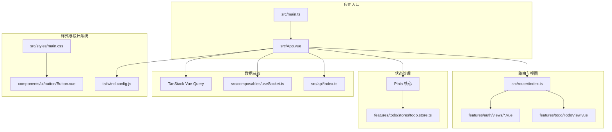
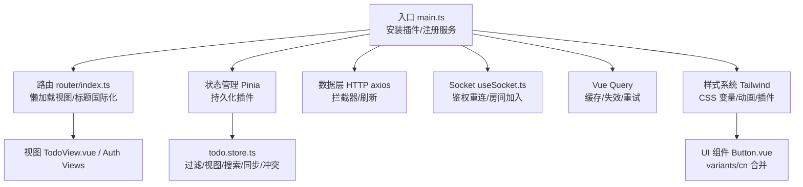
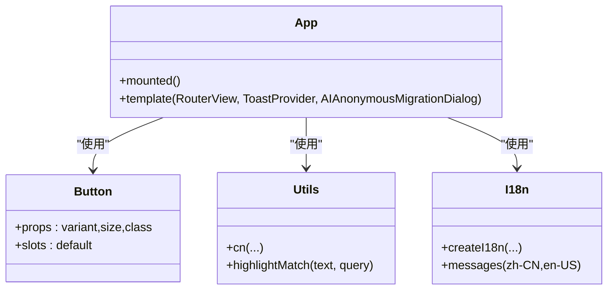
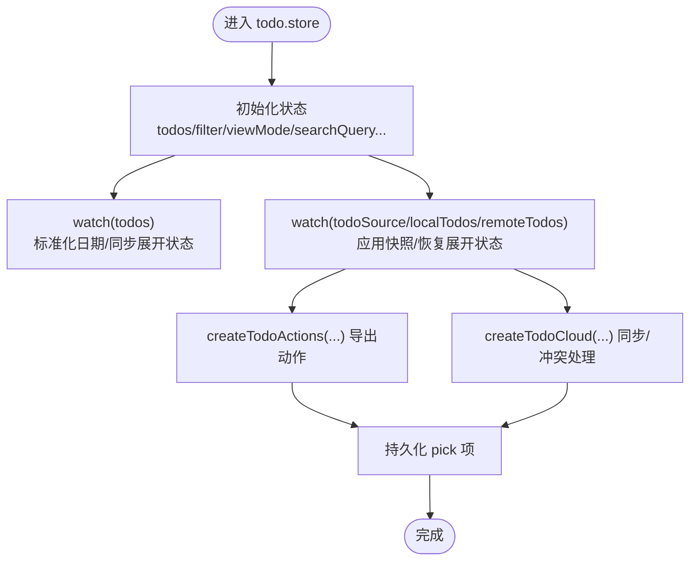
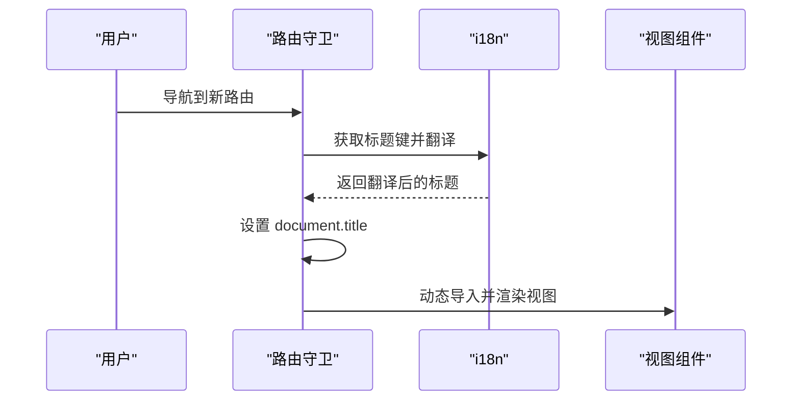
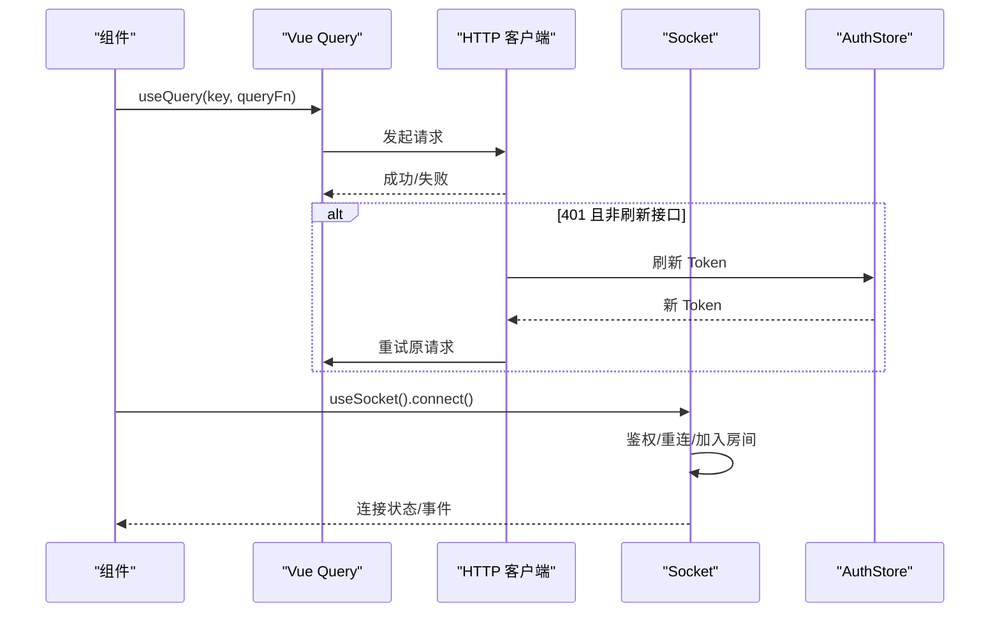
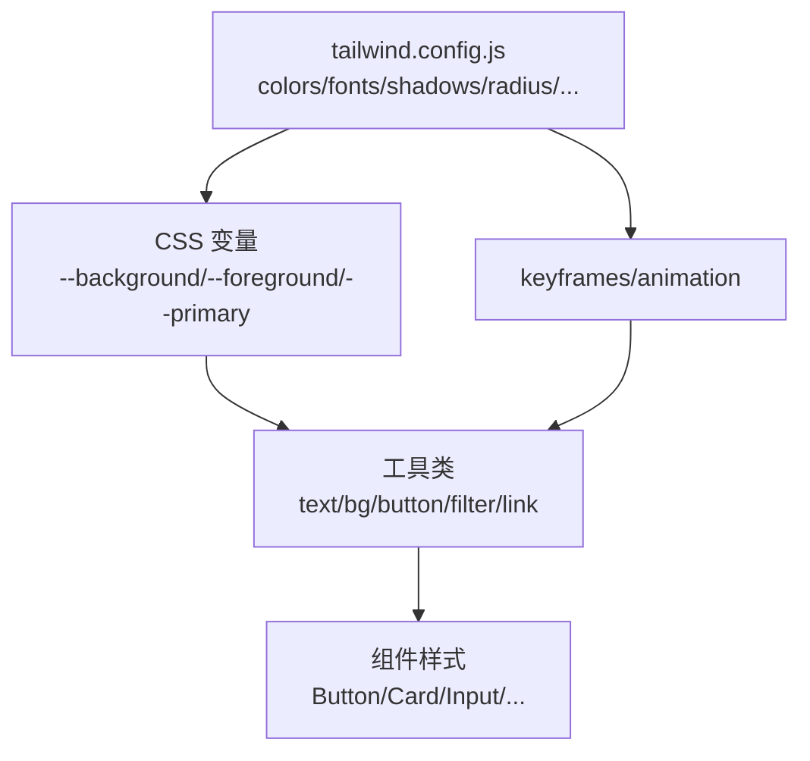
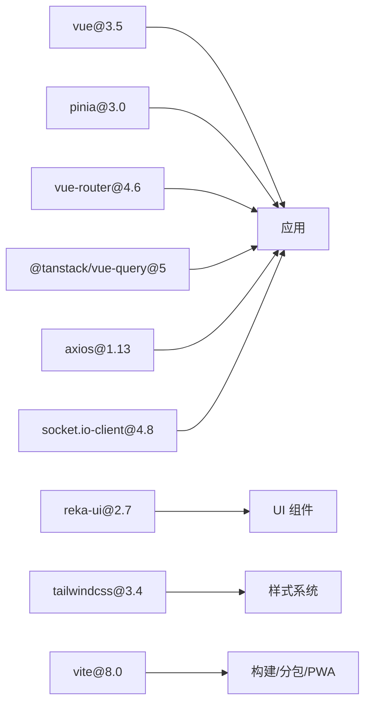

# 前端架构

<cite>
**本文引用的文件**
- [apps/frontend/package.json](file://apps/frontend/package.json)
- [apps/frontend/src/main.ts](file://apps/frontend/src/main.ts)
- [apps/frontend/src/router/index.ts](file://apps/frontend/src/router/index.ts)
- [apps/frontend/tailwind.config.js](file://apps/frontend/tailwind.config.js)
- [apps/frontend/vite.config.mts](file://apps/frontend/vite.config.mts)
- [apps/frontend/src/App.vue](file://apps/frontend/src/App.vue)
- [apps/frontend/src/i18n/index.ts](file://apps/frontend/src/i18n/index.ts)
- [apps/frontend/src/lib/utils.ts](file://apps/frontend/src/lib/utils.ts)
- [apps/frontend/src/composables/useRequest.ts](file://apps/frontend/src/composables/useRequest.ts)
- [apps/frontend/src/features/todo/stores/todo.store.ts](file://apps/frontend/src/features/todo/stores/todo.store.ts)
- [apps/frontend/src/composables/useSocket.ts](file://apps/frontend/src/composables/useSocket.ts)
- [apps/frontend/src/api/index.ts](file://apps/frontend/src/api/index.ts)
- [apps/frontend/src/styles/main.css](file://apps/frontend/src/styles/main.css)
- [apps/frontend/src/components/ui/button/Button.vue](file://apps/frontend/src/components/ui/button/Button.vue)
</cite>

## 目录

1. [简介](#简介)
2. [项目结构](#项目结构)
3. [核心组件](#核心组件)
4. [架构总览](#架构总览)
5. [详细组件分析](#详细组件分析)
6. [依赖关系分析](#依赖关系分析)
7. [性能考量](#性能考量)
8. [故障排查指南](#故障排查指南)
9. [结论](#结论)
10. [附录](#附录)

## 简介

本文件面向前端开发者，系统梳理 Lumina Todo 前端（Vue 3.5）的整体架构设计，涵盖组件化架构、状态管理模式、路由系统、数据获取与缓存、Tailwind CSS 设计系统、UI 组件库使用与扩展、前后端交互模式、错误处理与性能优化策略，并提供可复用性与最佳实践建议。

## 项目结构

前端位于 apps/frontend，采用基于功能域的组织方式，按特性划分 features（如 todo、auth、ai、mcp），并辅以通用层 components（UI 组件）、composables（可复用逻辑）、lib（工具函数）、stores（状态管理）、api（HTTP 客户端）、i18n（国际化）、styles（样式入口）等。构建与打包通过 Vite 驱动，支持 PWA、Gzip/Brotli 压缩与代码分包；样式通过 Tailwind CSS 与自定义 CSS 变量驱动设计系统。



图表来源

- [apps/frontend/src/main.ts:54-137](file://apps/frontend/src/main.ts#L54-L137)
- [apps/frontend/src/App.vue:1-77](file://apps/frontend/src/App.vue#L1-L77)
- [apps/frontend/src/router/index.ts:7-54](file://apps/frontend/src/router/index.ts#L7-L54)
- [apps/frontend/src/features/todo/stores/todo.store.ts:21-368](file://apps/frontend/src/features/todo/stores/todo.store.ts#L21-L368)
- [apps/frontend/src/api/index.ts:8-199](file://apps/frontend/src/api/index.ts#L8-L199)
- [apps/frontend/src/composables/useSocket.ts:56-191](file://apps/frontend/src/composables/useSocket.ts#L56-L191)
- [apps/frontend/tailwind.config.js:5-303](file://apps/frontend/tailwind.config.js#L5-L303)
- [apps/frontend/src/styles/main.css:1-7](file://apps/frontend/src/styles/main.css#L1-L7)
- [apps/frontend/src/components/ui/button/Button.vue:1-32](file://apps/frontend/src/components/ui/button/Button.vue#L1-L32)

章节来源

- [apps/frontend/package.json:1-105](file://apps/frontend/package.json#L1-L105)
- [apps/frontend/src/main.ts:54-137](file://apps/frontend/src/main.ts#L54-L137)
- [apps/frontend/src/router/index.ts:7-54](file://apps/frontend/src/router/index.ts#L7-L54)
- [apps/frontend/tailwind.config.js:5-303](file://apps/frontend/tailwind.config.js#L5-L303)
- [apps/frontend/vite.config.mts:80-184](file://apps/frontend/vite.config.mts#L80-L184)
- [apps/frontend/src/styles/main.css:1-7](file://apps/frontend/src/styles/main.css#L1-L7)

## 核心组件

- 应用入口与全局配置：在入口文件中初始化 Pinia、Vue Query、ECharts、i18n、全局错误处理与 PWA 插件，并挂载应用。
- 路由系统：基于 vue-router，支持 History/Hash 模式（根据运行环境自动选择），并提供页面标题国际化更新。
- 状态管理：基于 Pinia，结合持久化插件，todo 功能域 Store 聚合过滤、视图模式、搜索、展开状态、同步冲突、源切换等复杂逻辑。
- 数据获取与缓存：HTTP 客户端封装请求/响应拦截器与 Token 刷新；Socket 连接与重连策略；TanStack Vue Query 提供查询客户端与缓存。
- 样式系统：Tailwind CSS 配置集中管理颜色、字体、阴影、尺寸、动画与暗色模式；通过 CSS 变量与设计令牌统一风格。
- UI 组件库：基于 reka-ui 的 Button 等基础组件，配合 cn 合并类名工具与 variants 实现变体控制。
- 构建与优化：Vite 配置手动分包策略、Gzip/Brotli 压缩、PWA 清单与开发模式开关、代理与安全头。

章节来源

- [apps/frontend/src/main.ts:10-137](file://apps/frontend/src/main.ts#L10-L137)
- [apps/frontend/src/router/index.ts:7-73](file://apps/frontend/src/router/index.ts#L7-L73)
- [apps/frontend/src/features/todo/stores/todo.store.ts:21-389](file://apps/frontend/src/features/todo/stores/todo.store.ts#L21-L389)
- [apps/frontend/src/api/index.ts:8-199](file://apps/frontend/src/api/index.ts#L8-L199)
- [apps/frontend/src/composables/useSocket.ts:56-191](file://apps/frontend/src/composables/useSocket.ts#L56-L191)
- [apps/frontend/tailwind.config.js:5-303](file://apps/frontend/tailwind.config.js#L5-L303)
- [apps/frontend/src/components/ui/button/Button.vue:1-32](file://apps/frontend/src/components/ui/button/Button.vue#L1-L32)
- [apps/frontend/vite.config.mts:80-184](file://apps/frontend/vite.config.mts#L80-L184)

## 架构总览

整体采用“入口装配 + 功能域 Store + 组合式数据层 + 设计系统”的分层架构。路由负责视图级懒加载与标题国际化；状态管理承载业务状态与副作用；数据层通过 HTTP 与 Socket 提供远端能力；Tailwind 与 UI 组件库保证一致的视觉与交互体验。



图表来源

- [apps/frontend/src/main.ts:115-132](file://apps/frontend/src/main.ts#L115-L132)
- [apps/frontend/src/router/index.ts:7-73](file://apps/frontend/src/router/index.ts#L7-L73)
- [apps/frontend/src/features/todo/stores/todo.store.ts:21-368](file://apps/frontend/src/features/todo/stores/todo.store.ts#L21-L368)
- [apps/frontend/src/api/index.ts:65-196](file://apps/frontend/src/api/index.ts#L65-L196)
- [apps/frontend/src/composables/useSocket.ts:59-111](file://apps/frontend/src/composables/useSocket.ts#L59-L111)
- [apps/frontend/tailwind.config.js:5-303](file://apps/frontend/tailwind.config.js#L5-L303)
- [apps/frontend/src/components/ui/button/Button.vue:1-32](file://apps/frontend/src/components/ui/button/Button.vue#L1-L32)

## 详细组件分析

### 组件化架构与可复用性

- 组件分层：基础 UI（components/ui）、业务组件（features/_/components）、视图（features/_/views）、布局（App.vue）。
- 可复用组合式：useRequest、useSocket、useTheme、useToast、useMarkdown 等，统一错误与状态处理。
- 工具函数：cn 类名合并、highlightMatch 高亮、i18n 类型安全消息结构。



图表来源

- [apps/frontend/src/App.vue:1-77](file://apps/frontend/src/App.vue#L1-L77)
- [apps/frontend/src/components/ui/button/Button.vue:1-32](file://apps/frontend/src/components/ui/button/Button.vue#L1-L32)
- [apps/frontend/src/lib/utils.ts:5-7](file://apps/frontend/src/lib/utils.ts#L5-L7)
- [apps/frontend/src/i18n/index.ts:24-36](file://apps/frontend/src/i18n/index.ts#L24-L36)

章节来源

- [apps/frontend/src/App.vue:1-77](file://apps/frontend/src/App.vue#L1-L77)
- [apps/frontend/src/lib/utils.ts:5-33](file://apps/frontend/src/lib/utils.ts#L5-L33)
- [apps/frontend/src/i18n/index.ts:24-36](file://apps/frontend/src/i18n/index.ts#L24-L36)

### 状态管理模式（Pinia）

- todo.store.ts 聚合待办列表、过滤、视图模式、搜索、展开状态、本地/远程源、同步冲突、提议变更集等。
- 通过 watch 深度监听与快照对比，维持 UI 展开状态与持久化记录的一致性。
- 提供切换数据源、合并登录用户远程数据、清理远程状态等操作。



图表来源

- [apps/frontend/src/features/todo/stores/todo.store.ts:21-389](file://apps/frontend/src/features/todo/stores/todo.store.ts#L21-L389)

章节来源

- [apps/frontend/src/features/todo/stores/todo.store.ts:21-389](file://apps/frontend/src/features/todo/stores/todo.store.ts#L21-L389)

### 路由系统（vue-router）

- 支持 History/Hash 模式，根据运行环境自动选择。
- 路由守卫中通过 i18n 更新页面标题，未指定标题时回退到完整应用名。
- 视图采用动态导入实现懒加载，减少首屏体积。



图表来源

- [apps/frontend/src/router/index.ts:56-70](file://apps/frontend/src/router/index.ts#L56-L70)

章节来源

- [apps/frontend/src/router/index.ts:7-73](file://apps/frontend/src/router/index.ts#L7-L73)

### 数据获取与缓存（HTTP + Socket + Vue Query）

- HTTP 客户端：统一 base URL、凭证、超时、语言头；请求拦截器注入 Authorization；响应拦截器处理 401 并触发 Token 刷新队列。
- Socket：按环境选择传输协议，鉴权失败自动刷新 Token 并重连；连接成功加入用户房间；提供等待连接能力。
- Vue Query：全局默认 staleTime 与重试策略，配合懒加载与分页场景提升用户体验。



图表来源

- [apps/frontend/src/api/index.ts:65-196](file://apps/frontend/src/api/index.ts#L65-L196)
- [apps/frontend/src/composables/useSocket.ts:59-111](file://apps/frontend/src/composables/useSocket.ts#L59-L111)
- [apps/frontend/src/main.ts:119-127](file://apps/frontend/src/main.ts#L119-L127)

章节来源

- [apps/frontend/src/api/index.ts:8-199](file://apps/frontend/src/api/index.ts#L8-L199)
- [apps/frontend/src/composables/useSocket.ts:56-191](file://apps/frontend/src/composables/useSocket.ts#L56-L191)
- [apps/frontend/src/main.ts:119-127](file://apps/frontend/src/main.ts#L119-L127)

### Tailwind CSS 样式系统

- 集中式配置：颜色系统基于 CSS 变量，字体、阴影、圆角、间距、动画、zIndex、过渡曲线等统一扩展。
- 插件：tailwindcss-animate 与自定义插件增加动画工具类。
- 主题：通过 CSS 变量与容器、暗色模式 class 控制，适配多设备断点。



图表来源

- [apps/frontend/tailwind.config.js:34-142](file://apps/frontend/tailwind.config.js#L34-L142)
- [apps/frontend/tailwind.config.js:242-286](file://apps/frontend/tailwind.config.js#L242-L286)

章节来源

- [apps/frontend/tailwind.config.js:5-303](file://apps/frontend/tailwind.config.js#L5-L303)
- [apps/frontend/src/styles/main.css:1-7](file://apps/frontend/src/styles/main.css#L1-L7)

### UI 组件库与可定制扩展

- Button 组件基于 reka-ui Primitive，通过 variants 与 cn 合并类名实现变体与尺寸控制。
- 扩展建议：新增组件遵循 variants 约定，统一使用 cn/twMerge 合并类名，保持与设计系统一致。

```mermaid
classDiagram
class Button {
+as : string
+variant : enum
+size : enum
+class : string
+slots : default
}
class Variants {
+buttonVariants({variant,size})
}
class Utils {
+cn(...)
}
Button --> Variants : "生成类名"
Button --> Utils : "合并类名"
```

图表来源

- [apps/frontend/src/components/ui/button/Button.vue:9-21](file://apps/frontend/src/components/ui/button/Button.vue#L9-L21)

章节来源

- [apps/frontend/src/components/ui/button/Button.vue:1-32](file://apps/frontend/src/components/ui/button/Button.vue#L1-L32)

## 依赖关系分析

- 运行时依赖：Vue 3.5、Pinia、Vue Router、TanStack Vue Query、axios、socket.io-client、Tailwind、reka-ui、echarts、lucide-vue-next 等。
- 构建依赖：Vite、@vitejs/plugin-vue、vite-plugin-pwa、vite-plugin-compression、tailwindcss、autoprefixer 等。
- 代码分包策略：按功能与第三方库类别拆分 vendor chunk，降低缓存失效与首屏体积。



图表来源

- [apps/frontend/package.json:31-70](file://apps/frontend/package.json#L31-L70)
- [apps/frontend/vite.config.mts:23-78](file://apps/frontend/vite.config.mts#L23-L78)

章节来源

- [apps/frontend/package.json:31-103](file://apps/frontend/package.json#L31-L103)
- [apps/frontend/vite.config.mts:80-184](file://apps/frontend/vite.config.mts#L80-L184)

## 性能考量

- 代码分割：通过 Vite manualChunks 将 vue、ui、chart、mermaid、markdown、utils 等拆分为独立 vendor 包，提升缓存命中率。
- 压缩：启用 gzip 与 brotli 压缩，显著降低传输体积。
- 缓存策略：Vue Query 默认 staleTime 与重试；Pinia 持久化仅保留必要字段；Tailwind 内容扫描最小化。
- 懒加载：路由与视图组件动态导入；图片/图表按需加载。
- 错误恢复：入口全局错误处理与 Chunk 加载失败自动刷新，避免白屏。

章节来源

- [apps/frontend/vite.config.mts:23-78](file://apps/frontend/vite.config.mts#L23-L78)
- [apps/frontend/src/main.ts:59-108](file://apps/frontend/src/main.ts#L59-L108)
- [apps/frontend/src/main.ts:120-127](file://apps/frontend/src/main.ts#L120-L127)

## 故障排查指南

- 全局错误处理：捕获 Chunk 加载失败与 ResizeObserver 良性错误，避免干扰正常日志。
- HTTP 401 自动刷新：响应拦截器检测 401，串行化刷新请求，避免并发刷新；刷新失败则拒绝后续请求。
- Socket 连接：鉴权失败自动刷新 Token 并重连；连接错误按类型分类处理，瞬时错误忽略，记录异常指纹并冷却输出。
- 国际化：i18n 默认语言与回退策略，确保标题与错误信息本地化。

章节来源

- [apps/frontend/src/main.ts:82-113](file://apps/frontend/src/main.ts#L82-L113)
- [apps/frontend/src/api/index.ts:124-196](file://apps/frontend/src/api/index.ts#L124-L196)
- [apps/frontend/src/composables/useSocket.ts:93-108](file://apps/frontend/src/composables/useSocket.ts#L93-L108)
- [apps/frontend/src/i18n/index.ts:13-20](file://apps/frontend/src/i18n/index.ts#L13-L20)

## 结论

该前端架构以 Vue 3.5 为核心，结合 Pinia、TanStack Vue Query、Tailwind CSS 与 reka-ui，形成清晰的分层与职责边界。通过路由懒加载、代码分包、压缩与缓存策略，兼顾首屏性能与长期维护性。状态管理与数据层抽象良好，便于扩展 AI、MCP 等新特性域。建议持续完善测试覆盖率与组件文档，强化国际化与无障碍支持。

## 附录

- 开发脚本与构建参数：参考 package.json 与 vite.config.mts 中的环境变量与插件配置。
- 样式组织：main.css 按模块引入 base/theme/animations/markdown/vendors/ui，便于维护与按需调整。
- 组件扩展：遵循 variants/cn 合并类名约定，保持与 Tailwind 配置一致的颜色与尺寸体系。

章节来源

- [apps/frontend/package.json:9-30](file://apps/frontend/package.json#L9-L30)
- [apps/frontend/vite.config.mts:15-21](file://apps/frontend/vite.config.mts#L15-L21)
- [apps/frontend/src/styles/main.css:1-7](file://apps/frontend/src/styles/main.css#L1-L7)
