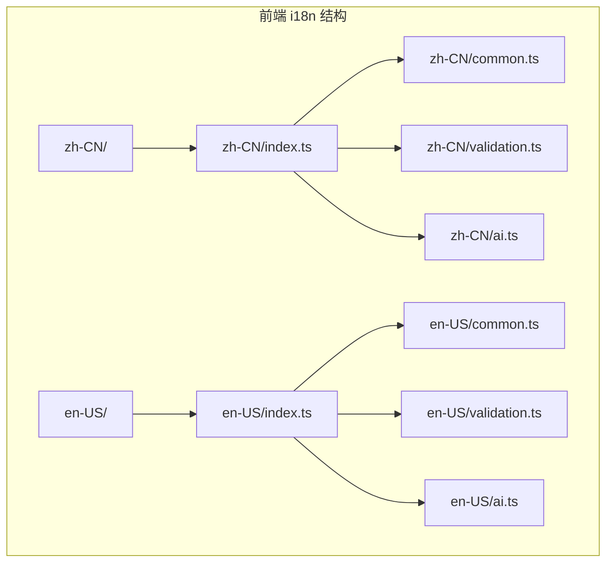
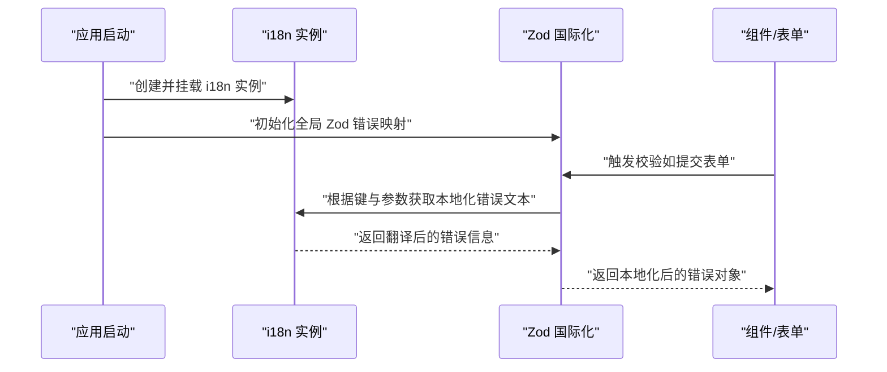
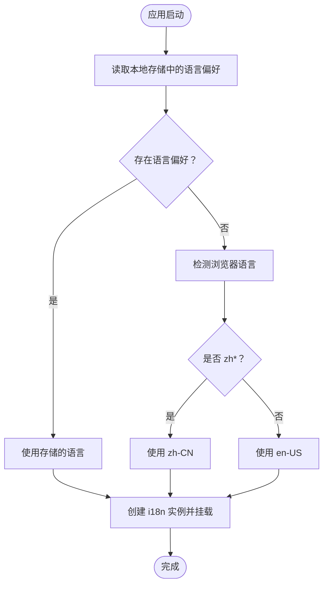
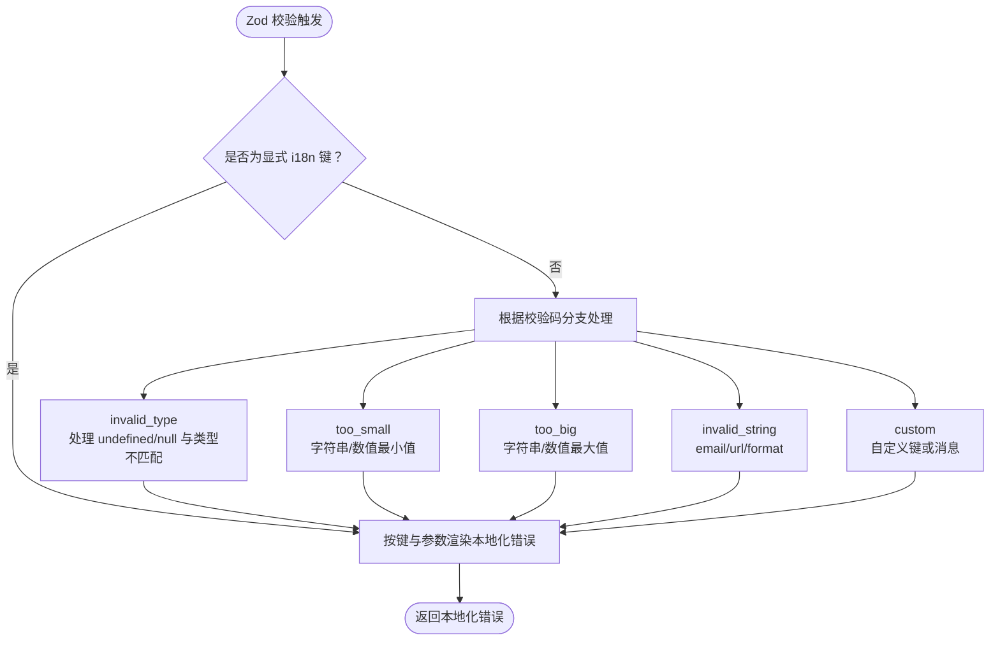
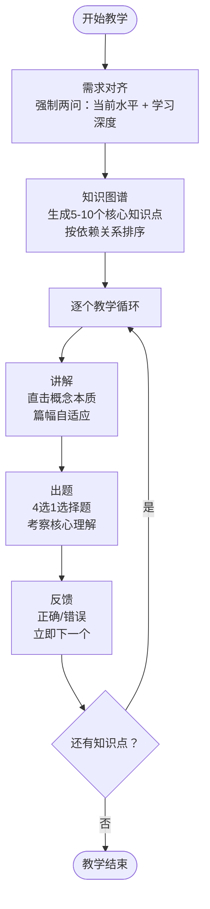
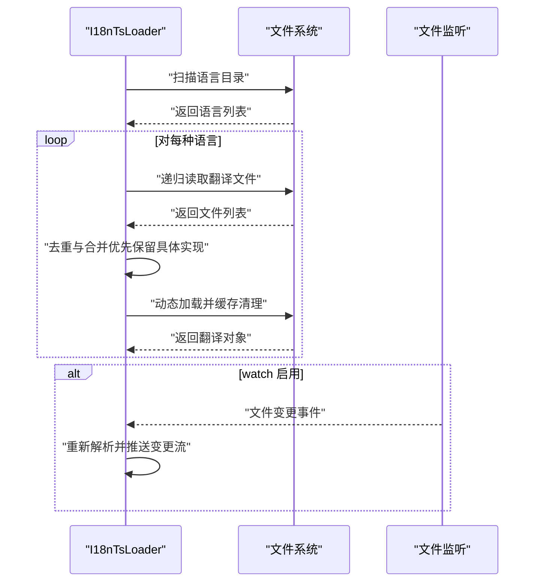
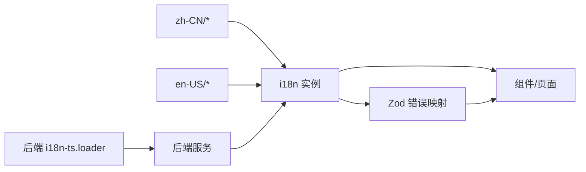

# 国际化

<cite>
**本文引用的文件**
- [apps/frontend/src/i18n/index.ts](file://apps/frontend/src/i18n/index.ts)
- [apps/frontend/src/i18n/locales/zh-CN/index.ts](file://apps/frontend/src/i18n/locales/zh-CN/index.ts)
- [apps/frontend/src/i18n/locales/en-US/index.ts](file://apps/frontend/src/i18n/locales/en-US/index.ts)
- [apps/frontend/src/i18n/locales/zh-CN/common.ts](file://apps/frontend/src/i18n/locales/zh-CN/common.ts)
- [apps/frontend/src/i18n/locales/en-US/common.ts](file://apps/frontend/src/i18n/locales/en-US/common.ts)
- [apps/frontend/src/i18n/locales/zh-CN/validation.ts](file://apps/frontend/src/i18n/locales/zh-CN/validation.ts)
- [apps/frontend/src/i18n/locales/en-US/validation.ts](file://apps/frontend/src/i18n/locales/en-US/validation.ts)
- [apps/frontend/src/i18n/locales/zh-CN/ai.ts](file://apps/frontend/src/i18n/locales/zh-CN/ai.ts)
- [apps/frontend/src/i18n/locales/en-US/ai.ts](file://apps/frontend/src/i18n/locales/en-US/ai.ts)
- [apps/frontend/src/lib/zod-i18n.ts](file://apps/frontend/src/lib/zod-i18n.ts)
- [apps/frontend/src/main.ts](file://apps/frontend/src/main.ts)
- [apps/backend/src/i18n/i18n-ts.loader.ts](file://apps/backend/src/i18n/i18n-ts.loader.ts)
- [apps/backend/src/i18n/zh-CN/validation.ts](file://apps/backend/src/i18n/zh-CN/validation.ts)
- [apps/backend/src/i18n/en-US/validation.ts](file://apps/backend/src/i18n/en-US/validation.ts)
- [apps/frontend/src/features/todo/components/TodoHeader.vue](file://apps/frontend/src/features/todo/components/TodoHeader.vue)
- [apps/frontend/tests/features/todo/components/TodoHeader.spec.ts](file://apps/frontend/tests/features/todo/components/TodoHeader.spec.ts)
- [apps/frontend/tests/features/ai/services/utils.spec.ts](file://apps/frontend/tests/features/ai/services/utils.spec.ts)
- [apps/frontend/src/features/ai/services/utils/systemPrompts.ts](file://apps/frontend/src/features/ai/services/utils/systemPrompts.ts)
</cite>

## 更新摘要
**变更内容**
- 修复了TodoHeader组件中语言切换显示逻辑的关键bug
- 修正了中英文显示逻辑的反转问题，确保Chinese环境显示'中文'而English环境显示'English'
- 更新了语言切换功能的测试验证
- **新增**：en-US语言包中的AI教学模式系统提示结构完全重构，强调更严格而友善的指导方法，重新组织了工作流程为严格的三步过程

## 目录
1. [简介](#简介)
2. [项目结构](#项目结构)
3. [核心组件](#核心组件)
4. [架构总览](#架构总览)
5. [详细组件分析](#详细组件分析)
6. [依赖关系分析](#依赖关系分析)
7. [性能考量](#性能考量)
8. [故障排查指南](#故障排查指南)
9. [结论](#结论)
10. [附录](#附录)

## 简介
本文件系统性梳理 Lumina Todo 前端国际化（i18n）体系，覆盖以下方面：
- i18n 配置与多语言支持策略
- 翻译文件组织结构、键值管理与动态加载机制
- Zod 验证的国际化集成与表单验证多语言支持
- 语言切换、本地化格式化与 RTL 支持现状与扩展建议
- 翻译内容维护策略、翻译工具集成与质量保证流程
- 国际化开发最佳实践与扩展指导

## 项目结构
前端 i18n 采用按功能域拆分的模块化组织方式：每个语言目录下按领域划分文件（如 common、auth、todo、validation、ai 等），通过 index 文件统一聚合导出，形成清晰的"领域-语言"矩阵。

**图表来源**
- [apps/frontend/src/i18n/locales/zh-CN/index.ts:1-28](file://apps/frontend/src/i18n/locales/zh-CN/index.ts#L1-L28)
- [apps/frontend/src/i18n/locales/en-US/index.ts:1-28](file://apps/frontend/src/i18n/locales/en-US/index.ts#L1-L28)
- [apps/frontend/src/i18n/locales/zh-CN/common.ts:1-95](file://apps/frontend/src/i18n/locales/zh-CN/common.ts#L1-L95)
- [apps/frontend/src/i18n/locales/en-US/common.ts:1-95](file://apps/frontend/src/i18n/locales/en-US/common.ts#L1-L95)
- [apps/frontend/src/i18n/locales/zh-CN/validation.ts:1-14](file://apps/frontend/src/i18n/locales/zh-CN/validation.ts#L1-L14)
- [apps/frontend/src/i18n/locales/en-US/validation.ts:1-14](file://apps/frontend/src/i18n/locales/en-US/validation.ts#L1-L14)
- [apps/frontend/src/i18n/locales/zh-CN/ai.ts:1-581](file://apps/frontend/src/i18n/locales/zh-CN/ai.ts#L1-L581)
- [apps/frontend/src/i18n/locales/en-US/ai.ts:1-596](file://apps/frontend/src/i18n/locales/en-US/ai.ts#L1-L596)

**章节来源**
- [apps/frontend/src/i18n/index.ts:1-37](file://apps/frontend/src/i18n/index.ts#L1-L37)
- [apps/frontend/src/i18n/locales/zh-CN/index.ts:1-28](file://apps/frontend/src/i18n/locales/zh-CN/index.ts#L1-L28)
- [apps/frontend/src/i18n/locales/en-US/index.ts:1-28](file://apps/frontend/src/i18n/locales/en-US/index.ts#L1-L28)

## 核心组件
- i18n 实例与类型安全
  - 使用 vue-i18n 创建实例，启用组合式 API（legacy: false），设置回退语言与多语言映射。
  - 通过深度字符串化生成 MessageSchema 类型，确保翻译键值均为字符串，提升类型安全性。
  - 默认语言解析逻辑：优先读取本地存储，其次使用浏览器语言；对 zh 开头语言自动映射到 zh-CN，其余默认 en-US。
- 翻译文件组织
  - 按语言与功能域分层：语言目录下按领域拆分文件，index 聚合导出，便于维护与查找。
  - 常用领域：common（通用文案）、validation（验证文案）、auth/todo/statistics/pomodoro/ai 等。
- Zod 国际化集成
  - 自定义 Zod 错误映射，结合 i18n.t 将错误信息国际化。
  - 支持字段路径翻译（fields.email 等）、内置校验码映射（REQUIRED、MIN_LENGTH、MAX_VALUE 等）以及参数注入（{property}、{min}、{max} 等）。
  - 同时初始化本地与共享包的 Zod 错误映射，确保前后端一致的错误提示风格。
- AI教学模式系统提示
  - **更新**：en-US语言包中的AI教学模式系统提示结构完全重构，强调更严格而友善的指导方法。
  - 工作流程重新组织为严格的三步过程：需求对齐（Needs Alignment）→知识图谱（Knowledge Map）→逐个教学（Teach One by One）。
  - 每个知识点的教学严格按照"讲解→出题→反馈"的固定流程执行，确保学习效果和节奏控制。

**章节来源**
- [apps/frontend/src/i18n/index.ts:1-37](file://apps/frontend/src/i18n/index.ts#L1-L37)
- [apps/frontend/src/lib/zod-i18n.ts:1-96](file://apps/frontend/src/lib/zod-i18n.ts#L1-L96)
- [apps/frontend/src/main.ts:28-33](file://apps/frontend/src/main.ts#L28-L33)
- [apps/frontend/src/i18n/locales/en-US/ai.ts:270-307](file://apps/frontend/src/i18n/locales/en-US/ai.ts#L270-L307)
- [apps/frontend/src/i18n/locales/zh-CN/ai.ts:255-292](file://apps/frontend/src/i18n/locales/zh-CN/ai.ts#L255-L292)

## 架构总览
前端 i18n 与 Zod 集成的整体流程如下：

**图表来源**
- [apps/frontend/src/main.ts:28-33](file://apps/frontend/src/main.ts#L28-L33)
- [apps/frontend/src/lib/zod-i18n.ts:18-87](file://apps/frontend/src/lib/zod-i18n.ts#L18-L87)

## 详细组件分析

### 前端 i18n 配置与类型系统
- 实例创建与回退策略
  - legacy: false，启用组合式 API；fallbackLocale 设为 zh-CN，确保缺失翻译时有合理回退。
  - 支持 zh/en 及 zh-CN/en-US 两种写法，便于与浏览器语言匹配。
- 类型安全与消息模式
  - 通过 DeepStringify 将消息树转为仅含字符串的类型，避免运行时类型不一致。
  - MessageSchema 作为 i18n.global 的类型约束，保障模板与代码中对 t 的调用安全。
- 默认语言解析
  - 优先从 localStorage 读取；若不存在则使用 navigator.language，并对 zh* 自动映射为 zh-CN，其余默认 en-US。

**图表来源**
- [apps/frontend/src/i18n/index.ts:12-20](file://apps/frontend/src/i18n/index.ts#L12-L20)
- [apps/frontend/src/i18n/index.ts:24-34](file://apps/frontend/src/i18n/index.ts#L24-L34)

**章节来源**
- [apps/frontend/src/i18n/index.ts:1-37](file://apps/frontend/src/i18n/index.ts#L1-L37)

### 翻译文件组织与键值管理
- 组织结构
  - 语言目录下按功能域拆分文件，index 聚合导出，形成"领域-语言"矩阵，便于维护与扩展。
  - 常见领域：common（通用文案与字段名）、validation（验证文案）、auth/todo/statistics/pomodoro/ai 等。
- 键值设计原则
  - 采用层级命名空间：common.fields.email、validation.REQUIRED 等，保持一致性与可读性。
  - 字段名与业务实体解耦，通过 common.fields.* 映射显示名称，利于复用与统一风格。
- 示例要点
  - common 中包含通用按钮、状态文案、主题与上传等键值，便于跨组件复用。
  - validation 中包含必填、长度、数值范围、邮箱、URL 等常用规则的本地化文案。
  - **新增**：AI领域包含丰富的教学模式提示词，支持严格的三步教学流程。

**章节来源**
- [apps/frontend/src/i18n/locales/zh-CN/index.ts:1-28](file://apps/frontend/src/i18n/locales/zh-CN/index.ts#L1-L28)
- [apps/frontend/src/i18n/locales/en-US/index.ts:1-28](file://apps/frontend/src/i18n/locales/en-US/index.ts#L1-L28)
- [apps/frontend/src/i18n/locales/zh-CN/common.ts:75-84](file://apps/frontend/src/i18n/locales/zh-CN/common.ts#L75-L84)
- [apps/frontend/src/i18n/locales/en-US/common.ts:75-84](file://apps/frontend/src/i18n/locales/en-US/common.ts#L75-L84)
- [apps/frontend/src/i18n/locales/zh-CN/validation.ts:1-14](file://apps/frontend/src/i18n/locales/zh-CN/validation.ts#L1-L14)
- [apps/frontend/src/i18n/locales/en-US/validation.ts:1-14](file://apps/frontend/src/i18n/locales/en-US/validation.ts#L1-L14)
- [apps/frontend/src/i18n/locales/zh-CN/ai.ts:1-581](file://apps/frontend/src/i18n/locales/zh-CN/ai.ts#L1-L581)
- [apps/frontend/src/i18n/locales/en-US/ai.ts:1-596](file://apps/frontend/src/i18n/locales/en-US/ai.ts#L1-L596)

### Zod 验证国际化集成
- 错误映射策略
  - 优先处理显式传入的 i18n 键（如 validation.REQUIRED），直接按键与参数渲染。
  - 对内置校验码（invalid_type、too_small、too_big、invalid_string、custom）进行映射，结合字段路径与参数生成本地化错误。
  - 字段路径翻译：将 email、data.title 等路径映射为 common.fields.email、common.fields.data.title 等。
- 参数注入与占位符
  - 支持 {property}、{min}/{maximum}、{expected}/{received} 等参数，确保错误信息可读且上下文明确。
- 初始化与生效
  - 在应用入口初始化全局 Zod 错误映射，同时对本地与共享包的 zod 实例生效，保证前后端一致。

**图表来源**
- [apps/frontend/src/lib/zod-i18n.ts:18-87](file://apps/frontend/src/lib/zod-i18n.ts#L18-L87)

**章节来源**
- [apps/frontend/src/lib/zod-i18n.ts:1-96](file://apps/frontend/src/lib/zod-i18n.ts#L1-L96)
- [apps/frontend/src/main.ts:28-33](file://apps/frontend/src/main.ts#L28-L33)

### AI教学模式系统提示重构

**更新** en-US语言包中的AI教学模式系统提示结构完全重构

- 教学理念升级
  - 从"needs alignment"（需求对齐）改为"Needs Alignment"（首字母大写），体现更正式和专业的教学态度。
  - 强调"严格而友善"的指导方法，既保持学术严谨性又不失亲和力。
- 严格三步工作流程
  - **第一步：需求对齐（Needs Alignment）**：强制要求用户回答两个关键问题，确保教学内容与用户水平和目标相匹配。
  - **第二步：知识图谱（Knowledge Map）**：基于用户回答生成5-10个核心知识点，按学习依赖关系排序。
  - **第三步：逐个教学（Teach One by One）**：每个知识点严格执行"讲解→出题→反馈"的固定流程。
- 教学节奏控制
  - 每个知识点最多2轮对话：讲解后立即出题，无论对错都立即进入下一个知识点。
  - 严禁反复纠偏或延长教学时间，确保学习效率和专注度。
- 反馈规则标准化
  - 正确答案：简短确认后立即进入下一个知识点。
  - 错误答案：纠正并简短解释核心误区后立即进入下一个知识点。
  - 严格避免长篇大论、补充题和反复追问。

**图表来源**
- [apps/frontend/src/i18n/locales/en-US/ai.ts:270-307](file://apps/frontend/src/i18n/locales/en-US/ai.ts#L270-L307)
- [apps/frontend/src/i18n/locales/zh-CN/ai.ts:255-292](file://apps/frontend/src/i18n/locales/zh-CN/ai.ts#L255-L292)

**章节来源**
- [apps/frontend/src/i18n/locales/en-US/ai.ts:270-307](file://apps/frontend/src/i18n/locales/en-US/ai.ts#L270-L307)
- [apps/frontend/src/i18n/locales/zh-CN/ai.ts:255-292](file://apps/frontend/src/i18n/locales/zh-CN/ai.ts#L255-L292)
- [apps/frontend/tests/features/ai/services/utils.spec.ts:641-660](file://apps/frontend/tests/features/ai/services/utils.spec.ts#L641-L660)

### 动态加载机制与后端联动
- 前端动态加载
  - 前端 i18n 通过静态导入语言包并挂载至 i18n 实例，不涉及运行时动态拉取。
- 后端动态加载
  - 后端 i18n-ts.loader 提供基于文件系统的动态加载能力：
    - 递归扫描语言目录，合并同名文件（优先选择非 .d.ts 的具体实现文件）。
    - 支持监听文件变化（watch），在开发环境自动热更新。
    - 加载顺序：先解析语言列表，再逐语言合并所有翻译文件，最终输出完整翻译树。
  - 该机制适合后端服务端渲染或需要热更新的场景，前端可参考其"按需合并"的思想进行模块化拆分与懒加载设计。

**图表来源**
- [apps/backend/src/i18n/i18n-ts.loader.ts:136-183](file://apps/backend/src/i18n/i18n-ts.loader.ts#L136-L183)
- [apps/backend/src/i18n/i18n-ts.loader.ts:104-120](file://apps/backend/src/i18n/i18n-ts.loader.ts#L104-L120)

**章节来源**
- [apps/backend/src/i18n/i18n-ts.loader.ts:1-185](file://apps/backend/src/i18n/i18n-ts.loader.ts#L1-L185)

### 语言切换、本地化格式化与 RTL 支持

**更新** 修复了语言切换功能中的关键bug

- 语言切换
  - 默认语言解析：优先本地存储，其次浏览器语言，再回退到 zh-CN 或 en-US。
  - 切换语言可通过修改 i18n 实例的 locale 并配合路由或设置页持久化偏好。
  - **关键修复**：修正了 TodoHeader 组件中中英文显示逻辑的反转问题，确保 Chinese 环境显示'中文'而 English 环境显示'English'。
- 本地化格式化
  - 当前翻译键值为纯文本，未引入日期/数字/货币等 ICU/Intl 格式化。
  - 建议在需要时通过 vue-i18n 的数字/日期过滤器或自定义格式化函数扩展。
- RTL 支持
  - 当前未发现 RTL 语言（如阿拉伯语、希伯来语）的专门适配。
  - 扩展建议：新增语言目录与对应样式适配，或在布局层面通过 direction 属性与 CSS 适配。

**章节来源**
- [apps/frontend/src/i18n/index.ts:12-20](file://apps/frontend/src/i18n/index.ts#L12-L20)
- [apps/frontend/src/features/todo/components/TodoHeader.vue:88-92](file://apps/frontend/src/features/todo/components/TodoHeader.vue#L88-L92)

## 依赖关系分析
- 组件耦合
  - 组件通过 useI18n 获取 t 函数，依赖 i18n 实例；Zod 国际化通过全局错误映射间接依赖 i18n。
  - 翻译文件之间无直接依赖，通过 index 聚合，降低耦合度。
- 外部依赖
  - vue-i18n：提供多语言与类型安全能力。
  - zod：提供强类型校验与错误映射扩展点。
  - 后端 i18n-ts.loader：提供动态加载与监听能力，前端可借鉴其"合并优先级"策略。

**图表来源**
- [apps/frontend/src/i18n/index.ts:24-34](file://apps/frontend/src/i18n/index.ts#L24-L34)
- [apps/frontend/src/lib/zod-i18n.ts:18-87](file://apps/frontend/src/lib/zod-i18n.ts#L18-L87)
- [apps/backend/src/i18n/i18n-ts.loader.ts:163-183](file://apps/backend/src/i18n/i18n-ts.loader.ts#L163-L183)

**章节来源**
- [apps/frontend/src/i18n/index.ts:1-37](file://apps/frontend/src/i18n/index.ts#L1-L37)
- [apps/frontend/src/lib/zod-i18n.ts:1-96](file://apps/frontend/src/lib/zod-i18n.ts#L1-L96)
- [apps/backend/src/i18n/i18n-ts.loader.ts:1-185](file://apps/backend/src/i18n/i18n-ts.loader.ts#L1-L185)

## 性能考量
- 前端加载
  - 采用静态导入语言包，打包时按需分割，避免一次性加载全部语言。
  - 若未来引入更多语言，可考虑运行时动态导入以减小首屏体积。
- 后端加载
  - 文件监听与缓存清理在开发环境提升迭代效率；生产环境建议禁用监听以减少开销。
  - 合并策略避免重复键覆盖，减少运行时合并成本。

## 故障排查指南
- 常见问题
  - 键不存在或拼写错误：检查 common.fields.* 与 validation.* 是否与实际键一致。
  - 参数未注入：确认调用时传入了 {property}、{min}、{max} 等参数。
  - 浏览器语言不生效：检查 localStorage 是否设置了 locale，或浏览器语言是否为 zh*。
  - **语言切换显示异常**：检查 TodoHeader 组件中的中英文显示逻辑，确保逻辑正确。
  - **AI教学模式异常**：检查teachingModeSystemPrompt键值是否正确加载，确认三步流程的严格性。
- 排查步骤
  - 在组件中打印当前 locale 与可用语言列表，确认实例已正确挂载。
  - 在控制台调用 i18n.global.t('your.key') 验证翻译是否存在。
  - 对于 Zod 错误，检查传入的键是否为 validation.* 或字段路径是否正确。
  - **语言切换问题**：检查 TodoHeader 组件中第279行和第341行的显示逻辑。
  - **AI教学模式问题**：检查系统提示词是否包含严格的三步工作流程，确认首字母大写的"Needs Alignment"。

**章节来源**
- [apps/frontend/src/i18n/index.ts:12-20](file://apps/frontend/src/i18n/index.ts#L12-L20)
- [apps/frontend/src/lib/zod-i18n.ts:18-87](file://apps/frontend/src/lib/zod-i18n.ts#L18-L87)
- [apps/frontend/src/features/todo/components/TodoHeader.vue:279](file://apps/frontend/src/features/todo/components/TodoHeader.vue#L279)
- [apps/frontend/src/features/todo/components/TodoHeader.vue:341](file://apps/frontend/src/features/todo/components/TodoHeader.vue#L341)
- [apps/frontend/tests/features/ai/services/utils.spec.ts:641-660](file://apps/frontend/tests/features/ai/services/utils.spec.ts#L641-L660)

## 结论
Lumina Todo 前端国际化体系以 vue-i18n 为核心，结合严格的类型约束与清晰的功能域拆分，实现了高可维护性的多语言支持。Zod 国际化集成进一步提升了表单校验的用户体验。后端 i18n-ts.loader 提供了动态加载与监听能力，为服务端场景提供了参考。本次更新特别强化了AI教学模式的国际化支持，通过重构en-US语言包中的系统提示结构，实现了更严格而友善的教学指导方法。后续可在语言切换、本地化格式化与 RTL 支持等方面继续完善，并通过翻译工具与自动化校验流程提升质量与效率。

**更新** 本次更新修复了语言切换功能中的关键bug，确保用户界面能够正确显示当前语言状态，提升了用户体验的一致性和准确性。同时，en-US语言包中的AI教学模式系统提示结构完全重构，强调更严格而友善的指导方法，重新组织了工作流程为严格的三步过程，显著提升了教学质量和学习效果。

## 附录
- 最佳实践
  - 键值命名：采用领域.子域.键的层级命名，统一字段名映射至 common.fields.*。
  - 参数化：错误文案尽量参数化，便于复用与本地化。
  - 类型安全：保持 MessageSchema 与实际翻译文件一致，避免运行时错误。
  - 维护策略：建立翻译清单与变更追踪，定期校验缺失键与冗余键。
  - **代码质量**：在修改显示逻辑时，务必进行充分的测试验证，确保逻辑正确性。
  - **AI教学模式**：确保系统提示词的严格性，维护固定的三步工作流程，避免破坏教学效果。
- 扩展建议
  - 引入 ICU/Intl 格式化以支持日期/数字/货币等。
  - 新增 RTL 语言目录与样式适配。
  - 前端可引入按需动态导入语言包，优化首屏体积。
  - 后端可启用监听以支持开发环境热更新。
  - **测试驱动**：为语言切换功能编写专门的测试用例，确保显示逻辑的正确性。
  - **AI教学模式**：为系统提示词的严格性建立自动化测试，确保三步流程的完整性。