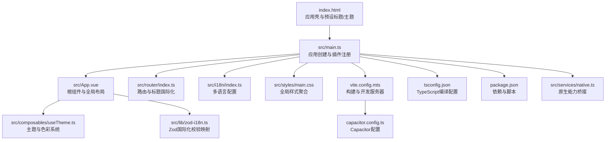
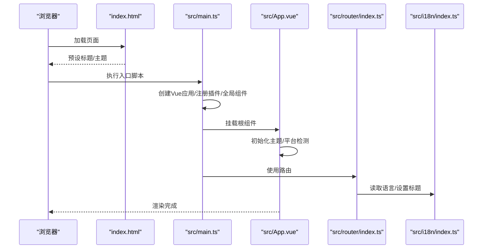
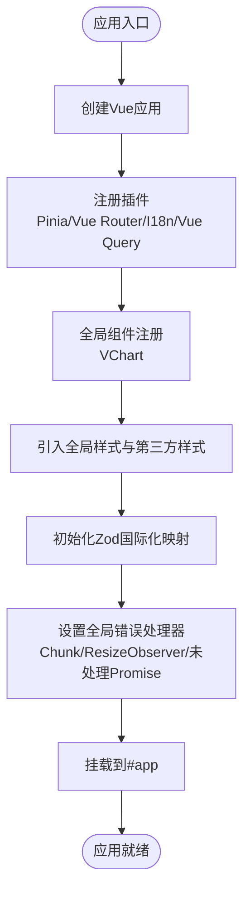
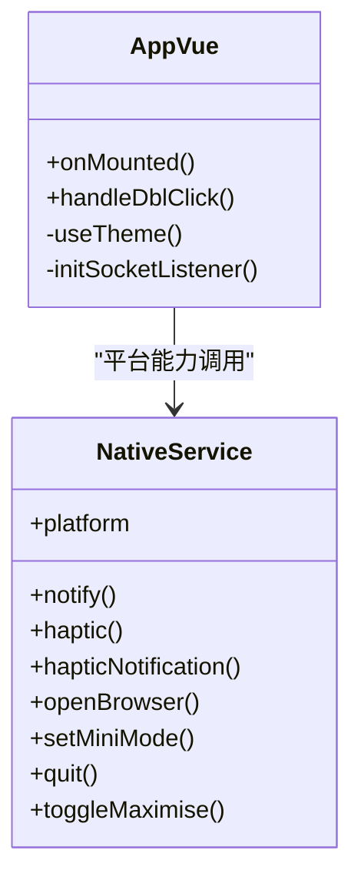
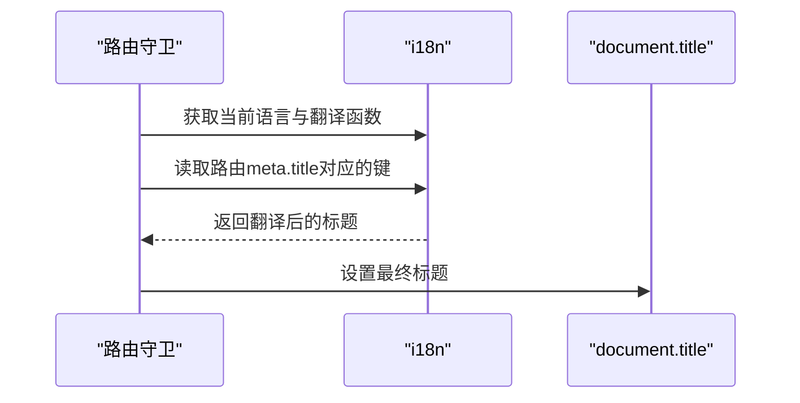
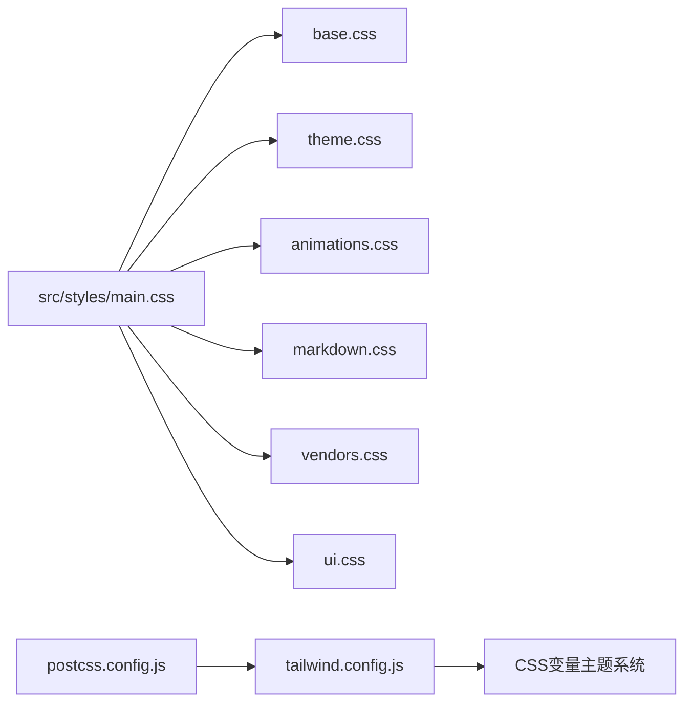
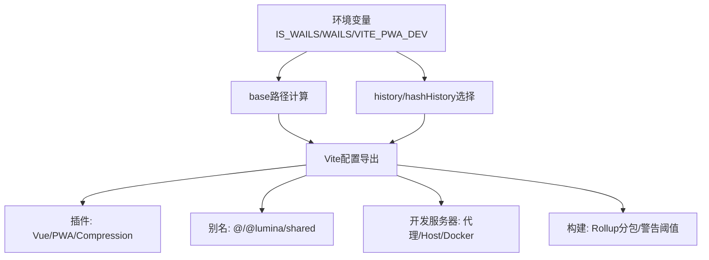
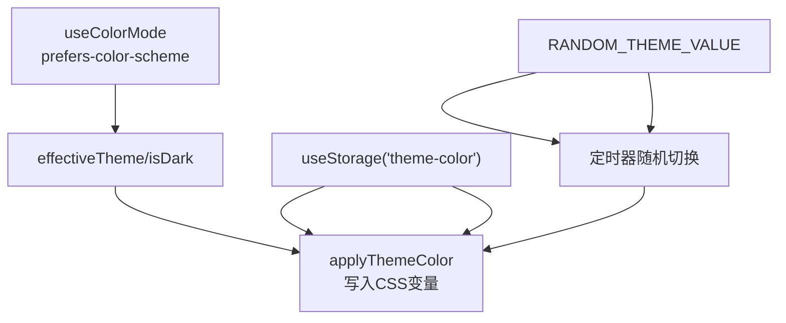
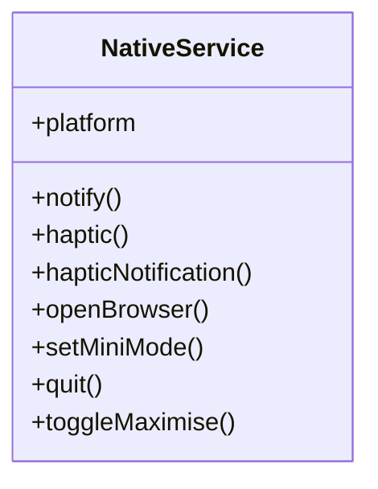
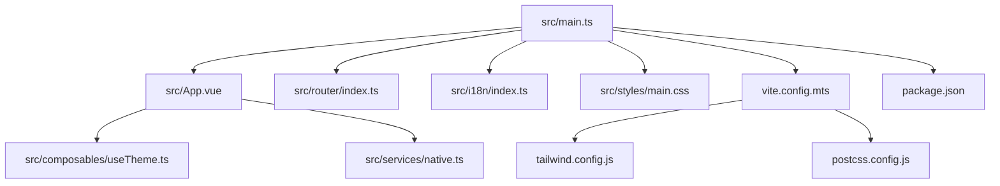

# 应用结构

<cite>
**本文引用的文件**
- [apps/frontend/src/main.ts](file://apps/frontend/src/main.ts)
- [apps/frontend/src/App.vue](file://apps/frontend/src/App.vue)
- [apps/frontend/vite.config.mts](file://apps/frontend/vite.config.mts)
- [apps/frontend/package.json](file://apps/frontend/package.json)
- [apps/frontend/tsconfig.json](file://apps/frontend/tsconfig.json)
- [apps/frontend/src/router/index.ts](file://apps/frontend/src/router/index.ts)
- [apps/frontend/src/i18n/index.ts](file://apps/frontend/src/i18n/index.ts)
- [apps/frontend/src/styles/main.css](file://apps/frontend/src/styles/main.css)
- [apps/frontend/tailwind.config.js](file://apps/frontend/tailwind.config.js)
- [apps/frontend/postcss.config.js](file://apps/frontend/postcss.config.js)
- [apps/frontend/src/lib/zod-i18n.ts](file://apps/frontend/src/lib/zod-i18n.ts)
- [apps/frontend/src/composables/useTheme.ts](file://apps/frontend/src/composables/useTheme.ts)
- [apps/frontend/src/services/native.ts](file://apps/frontend/src/services/native.ts)
- [apps/frontend/capacitor.config.ts](file://apps/frontend/capacitor.config.ts)
- [apps/frontend/index.html](file://apps/frontend/index.html)
</cite>

## 目录
1. [引言](#引言)
2. [项目结构](#项目结构)
3. [核心组件](#核心组件)
4. [架构总览](#架构总览)
5. [详细组件分析](#详细组件分析)
6. [依赖关系分析](#依赖关系分析)
7. [性能考量](#性能考量)
8. [故障排查指南](#故障排查指南)
9. [结论](#结论)
10. [附录](#附录)

## 引言
本文件面向Lumina Todo前端应用，聚焦其初始化流程、核心配置与启动过程，系统梳理main.ts中的应用创建、插件注册、全局配置与错误处理机制；阐述App.vue根组件的设计理念与结构；解释Vite配置、TypeScript支持与开发环境设置；并给出应用生命周期管理、全局样式引入与第三方库集成策略的最佳实践与扩展建议。

## 项目结构
前端应用位于apps/frontend目录，采用Vite+Vue3+TypeScript技术栈，结合TailwindCSS与PWA能力，并通过Capacitor/Wails实现跨平台打包与原生能力桥接。核心入口为index.html与src/main.ts，应用主体在App.vue中组织，路由与国际化分别在router与i18n模块中配置，样式通过styles/main.css统一引入，构建与开发服务器由vite.config.mts管理。

图表来源
- [apps/frontend/index.html:1-39](file://apps/frontend/index.html#L1-L39)
- [apps/frontend/src/main.ts:1-138](file://apps/frontend/src/main.ts#L1-L138)
- [apps/frontend/src/App.vue:1-77](file://apps/frontend/src/App.vue#L1-L77)
- [apps/frontend/src/router/index.ts:1-73](file://apps/frontend/src/router/index.ts#L1-L73)
- [apps/frontend/src/i18n/index.ts:1-37](file://apps/frontend/src/i18n/index.ts#L1-L37)
- [apps/frontend/src/styles/main.css:1-7](file://apps/frontend/src/styles/main.css#L1-L7)
- [apps/frontend/vite.config.mts:1-185](file://apps/frontend/vite.config.mts#L1-L185)
- [apps/frontend/tsconfig.json:1-28](file://apps/frontend/tsconfig.json#L1-L28)
- [apps/frontend/package.json:1-105](file://apps/frontend/package.json#L1-L105)
- [apps/frontend/src/services/native.ts:1-116](file://apps/frontend/src/services/native.ts#L1-L116)
- [apps/frontend/src/composables/useTheme.ts:1-378](file://apps/frontend/src/composables/useTheme.ts#L1-L378)
- [apps/frontend/src/lib/zod-i18n.ts:1-96](file://apps/frontend/src/lib/zod-i18n.ts#L1-L96)
- [apps/frontend/capacitor.config.ts:1-23](file://apps/frontend/capacitor.config.ts#L1-L23)

章节来源
- [apps/frontend/index.html:1-39](file://apps/frontend/index.html#L1-L39)
- [apps/frontend/src/main.ts:1-138](file://apps/frontend/src/main.ts#L1-L138)
- [apps/frontend/src/App.vue:1-77](file://apps/frontend/src/App.vue#L1-L77)
- [apps/frontend/src/router/index.ts:1-73](file://apps/frontend/src/router/index.ts#L1-L73)
- [apps/frontend/src/i18n/index.ts:1-37](file://apps/frontend/src/i18n/index.ts#L1-L37)
- [apps/frontend/src/styles/main.css:1-7](file://apps/frontend/src/styles/main.css#L1-L7)
- [apps/frontend/vite.config.mts:1-185](file://apps/frontend/vite.config.mts#L1-L185)
- [apps/frontend/tsconfig.json:1-28](file://apps/frontend/tsconfig.json#L1-L28)
- [apps/frontend/package.json:1-105](file://apps/frontend/package.json#L1-L105)
- [apps/frontend/src/services/native.ts:1-116](file://apps/frontend/src/services/native.ts#L1-L116)
- [apps/frontend/src/composables/useTheme.ts:1-378](file://apps/frontend/src/composables/useTheme.ts#L1-L378)
- [apps/frontend/src/lib/zod-i18n.ts:1-96](file://apps/frontend/src/lib/zod-i18n.ts#L1-L96)
- [apps/frontend/capacitor.config.ts:1-23](file://apps/frontend/capacitor.config.ts#L1-L23)

## 核心组件
- 应用入口与初始化：在main.ts中完成Vue应用创建、插件注册（Pinia、Vue Router、Vue I18n、Vue Query）、全局组件注册（VChart）以及错误处理与持久化配置。
- 根组件与布局：App.vue负责主题初始化、Wails平台拖拽区域、全局事件（WebSocket监听）、Toast与AI迁移提示等。
- 路由与国际化：router根据IS_WAILS环境变量选择history/hashHistory，并在beforeEach中基于i18n动态设置页面标题。
- 样式与主题：styles/main.css聚合基础样式、主题、动画、markdown与UI样式；useTheme提供深浅色模式与主题色管理。
- 构建与开发：vite.config.mts配置别名、代理、PWA、压缩、分包策略与Wails/PWA开发模式开关；tsconfig.json与package.json分别提供TypeScript与依赖脚本支持。

章节来源
- [apps/frontend/src/main.ts:54-137](file://apps/frontend/src/main.ts#L54-L137)
- [apps/frontend/src/App.vue:1-77](file://apps/frontend/src/App.vue#L1-L77)
- [apps/frontend/src/router/index.ts:7-70](file://apps/frontend/src/router/index.ts#L7-L70)
- [apps/frontend/src/i18n/index.ts:24-34](file://apps/frontend/src/i18n/index.ts#L24-L34)
- [apps/frontend/src/styles/main.css:1-7](file://apps/frontend/src/styles/main.css#L1-L7)
- [apps/frontend/src/composables/useTheme.ts:308-377](file://apps/frontend/src/composables/useTheme.ts#L308-L377)
- [apps/frontend/vite.config.mts:80-184](file://apps/frontend/vite.config.mts#L80-L184)
- [apps/frontend/tsconfig.json:1-28](file://apps/frontend/tsconfig.json#L1-L28)
- [apps/frontend/package.json:1-105](file://apps/frontend/package.json#L1-L105)

## 架构总览
下图展示从浏览器加载到应用启动的关键交互：HTML预设标题与主题，随后加载main.ts创建应用并挂载；路由与国际化在应用启动后生效；构建工具链在开发与生产阶段提供不同优化策略。

图表来源
- [apps/frontend/index.html:13-32](file://apps/frontend/index.html#L13-L32)
- [apps/frontend/src/main.ts:54-137](file://apps/frontend/src/main.ts#L54-L137)
- [apps/frontend/src/App.vue:11-23](file://apps/frontend/src/App.vue#L11-L23)
- [apps/frontend/src/router/index.ts:56-70](file://apps/frontend/src/router/index.ts#L56-L70)
- [apps/frontend/src/i18n/index.ts:24-34](file://apps/frontend/src/i18n/index.ts#L24-L34)

## 详细组件分析

### 应用入口与初始化（main.ts）
- 应用创建与插件注册
  - 使用Vue创建应用实例，依次注册Pinia（含持久化插件）、Vue Router、Vue I18n与Vue Query（带默认查询缓存策略）。
  - 全局注册VChart组件以支持ECharts可视化。
- 全局样式与第三方库
  - 引入全局样式入口与Markdown/KaTeX样式，按需注册ECharts核心组件。
  - 初始化Zod国际化映射，确保表单校验错误信息具备多语言支持。
- 错误处理机制
  - 全局错误处理器捕获并识别“动态模块加载失败”类Chunk错误，配合sessionStorage进行防抖刷新。
  - window.onerror与unhandledrejection同样进行Chunk错误识别与日志记录；忽略特定ResizeObserver良性错误，避免干扰。
- 启动挂载
  - 完成所有配置后将应用挂载到#app节点。

图表来源
- [apps/frontend/src/main.ts:54-137](file://apps/frontend/src/main.ts#L54-L137)

章节来源
- [apps/frontend/src/main.ts:10-137](file://apps/frontend/src/main.ts#L10-L137)

### 根组件设计（App.vue）
- 主题与平台适配
  - 初始化useTheme以应用深浅色模式与主题色；在Wails平台下添加拖拽区域与双击最大化行为。
- 全局事件
  - 在mounted中初始化全局WebSocket监听，确保应用运行期的消息同步。
- 结构与样式
  - 顶层容器使用Tailwind类控制尺寸与过渡；Wails拖拽区域通过z-index与CSS变量避免误触；底部提供Toast与AI迁移提示组件。

图表来源
- [apps/frontend/src/App.vue:1-77](file://apps/frontend/src/App.vue#L1-L77)
- [apps/frontend/src/services/native.ts:9-115](file://apps/frontend/src/services/native.ts#L9-L115)

章节来源
- [apps/frontend/src/App.vue:1-77](file://apps/frontend/src/App.vue#L1-L77)
- [apps/frontend/src/services/native.ts:1-116](file://apps/frontend/src/services/native.ts#L1-L116)

### 路由与国际化（router/index.ts 与 i18n/index.ts）
- 路由策略
  - 根据IS_WAILS环境变量选择history或hashHistory，保证在Wails环境下稳定运行。
  - 动态导入各视图组件，降低首屏体积。
  - beforeEach中通过i18n.global.t读取标题键，动态设置document.title。
- 国际化策略
  - 支持zh-CN/en-US及别名zh/en；默认语言优先取localStorage，其次浏览器语言；回退语言为zh-CN。
  - 类型安全：通过DeepStringify与MessageSchema确保消息键的类型约束。

图表来源
- [apps/frontend/src/router/index.ts:56-70](file://apps/frontend/src/router/index.ts#L56-L70)
- [apps/frontend/src/i18n/index.ts:12-34](file://apps/frontend/src/i18n/index.ts#L12-L34)

章节来源
- [apps/frontend/src/router/index.ts:1-73](file://apps/frontend/src/router/index.ts#L1-L73)
- [apps/frontend/src/i18n/index.ts:1-37](file://apps/frontend/src/i18n/index.ts#L1-L37)

### 样式体系与主题（styles/main.css 与 tailwind.config.js）
- 样式聚合
  - main.css统一引入base/theme/animations/markdown/vendors/ui，形成一致的样式基线。
- Tailwind扩展
  - 基于CSS变量扩展颜色、字体、阴影、圆角、动画与响应式断点，提供深浅色模式与主题色映射。
  - 插件扩展自定义动画类，便于复用。
- PostCSS流水线
  - 顺序执行postcss-import、tailwindcss与autoprefixer，确保样式解析与前缀补全。

图表来源
- [apps/frontend/src/styles/main.css:1-7](file://apps/frontend/src/styles/main.css#L1-L7)
- [apps/frontend/tailwind.config.js:1-303](file://apps/frontend/tailwind.config.js#L1-L303)
- [apps/frontend/postcss.config.js:1-8](file://apps/frontend/postcss.config.js#L1-L8)

章节来源
- [apps/frontend/src/styles/main.css:1-7](file://apps/frontend/src/styles/main.css#L1-L7)
- [apps/frontend/tailwind.config.js:1-303](file://apps/frontend/tailwind.config.js#L1-L303)
- [apps/frontend/postcss.config.js:1-8](file://apps/frontend/postcss.config.js#L1-L8)

### 构建与开发配置（vite.config.mts 与 package.json）
- Vite配置要点
  - 环境变量IS_WAILS影响base路径与history模式；WAILS=true时使用相对路径。
  - 代理规则：/api与/socket.io转发至后端，长连接增加超时配置；Docker环境host绑定0.0.0.0。
  - PWA：自动更新策略、开发模式开关、图标清单与静态资源。
  - 分包策略：按业务与第三方库维度拆分vendor块，提升缓存命中率。
  - 压缩：同时启用gzip与brotli压缩，阈值1KB。
  - 别名：@指向src，@lumina/shared指向共享包入口。
- TypeScript与脚本
  - tsconfig.json启用bundler解析、ESNext模块与JSX preserve；包含测试与Vitest配置文件。
  - package.json提供开发、构建、预览、类型检查、Lint、测试与Capacitor/Wails相关脚本。

图表来源
- [apps/frontend/vite.config.mts:12-184](file://apps/frontend/vite.config.mts#L12-L184)
- [apps/frontend/tsconfig.json:1-28](file://apps/frontend/tsconfig.json#L1-L28)
- [apps/frontend/package.json:9-30](file://apps/frontend/package.json#L9-L30)

章节来源
- [apps/frontend/vite.config.mts:1-185](file://apps/frontend/vite.config.mts#L1-L185)
- [apps/frontend/package.json:1-105](file://apps/frontend/package.json#L1-L105)
- [apps/frontend/tsconfig.json:1-28](file://apps/frontend/tsconfig.json#L1-L28)

### 主题与色彩系统（useTheme.ts）
- 深浅色模式
  - 基于useColorMode与prefers-color-scheme，支持light/dark/auto三态。
- 主题色与对比度
  - 支持预设主题色与随机模式；自动计算前景色对比度，确保可读性；提供亮/暗两套色调与hover调整。
- 存储与应用
  - 使用useStorage持久化主题色；watch监听变化并写入CSS变量，即时生效。

图表来源
- [apps/frontend/src/composables/useTheme.ts:308-377](file://apps/frontend/src/composables/useTheme.ts#L308-L377)

章节来源
- [apps/frontend/src/composables/useTheme.ts:1-378](file://apps/frontend/src/composables/useTheme.ts#L1-L378)

### 原生能力桥接（native.ts）
- 平台识别
  - 通过isWails与Capacitor判断平台（wails/capacitor/web），统一对外接口。
- 能力封装
  - 通知（info/error）、触感反馈（Impact/Notification）、打开浏览器、迷你模式、退出应用、窗口最大化切换等。
- 降级策略
  - Web平台优先使用浏览器Notification API，否则回退到console输出。

图表来源
- [apps/frontend/src/services/native.ts:9-115](file://apps/frontend/src/services/native.ts#L9-L115)

章节来源
- [apps/frontend/src/services/native.ts:1-116](file://apps/frontend/src/services/native.ts#L1-L116)

### HTML壳与预设（index.html）
- 预设标题与主题
  - 根据localStorage或浏览器语言预先设置<title>，避免语言切换闪烁；根据prefers-color-scheme与本地设置添加dark类。
- 资源与元信息
  - 预连接CDN、favicon与Apple Touch Icon，viewport与theme-color配置完善。

章节来源
- [apps/frontend/index.html:1-39](file://apps/frontend/index.html#L1-L39)

## 依赖关系分析
- 入口依赖
  - main.ts依赖App.vue、router、i18n、pinia、vue-query、echarts与样式入口。
- 组件依赖
  - App.vue依赖useTheme、nativeService、ToastProvider与AI迁移对话框。
- 构建依赖
  - vite.config.mts依赖vue、VitePWA、viteCompression、别名与代理；package.json声明运行时与开发时依赖。
- 样式依赖
  - main.css聚合各模块样式；tailwind.config.js扩展CSS变量与工具类；postcss.config.js串联处理管线。

图表来源
- [apps/frontend/src/main.ts:26-30](file://apps/frontend/src/main.ts#L26-L30)
- [apps/frontend/src/App.vue:4-8](file://apps/frontend/src/App.vue#L4-L8)
- [apps/frontend/src/router/index.ts:1-2](file://apps/frontend/src/router/index.ts#L1-L2)
- [apps/frontend/src/i18n/index.ts:1-3](file://apps/frontend/src/i18n/index.ts#L1-L3)
- [apps/frontend/src/styles/main.css:1-7](file://apps/frontend/src/styles/main.css#L1-L7)
- [apps/frontend/vite.config.mts:1-10](file://apps/frontend/vite.config.mts#L1-L10)
- [apps/frontend/package.json:1-105](file://apps/frontend/package.json#L1-L105)
- [apps/frontend/tailwind.config.js:1-5](file://apps/frontend/tailwind.config.js#L1-L5)
- [apps/frontend/postcss.config.js:1-7](file://apps/frontend/postcss.config.js#L1-L7)

章节来源
- [apps/frontend/src/main.ts:1-138](file://apps/frontend/src/main.ts#L1-L138)
- [apps/frontend/src/App.vue:1-77](file://apps/frontend/src/App.vue#L1-L77)
- [apps/frontend/src/router/index.ts:1-73](file://apps/frontend/src/router/index.ts#L1-L73)
- [apps/frontend/src/i18n/index.ts:1-37](file://apps/frontend/src/i18n/index.ts#L1-L37)
- [apps/frontend/src/styles/main.css:1-7](file://apps/frontend/src/styles/main.css#L1-L7)
- [apps/frontend/vite.config.mts:1-185](file://apps/frontend/vite.config.mts#L1-L185)
- [apps/frontend/package.json:1-105](file://apps/frontend/package.json#L1-L105)
- [apps/frontend/tailwind.config.js:1-303](file://apps/frontend/tailwind.config.js#L1-L303)
- [apps/frontend/postcss.config.js:1-8](file://apps/frontend/postcss.config.js#L1-L8)

## 性能考量
- 代码分割与缓存
  - 通过manualChunks将vue、ui、chart、mermaid、markdown、utils等第三方库拆分为独立vendor块，提升浏览器缓存命中率。
- 构建优化
  - 启用gzip与brotli双重压缩，阈值1KB；Rollup输出警告阈值2MB，便于及时发现体积膨胀。
- 运行时优化
  - Vue Query默认staleTime与retry策略平衡实时性与网络压力；Pinia持久化减少状态丢失风险。
- 开发体验
  - 代理配置支持长连接与超时；Docker环境host绑定0.0.0.0，便于容器外访问。

章节来源
- [apps/frontend/vite.config.mts:23-78](file://apps/frontend/vite.config.mts#L23-L78)
- [apps/frontend/vite.config.mts:175-182](file://apps/frontend/vite.config.mts#L175-L182)
- [apps/frontend/src/main.ts:120-127](file://apps/frontend/src/main.ts#L120-L127)
- [apps/frontend/vite.config.mts:154-174](file://apps/frontend/vite.config.mts#L154-L174)

## 故障排查指南
- 动态模块加载失败（Chunk错误）
  - 现象：页面报错提示动态导入模块失败；通常发生在新版本部署后。
  - 处理：全局错误处理器会识别该类错误并在10秒内仅刷新一次，避免无限循环；若多次出现，需手动刷新或检查服务端部署。
- ResizeObserver相关错误
  - 现象：控制台出现“loop limit exceeded”等提示。
  - 处理：全局错误处理器会忽略此类良性错误，不影响功能。
- 未处理Promise拒绝
  - 现象：控制台打印Unhandled Promise Rejection。
  - 处理：检查相关异步调用与错误边界，必要时在调用处catch并上报。
- 路由标题异常
  - 现象：页面标题未按预期显示。
  - 处理：确认路由meta.title键是否存在于i18n消息集中，且对应语言已正确加载。
- PWA与代理问题
  - 现象：开发时PWA或代理失效。
  - 处理：检查VITE_PWA_DEV与VITE_PROXY_TARGET环境变量；确认代理target与ws配置。

章节来源
- [apps/frontend/src/main.ts:59-113](file://apps/frontend/src/main.ts#L59-L113)
- [apps/frontend/src/router/index.ts:56-70](file://apps/frontend/src/router/index.ts#L56-L70)
- [apps/frontend/vite.config.mts:104-146](file://apps/frontend/vite.config.mts#L104-L146)
- [apps/frontend/vite.config.mts:157-169](file://apps/frontend/vite.config.mts#L157-L169)

## 结论
Lumina Todo前端应用以清晰的入口与插件注册为核心，结合路由国际化、主题系统与样式管线，形成稳定的启动与运行框架。通过Vite的工程化配置与Pinia/Vue Query等生态工具，兼顾性能与开发效率。建议在后续迭代中持续关注第三方库体积、错误监控与国际化覆盖率，以进一步提升用户体验与可维护性。

## 附录
- Capacitor配置
  - 用于移动端与桌面端打包，包含启动页、Android Scheme与服务器参数。
- HTML壳
  - 预设标题与主题，减少首屏闪烁，提升感知速度。

章节来源
- [apps/frontend/capacitor.config.ts:1-23](file://apps/frontend/capacitor.config.ts#L1-L23)
- [apps/frontend/index.html:1-39](file://apps/frontend/index.html#L1-L39)