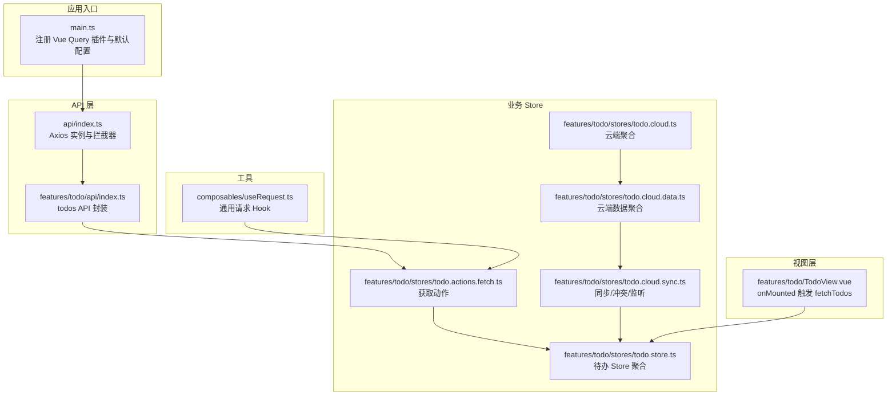
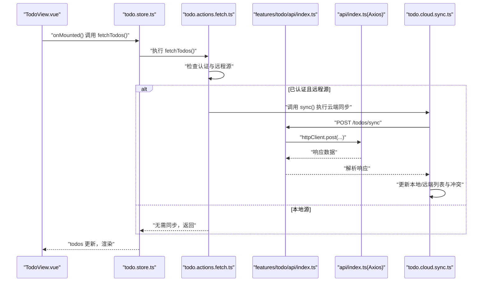
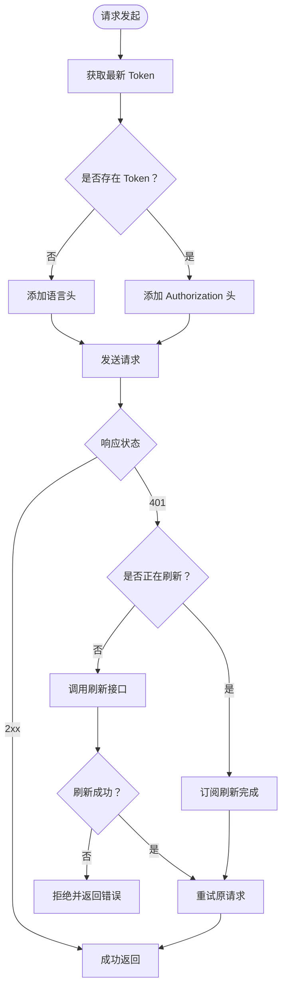
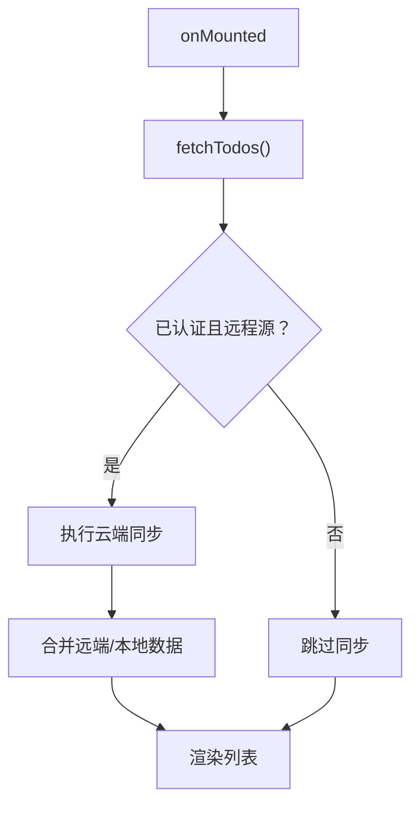
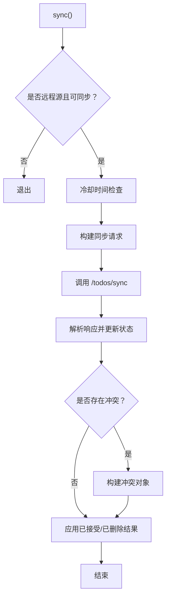
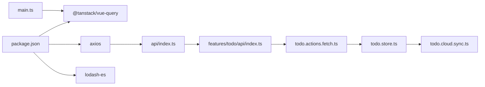

# 数据获取

<cite>
**本文引用的文件**
- [apps/frontend/src/main.ts](file://apps/frontend/src/main.ts)
- [apps/frontend/src/api/index.ts](file://apps/frontend/src/api/index.ts)
- [apps/frontend/src/features/todo/api/index.ts](file://apps/frontend/src/features/todo/api/index.ts)
- [apps/frontend/src/features/todo/stores/todo.store.ts](file://apps/frontend/src/features/todo/stores/todo.store.ts)
- [apps/frontend/src/features/todo/stores/todo.actions.fetch.ts](file://apps/frontend/src/features/todo/stores/todo.actions.fetch.ts)
- [apps/frontend/src/features/todo/stores/todo.cloud.ts](file://apps/frontend/src/features/todo/stores/todo.cloud.ts)
- [apps/frontend/src/features/todo/stores/todo.cloud.data.ts](file://apps/frontend/src/features/todo/stores/todo.cloud.data.ts)
- [apps/frontend/src/features/todo/stores/todo.cloud.sync.ts](file://apps/frontend/src/features/todo/stores/todo.cloud.sync.ts)
- [apps/frontend/src/features/todo/TodoView.vue](file://apps/frontend/src/features/todo/TodoView.vue)
- [apps/frontend/src/composables/useRequest.ts](file://apps/frontend/src/composables/useRequest.ts)
- [apps/frontend/package.json](file://apps/frontend/package.json)
</cite>

## 目录
1. [简介](#简介)
2. [项目结构](#项目结构)
3. [核心组件](#核心组件)
4. [架构总览](#架构总览)
5. [详细组件分析](#详细组件分析)
6. [依赖关系分析](#依赖关系分析)
7. [性能考量](#性能考量)
8. [故障排查指南](#故障排查指南)
9. [结论](#结论)
10. [附录](#附录)

## 简介
本文件面向 Lumina Todo 前端的数据获取体系，系统性阐述以下主题：
- TanStack Query 的配置与默认策略
- API 客户端设计、请求/响应拦截与认证刷新机制
- 数据缓存策略、乐观更新与离线处理思路
- 错误处理、重试机制与加载状态管理
- 数据预取、增量更新与性能优化技巧
- 最佳实践与调试方法

需要特别说明的是：当前仓库前端未直接使用 TanStack Query 的查询/变更钩子（如 useQuery、useMutation）进行数据获取与缓存；数据获取与缓存主要通过 Pinia Store 与自研 API 客户端配合实现。本文将基于现有代码路径进行严谨分析，并给出与 TanStack Query 最佳实践一致的建议与迁移方案。

## 项目结构
围绕“数据获取”的关键文件分布如下：
- 应用入口与全局配置：main.ts（注册 Vue Query 插件与默认配置）
- API 客户端与拦截器：api/index.ts（Axios 实例、请求/响应拦截、Token 刷新）
- 待办 API 封装：features/todo/api/index.ts（todos 相关接口）
- 待办业务 Store：features/todo/stores/todo.store.ts（聚合与持久化）
- 待办数据获取动作：features/todo/stores/todo.actions.fetch.ts（拉取列表/回收站）
- 待办云端同步与冲突处理：features/todo/stores/todo.cloud.*.ts（同步、监听、垃圾箱）
- 视图层触发与展示：features/todo/TodoView.vue（挂载时触发 fetchTodos）
- 通用请求 Hook：composables/useRequest.ts（通用加载/错误封装）

图表来源
- [apps/frontend/src/main.ts:119-132](file://apps/frontend/src/main.ts#L119-L132)
- [apps/frontend/src/api/index.ts:8-199](file://apps/frontend/src/api/index.ts#L8-L199)
- [apps/frontend/src/features/todo/api/index.ts:1-62](file://apps/frontend/src/features/todo/api/index.ts#L1-L62)
- [apps/frontend/src/features/todo/stores/todo.store.ts:21-368](file://apps/frontend/src/features/todo/stores/todo.store.ts#L21-L368)
- [apps/frontend/src/features/todo/stores/todo.actions.fetch.ts:1-69](file://apps/frontend/src/features/todo/stores/todo.actions.fetch.ts#L1-L69)
- [apps/frontend/src/features/todo/stores/todo.cloud.ts:1-44](file://apps/frontend/src/features/todo/stores/todo.cloud.ts#L1-L44)
- [apps/frontend/src/features/todo/stores/todo.cloud.data.ts:1-43](file://apps/frontend/src/features/todo/stores/todo.cloud.data.ts#L1-L43)
- [apps/frontend/src/features/todo/stores/todo.cloud.sync.ts:1-187](file://apps/frontend/src/features/todo/stores/todo.cloud.sync.ts#L1-L187)
- [apps/frontend/src/features/todo/TodoView.vue:178-187](file://apps/frontend/src/features/todo/TodoView.vue#L178-L187)
- [apps/frontend/src/composables/useRequest.ts:1-45](file://apps/frontend/src/composables/useRequest.ts#L1-L45)

章节来源
- [apps/frontend/src/main.ts:119-132](file://apps/frontend/src/main.ts#L119-L132)
- [apps/frontend/src/api/index.ts:8-199](file://apps/frontend/src/api/index.ts#L8-L199)
- [apps/frontend/src/features/todo/api/index.ts:1-62](file://apps/frontend/src/features/todo/api/index.ts#L1-L62)
- [apps/frontend/src/features/todo/stores/todo.store.ts:21-368](file://apps/frontend/src/features/todo/stores/todo.store.ts#L21-L368)
- [apps/frontend/src/features/todo/stores/todo.actions.fetch.ts:1-69](file://apps/frontend/src/features/todo/stores/todo.actions.fetch.ts#L1-L69)
- [apps/frontend/src/features/todo/stores/todo.cloud.ts:1-44](file://apps/frontend/src/features/todo/stores/todo.cloud.ts#L1-L44)
- [apps/frontend/src/features/todo/stores/todo.cloud.data.ts:1-43](file://apps/frontend/src/features/todo/stores/todo.cloud.data.ts#L1-L43)
- [apps/frontend/src/features/todo/stores/todo.cloud.sync.ts:1-187](file://apps/frontend/src/features/todo/stores/todo.cloud.sync.ts#L1-L187)
- [apps/frontend/src/features/todo/TodoView.vue:178-187](file://apps/frontend/src/features/todo/TodoView.vue#L178-L187)
- [apps/frontend/src/composables/useRequest.ts:1-45](file://apps/frontend/src/composables/useRequest.ts#L1-L45)

## 核心组件
- TanStack Query 默认配置
  - 在应用入口中注册 Vue Query 插件，并设置默认查询选项：staleTime 为 1 分钟，重试次数为 1。
  - 该配置对后续使用 useQuery/useMutation 的模块生效，但当前仓库未在待办模块中直接使用这些钩子。
- API 客户端与拦截器
  - Axios 实例：baseURL、超时、凭据携带、默认 Content-Type。
  - 请求拦截：自动注入 Authorization（Bearer Token），附加语言信息。
  - 响应拦截：统一处理 401 未授权，支持并发刷新令牌的队列化处理，避免重复刷新与死锁。
  - Token 管理：内存与本地存储双策略，兼容多种持久化方案。
- 待办数据获取与缓存
  - TodoView 在挂载时调用 store 的 fetchTodos，触发本地/远程数据合并。
  - fetchTodos 中根据是否为远程源与认证状态决定是否执行云端同步。
  - 回收站数据按需拉取，避免重复加载。
- 云端同步与冲突
  - 同步动作包含冷却时间、幂等校验与冲突构建，支持重试与冲突面板展示。
  - 支持 Socket ID 注入，便于服务端去重与一致性处理。

章节来源
- [apps/frontend/src/main.ts:119-132](file://apps/frontend/src/main.ts#L119-L132)
- [apps/frontend/src/api/index.ts:8-199](file://apps/frontend/src/api/index.ts#L8-L199)
- [apps/frontend/src/features/todo/TodoView.vue:178-187](file://apps/frontend/src/features/todo/TodoView.vue#L178-L187)
- [apps/frontend/src/features/todo/stores/todo.actions.fetch.ts:19-31](file://apps/frontend/src/features/todo/stores/todo.actions.fetch.ts#L19-L31)
- [apps/frontend/src/features/todo/stores/todo.cloud.sync.ts:34-154](file://apps/frontend/src/features/todo/stores/todo.cloud.sync.ts#L34-L154)

## 架构总览
整体数据流从视图层触发，经由 Store 动作协调 API 客户端与云端同步，最终更新本地状态与持久化存储。

图表来源
- [apps/frontend/src/features/todo/TodoView.vue:178-187](file://apps/frontend/src/features/todo/TodoView.vue#L178-L187)
- [apps/frontend/src/features/todo/stores/todo.store.ts:21-368](file://apps/frontend/src/features/todo/stores/todo.store.ts#L21-L368)
- [apps/frontend/src/features/todo/stores/todo.actions.fetch.ts:19-31](file://apps/frontend/src/features/todo/stores/todo.actions.fetch.ts#L19-L31)
- [apps/frontend/src/features/todo/api/index.ts:8-20](file://apps/frontend/src/features/todo/api/index.ts#L8-L20)
- [apps/frontend/src/api/index.ts:66-91](file://apps/frontend/src/api/index.ts#L66-L91)
- [apps/frontend/src/features/todo/stores/todo.cloud.sync.ts:58-64](file://apps/frontend/src/features/todo/stores/todo.cloud.sync.ts#L58-L64)

## 详细组件分析

### TanStack Query 配置与默认策略
- 默认配置项
  - staleTime：1 分钟。降低频繁读取带来的网络压力，适合列表类数据。
  - retry：1 次。对瞬时网络波动进行补偿。
- 适用范围
  - 当前仓库未在待办模块直接使用 useQuery/useMutation，因此默认配置暂未在此模块显式体现。
  - 若未来引入查询钩子，可直接继承上述默认行为，或在具体查询中覆盖。

章节来源
- [apps/frontend/src/main.ts:120-127](file://apps/frontend/src/main.ts#L120-L127)

### API 客户端设计与拦截器
- Axios 实例
  - 基础地址、超时、凭据携带、默认头部。
- 请求拦截
  - 自动注入 Authorization（Bearer Token），排除刷新接口。
  - 设置语言头（x-lang、Accept-Language）。
- 响应拦截
  - 401 未授权处理：并发刷新控制、订阅重试、失败回退。
  - 对登录/刷新接口单独保护，避免死锁。
- Token 管理
  - 内存优先策略，兼容多种持久化存储结构。
  - 提供 setToken/getToken 辅助方法。

图表来源
- [apps/frontend/src/api/index.ts:66-91](file://apps/frontend/src/api/index.ts#L66-L91)
- [apps/frontend/src/api/index.ts:124-196](file://apps/frontend/src/api/index.ts#L124-L196)

章节来源
- [apps/frontend/src/api/index.ts:8-199](file://apps/frontend/src/api/index.ts#L8-L199)

### 待办 API 封装
- 接口职责
  - 同步并合并：/todos/sync（支持 Socket ID 注入）
  - 查询：/todos、/todos/trash
  - 回收站操作：恢复、永久删除、清空
- 设计要点
  - 以 httpClient 为基础，统一封装请求参数与头部。
  - 返回 ApiResponse 结构，便于上层统一处理。

章节来源
- [apps/frontend/src/features/todo/api/index.ts:1-62](file://apps/frontend/src/features/todo/api/index.ts#L1-L62)

### 数据获取与缓存策略
- 列表获取
  - TodoView 在挂载时调用 fetchTodos。
  - 若为远程源且已认证，则先执行云端同步，再进入正常渲染。
- 回收站获取
  - 按需加载，避免重复请求。
  - 成功后增量合并至本地列表，标记已加载。
- 缓存与持久化
  - Store 层具备持久化配置，结合本地/远程源切换与快照能力，实现跨会话一致性。
  - 当前未使用 TanStack Query 的缓存键/失效策略，而是依赖 Pinia 持久化与手动标记。

图表来源
- [apps/frontend/src/features/todo/TodoView.vue:178-187](file://apps/frontend/src/features/todo/TodoView.vue#L178-L187)
- [apps/frontend/src/features/todo/stores/todo.actions.fetch.ts:19-31](file://apps/frontend/src/features/todo/stores/todo.actions.fetch.ts#L19-L31)

章节来源
- [apps/frontend/src/features/todo/TodoView.vue:178-187](file://apps/frontend/src/features/todo/TodoView.vue#L178-L187)
- [apps/frontend/src/features/todo/stores/todo.actions.fetch.ts:19-62](file://apps/frontend/src/features/todo/stores/todo.actions.fetch.ts#L19-L62)

### 云端同步与冲突处理
- 同步流程
  - 幂等校验：基于 pending 列表与 updatedAt 快照，避免重复写入。
  - 冷却时间：SYNC_COOLDOWN_MS，减少高频同步。
  - 冲突构建：记录本地草稿与服务器快照，生成冲突对象。
  - 删除处理：根据服务端返回的 deletedIds 进行本地清理。
- 重试机制
  - 对 5xx 或无响应的错误进行指数退避重试，最多 1 次。
- 加载与错误
  - loading/error 状态贯穿同步过程，保证 UI 反馈一致。

图表来源
- [apps/frontend/src/features/todo/stores/todo.cloud.sync.ts:34-154](file://apps/frontend/src/features/todo/stores/todo.cloud.sync.ts#L34-L154)

章节来源
- [apps/frontend/src/features/todo/stores/todo.cloud.sync.ts:18-23](file://apps/frontend/src/features/todo/stores/todo.cloud.sync.ts#L18-L23)
- [apps/frontend/src/features/todo/stores/todo.cloud.sync.ts:139-154](file://apps/frontend/src/features/todo/stores/todo.cloud.sync.ts#L139-L154)

### 乐观更新与离线处理
- 乐观更新
  - 当前实现以“同步完成后统一落库”为主，未见显式的乐观写入/回滚。
  - 如需引入乐观更新，可在 useMutation 中：
    - 写入本地缓存（仅影响 UI）
    - 失败时回滚
    - 成功后与服务端对齐（必要时触发查询失效）
- 离线处理
  - 通过 pending 标记与 lastSyncAt 字段，实现断网场景下的本地编辑与后续合并。
  - 建议结合浏览器在线状态监听与本地队列，提升离线体验。

章节来源
- [apps/frontend/src/features/todo/stores/todo.cloud.sync.ts:50-87](file://apps/frontend/src/features/todo/stores/todo.cloud.sync.ts#L50-L87)
- [apps/frontend/src/features/todo/stores/todo.cloud.sync.ts:158-173](file://apps/frontend/src/features/todo/stores/todo.cloud.sync.ts#L158-L173)

### 错误处理、重试与加载状态
- 错误处理
  - 响应拦截统一处理 401，避免死锁与重复刷新。
  - 同步失败时设置 error 状态，交由 UI 层提示。
- 重试机制
  - 云端同步对 5xx/无响应错误进行指数退避重试，最多 1 次。
- 加载状态
  - loading/error 状态贯穿 fetch/sync 流程，保证用户感知。

章节来源
- [apps/frontend/src/api/index.ts:124-196](file://apps/frontend/src/api/index.ts#L124-L196)
- [apps/frontend/src/features/todo/stores/todo.cloud.sync.ts:139-154](file://apps/frontend/src/features/todo/stores/todo.cloud.sync.ts#L139-L154)

### 数据预取、增量更新与性能优化
- 预取
  - TodoView 在挂载时触发 fetchTodos，属于轻量预取。
  - 建议在路由守卫或导航前钩子中对关键页面进行预取，缩短首屏等待。
- 增量更新
  - 回收站按需加载，避免全量拉取。
  - 同步时基于 acceptedIds/conflicts/deletedIds 增量更新，减少全量替换。
- 性能优化
  - 列表渲染采用 KeepAlive 与过渡动画，减少重排。
  - Store 层 watch 与快照机制，避免不必要重渲染。

章节来源
- [apps/frontend/src/features/todo/TodoView.vue:178-187](file://apps/frontend/src/features/todo/TodoView.vue#L178-L187)
- [apps/frontend/src/features/todo/stores/todo.actions.fetch.ts:33-62](file://apps/frontend/src/features/todo/stores/todo.actions.fetch.ts#L33-L62)
- [apps/frontend/src/features/todo/stores/todo.cloud.sync.ts:89-130](file://apps/frontend/src/features/todo/stores/todo.cloud.sync.ts#L89-L130)

### 最佳实践与调试方法
- 最佳实践
  - 明确 staleTime：列表类数据可适当延长；实时性要求高的数据缩短。
  - 合理使用 invalidateQueries/refetchQueries 触发失效与重新获取。
  - 对写操作使用 mutation，并在成功后使相关查询失效。
  - 为关键查询提供 placeholder/fallback，改善首屏体验。
- 调试方法
  - 使用 React Query Devtools（或 Vue Query Devtools）观察缓存状态、查询时间线与重试次数。
  - 在 main.ts 中临时降低 staleTime 与 retry，验证交互流畅度。
  - 在 api/index.ts 中增加日志输出，定位拦截器链路问题。

章节来源
- [apps/frontend/src/main.ts:120-127](file://apps/frontend/src/main.ts#L120-L127)
- [apps/frontend/src/api/index.ts:66-91](file://apps/frontend/src/api/index.ts#L66-L91)

## 依赖关系分析
- 依赖清单
  - @tanstack/vue-query：用于查询缓存与失效管理（当前未在待办模块直接使用）
  - axios：HTTP 客户端
  - lodash-es：防抖等工具
- 关系图

图表来源
- [apps/frontend/package.json:38](file://apps/frontend/package.json#L38)
- [apps/frontend/src/main.ts:13](file://apps/frontend/src/main.ts#L13)
- [apps/frontend/src/api/index.ts:1](file://apps/frontend/src/api/index.ts#L1)
- [apps/frontend/src/features/todo/api/index.ts:1](file://apps/frontend/src/features/todo/api/index.ts#L1)
- [apps/frontend/src/features/todo/stores/todo.actions.fetch.ts:2](file://apps/frontend/src/features/todo/stores/todo.actions.fetch.ts#L2)
- [apps/frontend/src/features/todo/stores/todo.store.ts:1](file://apps/frontend/src/features/todo/stores/todo.store.ts#L1)
- [apps/frontend/src/features/todo/stores/todo.cloud.sync.ts:1](file://apps/frontend/src/features/todo/stores/todo.cloud.sync.ts#L1)

章节来源
- [apps/frontend/package.json:31-70](file://apps/frontend/package.json#L31-L70)
- [apps/frontend/src/main.ts:13](file://apps/frontend/src/main.ts#L13)

## 性能考量
- 查询缓存
  - 当引入 useQuery 后，合理设置 staleTime 与 gcTime，避免内存膨胀。
  - 对高频变更的列表，考虑使用 select 与 structural sharing 减少渲染。
- 网络重试
  - retry 与 exponential backoff 需结合业务特性调整，避免雪崩效应。
- 渲染优化
  - 列表组件使用虚拟滚动（如适用）、稳定 key、避免深层不可变更新。
  - KeepAlive 与过渡动画在移动端需谨慎使用，注意内存占用。

## 故障排查指南
- 401 未授权
  - 检查请求拦截器是否正确注入 Authorization。
  - 确认刷新流程未被登录/刷新接口自身阻塞。
- 刷新死锁
  - 确认 isRefreshing 与订阅队列逻辑，避免并发刷新。
- 同步异常
  - 查看 isRetryableSyncError 判定与重试间隔。
  - 检查 acceptedIds/conflicts/deletedIds 的合并逻辑。
- 加载状态异常
  - 确认 loading/error 在每个分支均被正确设置与重置。

章节来源
- [apps/frontend/src/api/index.ts:124-196](file://apps/frontend/src/api/index.ts#L124-L196)
- [apps/frontend/src/features/todo/stores/todo.cloud.sync.ts:18-23](file://apps/frontend/src/features/todo/stores/todo.cloud.sync.ts#L18-L23)
- [apps/frontend/src/features/todo/stores/todo.cloud.sync.ts:139-154](file://apps/frontend/src/features/todo/stores/todo.cloud.sync.ts#L139-L154)

## 结论
- 当前前端未直接使用 TanStack Query 的查询/变更钩子，而是通过 Axios 客户端与 Pinia Store 实现数据获取与缓存。
- API 客户端具备完善的请求/响应拦截与令牌刷新机制，满足安全与稳定性需求。
- 待办模块在加载时机、回收站按需加载与云端同步方面已有良好实践，可进一步引入查询缓存与失效策略以提升性能与一致性。
- 建议在后续迭代中逐步引入 useQuery/useMutation，并配套开发工具与监控，持续优化用户体验。

## 附录
- 术语
  - staled：缓存数据超过 staleTime，视为陈旧，可能触发后台刷新。
  - invalidation：主动标记查询失效，触发重新获取。
  - optimistic update：先更新 UI，再与服务端对齐，失败时回滚。
- 参考文件
  - [apps/frontend/src/main.ts:119-132](file://apps/frontend/src/main.ts#L119-L132)
  - [apps/frontend/src/api/index.ts:8-199](file://apps/frontend/src/api/index.ts#L8-L199)
  - [apps/frontend/src/features/todo/api/index.ts:1-62](file://apps/frontend/src/features/todo/api/index.ts#L1-L62)
  - [apps/frontend/src/features/todo/stores/todo.store.ts:21-368](file://apps/frontend/src/features/todo/stores/todo.store.ts#L21-L368)
  - [apps/frontend/src/features/todo/stores/todo.actions.fetch.ts:1-69](file://apps/frontend/src/features/todo/stores/todo.actions.fetch.ts#L1-L69)
  - [apps/frontend/src/features/todo/stores/todo.cloud.sync.ts:1-187](file://apps/frontend/src/features/todo/stores/todo.cloud.sync.ts#L1-L187)
  - [apps/frontend/src/features/todo/TodoView.vue:178-187](file://apps/frontend/src/features/todo/TodoView.vue#L178-L187)
  - [apps/frontend/src/composables/useRequest.ts:1-45](file://apps/frontend/src/composables/useRequest.ts#L1-L45)
  - [apps/frontend/package.json:38](file://apps/frontend/package.json#L38)