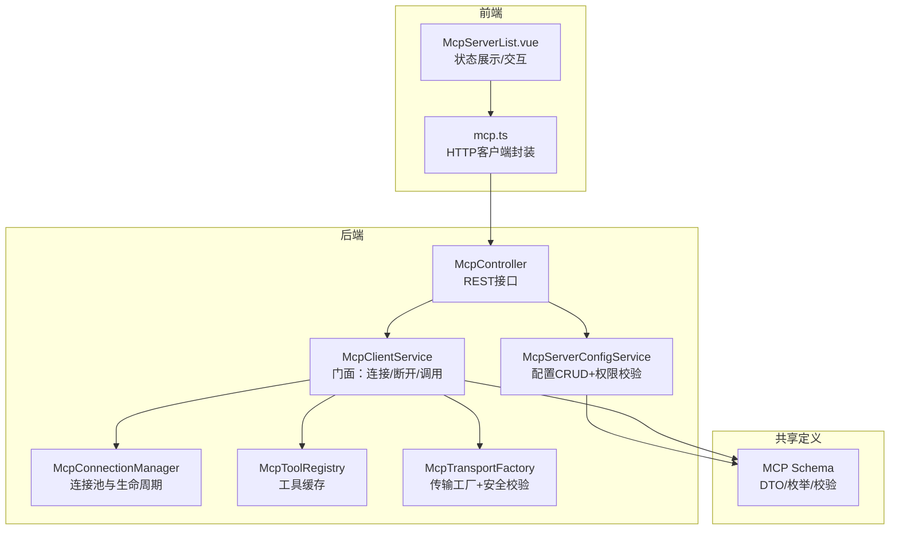
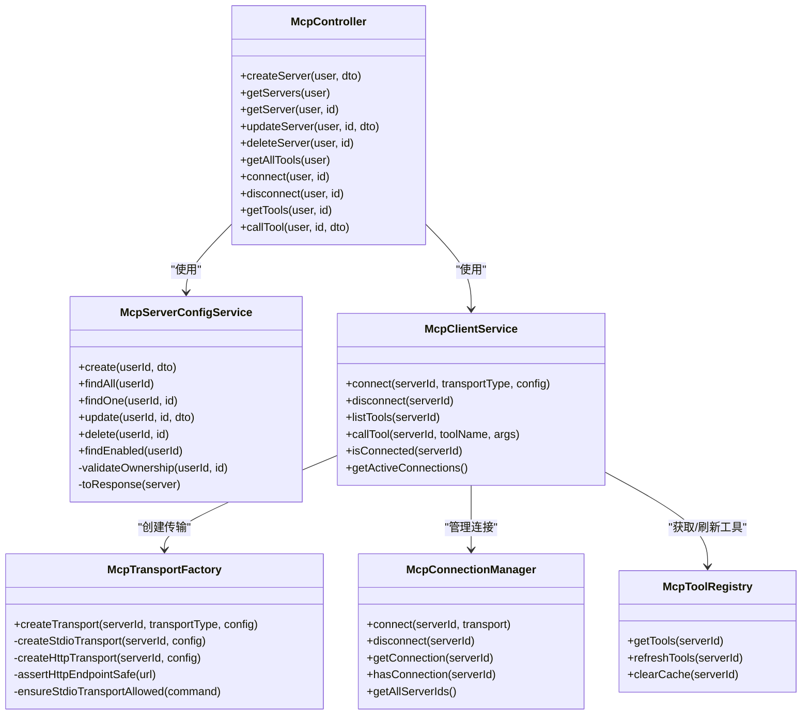
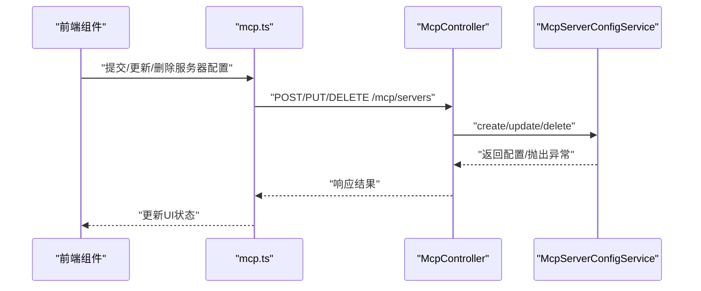
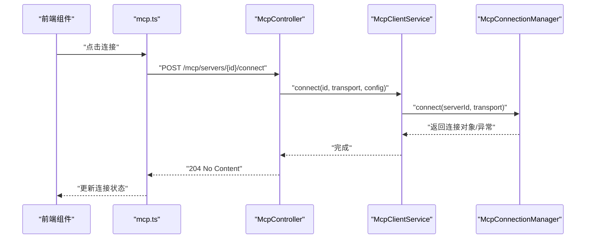
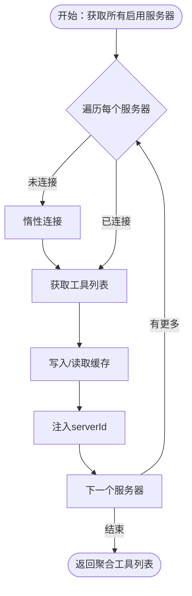
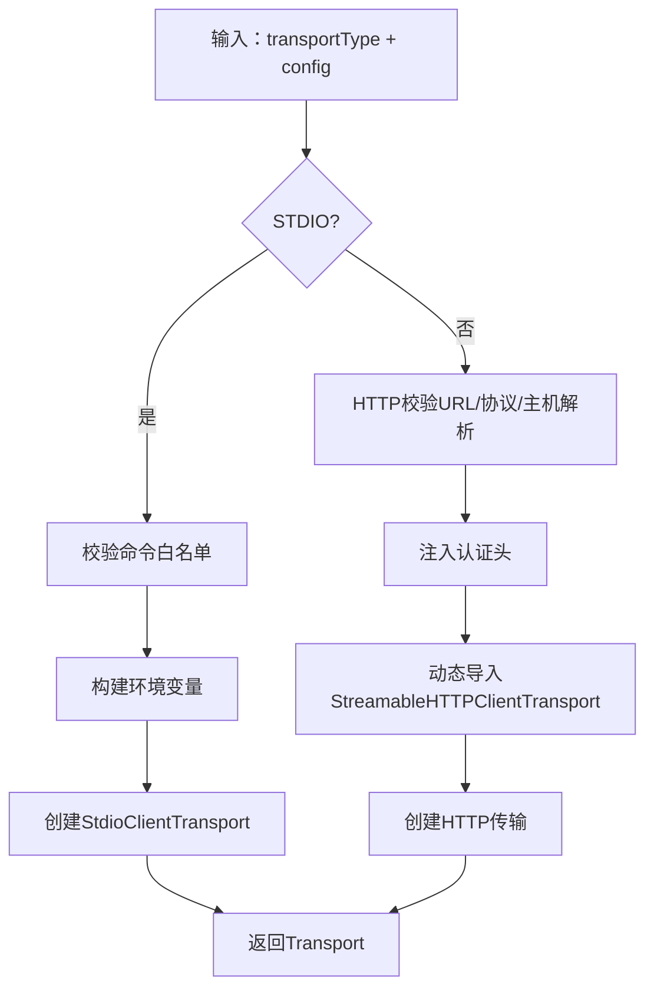
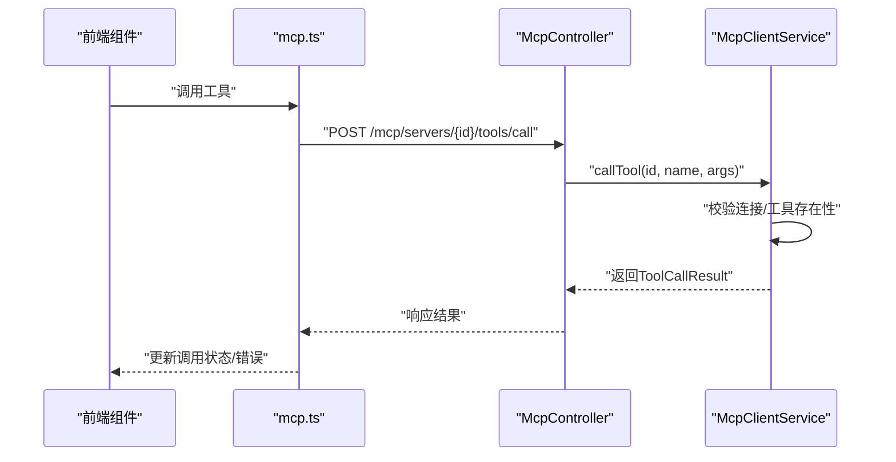
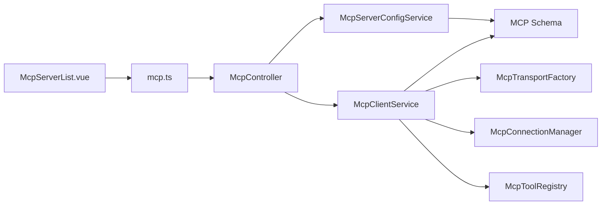

# MCP工具状态管理

<cite>
**本文档引用的文件**
- [apps/backend/src/mcp/mcp-server-config.service.ts](file://apps/backend/src/mcp/mcp-server-config.service.ts)
- [apps/backend/src/mcp/mcp-client.service.ts](file://apps/backend/src/mcp/mcp-client.service.ts)
- [apps/backend/src/mcp/core/mcp-connection.manager.ts](file://apps/backend/src/mcp/core/mcp-connection.manager.ts)
- [apps/backend/src/mcp/core/mcp-tool.registry.ts](file://apps/backend/src/mcp/core/mcp-tool.registry.ts)
- [apps/backend/src/mcp/core/mcp-transport.factory.ts](file://apps/backend/src/mcp/core/mcp-transport.factory.ts)
- [apps/backend/src/mcp/mcp.controller.ts](file://apps/backend/src/mcp/mcp.controller.ts)
- [apps/backend/src/mcp/mcp.dto.ts](file://apps/backend/src/mcp/mcp.dto.ts)
- [apps/backend/src/mcp/mcp.module.ts](file://apps/backend/src/mcp/mcp.module.ts)
- [packages/shared/src/schemas/mcp.schema.ts](file://packages/shared/src/schemas/mcp.schema.ts)
- [apps/frontend/src/features/mcp/components/McpServerList.vue](file://apps/frontend/src/features/mcp/components/McpServerList.vue)
- [apps/frontend/src/features/mcp/api/mcp.ts](file://apps/frontend/src/features/mcp/api/mcp.ts)
</cite>

## 目录
1. [简介](#简介)
2. [项目结构](#项目结构)
3. [核心组件](#核心组件)
4. [架构总览](#架构总览)
5. [详细组件分析](#详细组件分析)
6. [依赖关系分析](#依赖关系分析)
7. [性能考虑](#性能考虑)
8. [故障排除指南](#故障排除指南)
9. [结论](#结论)
10. [附录](#附录)

## 简介
本文件系统性阐述MCP（Model Context Protocol）工具状态管理的设计与实现，覆盖服务器配置状态管理（服务器列表、连接状态、配置参数）、工具发现与连接建立、状态监控、状态持久化与验证、工具调用状态与进度跟踪、错误处理策略、实时更新与缓存策略以及性能优化建议。同时提供扩展开发指导与故障排除方案，帮助开发者在前后端协同场景下高效、安全地管理MCP工具生态。

## 项目结构
MCP状态管理由后端模块与前端组件共同构成：
- 后端模块负责配置持久化、连接生命周期管理、工具注册与缓存、传输层安全校验与工厂化创建。
- 前端组件负责UI状态展示、用户交互、实时连接状态反馈与错误提示。

**图表来源**
- [apps/backend/src/mcp/mcp.controller.ts:40-209](file://apps/backend/src/mcp/mcp.controller.ts#L40-L209)
- [apps/backend/src/mcp/mcp-server-config.service.ts:10-156](file://apps/backend/src/mcp/mcp-server-config.service.ts#L10-L156)
- [apps/backend/src/mcp/mcp-client.service.ts:17-124](file://apps/backend/src/mcp/mcp-client.service.ts#L17-L124)
- [apps/backend/src/mcp/core/mcp-connection.manager.ts:13-101](file://apps/backend/src/mcp/core/mcp-connection.manager.ts#L13-L101)
- [apps/backend/src/mcp/core/mcp-tool.registry.ts:6-48](file://apps/backend/src/mcp/core/mcp-tool.registry.ts#L6-L48)
- [apps/backend/src/mcp/core/mcp-transport.factory.ts:10-220](file://apps/backend/src/mcp/core/mcp-transport.factory.ts#L10-L220)
- [packages/shared/src/schemas/mcp.schema.ts:1-220](file://packages/shared/src/schemas/mcp.schema.ts#L1-L220)
- [apps/frontend/src/features/mcp/components/McpServerList.vue:1-351](file://apps/frontend/src/features/mcp/components/McpServerList.vue#L1-L351)
- [apps/frontend/src/features/mcp/api/mcp.ts:1-108](file://apps/frontend/src/features/mcp/api/mcp.ts#L1-L108)

**章节来源**
- [apps/backend/src/mcp/mcp.module.ts:1-25](file://apps/backend/src/mcp/mcp.module.ts#L1-L25)
- [apps/backend/src/mcp/mcp.controller.ts:40-209](file://apps/backend/src/mcp/mcp.controller.ts#L40-L209)

## 核心组件
- 配置服务：负责用户维度的MCP服务器配置的创建、查询、更新、删除与启用筛选，确保数据一致性与权限控制。
- 客户端门面：统一管理连接、断开、工具发现与调用，协调传输工厂与连接管理器。
- 连接管理器：维护活跃连接映射，处理连接/断开生命周期事件，记录错误与关闭事件。
- 工具注册表：缓存服务器工具清单，支持刷新与清理，降低重复RPC开销。
- 传输工厂：根据传输类型创建STDIO或HTTP传输，内置严格的安全校验与环境限制。
- 控制器：提供REST接口，集成节流、鉴权与权限校验，驱动客户端门面完成业务流程。
- 前端组件与API：负责UI状态展示、用户交互与HTTP请求封装，配合后端状态进行实时反馈。

**章节来源**
- [apps/backend/src/mcp/mcp-server-config.service.ts:10-156](file://apps/backend/src/mcp/mcp-server-config.service.ts#L10-L156)
- [apps/backend/src/mcp/mcp-client.service.ts:17-124](file://apps/backend/src/mcp/mcp-client.service.ts#L17-L124)
- [apps/backend/src/mcp/core/mcp-connection.manager.ts:13-101](file://apps/backend/src/mcp/core/mcp-connection.manager.ts#L13-L101)
- [apps/backend/src/mcp/core/mcp-tool.registry.ts:6-48](file://apps/backend/src/mcp/core/mcp-tool.registry.ts#L6-L48)
- [apps/backend/src/mcp/core/mcp-transport.factory.ts:10-220](file://apps/backend/src/mcp/core/mcp-transport.factory.ts#L10-L220)
- [apps/backend/src/mcp/mcp.controller.ts:40-209](file://apps/backend/src/mcp/mcp.controller.ts#L40-L209)
- [apps/frontend/src/features/mcp/components/McpServerList.vue:1-351](file://apps/frontend/src/features/mcp/components/McpServerList.vue#L1-L351)
- [apps/frontend/src/features/mcp/api/mcp.ts:1-108](file://apps/frontend/src/features/mcp/api/mcp.ts#L1-L108)

## 架构总览
MCP状态管理采用分层设计：控制器层负责接口与节流；服务层负责配置与权限；客户端门面协调传输与连接；注册表缓存工具；工厂负责传输创建与安全校验。前端通过API封装与组件展示状态。

**图表来源**
- [apps/backend/src/mcp/mcp.controller.ts:40-209](file://apps/backend/src/mcp/mcp.controller.ts#L40-L209)
- [apps/backend/src/mcp/mcp-server-config.service.ts:10-156](file://apps/backend/src/mcp/mcp-server-config.service.ts#L10-L156)
- [apps/backend/src/mcp/mcp-client.service.ts:17-124](file://apps/backend/src/mcp/mcp-client.service.ts#L17-L124)
- [apps/backend/src/mcp/core/mcp-connection.manager.ts:13-101](file://apps/backend/src/mcp/core/mcp-connection.manager.ts#L13-L101)
- [apps/backend/src/mcp/core/mcp-tool.registry.ts:6-48](file://apps/backend/src/mcp/core/mcp-tool.registry.ts#L6-L48)
- [apps/backend/src/mcp/core/mcp-transport.factory.ts:10-220](file://apps/backend/src/mcp/core/mcp-transport.factory.ts#L10-L220)

## 详细组件分析

### 配置状态管理（服务器列表、连接状态、配置参数）
- 数据持久化：基于数据库的CRUD操作，按用户隔离，支持启用/禁用标记与时间戳字段。
- 权限与安全：在更新/删除前验证资源归属，防止越权访问。
- 配置参数：支持STDIO与HTTP两种传输类型，配置项在共享Schema中进行强类型与结构化校验，确保传输类型与配置匹配。

**图表来源**
- [apps/frontend/src/features/mcp/api/mcp.ts:16-54](file://apps/frontend/src/features/mcp/api/mcp.ts#L16-L54)
- [apps/backend/src/mcp/mcp.controller.ts:51-107](file://apps/backend/src/mcp/mcp.controller.ts#L51-L107)
- [apps/backend/src/mcp/mcp-server-config.service.ts:18-96](file://apps/backend/src/mcp/mcp-server-config.service.ts#L18-L96)

**章节来源**
- [apps/backend/src/mcp/mcp-server-config.service.ts:10-156](file://apps/backend/src/mcp/mcp-server-config.service.ts#L10-L156)
- [packages/shared/src/schemas/mcp.schema.ts:123-172](file://packages/shared/src/schemas/mcp.schema.ts#L123-L172)

### 连接建立与状态监控
- 连接生命周期：连接管理器维护serverId到连接对象的映射，支持重复连接时的自动断开与重建；监听STDIO传输的stderr、onclose、onerror事件，记录日志并清理连接。
- 连接状态暴露：客户端门面提供isConnected与getActiveConnections，便于前端实时渲染连接状态。
- 延迟连接策略：在工具发现与调用前检查连接状态，必要时惰性连接，减少无谓开销。

**图表来源**
- [apps/frontend/src/features/mcp/api/mcp.ts:89-97](file://apps/frontend/src/features/mcp/api/mcp.ts#L89-L97)
- [apps/backend/src/mcp/mcp.controller.ts:141-148](file://apps/backend/src/mcp/mcp.controller.ts#L141-L148)
- [apps/backend/src/mcp/mcp-client.service.ts:33-47](file://apps/backend/src/mcp/mcp-client.service.ts#L33-L47)
- [apps/backend/src/mcp/core/mcp-connection.manager.ts:23-73](file://apps/backend/src/mcp/core/mcp-connection.manager.ts#L23-L73)

**章节来源**
- [apps/backend/src/mcp/core/mcp-connection.manager.ts:13-101](file://apps/backend/src/mcp/core/mcp-connection.manager.ts#L13-L101)
- [apps/backend/src/mcp/mcp-client.service.ts:17-124](file://apps/backend/src/mcp/mcp-client.service.ts#L17-L124)

### 工具发现、连接建立与状态监控
- 工具发现：控制器提供聚合工具接口，遍历用户启用的服务器，惰性连接并调用客户端门面获取工具列表，注入serverId便于前端识别归属。
- 工具缓存：工具注册表以serverId为键缓存工具清单，支持刷新与清理，避免频繁RPC。
- 错误处理：在工具发现过程中捕获单个服务器异常，不影响其他服务器的工具聚合。

**图表来源**
- [apps/backend/src/mcp/mcp.controller.ts:110-136](file://apps/backend/src/mcp/mcp.controller.ts#L110-L136)
- [apps/backend/src/mcp/mcp-client.service.ts:60-65](file://apps/backend/src/mcp/mcp-client.service.ts#L60-L65)
- [apps/backend/src/mcp/core/mcp-tool.registry.ts:12-42](file://apps/backend/src/mcp/core/mcp-tool.registry.ts#L12-L42)

**章节来源**
- [apps/backend/src/mcp/mcp.controller.ts:110-136](file://apps/backend/src/mcp/mcp.controller.ts#L110-L136)
- [apps/backend/src/mcp/core/mcp-tool.registry.ts:6-48](file://apps/backend/src/mcp/core/mcp-tool.registry.ts#L6-L48)

### 传输工厂与安全校验
- STDIO传输：支持命令白名单与环境变量透传，生产环境需显式配置允许命令；内置包名纠错与工作目录设置。
- HTTP传输：严格校验协议（http/https）、主机名与IP地址，禁止私有/回环地址与.local/.localhost域名；支持Bearer/OAuth/API-Key认证头注入。
- 动态导入：HTTP传输采用动态导入以减少非必要依赖加载。

**图表来源**
- [apps/backend/src/mcp/core/mcp-transport.factory.ts:112-218](file://apps/backend/src/mcp/core/mcp-transport.factory.ts#L112-L218)

**章节来源**
- [apps/backend/src/mcp/core/mcp-transport.factory.ts:10-220](file://apps/backend/src/mcp/core/mcp-transport.factory.ts#L10-L220)
- [packages/shared/src/schemas/mcp.schema.ts:79-118](file://packages/shared/src/schemas/mcp.schema.ts#L79-L118)

### 工具调用状态、进度跟踪与错误处理
- 调用流程：控制器在调用前确保连接存在，客户端门面先校验工具存在性，再发起RPC调用，最后封装结果。
- 结果封装：统一返回内容数组与错误标记，便于前端渲染与错误提示。
- 错误处理：在客户端门面与控制器层分别记录日志与抛出异常，前端组件捕获并展示错误。

**图表来源**
- [apps/frontend/src/features/mcp/api/mcp.ts:70-84](file://apps/frontend/src/features/mcp/api/mcp.ts#L70-L84)
- [apps/backend/src/mcp/mcp.controller.ts:187-207](file://apps/backend/src/mcp/mcp.controller.ts#L187-L207)
- [apps/backend/src/mcp/mcp-client.service.ts:70-108](file://apps/backend/src/mcp/mcp-client.service.ts#L70-L108)

**章节来源**
- [apps/backend/src/mcp/mcp-client.service.ts:17-124](file://apps/backend/src/mcp/mcp-client.service.ts#L17-L124)
- [apps/backend/src/mcp/mcp.controller.ts:187-207](file://apps/backend/src/mcp/mcp.controller.ts#L187-L207)

### 实时更新、缓存策略与性能优化
- 实时更新：前端组件根据store状态与API响应实时渲染连接状态、错误提示与工具列表。
- 缓存策略：工具注册表按服务器维度缓存工具清单，断开连接时清理缓存；连接建立后预热工具缓存。
- 性能优化：惰性连接减少不必要的RPC；批量工具聚合时逐个处理并容错；HTTP超时合理设置（连接300s，工具调用60s）；传输工厂延迟加载HTTP传输以降低初始化成本。

**章节来源**
- [apps/backend/src/mcp/core/mcp-tool.registry.ts:6-48](file://apps/backend/src/mcp/core/mcp-tool.registry.ts#L6-L48)
- [apps/backend/src/mcp/mcp-client.service.ts:42-46](file://apps/backend/src/mcp/mcp-client.service.ts#L42-L46)
- [apps/frontend/src/features/mcp/api/mcp.ts:62-90](file://apps/frontend/src/features/mcp/api/mcp.ts#L62-L90)

## 依赖关系分析
- 控制器依赖配置服务与客户端门面，提供统一的REST接口。
- 客户端门面依赖传输工厂、连接管理器与工具注册表，形成门面模式以简化上层调用。
- 传输工厂依赖共享Schema进行配置校验与安全检查。
- 前端组件依赖API封装与共享类型，渲染状态并触发后端操作。

**图表来源**
- [apps/frontend/src/features/mcp/components/McpServerList.vue:1-351](file://apps/frontend/src/features/mcp/components/McpServerList.vue#L1-L351)
- [apps/frontend/src/features/mcp/api/mcp.ts:1-108](file://apps/frontend/src/features/mcp/api/mcp.ts#L1-L108)
- [apps/backend/src/mcp/mcp.controller.ts:40-209](file://apps/backend/src/mcp/mcp.controller.ts#L40-L209)
- [apps/backend/src/mcp/mcp-server-config.service.ts:10-156](file://apps/backend/src/mcp/mcp-server-config.service.ts#L10-L156)
- [apps/backend/src/mcp/mcp-client.service.ts:17-124](file://apps/backend/src/mcp/mcp-client.service.ts#L17-L124)
- [apps/backend/src/mcp/core/mcp-transport.factory.ts:10-220](file://apps/backend/src/mcp/core/mcp-transport.factory.ts#L10-L220)
- [apps/backend/src/mcp/core/mcp-connection.manager.ts:13-101](file://apps/backend/src/mcp/core/mcp-connection.manager.ts#L13-L101)
- [apps/backend/src/mcp/core/mcp-tool.registry.ts:6-48](file://apps/backend/src/mcp/core/mcp-tool.registry.ts#L6-L48)
- [packages/shared/src/schemas/mcp.schema.ts:1-220](file://packages/shared/src/schemas/mcp.schema.ts#L1-L220)

**章节来源**
- [apps/backend/src/mcp/mcp.module.ts:1-25](file://apps/backend/src/mcp/mcp.module.ts#L1-L25)

## 性能考虑
- 连接管理：避免重复连接，利用Map快速查找与自动重连；STDIO传输监听stderr与onclose，及时释放资源。
- 工具缓存：以serverId为键缓存工具清单，减少RPC次数；断开连接时清理缓存，防止脏数据。
- 惰性连接：在工具发现与调用前检查连接状态，仅在需要时建立连接，降低整体延迟。
- 超时与节流：HTTP请求设置合理超时；控制器层应用节流策略，防止滥用。
- 传输优化：HTTP传输动态导入，减少初始化开销；STDIO传输仅透传必要环境变量。

[本节为通用性能建议，无需特定文件引用]

## 故障排除指南
- 连接失败
  - 检查传输类型与配置是否匹配，确认URL协议与主机解析正常。
  - 查看STDIO stderr输出与onerror事件日志，定位进程启动问题。
  - 确认HTTP认证头正确注入，Bearer/OAuth/API-Key配置有效。
- 工具不可用
  - 确认服务器已启用且连接正常。
  - 清理工具缓存后重试刷新。
  - 检查工具名称拼写与输入Schema。
- 权限与安全
  - 确认当前用户拥有目标服务器配置的访问权限。
  - 生产环境需配置STDIO命令白名单，否则会被拒绝。
- 前端状态不同步
  - 检查store状态与API响应是否同步，关注connectingStates与serverErrors。
  - 确认网络请求超时设置合理，避免误判为失败。

**章节来源**
- [apps/backend/src/mcp/core/mcp-transport.factory.ts:91-110](file://apps/backend/src/mcp/core/mcp-transport.factory.ts#L91-L110)
- [apps/backend/src/mcp/core/mcp-connection.manager.ts:44-58](file://apps/backend/src/mcp/core/mcp-connection.manager.ts#L44-L58)
- [apps/backend/src/mcp/mcp-client.service.ts:74-108](file://apps/backend/src/mcp/mcp-client.service.ts#L74-L108)
- [apps/frontend/src/features/mcp/components/McpServerList.vue:103-137](file://apps/frontend/src/features/mcp/components/McpServerList.vue#L103-L137)

## 结论
MCP工具状态管理通过清晰的分层设计与严格的配置校验，实现了安全、可扩展的服务器配置与连接管理。结合工具缓存与惰性连接策略，在保证用户体验的同时提升了系统性能。前端组件与后端接口协同，提供了直观的状态展示与交互能力。遵循本文档的扩展与排障建议，可进一步增强系统的稳定性与可维护性。

[本节为总结性内容，无需特定文件引用]

## 附录
- 扩展开发指导
  - 新增传输类型：在传输工厂中新增分支并补充安全校验逻辑。
  - 新增状态字段：在共享Schema中定义新字段并在后端服务中映射。
  - 新增节流规则：在控制器中配置新的节流常量并应用到相应接口。
- 前端状态管理
  - 使用store集中管理连接状态、工具缓存与错误信息，避免分散更新导致的竞态。
  - 在组件中订阅store变更并及时渲染，确保UI与后端状态一致。

[本节为通用指导，无需特定文件引用]