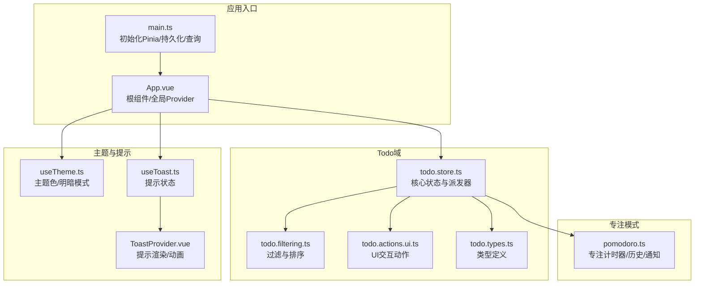
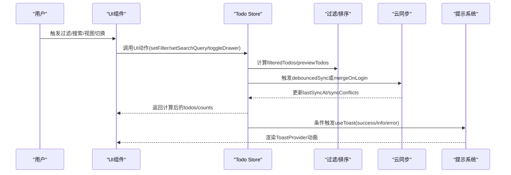
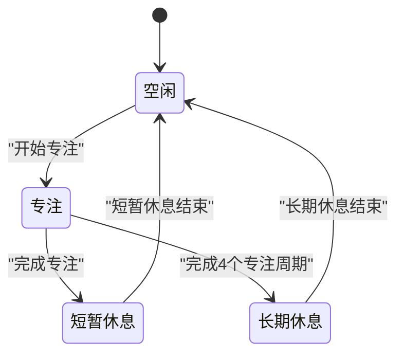
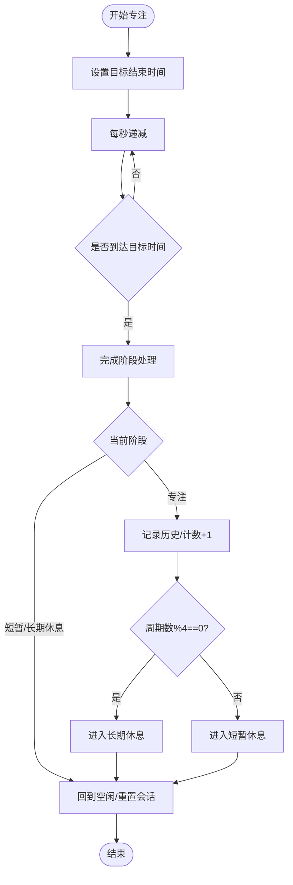
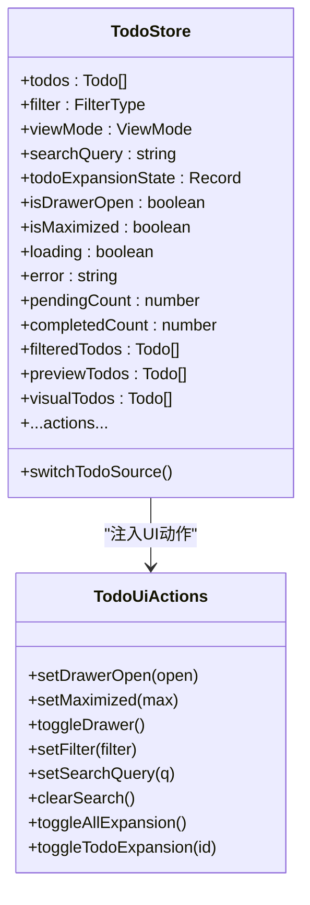
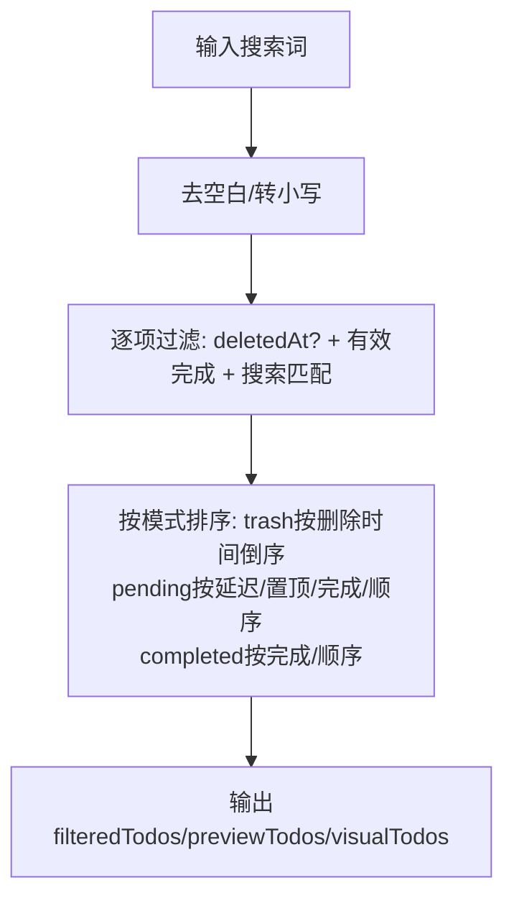
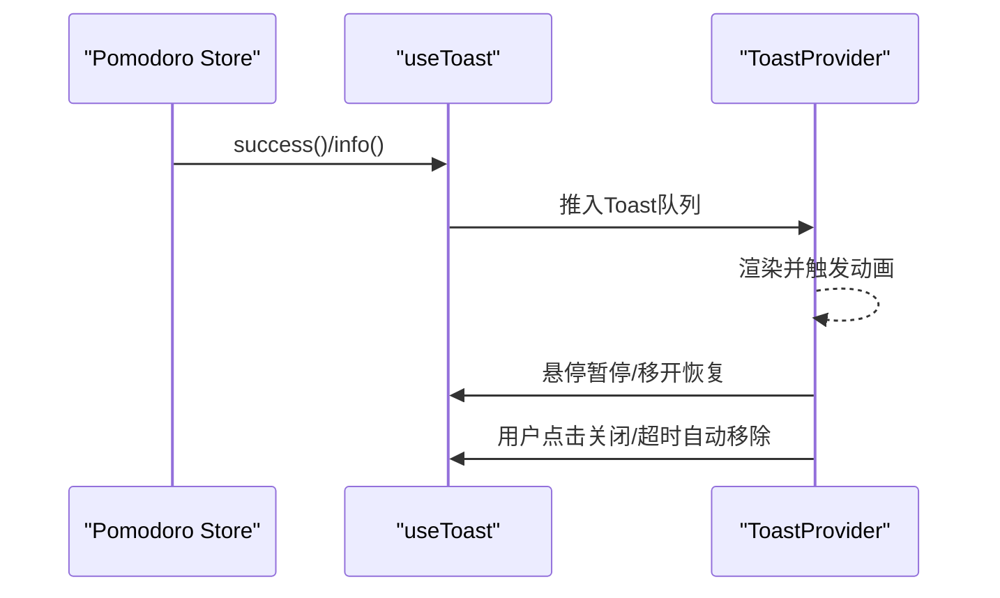
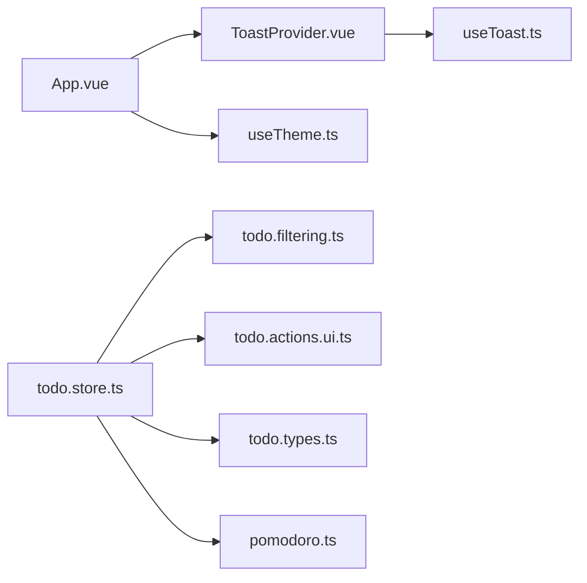

# UI交互状态管理

<cite>
**本文引用的文件**
- [apps/frontend/src/App.vue](file://apps/frontend/src/App.vue)
- [apps/frontend/src/main.ts](file://apps/frontend/src/main.ts)
- [apps/frontend/src/features/todo/stores/todo.store.ts](file://apps/frontend/src/features/todo/stores/todo.store.ts)
- [apps/frontend/src/features/todo/stores/pomodoro.ts](file://apps/frontend/src/features/todo/stores/pomodoro.ts)
- [apps/frontend/src/features/todo/stores/todo.filtering.ts](file://apps/frontend/src/features/todo/stores/todo.filtering.ts)
- [apps/frontend/src/features/todo/stores/todo.actions.ui.ts](file://apps/frontend/src/features/todo/stores/todo.actions.ui.ts)
- [apps/frontend/src/features/todo/stores/todo.types.ts](file://apps/frontend/src/features/todo/stores/todo.types.ts)
- [apps/frontend/src/composables/useTheme.ts](file://apps/frontend/src/composables/useTheme.ts)
- [apps/frontend/src/composables/useToast.ts](file://apps/frontend/src/composables/useToast.ts)
- [apps/frontend/src/components/ui/ToastProvider.vue](file://apps/frontend/src/components/ui/ToastProvider.vue)
</cite>

## 目录

1. [引言](#引言)
2. [项目结构](#项目结构)
3. [核心组件](#核心组件)
4. [架构总览](#架构总览)
5. [详细组件分析](#详细组件分析)
6. [依赖关系分析](#依赖关系分析)
7. [性能考量](#性能考量)
8. [故障排查指南](#故障排查指南)
9. [结论](#结论)
10. [附录](#附录)

## 引言

本文件系统性梳理前端应用中UI交互状态管理的设计与实现，围绕组件状态、用户交互状态与界面行为状态展开，重点覆盖以下主题：

- 专注模式（Pomodoro）状态管理：状态机模型、计时器与回放、跨会话持久化与通知反馈
- 界面布局状态与用户偏好：抽屉开关、窗口最大化、主题色与明暗模式、搜索与过滤状态
- 视图切换与数据流：列表/可视化/统计/草稿视图的切换与过滤排序
- 模态框/抽屉/弹窗状态：统一的UI可见性与交互控制
- 响应式设计、动画状态管理与无障碍支持：过渡动画、可访问性与可感知反馈
- 最佳实践与用户体验优化建议

## 项目结构

前端以Vue 3 + Pinia为核心，Todo功能域采用模块化的状态管理组织方式，配合组合式函数与UI组件库，形成清晰的分层：

- 应用入口与全局配置：初始化Pinia、持久化插件、Vue Query、主题与国际化
- Todo域状态：集中于store模块，包含过滤、UI动作、云同步、提议变更等子模块
- Pomodoro域状态：独立的专注计时器与历史记录，集成原生服务与通知
- 主题与提示：useTheme提供主题色与明暗模式；useToast与ToastProvider提供全局提示与动画

**图表来源**

- [apps/frontend/src/main.ts:115-132](file://apps/frontend/src/main.ts#L115-L132)
- [apps/frontend/src/App.vue:1-77](file://apps/frontend/src/App.vue#L1-L77)
- [apps/frontend/src/features/todo/stores/todo.store.ts:21-368](file://apps/frontend/src/features/todo/stores/todo.store.ts#L21-L368)
- [apps/frontend/src/features/todo/stores/todo.filtering.ts:16-63](file://apps/frontend/src/features/todo/stores/todo.filtering.ts#L16-L63)
- [apps/frontend/src/features/todo/stores/todo.actions.ui.ts:21-110](file://apps/frontend/src/features/todo/stores/todo.actions.ui.ts#L21-L110)
- [apps/frontend/src/features/todo/stores/pomodoro.ts:32-401](file://apps/frontend/src/features/todo/stores/pomodoro.ts#L32-L401)
- [apps/frontend/src/composables/useTheme.ts:308-377](file://apps/frontend/src/composables/useTheme.ts#L308-L377)
- [apps/frontend/src/composables/useToast.ts:17-86](file://apps/frontend/src/composables/useToast.ts#L17-L86)
- [apps/frontend/src/components/ui/ToastProvider.vue:1-109](file://apps/frontend/src/components/ui/ToastProvider.vue#L1-L109)

**章节来源**

- [apps/frontend/src/main.ts:115-132](file://apps/frontend/src/main.ts#L115-L132)
- [apps/frontend/src/App.vue:1-77](file://apps/frontend/src/App.vue#L1-L77)

## 核心组件

- Todo核心状态仓库：集中管理待办列表、过滤器、视图模式、搜索、抽屉/最大化状态、加载/错误、提议变更、源数据（本地/远程）与云同步状态
- Pomodoro专注计时器：专注/短暂休息/长期休息状态机，计时器与回放、历史记录、Mini模式、原生震动与通知、动态favicon
- 过滤与排序：基于父子关系的“有效完成”判定、延迟任务、搜索匹配与多字段排序
- UI交互动作：抽屉开关、窗口最大化、过滤切换、搜索清空、全展开/单项展开、错误清空、静默提示偏好
- 主题与提示：主题色与明暗模式联动、随机主题定时切换、useToast与ToastProvider动画与可访问性

**章节来源**

- [apps/frontend/src/features/todo/stores/todo.store.ts:21-368](file://apps/frontend/src/features/todo/stores/todo.store.ts#L21-L368)
- [apps/frontend/src/features/todo/stores/pomodoro.ts:32-401](file://apps/frontend/src/features/todo/stores/pomodoro.ts#L32-L401)
- [apps/frontend/src/features/todo/stores/todo.filtering.ts:16-63](file://apps/frontend/src/features/todo/stores/todo.filtering.ts#L16-L63)
- [apps/frontend/src/features/todo/stores/todo.actions.ui.ts:21-110](file://apps/frontend/src/features/todo/stores/todo.actions.ui.ts#L21-L110)
- [apps/frontend/src/composables/useTheme.ts:308-377](file://apps/frontend/src/composables/useTheme.ts#L308-L377)
- [apps/frontend/src/composables/useToast.ts:17-86](file://apps/frontend/src/composables/useToast.ts#L17-L86)
- [apps/frontend/src/components/ui/ToastProvider.vue:1-109](file://apps/frontend/src/components/ui/ToastProvider.vue#L1-L109)

## 架构总览

UI状态管理采用“状态集中、动作解耦、派发器聚合”的模式：

- Pinia Store作为单一事实来源，封装数据与派发器
- 过滤/排序/视图切换通过纯函数与计算属性组合
- UI动作通过工厂函数注入依赖，避免直接耦合外部副作用
- 主题与提示通过组合式函数与全局Provider解耦

**图表来源**

- [apps/frontend/src/features/todo/stores/todo.store.ts:47-49](file://apps/frontend/src/features/todo/stores/todo.store.ts#L47-L49)
- [apps/frontend/src/features/todo/stores/todo.actions.ui.ts:47-52](file://apps/frontend/src/features/todo/stores/todo.actions.ui.ts#L47-L52)
- [apps/frontend/src/features/todo/stores/todo.filtering.ts:16-63](file://apps/frontend/src/features/todo/stores/todo.filtering.ts#L16-L63)
- [apps/frontend/src/composables/useToast.ts:77-84](file://apps/frontend/src/composables/useToast.ts#L77-L84)
- [apps/frontend/src/components/ui/ToastProvider.vue:48-107](file://apps/frontend/src/components/ui/ToastProvider.vue#L48-L107)

## 详细组件分析

### 专注模式（Pomodoro）状态管理

专注模式采用状态机模型，包含“空闲/专注/短暂休息/长期休息”四种状态，结合多种模式（经典/冰山/流动/宇宙）的时间配置，支持Mini模式、历史记录、动态favicon与原生震动/通知。

- 状态与持久化：状态通过localStorage持久化，支持页面刷新后自动回放计时
- 计时器与回放：使用目标结束时间与定时器，确保跨会话时间精度；支持暂停/恢复/重置
- 动画与反馈：动态favicon进度环、主题色联动、震动反馈、系统通知
- Mini模式：与原生窗口联动，适配桌面端紧凑显示

**图表来源**

- [apps/frontend/src/features/todo/stores/pomodoro.ts:196-356](file://apps/frontend/src/features/todo/stores/pomodoro.ts#L196-L356)
- [apps/frontend/src/features/todo/stores/pomodoro.ts:227-265](file://apps/frontend/src/features/todo/stores/pomodoro.ts#L227-L265)

**章节来源**

- [apps/frontend/src/features/todo/stores/pomodoro.ts:10-401](file://apps/frontend/src/features/todo/stores/pomodoro.ts#L10-L401)

### 界面布局状态与用户偏好

- 抽屉与最大化：通过isDrawerOpen与isMaximized控制侧边栏与窗口尺寸
- 主题与明暗模式：useTheme提供主题色与明暗模式选择，支持随机主题定时切换
- 搜索与过滤：searchQuery驱动搜索，filter驱动“待办/已完成/回收站”，并结合“有效完成”与延迟任务排序
- 视图模式：list/visual/stats/scratchpad四模式，visual模式下禁止trash标签页
- 扩展状态：todoExpansionState持久化展开/折叠，支持全展开/单项展开

**图表来源**

- [apps/frontend/src/features/todo/stores/todo.store.ts:21-368](file://apps/frontend/src/features/todo/stores/todo.store.ts#L21-L368)
- [apps/frontend/src/features/todo/stores/todo.actions.ui.ts:21-110](file://apps/frontend/src/features/todo/stores/todo.actions.ui.ts#L21-L110)

**章节来源**

- [apps/frontend/src/features/todo/stores/todo.store.ts:24-157](file://apps/frontend/src/features/todo/stores/todo.store.ts#L24-L157)
- [apps/frontend/src/features/todo/stores/todo.actions.ui.ts:35-94](file://apps/frontend/src/features/todo/stores/todo.actions.ui.ts#L35-L94)
- [apps/frontend/src/features/todo/stores/todo.filtering.ts:16-63](file://apps/frontend/src/features/todo/stores/todo.filtering.ts#L16-L63)

### 过滤器状态、搜索状态与视图切换

- 过滤规则：trash仅显示已删除项；pending按“有效完成”与延迟任务优先级排序；completed按完成度排序
- 搜索匹配：忽略大小写，标题包含匹配
- 视图切换：list/visual/stats/scratchpad；visual模式下强制pending标签页
- 提议变更预览：在应用提议变更前构建基础预览，再进行过滤与排序

**图表来源**

- [apps/frontend/src/features/todo/stores/todo.filtering.ts:16-63](file://apps/frontend/src/features/todo/stores/todo.filtering.ts#L16-L63)
- [apps/frontend/src/features/todo/stores/todo.store.ts:173-183](file://apps/frontend/src/features/todo/stores/todo.store.ts#L173-L183)

**章节来源**

- [apps/frontend/src/features/todo/stores/todo.filtering.ts:3-10](file://apps/frontend/src/features/todo/stores/todo.filtering.ts#L3-L10)
- [apps/frontend/src/features/todo/stores/todo.store.ts:153-163](file://apps/frontend/src/features/todo/stores/todo.store.ts#L153-L163)

### 模态框、抽屉与弹窗状态管理

- 抽屉状态：isDrawerOpen控制侧边栏可见性，toggleDrawer提供便捷切换
- 弹窗与提示：ToastProvider集中渲染，支持成功/错误/信息/警告类型与复制、操作按钮
- 提示动画：Enter/Leave过渡动画，悬停暂停/恢复计时
- 错误与静音：error字段承载错误消息，isSilencingToast控制提示静默

**图表来源**

- [apps/frontend/src/features/todo/stores/pomodoro.ts:300-320](file://apps/frontend/src/features/todo/stores/pomodoro.ts#L300-L320)
- [apps/frontend/src/composables/useToast.ts:17-86](file://apps/frontend/src/composables/useToast.ts#L17-L86)
- [apps/frontend/src/components/ui/ToastProvider.vue:48-107](file://apps/frontend/src/components/ui/ToastProvider.vue#L48-L107)

**章节来源**

- [apps/frontend/src/features/todo/stores/todo.actions.ui.ts:35-45](file://apps/frontend/src/features/todo/stores/todo.actions.ui.ts#L35-L45)
- [apps/frontend/src/composables/useToast.ts:17-86](file://apps/frontend/src/composables/useToast.ts#L17-L86)
- [apps/frontend/src/components/ui/ToastProvider.vue:1-109](file://apps/frontend/src/components/ui/ToastProvider.vue#L1-L109)

### 响应式设计、动画状态管理与无障碍支持

- 响应式：useWindowSize等组合式函数用于窗口尺寸变化下的布局调整
- 动画：ToastProvider使用CSS过渡类实现Enter/Leave动画；Pomodoro动态favicon绘制
- 无障碍：ToastProvider提供可复制文本、可关闭按钮；主题色与对比度校验保证可读性；明暗模式自动适配

**章节来源**

- [apps/frontend/src/composables/useWindowSize.ts](file://apps/frontend/src/composables/useWindowSize.ts)
- [apps/frontend/src/components/ui/ToastProvider.vue:60-105](file://apps/frontend/src/components/ui/ToastProvider.vue#L60-L105)
- [apps/frontend/src/features/todo/stores/pomodoro.ts:127-193](file://apps/frontend/src/features/todo/stores/pomodoro.ts#L127-L193)
- [apps/frontend/src/composables/useTheme.ts:175-204](file://apps/frontend/src/composables/useTheme.ts#L175-L204)

## 依赖关系分析

- Todo Store依赖过滤模块与云同步模块，通过工厂函数注入动作与派发器
- Pomodoro Store依赖Todo Store以关联专注任务，依赖useTheme与useToast提供主题与提示
- UI Provider（App.vue）统一挂载TooltipProvider与ToastProvider，确保全局可用
- 主题与提示通过组合式函数解耦，便于测试与复用

**图表来源**

- [apps/frontend/src/App.vue:1-77](file://apps/frontend/src/App.vue#L1-L77)
- [apps/frontend/src/features/todo/stores/todo.store.ts:12-20](file://apps/frontend/src/features/todo/stores/todo.store.ts#L12-L20)
- [apps/frontend/src/features/todo/stores/todo.filtering.ts:1-1](file://apps/frontend/src/features/todo/stores/todo.filtering.ts#L1-L1)
- [apps/frontend/src/features/todo/stores/todo.actions.ui.ts:1-1](file://apps/frontend/src/features/todo/stores/todo.actions.ui.ts#L1-L1)
- [apps/frontend/src/features/todo/stores/todo.types.ts:1-1](file://apps/frontend/src/features/todo/stores/todo.types.ts#L1-L1)
- [apps/frontend/src/features/todo/stores/pomodoro.ts:1-8](file://apps/frontend/src/features/todo/stores/pomodoro.ts#L1-L8)
- [apps/frontend/src/composables/useToast.ts:1-1](file://apps/frontend/src/composables/useToast.ts#L1-L1)
- [apps/frontend/src/components/ui/ToastProvider.vue:1-6](file://apps/frontend/src/components/ui/ToastProvider.vue#L1-L6)

**章节来源**

- [apps/frontend/src/features/todo/stores/todo.store.ts:12-20](file://apps/frontend/src/features/todo/stores/todo.store.ts#L12-L20)
- [apps/frontend/src/features/todo/stores/pomodoro.ts:1-8](file://apps/frontend/src/features/todo/stores/pomodoro.ts#L1-L8)

## 性能考量

- 状态持久化：Pinia持久化pick字段最小化存储，避免冗余状态
- 计算属性与深度监听：watch与computed合理拆分，避免不必要的重渲染
- 过滤与排序：纯函数过滤，批量计算后一次性写入，减少中间态抖动
- 动画与资源：Toast过渡使用CSS类，favicon绘制在内存Canvas中，避免频繁DOM操作
- 网络与同步：Vue Query缓存与重试策略，云同步防抖与冲突合并

[本节为通用性能讨论，无需特定文件引用]

## 故障排查指南

- 全局错误处理：main.ts中对动态Chunk错误与ResizeObserver异常进行捕获与降噪
- Toast异常：复制失败/关闭计时器清理，避免内存泄漏
- Pomodoro计时：目标结束时间与定时器双保险，刷新后自动回放；mini模式与原生窗口同步失败时降级处理
- 主题颜色：随机主题定时器清理，对比度不足时自动调整hover明度

**章节来源**

- [apps/frontend/src/main.ts:59-113](file://apps/frontend/src/main.ts#L59-L113)
- [apps/frontend/src/composables/useToast.ts:17-86](file://apps/frontend/src/composables/useToast.ts#L17-L86)
- [apps/frontend/src/features/todo/stores/pomodoro.ts:247-265](file://apps/frontend/src/features/todo/stores/pomodoro.ts#L247-L265)
- [apps/frontend/src/composables/useTheme.ts:327-353](file://apps/frontend/src/composables/useTheme.ts#L327-L353)

## 结论

本项目通过Pinia集中状态、组合式函数解耦UI动作与副作用、纯函数过滤与排序，实现了高内聚低耦合的UI状态管理体系。专注模式、主题与提示、过滤与视图切换均具备完善的持久化、动画与可访问性支持。建议在后续迭代中持续关注状态粒度与派发器边界，保持计算属性与监听器的高效性，并完善端到端测试覆盖关键状态流转。

[本节为总结性内容，无需特定文件引用]

## 附录

- 最佳实践清单
  - 将UI可见性状态（抽屉/弹窗/模态）收敛到单一store，避免分散在多个组件
  - 使用计算属性与纯函数过滤，减少watch回调中的复杂逻辑
  - 对计时器与回放采用目标时间戳策略，提升跨会话一致性
  - 主题与提示通过组合式函数抽象，便于测试与替换
  - 对外暴露明确的动作接口，内部通过工厂函数注入依赖，降低耦合

[本节为通用指导，无需特定文件引用]
