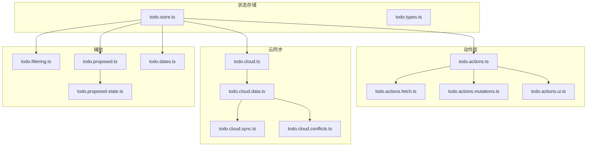
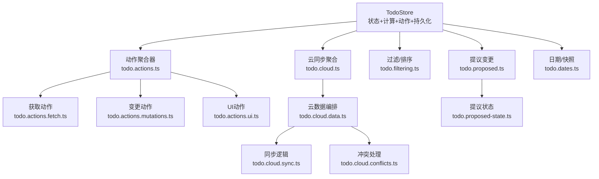
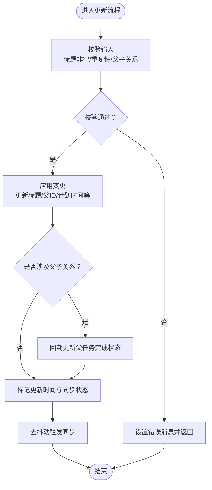
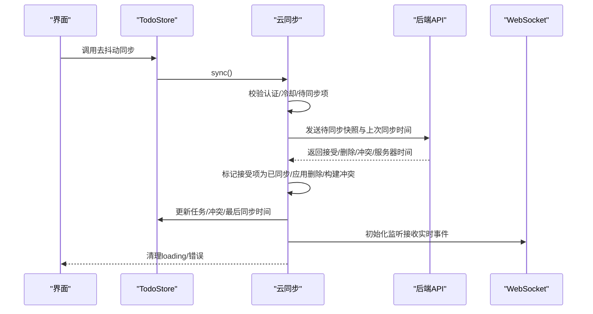
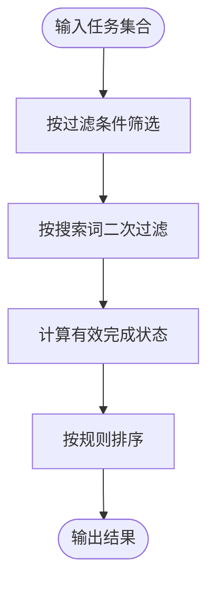
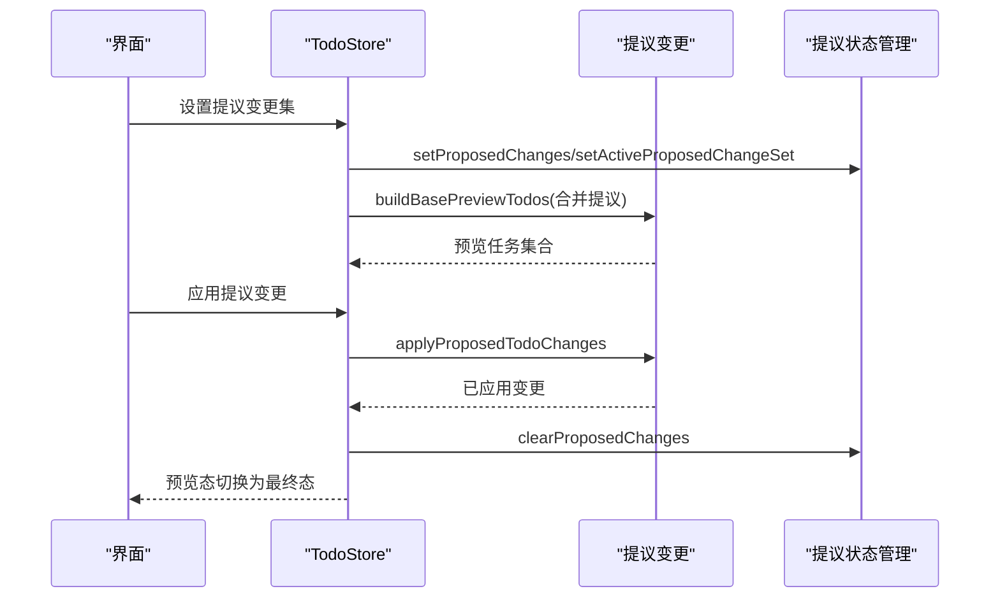
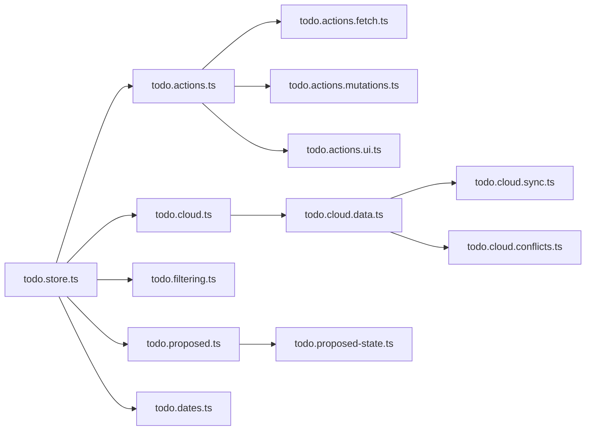

# 任务状态管理

<cite>
**本文引用的文件**
- [apps/frontend/src/features/todo/stores/todo.store.ts](file://apps/frontend/src/features/todo/stores/todo.store.ts)
- [apps/frontend/src/features/todo/stores/todo.types.ts](file://apps/frontend/src/features/todo/stores/todo.types.ts)
- [apps/frontend/src/features/todo/stores/todo.actions.ts](file://apps/frontend/src/features/todo/stores/todo.actions.ts)
- [apps/frontend/src/features/todo/stores/todo.actions.mutations.ts](file://apps/frontend/src/features/todo/stores/todo.actions.mutations.ts)
- [apps/frontend/src/features/todo/stores/todo.actions.fetch.ts](file://apps/frontend/src/features/todo/stores/todo.actions.fetch.ts)
- [apps/frontend/src/features/todo/stores/todo.actions.ui.ts](file://apps/frontend/src/features/todo/stores/todo.actions.ui.ts)
- [apps/frontend/src/features/todo/stores/todo.cloud.ts](file://apps/frontend/src/features/todo/stores/todo.cloud.ts)
- [apps/frontend/src/features/todo/stores/todo.cloud.data.ts](file://apps/frontend/src/features/todo/stores/todo.cloud.data.ts)
- [apps/frontend/src/features/todo/stores/todo.cloud.sync.ts](file://apps/frontend/src/features/todo/stores/todo.cloud.sync.ts)
- [apps/frontend/src/features/todo/stores/todo.cloud.conflicts.ts](file://apps/frontend/src/features/todo/stores/todo.cloud.conflicts.ts)
- [apps/frontend/src/features/todo/stores/todo.filtering.ts](file://apps/frontend/src/features/todo/stores/todo.filtering.ts)
- [apps/frontend/src/features/todo/stores/todo.proposed.ts](file://apps/frontend/src/features/todo/stores/todo.proposed.ts)
- [apps/frontend/src/features/todo/stores/todo.proposed-state.ts](file://apps/frontend/src/features/todo/stores/todo.proposed-state.ts)
- [apps/frontend/src/features/todo/stores/todo.dates.ts](file://apps/frontend/src/features/todo/stores/todo.dates.ts)
</cite>

## 目录

1. [简介](#简介)
2. [项目结构](#项目结构)
3. [核心组件](#核心组件)
4. [架构总览](#架构总览)
5. [详细组件分析](#详细组件分析)
6. [依赖关系分析](#依赖关系分析)
7. [性能考虑](#性能考虑)
8. [故障排查指南](#故障排查指南)
9. [结论](#结论)
10. [附录](#附录)

## 简介

本文件面向Todo任务状态管理，系统性梳理前端Pinia Store的整体架构与实现细节，覆盖任务数据模型、状态结构与行为方法；详述增删改查、状态转换与数据校验；阐述云同步状态管理、冲突解决与离线策略；解释过滤、搜索与排序的状态管理；并给出持久化、性能优化与内存管理的最佳实践，以及扩展开发指导与常见问题解决方案。

## 项目结构

Todo状态管理位于前端应用的特性模块中，采用“按职责分层”的组织方式：

- stores：集中定义状态、计算属性、动作与子域模块（云同步、提议变更、过滤、日期处理等）
- actions.\*：将不同职责的动作拆分为独立模块，便于组合与测试
- cloud.\*：云同步相关（同步、冲突、监听、回收站）
- filtering.ts：过滤与排序算法
- dates.ts：日期标准化与快照克隆
- proposed.\*：提议变更集的构建、应用与状态管理

**图表来源**

- [apps/frontend/src/features/todo/stores/todo.store.ts:1-389](file://apps/frontend/src/features/todo/stores/todo.store.ts#L1-L389)
- [apps/frontend/src/features/todo/stores/todo.actions.ts:1-111](file://apps/frontend/src/features/todo/stores/todo.actions.ts#L1-L111)
- [apps/frontend/src/features/todo/stores/todo.cloud.ts:1-44](file://apps/frontend/src/features/todo/stores/todo.cloud.ts#L1-L44)

**章节来源**

- [apps/frontend/src/features/todo/stores/todo.store.ts:1-389](file://apps/frontend/src/features/todo/stores/todo.store.ts#L1-L389)

## 核心组件

- Todo数据模型与类型
  - 基于共享类型扩展，增加本地专用字段（如时间戳、是否置顶、是否提议、同步状态、番茄钟计数等），并定义过滤类型、视图模式、数据源类型与树形可视化数据结构。
- TodoStore（Pinia）
  - 维护核心状态：任务列表、过滤器、视图模式、搜索词、展开状态、拖拽状态、错误、抽屉与最大化状态、提议变更集、最后同步时间、同步拥有者、冲突列表、数据源（本地/远程）及本地/远端副本。
  - 提供计算属性：过滤后的任务、全部展开状态、待完成/已完成计数、预览任务（基于提议变更）、可视化任务等。
  - 集成云同步、动作、提议变更状态管理，并通过持久化配置保存关键状态到localStorage。
- 动作模块
  - fetch：拉取任务与回收站
  - mutations：新增、删除、更新、切换完成、置顶、延期、重排、计划时间设置等
  - ui：抽屉、视图、过滤、搜索、展开控制、路径查询等
- 云同步
  - 同步：去抖动同步、合并登录、重置状态、冲突接受/重试/清理、监听初始化、永久删除与清空回收站
  - 冲突：三类原因（墓碑、所有者不匹配、版本冲突），支持接受或重试
- 过滤与排序
  - 支持“进行中/已完成/回收站”过滤，搜索关键词匹配，父子级有效完成语义，延期优先、置顶优先、完成优先、顺序优先等规则
- 提议变更
  - 构建基础预览任务、应用提议变更（含添加顺序拓扑排序）、预览态与最终态切换
- 日期与快照
  - 日期标准化、深拷贝与快照

**章节来源**

- [apps/frontend/src/features/todo/stores/todo.types.ts:1-69](file://apps/frontend/src/features/todo/stores/todo.types.ts#L1-L69)
- [apps/frontend/src/features/todo/stores/todo.store.ts:1-389](file://apps/frontend/src/features/todo/stores/todo.store.ts#L1-L389)
- [apps/frontend/src/features/todo/stores/todo.actions.ts:1-111](file://apps/frontend/src/features/todo/stores/todo.actions.ts#L1-L111)
- [apps/frontend/src/features/todo/stores/todo.actions.mutations.ts:1-457](file://apps/frontend/src/features/todo/stores/todo.actions.mutations.ts#L1-L457)
- [apps/frontend/src/features/todo/stores/todo.actions.fetch.ts:1-69](file://apps/frontend/src/features/todo/stores/todo.actions.fetch.ts#L1-L69)
- [apps/frontend/src/features/todo/stores/todo.actions.ui.ts:1-111](file://apps/frontend/src/features/todo/stores/todo.actions.ui.ts#L1-L111)
- [apps/frontend/src/features/todo/stores/todo.cloud.ts:1-44](file://apps/frontend/src/features/todo/stores/todo.cloud.ts#L1-L44)
- [apps/frontend/src/features/todo/stores/todo.cloud.data.ts:1-43](file://apps/frontend/src/features/todo/stores/todo.cloud.data.ts#L1-L43)
- [apps/frontend/src/features/todo/stores/todo.cloud.sync.ts:1-187](file://apps/frontend/src/features/todo/stores/todo.cloud.sync.ts#L1-L187)
- [apps/frontend/src/features/todo/stores/todo.cloud.conflicts.ts:1-91](file://apps/frontend/src/features/todo/stores/todo.cloud.conflicts.ts#L1-L91)
- [apps/frontend/src/features/todo/stores/todo.filtering.ts:1-64](file://apps/frontend/src/features/todo/stores/todo.filtering.ts#L1-L64)
- [apps/frontend/src/features/todo/stores/todo.proposed.ts:1-197](file://apps/frontend/src/features/todo/stores/todo.proposed.ts#L1-L197)
- [apps/frontend/src/features/todo/stores/todo.proposed-state.ts:1-79](file://apps/frontend/src/features/todo/stores/todo.proposed-state.ts#L1-L79)
- [apps/frontend/src/features/todo/stores/todo.dates.ts:1-60](file://apps/frontend/src/features/todo/stores/todo.dates.ts#L1-L60)

## 架构总览

下图展示TodoStore如何协调各子域模块，形成统一的状态管理与行为接口。

**图表来源**

- [apps/frontend/src/features/todo/stores/todo.store.ts:21-368](file://apps/frontend/src/features/todo/stores/todo.store.ts#L21-L368)
- [apps/frontend/src/features/todo/stores/todo.actions.ts:8-110](file://apps/frontend/src/features/todo/stores/todo.actions.ts#L8-L110)
- [apps/frontend/src/features/todo/stores/todo.cloud.ts:6-43](file://apps/frontend/src/features/todo/stores/todo.cloud.ts#L6-L43)
- [apps/frontend/src/features/todo/stores/todo.cloud.data.ts:7-42](file://apps/frontend/src/features/todo/stores/todo.cloud.data.ts#L7-L42)

## 详细组件分析

### 数据模型与状态结构

- Todo模型扩展了共享类型，新增本地字段用于UI与业务逻辑：
  - 时间戳字段：创建/更新/完成/延期/删除/提醒/提醒已触发/周期生成时间
  - 关系字段：父任务ID、展开状态
  - 行为字段：是否置顶、是否提议、是否提议删除、同步状态、番茄钟计数
- 类型定义：
  - 过滤类型：进行中/已完成/回收站
  - 视图模式：列表/可视化/统计/草稿
  - 数据源：本地/远程
  - 同步冲突原因：墓碑/所有者不匹配/版本冲突
  - 提议变更类型：新增/更新/删除/切换/置顶
- 计算属性：
  - 过滤后任务、全部展开状态、待完成/已完成计数、预览任务、可视化任务

**章节来源**

- [apps/frontend/src/features/todo/stores/todo.types.ts:3-69](file://apps/frontend/src/features/todo/stores/todo.types.ts#L3-L69)
- [apps/frontend/src/features/todo/stores/todo.store.ts:47-184](file://apps/frontend/src/features/todo/stores/todo.store.ts#L47-L184)

### 增删改查与状态转换

- 新增任务
  - 校验标题非空、重复性、父任务未完成
  - 设置初始字段（创建/更新时间、顺序、置顶、版本、同步状态、番茄钟）
  - 去抖动触发同步
- 批量新增
  - 反向遍历以保持顺序一致性，逐条校验与去重
- 删除与恢复
  - 删除：递归删除子任务，标记删除时间，触发同步
  - 恢复：清除删除标记，必要时恢复父任务
- 更新
  - 标题非空校验、重复性校验、父子关系调整（移动为根任务时取消延期）
  - 计划时间更新：到期日与提醒日合法性、周期规则与到期日联动
- 切换完成
  - 子任务级联切换，父任务根据子任务完成度回推
- 置顶与延期
  - 置顶切换、延期切换（转为根任务时取消父关系）
- 重排
  - 校验重复性，更新顺序与父ID，取消子任务延期
- 计数与统计
  - 待完成/已完成计数，基于有效完成语义（父完成则子完成）

**图表来源**

- [apps/frontend/src/features/todo/stores/todo.actions.mutations.ts:351-439](file://apps/frontend/src/features/todo/stores/todo.actions.mutations.ts#L351-L439)

**章节来源**

- [apps/frontend/src/features/todo/stores/todo.actions.mutations.ts:97-439](file://apps/frontend/src/features/todo/stores/todo.actions.mutations.ts#L97-L439)

### 数据验证机制

- 标题为空：阻止更新并提示
- 重复性：同父下标题唯一，重排与新增均校验
- 父任务完成：禁止在已完成父任务下新增子任务
- 计划时间：提醒时间不得晚于到期时间；启用周期需提供到期时间
- 日期标准化：统一解析字符串/数字时间戳为Date对象，避免脏数据

**章节来源**

- [apps/frontend/src/features/todo/stores/todo.actions.mutations.ts:333-439](file://apps/frontend/src/features/todo/stores/todo.actions.mutations.ts#L333-L439)
- [apps/frontend/src/features/todo/stores/todo.dates.ts:3-40](file://apps/frontend/src/features/todo/stores/todo.dates.ts#L3-L40)

### 云同步状态管理

- 同步策略
  - 去抖动同步，冷却时间限制，避免频繁请求
  - 仅在认证且远程源时执行
  - 识别未同步项，发送待同步快照与上次同步时间
  - 接收服务端响应：接受/删除/冲突/服务器时间
  - 应用接受项为已同步，冲突项入冲突队列，删除项从目标列表移除
- 合并登录
  - 登录用户变更时重置同步状态，必要时清空本地列表
  - 初始化同步拥有者ID、最后同步时间、回收站加载状态
- 错误与重试
  - 对可重试错误（服务端5xx或无网络响应）指数退避重试
  - 其他错误记录错误码并输出日志

**图表来源**

- [apps/frontend/src/features/todo/stores/todo.store.ts:210-232](file://apps/frontend/src/features/todo/stores/todo.store.ts#L210-L232)
- [apps/frontend/src/features/todo/stores/todo.cloud.sync.ts:34-154](file://apps/frontend/src/features/todo/stores/todo.cloud.sync.ts#L34-L154)

**章节来源**

- [apps/frontend/src/features/todo/stores/todo.cloud.sync.ts:15-187](file://apps/frontend/src/features/todo/stores/todo.cloud.sync.ts#L15-L187)

### 冲突解决与离线策略

- 冲突类型
  - 墓碑：本地项被服务端删除，直接移除
  - 所有者不匹配：本地项与新拥有者不一致，移除本地
  - 版本冲突：以服务端快照为准，或允许用户重试
- 处理流程
  - 接受冲突：按原因执行移除或替换
  - 重试冲突：使用本地草稿重建，提升版本号，重新提交
  - 清理冲突：批量清理
- 离线策略
  - 本地任务标记为“待同步”，断网后仍可继续编辑
  - 登录后自动触发合并与同步

**章节来源**

- [apps/frontend/src/features/todo/stores/todo.cloud.conflicts.ts:21-91](file://apps/frontend/src/features/todo/stores/todo.cloud.conflicts.ts#L21-L91)
- [apps/frontend/src/features/todo/stores/todo.cloud.sync.ts:158-173](file://apps/frontend/src/features/todo/stores/todo.cloud.sync.ts#L158-L173)

### 过滤、搜索与排序

- 过滤
  - 回收站：仅显示已删除项
  - 进行中/已完成：基于有效完成（父完成则子完成）
- 搜索
  - 忽略大小写，匹配标题
- 排序
  - 回收站：按删除时间倒序
  - 进行中：延期任务优先，置顶优先，未完成优先，再按顺序
  - 完成：置顶优先，已完成优先，再按顺序

**图表来源**

- [apps/frontend/src/features/todo/stores/todo.filtering.ts:16-63](file://apps/frontend/src/features/todo/stores/todo.filtering.ts#L16-L63)

**章节来源**

- [apps/frontend/src/features/todo/stores/todo.filtering.ts:1-64](file://apps/frontend/src/features/todo/stores/todo.filtering.ts#L1-L64)

### 提议变更与预览

- 基础预览任务
  - 将当前任务与提议变更合并，生成预览态任务集合
- 应用提议变更
  - 添加：拓扑排序保证父子顺序，映射新旧ID
  - 更新/删除/切换/置顶：按映射后的ID执行
- 状态管理
  - 维护提议变更集字典、顺序列表与活动集ID
  - 支持设置、追加、清理、丢弃与激活

**图表来源**

- [apps/frontend/src/features/todo/stores/todo.store.ts:301-317](file://apps/frontend/src/features/todo/stores/todo.store.ts#L301-L317)
- [apps/frontend/src/features/todo/stores/todo.proposed.ts:11-68](file://apps/frontend/src/features/todo/stores/todo.proposed.ts#L11-L68)
- [apps/frontend/src/features/todo/stores/todo.proposed.ts:124-196](file://apps/frontend/src/features/todo/stores/todo.proposed.ts#L124-L196)
- [apps/frontend/src/features/todo/stores/todo.proposed-state.ts:18-79](file://apps/frontend/src/features/todo/stores/todo.proposed-state.ts#L18-L79)

**章节来源**

- [apps/frontend/src/features/todo/stores/todo.proposed.ts:1-197](file://apps/frontend/src/features/todo/stores/todo.proposed.ts#L1-L197)
- [apps/frontend/src/features/todo/stores/todo.proposed-state.ts:1-79](file://apps/frontend/src/features/todo/stores/todo.proposed-state.ts#L1-L79)

### 持久化、性能优化与内存管理

- 持久化
  - 使用Pinia持久化插件，保存关键状态键值，减少刷新丢失
- 性能优化
  - 去抖动同步：降低频繁变更导致的网络压力
  - 冷却时间：避免短时间内重复同步
  - 深度watch与规范化：在任务变更时一次性处理展开状态与日期标准化
  - 预览态与最终态分离：减少渲染与同步开销
- 内存管理
  - 克隆与快照：对日期与复杂对象进行浅拷贝与深拷贝，避免共享引用引发的副作用
  - 清理冲突与回收站：及时移除无效项，避免列表膨胀

**章节来源**

- [apps/frontend/src/features/todo/stores/todo.store.ts:369-388](file://apps/frontend/src/features/todo/stores/todo.store.ts#L369-L388)
- [apps/frontend/src/features/todo/stores/todo.cloud.sync.ts:15-23](file://apps/frontend/src/features/todo/stores/todo.cloud.sync.ts#L15-L23)
- [apps/frontend/src/features/todo/stores/todo.dates.ts:42-60](file://apps/frontend/src/features/todo/stores/todo.dates.ts#L42-L60)

### 扩展开发指导

- 新增动作
  - 在对应动作模块中添加函数，并在动作聚合器中导出
  - 若涉及同步，确保设置同步状态并触发去抖动同步
- 新增过滤/排序规则
  - 在过滤模块中扩展过滤与排序逻辑，保持与有效完成语义一致
- 新增云同步能力
  - 在云数据编排模块中新增子域动作，复用现有冲突与监听机制
- 新增提议变更类型
  - 在提议变更模块中扩展类型与应用逻辑，并在状态管理中维护集合

**章节来源**

- [apps/frontend/src/features/todo/stores/todo.actions.ts:8-110](file://apps/frontend/src/features/todo/stores/todo.actions.ts#L8-L110)
- [apps/frontend/src/features/todo/stores/todo.cloud.data.ts:7-42](file://apps/frontend/src/features/todo/stores/todo.cloud.data.ts#L7-L42)
- [apps/frontend/src/features/todo/stores/todo.proposed.ts:3-9](file://apps/frontend/src/features/todo/stores/todo.proposed.ts#L3-L9)

## 依赖关系分析

- 组件耦合
  - TodoStore聚合动作、云同步与提议状态管理，保持高内聚低耦合
  - 动作模块间通过依赖注入解耦，便于单元测试
- 外部依赖
  - Pinia用于状态管理，Vue响应式系统驱动UI
  - Axios用于HTTP调用，WebSocket用于实时事件
  - lodash-es提供去抖动工具

**图表来源**

- [apps/frontend/src/features/todo/stores/todo.store.ts:21-368](file://apps/frontend/src/features/todo/stores/todo.store.ts#L21-L368)
- [apps/frontend/src/features/todo/stores/todo.actions.ts:8-110](file://apps/frontend/src/features/todo/stores/todo.actions.ts#L8-L110)
- [apps/frontend/src/features/todo/stores/todo.cloud.ts:6-43](file://apps/frontend/src/features/todo/stores/todo.cloud.ts#L6-L43)

**章节来源**

- [apps/frontend/src/features/todo/stores/todo.store.ts:1-389](file://apps/frontend/src/features/todo/stores/todo.store.ts#L1-L389)

## 性能考虑

- 同步节流：冷却时间与去抖动减少网络请求
- 局部更新：仅对未同步项进行同步，避免全量上传
- 渲染优化：预览态与最终态分离，减少不必要的重渲染
- 数据标准化：统一日期格式，避免无效比较与重渲染

## 故障排查指南

- 同步失败
  - 检查认证状态与数据源；查看错误码与日志
  - 对可重试错误等待自动重试，否则手动重试或清理冲突
- 冲突处理
  - 墓碑/所有者不匹配：接受冲突移除本地项
  - 版本冲突：重试冲突，使用本地草稿重建
- UI异常
  - 检查展开状态与搜索词联动；确认过滤与视图模式
  - 清理提议变更集与冲突列表，重置状态

**章节来源**

- [apps/frontend/src/features/todo/stores/todo.cloud.sync.ts:139-153](file://apps/frontend/src/features/todo/stores/todo.cloud.sync.ts#L139-L153)
- [apps/frontend/src/features/todo/stores/todo.cloud.conflicts.ts:33-83](file://apps/frontend/src/features/todo/stores/todo.cloud.conflicts.ts#L33-L83)

## 结论

该Todo状态管理系统以Pinia为核心，围绕任务生命周期与云同步构建了清晰的分层架构。通过动作模块化、提议变更与冲突处理、过滤排序算法与去抖动同步策略，实现了高效、稳定且可扩展的任务状态管理。建议在后续迭代中持续完善错误上报与监控，增强国际化与无障碍支持，并进一步优化大数据量场景下的渲染性能。

## 附录

- 常用状态键（持久化）
  - 数据源、本地/远端任务、过滤器、视图模式、展开状态、延期偏好、最后同步时间、同步拥有者、抽屉与最大化状态
- 常见错误码
  - 同步失败、标题为空、重复任务、父任务已完成、提醒时间晚于到期、周期需到期日
