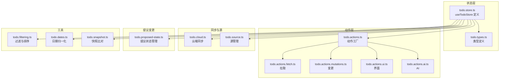
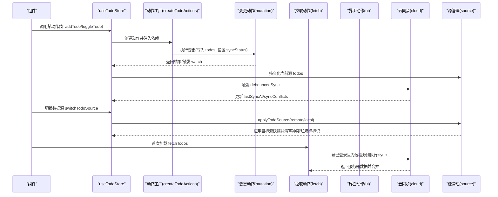
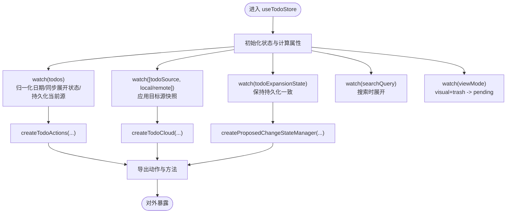
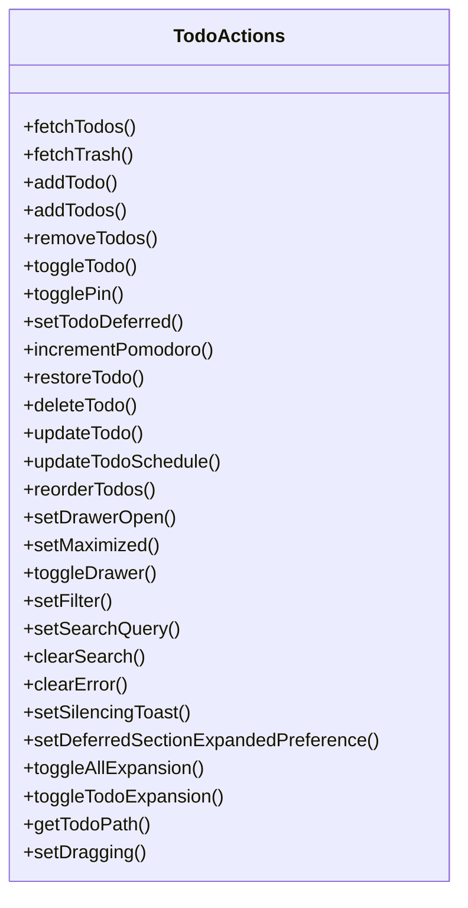
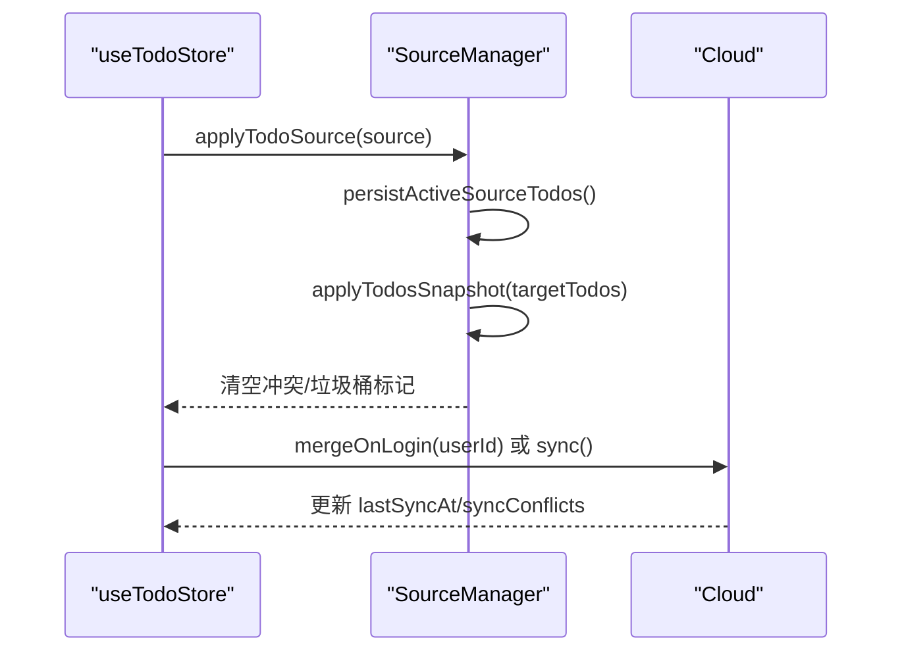
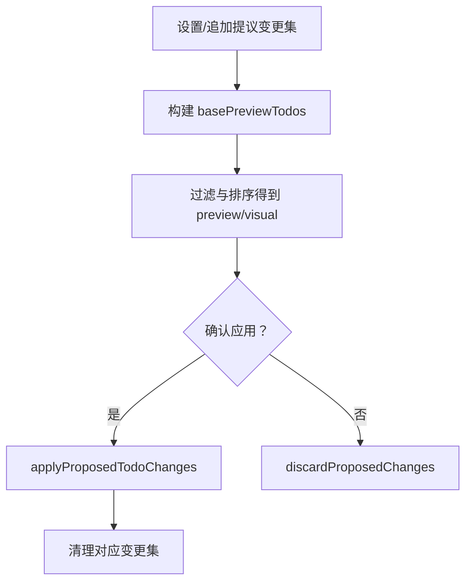
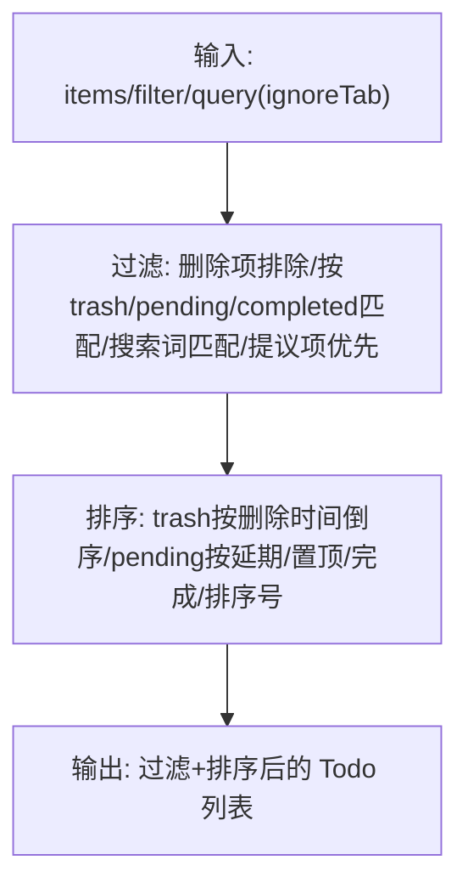
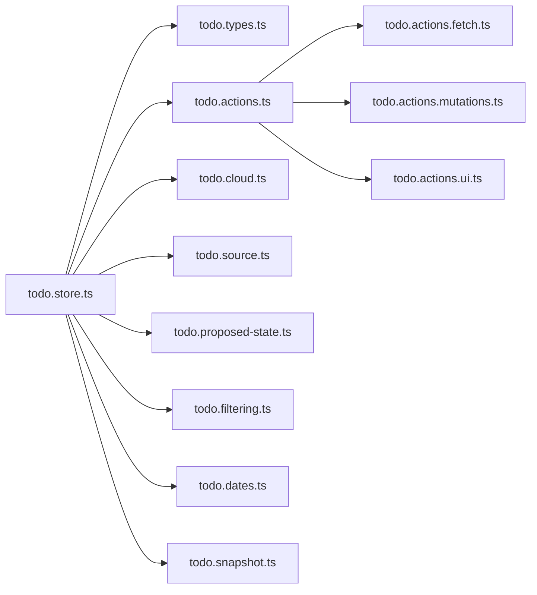

# 状态管理

<cite>
**本文引用的文件**
- [apps/frontend/src/features/todo/stores/todo.store.ts](file://apps/frontend/src/features/todo/stores/todo.store.ts)
- [apps/frontend/src/features/todo/stores/todo.types.ts](file://apps/frontend/src/features/todo/stores/todo.types.ts)
- [apps/frontend/src/features/todo/stores/todo.actions.ts](file://apps/frontend/src/features/todo/stores/todo.actions.ts)
- [apps/frontend/src/features/todo/stores/todo.actions.mutations.ts](file://apps/frontend/src/features/todo/stores/todo.actions.mutations.ts)
- [apps/frontend/src/features/todo/stores/todo.actions.fetch.ts](file://apps/frontend/src/features/todo/stores/todo.actions.fetch.ts)
- [apps/frontend/src/features/todo/stores/todo.actions.ui.ts](file://apps/frontend/src/features/todo/stores/todo.actions.ui.ts)
- [apps/frontend/src/features/todo/stores/todo.cloud.ts](file://apps/frontend/src/features/todo/stores/todo.cloud.ts)
- [apps/frontend/src/features/todo/stores/todo.source.ts](file://apps/frontend/src/features/todo/stores/todo.source.ts)
- [apps/frontend/src/features/todo/stores/todo.proposed-state.ts](file://apps/frontend/src/features/todo/stores/todo.proposed-state.ts)
- [apps/frontend/src/features/todo/stores/todo.filtering.ts](file://apps/frontend/src/features/todo/stores/todo.filtering.ts)
- [apps/frontend/src/features/todo/stores/todo.dates.ts](file://apps/frontend/src/features/todo/stores/todo.dates.ts)
- [apps/frontend/src/features/todo/stores/todo.snapshot.ts](file://apps/frontend/src/features/todo/stores/todo.snapshot.ts)
- [apps/frontend/src/features/todo/stores/todo.ts](file://apps/frontend/src/features/todo/stores/todo.ts)
</cite>

## 目录
1. [简介](#简介)
2. [项目结构](#项目结构)
3. [核心组件](#核心组件)
4. [架构总览](#架构总览)
5. [详细组件分析](#详细组件分析)
6. [依赖关系分析](#依赖关系分析)
7. [性能考量](#性能考量)
8. [故障排查指南](#故障排查指南)
9. [结论](#结论)
10. [附录](#附录)

## 简介
本文件系统性梳理 Lumina Todo 前端基于 Pinia 的状态管理设计与实现，聚焦以下主题：
- Store 架构与模块划分：以 todo.store 为核心，围绕“动作层”“过滤与排序”“云同步”“源管理”“提议变更”等子域拆分职责。
- 数据模型与类型体系：统一 Todo 类型、过滤器、视图模式、数据源类型及同步冲突类型。
- 数据流与控制流：从用户交互到本地状态变更、再到云端同步的完整链路。
- 持久化与跨组件共享：通过 Pinia 持久化键、本地/远程双源快照与监听，实现跨组件共享与状态恢复。
- 异步状态更新：封装 fetch/mutation/ui/ai 四类动作，统一错误处理与加载态。
- 最佳实践、性能优化与调试技巧：包括状态粒度、watch 与计算属性的使用、防抖同步、日期归一化、列表快照比对等。
- 扩展与常见问题：如何新增动作、如何接入新数据源、如何处理冲突与回滚。

## 项目结构
todo 功能的状态管理位于 features/todo/stores 目录，采用“单一 Store + 多个子模块”的组织方式：
- 核心 Store：todo.store.ts 定义 useTodoStore，聚合状态、计算属性、动作与持久化配置。
- 动作模块：按职责拆分为 fetch（拉取）、mutations（变更）、ui（界面）、ai（AI 辅助）四类。
- 同步与源管理：todo.cloud.ts 负责云端同步；todo.source.ts 管理本地/远程数据源切换与快照。
- 提议变更：todo.proposed-state.ts 管理临时变更集，支持预览与批量应用。
- 过滤与排序：todo.filtering.ts 实现树形有效完成判断与多维排序。
- 日期与快照：todo.dates.ts 归一化日期；todo.snapshot.ts 对比列表快照。
- 类型定义：todo.types.ts 统一 Todo、过滤器、视图模式、数据源与冲突类型。

图表来源
- [apps/frontend/src/features/todo/stores/todo.store.ts:21-389](file://apps/frontend/src/features/todo/stores/todo.store.ts#L21-L389)
- [apps/frontend/src/features/todo/stores/todo.actions.ts:8-111](file://apps/frontend/src/features/todo/stores/todo.actions.ts#L8-L111)
- [apps/frontend/src/features/todo/stores/todo.cloud.ts:6-44](file://apps/frontend/src/features/todo/stores/todo.cloud.ts#L6-L44)
- [apps/frontend/src/features/todo/stores/todo.source.ts:23-73](file://apps/frontend/src/features/todo/stores/todo.source.ts#L23-L73)
- [apps/frontend/src/features/todo/stores/todo.proposed-state.ts:18-79](file://apps/frontend/src/features/todo/stores/todo.proposed-state.ts#L18-L79)
- [apps/frontend/src/features/todo/stores/todo.filtering.ts:16-64](file://apps/frontend/src/features/todo/stores/todo.filtering.ts#L16-L64)
- [apps/frontend/src/features/todo/stores/todo.dates.ts:13-60](file://apps/frontend/src/features/todo/stores/todo.dates.ts#L13-L60)
- [apps/frontend/src/features/todo/stores/todo.snapshot.ts:3-44](file://apps/frontend/src/features/todo/stores/todo.snapshot.ts#L3-L44)
- [apps/frontend/src/features/todo/stores/todo.types.ts:1-69](file://apps/frontend/src/features/todo/stores/todo.types.ts#L1-L69)

章节来源
- [apps/frontend/src/features/todo/stores/todo.store.ts:1-389](file://apps/frontend/src/features/todo/stores/todo.store.ts#L1-L389)
- [apps/frontend/src/features/todo/stores/todo.ts:1-3](file://apps/frontend/src/features/todo/stores/todo.ts#L1-L3)

## 核心组件
- useTodoStore：定义 todos、过滤器、视图模式、搜索、展开状态、拖拽、错误、抽屉、最大化、静默提示、垃圾桶加载、提议变更集、同步元信息、数据源与本地/远程副本等状态；提供计算属性如 filteredTodos、pendingCount、completedCount、previewTodos、visualTodos；导出动作与云同步方法。
- 类型系统：Todo、ProposedTodoChange、TodoSyncConflict、FilterType、ViewMode、TodoDataSource、TreeData 等。
- 动作工厂 createTodoActions：聚合 fetch/mutations/ui/ai 动作，统一注入依赖，返回可被组件直接调用的方法集合。
- 源管理 createTodoSourceManager：在本地/远程源之间切换，应用快照、持久化当前源数据、重置同步冲突与垃圾桶加载标记。
- 云同步 createTodoCloud：封装同步、合并登录后远程数据、冲突接受/重试/清理、初始化 Socket 监听、清空垃圾桶、永久删除等。
- 提议变更 createProposedChangeStateManager：维护提议变更集字典、顺序与激活集，支持设置、追加、清理、丢弃与应用。

章节来源
- [apps/frontend/src/features/todo/stores/todo.store.ts:21-389](file://apps/frontend/src/features/todo/stores/todo.store.ts#L21-L389)
- [apps/frontend/src/features/todo/stores/todo.types.ts:1-69](file://apps/frontend/src/features/todo/stores/todo.types.ts#L1-L69)
- [apps/frontend/src/features/todo/stores/todo.actions.ts:8-111](file://apps/frontend/src/features/todo/stores/todo.actions.ts#L8-L111)
- [apps/frontend/src/features/todo/stores/todo.source.ts:23-73](file://apps/frontend/src/features/todo/stores/todo.source.ts#L23-L73)
- [apps/frontend/src/features/todo/stores/todo.cloud.ts:6-44](file://apps/frontend/src/features/todo/stores/todo.cloud.ts#L6-L44)
- [apps/frontend/src/features/todo/stores/todo.proposed-state.ts:18-79](file://apps/frontend/src/features/todo/stores/todo.proposed-state.ts#L18-L79)

## 架构总览
下图展示从用户交互到状态更新与云端同步的关键流程：

图表来源
- [apps/frontend/src/features/todo/stores/todo.store.ts:210-288](file://apps/frontend/src/features/todo/stores/todo.store.ts#L210-L288)
- [apps/frontend/src/features/todo/stores/todo.actions.ts:63-101](file://apps/frontend/src/features/todo/stores/todo.actions.ts#L63-L101)
- [apps/frontend/src/features/todo/stores/todo.actions.mutations.ts:97-151](file://apps/frontend/src/features/todo/stores/todo.actions.mutations.ts#L97-L151)
- [apps/frontend/src/features/todo/stores/todo.actions.fetch.ts:19-31](file://apps/frontend/src/features/todo/stores/todo.actions.fetch.ts#L19-L31)
- [apps/frontend/src/features/todo/stores/todo.cloud.ts:29-42](file://apps/frontend/src/features/todo/stores/todo.cloud.ts#L29-L42)
- [apps/frontend/src/features/todo/stores/todo.source.ts:50-63](file://apps/frontend/src/features/todo/stores/todo.source.ts#L50-L63)

## 详细组件分析

### Store 设计与数据流
- 状态字段：todos、filter、viewMode、searchQuery、todoExpansionState、deferredSectionExpandedPreference、loading、isDragging、error、isDrawerOpen、isMaximized、isSilencingToast、isTrashLoaded、proposedChangeSets、proposedChangeSetOrder、activeProposedChangeSetId、lastSyncAt、syncOwnerId、syncConflicts、todoSource、localTodos、remoteTodos。
- 计算属性：filteredTodos、isAllExpanded、pendingCount、completedCount、proposedChanges、basePreviewTodos、previewTodos、visualTodos、isRemoteSource。
- 关键流程：
  - watch(todos)：归一化日期、同步展开状态持久化、在非应用快照期间持久化当前源 todos。
  - watch([todoSource, localTodos, remoteTodos])：根据当前源应用快照并恢复展开状态。
  - watch(todoExpansionState)：在非应用快照期间保持持久化与 UI 展开状态一致。
  - watch(searchQuery)：搜索时自动展开所有项。
  - watch(viewMode)：当视图为 visual 且过滤器为 trash 时强制切换为 pending。
- 导出方法：switchTodoSource、mergeOnLoginWithRemote、clearRemoteOnLogout、applyProposedChanges 等。

图表来源
- [apps/frontend/src/features/todo/stores/todo.store.ts:21-151](file://apps/frontend/src/features/todo/stores/todo.store.ts#L21-L151)
- [apps/frontend/src/features/todo/stores/todo.store.ts:210-288](file://apps/frontend/src/features/todo/stores/todo.store.ts#L210-L288)
- [apps/frontend/src/features/todo/stores/todo.store.ts:301-318](file://apps/frontend/src/features/todo/stores/todo.store.ts#L301-L318)

章节来源
- [apps/frontend/src/features/todo/stores/todo.store.ts:21-389](file://apps/frontend/src/features/todo/stores/todo.store.ts#L21-L389)

### 动作模块：fetch/mutations/ui/ai
- fetch 动作：首次加载时若为远程源且已登录则触发同步；拉取垃圾桶时将服务端数据映射到本地并合并到 todos。
- mutations 动作：重复性校验、父子级联动、重排、添加/删除/更新、延期、计划时间更新、番茄钟计数、批量添加等，并统一设置 syncStatus 与触发防抖同步。
- ui 动作：抽屉开关、最大化、过滤器切换、搜索清空、错误清空、静默提示、展开/折叠全选、单项展开切换、路径查询。
- ai 动作：由外部引入，用于 AI 分解任务等能力。

图表来源
- [apps/frontend/src/features/todo/stores/todo.actions.ts:8-111](file://apps/frontend/src/features/todo/stores/todo.actions.ts#L8-L111)
- [apps/frontend/src/features/todo/stores/todo.actions.fetch.ts:15-68](file://apps/frontend/src/features/todo/stores/todo.actions.fetch.ts#L15-L68)
- [apps/frontend/src/features/todo/stores/todo.actions.mutations.ts:13-457](file://apps/frontend/src/features/todo/stores/todo.actions.mutations.ts#L13-L457)
- [apps/frontend/src/features/todo/stores/todo.actions.ui.ts:21-111](file://apps/frontend/src/features/todo/stores/todo.actions.ui.ts#L21-L111)

章节来源
- [apps/frontend/src/features/todo/stores/todo.actions.ts:8-111](file://apps/frontend/src/features/todo/stores/todo.actions.ts#L8-L111)
- [apps/frontend/src/features/todo/stores/todo.actions.fetch.ts:15-68](file://apps/frontend/src/features/todo/stores/todo.actions.fetch.ts#L15-L68)
- [apps/frontend/src/features/todo/stores/todo.actions.mutations.ts:13-457](file://apps/frontend/src/features/todo/stores/todo.actions.mutations.ts#L13-L457)
- [apps/frontend/src/features/todo/stores/todo.actions.ui.ts:21-111](file://apps/frontend/src/features/todo/stores/todo.actions.ui.ts#L21-L111)

### 云同步与源管理
- 云同步：封装 sync、debouncedSync、mergeOnLogin、冲突处理、Socket 监听、清空垃圾桶、永久删除等。
- 源管理：在本地/远程源之间切换时，先持久化当前源数据，再应用目标源快照，清空冲突与垃圾桶标记，并在远程源下为未同步项标记 pending。

图表来源
- [apps/frontend/src/features/todo/stores/todo.store.ts:255-288](file://apps/frontend/src/features/todo/stores/todo.store.ts#L255-L288)
- [apps/frontend/src/features/todo/stores/todo.source.ts:50-63](file://apps/frontend/src/features/todo/stores/todo.source.ts#L50-L63)
- [apps/frontend/src/features/todo/stores/todo.cloud.ts:29-42](file://apps/frontend/src/features/todo/stores/todo.cloud.ts#L29-L42)

章节来源
- [apps/frontend/src/features/todo/stores/todo.source.ts:23-73](file://apps/frontend/src/features/todo/stores/todo.source.ts#L23-L73)
- [apps/frontend/src/features/todo/stores/todo.cloud.ts:6-44](file://apps/frontend/src/features/todo/stores/todo.cloud.ts#L6-L44)

### 提议变更与预览
- 提议变更状态管理：维护变更集字典、变更集顺序与当前激活集；支持设置、追加、清理、丢弃与应用。
- 预览与应用：基于当前 todos 与激活的提议变更生成 basePreviewTodos，再经过滤与排序得到 previewTodos/visualTodos；应用后清理对应变更集。

图表来源
- [apps/frontend/src/features/todo/stores/todo.proposed-state.ts:18-79](file://apps/frontend/src/features/todo/stores/todo.proposed-state.ts#L18-L79)
- [apps/frontend/src/features/todo/stores/todo.store.ts:307-318](file://apps/frontend/src/features/todo/stores/todo.store.ts#L307-L318)

章节来源
- [apps/frontend/src/features/todo/stores/todo.proposed-state.ts:18-79](file://apps/frontend/src/features/todo/stores/todo.proposed-state.ts#L18-L79)
- [apps/frontend/src/features/todo/stores/todo.store.ts:165-184](file://apps/frontend/src/features/todo/stores/todo.store.ts#L165-L184)

### 过滤、排序与树形语义
- 有效完成：父任务完成时其子任务视为有效完成；子任务完成时递归检查父任务。
- 过滤与排序：支持 pending/completed/trash；trash 按删除时间倒序；pending 将延期任务置于末尾；优先级为：已置顶 > 未完成 > 已完成 > 排序号；提议中的操作项优先显示。

图表来源
- [apps/frontend/src/features/todo/stores/todo.filtering.ts:16-64](file://apps/frontend/src/features/todo/stores/todo.filtering.ts#L16-L64)

章节来源
- [apps/frontend/src/features/todo/stores/todo.filtering.ts:1-64](file://apps/frontend/src/features/todo/stores/todo.filtering.ts#L1-L64)

### 日期归一化与快照比对
- 日期归一化：toDate 将字符串/数字/Date 统一转换为 Date，normalizeTodoDatesInPlace 在原地修正各时间字段。
- 快照与比对：cloneTodo 深拷贝并复制日期；snapshotTodos 生成快照；isSameTodoList 比较字段差异，避免不必要的重渲染与重复持久化。

章节来源
- [apps/frontend/src/features/todo/stores/todo.dates.ts:3-60](file://apps/frontend/src/features/todo/stores/todo.dates.ts#L3-L60)
- [apps/frontend/src/features/todo/stores/todo.snapshot.ts:3-44](file://apps/frontend/src/features/todo/stores/todo.snapshot.ts#L3-L44)

## 依赖关系分析
- 组件耦合与内聚：
  - useTodoStore 作为中心枢纽，高内聚地组合状态、计算属性与动作；通过依赖注入降低模块间耦合。
  - 动作模块各自职责清晰，互不直接依赖，仅通过 Store 注入共享状态。
- 外部依赖：
  - @lumina/shared 的 Todo 类型用于云端传输；@/features/auth/stores/auth 用于鉴权与登录态判断。
- 可能的循环依赖：
  - 动作模块通过动态导入 auth store，避免编译期循环依赖。

图表来源
- [apps/frontend/src/features/todo/stores/todo.store.ts:1-389](file://apps/frontend/src/features/todo/stores/todo.store.ts#L1-L389)
- [apps/frontend/src/features/todo/stores/todo.actions.ts:1-111](file://apps/frontend/src/features/todo/stores/todo.actions.ts#L1-L111)
- [apps/frontend/src/features/todo/stores/todo.cloud.ts:1-44](file://apps/frontend/src/features/todo/stores/todo.cloud.ts#L1-L44)
- [apps/frontend/src/features/todo/stores/todo.source.ts:1-73](file://apps/frontend/src/features/todo/stores/todo.source.ts#L1-L73)
- [apps/frontend/src/features/todo/stores/todo.proposed-state.ts:1-79](file://apps/frontend/src/features/todo/stores/todo.proposed-state.ts#L1-L79)
- [apps/frontend/src/features/todo/stores/todo.filtering.ts:1-64](file://apps/frontend/src/features/todo/stores/todo.filtering.ts#L1-L64)
- [apps/frontend/src/features/todo/stores/todo.dates.ts:1-60](file://apps/frontend/src/features/todo/stores/todo.dates.ts#L1-L60)
- [apps/frontend/src/features/todo/stores/todo.snapshot.ts:1-44](file://apps/frontend/src/features/todo/stores/todo.snapshot.ts#L1-L44)
- [apps/frontend/src/features/todo/stores/todo.types.ts:1-69](file://apps/frontend/src/features/todo/stores/todo.types.ts#L1-L69)

## 性能考量
- 计算属性与深度监听：
  - 使用 computed 生成 filteredTodos/previewTodos 等，避免在模板中重复计算。
  - watch(todos, { deep: true }) 与 snapshot 比对结合，减少不必要的持久化与渲染。
- 防抖同步：
  - 变更动作统一设置 syncStatus 并触发 debouncedSync，降低网络请求频率。
- 日期归一化：
  - 在 todos 变更时统一归一化日期，避免无效比较与异常渲染。
- 列表快照比对：
  - applyTodosSnapshot 前后进行快照比对，避免相同数据反复赋值。
- 视图模式限制：
  - 当视图为 visual 时禁止 trash 过滤，减少不必要的过滤与排序开销。

章节来源
- [apps/frontend/src/features/todo/stores/todo.store.ts:90-125](file://apps/frontend/src/features/todo/stores/todo.store.ts#L90-L125)
- [apps/frontend/src/features/todo/stores/todo.actions.mutations.ts:94-95](file://apps/frontend/src/features/todo/stores/todo.actions.mutations.ts#L94-L95)
- [apps/frontend/src/features/todo/stores/todo.dates.ts:13-40](file://apps/frontend/src/features/todo/stores/todo.dates.ts#L13-L40)
- [apps/frontend/src/features/todo/stores/todo.snapshot.ts:3-44](file://apps/frontend/src/features/todo/stores/todo.snapshot.ts#L3-L44)
- [apps/frontend/src/features/todo/stores/todo.store.ts:147-151](file://apps/frontend/src/features/todo/stores/todo.store.ts#L147-L151)

## 故障排查指南
- 常见错误码与定位：
  - todo.duplicate：标题重复或父子关系导致重复；检查 isDuplicate 与父子状态联动。
  - todo.parentCompleted：父任务已完成时不允许添加子任务；检查父任务完成状态。
  - todo.titleEmpty：标题为空；检查 updateTodo 的标题裁剪逻辑。
  - todo.addError/deleteError：添加/删除失败；查看 mutations 中的错误设置与日志。
  - todo.syncFailed：拉取垃圾桶失败；检查 fetchTrash 的异常捕获与错误设置。
  - todo.remindAfterDue / todo.recurrenceNeedsDue：提醒时间晚于到期时间或周期规则缺少到期时间；检查 updateTodoSchedule 的校验。
- 冲突处理：
  - acceptSyncConflict/retrySyncConflict/clearSyncConflicts：在云同步中处理版本冲突与墓碑冲突。
- 登录/登出与数据源：
  - mergeOnLoginWithRemote：登录后合并远程数据；clearRemoteOnLogout：登出后清空远程数据与同步状态。
- 展开状态与搜索：
  - 搜索时自动展开；toggleAllExpansion/toggleTodoExpansion 控制展开状态；持久化在 todoExpansionState 中。

章节来源
- [apps/frontend/src/features/todo/stores/todo.actions.mutations.ts:33-35](file://apps/frontend/src/features/todo/stores/todo.actions.mutations.ts#L33-L35)
- [apps/frontend/src/features/todo/stores/todo.actions.mutations.ts:105-108](file://apps/frontend/src/features/todo/stores/todo.actions.mutations.ts#L105-L108)
- [apps/frontend/src/features/todo/stores/todo.actions.mutations.ts:369-372](file://apps/frontend/src/features/todo/stores/todo.actions.mutations.ts#L369-L372)
- [apps/frontend/src/features/todo/stores/todo.actions.mutations.ts:402-410](file://apps/frontend/src/features/todo/stores/todo.actions.mutations.ts#L402-L410)
- [apps/frontend/src/features/todo/stores/todo.actions.fetch.ts:56-61](file://apps/frontend/src/features/todo/stores/todo.actions.fetch.ts#L56-L61)
- [apps/frontend/src/features/todo/stores/todo.store.ts:210-232](file://apps/frontend/src/features/todo/stores/todo.store.ts#L210-L232)
- [apps/frontend/src/features/todo/stores/todo.store.ts:255-299](file://apps/frontend/src/features/todo/stores/todo.store.ts#L255-L299)
- [apps/frontend/src/features/todo/stores/todo.actions.ui.ts:74-94](file://apps/frontend/src/features/todo/stores/todo.actions.ui.ts#L74-L94)

## 结论
该状态管理方案以 Pinia 为核心，通过“单一 Store + 多动作模块 + 源管理 + 云同步 + 提议变更”的分层设计，实现了：
- 明确的职责边界与良好的内聚性；
- 从本地到云端的双向同步与冲突处理；
- 高效的数据流与可观测性（watch + computed）；
- 可扩展的动作体系与可测试的模块化结构。

建议在后续迭代中持续关注：
- 将高频计算属性进一步拆分，避免大列表下的重复计算；
- 对同步冲突 UI 进行增强，提升可诊断性；
- 对动作模块进行单元测试覆盖，确保变更原子性与幂等性。

## 附录
- 状态模块组织方式与命名规范：
  - 文件名采用小驼峰，如 todo.store.ts、todo.actions.mutations.ts、todo.cloud.ts。
  - Store 名称使用 useXxx 形式，导出统一入口。
- 代码分割策略：
  - 动作模块按职责拆分，便于按需加载；
  - 动态导入 auth store，避免编译期循环依赖；
  - 云同步与源管理独立封装，便于替换与扩展。
- 扩展指导：
  - 新增动作：在 todo.actions.* 中新增模块并在 todo.actions.ts 中聚合；
  - 新增数据源：在 todo.source.ts 中扩展 applyTodoSource 与 setSourceTodos；
  - 新增同步策略：在 todo.cloud.ts 中扩展 createTodoCloudData 并在 todo.store.ts 中注入。