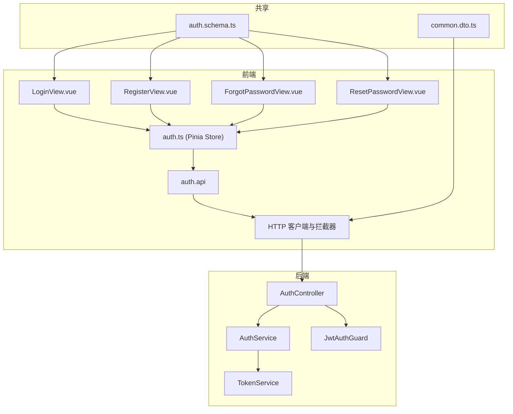
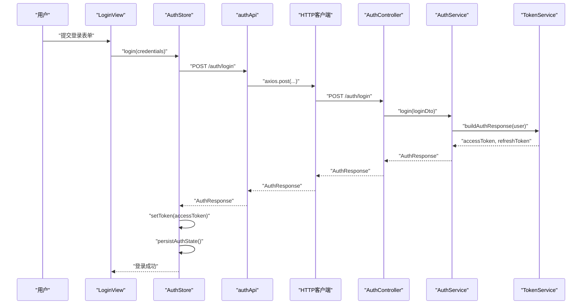
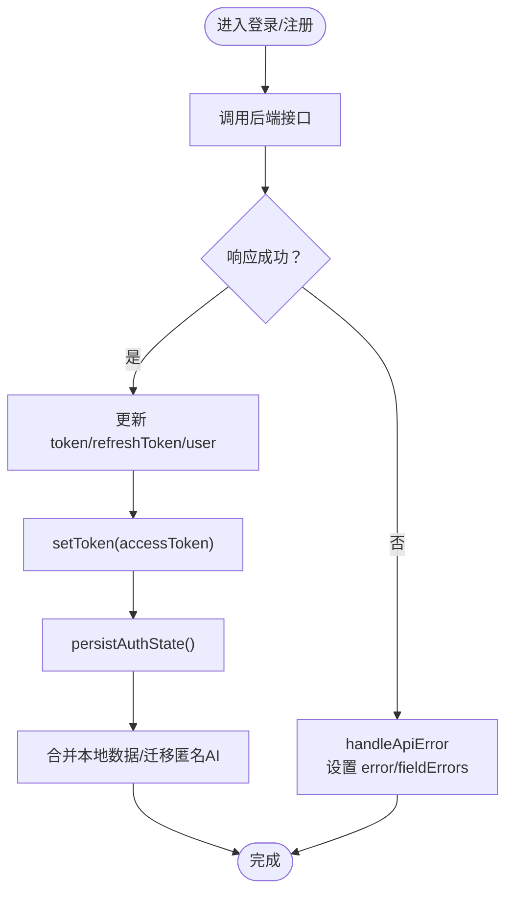
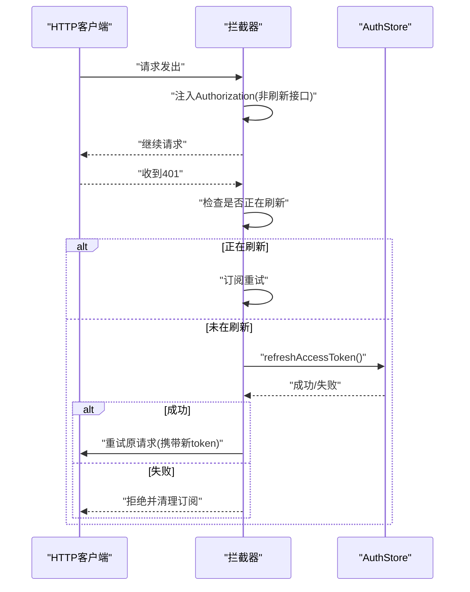
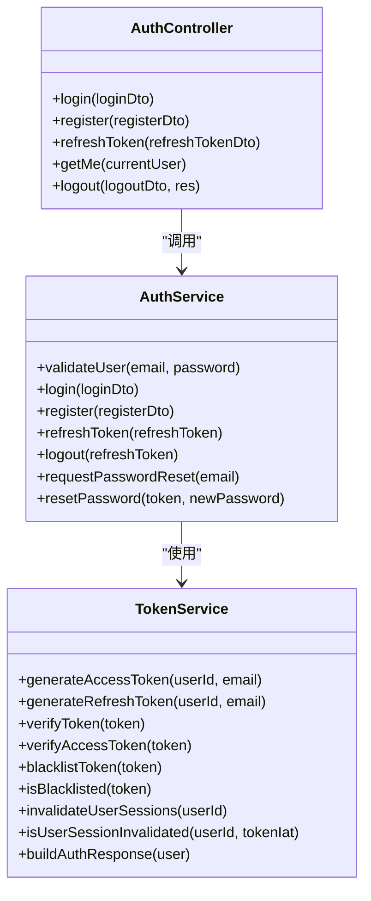
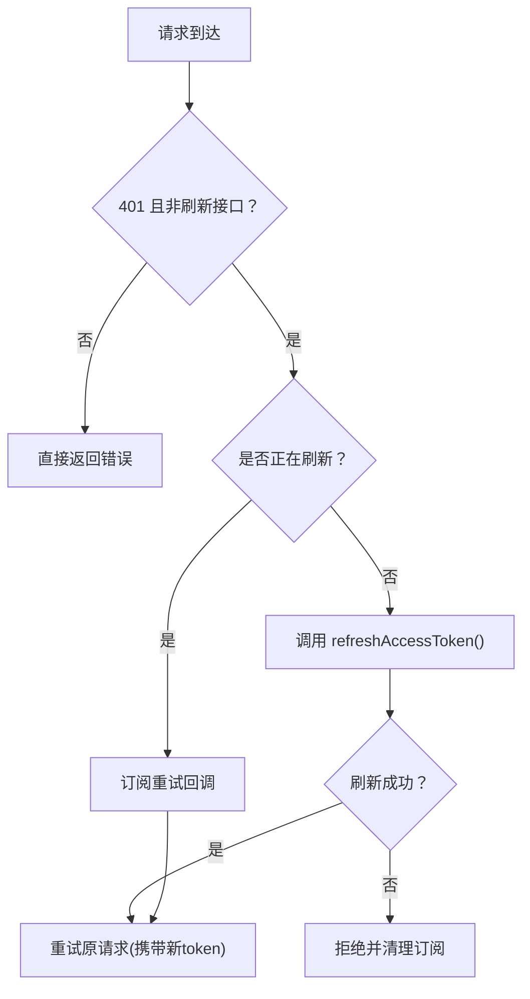
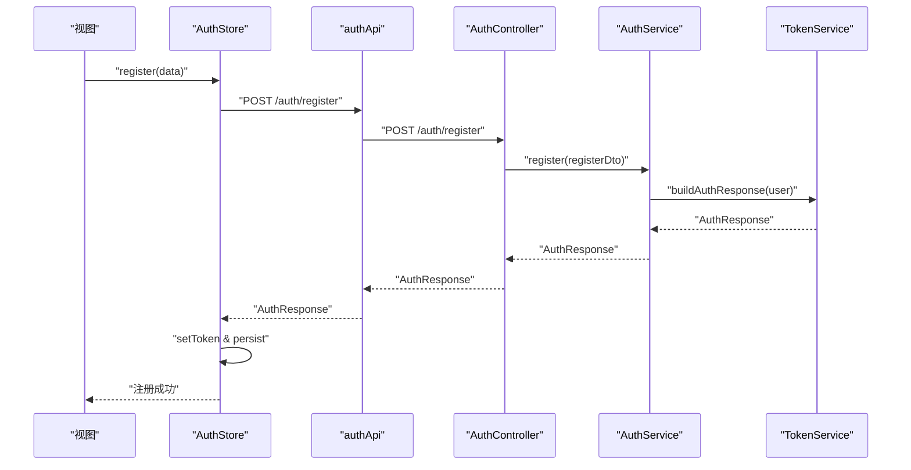
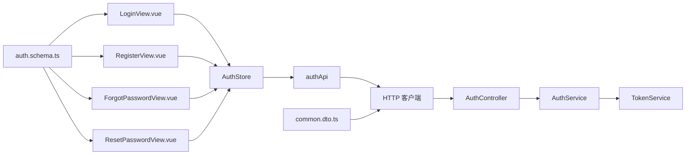

# 认证状态管理

<cite>
**本文引用的文件**
- [apps/frontend/src/features/auth/stores/auth.ts](file://apps/frontend/src/features/auth/stores/auth.ts)
- [apps/frontend/src/features/auth/api/index.ts](file://apps/frontend/src/features/auth/api/index.ts)
- [apps/frontend/src/features/auth/views/LoginView.vue](file://apps/frontend/src/features/auth/views/LoginView.vue)
- [apps/frontend/src/features/auth/views/RegisterView.vue](file://apps/frontend/src/features/auth/views/RegisterView.vue)
- [apps/frontend/src/features/auth/views/ForgotPasswordView.vue](file://apps/frontend/src/features/auth/views/ForgotPasswordView.vue)
- [apps/frontend/src/features/auth/views/ResetPasswordView.vue](file://apps/frontend/src/features/auth/views/ResetPasswordView.vue)
- [apps/frontend/src/api/index.ts](file://apps/frontend/src/api/index.ts)
- [apps/backend/src/auth/auth.controller.ts](file://apps/backend/src/auth/auth.controller.ts)
- [apps/backend/src/auth/auth.service.ts](file://apps/backend/src/auth/auth.service.ts)
- [apps/backend/src/auth/token.service.ts](file://apps/backend/src/auth/token.service.ts)
- [apps/backend/src/auth/jwt-auth.guard.ts](file://apps/backend/src/auth/jwt-auth.guard.ts)
- [packages/shared/src/schemas/auth.schema.ts](file://packages/shared/src/schemas/auth.schema.ts)
- [packages/shared/src/dto/common.dto.ts](file://packages/shared/src/dto/common.dto.ts)
</cite>

## 目录
1. [简介](#简介)
2. [项目结构](#项目结构)
3. [核心组件](#核心组件)
4. [架构总览](#架构总览)
5. [详细组件分析](#详细组件分析)
6. [依赖关系分析](#依赖关系分析)
7. [性能考量](#性能考量)
8. [故障排查指南](#故障排查指南)
9. [结论](#结论)
10. [附录](#附录)

## 简介
本文件系统性阐述前端认证状态管理的设计与实现，覆盖用户信息状态、认证状态与会话管理，以及登录、注册、登出等关键流程的状态流转。同时详解 JWT 令牌的存储、刷新与验证机制，说明前端如何通过拦截器自动处理 401 并触发令牌刷新，以及后端如何通过守卫与令牌服务保障安全性。文档还包含持久化策略、安全考虑、错误处理机制，并提供扩展开发指导与安全最佳实践。

## 项目结构
认证状态管理横跨前端与后端：
- 前端负责用户界面、Pinia Store 状态管理、Axios 拦截器与令牌刷新、UI 视图与表单校验。
- 后端负责认证控制器、服务层、令牌服务与 JWT 守卫，提供登录、注册、刷新、登出、用户信息获取等接口。

**图表来源**
- [apps/frontend/src/features/auth/views/LoginView.vue:1-142](file://apps/frontend/src/features/auth/views/LoginView.vue#L1-L142)
- [apps/frontend/src/features/auth/views/RegisterView.vue:1-166](file://apps/frontend/src/features/auth/views/RegisterView.vue#L1-L166)
- [apps/frontend/src/features/auth/views/ForgotPasswordView.vue:1-149](file://apps/frontend/src/features/auth/views/ForgotPasswordView.vue#L1-L149)
- [apps/frontend/src/features/auth/views/ResetPasswordView.vue:1-197](file://apps/frontend/src/features/auth/views/ResetPasswordView.vue#L1-L197)
- [apps/frontend/src/features/auth/stores/auth.ts:1-413](file://apps/frontend/src/features/auth/stores/auth.ts#L1-L413)
- [apps/frontend/src/features/auth/api/index.ts:1-93](file://apps/frontend/src/features/auth/api/index.ts#L1-L93)
- [apps/frontend/src/api/index.ts:1-199](file://apps/frontend/src/api/index.ts#L1-L199)
- [apps/backend/src/auth/auth.controller.ts:1-81](file://apps/backend/src/auth/auth.controller.ts#L1-L81)
- [apps/backend/src/auth/auth.service.ts:1-127](file://apps/backend/src/auth/auth.service.ts#L1-L127)
- [apps/backend/src/auth/token.service.ts:1-187](file://apps/backend/src/auth/token.service.ts#L1-L187)
- [apps/backend/src/auth/jwt-auth.guard.ts:1-10](file://apps/backend/src/auth/jwt-auth.guard.ts#L1-L10)
- [packages/shared/src/schemas/auth.schema.ts:1-121](file://packages/shared/src/schemas/auth.schema.ts#L1-L121)
- [packages/shared/src/dto/common.dto.ts:1-81](file://packages/shared/src/dto/common.dto.ts#L1-L81)

**章节来源**
- [apps/frontend/src/features/auth/stores/auth.ts:1-413](file://apps/frontend/src/features/auth/stores/auth.ts#L1-L413)
- [apps/frontend/src/features/auth/api/index.ts:1-93](file://apps/frontend/src/features/auth/api/index.ts#L1-L93)
- [apps/frontend/src/api/index.ts:1-199](file://apps/frontend/src/api/index.ts#L1-L199)
- [apps/backend/src/auth/auth.controller.ts:1-81](file://apps/backend/src/auth/auth.controller.ts#L1-L81)
- [apps/backend/src/auth/auth.service.ts:1-127](file://apps/backend/src/auth/auth.service.ts#L1-L127)
- [apps/backend/src/auth/token.service.ts:1-187](file://apps/backend/src/auth/token.service.ts#L1-L187)
- [apps/backend/src/auth/jwt-auth.guard.ts:1-10](file://apps/backend/src/auth/jwt-auth.guard.ts#L1-L10)
- [packages/shared/src/schemas/auth.schema.ts:1-121](file://packages/shared/src/schemas/auth.schema.ts#L1-L121)
- [packages/shared/src/dto/common.dto.ts:1-81](file://packages/shared/src/dto/common.dto.ts#L1-L81)

## 核心组件
- 前端 Pinia Store（认证状态中心）
  - 状态：访问令牌、刷新令牌、用户信息、加载与错误状态、字段级错误。
  - 计算属性：是否已认证。
  - 方法：登录、注册、刷新访问令牌、获取当前用户、登出、头像上传、忘记/重置密码、错误清理、从持久化恢复、持久化写入与清理。
- 前端 HTTP 客户端与拦截器
  - 自动注入 Authorization 头，排除刷新接口自身。
  - 统一处理 401：并发刷新控制、订阅重试、失败回退。
  - 内存与本地持久化双通道获取令牌，避免登录瞬间竞态。
- 后端控制器与服务
  - 控制器暴露登录、注册、刷新、登出、获取当前用户接口。
  - 服务整合用户、密码与令牌服务，提供统一认证入口。
  - 令牌服务负责签发、验证、黑名单与会话失效标记。
- JWT 守卫
  - 基于 Passport 的 JWT 守卫，保护受保护路由。
- 共享模式与类型
  - 前端视图与 Store 使用共享的 Zod Schema 进行表单校验与类型约束。
  - API 响应统一为 ApiResponse 类型，便于前端解包与错误处理。

**章节来源**
- [apps/frontend/src/features/auth/stores/auth.ts:23-413](file://apps/frontend/src/features/auth/stores/auth.ts#L23-L413)
- [apps/frontend/src/api/index.ts:8-199](file://apps/frontend/src/api/index.ts#L8-L199)
- [apps/backend/src/auth/auth.controller.ts:16-81](file://apps/backend/src/auth/auth.controller.ts#L16-L81)
- [apps/backend/src/auth/auth.service.ts:12-127](file://apps/backend/src/auth/auth.service.ts#L12-L127)
- [apps/backend/src/auth/token.service.ts:15-187](file://apps/backend/src/auth/token.service.ts#L15-L187)
- [apps/backend/src/auth/jwt-auth.guard.ts:1-10](file://apps/backend/src/auth/jwt-auth.guard.ts#L1-L10)
- [packages/shared/src/schemas/auth.schema.ts:24-121](file://packages/shared/src/schemas/auth.schema.ts#L24-L121)
- [packages/shared/src/dto/common.dto.ts:4-54](file://packages/shared/src/dto/common.dto.ts#L4-L54)

## 架构总览
认证状态管理采用“前端状态 + 后端令牌”的分层设计：
- 前端负责 UI、状态与网络请求拦截；后端负责业务与安全。
- 前端通过 Axios 拦截器自动携带令牌；遇到 401 时触发令牌刷新，成功后重试原请求。
- 后端通过 JWT 守卫校验请求，令牌服务负责签发与验证，支持刷新令牌与黑名单。

**图表来源**
- [apps/frontend/src/features/auth/views/LoginView.vue:46-53](file://apps/frontend/src/features/auth/views/LoginView.vue#L46-L53)
- [apps/frontend/src/features/auth/stores/auth.ts:148-179](file://apps/frontend/src/features/auth/stores/auth.ts#L148-L179)
- [apps/frontend/src/features/auth/api/index.ts:18-22](file://apps/frontend/src/features/auth/api/index.ts#L18-L22)
- [apps/frontend/src/api/index.ts:66-91](file://apps/frontend/src/api/index.ts#L66-L91)
- [apps/backend/src/auth/auth.controller.ts:23-28](file://apps/backend/src/auth/auth.controller.ts#L23-L28)
- [apps/backend/src/auth/auth.service.ts:41-49](file://apps/backend/src/auth/auth.service.ts#L41-L49)
- [apps/backend/src/auth/token.service.ts:175-185](file://apps/backend/src/auth/token.service.ts#L175-L185)

## 详细组件分析

### 前端认证 Store 设计
- 状态与计算属性
  - token、refreshToken、user、loading、error、fieldErrors。
  - isAuthenticated 基于 token 是否存在。
- 关键流程
  - 登录/注册：调用 authApi，接收 accessToken、refreshToken、user，立即 setToken 并持久化。
  - 刷新访问令牌：循环最多 N 次，对瞬时错误进行退避重试；遇到 401 则触发登出。
  - 获取当前用户：仅在存在 token 时调用，401 时上报遥测并登出。
  - 登出：清空本地状态与持久化，尝试向后端发送登出请求并清理 Cookie。
  - 头像上传：更新 user 后持久化。
  - 错误处理：统一解析后端错误与字段级错误，支持国际化提示。
- 持久化策略
  - 使用 pinia-plugin-persistedstate 持久化 token、refreshToken、user。
  - 同步写入 localStorage，emit 事件以驱动其他模块（如 AI 存储域）切换。
- 遥测与可观测性
  - 定义多种 AuthTelemetryEvent，上报刷新重试、失败原因等，便于监控。

**图表来源**
- [apps/frontend/src/features/auth/stores/auth.ts:148-212](file://apps/frontend/src/features/auth/stores/auth.ts#L148-L212)

**章节来源**
- [apps/frontend/src/features/auth/stores/auth.ts:23-413](file://apps/frontend/src/features/auth/stores/auth.ts#L23-L413)

### 前端 HTTP 客户端与拦截器
- 自动注入 Authorization 头，排除 /auth/refresh。
- 401 处理：
  - 并发刷新控制：isRefreshing 与订阅队列，避免重复刷新。
  - 刷新失败：根据是否已认证返回不同错误信息。
  - 重试原请求：更新 Authorization 头后重新发起。
- 令牌获取：
  - 优先内存 activeToken，其次从 localStorage 解析兼容结构。

**图表来源**
- [apps/frontend/src/api/index.ts:66-196](file://apps/frontend/src/api/index.ts#L66-L196)
- [apps/frontend/src/features/auth/stores/auth.ts:296-341](file://apps/frontend/src/features/auth/stores/auth.ts#L296-L341)

**章节来源**
- [apps/frontend/src/api/index.ts:1-199](file://apps/frontend/src/api/index.ts#L1-L199)

### 后端认证控制器与服务
- 控制器
  - 暴露 /auth/login、/auth/register、/auth/refresh、/auth/me、/auth/logout。
  - 登出时清理 Cookie。
- 服务
  - validateUser：校验用户与密码。
  - login/register：返回构建的认证响应。
  - refreshToken：校验刷新令牌有效性、用户是否存在、会话是否被失效。
  - logout：将刷新令牌加入黑名单。
- 令牌服务
  - 生成短期访问令牌与长期刷新令牌。
  - 验证令牌并区分 access/refresh。
  - 黑名单：基于 Redis TTL 存储，保证过期自动清理。
  - 会话失效：通过 Redis 标记用户最近失效时间，刷新时校验 token.iat。

**图表来源**
- [apps/backend/src/auth/auth.controller.ts:16-81](file://apps/backend/src/auth/auth.controller.ts#L16-L81)
- [apps/backend/src/auth/auth.service.ts:12-127](file://apps/backend/src/auth/auth.service.ts#L12-L127)
- [apps/backend/src/auth/token.service.ts:15-187](file://apps/backend/src/auth/token.service.ts#L15-L187)

**章节来源**
- [apps/backend/src/auth/auth.controller.ts:1-81](file://apps/backend/src/auth/auth.controller.ts#L1-L81)
- [apps/backend/src/auth/auth.service.ts:1-127](file://apps/backend/src/auth/auth.service.ts#L1-L127)
- [apps/backend/src/auth/token.service.ts:1-187](file://apps/backend/src/auth/token.service.ts#L1-L187)

### JWT 令牌存储、刷新与验证机制
- 令牌存储
  - 前端：localStorage 持久化 token、refreshToken、user；同时维护内存 activeToken 避免竞态。
  - 后端：Redis 黑名单与会话失效标记，确保令牌生命周期可控。
- 刷新流程
  - 前端：拦截器捕获 401，触发 refreshAccessToken，最多重试 N 次，瞬时错误退避。
  - 后端：校验刷新令牌类型、黑名单、用户存在性与会话失效标记。
- 验证机制
  - 前端：仅在非刷新接口注入 Authorization。
  - 后端：JwtAuthGuard 保护受保护路由，TokenService 区分 access/refresh 验证。

**图表来源**
- [apps/frontend/src/api/index.ts:124-196](file://apps/frontend/src/api/index.ts#L124-L196)
- [apps/frontend/src/features/auth/stores/auth.ts:296-341](file://apps/frontend/src/features/auth/stores/auth.ts#L296-L341)

**章节来源**
- [apps/frontend/src/api/index.ts:1-199](file://apps/frontend/src/api/index.ts#L1-L199)
- [apps/backend/src/auth/token.service.ts:103-170](file://apps/backend/src/auth/token.service.ts#L103-L170)

### 用户权限状态管理与路由守卫
- 权限状态
  - 前端：isAuthenticated 作为全局认证状态，配合路由元信息与导航守卫可实现细粒度权限控制。
  - 后端：JwtAuthGuard 保护受保护路由，确保仅持有有效 access token 的请求可访问。
- 路由守卫
  - 可在 beforeEach 中读取路由 meta 权限要求，结合 isAuthenticated 与用户角色进行放行/拦截。
  - 当前仓库未内置通用路由守卫，可在现有守卫基础上扩展。

**章节来源**
- [apps/frontend/src/features/auth/stores/auth.ts:35-35](file://apps/frontend/src/features/auth/stores/auth.ts#L35-L35)
- [apps/backend/src/auth/jwt-auth.guard.ts:1-10](file://apps/backend/src/auth/jwt-auth.guard.ts#L1-L10)

### 认证流程状态管理实现
- 登录
  - 视图层收集表单并校验；Store 调用 authApi.login，成功后 setToken 并持久化，触发数据合并与 AI 迁移。
- 注册
  - 视图层收集表单并校验；Store 调用 authApi.register，成功后 setToken 并持久化，触发数据合并与 AI 迁移。
- 忘记密码/重置密码
  - 视图层提交邮箱或重置令牌+新密码；Store 调用对应 API，成功后视图层引导跳转。
- 登出
  - Store 清空本地状态与持久化，尝试后端登出并清理 Cookie；随后清理远程待办数据。

**图表来源**
- [apps/frontend/src/features/auth/views/RegisterView.vue:55-63](file://apps/frontend/src/features/auth/views/RegisterView.vue#L55-L63)
- [apps/frontend/src/features/auth/stores/auth.ts:184-212](file://apps/frontend/src/features/auth/stores/auth.ts#L184-L212)
- [apps/frontend/src/features/auth/api/index.ts:26-30](file://apps/frontend/src/features/auth/api/index.ts#L26-L30)
- [apps/backend/src/auth/auth.controller.ts:33-38](file://apps/backend/src/auth/auth.controller.ts#L33-L38)
- [apps/backend/src/auth/auth.service.ts:51-54](file://apps/backend/src/auth/auth.service.ts#L51-L54)
- [apps/backend/src/auth/token.service.ts:175-185](file://apps/backend/src/auth/token.service.ts#L175-L185)

**章节来源**
- [apps/frontend/src/features/auth/views/LoginView.vue:46-53](file://apps/frontend/src/features/auth/views/LoginView.vue#L46-L53)
- [apps/frontend/src/features/auth/views/RegisterView.vue:55-63](file://apps/frontend/src/features/auth/views/RegisterView.vue#L55-L63)
- [apps/frontend/src/features/auth/views/ForgotPasswordView.vue:43-48](file://apps/frontend/src/features/auth/views/ForgotPasswordView.vue#L43-L48)
- [apps/frontend/src/features/auth/views/ResetPasswordView.vue:65-75](file://apps/frontend/src/features/auth/views/ResetPasswordView.vue#L65-L75)
- [apps/frontend/src/features/auth/stores/auth.ts:148-372](file://apps/frontend/src/features/auth/stores/auth.ts#L148-L372)
- [apps/frontend/src/features/auth/api/index.ts:1-93](file://apps/frontend/src/features/auth/api/index.ts#L1-L93)

## 依赖关系分析
- 前端
  - 视图依赖 Pinia Store 与共享 Schema。
  - Store 依赖 authApi 与 HTTP 客户端。
  - HTTP 客户端依赖 i18n 与 Pinia Store。
- 后端
  - 控制器依赖服务；服务依赖用户、密码与令牌服务。
  - 令牌服务依赖配置、JWT 与 Redis。

**图表来源**
- [apps/frontend/src/features/auth/views/LoginView.vue:1-142](file://apps/frontend/src/features/auth/views/LoginView.vue#L1-L142)
- [apps/frontend/src/features/auth/views/RegisterView.vue:1-166](file://apps/frontend/src/features/auth/views/RegisterView.vue#L1-L166)
- [apps/frontend/src/features/auth/views/ForgotPasswordView.vue:1-149](file://apps/frontend/src/features/auth/views/ForgotPasswordView.vue#L1-L149)
- [apps/frontend/src/features/auth/views/ResetPasswordView.vue:1-197](file://apps/frontend/src/features/auth/views/ResetPasswordView.vue#L1-L197)
- [apps/frontend/src/features/auth/stores/auth.ts:1-413](file://apps/frontend/src/features/auth/stores/auth.ts#L1-L413)
- [apps/frontend/src/features/auth/api/index.ts:1-93](file://apps/frontend/src/features/auth/api/index.ts#L1-L93)
- [apps/frontend/src/api/index.ts:1-199](file://apps/frontend/src/api/index.ts#L1-L199)
- [apps/backend/src/auth/auth.controller.ts:1-81](file://apps/backend/src/auth/auth.controller.ts#L1-L81)
- [apps/backend/src/auth/auth.service.ts:1-127](file://apps/backend/src/auth/auth.service.ts#L1-L127)
- [apps/backend/src/auth/token.service.ts:1-187](file://apps/backend/src/auth/token.service.ts#L1-L187)
- [packages/shared/src/schemas/auth.schema.ts:1-121](file://packages/shared/src/schemas/auth.schema.ts#L1-L121)
- [packages/shared/src/dto/common.dto.ts:1-81](file://packages/shared/src/dto/common.dto.ts#L1-L81)

**章节来源**
- [apps/frontend/src/features/auth/stores/auth.ts:1-413](file://apps/frontend/src/features/auth/stores/auth.ts#L1-L413)
- [apps/frontend/src/features/auth/api/index.ts:1-93](file://apps/frontend/src/features/auth/api/index.ts#L1-L93)
- [apps/frontend/src/api/index.ts:1-199](file://apps/frontend/src/api/index.ts#L1-L199)
- [apps/backend/src/auth/auth.controller.ts:1-81](file://apps/backend/src/auth/auth.controller.ts#L1-L81)
- [apps/backend/src/auth/auth.service.ts:1-127](file://apps/backend/src/auth/auth.service.ts#L1-L127)
- [apps/backend/src/auth/token.service.ts:1-187](file://apps/backend/src/auth/token.service.ts#L1-L187)
- [packages/shared/src/schemas/auth.schema.ts:1-121](file://packages/shared/src/schemas/auth.schema.ts#L1-L121)
- [packages/shared/src/dto/common.dto.ts:1-81](file://packages/shared/src/dto/common.dto.ts#L1-L81)

## 性能考量
- 刷新重试与退避
  - 前端对瞬时错误进行有限次数重试，避免频繁刷新造成后端压力。
- 并发刷新控制
  - 使用 isRefreshing 与订阅队列，避免同一时刻多个刷新请求并发。
- 令牌有效期
  - 访问令牌短期有效，刷新令牌长期有效，降低频繁刷新概率。
- 缓存与持久化
  - localStorage 持久化减少刷新频率；内存 activeToken 避免竞态。

[本节为通用性能讨论，不直接分析具体文件]

## 故障排查指南
- 常见错误与定位
  - 登录/注册失败：检查 fieldErrors 与 error，确认后端返回的字段级错误与国际化消息。
  - 401 未刷新：确认拦截器是否正确注入 Authorization，且非刷新接口；检查 isRefreshing 状态与订阅队列。
  - 刷新失败：查看遥测事件与控制台警告，确认是否为 401 或瞬时错误；核对刷新令牌是否在黑名单或已失效。
  - 登出无效：确认后端是否清理 Cookie，前端是否清理 localStorage 与内存 token。
- 安全相关
  - 若出现“令牌过期”或“无效刷新令牌”，检查后端黑名单与会话失效标记逻辑。
  - 生产环境需确保 JWT_REFRESH_SECRET 配置正确。

**章节来源**
- [apps/frontend/src/features/auth/stores/auth.ts:40-51](file://apps/frontend/src/features/auth/stores/auth.ts#L40-L51)
- [apps/frontend/src/api/index.ts:124-196](file://apps/frontend/src/api/index.ts#L124-L196)
- [apps/backend/src/auth/token.service.ts:130-170](file://apps/backend/src/auth/token.service.ts#L130-L170)

## 结论
该认证状态管理方案通过前端 Store 与拦截器、后端控制器与令牌服务形成清晰的职责边界：前端专注用户体验与状态一致性，后端专注安全与业务逻辑。JWT 令牌的短期访问与长期刷新组合、Redis 黑名单与会话失效标记，共同保障了系统的安全性与可用性。通过 pinia-plugin-persistedstate 与内存 activeToken 的双重策略，实现了良好的持久化与竞态规避。

[本节为总结性内容，不直接分析具体文件]

## 附录

### 认证状态扩展开发指导
- 新增认证流程
  - 在 authApi 中新增接口定义，遵循 ApiResponse 约定。
  - 在 AuthStore 中新增对应方法，处理成功/失败分支与持久化。
  - 在视图中使用 vee-validate 与共享 Schema 进行表单校验。
- 路由权限控制
  - 在路由 meta 中声明所需权限，结合 isAuthenticated 与用户角色在导航守卫中进行拦截。
- 安全增强
  - 引入 CSRF 保护与 SameSite Cookie 策略（后端）。
  - 对敏感操作增加二次确认与验证码。
  - 定期轮换密钥并清理历史黑名单。

[本节为通用指导，不直接分析具体文件]

### 安全最佳实践
- 令牌安全
  - 访问令牌短期有效，刷新令牌长期有效；生产环境必须配置独立的刷新密钥。
  - 使用 Redis 黑名单与会话失效标记，防止令牌泄露后的滥用。
- 前端安全
  - 严格限制 Authorization 注入范围，避免在刷新接口上注入旧令牌。
  - 使用 HTTPS 传输，避免令牌在中间环节被窃取。
- 后端安全
  - 对认证接口启用速率限制，防止暴力破解。
  - 守卫仅允许有效 access token 的请求访问受保护资源。

[本节为通用安全建议，不直接分析具体文件]