# UI组件库

<cite>
**本文引用的文件**
- [apps/frontend/src/components/ui/button/Button.vue](file://apps/frontend/src/components/ui/button/Button.vue)
- [apps/frontend/src/components/ui/button/index.ts](file://apps/frontend/src/components/ui/button/index.ts)
- [apps/frontend/src/components/ui/input/Input.vue](file://apps/frontend/src/components/ui/input/Input.vue)
- [apps/frontend/src/components/ui/input/index.ts](file://apps/frontend/src/components/ui/input/index.ts)
- [apps/frontend/src/components/ui/checkbox/Checkbox.vue](file://apps/frontend/src/components/ui/checkbox/Checkbox.vue)
- [apps/frontend/src/components/ui/checkbox/index.ts](file://apps/frontend/src/components/ui/checkbox/index.ts)
- [apps/frontend/src/components/ui/dropdown-menu/DropdownMenu.vue](file://apps/frontend/src/components/ui/dropdown-menu/DropdownMenu.vue)
- [apps/frontend/src/components/ui/dropdown-menu/DropdownMenuContent.vue](file://apps/frontend/src/components/ui/dropdown-menu/DropdownMenuContent.vue)
- [apps/frontend/src/components/ui/dropdown-menu/index.ts](file://apps/frontend/src/components/ui/dropdown-menu/index.ts)
- [apps/frontend/src/components/ui/tabs/Tabs.vue](file://apps/frontend/src/components/ui/tabs/Tabs.vue)
- [apps/frontend/src/components/ui/tabs/index.ts](file://apps/frontend/src/components/ui/tabs/index.ts)
- [apps/frontend/src/components/ui/tooltip/Tooltip.vue](file://apps/frontend/src/components/ui/tooltip/Tooltip.vue)
- [apps/frontend/src/components/ui/tooltip/index.ts](file://apps/frontend/src/components/ui/tooltip/index.ts)
- [apps/frontend/src/components/ui/alert-dialog/AlertDialog.vue](file://apps/frontend/src/components/ui/alert-dialog/AlertDialog.vue)
- [apps/frontend/src/components/ui/alert-dialog/index.ts](file://apps/frontend/src/components/ui/alert-dialog/index.ts)
- [apps/frontend/src/components/ui/card/Card.vue](file://apps/frontend/src/components/ui/card/Card.vue)
- [apps/frontend/src/components/ui/card/CardContent.vue](file://apps/frontend/src/components/ui/card/CardContent.vue)
- [apps/frontend/src/components/ui/card/CardHeader.vue](file://apps/frontend/src/components/ui/card/CardHeader.vue)
- [apps/frontend/src/components/ui/card/CardTitle.vue](file://apps/frontend/src/components/ui/card/CardTitle.vue)
- [apps/frontend/src/components/ui/card/CardDescription.vue](file://apps/frontend/src/components/ui/card/CardDescription.vue)
- [apps/frontend/src/components/ui/card/CardFooter.vue](file://apps/frontend/src/components/ui/card/CardFooter.vue)
- [apps/frontend/src/components/ui/card/index.ts](file://apps/frontend/src/components/ui/card/index.ts)
- [apps/frontend/src/components/ui/badge/Badge.vue](file://apps/frontend/src/components/ui/badge/Badge.vue)
- [apps/frontend/src/components/ui/badge/index.ts](file://apps/frontend/src/components/ui/badge/index.ts)
- [apps/frontend/src/components/ui/separator/Separator.vue](file://apps/frontend/src/components/ui/separator/Separator.vue)
- [apps/frontend/src/components/ui/separator/index.ts](file://apps/frontend/src/components/ui/separator/index.ts)
- [apps/frontend/src/components/ui/popover/Popover.vue](file://apps/frontend/src/components/ui/popover/Popover.vue)
- [apps/frontend/src/components/ui/popover/PopoverContent.vue](file://apps/frontend/src/components/ui/popover/PopoverContent.vue)
- [apps/frontend/src/components/ui/popover/PopoverTrigger.vue](file://apps/frontend/src/components/ui/popover/PopoverTrigger.vue)
- [apps/frontend/src/components/ui/popover/index.ts](file://apps/frontend/src/components/ui/popover/index.ts)
- [apps/frontend/src/components/ui/scroll-area/ScrollArea.vue](file://apps/frontend/src/components/ui/scroll-area/ScrollArea.vue)
- [apps/frontend/src/components/ui/scroll-area/ScrollBar.vue](file://apps/frontend/src/components/ui/scroll-area/ScrollBar.vue)
- [apps/frontend/src/components/ui/scroll-area/index.ts](file://apps/frontend/src/components/ui/scroll-area/index.ts)
- [apps/frontend/src/components/ui/ToastProvider.vue](file://apps/frontend/src/components/ui/ToastProvider.vue)
- [apps/frontend/src/lib/utils.ts](file://apps/frontend/src/lib/utils.ts)
- [apps/frontend/src/styles/theme.css](file://apps/frontend/src/styles/theme.css)
- [apps/frontend/src/styles/ui.css](file://apps/frontend/src/styles/ui.css)
- [apps/frontend/package.json](file://apps/frontend/package.json)
</cite>

## 更新摘要

**所做更改**

- 更新了组件导入顺序标准化改进的相关章节
- 新增了关于组件索引文件重构的说明
- 完善了组件模块化结构的文档描述
- 增强了代码组织性和可维护性的相关内容

## 目录

1. [简介](#简介)
2. [项目结构](#项目结构)
3. [核心组件](#核心组件)
4. [架构总览](#架构总览)
5. [组件详解](#组件详解)
6. [依赖关系分析](#依赖关系分析)
7. [性能考量](#性能考量)
8. [故障排查指南](#故障排查指南)
9. [结论](#结论)
10. [附录](#附录)

## 简介

本文件系统性梳理 Lumina Todo 前端应用的 UI 组件库，重点围绕基于 Reka UI（原 Radix UI 的 Vue 生态适配）与 Headless UI 思想的组件体系进行设计与实现解析。文档涵盖组件功能特性、属性配置、可访问性设计、主题定制与样式覆盖、组件组合与状态管理、事件处理、响应式设计、动画与交互反馈，并提供最佳实践、性能优化与无障碍访问建议。

**更新** 本版本重点反映了组件导入顺序标准化改进，通过重构组件索引文件结构，提升了代码组织性和可维护性。

## 项目结构

UI 组件集中位于前端应用的组件目录下，采用按功能域分层组织：基础按钮、输入、复选框等通用控件；卡片、徽章、分隔线等布局容器；弹出层、下拉菜单、标签页、提示框等交互组件；以及通知 ToastProvider。样式通过主题变量与 Tailwind 工具类统一治理，工具函数提供类名合并与高亮等通用能力。

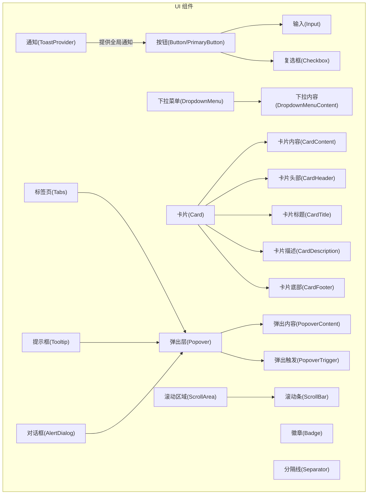

**图示来源**

- [apps/frontend/src/components/ui/button/Button.vue:1-32](file://apps/frontend/src/components/ui/button/Button.vue#L1-L32)
- [apps/frontend/src/components/ui/button/index.ts:1-38](file://apps/frontend/src/components/ui/button/index.ts#L1-L38)
- [apps/frontend/src/components/ui/input/Input.vue:1-42](file://apps/frontend/src/components/ui/input/Input.vue#L1-L42)
- [apps/frontend/src/components/ui/input/index.ts:1-2](file://apps/frontend/src/components/ui/input/index.ts#L1-L2)
- [apps/frontend/src/components/ui/checkbox/Checkbox.vue:1-34](file://apps/frontend/src/components/ui/checkbox/Checkbox.vue#L1-L34)
- [apps/frontend/src/components/ui/checkbox/index.ts:1-2](file://apps/frontend/src/components/ui/checkbox/index.ts#L1-L2)
- [apps/frontend/src/components/ui/dropdown-menu/DropdownMenu.vue:1-16](file://apps/frontend/src/components/ui/dropdown-menu/DropdownMenu.vue#L1-L16)
- [apps/frontend/src/components/ui/dropdown-menu/DropdownMenuContent.vue:1-37](file://apps/frontend/src/components/ui/dropdown-menu/DropdownMenuContent.vue#L1-L37)
- [apps/frontend/src/components/ui/dropdown-menu/index.ts:1-17](file://apps/frontend/src/components/ui/dropdown-menu/index.ts#L1-L17)
- [apps/frontend/src/components/ui/tabs/Tabs.vue:1-16](file://apps/frontend/src/components/ui/tabs/Tabs.vue#L1-L16)
- [apps/frontend/src/components/ui/tabs/index.ts:1-5](file://apps/frontend/src/components/ui/tabs/index.ts#L1-L5)
- [apps/frontend/src/components/ui/tooltip/Tooltip.vue:1-16](file://apps/frontend/src/components/ui/tooltip/Tooltip.vue#L1-L16)
- [apps/frontend/src/components/ui/tooltip/index.ts:1-5](file://apps/frontend/src/components/ui/tooltip/index.ts#L1-L5)
- [apps/frontend/src/components/ui/alert-dialog/AlertDialog.vue:1-16](file://apps/frontend/src/components/ui/alert-dialog/AlertDialog.vue#L1-L16)
- [apps/frontend/src/components/ui/alert-dialog/index.ts:1-10](file://apps/frontend/src/components/ui/alert-dialog/index.ts#L1-L10)
- [apps/frontend/src/components/ui/card/Card.vue:1-15](file://apps/frontend/src/components/ui/card/Card.vue#L1-L15)
- [apps/frontend/src/components/ui/card/CardContent.vue](file://apps/frontend/src/components/ui/card/CardContent.vue)
- [apps/frontend/src/components/ui/card/CardHeader.vue](file://apps/frontend/src/components/ui/card/CardHeader.vue)
- [apps/frontend/src/components/ui/card/CardTitle.vue](file://apps/frontend/src/components/ui/card/CardTitle.vue)
- [apps/frontend/src/components/ui/card/CardDescription.vue](file://apps/frontend/src/components/ui/card/CardDescription.vue)
- [apps/frontend/src/components/ui/card/CardFooter.vue](file://apps/frontend/src/components/ui/card/CardFooter.vue)
- [apps/frontend/src/components/ui/card/index.ts:1-7](file://apps/frontend/src/components/ui/card/index.ts#L1-L7)
- [apps/frontend/src/components/ui/badge/Badge.vue:1-18](file://apps/frontend/src/components/ui/badge/Badge.vue#L1-L18)
- [apps/frontend/src/components/ui/badge/index.ts:1-26](file://apps/frontend/src/components/ui/badge/index.ts#L1-L26)
- [apps/frontend/src/components/ui/separator/Separator.vue:1-16](file://apps/frontend/src/components/ui/separator/Separator.vue#L1-L16)
- [apps/frontend/src/components/ui/separator/index.ts:1-2](file://apps/frontend/src/components/ui/separator/index.ts#L1-L2)
- [apps/frontend/src/components/ui/popover/Popover.vue](file://apps/frontend/src/components/ui/popover/Popover.vue)
- [apps/frontend/src/components/ui/popover/PopoverContent.vue](file://apps/frontend/src/components/ui/popover/PopoverContent.vue)
- [apps/frontend/src/components/ui/popover/PopoverTrigger.vue](file://apps/frontend/src/components/ui/popover/PopoverTrigger.vue)
- [apps/frontend/src/components/ui/popover/index.ts:1-4](file://apps/frontend/src/components/ui/popover/index.ts#L1-L4)
- [apps/frontend/src/components/ui/scroll-area/ScrollArea.vue](file://apps/frontend/src/components/ui/scroll-area/ScrollArea.vue)
- [apps/frontend/src/components/ui/scroll-area/ScrollBar.vue](file://apps/frontend/src/components/ui/scroll-area/ScrollBar.vue)
- [apps/frontend/src/components/ui/scroll-area/index.ts:1-3](file://apps/frontend/src/components/ui/scroll-area/index.ts#L1-L3)
- [apps/frontend/src/components/ui/ToastProvider.vue](file://apps/frontend/src/components/ui/ToastProvider.vue)

**章节来源**

- [apps/frontend/src/components/ui/button/Button.vue:1-32](file://apps/frontend/src/components/ui/button/Button.vue#L1-L32)
- [apps/frontend/src/components/ui/button/index.ts:1-38](file://apps/frontend/src/components/ui/button/index.ts#L1-L38)
- [apps/frontend/src/components/ui/input/Input.vue:1-42](file://apps/frontend/src/components/ui/input/Input.vue#L1-L42)
- [apps/frontend/src/components/ui/input/index.ts:1-2](file://apps/frontend/src/components/ui/input/index.ts#L1-L2)
- [apps/frontend/src/components/ui/checkbox/Checkbox.vue:1-34](file://apps/frontend/src/components/ui/checkbox/Checkbox.vue#L1-L34)
- [apps/frontend/src/components/ui/checkbox/index.ts:1-2](file://apps/frontend/src/components/ui/checkbox/index.ts#L1-L2)
- [apps/frontend/src/components/ui/dropdown-menu/DropdownMenu.vue:1-16](file://apps/frontend/src/components/ui/dropdown-menu/DropdownMenu.vue#L1-L16)
- [apps/frontend/src/components/ui/dropdown-menu/DropdownMenuContent.vue:1-37](file://apps/frontend/src/components/ui/dropdown-menu/DropdownMenuContent.vue#L1-L37)
- [apps/frontend/src/components/ui/dropdown-menu/index.ts:1-17](file://apps/frontend/src/components/ui/dropdown-menu/index.ts#L1-L17)
- [apps/frontend/src/components/ui/tabs/Tabs.vue:1-16](file://apps/frontend/src/components/ui/tabs/Tabs.vue#L1-L16)
- [apps/frontend/src/components/ui/tabs/index.ts:1-5](file://apps/frontend/src/components/ui/tabs/index.ts#L1-L5)
- [apps/frontend/src/components/ui/tooltip/Tooltip.vue:1-16](file://apps/frontend/src/components/ui/tooltip/Tooltip.vue#L1-L16)
- [apps/frontend/src/components/ui/tooltip/index.ts:1-5](file://apps/frontend/src/components/ui/tooltip/index.ts#L1-L5)
- [apps/frontend/src/components/ui/alert-dialog/AlertDialog.vue:1-16](file://apps/frontend/src/components/ui/alert-dialog/AlertDialog.vue#L1-L16)
- [apps/frontend/src/components/ui/alert-dialog/index.ts:1-10](file://apps/frontend/src/components/ui/alert-dialog/index.ts#L1-L10)
- [apps/frontend/src/components/ui/card/Card.vue:1-15](file://apps/frontend/src/components/ui/card/Card.vue#L1-L15)
- [apps/frontend/src/components/ui/card/CardContent.vue](file://apps/frontend/src/components/ui/card/CardContent.vue)
- [apps/frontend/src/components/ui/card/CardHeader.vue](file://apps/frontend/src/components/ui/card/CardHeader.vue)
- [apps/frontend/src/components/ui/card/CardTitle.vue](file://apps/frontend/src/components/ui/card/CardTitle.vue)
- [apps/frontend/src/components/ui/card/CardDescription.vue](file://apps/frontend/src/components/ui/card/CardDescription.vue)
- [apps/frontend/src/components/ui/card/CardFooter.vue](file://apps/frontend/src/components/ui/card/CardFooter.vue)
- [apps/frontend/src/components/ui/card/index.ts:1-7](file://apps/frontend/src/components/ui/card/index.ts#L1-L7)
- [apps/frontend/src/components/ui/badge/Badge.vue:1-18](file://apps/frontend/src/components/ui/badge/Badge.vue#L1-L18)
- [apps/frontend/src/components/ui/badge/index.ts:1-26](file://apps/frontend/src/components/ui/badge/index.ts#L1-L26)
- [apps/frontend/src/components/ui/separator/Separator.vue:1-16](file://apps/frontend/src/components/ui/separator/Separator.vue#L1-L16)
- [apps/frontend/src/components/ui/separator/index.ts:1-2](file://apps/frontend/src/components/ui/separator/index.ts#L1-L2)
- [apps/frontend/src/components/ui/popover/Popover.vue](file://apps/frontend/src/components/ui/popover/Popover.vue)
- [apps/frontend/src/components/ui/popover/PopoverContent.vue](file://apps/frontend/src/components/ui/popover/PopoverContent.vue)
- [apps/frontend/src/components/ui/popover/PopoverTrigger.vue](file://apps/frontend/src/components/ui/popover/PopoverTrigger.vue)
- [apps/frontend/src/components/ui/popover/index.ts:1-4](file://apps/frontend/src/components/ui/popover/index.ts#L1-L4)
- [apps/frontend/src/components/ui/scroll-area/ScrollArea.vue](file://apps/frontend/src/components/ui/scroll-area/ScrollArea.vue)
- [apps/frontend/src/components/ui/scroll-area/ScrollBar.vue](file://apps/frontend/src/components/ui/scroll-area/ScrollBar.vue)
- [apps/frontend/src/components/ui/scroll-area/index.ts:1-3](file://apps/frontend/src/components/ui/scroll-area/index.ts#L1-L3)
- [apps/frontend/src/components/ui/ToastProvider.vue](file://apps/frontend/src/components/ui/ToastProvider.vue)
- [apps/frontend/src/lib/utils.ts:1-33](file://apps/frontend/src/lib/utils.ts#L1-L33)
- [apps/frontend/src/styles/theme.css:1-170](file://apps/frontend/src/styles/theme.css#L1-L170)
- [apps/frontend/src/styles/ui.css:1-89](file://apps/frontend/src/styles/ui.css#L1-L89)
- [apps/frontend/package.json:31-70](file://apps/frontend/package.json#L31-L70)

## 核心组件

- 按钮 Button/PrimaryButton：基于 Reka UI 的 Primitive 封装，支持变体与尺寸的变体集，结合 cn 类名合并工具实现一致的外观与交互。
- 输入 Input：基于 v-model 的受控封装，提供默认 id 生成、占位符与聚焦态样式，兼容原生 input 属性透传。
- 复选框 Checkbox：Reka UI CheckboxRoot/Indicator 的组合，提供可访问性状态与图标指示器。
- 下拉菜单 DropdownMenu/DropdownMenuContent：根容器与内容层分离，支持定位偏移与动画入场/出场。
- 标签页 Tabs：根容器与子项组合，遵循 Reka UI 的可访问性约定。
- 提示框 Tooltip：根容器与触发器/内容组合，提供轻量信息展示。
- 对话框 AlertDialog：根容器与触发器/内容组合，用于重要确认或危险操作。
- 卡片 Card/Card\*：卡片容器与头部/标题/描述/内容/底部的组合，统一边框、阴影与背景。
- 徽章 Badge：语义化标记，常用于状态或计数。
- 分隔线 Separator：内容分组与层级分隔。
- 弹出层 Popover：触发器与内容层，常用于菜单或设置面板。
- 滚动区域 ScrollArea/ScrollBar：可定制滚动条与滚动行为。
- ToastProvider：全局通知提供者，配合业务逻辑进行消息提示。

**更新** 组件导入结构现已标准化，通过统一的索引文件组织，提升了代码的可维护性和一致性。

**章节来源**

- [apps/frontend/src/components/ui/button/Button.vue:1-32](file://apps/frontend/src/components/ui/button/Button.vue#L1-L32)
- [apps/frontend/src/components/ui/button/index.ts:1-38](file://apps/frontend/src/components/ui/button/index.ts#L1-L38)
- [apps/frontend/src/components/ui/input/Input.vue:1-42](file://apps/frontend/src/components/ui/input/Input.vue#L1-L42)
- [apps/frontend/src/components/ui/input/index.ts:1-2](file://apps/frontend/src/components/ui/input/index.ts#L1-L2)
- [apps/frontend/src/components/ui/checkbox/Checkbox.vue:1-34](file://apps/frontend/src/components/ui/checkbox/Checkbox.vue#L1-L34)
- [apps/frontend/src/components/ui/checkbox/index.ts:1-2](file://apps/frontend/src/components/ui/checkbox/index.ts#L1-L2)
- [apps/frontend/src/components/ui/dropdown-menu/DropdownMenu.vue:1-16](file://apps/frontend/src/components/ui/dropdown-menu/DropdownMenu.vue#L1-L16)
- [apps/frontend/src/components/ui/dropdown-menu/DropdownMenuContent.vue:1-37](file://apps/frontend/src/components/ui/dropdown-menu/DropdownMenuContent.vue#L1-L37)
- [apps/frontend/src/components/ui/dropdown-menu/index.ts:1-17](file://apps/frontend/src/components/ui/dropdown-menu/index.ts#L1-L17)
- [apps/frontend/src/components/ui/tabs/Tabs.vue:1-16](file://apps/frontend/src/components/ui/tabs/Tabs.vue#L1-L16)
- [apps/frontend/src/components/ui/tabs/index.ts:1-5](file://apps/frontend/src/components/ui/tabs/index.ts#L1-L5)
- [apps/frontend/src/components/ui/tooltip/Tooltip.vue:1-16](file://apps/frontend/src/components/ui/tooltip/Tooltip.vue#L1-L16)
- [apps/frontend/src/components/ui/tooltip/index.ts:1-5](file://apps/frontend/src/components/ui/tooltip/index.ts#L1-L5)
- [apps/frontend/src/components/ui/alert-dialog/AlertDialog.vue:1-16](file://apps/frontend/src/components/ui/alert-dialog/AlertDialog.vue#L1-L16)
- [apps/frontend/src/components/ui/alert-dialog/index.ts:1-10](file://apps/frontend/src/components/ui/alert-dialog/index.ts#L1-L10)
- [apps/frontend/src/components/ui/card/Card.vue:1-15](file://apps/frontend/src/components/ui/card/Card.vue#L1-L15)
- [apps/frontend/src/components/ui/card/CardContent.vue](file://apps/frontend/src/components/ui/card/CardContent.vue)
- [apps/frontend/src/components/ui/card/CardHeader.vue](file://apps/frontend/src/components/ui/card/CardHeader.vue)
- [apps/frontend/src/components/ui/card/CardTitle.vue](file://apps/frontend/src/components/ui/card/CardTitle.vue)
- [apps/frontend/src/components/ui/card/CardDescription.vue](file://apps/frontend/src/components/ui/card/CardDescription.vue)
- [apps/frontend/src/components/ui/card/CardFooter.vue](file://apps/frontend/src/components/ui/card/CardFooter.vue)
- [apps/frontend/src/components/ui/card/index.ts:1-7](file://apps/frontend/src/components/ui/card/index.ts#L1-L7)
- [apps/frontend/src/components/ui/badge/Badge.vue:1-18](file://apps/frontend/src/components/ui/badge/Badge.vue#L1-L18)
- [apps/frontend/src/components/ui/badge/index.ts:1-26](file://apps/frontend/src/components/ui/badge/index.ts#L1-L26)
- [apps/frontend/src/components/ui/separator/Separator.vue:1-16](file://apps/frontend/src/components/ui/separator/Separator.vue#L1-L16)
- [apps/frontend/src/components/ui/separator/index.ts:1-2](file://apps/frontend/src/components/ui/separator/index.ts#L1-L2)
- [apps/frontend/src/components/ui/popover/Popover.vue](file://apps/frontend/src/components/ui/popover/Popover.vue)
- [apps/frontend/src/components/ui/popover/PopoverContent.vue](file://apps/frontend/src/components/ui/popover/PopoverContent.vue)
- [apps/frontend/src/components/ui/popover/PopoverTrigger.vue](file://apps/frontend/src/components/ui/popover/PopoverTrigger.vue)
- [apps/frontend/src/components/ui/popover/index.ts:1-4](file://apps/frontend/src/components/ui/popover/index.ts#L1-L4)
- [apps/frontend/src/components/ui/scroll-area/ScrollArea.vue](file://apps/frontend/src/components/ui/scroll-area/ScrollArea.vue)
- [apps/frontend/src/components/ui/scroll-area/ScrollBar.vue](file://apps/frontend/src/components/ui/scroll-area/ScrollBar.vue)
- [apps/frontend/src/components/ui/scroll-area/index.ts:1-3](file://apps/frontend/src/components/ui/scroll-area/index.ts#L1-L3)
- [apps/frontend/src/components/ui/ToastProvider.vue](file://apps/frontend/src/components/ui/ToastProvider.vue)

## 架构总览

组件库整体采用"容器-内容"与"触发器-内容"的分层设计，根容器负责状态与上下文，子组件负责渲染与交互。Reka UI 提供可访问性与状态机，Tailwind 与主题变量提供样式与主题一致性，cn 工具保障类名合并与冲突最小化。

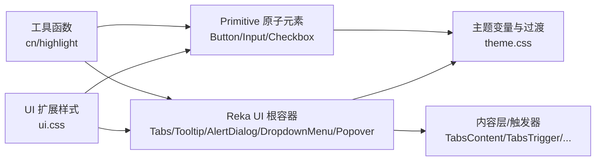

**图示来源**

- [apps/frontend/src/components/ui/tabs/Tabs.vue:1-16](file://apps/frontend/src/components/ui/tabs/Tabs.vue#L1-L16)
- [apps/frontend/src/components/ui/tooltip/Tooltip.vue:1-16](file://apps/frontend/src/components/ui/tooltip/Tooltip.vue#L1-L16)
- [apps/frontend/src/components/ui/alert-dialog/AlertDialog.vue:1-16](file://apps/frontend/src/components/ui/alert-dialog/AlertDialog.vue#L1-L16)
- [apps/frontend/src/components/ui/dropdown-menu/DropdownMenu.vue:1-16](file://apps/frontend/src/components/ui/dropdown-menu/DropdownMenu.vue#L1-L16)
- [apps/frontend/src/components/ui/popover/Popover.vue](file://apps/frontend/src/components/ui/popover/Popover.vue)
- [apps/frontend/src/components/ui/button/Button.vue:1-32](file://apps/frontend/src/components/ui/button/Button.vue#L1-L32)
- [apps/frontend/src/components/ui/input/Input.vue:1-42](file://apps/frontend/src/components/ui/input/Input.vue#L1-L42)
- [apps/frontend/src/components/ui/checkbox/Checkbox.vue:1-34](file://apps/frontend/src/components/ui/checkbox/Checkbox.vue#L1-L34)
- [apps/frontend/src/lib/utils.ts:1-33](file://apps/frontend/src/lib/utils.ts#L1-L33)
- [apps/frontend/src/styles/theme.css:1-170](file://apps/frontend/src/styles/theme.css#L1-L170)
- [apps/frontend/src/styles/ui.css:1-89](file://apps/frontend/src/styles/ui.css#L1-L89)

## 组件详解

### 按钮 Button 与 PrimaryButton

- 设计要点
  - 使用 Reka UI 的 Primitive 作为语义根节点，支持 as/asChild 自定义渲染标签。
  - 通过变体集定义外观族（默认/破坏/描边/次级/幽灵/链接），通过尺寸族定义高度与内边距。
  - 使用 cn 合并变体类与用户自定义 class，确保样式优先级与可覆盖性。
- 关键属性
  - variant：变体族选择。
  - size：尺寸族选择。
  - class：用户自定义扩展类。
  - as/asChild：控制渲染标签与子节点透传。
- 可访问性
  - 由 Primitive 提供基础可访问性基元，结合语义化标签与键盘导航。
- 主题与样式覆盖
  - 变体与尺寸在变体集中统一定义，可通过覆盖变量或自定义类进行扩展。
- 使用场景
  - 表单提交、操作按钮、导航入口、图标按钮等。

**更新** 导入结构现已标准化，通过统一的索引文件导出组件和变体定义，提升了代码组织性。

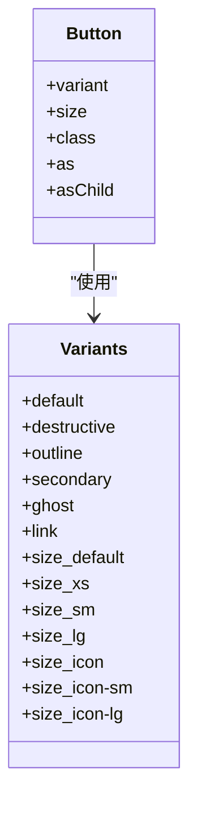

**图示来源**

- [apps/frontend/src/components/ui/button/Button.vue:1-32](file://apps/frontend/src/components/ui/button/Button.vue#L1-L32)
- [apps/frontend/src/components/ui/button/index.ts:1-38](file://apps/frontend/src/components/ui/button/index.ts#L1-L38)

**章节来源**

- [apps/frontend/src/components/ui/button/Button.vue:1-32](file://apps/frontend/src/components/ui/button/Button.vue#L1-L32)
- [apps/frontend/src/components/ui/button/index.ts:1-38](file://apps/frontend/src/components/ui/button/index.ts#L1-L38)

### 输入 Input

- 设计要点
  - 基于 v-model 的受控封装，支持 defaultValue 与被动更新。
  - 自动生成唯一 id 并暴露给外部，便于 label 关联。
  - 透传原生 input 属性，保证与浏览器行为一致。
- 关键属性
  - modelValue/update:modelValue：双向绑定事件。
  - defaultValue：初始值。
  - id/name/class：可选标识与样式扩展。
- 可访问性
  - 自动 id 生成与 v-model 绑定，利于屏幕阅读器识别。
- 主题与样式覆盖
  - 统一边框、圆角、占位符颜色与聚焦环样式，支持通过 class 覆盖。
- 使用场景
  - 文本输入、数字输入、搜索框等。

**更新** 导入结构简化，通过单一索引文件导出组件，减少了导入复杂度。

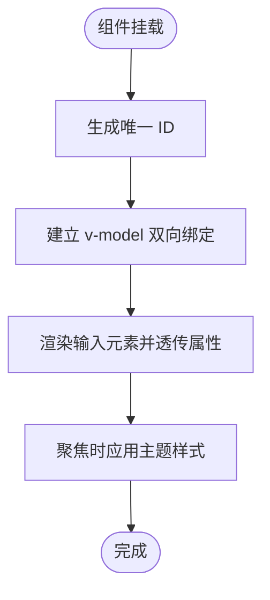

**图示来源**

- [apps/frontend/src/components/ui/input/Input.vue:1-42](file://apps/frontend/src/components/ui/input/Input.vue#L1-L42)

**章节来源**

- [apps/frontend/src/components/ui/input/Input.vue:1-42](file://apps/frontend/src/components/ui/input/Input.vue#L1-L42)
- [apps/frontend/src/components/ui/input/index.ts:1-2](file://apps/frontend/src/components/ui/input/index.ts#L1-L2)

### 复选框 Checkbox

- 设计要点
  - 使用 Reka UI 的 CheckboxRoot 与 CheckboxIndicator，提供可访问性状态与图标指示器。
  - 支持 forwarded props/emits，保证与父容器通信。
- 关键属性
  - 透传 CheckboxRootProps，支持 checked/disabled 等状态。
  - class：用户自定义扩展类。
- 可访问性
  - 数据状态 data-state=checked 与焦点环，符合 WCAG。
- 主题与样式覆盖
  - 统一尺寸、边框、阴影与选中态颜色，支持通过 class 覆盖。
- 使用场景
  - 条款勾选、批量选择、偏好设置等。

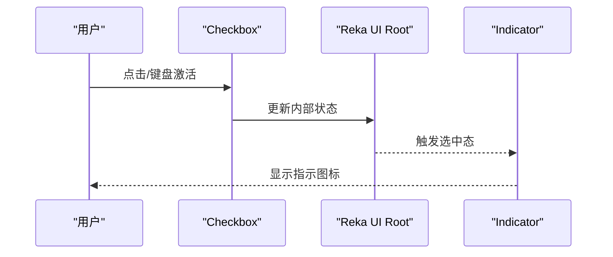

**图示来源**

- [apps/frontend/src/components/ui/checkbox/Checkbox.vue:1-34](file://apps/frontend/src/components/ui/checkbox/Checkbox.vue#L1-L34)

**章节来源**

- [apps/frontend/src/components/ui/checkbox/Checkbox.vue:1-34](file://apps/frontend/src/components/ui/checkbox/Checkbox.vue#L1-L34)
- [apps/frontend/src/components/ui/checkbox/index.ts:1-2](file://apps/frontend/src/components/ui/checkbox/index.ts#L1-L2)

### 下拉菜单 DropdownMenu 与内容层 DropdownMenuContent

- 设计要点
  - 根容器负责状态管理，内容层负责定位、动画与可访问性。
  - 支持 sideOffset、class 等配置，动画通过数据状态驱动。
- 关键属性
  - 根容器：透传 DropdownMenuRootProps。
  - 内容层：sideOffset 默认 4，class 扩展。
- 可访问性
  - 键盘导航、焦点陷阱、关闭机制均遵循 Reka UI 约定。
- 主题与样式覆盖
  - 统一边框、背景、阴影与动画入场/出场效果。
- 使用场景
  - 用户菜单、设置项、操作列表等。

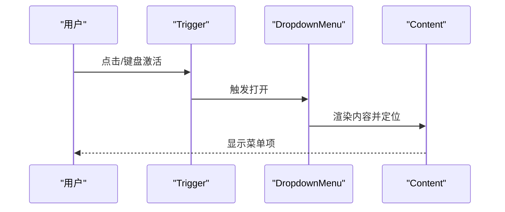

**图示来源**

- [apps/frontend/src/components/ui/dropdown-menu/DropdownMenu.vue:1-16](file://apps/frontend/src/components/ui/dropdown-menu/DropdownMenu.vue#L1-L16)
- [apps/frontend/src/components/ui/dropdown-menu/DropdownMenuContent.vue:1-37](file://apps/frontend/src/components/ui/dropdown-menu/DropdownMenuContent.vue#L1-L37)

**章节来源**

- [apps/frontend/src/components/ui/dropdown-menu/DropdownMenu.vue:1-16](file://apps/frontend/src/components/ui/dropdown-menu/DropdownMenu.vue#L1-L16)
- [apps/frontend/src/components/ui/dropdown-menu/DropdownMenuContent.vue:1-37](file://apps/frontend/src/components/ui/dropdown-menu/DropdownMenuContent.vue#L1-L37)
- [apps/frontend/src/components/ui/dropdown-menu/index.ts:1-17](file://apps/frontend/src/components/ui/dropdown-menu/index.ts#L1-L17)

### 标签页 Tabs

- 设计要点
  - 根容器负责当前激活标签与切换逻辑，子项负责渲染与交互。
  - 与内容区配合，实现懒加载与无障碍切换。
- 关键属性
  - 透传 TabsRootProps，支持 value/onUpdate:value 等。
- 可访问性
  - 键盘导航、ARIA 标签与内容关联。
- 使用场景
  - 分组内容切换、多面板视图。

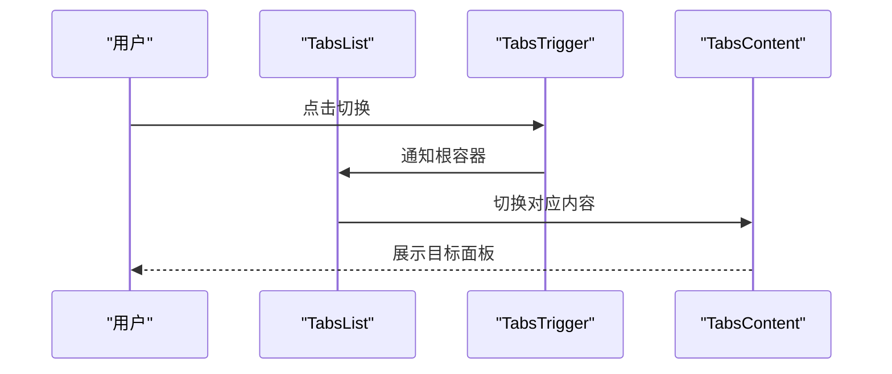

**图示来源**

- [apps/frontend/src/components/ui/tabs/Tabs.vue:1-16](file://apps/frontend/src/components/ui/tabs/Tabs.vue#L1-L16)

**章节来源**

- [apps/frontend/src/components/ui/tabs/Tabs.vue:1-16](file://apps/frontend/src/components/ui/tabs/Tabs.vue#L1-L16)
- [apps/frontend/src/components/ui/tabs/index.ts:1-5](file://apps/frontend/src/components/ui/tabs/index.ts#L1-L5)

### 提示框 Tooltip

- 设计要点
  - 根容器负责延迟、位置与可见性，触发器与内容分离。
- 关键属性
  - 透传 TooltipRootProps，支持触发方式与延迟配置。
- 可访问性
  - 屏幕阅读器可读取内容，键盘可访问。
- 使用场景
  - 图标提示、快捷键说明、简短帮助信息。

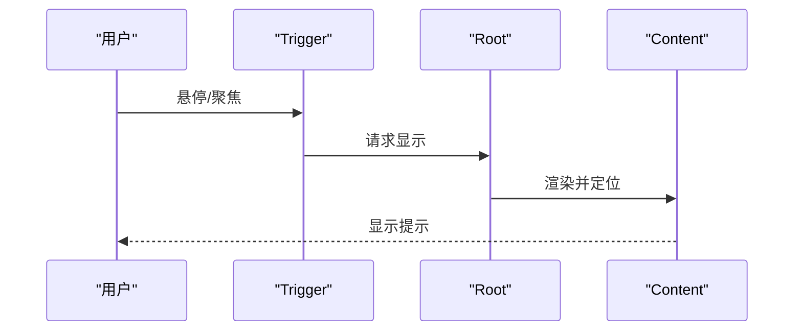

**图示来源**

- [apps/frontend/src/components/ui/tooltip/Tooltip.vue:1-16](file://apps/frontend/src/components/ui/tooltip/Tooltip.vue#L1-L16)

**章节来源**

- [apps/frontend/src/components/ui/tooltip/Tooltip.vue:1-16](file://apps/frontend/src/components/ui/tooltip/Tooltip.vue#L1-L16)
- [apps/frontend/src/components/ui/tooltip/index.ts:1-5](file://apps/frontend/src/components/ui/tooltip/index.ts#L1-L5)

### 对话框 AlertDialog

- 设计要点
  - 根容器负责遮罩、焦点管理与键盘交互，内容层承载确认/取消等操作。
- 关键属性
  - 透传 AlertDialogProps，支持触发器与内容组合。
- 可访问性
  - 焦点陷阱、ESC 关闭、模态交互。
- 使用场景
  - 删除确认、危险操作提示、重要决策。

**更新** 导入结构已标准化，通过统一的索引文件导出所有相关组件，提升了模块化程度。

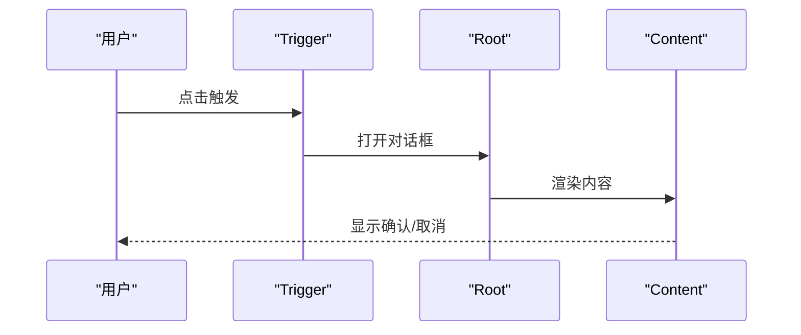

**图示来源**

- [apps/frontend/src/components/ui/alert-dialog/AlertDialog.vue:1-16](file://apps/frontend/src/components/ui/alert-dialog/AlertDialog.vue#L1-L16)

**章节来源**

- [apps/frontend/src/components/ui/alert-dialog/AlertDialog.vue:1-16](file://apps/frontend/src/components/ui/alert-dialog/AlertDialog.vue#L1-L16)
- [apps/frontend/src/components/ui/alert-dialog/index.ts:1-10](file://apps/frontend/src/components/ui/alert-dialog/index.ts#L1-L10)

### 卡片 Card 与卡片系列

- 设计要点
  - 卡片容器统一边框、圆角与阴影；头部/标题/描述/内容/底部提供结构化布局。
- 关键属性
  - class：用户自定义扩展类。
- 主题与样式覆盖
  - 统一卡片背景与前景色，支持暗色主题自动适配。
- 使用场景
  - 信息区块、统计卡片、设置面板、对话容器。

**更新** 卡片组件的索引文件已重构，通过统一导出机制提升了组件的一致性。

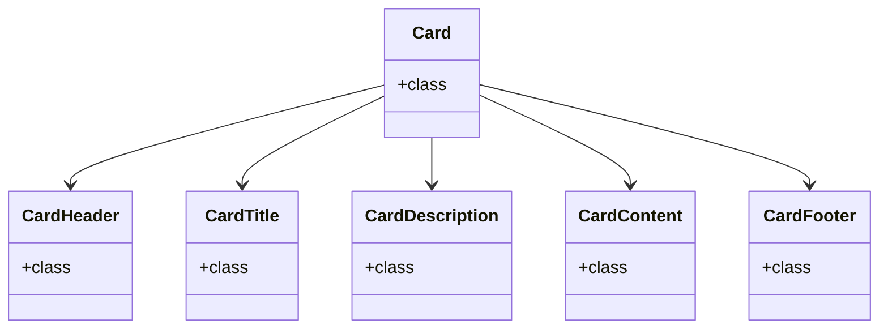

**图示来源**

- [apps/frontend/src/components/ui/card/Card.vue:1-15](file://apps/frontend/src/components/ui/card/Card.vue#L1-L15)
- [apps/frontend/src/components/ui/card/CardHeader.vue](file://apps/frontend/src/components/ui/card/CardHeader.vue)
- [apps/frontend/src/components/ui/card/CardTitle.vue](file://apps/frontend/src/components/ui/card/CardTitle.vue)
- [apps/frontend/src/components/ui/card/CardDescription.vue](file://apps/frontend/src/components/ui/card/CardDescription.vue)
- [apps/frontend/src/components/ui/card/CardContent.vue](file://apps/frontend/src/components/ui/card/CardContent.vue)
- [apps/frontend/src/components/ui/card/CardFooter.vue](file://apps/frontend/src/components/ui/card/CardFooter.vue)

**章节来源**

- [apps/frontend/src/components/ui/card/Card.vue:1-15](file://apps/frontend/src/components/ui/card/Card.vue#L1-L15)
- [apps/frontend/src/components/ui/card/CardHeader.vue](file://apps/frontend/src/components/ui/card/CardHeader.vue)
- [apps/frontend/src/components/ui/card/CardTitle.vue](file://apps/frontend/src/components/ui/card/CardTitle.vue)
- [apps/frontend/src/components/ui/card/CardDescription.vue](file://apps/frontend/src/components/ui/card/CardDescription.vue)
- [apps/frontend/src/components/ui/card/CardContent.vue](file://apps/frontend/src/components/ui/card/CardContent.vue)
- [apps/frontend/src/components/ui/card/CardFooter.vue](file://apps/frontend/src/components/ui/card/CardFooter.vue)
- [apps/frontend/src/components/ui/card/index.ts:1-7](file://apps/frontend/src/components/ui/card/index.ts#L1-L7)

### 其他常用组件

- 徽章 Badge：语义化标记，支持主题色与尺寸。
- 分隔线 Separator：内容分组与层级分隔。
- 弹出层 Popover：触发器与内容层，常用于设置面板。
- 滚动区域 ScrollArea/ScrollBar：可定制滚动条与滚动行为。
- ToastProvider：全局通知提供者，配合业务逻辑进行消息提示。

**更新** 徽章组件的导入结构已标准化，通过统一的索引文件导出变体定义和组件，提升了代码组织性。

**章节来源**

- [apps/frontend/src/components/ui/badge/Badge.vue:1-18](file://apps/frontend/src/components/ui/badge/Badge.vue#L1-L18)
- [apps/frontend/src/components/ui/badge/index.ts:1-26](file://apps/frontend/src/components/ui/badge/index.ts#L1-L26)
- [apps/frontend/src/components/ui/separator/Separator.vue:1-16](file://apps/frontend/src/components/ui/separator/Separator.vue#L1-L16)
- [apps/frontend/src/components/ui/separator/index.ts:1-2](file://apps/frontend/src/components/ui/separator/index.ts#L1-L2)
- [apps/frontend/src/components/ui/popover/Popover.vue](file://apps/frontend/src/components/ui/popover/Popover.vue)
- [apps/frontend/src/components/ui/popover/PopoverContent.vue](file://apps/frontend/src/components/ui/popover/PopoverContent.vue)
- [apps/frontend/src/components/ui/popover/PopoverTrigger.vue](file://apps/frontend/src/components/ui/popover/PopoverTrigger.vue)
- [apps/frontend/src/components/ui/popover/index.ts:1-4](file://apps/frontend/src/components/ui/popover/index.ts#L1-L4)
- [apps/frontend/src/components/ui/scroll-area/ScrollArea.vue](file://apps/frontend/src/components/ui/scroll-area/ScrollArea.vue)
- [apps/frontend/src/components/ui/scroll-area/ScrollBar.vue](file://apps/frontend/src/components/ui/scroll-area/ScrollBar.vue)
- [apps/frontend/src/components/ui/scroll-area/index.ts:1-3](file://apps/frontend/src/components/ui/scroll-area/index.ts#L1-L3)
- [apps/frontend/src/components/ui/ToastProvider.vue](file://apps/frontend/src/components/ui/ToastProvider.vue)

## 依赖关系分析

- 组件到 Reka UI
  - 大多数复合组件（Tabs/Tooltip/AlertDialog/DropdownMenu/Popover）直接使用 Reka UI 的根容器与转发 props/emits，确保可访问性与状态一致性。
- 组件到样式系统
  - 主题变量集中在 theme.css，通过 CSS 变量驱动明/暗主题；ui.css 提供特定场景的扩展样式；cn 工具统一类名合并。
- 工具函数
  - utils.ts 提供 cn 与高亮工具，贯穿所有组件的类名与文本处理。

**更新** 组件导入结构现已标准化，通过统一的索引文件组织，提升了代码的可维护性和一致性。

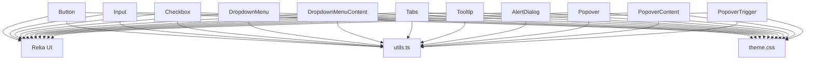

**图示来源**

- [apps/frontend/src/components/ui/button/Button.vue:1-32](file://apps/frontend/src/components/ui/button/Button.vue#L1-L32)
- [apps/frontend/src/components/ui/input/Input.vue:1-42](file://apps/frontend/src/components/ui/input/Input.vue#L1-L42)
- [apps/frontend/src/components/ui/checkbox/Checkbox.vue:1-34](file://apps/frontend/src/components/ui/checkbox/Checkbox.vue#L1-L34)
- [apps/frontend/src/components/ui/dropdown-menu/DropdownMenu.vue:1-16](file://apps/frontend/src/components/ui/dropdown-menu/DropdownMenu.vue#L1-L16)
- [apps/frontend/src/components/ui/dropdown-menu/DropdownMenuContent.vue:1-37](file://apps/frontend/src/components/ui/dropdown-menu/DropdownMenuContent.vue#L1-L37)
- [apps/frontend/src/components/ui/tabs/Tabs.vue:1-16](file://apps/frontend/src/components/ui/tabs/Tabs.vue#L1-L16)
- [apps/frontend/src/components/ui/tooltip/Tooltip.vue:1-16](file://apps/frontend/src/components/ui/tooltip/Tooltip.vue#L1-L16)
- [apps/frontend/src/components/ui/alert-dialog/AlertDialog.vue:1-16](file://apps/frontend/src/components/ui/alert-dialog/AlertDialog.vue#L1-L16)
- [apps/frontend/src/components/ui/popover/Popover.vue](file://apps/frontend/src/components/ui/popover/Popover.vue)
- [apps/frontend/src/components/ui/popover/PopoverContent.vue](file://apps/frontend/src/components/ui/popover/PopoverContent.vue)
- [apps/frontend/src/components/ui/popover/PopoverTrigger.vue](file://apps/frontend/src/components/ui/popover/PopoverTrigger.vue)
- [apps/frontend/src/lib/utils.ts:1-33](file://apps/frontend/src/lib/utils.ts#L1-L33)
- [apps/frontend/src/styles/theme.css:1-170](file://apps/frontend/src/styles/theme.css#L1-L170)

**章节来源**

- [apps/frontend/src/components/ui/button/Button.vue:1-32](file://apps/frontend/src/components/ui/button/Button.vue#L1-L32)
- [apps/frontend/src/components/ui/button/index.ts:1-38](file://apps/frontend/src/components/ui/button/index.ts#L1-L38)
- [apps/frontend/src/components/ui/input/Input.vue:1-42](file://apps/frontend/src/components/ui/input/Input.vue#L1-L42)
- [apps/frontend/src/components/ui/input/index.ts:1-2](file://apps/frontend/src/components/ui/input/index.ts#L1-L2)
- [apps/frontend/src/components/ui/checkbox/Checkbox.vue:1-34](file://apps/frontend/src/components/ui/checkbox/Checkbox.vue#L1-L34)
- [apps/frontend/src/components/ui/checkbox/index.ts:1-2](file://apps/frontend/src/components/ui/checkbox/index.ts#L1-L2)
- [apps/frontend/src/components/ui/dropdown-menu/DropdownMenu.vue:1-16](file://apps/frontend/src/components/ui/dropdown-menu/DropdownMenu.vue#L1-L16)
- [apps/frontend/src/components/ui/dropdown-menu/DropdownMenuContent.vue:1-37](file://apps/frontend/src/components/ui/dropdown-menu/DropdownMenuContent.vue#L1-L37)
- [apps/frontend/src/components/ui/dropdown-menu/index.ts:1-17](file://apps/frontend/src/components/ui/dropdown-menu/index.ts#L1-L17)
- [apps/frontend/src/components/ui/tabs/Tabs.vue:1-16](file://apps/frontend/src/components/ui/tabs/Tabs.vue#L1-L16)
- [apps/frontend/src/components/ui/tabs/index.ts:1-5](file://apps/frontend/src/components/ui/tabs/index.ts#L1-L5)
- [apps/frontend/src/components/ui/tooltip/Tooltip.vue:1-16](file://apps/frontend/src/components/ui/tooltip/Tooltip.vue#L1-L16)
- [apps/frontend/src/components/ui/tooltip/index.ts:1-5](file://apps/frontend/src/components/ui/tooltip/index.ts#L1-L5)
- [apps/frontend/src/components/ui/alert-dialog/AlertDialog.vue:1-16](file://apps/frontend/src/components/ui/alert-dialog/AlertDialog.vue#L1-L16)
- [apps/frontend/src/components/ui/alert-dialog/index.ts:1-10](file://apps/frontend/src/components/ui/alert-dialog/index.ts#L1-L10)
- [apps/frontend/src/components/ui/popover/Popover.vue](file://apps/frontend/src/components/ui/popover/Popover.vue)
- [apps/frontend/src/components/ui/popover/PopoverContent.vue](file://apps/frontend/src/components/ui/popover/PopoverContent.vue)
- [apps/frontend/src/components/ui/popover/PopoverTrigger.vue](file://apps/frontend/src/components/ui/popover/PopoverTrigger.vue)
- [apps/frontend/src/components/ui/popover/index.ts:1-4](file://apps/frontend/src/components/ui/popover/index.ts#L1-L4)
- [apps/frontend/src/lib/utils.ts:1-33](file://apps/frontend/src/lib/utils.ts#L1-L33)
- [apps/frontend/src/styles/theme.css:1-170](file://apps/frontend/src/styles/theme.css#L1-L170)

## 性能考量

- 动画与过渡
  - 主题层定义了全局过渡时间曲线，减少不必要的重绘与回流；对特定场景（如进度条、图表）提供无过渡类以提升性能。
- GPU 加速
  - 提供 scroll-smooth-gpu 类，启用 backface-visibility、perspective 与 will-change，改善滚动与动画性能。
- 样式合并
  - 使用 cn 合并类名，避免重复与冲突，减少运行时样式计算。
- 组件懒加载
  - 内容层（如 TabsContent、DropdownMenuContent、PopoverContent）按需渲染，降低初始负载。
- 事件节流
  - 输入与滚动等高频事件建议配合防抖/节流策略，避免过度重渲染。

**更新** 标准化的导入结构有助于提升构建时的模块解析效率，减少了不必要的依赖分析开销。

**章节来源**

- [apps/frontend/src/styles/theme.css:143-169](file://apps/frontend/src/styles/theme.css#L143-L169)
- [apps/frontend/src/lib/utils.ts:1-7](file://apps/frontend/src/lib/utils.ts#L1-L7)

## 故障排查指南

- 可访问性问题
  - 若出现键盘无法聚焦或屏幕阅读器无法读取，请检查根容器是否正确转发 props/emits，以及是否设置了 aria-\* 属性。
- 样式冲突
  - 当组件样式被覆盖时，优先检查用户传入的 class 是否与变体类冲突；必要时使用更具体的类或 CSS 变量覆盖。
- 动画异常
  - 若动画不生效，检查数据状态类（如 data-state=open）是否正确传递，以及动画类是否被覆盖。
- 暗色主题不生效
  - 确认 CSS 变量是否在 :root 与 .dark 中正确声明，且未被局部样式覆盖。
- 输入焦点问题
  - 确保 id 生成与 v-model 绑定正常，避免 label 与输入未关联导致的可访问性问题。

**更新** 标准化的导入结构减少了因路径错误或模块解析问题导致的故障，提升了开发体验。

**章节来源**

- [apps/frontend/src/components/ui/checkbox/Checkbox.vue:1-34](file://apps/frontend/src/components/ui/checkbox/Checkbox.vue#L1-L34)
- [apps/frontend/src/components/ui/dropdown-menu/DropdownMenuContent.vue:1-37](file://apps/frontend/src/components/ui/dropdown-menu/DropdownMenuContent.vue#L1-L37)
- [apps/frontend/src/components/ui/input/Input.vue:1-42](file://apps/frontend/src/components/ui/input/Input.vue#L1-L42)
- [apps/frontend/src/styles/theme.css:1-170](file://apps/frontend/src/styles/theme.css#L1-L170)

## 结论

本 UI 组件库以 Reka UI 为核心，结合 Tailwind 与主题变量，实现了高可访问性、强一致性与良好扩展性的组件体系。通过容器-内容与触发器-内容的分层设计，组件在功能、样式与交互上保持解耦，便于组合与维护。

**更新** 本次组件导入顺序标准化改进进一步提升了代码组织性和可维护性，通过统一的索引文件结构，开发者可以更清晰地理解和使用组件库，同时减少了模块导入的复杂度和潜在的错误。

建议在实际使用中遵循可访问性规范、合理利用主题变量与工具函数，并关注性能细节以获得更佳体验。

## 附录

- 最佳实践
  - 优先使用语义化标签与可访问性属性。
  - 使用变体集与尺寸族统一风格，避免散落样式。
  - 通过 class 与 CSS 变量进行主题定制，保持一致性。
  - 对高频交互组件（输入、滚动）实施性能优化。
  - 利用标准化的导入结构，提升开发效率和代码质量。
- 无障碍访问指南
  - 确保键盘可达、焦点可见、屏幕阅读器可读。
  - 正确使用 aria-\* 属性与 role。
  - 提供足够的对比度与可点击区域。
- 性能优化建议
  - 合理使用懒加载与虚拟化。
  - 减少不必要的重渲染与样式计算。
  - 利用 GPU 加速与过渡优化。
  - 优化模块导入结构，提升构建性能。
