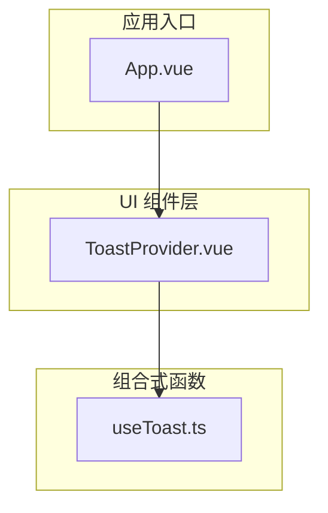
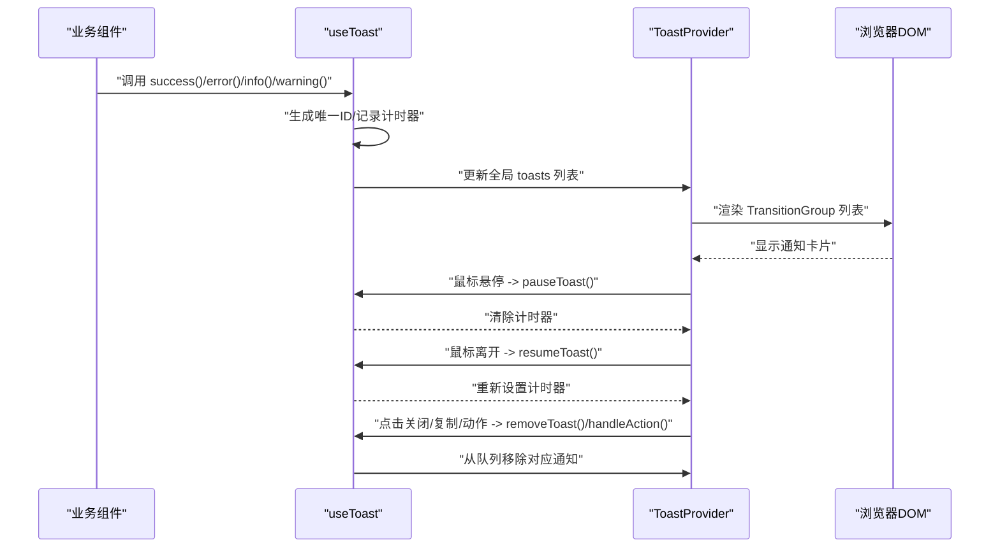
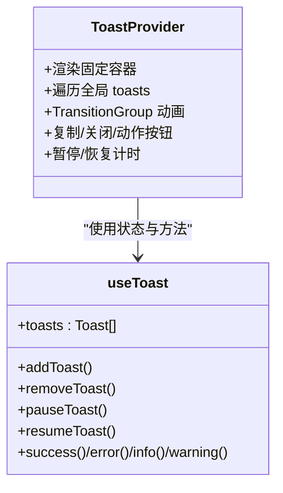
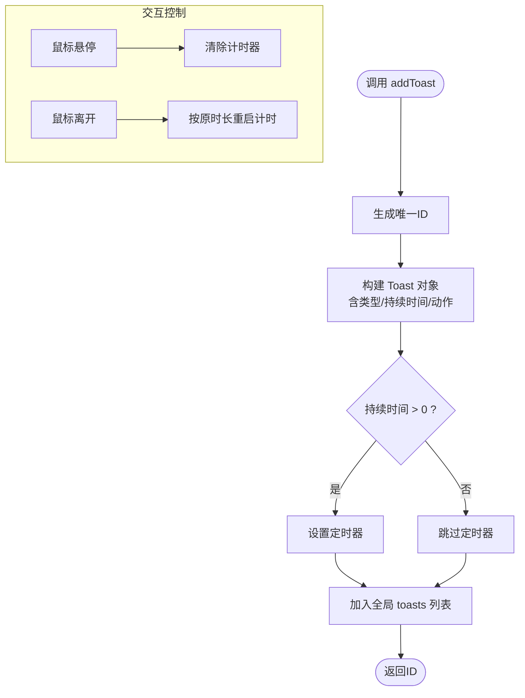
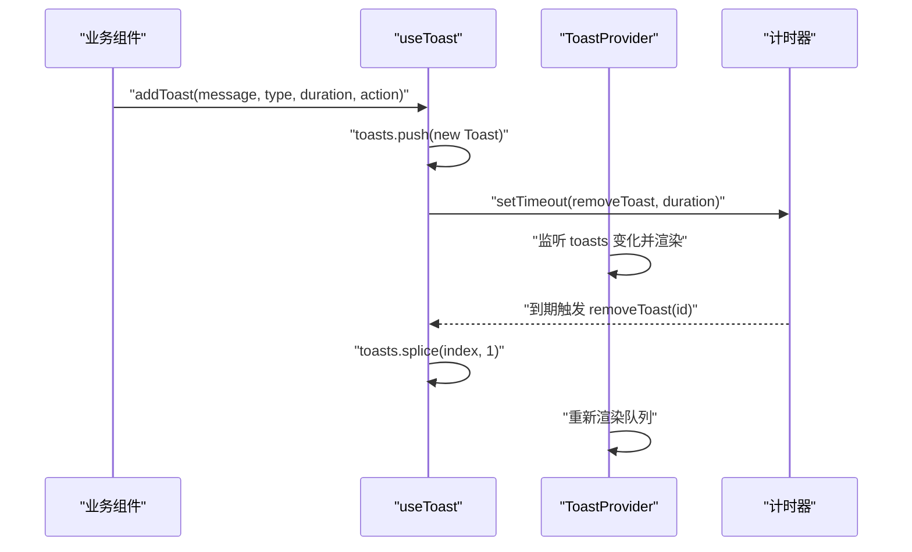
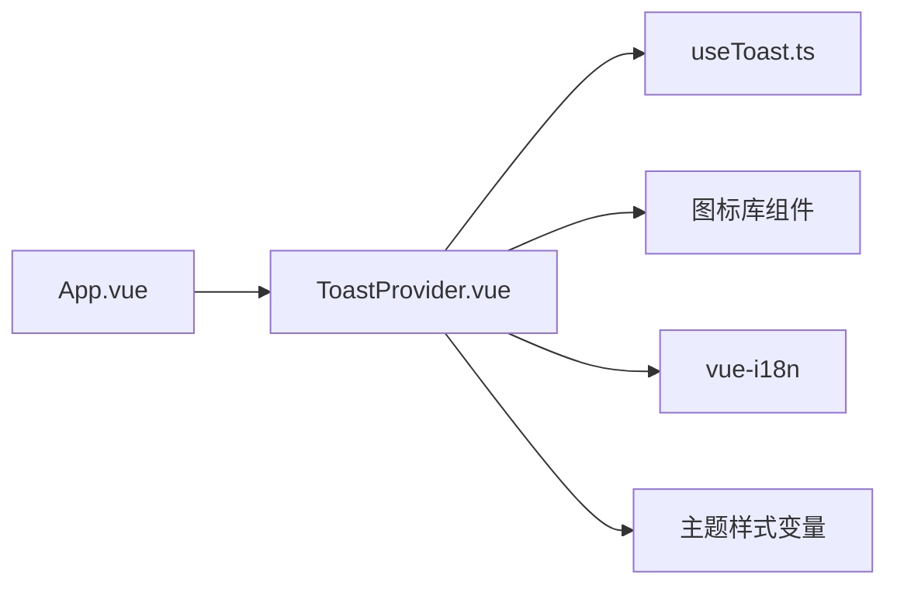

# 全局通知组件

<cite>
**本文引用的文件**
- [ToastProvider.vue](file://apps/frontend/src/components/ui/ToastProvider.vue)
- [useToast.ts](file://apps/frontend/src/composables/useToast.ts)
- [App.vue](file://apps/frontend/src/App.vue)
- [TodoHeader.vue](file://apps/frontend/src/features/todo/components/TodoHeader.vue)
- [TodoItem.vue](file://apps/frontend/src/features/todo/components/TodoItem.vue)
- [common.ts（英文）](file://apps/frontend/src/i18n/locales/en-US/common.ts)
- [theme.css](file://apps/frontend/src/styles/theme.css)
- [animations.css](file://apps/frontend/src/styles/animations.css)
</cite>

## 目录
1. [简介](#简介)
2. [项目结构](#项目结构)
3. [核心组件](#核心组件)
4. [架构总览](#架构总览)
5. [组件详细分析](#组件详细分析)
6. [依赖关系分析](#依赖关系分析)
7. [性能考量](#性能考量)
8. [故障排查指南](#故障排查指南)
9. [结论](#结论)
10. [附录](#附录)

## 简介
本文件围绕 Lumina Todo 前端的全局通知组件 ToastProvider 进行系统化文档化，重点解释其全局通知管理机制、通知队列处理逻辑、通知的创建/显示/隐藏/销毁流程，以及位置配置、持续时间与动画效果。同时涵盖上下文传递、状态管理、错误边界处理、样式定制与主题适配、可访问性支持，并给出在系统消息、操作反馈、错误提示等场景的应用示例与设计最佳实践。

## 项目结构
ToastProvider 作为全局 UI 组件，位于前端组件库目录中，通过组合式函数 useToast 提供状态与方法；在应用根组件中挂载，确保全站范围内可触发与展示通知。

**图示来源**
- [App.vue:53](file://apps/frontend/src/App.vue#L53)
- [ToastProvider.vue:1-109](file://apps/frontend/src/components/ui/ToastProvider.vue#L1-L109)
- [useToast.ts:17-86](file://apps/frontend/src/composables/useToast.ts#L17-L86)

**章节来源**
- [App.vue:53](file://apps/frontend/src/App.vue#L53)
- [ToastProvider.vue:1-109](file://apps/frontend/src/components/ui/ToastProvider.vue#L1-L109)
- [useToast.ts:17-86](file://apps/frontend/src/composables/useToast.ts#L17-L86)

## 核心组件
- ToastProvider：全局通知容器，负责渲染通知列表、动画过渡、交互按钮（复制、关闭、动作按钮）、暂停/恢复计时器。
- useToast：全局通知状态与方法集合，包括添加、删除、暂停、恢复通知，以及便捷的成功/失败/信息/警告方法。

关键职责与特性
- 通知队列：基于响应式数组维护多个通知实例，按进入顺序渲染。
- 计时与自动消失：每条通知可配置持续时间，到期自动移除；悬停时暂停计时，离开后恢复。
- 交互能力：支持“复制消息”、“执行动作回调并关闭”、“手动关闭”。
- 视觉风格：根据类型（成功/错误/信息/警告）切换图标、边框、阴影与文本颜色，使用模糊背景与圆角卡片提升可读性。
- 国际化：复制按钮标题来自 i18n 键值，便于多语言环境统一文案。

**章节来源**
- [ToastProvider.vue:17-45](file://apps/frontend/src/components/ui/ToastProvider.vue#L17-L45)
- [ToastProvider.vue:48-108](file://apps/frontend/src/components/ui/ToastProvider.vue#L48-L108)
- [useToast.ts:17-86](file://apps/frontend/src/composables/useToast.ts#L17-L86)

## 架构总览
ToastProvider 通过 useToast 获取全局状态与方法，渲染在页面固定位置，使用 Vue TransitionGroup 实现进入/离开动画；通知类型驱动样式与图标，支持用户交互与无障碍标题提示。

**图示来源**
- [useToast.ts:18-69](file://apps/frontend/src/composables/useToast.ts#L18-L69)
- [ToastProvider.vue:10-15](file://apps/frontend/src/components/ui/ToastProvider.vue#L10-L15)
- [ToastProvider.vue:65-66](file://apps/frontend/src/components/ui/ToastProvider.vue#L65-L66)
- [ToastProvider.vue:100-103](file://apps/frontend/src/components/ui/ToastProvider.vue#L100-L103)

## 组件详细分析

### ToastProvider 组件分析
- 渲染容器：固定定位在页面顶部中央，使用左右居中与负偏移实现水平居中，垂直上边距固定，层级高于页面内容。
- 列表渲染：遍历全局 toasts，每个通知为独立卡片，包含图标区、消息文本、操作按钮区。
- 动画过渡：使用 TransitionGroup 定义进入/离开动画类，实现从上方滑入、缩放与透明度变化。
- 交互逻辑：
  - 复制：点击复制按钮将消息写入剪贴板，短暂高亮表示成功。
  - 关闭：点击关闭按钮立即移除通知。
  - 动作：若提供 action，则显示可点击按钮，点击后执行回调并移除通知。
  - 暂停/恢复：鼠标悬停暂停计时器，离开后恢复计时。
- 样式与主题：
  - 类型样式：根据通知类型动态绑定边框、背景、阴影与文本颜色，使用主题变量保证明暗模式一致性。
  - 模糊背景与圆角：提升可读性与现代感。
  - 可访问性：复制按钮提供标题提示，符合无障碍键盘可达性。

**图示来源**
- [ToastProvider.vue:48-108](file://apps/frontend/src/components/ui/ToastProvider.vue#L48-L108)
- [useToast.ts:17-86](file://apps/frontend/src/composables/useToast.ts#L17-L86)

**章节来源**
- [ToastProvider.vue:48-108](file://apps/frontend/src/components/ui/ToastProvider.vue#L48-L108)
- [ToastProvider.vue:17-45](file://apps/frontend/src/components/ui/ToastProvider.vue#L17-L45)

### useToast 组合式函数分析
- 数据结构：Toast 接口定义了唯一 id、消息文本、类型、持续时间、计时器句柄与可选动作。
- 添加通知：生成随机 id，按类型与持续时间创建通知对象；当持续时间大于 0 时设置定时器，到期自动移除。
- 删除通知：根据 id 查找并移除，同时清理计时器。
- 暂停/恢复：在用户悬停时清除计时器，在离开时按原时长重新计时（当前实现未计算剩余时间，采用简单恢复策略）。
- 便捷方法：提供 success/error/info/warning 快捷调用，统一参数签名。

**图示来源**
- [useToast.ts:28-45](file://apps/frontend/src/composables/useToast.ts#L28-L45)
- [useToast.ts:50-69](file://apps/frontend/src/composables/useToast.ts#L50-L69)

**章节来源**
- [useToast.ts:3-13](file://apps/frontend/src/composables/useToast.ts#L3-L13)
- [useToast.ts:17-86](file://apps/frontend/src/composables/useToast.ts#L17-L86)

### 通知生命周期与队列处理
- 创建：业务组件调用 useToast 的便捷方法或 addToast，生成唯一 id 并入队。
- 显示：ToastProvider 监听全局 toasts 变化，通过 v-for 渲染卡片。
- 自动消失：定时器到期触发 removeToast，从队列移除。
- 交互关闭：用户点击关闭按钮或动作按钮，立即移除对应通知。
- 队列管理：toasts 为响应式数组，支持多条通知并存；新通知插入末尾，旧通知自然退出。

**图示来源**
- [useToast.ts:28-45](file://apps/frontend/src/composables/useToast.ts#L28-L45)
- [useToast.ts:18-26](file://apps/frontend/src/composables/useToast.ts#L18-L26)
- [ToastProvider.vue:60-67](file://apps/frontend/src/components/ui/ToastProvider.vue#L60-L67)

**章节来源**
- [useToast.ts:18-26](file://apps/frontend/src/composables/useToast.ts#L18-L26)
- [ToastProvider.vue:60-67](file://apps/frontend/src/components/ui/ToastProvider.vue#L60-L67)

### 位置、持续时间与动画
- 位置：固定定位在视口顶部中央，使用左右平移实现水平居中，垂直上边距固定，确保不遮挡页面主要内容。
- 持续时间：默认 3000ms；可通过参数覆盖；duration <= 0 表示不自动消失（需手动关闭）。
- 动画：进入/离开使用自定义缓动曲线与位移、缩放、透明度组合，提供顺滑的视觉反馈；卡片在悬停时轻微放大并增强阴影，提升交互感知。

**章节来源**
- [ToastProvider.vue:49-59](file://apps/frontend/src/components/ui/ToastProvider.vue#L49-L59)
- [useToast.ts:28-45](file://apps/frontend/src/composables/useToast.ts#L28-L45)

### 上下文传递、状态管理与错误边界
- 上下文传递：在应用根组件中引入 ToastProvider，使其在整个应用树内可用；业务组件通过组合式函数获取 useToast 实例。
- 状态管理：全局 toasts 由 useToast 维护，组件仅负责渲染与交互；状态变更通过响应式系统驱动 UI 更新。
- 错误边界：复制通知到剪贴板时进行异常捕获并记录日志，防止异常冒泡影响整体体验；关闭与动作按钮均具备容错处理。

**章节来源**
- [App.vue:53](file://apps/frontend/src/App.vue#L53)
- [ToastProvider.vue:32-45](file://apps/frontend/src/components/ui/ToastProvider.vue#L32-L45)
- [ToastProvider.vue:100-103](file://apps/frontend/src/components/ui/ToastProvider.vue#L100-L103)

### 样式定制、主题适配与可访问性
- 样式定制：类型样式通过映射表统一管理，支持按类型切换边框、背景、阴影与文本颜色；卡片采用圆角与模糊背景，提升可读性。
- 主题适配：主题变量集中于主题样式文件，ToastProvider 使用语义化颜色变量，确保明暗模式一致的视觉表现。
- 可访问性：复制按钮提供标题提示，键盘可达；按钮透明度在悬停时可见，满足不同用户需求。

**章节来源**
- [ToastProvider.vue:24-30](file://apps/frontend/src/components/ui/ToastProvider.vue#L24-L30)
- [theme.css:1-170](file://apps/frontend/src/styles/theme.css#L1-L170)
- [ToastProvider.vue:91-97](file://apps/frontend/src/components/ui/ToastProvider.vue#L91-L97)

### 应用示例与最佳实践
- 系统消息：在用户操作成功时显示成功通知，例如上传头像成功/失败场景，使用 success/error 方法并传入国际化文案。
- 操作反馈：在执行耗时操作前显示信息通知，完成后根据结果选择成功或错误通知；必要时提供“撤销”动作按钮。
- 错误提示：网络请求失败或内部异常时显示错误通知，建议包含简短描述与重试引导。
- 最佳实践：
  - 合理设置持续时间：重要提示建议较长持续时间，避免快速消失导致用户错过。
  - 动作按钮明确语义：标签简洁清晰，回调中应包含必要的撤销或重试逻辑。
  - 避免频繁弹出：批量操作合并为一条通知，减少对用户的打扰。
  - 国际化与可访问性：文案使用 i18n 键值，按钮提供标题提示，确保多语言与无障碍支持。

**章节来源**
- [TodoHeader.vue:77-81](file://apps/frontend/src/features/todo/components/TodoHeader.vue#L77-L81)
- [TodoItem.vue:127-134](file://apps/frontend/src/features/todo/components/TodoItem.vue#L127-L134)
- [common.ts:88-94](file://apps/frontend/src/i18n/locales/en-US/common.ts#L88-L94)

## 依赖关系分析
- 组件依赖：ToastProvider 依赖 useToast 提供的状态与方法；在 App.vue 中被引入并挂载。
- 外部依赖：使用图标库组件（用于不同类型的通知图标），使用 i18n 提供复制按钮标题；动画效果由内置类名控制。
- 潜在耦合点：通知类型与样式映射、图标映射、主题变量；建议集中管理以降低维护成本。

**图示来源**
- [App.vue:53](file://apps/frontend/src/App.vue#L53)
- [ToastProvider.vue:1-8](file://apps/frontend/src/components/ui/ToastProvider.vue#L1-L8)
- [useToast.ts:17-86](file://apps/frontend/src/composables/useToast.ts#L17-L86)
- [theme.css:1-170](file://apps/frontend/src/styles/theme.css#L1-L170)

**章节来源**
- [App.vue:53](file://apps/frontend/src/App.vue#L53)
- [ToastProvider.vue:1-8](file://apps/frontend/src/components/ui/ToastProvider.vue#L1-L8)
- [useToast.ts:17-86](file://apps/frontend/src/composables/useToast.ts#L17-L86)

## 性能考量
- 渲染优化：使用 TransitionGroup 与 v-for 渲染通知列表，建议控制同时显示数量，避免过多通知造成布局抖动。
- 计时器管理：每条通知独立计时器，注意在组件卸载或路由切换时清理残留计时器，避免内存泄漏。
- 动画性能：动画类使用 transform 与 opacity，尽量避免触发布局与重绘；在低端设备上可考虑禁用复杂动画。
- 复制操作：复制到剪贴板为异步操作，建议限制重复触发频率，避免并发冲突。

[本节为通用指导，无需特定文件引用]

## 故障排查指南
- 通知不消失：检查持续时间参数是否为正数；确认计时器是否被正确清除与重启。
- 悬停无效：确认事件绑定是否生效；检查是否存在阻止事件冒泡的元素。
- 复制失败：检查浏览器权限与剪贴板 API 支持；查看控制台错误日志。
- 样式异常：核对主题变量是否正确加载；确认类型样式映射是否匹配通知类型。

**章节来源**
- [useToast.ts:50-69](file://apps/frontend/src/composables/useToast.ts#L50-L69)
- [ToastProvider.vue:32-45](file://apps/frontend/src/components/ui/ToastProvider.vue#L32-L45)
- [ToastProvider.vue:65-66](file://apps/frontend/src/components/ui/ToastProvider.vue#L65-L66)

## 结论
ToastProvider 通过 useToast 提供了简洁而强大的全局通知能力：稳定的队列管理、灵活的交互与动画、完善的主题与可访问性支持。结合业务场景合理使用通知，能够显著提升用户体验与反馈效率。建议在团队内统一通知规范，确保文案、样式与交互的一致性。

[本节为总结性内容，无需特定文件引用]

## 附录
- 国际化键值参考：复制按钮标题使用 i18n 键值，确保多语言环境下文案一致。
- 动画资源：动画类名集中于样式文件，便于统一管理与扩展。

**章节来源**
- [common.ts:20](file://apps/frontend/src/i18n/locales/en-US/common.ts#L20)
- [animations.css:1-159](file://apps/frontend/src/styles/animations.css#L1-L159)