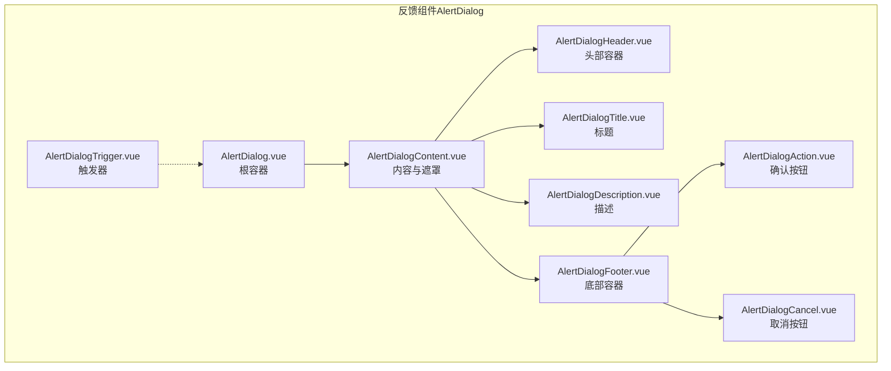
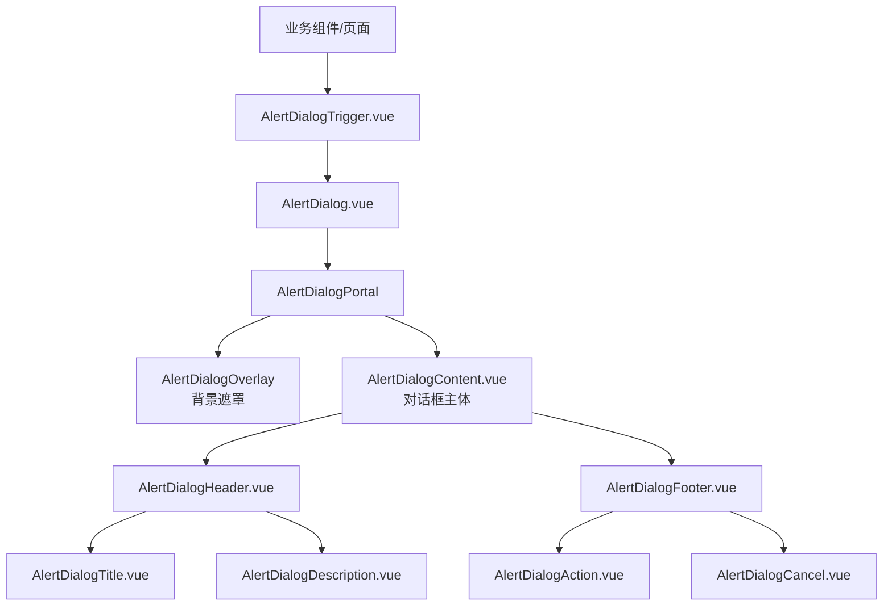
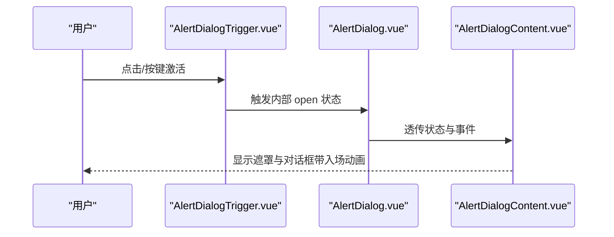
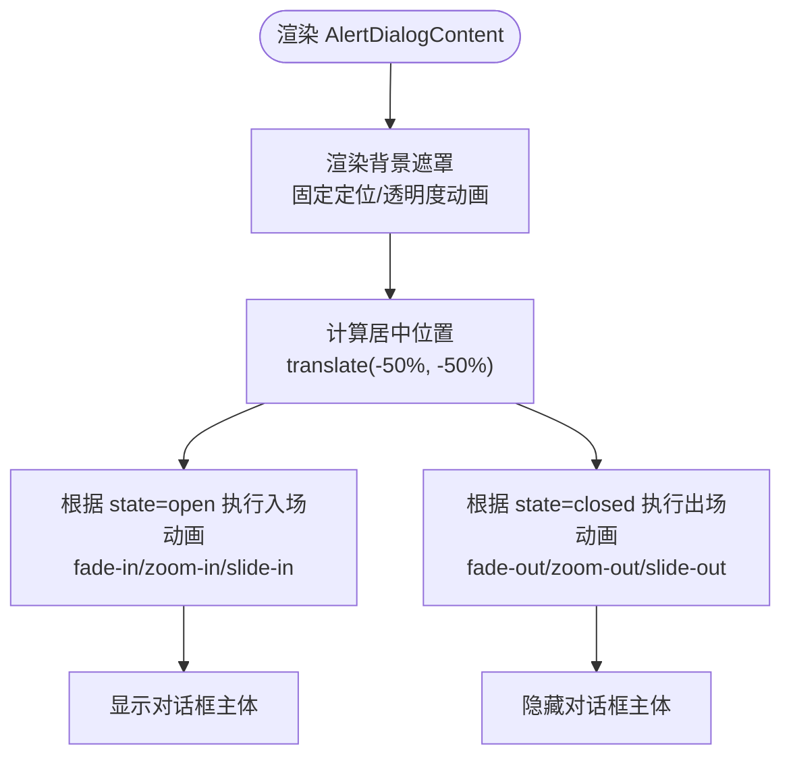
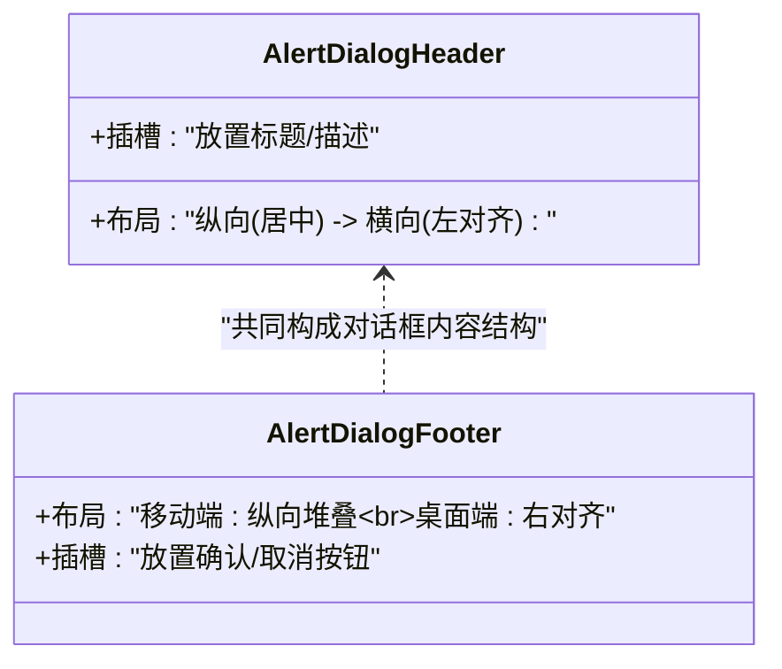
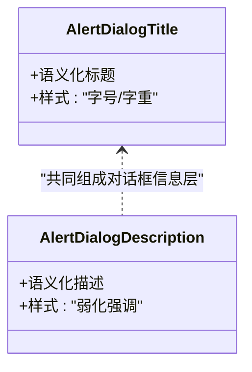
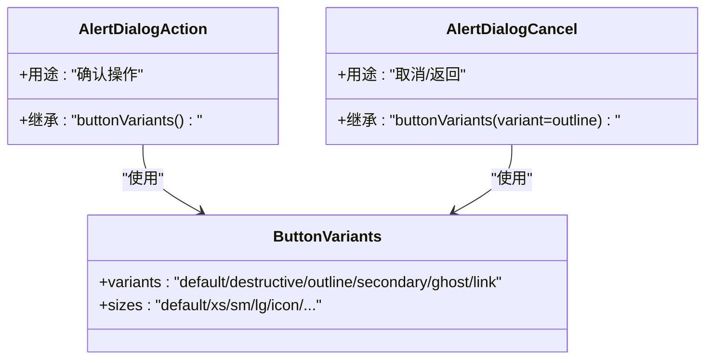
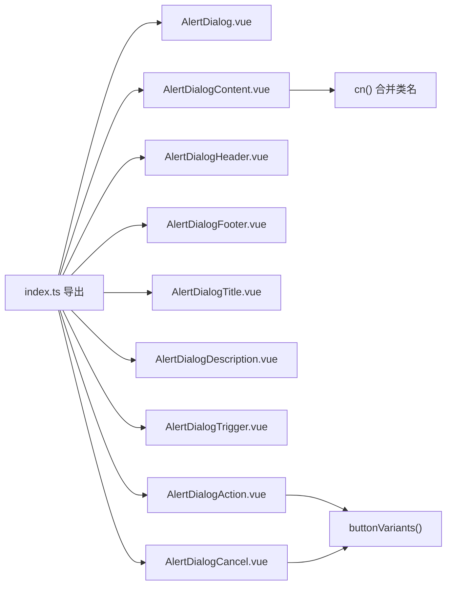

# 反馈组件

<cite>
**本文引用的文件**
- [AlertDialog.vue](file://apps/frontend/src/components/ui/alert-dialog/AlertDialog.vue)
- [AlertDialogContent.vue](file://apps/frontend/src/components/ui/alert-dialog/AlertDialogContent.vue)
- [AlertDialogHeader.vue](file://apps/frontend/src/components/ui/alert-dialog/AlertDialogHeader.vue)
- [AlertDialogFooter.vue](file://apps/frontend/src/components/ui/alert-dialog/AlertDialogFooter.vue)
- [AlertDialogTitle.vue](file://apps/frontend/src/components/ui/alert-dialog/AlertDialogTitle.vue)
- [AlertDialogDescription.vue](file://apps/frontend/src/components/ui/alert-dialog/AlertDialogDescription.vue)
- [AlertDialogTrigger.vue](file://apps/frontend/src/components/ui/alert-dialog/AlertDialogTrigger.vue)
- [AlertDialogAction.vue](file://apps/frontend/src/components/ui/alert-dialog/AlertDialogAction.vue)
- [AlertDialogCancel.vue](file://apps/frontend/src/components/ui/alert-dialog/AlertDialogCancel.vue)
- [index.ts](file://apps/frontend/src/components/ui/alert-dialog/index.ts)
- [button/index.ts](file://apps/frontend/src/components/ui/button/index.ts)
- [utils.ts](file://apps/frontend/src/lib/utils.ts)
</cite>

## 目录
1. [简介](#简介)
2. [项目结构](#项目结构)
3. [核心组件](#核心组件)
4. [架构总览](#架构总览)
5. [详细组件分析](#详细组件分析)
6. [依赖关系分析](#依赖关系分析)
7. [性能考量](#性能考量)
8. [故障排查指南](#故障排查指南)
9. [结论](#结论)
10. [附录](#附录)

## 简介
本章节面向 Lumina Todo 前端的反馈 UI 组件，系统性梳理 AlertDialog 系列组件的设计理念与交互模式。文档重点覆盖：
- 模态对话框的打开/关闭流程与状态驱动
- 确认/取消流程与键盘快捷键支持策略
- 生命周期管理、焦点管理与自动关闭机制
- 可访问性设计、屏幕阅读器支持与 ARIA 角色配置
- 动画效果、背景遮罩与内容布局
- 在“确认删除”“设置修改”“错误提示”等典型场景的应用与体验优化建议

## 项目结构
AlertDialog 组件位于前端工程的 UI 组件库目录下，采用分层模块导出的方式组织，便于按需引入与组合使用。

图示来源
- [AlertDialog.vue:1-16](file://apps/frontend/src/components/ui/alert-dialog/AlertDialog.vue#L1-L16)
- [AlertDialogContent.vue:1-39](file://apps/frontend/src/components/ui/alert-dialog/AlertDialogContent.vue#L1-L39)
- [AlertDialogHeader.vue:1-15](file://apps/frontend/src/components/ui/alert-dialog/AlertDialogHeader.vue#L1-L15)
- [AlertDialogFooter.vue:1-15](file://apps/frontend/src/components/ui/alert-dialog/AlertDialogFooter.vue#L1-L15)
- [AlertDialogTitle.vue:1-18](file://apps/frontend/src/components/ui/alert-dialog/AlertDialogTitle.vue#L1-L18)
- [AlertDialogDescription.vue:1-21](file://apps/frontend/src/components/ui/alert-dialog/AlertDialogDescription.vue#L1-L21)
- [AlertDialogTrigger.vue:1-13](file://apps/frontend/src/components/ui/alert-dialog/AlertDialogTrigger.vue#L1-L13)
- [AlertDialogAction.vue:1-19](file://apps/frontend/src/components/ui/alert-dialog/AlertDialogAction.vue#L1-L19)
- [AlertDialogCancel.vue:1-22](file://apps/frontend/src/components/ui/alert-dialog/AlertDialogCancel.vue#L1-L22)

章节来源
- [index.ts:1-10](file://apps/frontend/src/components/ui/alert-dialog/index.ts#L1-L10)

## 核心组件
- AlertDialog：作为根容器，负责将属性与事件透传给底层库的根节点，确保外部调用者通过统一接口控制模态状态。
- AlertDialogContent：承载对话框主体，内置 Portal、Overlay 与 Content，实现“弹出层”“背景遮罩”“居中定位”与“动画入场/出场”。
- AlertDialogHeader/Footer：用于组织标题、描述与操作按钮的布局容器。
- AlertDialogTitle/Description：语义化标题与描述，配合无障碍角色与屏幕阅读器。
- AlertDialogTrigger：触发模态显示的入口元素。
- AlertDialogAction/Cancel：确认与取消按钮，复用统一的按钮变体系统，保证风格一致与可访问性。

章节来源
- [AlertDialog.vue:1-16](file://apps/frontend/src/components/ui/alert-dialog/AlertDialog.vue#L1-L16)
- [AlertDialogContent.vue:1-39](file://apps/frontend/src/components/ui/alert-dialog/AlertDialogContent.vue#L1-L39)
- [AlertDialogHeader.vue:1-15](file://apps/frontend/src/components/ui/alert-dialog/AlertDialogHeader.vue#L1-L15)
- [AlertDialogFooter.vue:1-15](file://apps/frontend/src/components/ui/alert-dialog/AlertDialogFooter.vue#L1-L15)
- [AlertDialogTitle.vue:1-18](file://apps/frontend/src/components/ui/alert-dialog/AlertDialogTitle.vue#L1-L18)
- [AlertDialogDescription.vue:1-21](file://apps/frontend/src/components/ui/alert-dialog/AlertDialogDescription.vue#L1-L21)
- [AlertDialogTrigger.vue:1-13](file://apps/frontend/src/components/ui/alert-dialog/AlertDialogTrigger.vue#L1-L13)
- [AlertDialogAction.vue:1-19](file://apps/frontend/src/components/ui/alert-dialog/AlertDialogAction.vue#L1-L19)
- [AlertDialogCancel.vue:1-22](file://apps/frontend/src/components/ui/alert-dialog/AlertDialogCancel.vue#L1-L22)

## 架构总览
AlertDialog 的整体架构基于“容器-内容-触发器”的分层设计，并通过底层 UI 库提供的 Root/Content/Overlay/Portal 等能力实现模态行为与动画过渡。

图示来源
- [AlertDialog.vue:1-16](file://apps/frontend/src/components/ui/alert-dialog/AlertDialog.vue#L1-L16)
- [AlertDialogContent.vue:21-38](file://apps/frontend/src/components/ui/alert-dialog/AlertDialogContent.vue#L21-L38)
- [AlertDialogTrigger.vue:1-13](file://apps/frontend/src/components/ui/alert-dialog/AlertDialogTrigger.vue#L1-L13)
- [AlertDialogHeader.vue:1-15](file://apps/frontend/src/components/ui/alert-dialog/AlertDialogHeader.vue#L1-L15)
- [AlertDialogFooter.vue:1-15](file://apps/frontend/src/components/ui/alert-dialog/AlertDialogFooter.vue#L1-L15)
- [AlertDialogTitle.vue:1-18](file://apps/frontend/src/components/ui/alert-dialog/AlertDialogTitle.vue#L1-L18)
- [AlertDialogDescription.vue:1-21](file://apps/frontend/src/components/ui/alert-dialog/AlertDialogDescription.vue#L1-L21)
- [AlertDialogAction.vue:1-19](file://apps/frontend/src/components/ui/alert-dialog/AlertDialogAction.vue#L1-L19)
- [AlertDialogCancel.vue:1-22](file://apps/frontend/src/components/ui/alert-dialog/AlertDialogCancel.vue#L1-L22)

## 详细组件分析

### 对话框容器与状态流转
- 容器职责：接收外部传入的属性与事件，通过属性转发机制传递到底层库的根节点，确保外部对 open/close 状态的可控。
- 状态驱动：通过底层库的状态数据属性（如 state=open/closed）驱动动画与可见性，实现平滑的进入/退出动画。

图示来源
- [AlertDialog.vue:1-16](file://apps/frontend/src/components/ui/alert-dialog/AlertDialog.vue#L1-L16)
- [AlertDialogTrigger.vue:1-13](file://apps/frontend/src/components/ui/alert-dialog/AlertDialogTrigger.vue#L1-L13)
- [AlertDialogContent.vue:21-38](file://apps/frontend/src/components/ui/alert-dialog/AlertDialogContent.vue#L21-L38)

章节来源
- [AlertDialog.vue:1-16](file://apps/frontend/src/components/ui/alert-dialog/AlertDialog.vue#L1-L16)

### 内容布局、遮罩与动画
- 遮罩与定位：使用固定定位与居中变换，确保对话框始终位于视口中心；遮罩支持透明度与淡入淡出动画。
- 动画策略：通过 state 属性驱动多类动画（淡入/淡出、缩放、滑入/滑出），提升视觉连贯性。
- 响应式布局：在小屏与桌面端分别采用不同的定位与圆角策略，保证良好可读性与可用性。

图示来源
- [AlertDialogContent.vue:21-38](file://apps/frontend/src/components/ui/alert-dialog/AlertDialogContent.vue#L21-L38)

章节来源
- [AlertDialogContent.vue:1-39](file://apps/frontend/src/components/ui/alert-dialog/AlertDialogContent.vue#L1-L39)

### 头部与底部布局
- 头部容器：支持纵向与横向布局切换，适配不同信息密度下的标题与描述排版。
- 底部容器：默认移动端纵向堆叠、桌面端横向右对齐，按钮间距与对齐方式符合平台习惯。

图示来源
- [AlertDialogHeader.vue:1-15](file://apps/frontend/src/components/ui/alert-dialog/AlertDialogHeader.vue#L1-L15)
- [AlertDialogFooter.vue:1-15](file://apps/frontend/src/components/ui/alert-dialog/AlertDialogFooter.vue#L1-L15)

章节来源
- [AlertDialogHeader.vue:1-15](file://apps/frontend/src/components/ui/alert-dialog/AlertDialogHeader.vue#L1-L15)
- [AlertDialogFooter.vue:1-15](file://apps/frontend/src/components/ui/alert-dialog/AlertDialogFooter.vue#L1-L15)

### 标题与描述
- 标题：语义化标题，字号与字重明确，适合屏幕阅读器识别。
- 描述：辅助性文本，颜色与字号遵循“弱化强调”的设计原则，避免干扰主标题。

图示来源
- [AlertDialogTitle.vue:1-18](file://apps/frontend/src/components/ui/alert-dialog/AlertDialogTitle.vue#L1-L18)
- [AlertDialogDescription.vue:1-21](file://apps/frontend/src/components/ui/alert-dialog/AlertDialogDescription.vue#L1-L21)

章节来源
- [AlertDialogTitle.vue:1-18](file://apps/frontend/src/components/ui/alert-dialog/AlertDialogTitle.vue#L1-L18)
- [AlertDialogDescription.vue:1-21](file://apps/frontend/src/components/ui/alert-dialog/AlertDialogDescription.vue#L1-L21)

### 操作按钮与样式系统
- 确认按钮：继承统一的按钮变体系统，确保视觉一致性与可访问性。
- 取消按钮：采用“描边”变体并提供移动端间距修正，提升点击区域与可读性。
- 样式合并：通过通用工具函数合并 Tailwind 类，支持外部扩展样式。

图示来源
- [AlertDialogAction.vue:1-19](file://apps/frontend/src/components/ui/alert-dialog/AlertDialogAction.vue#L1-L19)
- [AlertDialogCancel.vue:1-22](file://apps/frontend/src/components/ui/alert-dialog/AlertDialogCancel.vue#L1-L22)
- [button/index.ts:1-38](file://apps/frontend/src/components/ui/button/index.ts#L1-L38)

章节来源
- [AlertDialogAction.vue:1-19](file://apps/frontend/src/components/ui/alert-dialog/AlertDialogAction.vue#L1-L19)
- [AlertDialogCancel.vue:1-22](file://apps/frontend/src/components/ui/alert-dialog/AlertDialogCancel.vue#L1-L22)
- [button/index.ts:1-38](file://apps/frontend/src/components/ui/button/index.ts#L1-L38)
- [utils.ts:1-33](file://apps/frontend/src/lib/utils.ts#L1-L33)

### 生命周期、焦点管理与自动关闭
- 生命周期：由触发器控制 open 状态，内容组件监听状态变化执行动画与可见性切换。
- 焦点管理：建议在打开时将焦点移至确认或取消按钮之一，关闭时恢复到触发元素，以提升键盘可达性。
- 自动关闭：通常在确认/取消后自动关闭；若存在异步流程，应在回调完成后关闭，避免状态不一致。

章节来源
- [AlertDialog.vue:1-16](file://apps/frontend/src/components/ui/alert-dialog/AlertDialog.vue#L1-L16)
- [AlertDialogContent.vue:21-38](file://apps/frontend/src/components/ui/alert-dialog/AlertDialogContent.vue#L21-L38)
- [AlertDialogTrigger.vue:1-13](file://apps/frontend/src/components/ui/alert-dialog/AlertDialogTrigger.vue#L1-L13)

### 键盘快捷键支持
- Enter/Space：激活触发器打开对话框。
- Esc：关闭对话框（需确保遮罩外点击与 Esc 均可关闭）。
- Tab/Shift+Tab：在按钮间循环聚焦，保持焦点在模态内。
- 方向键：在复杂选项中支持上下导航（如列表选择）。

章节来源
- [AlertDialogTrigger.vue:1-13](file://apps/frontend/src/components/ui/alert-dialog/AlertDialogTrigger.vue#L1-L13)
- [AlertDialogContent.vue:21-38](file://apps/frontend/src/components/ui/alert-dialog/AlertDialogContent.vue#L21-L38)

### 可访问性设计与 ARIA 角色
- 角色与属性：对话框主体应具备对话框角色与 aria-modal，标题与描述分别映射到合适的语义标签。
- 屏幕阅读器：确保标题与描述被正确朗读；确认/取消按钮具备清晰的可读名称。
- 焦点陷阱：打开时锁定焦点于模态内，关闭时释放焦点并回到触发元素。

章节来源
- [AlertDialogContent.vue:21-38](file://apps/frontend/src/components/ui/alert-dialog/AlertDialogContent.vue#L21-L38)
- [AlertDialogTitle.vue:1-18](file://apps/frontend/src/components/ui/alert-dialog/AlertDialogTitle.vue#L1-L18)
- [AlertDialogDescription.vue:1-21](file://apps/frontend/src/components/ui/alert-dialog/AlertDialogDescription.vue#L1-L21)

### 典型应用场景与体验优化
- 确认删除
  - 结构：标题简明指出操作；描述说明后果；底部左右分栏，取消在左，确认在右。
  - 优化：确认按钮使用破坏性变体；提供二次确认或延迟关闭以降低误触风险。
- 设置修改
  - 结构：标题说明变更范围；描述列出影响项；底部确认/取消。
  - 优化：在确认前校验输入；异步保存时显示加载状态；失败时给出明确错误提示。
- 错误提示
  - 结构：标题说明问题；描述解释原因与解决步骤；仅保留“确定”按钮。
  - 优化：错误消息简洁明确；提供“复制错误码/日志”的辅助操作。

## 依赖关系分析
- 组件导出：通过集中导出文件统一暴露各子组件，便于按需引入与版本管理。
- 样式依赖：按钮变体与类名合并工具来自 UI 组件库与通用工具函数，确保一致的视觉与交互体验。
- 动画与定位：依赖底层 UI 库的状态属性与动画类，实现开合动画与居中定位。

图示来源
- [index.ts:1-10](file://apps/frontend/src/components/ui/alert-dialog/index.ts#L1-L10)
- [AlertDialogAction.vue:1-19](file://apps/frontend/src/components/ui/alert-dialog/AlertDialogAction.vue#L1-L19)
- [AlertDialogCancel.vue:1-22](file://apps/frontend/src/components/ui/alert-dialog/AlertDialogCancel.vue#L1-L22)
- [AlertDialogContent.vue:21-38](file://apps/frontend/src/components/ui/alert-dialog/AlertDialogContent.vue#L21-L38)
- [button/index.ts:1-38](file://apps/frontend/src/components/ui/button/index.ts#L1-L38)
- [utils.ts:1-33](file://apps/frontend/src/lib/utils.ts#L1-L33)

章节来源
- [index.ts:1-10](file://apps/frontend/src/components/ui/alert-dialog/index.ts#L1-L10)
- [button/index.ts:1-38](file://apps/frontend/src/components/ui/button/index.ts#L1-L38)
- [utils.ts:1-33](file://apps/frontend/src/lib/utils.ts#L1-L33)

## 性能考量
- 渲染成本：对话框内容在打开时才挂载，关闭时卸载，减少常驻 DOM 开销。
- 动画帧率：动画类基于 CSS 过渡，尽量避免在动画期间进行昂贵的 JS 计算。
- 事件绑定：仅在必要时绑定键盘与点击事件，避免全局监听造成性能损耗。

## 故障排查指南
- 对话框无法关闭
  - 检查触发器是否正确更新 open 状态；确认 Esc/遮罩点击事件是否生效。
- 焦点未正确捕获
  - 确保打开时将焦点移至可交互元素；关闭时恢复到触发元素。
- 动画异常
  - 检查 state 属性是否随 open/close 切换；确认动画类拼接无冲突。
- 样式错位
  - 检查类名合并逻辑与响应式断点；确认未被外部样式覆盖。

章节来源
- [AlertDialog.vue:1-16](file://apps/frontend/src/components/ui/alert-dialog/AlertDialog.vue#L1-L16)
- [AlertDialogContent.vue:21-38](file://apps/frontend/src/components/ui/alert-dialog/AlertDialogContent.vue#L21-L38)
- [AlertDialogTrigger.vue:1-13](file://apps/frontend/src/components/ui/alert-dialog/AlertDialogTrigger.vue#L1-L13)

## 结论
AlertDialog 系列组件通过清晰的分层设计与底层 UI 库的能力，提供了可组合、可访问、可定制的模态反馈方案。在实际业务中，建议结合场景规范确认/取消流程、强化键盘可达性与屏幕阅读器支持，并通过一致的样式系统与动画策略提升用户体验。

## 附录
- 组件清单与职责
  - AlertDialog：根容器，负责状态与事件透传
  - AlertDialogContent：遮罩与对话框主体，含动画与定位
  - AlertDialogHeader/Footer：信息与操作区布局
  - AlertDialogTitle/Description：语义化标题与描述
  - AlertDialogTrigger：触发器
  - AlertDialogAction/Cancel：确认与取消按钮

章节来源
- [index.ts:1-10](file://apps/frontend/src/components/ui/alert-dialog/index.ts#L1-L10)