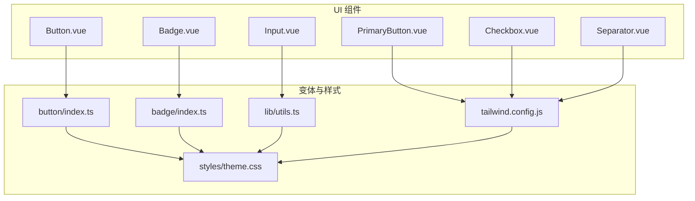
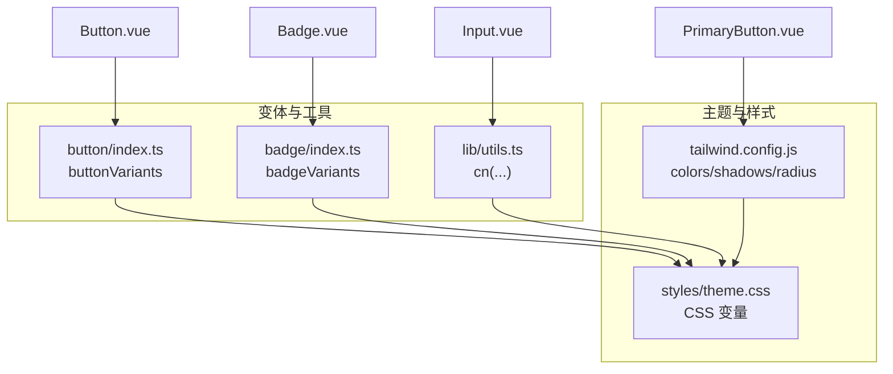
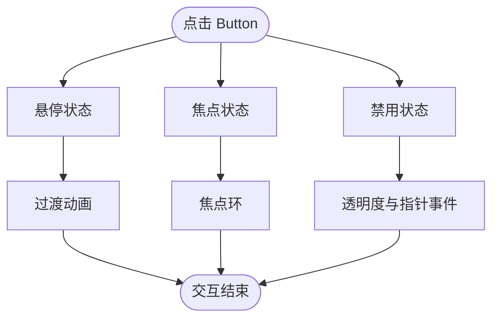
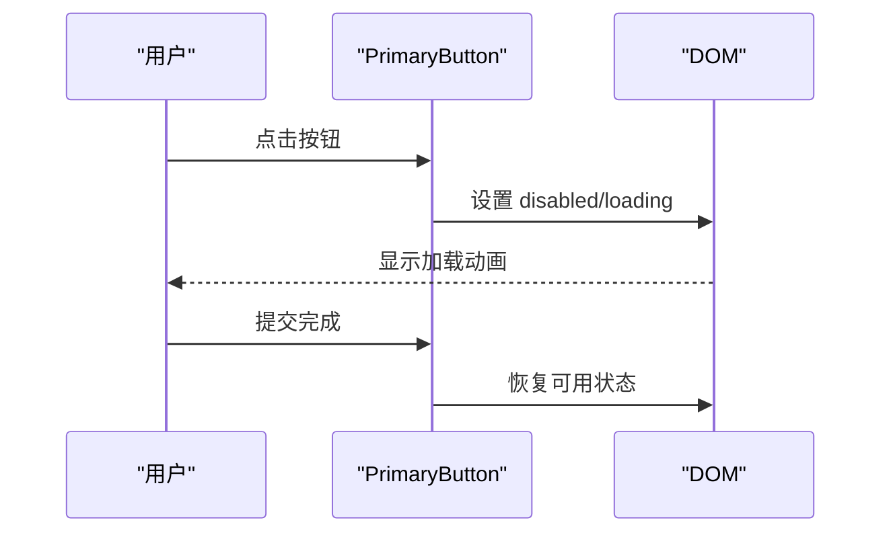
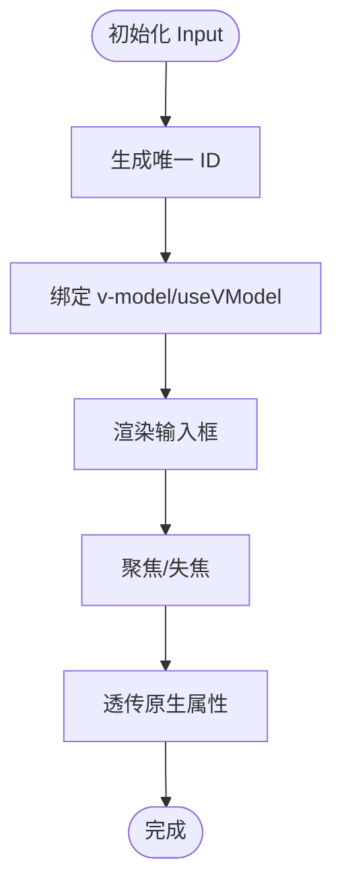
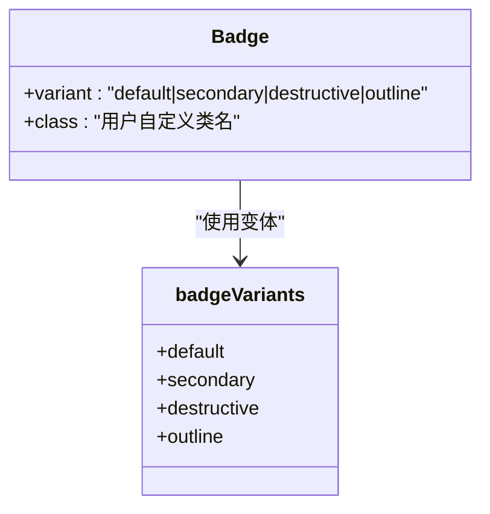
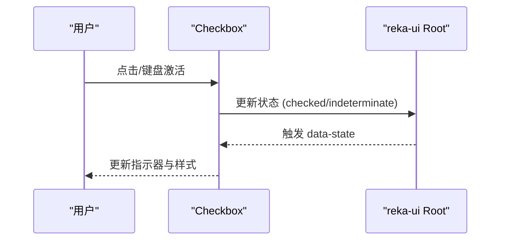
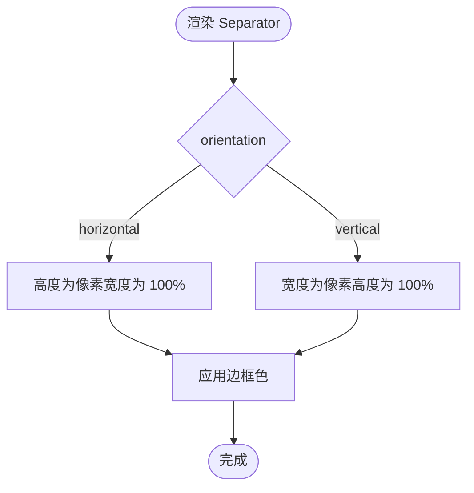
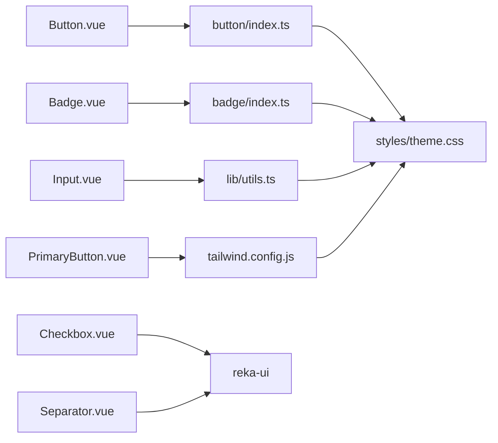

# 基础组件

<cite>
**本文引用的文件**
- [apps/frontend/src/components/ui/button/Button.vue](file://apps/frontend/src/components/ui/button/Button.vue)
- [apps/frontend/src/components/ui/button/PrimaryButton.vue](file://apps/frontend/src/components/ui/button/PrimaryButton.vue)
- [apps/frontend/src/components/ui/button/index.ts](file://apps/frontend/src/components/ui/button/index.ts)
- [apps/frontend/src/components/ui/input/Input.vue](file://apps/frontend/src/components/ui/input/Input.vue)
- [apps/frontend/src/components/ui/badge/Badge.vue](file://apps/frontend/src/components/ui/badge/Badge.vue)
- [apps/frontend/src/components/ui/badge/index.ts](file://apps/frontend/src/components/ui/badge/index.ts)
- [apps/frontend/src/components/ui/checkbox/Checkbox.vue](file://apps/frontend/src/components/ui/checkbox/Checkbox.vue)
- [apps/frontend/src/components/ui/separator/Separator.vue](file://apps/frontend/src/components/ui/separator/Separator.vue)
- [apps/frontend/src/lib/utils.ts](file://apps/frontend/src/lib/utils.ts)
- [apps/frontend/src/styles/theme.css](file://apps/frontend/src/styles/theme.css)
- [apps/frontend/tailwind.config.js](file://apps/frontend/tailwind.config.js)
- [apps/frontend/tests/components/ui/button/Button.spec.ts](file://apps/frontend/tests/components/ui/button/Button.spec.ts)
</cite>

## 目录
1. [简介](#简介)
2. [项目结构](#项目结构)
3. [核心组件](#核心组件)
4. [架构总览](#架构总览)
5. [组件详解](#组件详解)
6. [依赖关系分析](#依赖关系分析)
7. [性能考量](#性能考量)
8. [故障排查指南](#故障排查指南)
9. [结论](#结论)
10. [附录](#附录)

## 简介
本章节面向 Lumina Todo 前端应用的基础 UI 组件，聚焦按钮（Button、PrimaryButton）、输入框（Input）、徽章（Badge）、复选框（Checkbox）、分隔符（Separator）等核心组件。文档从设计理念、实现细节、属性与样式变体、事件与可访问性、主题定制、CSS 变量覆盖、Tailwind 类名扩展、响应式行为、动画与交互状态等方面进行全面阐述，并提供最佳实践、组合模式与常见问题解决方案。

## 项目结构
基础组件位于前端应用的 UI 组件目录下，采用按功能模块划分的组织方式，便于复用与维护。各组件通过统一的工具函数与主题样式体系协同工作，确保一致的外观与行为。

图示来源
- [apps/frontend/src/components/ui/button/Button.vue:1-32](file://apps/frontend/src/components/ui/button/Button.vue#L1-L32)
- [apps/frontend/src/components/ui/button/PrimaryButton.vue:1-62](file://apps/frontend/src/components/ui/button/PrimaryButton.vue#L1-L62)
- [apps/frontend/src/components/ui/input/Input.vue:1-42](file://apps/frontend/src/components/ui/input/Input.vue#L1-L42)
- [apps/frontend/src/components/ui/badge/Badge.vue:1-18](file://apps/frontend/src/components/ui/badge/Badge.vue#L1-L18)
- [apps/frontend/src/components/ui/checkbox/Checkbox.vue:1-34](file://apps/frontend/src/components/ui/checkbox/Checkbox.vue#L1-L34)
- [apps/frontend/src/components/ui/separator/Separator.vue:1-29](file://apps/frontend/src/components/ui/separator/Separator.vue#L1-L29)
- [apps/frontend/src/components/ui/button/index.ts:1-38](file://apps/frontend/src/components/ui/button/index.ts#L1-L38)
- [apps/frontend/src/components/ui/badge/index.ts:1-26](file://apps/frontend/src/components/ui/badge/index.ts#L1-L26)
- [apps/frontend/src/lib/utils.ts:1-33](file://apps/frontend/src/lib/utils.ts#L1-L33)
- [apps/frontend/src/styles/theme.css:1-170](file://apps/frontend/src/styles/theme.css#L1-L170)
- [apps/frontend/tailwind.config.js:1-303](file://apps/frontend/tailwind.config.js#L1-L303)

章节来源
- [apps/frontend/src/components/ui/button/Button.vue:1-32](file://apps/frontend/src/components/ui/button/Button.vue#L1-L32)
- [apps/frontend/src/components/ui/button/PrimaryButton.vue:1-62](file://apps/frontend/src/components/ui/button/PrimaryButton.vue#L1-L62)
- [apps/frontend/src/components/ui/input/Input.vue:1-42](file://apps/frontend/src/components/ui/input/Input.vue#L1-L42)
- [apps/frontend/src/components/ui/badge/Badge.vue:1-18](file://apps/frontend/src/components/ui/badge/Badge.vue#L1-L18)
- [apps/frontend/src/components/ui/checkbox/Checkbox.vue:1-34](file://apps/frontend/src/components/ui/checkbox/Checkbox.vue#L1-L34)
- [apps/frontend/src/components/ui/separator/Separator.vue:1-29](file://apps/frontend/src/components/ui/separator/Separator.vue#L1-L29)
- [apps/frontend/src/components/ui/button/index.ts:1-38](file://apps/frontend/src/components/ui/button/index.ts#L1-L38)
- [apps/frontend/src/components/ui/badge/index.ts:1-26](file://apps/frontend/src/components/ui/badge/index.ts#L1-L26)
- [apps/frontend/src/lib/utils.ts:1-33](file://apps/frontend/src/lib/utils.ts#L1-L33)
- [apps/frontend/src/styles/theme.css:1-170](file://apps/frontend/src/styles/theme.css#L1-L170)
- [apps/frontend/tailwind.config.js:1-303](file://apps/frontend/tailwind.config.js#L1-L303)

## 核心组件
本节概述五个基础组件的设计目标与通用能力：
- 按钮：提供统一的语义与尺寸变体，支持原生语义标签渲染与可访问性属性透传。
- 主按钮：强调态设计，内置加载态与全宽适配，配合主题色与动画增强交互反馈。
- 输入框：双向绑定与默认值支持，自动 ID 生成与无障碍属性绑定。
- 徽章：语义化标签容器，支持多种风格变体。
- 复选框：基于 reka-ui 的可访问性控件，支持状态指示与焦点环。
- 分隔符：水平/垂直方向的分割线，遵循语义化与无障碍约定。

章节来源
- [apps/frontend/src/components/ui/button/Button.vue:1-32](file://apps/frontend/src/components/ui/button/Button.vue#L1-L32)
- [apps/frontend/src/components/ui/button/PrimaryButton.vue:1-62](file://apps/frontend/src/components/ui/button/PrimaryButton.vue#L1-L62)
- [apps/frontend/src/components/ui/input/Input.vue:1-42](file://apps/frontend/src/components/ui/input/Input.vue#L1-L42)
- [apps/frontend/src/components/ui/badge/Badge.vue:1-18](file://apps/frontend/src/components/ui/badge/Badge.vue#L1-L18)
- [apps/frontend/src/components/ui/checkbox/Checkbox.vue:1-34](file://apps/frontend/src/components/ui/checkbox/Checkbox.vue#L1-L34)
- [apps/frontend/src/components/ui/separator/Separator.vue:1-29](file://apps/frontend/src/components/ui/separator/Separator.vue#L1-L29)

## 架构总览
基础组件围绕“变体定义 + 工具函数 + 主题样式 + Tailwind 扩展”的架构协作：
- 变体定义：使用 class-variance-authority（cva）集中管理样式变体，保证一致性与可维护性。
- 工具函数：cn 合并与去重类名，确保用户自定义类与变体类叠加时无冲突。
- 主题样式：以 CSS 变量为核心，支持明暗主题切换与用户覆盖。
- Tailwind 扩展：将 CSS 变量映射为颜色、阴影、圆角等设计令牌，提供响应式与动画能力。

图示来源
- [apps/frontend/src/components/ui/button/index.ts:1-38](file://apps/frontend/src/components/ui/button/index.ts#L1-L38)
- [apps/frontend/src/components/ui/badge/index.ts:1-26](file://apps/frontend/src/components/ui/badge/index.ts#L1-L26)
- [apps/frontend/src/lib/utils.ts:1-33](file://apps/frontend/src/lib/utils.ts#L1-L33)
- [apps/frontend/src/styles/theme.css:1-170](file://apps/frontend/src/styles/theme.css#L1-L170)
- [apps/frontend/tailwind.config.js:1-303](file://apps/frontend/tailwind.config.js#L1-L303)

## 组件详解

### 按钮 Button
- 设计理念
  - 以语义化为主，支持 as/asChild 透传原生语义标签，兼顾可访问性与灵活性。
  - 使用 cva 定义变体与尺寸，统一过渡与交互反馈。
- 属性配置
  - variant: 变体类型（default/destructive/outline/secondary/ghost/link）
  - size: 尺寸（default/xs/sm/lg/icon/icon-sm/icon-lg）
  - class: 用户自定义类名
  - as/asChild: 原生语义标签与子节点透传
- 样式与交互
  - 基于 buttonVariants 的类名组合，支持 hover/focus/disabled 状态。
  - 支持 SVG 内嵌与尺寸控制，保证图标与文本对齐。
- 可访问性
  - 通过原生语义标签与 focus-visible ring 实现键盘可达性。
- 主题与 Tailwind
  - 依赖 CSS 变量与 Tailwind 颜色映射，确保明暗主题一致表现。
- 响应式与动画
  - 通过变体类与过渡类实现平滑状态变化；图标与文本间距由变体控制。
- 最佳实践
  - 优先使用语义标签（如 a/button），必要时通过 as/asChild 自定义。
  - 通过 variant/size 快速切换风格，避免直接写死内联样式。
- 组合模式
  - 与徽章、图标组合展示状态或操作入口。
- 常见问题
  - 若出现类名冲突，检查是否同时传入了与变体相斥的类名；建议仅使用 variant/size 与 class 补充。

图示来源
- [apps/frontend/src/components/ui/button/Button.vue:1-32](file://apps/frontend/src/components/ui/button/Button.vue#L1-L32)
- [apps/frontend/src/components/ui/button/index.ts:1-38](file://apps/frontend/src/components/ui/button/index.ts#L1-L38)

章节来源
- [apps/frontend/src/components/ui/button/Button.vue:1-32](file://apps/frontend/src/components/ui/button/Button.vue#L1-L32)
- [apps/frontend/src/components/ui/button/index.ts:1-38](file://apps/frontend/src/components/ui/button/index.ts#L1-L38)

### 主按钮 PrimaryButton
- 设计理念
  - 强调态主按钮，突出关键动作；内置加载态与全宽适配。
- 属性配置
  - loading: 加载态显示
  - disabled: 禁用态
  - fullWidth: 全宽布局
- 样式与交互
  - 固定圆角与阴影，悬停时提升与阴影增强，激活时轻微缩放。
  - 额外的“闪光”动画层在非禁用状态下可见，提升视觉反馈。
- 可访问性
  - 作为 button，具备原生禁用与键盘可达性。
- 主题与 Tailwind
  - 使用 CSS 变量与 Tailwind 颜色映射，确保主题色一致。
- 响应式与动画
  - 使用 Tailwind 动画与关键帧，实现“闪光”等动态效果。
- 最佳实践
  - 用于确认提交、购买等关键动作；避免在同一页面过多使用。
  - 与表单联动时，结合 loading/disabled 控制交互节奏。
- 组合模式
  - 与图标、文本组合；在表单底部作为提交按钮。
- 常见问题
  - 加载态与禁用态互斥，确保同一时刻只生效一种状态。
  - 全宽模式在窄屏设备上需评估可读性与点击面积。

图示来源
- [apps/frontend/src/components/ui/button/PrimaryButton.vue:1-62](file://apps/frontend/src/components/ui/button/PrimaryButton.vue#L1-L62)
- [apps/frontend/tailwind.config.js:272-286](file://apps/frontend/tailwind.config.js#L272-L286)

章节来源
- [apps/frontend/src/components/ui/button/PrimaryButton.vue:1-62](file://apps/frontend/src/components/ui/button/PrimaryButton.vue#L1-L62)
- [apps/frontend/tailwind.config.js:272-286](file://apps/frontend/tailwind.config.js#L272-L286)

### 输入框 Input
- 设计理念
  - 双向绑定与默认值支持，自动 ID 生成，确保无障碍属性正确绑定。
- 属性配置
  - modelValue/defaultValue: 双向绑定与默认值
  - id/name: 无障碍与表单关联
  - class: 用户自定义类名
  - $attrs: 透传原生 input 属性（如 type、placeholder、required 等）
- 样式与交互
  - 基于 Tailwind 类名组合，支持聚焦环、禁用态与占位符颜色。
- 可访问性
  - 自动生成唯一 id 并与 name 绑定，便于屏幕阅读器识别。
- 主题与 Tailwind
  - 依赖 CSS 变量与颜色映射，确保边框、背景、前景色一致。
- 响应式与动画
  - 通过过渡类实现颜色与边框的平滑变化。
- 最佳实践
  - 与表单校验联动，及时更新占位符与提示文案。
  - 对敏感字段使用 type=password，避免明文存储。
- 组合模式
  - 与按钮、图标组合形成搜索框或带清除按钮的输入框。
- 常见问题
  - 若外部控制值未更新，检查 v-model 与 useVModel 的被动模式设置。
  - 无障碍属性缺失时，确保传入 id 与 name。

图示来源
- [apps/frontend/src/components/ui/input/Input.vue:1-42](file://apps/frontend/src/components/ui/input/Input.vue#L1-L42)
- [apps/frontend/src/lib/utils.ts:1-33](file://apps/frontend/src/lib/utils.ts#L1-L33)

章节来源
- [apps/frontend/src/components/ui/input/Input.vue:1-42](file://apps/frontend/src/components/ui/input/Input.vue#L1-L42)
- [apps/frontend/src/lib/utils.ts:1-33](file://apps/frontend/src/lib/utils.ts#L1-L33)

### 徽章 Badge
- 设计理念
  - 语义化标签容器，用于状态、分类或补充信息的轻量展示。
- 属性配置
  - variant: 变体类型（default/secondary/destructive/outline）
  - class: 用户自定义类名
- 样式与交互
  - 基于 badgeVariants 的类名组合，支持 hover 与阴影等状态。
- 可访问性
  - 作为静态容器，适合与可交互元素组合使用。
- 主题与 Tailwind
  - 依赖 CSS 变量与颜色映射，确保在不同主题下清晰可辨。
- 响应式与动画
  - 通过变体类实现过渡与阴影，保持简洁一致的视觉语言。
- 最佳实践
  - 与按钮、列表项组合，标识状态或优先级。
  - 文案简短明确，避免过长导致拥挤。
- 组合模式
  - 与头像、列表项组合，展示用户角色或任务状态。
- 常见问题
  - 变体与主题色不协调时，检查 CSS 变量覆盖是否生效。

图示来源
- [apps/frontend/src/components/ui/badge/Badge.vue:1-18](file://apps/frontend/src/components/ui/badge/Badge.vue#L1-L18)
- [apps/frontend/src/components/ui/badge/index.ts:1-26](file://apps/frontend/src/components/ui/badge/index.ts#L1-L26)

章节来源
- [apps/frontend/src/components/ui/badge/Badge.vue:1-18](file://apps/frontend/src/components/ui/badge/Badge.vue#L1-L18)
- [apps/frontend/src/components/ui/badge/index.ts:1-26](file://apps/frontend/src/components/ui/badge/index.ts#L1-L26)

### 复选框 Checkbox
- 设计理念
  - 基于 reka-ui 的可访问性控件，支持状态指示与焦点环。
- 属性配置
  - 支持 CheckboxRootProps（如 checked/indeterminate/disabled）与 class。
- 样式与交互
  - 通过 data-state 伪类与类名组合，实现选中/未选中/禁用等状态。
  - 内置指示器图标，支持自定义插槽。
- 可访问性
  - 严格遵循 ARIA 规范，支持键盘操作与屏幕阅读器识别。
- 主题与 Tailwind
  - 使用主题色与边框颜色，确保在不同主题下可辨识。
- 响应式与动画
  - 通过过渡类实现状态切换的平滑过渡。
- 最佳实践
  - 与表单联动，提供清晰的标签与帮助文案。
  - 大面积选择场景使用全选/反选功能。
- 组合模式
  - 与列表项组合，实现批量选择。
- 常见问题
  - 状态不同步时，检查受控/非受控模式与事件透传。

图示来源
- [apps/frontend/src/components/ui/checkbox/Checkbox.vue:1-34](file://apps/frontend/src/components/ui/checkbox/Checkbox.vue#L1-L34)

章节来源
- [apps/frontend/src/components/ui/checkbox/Checkbox.vue:1-34](file://apps/frontend/src/components/ui/checkbox/Checkbox.vue#L1-L34)

### 分隔符 Separator
- 设计理念
  - 提供水平/垂直方向的分割线，遵循语义化与无障碍约定。
- 属性配置
  - orientation: 方向（horizontal/vertical）
  - decorative: 是否为装饰性分隔符
  - class: 用户自定义类名
- 样式与交互
  - 根据方向动态计算尺寸与背景色，保持视觉一致性。
- 可访问性
  - 作为装饰性元素时，遵循无障碍约定。
- 主题与 Tailwind
  - 使用边框色与背景色，确保在不同主题下清晰可见。
- 响应式与动画
  - 通过基础样式实现稳定表现，避免不必要的动画。
- 最佳实践
  - 与卡片、列表组合，清晰划分内容区块。
- 组合模式
  - 与导航、侧边栏组合，分隔功能区域。
- 常见问题
  - 方向设置错误导致视觉异常时，检查 orientation 与尺寸类。

图示来源
- [apps/frontend/src/components/ui/separator/Separator.vue:1-29](file://apps/frontend/src/components/ui/separator/Separator.vue#L1-L29)

章节来源
- [apps/frontend/src/components/ui/separator/Separator.vue:1-29](file://apps/frontend/src/components/ui/separator/Separator.vue#L1-L29)

## 依赖关系分析
- 组件间耦合
  - Button/PrimaryButton 与变体定义强耦合，通过 cva 生成类名。
  - Input 依赖工具函数 cn 与主题样式，确保类名合并与主题一致。
  - Badge 依赖 badgeVariants 与主题样式。
  - Checkbox/ Separator 依赖 reka-ui 与 Tailwind 配置。
- 外部依赖
  - reka-ui：提供可访问性控件与原生语义标签支持。
  - class-variance-authority：提供变体定义与类名组合。
  - tailwind-merge/clsx：合并与去重类名，避免冲突。
  - Tailwind CSS：提供颜色、阴影、圆角、动画等设计令牌。

图示来源
- [apps/frontend/src/components/ui/button/Button.vue:1-32](file://apps/frontend/src/components/ui/button/Button.vue#L1-L32)
- [apps/frontend/src/components/ui/button/PrimaryButton.vue:1-62](file://apps/frontend/src/components/ui/button/PrimaryButton.vue#L1-L62)
- [apps/frontend/src/components/ui/input/Input.vue:1-42](file://apps/frontend/src/components/ui/input/Input.vue#L1-L42)
- [apps/frontend/src/components/ui/badge/Badge.vue:1-18](file://apps/frontend/src/components/ui/badge/Badge.vue#L1-L18)
- [apps/frontend/src/components/ui/checkbox/Checkbox.vue:1-34](file://apps/frontend/src/components/ui/checkbox/Checkbox.vue#L1-L34)
- [apps/frontend/src/components/ui/separator/Separator.vue:1-29](file://apps/frontend/src/components/ui/separator/Separator.vue#L1-L29)
- [apps/frontend/src/components/ui/button/index.ts:1-38](file://apps/frontend/src/components/ui/button/index.ts#L1-L38)
- [apps/frontend/src/components/ui/badge/index.ts:1-26](file://apps/frontend/src/components/ui/badge/index.ts#L1-L26)
- [apps/frontend/src/lib/utils.ts:1-33](file://apps/frontend/src/lib/utils.ts#L1-L33)
- [apps/frontend/src/styles/theme.css:1-170](file://apps/frontend/src/styles/theme.css#L1-L170)
- [apps/frontend/tailwind.config.js:1-303](file://apps/frontend/tailwind.config.js#L1-L303)

章节来源
- [apps/frontend/src/components/ui/button/index.ts:1-38](file://apps/frontend/src/components/ui/button/index.ts#L1-L38)
- [apps/frontend/src/components/ui/badge/index.ts:1-26](file://apps/frontend/src/components/ui/badge/index.ts#L1-L26)
- [apps/frontend/src/lib/utils.ts:1-33](file://apps/frontend/src/lib/utils.ts#L1-L33)
- [apps/frontend/src/styles/theme.css:1-170](file://apps/frontend/src/styles/theme.css#L1-L170)
- [apps/frontend/tailwind.config.js:1-303](file://apps/frontend/tailwind.config.js#L1-L303)

## 性能考量
- 类名合并与去重
  - 使用 cn 合并多个类名，减少重复与冲突，提升渲染效率。
- CSS 变量与主题切换
  - 通过 CSS 变量实现主题切换，避免运行时样式计算开销。
- 动画与过渡
  - 使用 Tailwind 关键帧与过渡函数，确保动画流畅且可控。
- 可访问性与可维护性
  - 通过原生语义标签与 reka-ui 提供的可访问性能力，减少额外封装成本。

## 故障排查指南
- Button 测试验证
  - 插槽内容渲染：确认默认插槽文本正确显示。
  - 变体类应用：通过断言变体类名存在，验证 cva 生效。
  - 尺寸类应用：通过断言尺寸类名存在，验证尺寸变体。
- 常见问题定位
  - 类名冲突：检查用户自定义 class 与变体类叠加逻辑。
  - 主题色不一致：检查 CSS 变量覆盖与 Tailwind 颜色映射。
  - 可访问性异常：核对原生语义标签与焦点环设置。
  - 动画不生效：确认 Tailwind 关键帧与动画类名正确引入。

章节来源
- [apps/frontend/tests/components/ui/button/Button.spec.ts:1-39](file://apps/frontend/tests/components/ui/button/Button.spec.ts#L1-L39)

## 结论
Lumina Todo 的基础组件通过统一的变体定义、工具函数与主题样式体系，实现了高一致性与可维护性的 UI 基座。组件在可访问性、主题定制、响应式与动画方面均提供了良好的支持。建议在实际使用中遵循最佳实践，合理组合组件，以获得更佳的用户体验与开发效率。

## 附录
- 主题定制与 CSS 变量覆盖
  - 通过 CSS 变量覆盖用户偏好色与交互色，实现个性化主题。
  - 在明/暗主题下，确保对比度与可读性满足无障碍要求。
- Tailwind 类名扩展机制
  - 将 CSS 变量映射为颜色、阴影、圆角等设计令牌，支持响应式与动画。
  - 通过扩展 keyframes 与 animation，实现组件专属动效。