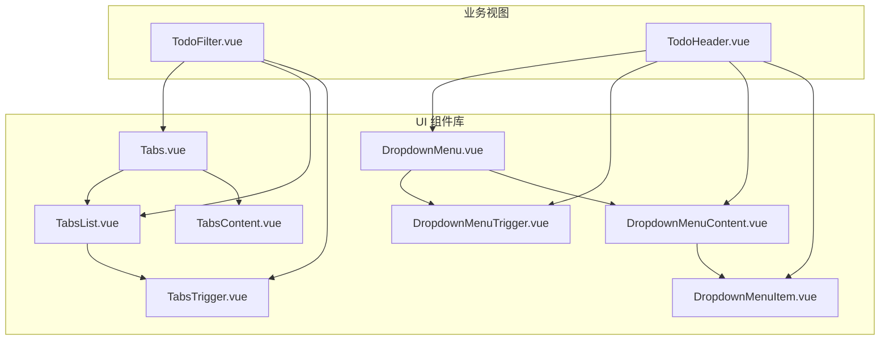
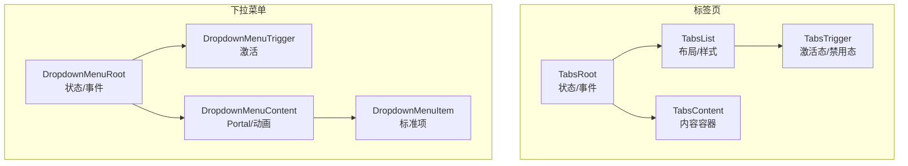
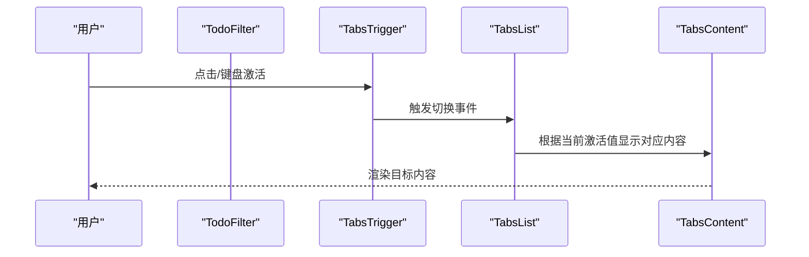
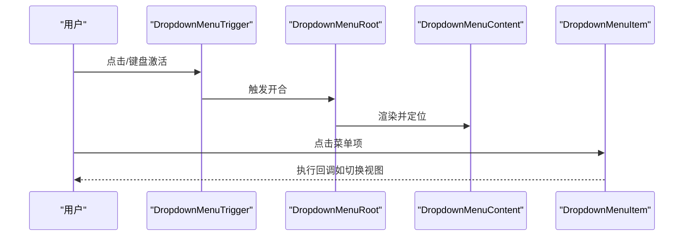
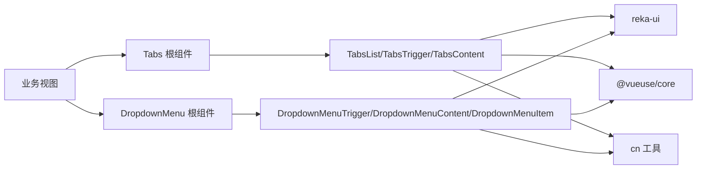

# 导航组件

<cite>
**本文引用的文件**
- [apps/frontend/src/components/ui/tabs/Tabs.vue](file://apps/frontend/src/components/ui/tabs/Tabs.vue)
- [apps/frontend/src/components/ui/tabs/TabsList.vue](file://apps/frontend/src/components/ui/tabs/TabsList.vue)
- [apps/frontend/src/components/ui/tabs/TabsTrigger.vue](file://apps/frontend/src/components/ui/tabs/TabsTrigger.vue)
- [apps/frontend/src/components/ui/tabs/TabsContent.vue](file://apps/frontend/src/components/ui/tabs/TabsContent.vue)
- [apps/frontend/src/components/ui/tabs/index.ts](file://apps/frontend/src/components/ui/tabs/index.ts)
- [apps/frontend/src/components/ui/dropdown-menu/DropdownMenu.vue](file://apps/frontend/src/components/ui/dropdown-menu/DropdownMenu.vue)
- [apps/frontend/src/components/ui/dropdown-menu/DropdownMenuTrigger.vue](file://apps/frontend/src/components/ui/dropdown-menu/DropdownMenuTrigger.vue)
- [apps/frontend/src/components/ui/dropdown-menu/DropdownMenuContent.vue](file://apps/frontend/src/components/ui/dropdown-menu/DropdownMenuContent.vue)
- [apps/frontend/src/components/ui/dropdown-menu/DropdownMenuItem.vue](file://apps/frontend/src/components/ui/dropdown-menu/DropdownMenuItem.vue)
- [apps/frontend/src/components/ui/dropdown-menu/index.ts](file://apps/frontend/src/components/ui/dropdown-menu/index.ts)
- [apps/frontend/src/features/todo/components/TodoFilter.vue](file://apps/frontend/src/features/todo/components/TodoFilter.vue)
- [apps/frontend/src/features/todo/components/TodoHeader.vue](file://apps/frontend/src/features/todo/components/TodoHeader.vue)
- [apps/frontend/tests/features/todo/components/TodoFilter.spec.ts](file://apps/frontend/tests/features/todo/components/TodoFilter.spec.ts)
</cite>

## 目录
1. [简介](#简介)
2. [项目结构](#项目结构)
3. [核心组件](#核心组件)
4. [架构总览](#架构总览)
5. [详细组件分析](#详细组件分析)
6. [依赖关系分析](#依赖关系分析)
7. [性能考量](#性能考量)
8. [故障排查指南](#故障排查指南)
9. [结论](#结论)
10. [附录](#附录)

## 简介
本文件聚焦 Lumina Todo 前端的导航 UI 组件，系统性梳理标签页（Tabs）与下拉菜单（DropdownMenu）两类导航组件的设计与实现要点。内容涵盖：
- 状态管理与内容切换：基于 reka-ui 的受控/非受控模式、data-state 属性驱动的视觉状态。
- 交互设计与键盘可达性：焦点管理、ARIA 属性与键盘导航支持。
- 动画过渡与定位：基于 reka-ui 的开合动画与 Portal 定位策略。
- 场景化应用：侧边栏、顶部导航、上下文菜单等典型布局中的使用方式与最佳实践。

## 项目结构
导航组件位于前端应用的 UI 组件库目录中，并在业务视图中被广泛复用：
- 标签页组件：apps/frontend/src/components/ui/tabs/*
- 下拉菜单组件：apps/frontend/src/components/ui/dropdown-menu/*
- 业务使用示例：
  - 过滤器视图（TodoFilter）中使用 Tabs 实现“待完成/已完成”切换。
  - 顶部工具栏（TodoHeader）中使用 DropdownMenu 提供设置与视图切换。

图表来源
- [apps/frontend/src/components/ui/tabs/Tabs.vue:1-16](file://apps/frontend/src/components/ui/tabs/Tabs.vue#L1-L16)
- [apps/frontend/src/components/ui/tabs/TabsList.vue:1-26](file://apps/frontend/src/components/ui/tabs/TabsList.vue#L1-L26)
- [apps/frontend/src/components/ui/tabs/TabsTrigger.vue:1-28](file://apps/frontend/src/components/ui/tabs/TabsTrigger.vue#L1-L28)
- [apps/frontend/src/components/ui/tabs/TabsContent.vue:1-26](file://apps/frontend/src/components/ui/tabs/TabsContent.vue#L1-L26)
- [apps/frontend/src/components/ui/dropdown-menu/DropdownMenu.vue:1-16](file://apps/frontend/src/components/ui/dropdown-menu/DropdownMenu.vue#L1-L16)
- [apps/frontend/src/components/ui/dropdown-menu/DropdownMenuTrigger.vue:1-15](file://apps/frontend/src/components/ui/dropdown-menu/DropdownMenuTrigger.vue#L1-L15)
- [apps/frontend/src/components/ui/dropdown-menu/DropdownMenuContent.vue:1-37](file://apps/frontend/src/components/ui/dropdown-menu/DropdownMenuContent.vue#L1-L37)
- [apps/frontend/src/components/ui/dropdown-menu/DropdownMenuItem.vue:1-31](file://apps/frontend/src/components/ui/dropdown-menu/DropdownMenuItem.vue#L1-L31)
- [apps/frontend/src/features/todo/components/TodoFilter.vue:67-89](file://apps/frontend/src/features/todo/components/TodoFilter.vue#L67-L89)
- [apps/frontend/src/features/todo/components/TodoHeader.vue:222-276](file://apps/frontend/src/features/todo/components/TodoHeader.vue#L222-L276)

章节来源
- [apps/frontend/src/components/ui/tabs/index.ts:1-5](file://apps/frontend/src/components/ui/tabs/index.ts#L1-L5)
- [apps/frontend/src/components/ui/dropdown-menu/index.ts:1-17](file://apps/frontend/src/components/ui/dropdown-menu/index.ts#L1-L17)

## 核心组件
- 标签页（Tabs）
  - 根容器：负责状态与事件转发，内部封装受控/非受控切换逻辑。
  - 列表（TabsList）：承载多个触发器，提供统一的背景与对齐样式。
  - 触发器（TabsTrigger）：单个选项卡入口，支持禁用、激活态与聚焦环。
  - 内容区（TabsContent）：与触发器一一对应的内容容器，支持聚焦可见性与过渡动画。
- 下拉菜单（DropdownMenu）
  - 根容器（DropdownMenu）：管理菜单开合状态与事件冒泡。
  - 触发器（DropdownMenuTrigger）：点击/键盘激活菜单。
  - 内容（DropdownMenuContent）：带 Portal 定位与开合动画的弹出层，支持侧向偏移与对齐。
  - 菜单项（DropdownMenuItem）：标准菜单项，支持内嵌缩进与禁用态。

章节来源
- [apps/frontend/src/components/ui/tabs/Tabs.vue:1-16](file://apps/frontend/src/components/ui/tabs/Tabs.vue#L1-L16)
- [apps/frontend/src/components/ui/tabs/TabsList.vue:1-26](file://apps/frontend/src/components/ui/tabs/TabsList.vue#L1-L26)
- [apps/frontend/src/components/ui/tabs/TabsTrigger.vue:1-28](file://apps/frontend/src/components/ui/tabs/TabsTrigger.vue#L1-L28)
- [apps/frontend/src/components/ui/tabs/TabsContent.vue:1-26](file://apps/frontend/src/components/ui/tabs/TabsContent.vue#L1-L26)
- [apps/frontend/src/components/ui/dropdown-menu/DropdownMenu.vue:1-16](file://apps/frontend/src/components/ui/dropdown-menu/DropdownMenu.vue#L1-L16)
- [apps/frontend/src/components/ui/dropdown-menu/DropdownMenuTrigger.vue:1-15](file://apps/frontend/src/components/ui/dropdown-menu/DropdownMenuTrigger.vue#L1-L15)
- [apps/frontend/src/components/ui/dropdown-menu/DropdownMenuContent.vue:1-37](file://apps/frontend/src/components/ui/dropdown-menu/DropdownMenuContent.vue#L1-L37)
- [apps/frontend/src/components/ui/dropdown-menu/DropdownMenuItem.vue:1-31](file://apps/frontend/src/components/ui/dropdown-menu/DropdownMenuItem.vue#L1-L31)

## 架构总览
两类组件均采用“根组件 + 子组件”的组合模式，通过 reka-ui 提供的语义化 API 与动画钩子，结合 cn 工具函数进行样式拼接，最终在业务视图中以声明式方式组合使用。

图表来源
- [apps/frontend/src/components/ui/tabs/Tabs.vue:1-16](file://apps/frontend/src/components/ui/tabs/Tabs.vue#L1-L16)
- [apps/frontend/src/components/ui/tabs/TabsList.vue:1-26](file://apps/frontend/src/components/ui/tabs/TabsList.vue#L1-L26)
- [apps/frontend/src/components/ui/tabs/TabsTrigger.vue:1-28](file://apps/frontend/src/components/ui/tabs/TabsTrigger.vue#L1-L28)
- [apps/frontend/src/components/ui/tabs/TabsContent.vue:1-26](file://apps/frontend/src/components/ui/tabs/TabsContent.vue#L1-L26)
- [apps/frontend/src/components/ui/dropdown-menu/DropdownMenu.vue:1-16](file://apps/frontend/src/components/ui/dropdown-menu/DropdownMenu.vue#L1-L16)
- [apps/frontend/src/components/ui/dropdown-menu/DropdownMenuTrigger.vue:1-15](file://apps/frontend/src/components/ui/dropdown-menu/DropdownMenuTrigger.vue#L1-L15)
- [apps/frontend/src/components/ui/dropdown-menu/DropdownMenuContent.vue:1-37](file://apps/frontend/src/components/ui/dropdown-menu/DropdownMenuContent.vue#L1-L37)
- [apps/frontend/src/components/ui/dropdown-menu/DropdownMenuItem.vue:1-31](file://apps/frontend/src/components/ui/dropdown-menu/DropdownMenuItem.vue#L1-L31)

## 详细组件分析

### 标签页（Tabs）组件
- 状态管理与内容切换
  - 根组件负责将外部传入的 props/emits 转发给 reka-ui 的 TabsRoot，确保受控/非受控模式的一致行为。
  - TabsTrigger 通过 data-state="active/inactive" 表达当前激活状态；业务层可通过该属性控制样式与视觉反馈。
  - TabsContent 与触发器一一对应，仅在对应值激活时渲染，避免不必要的 DOM 更新。
- 键盘导航支持
  - 触发器具备可聚焦性与聚焦环（focus-visible），便于键盘用户导航。
  - 列表容器提供合理的布局与对齐，保证横向标签页的可读性与一致性。
- 可访问性与 ARIA
  - 通过 reka-ui 的语义化 API 自动维护角色与属性，建议在复杂场景中补充 aria-label 或 aria-describedby 以增强描述性。
- 动画与过渡
  - 内容切换由 reka-ui 控制，保持与触发器状态一致的开合动画。
- 在业务中的应用
  - TodoFilter 中使用 Tabs 实现“待完成/已完成”过滤按钮组，触发器根据当前 filter 值呈现激活态。

图表来源
- [apps/frontend/src/features/todo/components/TodoFilter.vue:67-89](file://apps/frontend/src/features/todo/components/TodoFilter.vue#L67-L89)
- [apps/frontend/src/components/ui/tabs/TabsTrigger.vue:1-28](file://apps/frontend/src/components/ui/tabs/TabsTrigger.vue#L1-L28)
- [apps/frontend/src/components/ui/tabs/TabsList.vue:1-26](file://apps/frontend/src/components/ui/tabs/TabsList.vue#L1-L26)
- [apps/frontend/src/components/ui/tabs/TabsContent.vue:1-26](file://apps/frontend/src/components/ui/tabs/TabsContent.vue#L1-L26)

章节来源
- [apps/frontend/src/components/ui/tabs/Tabs.vue:1-16](file://apps/frontend/src/components/ui/tabs/Tabs.vue#L1-L16)
- [apps/frontend/src/components/ui/tabs/TabsList.vue:1-26](file://apps/frontend/src/components/ui/tabs/TabsList.vue#L1-L26)
- [apps/frontend/src/components/ui/tabs/TabsTrigger.vue:1-28](file://apps/frontend/src/components/ui/tabs/TabsTrigger.vue#L1-L28)
- [apps/frontend/src/components/ui/tabs/TabsContent.vue:1-26](file://apps/frontend/src/components/ui/tabs/TabsContent.vue#L1-L26)
- [apps/frontend/src/features/todo/components/TodoFilter.vue:67-89](file://apps/frontend/src/features/todo/components/TodoFilter.vue#L67-L89)
- [apps/frontend/tests/features/todo/components/TodoFilter.spec.ts:143-235](file://apps/frontend/tests/features/todo/components/TodoFilter.spec.ts#L143-L235)

### 下拉菜单（DropdownMenu）组件
- 触发机制
  - DropdownMenuTrigger 作为激活入口，支持 click 与键盘激活；根组件负责状态同步。
- 菜单项组织与子菜单嵌套
  - DropdownMenuItem 支持 inset 缩进与禁用态，适合组织分组与层级。
  - 通过 DropdownMenuSub 系列组件可实现子菜单嵌套（在导出清单中可见）。
- 定位与动画
  - DropdownMenuContent 使用 Portal 将菜单挂载到文档流之外，避免被父级裁剪。
  - 默认 sideOffset 与多方向 slide-in 动画确保从合适位置进入，提升可视连续性。
- 可访问性与焦点管理
  - 触发器具备 outline-none 与可聚焦性，配合 reka-ui 的焦点回退策略，减少焦点丢失风险。
  - 建议在复杂菜单中使用 DropdownMenuLabel 与 DropdownMenuSeparator 明确分组与边界。
- 在业务中的应用
  - TodoHeader 中使用 DropdownMenu 提供移动端“更多操作”菜单，包含视图切换、主题设置与语言切换等常用入口。

图表来源
- [apps/frontend/src/components/ui/dropdown-menu/DropdownMenuTrigger.vue:1-15](file://apps/frontend/src/components/ui/dropdown-menu/DropdownMenuTrigger.vue#L1-L15)
- [apps/frontend/src/components/ui/dropdown-menu/DropdownMenu.vue:1-16](file://apps/frontend/src/components/ui/dropdown-menu/DropdownMenu.vue#L1-L16)
- [apps/frontend/src/components/ui/dropdown-menu/DropdownMenuContent.vue:1-37](file://apps/frontend/src/components/ui/dropdown-menu/DropdownMenuContent.vue#L1-L37)
- [apps/frontend/src/components/ui/dropdown-menu/DropdownMenuItem.vue:1-31](file://apps/frontend/src/components/ui/dropdown-menu/DropdownMenuItem.vue#L1-L31)
- [apps/frontend/src/features/todo/components/TodoHeader.vue:222-276](file://apps/frontend/src/features/todo/components/TodoHeader.vue#L222-L276)

章节来源
- [apps/frontend/src/components/ui/dropdown-menu/DropdownMenu.vue:1-16](file://apps/frontend/src/components/ui/dropdown-menu/DropdownMenu.vue#L1-L16)
- [apps/frontend/src/components/ui/dropdown-menu/DropdownMenuTrigger.vue:1-15](file://apps/frontend/src/components/ui/dropdown-menu/DropdownMenuTrigger.vue#L1-L15)
- [apps/frontend/src/components/ui/dropdown-menu/DropdownMenuContent.vue:1-37](file://apps/frontend/src/components/ui/dropdown-menu/DropdownMenuContent.vue#L1-L37)
- [apps/frontend/src/components/ui/dropdown-menu/DropdownMenuItem.vue:1-31](file://apps/frontend/src/components/ui/dropdown-menu/DropdownMenuItem.vue#L1-L31)
- [apps/frontend/src/features/todo/components/TodoHeader.vue:222-276](file://apps/frontend/src/features/todo/components/TodoHeader.vue#L222-L276)

## 依赖关系分析
- 组件间耦合
  - Tabs 与 DropdownMenu 均为组合型组件，根组件与子组件职责清晰，耦合度低。
  - 业务视图通过组合使用根组件与子组件，降低对底层实现细节的依赖。
- 外部依赖
  - reka-ui：提供语义化 API、动画钩子与焦点管理。
  - @vueuse/core：reactiveOmit 用于分离 class 与组件 props，避免样式类污染。
  - cn 工具：安全合并 Tailwind 类名，避免冲突。
- 潜在循环依赖
  - 当前结构未见循环导入；若业务视图直接引入子组件而非通过根组件，可能增加耦合风险。

图表来源
- [apps/frontend/src/components/ui/tabs/Tabs.vue:1-16](file://apps/frontend/src/components/ui/tabs/Tabs.vue#L1-L16)
- [apps/frontend/src/components/ui/tabs/TabsList.vue:1-26](file://apps/frontend/src/components/ui/tabs/TabsList.vue#L1-L26)
- [apps/frontend/src/components/ui/tabs/TabsTrigger.vue:1-28](file://apps/frontend/src/components/ui/tabs/TabsTrigger.vue#L1-L28)
- [apps/frontend/src/components/ui/tabs/TabsContent.vue:1-26](file://apps/frontend/src/components/ui/tabs/TabsContent.vue#L1-L26)
- [apps/frontend/src/components/ui/dropdown-menu/DropdownMenu.vue:1-16](file://apps/frontend/src/components/ui/dropdown-menu/DropdownMenu.vue#L1-L16)
- [apps/frontend/src/components/ui/dropdown-menu/DropdownMenuTrigger.vue:1-15](file://apps/frontend/src/components/ui/dropdown-menu/DropdownMenuTrigger.vue#L1-L15)
- [apps/frontend/src/components/ui/dropdown-menu/DropdownMenuContent.vue:1-37](file://apps/frontend/src/components/ui/dropdown-menu/DropdownMenuContent.vue#L1-L37)
- [apps/frontend/src/components/ui/dropdown-menu/DropdownMenuItem.vue:1-31](file://apps/frontend/src/components/ui/dropdown-menu/DropdownMenuItem.vue#L1-L31)

章节来源
- [apps/frontend/src/components/ui/tabs/index.ts:1-5](file://apps/frontend/src/components/ui/tabs/index.ts#L1-L5)
- [apps/frontend/src/components/ui/dropdown-menu/index.ts:1-17](file://apps/frontend/src/components/ui/dropdown-menu/index.ts#L1-L17)

## 性能考量
- 渲染优化
  - TabsContent 仅在激活时渲染，减少不必要的 DOM 与计算开销。
  - DropdownMenuContent 使用 Portal 避免层级遮挡带来的重排，提高渲染效率。
- 动画成本
  - 开合动画由 reka-ui 控制，建议在低端设备上谨慎使用复杂过渡；必要时可按需禁用或简化。
- 样式拼接
  - cn 工具与 reactiveOmit 的组合避免了运行时样式冲突与过度计算，有利于性能稳定。

## 故障排查指南
- Tabs 激活态不生效
  - 确认 TabsTrigger 的 value 与 TabsContent 的 value 对应，且根组件未被错误地强制受控。
  - 检查 data-state 属性是否正确传递至触发器，测试用例展示了如何断言该属性。
- DropdownMenu 不显示或位置异常
  - 检查是否使用了 DropdownMenuPortal，确保内容未被父级裁剪。
  - 调整 sideOffset 与 align 参数，确保在不同屏幕尺寸下的可见性。
- 焦点与键盘可达性问题
  - 确保触发器具备可聚焦性，避免 outline-none 影响键盘用户。
  - 在复杂菜单中添加 label 与 separator，帮助键盘用户理解结构。

章节来源
- [apps/frontend/tests/features/todo/components/TodoFilter.spec.ts:143-235](file://apps/frontend/tests/features/todo/components/TodoFilter.spec.ts#L143-L235)
- [apps/frontend/src/components/ui/tabs/TabsTrigger.vue:1-28](file://apps/frontend/src/components/ui/tabs/TabsTrigger.vue#L1-L28)
- [apps/frontend/src/components/ui/dropdown-menu/DropdownMenuContent.vue:1-37](file://apps/frontend/src/components/ui/dropdown-menu/DropdownMenuContent.vue#L1-L37)

## 结论
Lumina Todo 的导航组件以 reka-ui 为核心，结合 cn 与 @vueuse 工具，实现了高可定制、强可访问性的标签页与下拉菜单。通过在业务视图中的组合使用，组件既满足了侧边栏、顶部导航、上下文菜单等多场景需求，又保持了良好的性能与可维护性。建议在复杂场景中进一步完善 ARIA 描述与键盘导航提示，以提升无障碍体验。

## 附录
- 最佳实践清单
  - 标签页
    - 使用 data-state="active" 控制样式，避免硬编码类名。
    - 为每个 TabsTrigger 设置唯一 value，确保内容切换准确。
  - 下拉菜单
    - 使用 Portal 保证定位与层级，必要时调整 sideOffset。
    - 通过 inset 与 separator 组织分组，提升可读性。
    - 为关键菜单项提供快捷键提示（Shortcut）与图标辅助。
  - 场景化应用
    - 侧边栏：优先使用列表型菜单，保持紧凑与一致的间距。
    - 顶部导航：结合 Tooltip 提供简短说明，减少文字冗余。
    - 上下文菜单：使用分组与分隔线明确功能边界，避免拥挤。