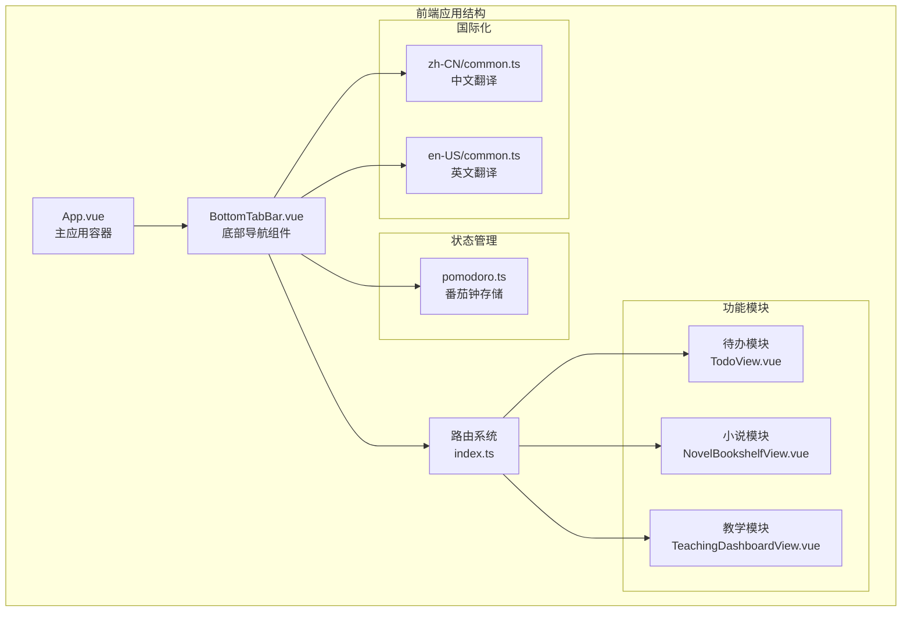
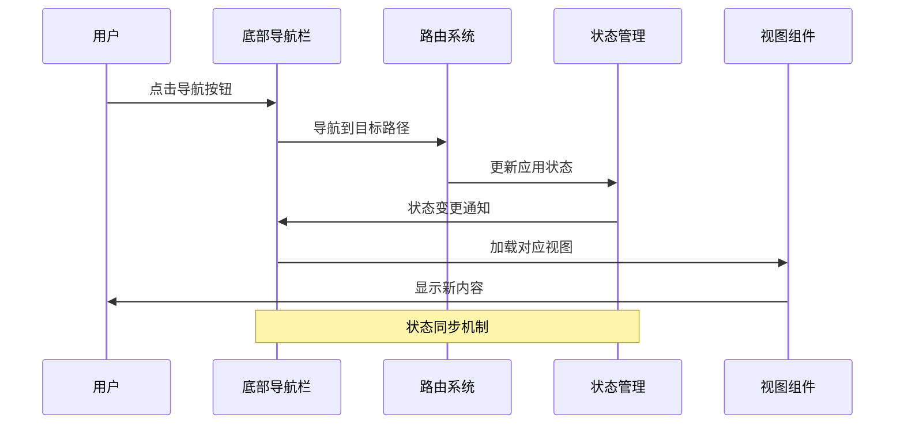
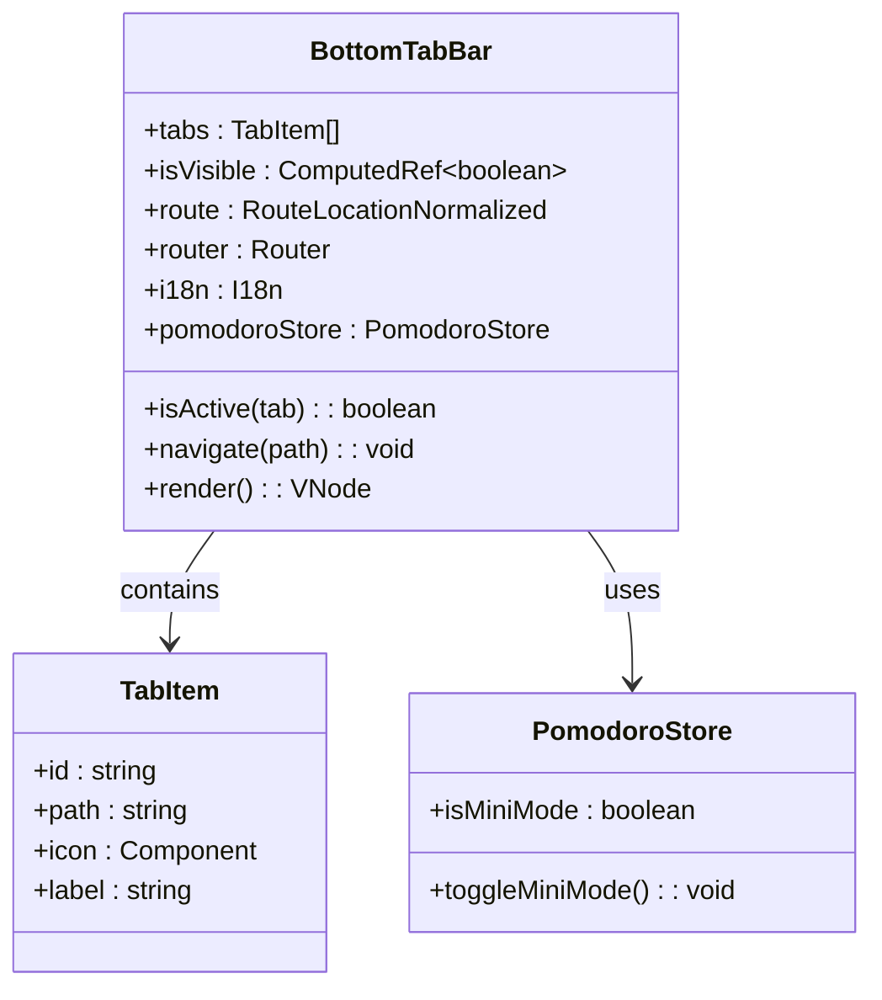
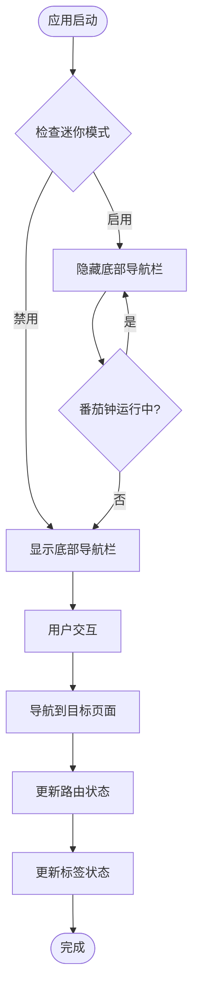
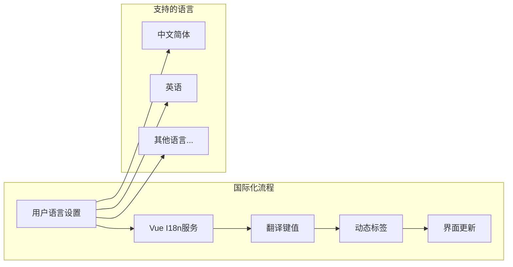
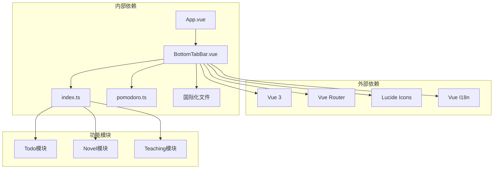

# 底部导航栏

<cite>
**本文档引用的文件**
- [BottomTabBar.vue](file://apps/frontend/src/components/BottomTabBar.vue)
- [App.vue](file://apps/frontend/src/App.vue)
- [index.ts](file://apps/frontend/src/router/index.ts)
- [pomodoro.ts](file://apps/frontend/src/features/todo/stores/pomodoro.ts)
- [common.ts](file://apps/frontend/src/i18n/locales/zh-CN/common.ts)
- [common.ts](file://apps/frontend/src/i18n/locales/en-US/common.ts)
</cite>

## 目录
1. [简介](#简介)
2. [项目结构](#项目结构)
3. [核心组件](#核心组件)
4. [架构概览](#架构概览)
5. [详细组件分析](#详细组件分析)
6. [依赖关系分析](#依赖关系分析)
7. [性能考虑](#性能考虑)
8. [故障排除指南](#故障排除指南)
9. [结论](#结论)

## 简介

底部导航栏是 Todo 应用中的关键用户界面组件，为用户提供在主要功能模块之间的快速导航。该组件采用现代化的设计理念，结合了响应式设计、动画效果和可访问性特性，为用户提供了流畅的移动端体验。

底部导航栏集成了三个主要功能模块：待办事项管理、小说创作和教学学习，每个模块都有独特的图标和标签，支持多语言国际化。

## 项目结构

底部导航栏功能在项目中的组织结构如下：

**图表来源**
- [App.vue:17-31](file://apps/frontend/src/App.vue#L17-L31)
- [BottomTabBar.vue:15-19](file://apps/frontend/src/components/BottomTabBar.vue#L15-L19)
- [index.ts:48-64](file://apps/frontend/src/router/index.ts#L48-L64)

**章节来源**
- [App.vue:17-31](file://apps/frontend/src/App.vue#L17-L31)
- [BottomTabBar.vue:15-19](file://apps/frontend/src/components/BottomTabBar.vue#L15-L19)
- [index.ts:48-64](file://apps/frontend/src/router/index.ts#L48-L64)

## 核心组件

底部导航栏的核心组件由以下关键部分组成：

### 组件结构
- **导航容器**：固定定位在屏幕底部，支持安全区域适配
- **标签按钮**：三个主要导航选项，每个都有独特的图标和标签
- **激活状态**：根据当前路由自动高亮显示
- **过渡动画**：平滑的显示和隐藏效果

### 功能特性
- **响应式设计**：支持不同屏幕尺寸和方向
- **国际化支持**：动态加载多语言标签
- **状态同步**：与应用状态和路由系统保持同步
- **可访问性**：支持键盘导航和屏幕阅读器

**章节来源**
- [BottomTabBar.vue:32-66](file://apps/frontend/src/components/BottomTabBar.vue#L32-L66)
- [BottomTabBar.vue:15-19](file://apps/frontend/src/components/BottomTabBar.vue#L15-L19)

## 架构概览

底部导航栏的架构设计体现了现代前端开发的最佳实践：

**图表来源**
- [BottomTabBar.vue:27-29](file://apps/frontend/src/components/BottomTabBar.vue#L27-L29)
- [App.vue:17-31](file://apps/frontend/src/App.vue#L17-L31)
- [pomodoro.ts:358-360](file://apps/frontend/src/features/todo/stores/pomodoro.ts#L358-L360)

### 数据流分析

底部导航栏的数据流遵循单向数据流原则：

1. **用户交互** → 导航按钮点击事件
2. **路由导航** → Vue Router 路径切换
3. **状态更新** → Pinia 状态管理
4. **视图渲染** → 组件重新渲染
5. **UI反馈** → 激活状态高亮显示

**章节来源**
- [BottomTabBar.vue:21-25](file://apps/frontend/src/components/BottomTabBar.vue#L21-L25)
- [index.ts:75-88](file://apps/frontend/src/router/index.ts#L75-L88)

## 详细组件分析

### BottomTabBar 组件详解

底部导航栏组件采用了现代化的 Vue 3 Composition API 设计：

**图表来源**
- [BottomTabBar.vue:1-11](file://apps/frontend/src/components/BottomTabBar.vue#L1-L11)
- [BottomTabBar.vue:15-19](file://apps/frontend/src/components/BottomTabBar.vue#L15-L19)
- [pomodoro.ts:358-360](file://apps/frontend/src/features/todo/stores/pomodoro.ts#L358-L360)

#### 组件属性和方法

| 属性/方法 | 类型 | 描述 | 使用场景 |
|-----------|------|------|----------|
| `tabs` | `Array<TabItem>` | 导航标签数组 | 定义导航结构 |
| `isVisible` | `ComputedRef<boolean>` | 可见性计算属性 | 控制显示/隐藏 |
| `isActive` | `(tab: TabItem) => boolean` | 激活状态判断 | 高亮当前标签 |
| `navigate` | `(path: string) => void` | 导航方法 | 处理路由跳转 |

#### 导航标签配置

底部导航栏包含三个预定义的导航标签：

| 标签ID | 路径 | 图标 | 国际化键 | 功能描述 |
|--------|------|------|----------|----------|
| `todo` | `/` | ListTodo | `common.nav.todo` | 待办事项管理 |
| `novel` | `/novel` | BookOpen | `common.nav.novel` | 小说创作工具 |
| `teaching` | `/teaching` | GraduationCap | `common.nav.teaching` | 教学学习平台 |

**章节来源**
- [BottomTabBar.vue:15-19](file://apps/frontend/src/components/BottomTabBar.vue#L15-L19)
- [common.ts:86-89](file://apps/frontend/src/i18n/locales/zh-CN/common.ts#L86-L89)
- [common.ts:86-89](file://apps/frontend/src/i18n/locales/en-US/common.ts#L86-L89)

### 状态管理系统

底部导航栏与番茄钟状态管理系统紧密集成：

**图表来源**
- [BottomTabBar.vue:13](file://apps/frontend/src/components/BottomTabBar.vue#L13)
- [pomodoro.ts:358-360](file://apps/frontend/src/features/todo/stores/pomodoro.ts#L358-L360)

#### 状态同步机制

当番茄钟进入迷你模式时，底部导航栏会自动隐藏，提供更沉浸式的用户体验。这种状态同步通过以下方式实现：

1. **计算属性监听**：`isVisible` 计算属性监听 `isMiniMode` 状态变化
2. **条件渲染**：使用 `v-if` 指令控制组件显示
3. **自动同步**：状态变化时自动触发重新渲染

**章节来源**
- [BottomTabBar.vue:13](file://apps/frontend/src/components/BottomTabBar.vue#L13)
- [pomodoro.ts:358-360](file://apps/frontend/src/features/todo/stores/pomodoro.ts#L358-L360)

### 国际化实现

底部导航栏支持多语言国际化，通过 Vue I18n 实现动态语言切换：

**图表来源**
- [BottomTabBar.vue:10](file://apps/frontend/src/components/BottomTabBar.vue#L10)
- [BottomTabBar.vue:61](file://apps/frontend/src/components/BottomTabBar.vue#L61)

#### 翻译键值结构

导航栏使用的国际化键值位于 `common.nav` 命名空间下：

| 键值 | 中文翻译 | 英文翻译 |
|------|----------|----------|
| `common.nav.todo` | 待办 | Todo |
| `common.nav.novel` | 小说 | Novel |
| `common.nav.teaching` | 学习 | Learn |

**章节来源**
- [common.ts:86-89](file://apps/frontend/src/i18n/locales/zh-CN/common.ts#L86-L89)
- [common.ts:86-89](file://apps/frontend/src/i18n/locales/en-US/common.ts#L86-L89)

## 依赖关系分析

底部导航栏的依赖关系体现了清晰的分层架构：

**图表来源**
- [BottomTabBar.vue:2-6](file://apps/frontend/src/components/BottomTabBar.vue#L2-L6)
- [App.vue:7](file://apps/frontend/src/App.vue#L7)
- [index.ts:1-2](file://apps/frontend/src/router/index.ts#L1-L2)

### 关键依赖项

| 依赖项 | 版本 | 用途 | 重要性 |
|--------|------|------|--------|
| Vue 3 | 最新稳定版 | 响应式框架 | 核心依赖 |
| Vue Router | 最新稳定版 | 路由管理 | 核心依赖 |
| Lucide Icons | 最新稳定版 | 图标库 | UI组件 |
| Vue I18n | 最新稳定版 | 国际化 | 重要依赖 |
| Pinia | 最新稳定版 | 状态管理 | 重要依赖 |

**章节来源**
- [BottomTabBar.vue:2-6](file://apps/frontend/src/components/BottomTabBar.vue#L2-L6)
- [App.vue:4-10](file://apps/frontend/src/App.vue#L4-L10)

## 性能考虑

底部导航栏在设计时充分考虑了性能优化：

### 渲染优化
- **条件渲染**：使用 `v-if` 控制组件显示，避免不必要的渲染
- **计算属性缓存**：利用 Vue 的计算属性缓存机制
- **组件懒加载**：路由级别的代码分割

### 内存管理
- **生命周期管理**：正确处理组件挂载和卸载
- **事件监听器清理**：避免内存泄漏
- **状态持久化**：与 Pinia 的持久化插件集成

### 动画性能
- **硬件加速**：使用 CSS3 变换和透明度动画
- **优化的过渡效果**：合理的动画持续时间和缓动函数
- **减少重绘**：避免触发布局重排的样式修改

## 故障排除指南

### 常见问题及解决方案

#### 导航栏不显示
**症状**：底部导航栏完全不可见
**可能原因**：
- 路由配置错误
- 权限验证失败
- 番茄钟迷你模式启用

**解决步骤**：
1. 检查路由配置是否正确
2. 验证用户权限状态
3. 检查 `isMiniMode` 状态

#### 标签激活状态异常
**症状**：当前页面标签未高亮显示
**可能原因**：
- 路由路径匹配逻辑错误
- 组件刷新问题

**解决步骤**：
1. 检查 `isActive` 方法的路径匹配逻辑
2. 验证路由对象的 `path` 属性
3. 确认组件重新渲染机制

#### 国际化标签不显示
**症状**：导航标签显示为键值而非翻译文本
**可能原因**：
- 翻译文件加载失败
- I18n 服务初始化问题

**解决步骤**：
1. 检查翻译文件是否存在
2. 验证 I18n 服务配置
3. 确认语言设置正确

**章节来源**
- [BottomTabBar.vue:21-25](file://apps/frontend/src/components/BottomTabBar.vue#L21-L25)
- [App.vue:17-31](file://apps/frontend/src/App.vue#L17-L31)

## 结论

底部导航栏作为 Todo 应用的核心导航组件，展现了现代前端开发的优秀实践。其设计充分考虑了用户体验、性能优化和可维护性。

### 主要优势
- **用户体验友好**：直观的导航设计和流畅的动画效果
- **技术架构先进**：基于 Vue 3 和现代前端技术栈
- **可扩展性强**：模块化的组件设计便于功能扩展
- **国际化支持**：完整的多语言支持体系

### 技术亮点
- 响应式设计确保在各种设备上的良好表现
- 状态管理与导航系统的深度集成
- 性能优化措施确保流畅的用户体验
- 清晰的代码结构便于维护和扩展

底部导航栏不仅是一个功能组件，更是整个应用用户体验的重要组成部分，为用户提供了简洁、高效的任务管理入口。