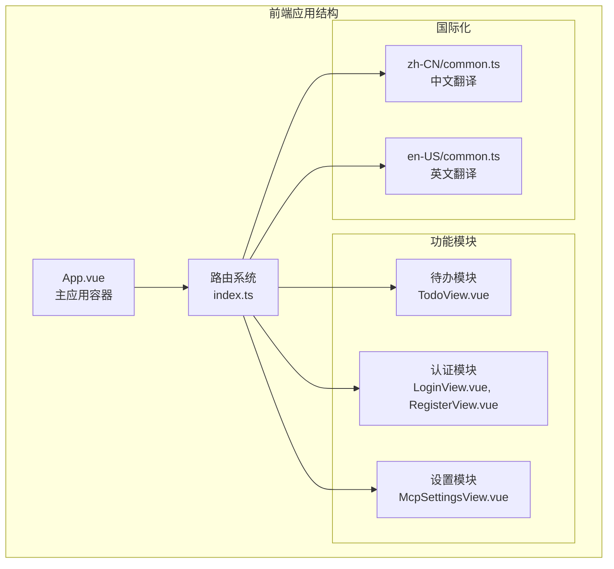
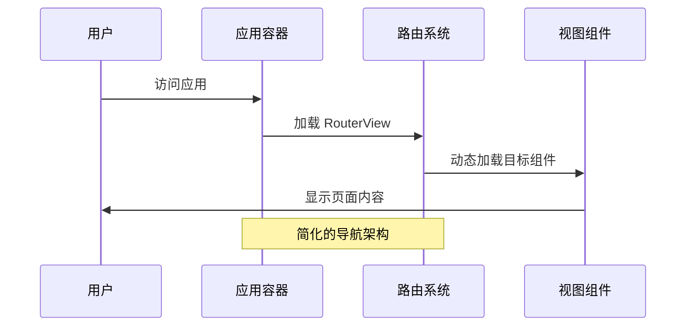
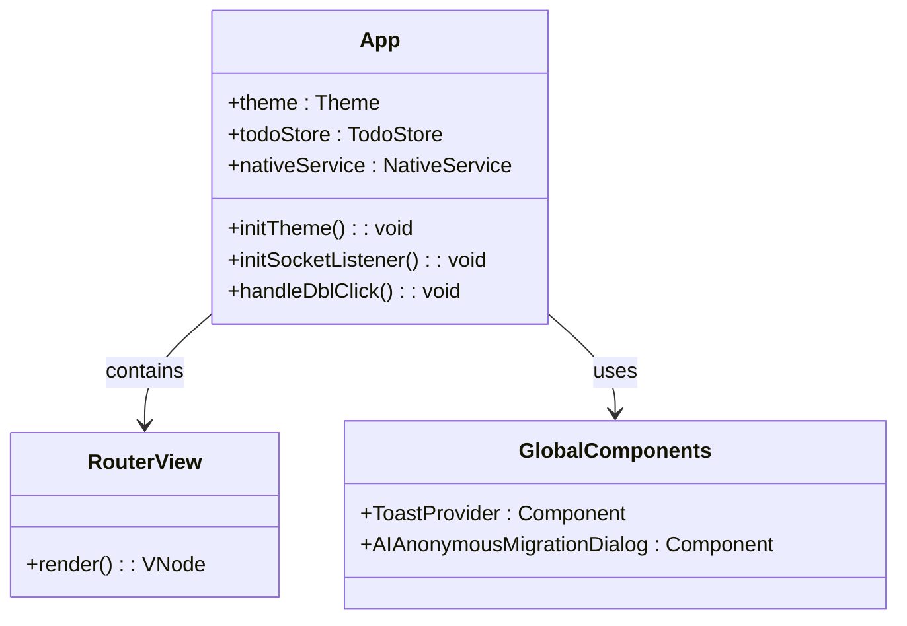
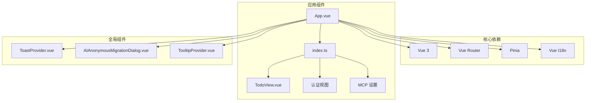

# 底部导航栏

<cite>
**本文档引用的文件**
- [App.vue](file://apps/frontend/src/App.vue)
- [index.ts](file://apps/frontend/src/router/index.ts)
- [common.ts](file://apps/frontend/src/i18n/locales/zh-CN/common.ts)
- [common.ts](file://apps/frontend/src/i18n/locales/en-US/common.ts)
</cite>

## 更新摘要
**变更内容**
- 底部导航栏组件已移除，导航结构得到简化
- App.vue 中移除了 BottomTabBar 组件的引用
- 路由配置仅保留基础导航路径
- 国际化文件中的导航相关键值已简化

## 目录
1. [简介](#简介)
2. [项目结构](#项目结构)
3. [核心组件](#核心组件)
4. [架构概览](#架构概览)
5. [详细组件分析](#详细组件分析)
6. [依赖关系分析](#依赖关系分析)
7. [性能考虑](#性能考虑)
8. [故障排除指南](#故障排除指南)
9. [结论](#结论)

## 简介

底部导航栏曾是 Todo 应用中的关键用户界面组件，为用户提供在主要功能模块之间的快速导航。该组件采用现代化的设计理念，结合了响应式设计、动画效果和可访问性特性，为用户提供了流畅的移动端体验。

**更新** 底部导航栏组件已在项目重构中移除，导航逻辑得到简化，目前应用采用更直接的路由导航方式。

## 项目结构

底部导航栏功能在项目中的组织结构已发生重大变化：

**图表来源**
- [App.vue:30-56](file://apps/frontend/src/App.vue#L30-L56)
- [index.ts:14-56](file://apps/frontend/src/router/index.ts#L14-L56)

**章节来源**
- [App.vue:30-56](file://apps/frontend/src/App.vue#L30-L56)
- [index.ts:14-56](file://apps/frontend/src/router/index.ts#L14-L56)

## 核心组件

**更新** 应用现已采用简化的组件架构，移除了专门的底部导航栏组件：

### 应用容器
- **App.vue**：主应用容器，负责全局布局和状态管理
- **RouterView**：路由视图容器，动态加载不同页面组件
- **全局组件**：ToastProvider、AI 匿名迁移对话框等

### 路由系统
- **Vue Router**：负责页面间的导航和状态管理
- **路由守卫**：处理认证状态和页面标题更新
- **异步组件加载**：按需加载页面组件，优化性能

### 功能模块
- **待办模块**：TodoView.vue 提供任务管理功能
- **认证模块**：登录、注册、密码重置页面
- **设置模块**：MCP 设置等功能配置

**章节来源**
- [App.vue:1-28](file://apps/frontend/src/App.vue#L1-L28)
- [index.ts:10-56](file://apps/frontend/src/router/index.ts#L10-L56)

## 架构概览

应用架构已简化为更直接的路由驱动模式：

**图表来源**
- [App.vue:49-51](file://apps/frontend/src/App.vue#L49-L51)
- [index.ts:14-19](file://apps/frontend/src/router/index.ts#L14-L19)

### 数据流分析

简化后的数据流更加直接：

1. **用户访问** → App.vue 加载
2. **路由解析** → RouterView 动态加载
3. **组件渲染** → 目标视图组件显示
4. **用户交互** → 组件内状态管理

**章节来源**
- [App.vue:49-51](file://apps/frontend/src/App.vue#L49-L51)
- [index.ts:14-19](file://apps/frontend/src/router/index.ts#L14-L19)

## 详细组件分析

### App.vue 组件详解

**更新** App.vue 现已移除底部导航栏相关代码，专注于核心布局：

**图表来源**
- [App.vue:1-28](file://apps/frontend/src/App.vue#L1-L28)

#### 组件属性和方法

| 属性/方法 | 类型 | 描述 | 使用场景 |
|-----------|------|------|----------|
| `theme` | `Theme` | 主题管理 | 应用外观控制 |
| `todoStore` | `TodoStore` | 待办事项状态 | 全局状态管理 |
| `nativeService` | `NativeService` | 原生平台服务 | Wails 平台集成 |
| `initTheme()` | `() => void` | 主题初始化 | 应用启动时调用 |
| `initSocketListener()` | `() => Promise<void>` | WebSocket 监听 | 实时数据同步 |

#### 全局组件集成

应用现在集成了多个全局组件：

- **ToastProvider**：全局提示系统
- **AIAnonymousMigrationDialog**：AI 功能迁移对话框
- **TooltipProvider**：全局工具提示

**章节来源**
- [App.vue:1-28](file://apps/frontend/src/App.vue#L1-L28)

### 路由系统

**更新** 路由配置已简化，移除了复杂的导航逻辑：

#### 路由配置

| 路由路径 | 组件 | 功能描述 | 认证要求 |
|----------|------|----------|----------|
| `/` | TodoView.vue | 主页待办事项 | 否 |
| `/login` | LoginView.vue | 用户登录 | 否 |
| `/register` | RegisterView.vue | 用户注册 | 否 |
| `/forgot-password` | ForgotPasswordView.vue | 忘记密码 | 否 |
| `/reset-password` | ResetPasswordView.vue | 重置密码 | 否 |
| `/settings/mcp` | McpSettingsView.vue | MCP 设置 | 是 |
| `/:pathMatch(.*)*` | NotFoundView.vue | 404 页面 | 否 |

#### 路由守卫

应用仍保留必要的路由守卫：

- **页面标题更新**：根据路由元信息动态设置标题
- **认证拦截**：保护需要登录的路由
- **重定向处理**：登录后自动跳转到原页面

**章节来源**
- [index.ts:14-56](file://apps/frontend/src/router/index.ts#L14-L56)
- [index.ts:59-95](file://apps/frontend/src/router/index.ts#L59-L95)

### 国际化实现

**更新** 国际化配置已简化，移除了导航相关的翻译键值：

#### 简化的翻译结构

导航相关的国际化键值已精简：

| 键值 | 中文翻译 | 英文翻译 |
|------|----------|----------|
| `common.nav.todo` | 待办 | Todo |

**章节来源**
- [common.ts:87-89](file://apps/frontend/src/i18n/locales/zh-CN/common.ts#L87-L89)
- [common.ts:87-89](file://apps/frontend/src/i18n/locales/en-US/common.ts#L87-L89)

## 依赖关系分析

**更新** 依赖关系已简化，移除了导航栏相关的外部依赖：

**图表来源**
- [App.vue:1-10](file://apps/frontend/src/App.vue#L1-L10)
- [index.ts:1-6](file://apps/frontend/src/router/index.ts#L1-L6)

### 关键依赖项

| 依赖项 | 版本 | 用途 | 重要性 |
|--------|------|------|--------|
| Vue 3 | 最新稳定版 | 响应式框架 | 核心依赖 |
| Vue Router | 最新稳定版 | 路由管理 | 核心依赖 |
| Pinia | 最新稳定版 | 状态管理 | 重要依赖 |
| Vue I18n | 最新稳定版 | 国际化 | 重要依赖 |

**章节来源**
- [App.vue:1-10](file://apps/frontend/src/App.vue#L1-L10)
- [index.ts:1-6](file://apps/frontend/src/router/index.ts#L1-L6)

## 性能考虑

**更新** 简化后的架构带来了更好的性能表现：

### 渲染优化
- **异步组件加载**：按需加载页面组件，减少初始包大小
- **路由级代码分割**：Vue Router 自动处理代码分割
- **组件懒加载**：减少不必要的组件实例化

### 内存管理
- **简化的组件树**：移除底部导航栏组件，减少内存占用
- **优化的路由系统**：更直接的导航逻辑，降低内存开销
- **全局组件复用**：Toast、提示等组件的统一管理

### 加载性能
- **更快的启动时间**：移除导航栏渲染逻辑
- **更小的包体积**：移除底部导航栏相关代码
- **优化的路由解析**：简化的路由配置提高解析效率

## 故障排除指南

### 常见问题及解决方案

#### 页面无法加载
**症状**：访问应用后空白页面或加载失败
**可能原因**：
- 路由配置错误
- 组件导入失败
- 路由守卫逻辑问题

**解决步骤**：
1. 检查路由配置是否正确
2. 验证组件路径是否有效
3. 确认路由守卫逻辑

#### 认证相关问题
**症状**：登录后无法访问受保护页面
**可能原因**：
- 认证状态未正确设置
- 路由守卫逻辑错误
- Token 验证失败

**解决步骤**：
1. 检查认证状态管理
2. 验证路由守卫实现
3. 确认 Token 处理逻辑

#### 国际化问题
**症状**：页面显示为键值而非翻译文本
**可能原因**：
- 翻译文件加载失败
- I18n 服务初始化问题
- 语言设置错误

**解决步骤**：
1. 检查翻译文件路径
2. 验证 I18n 配置
3. 确认语言设置

**章节来源**
- [index.ts:59-95](file://apps/frontend/src/router/index.ts#L59-L95)
- [App.vue:1-28](file://apps/frontend/src/App.vue#L1-L28)

## 结论

**更新** 应用架构的简化代表了现代前端开发的最佳实践：

### 主要优势
- **架构简化**：移除复杂的导航栏组件，采用更直接的路由驱动模式
- **性能提升**：减少组件渲染和内存占用，提高应用响应速度
- **维护性增强**：简化的代码结构便于后续开发和维护
- **用户体验优化**：更直接的导航逻辑，减少用户认知负担

### 技术亮点
- **响应式路由**：基于 Vue Router 的现代化路由系统
- **异步加载**：按需加载组件，优化性能表现
- **全局状态管理**：统一的状态管理模式
- **国际化支持**：完整的多语言支持体系

### 未来发展方向
- **功能扩展**：可以在需要时重新引入导航组件
- **性能监控**：持续监控应用性能指标
- **用户体验优化**：基于用户反馈改进导航体验

简化后的应用架构展现了现代前端开发的优秀实践，通过移除不必要的复杂性，为用户提供更纯净、高效的使用体验。