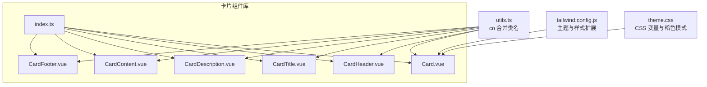
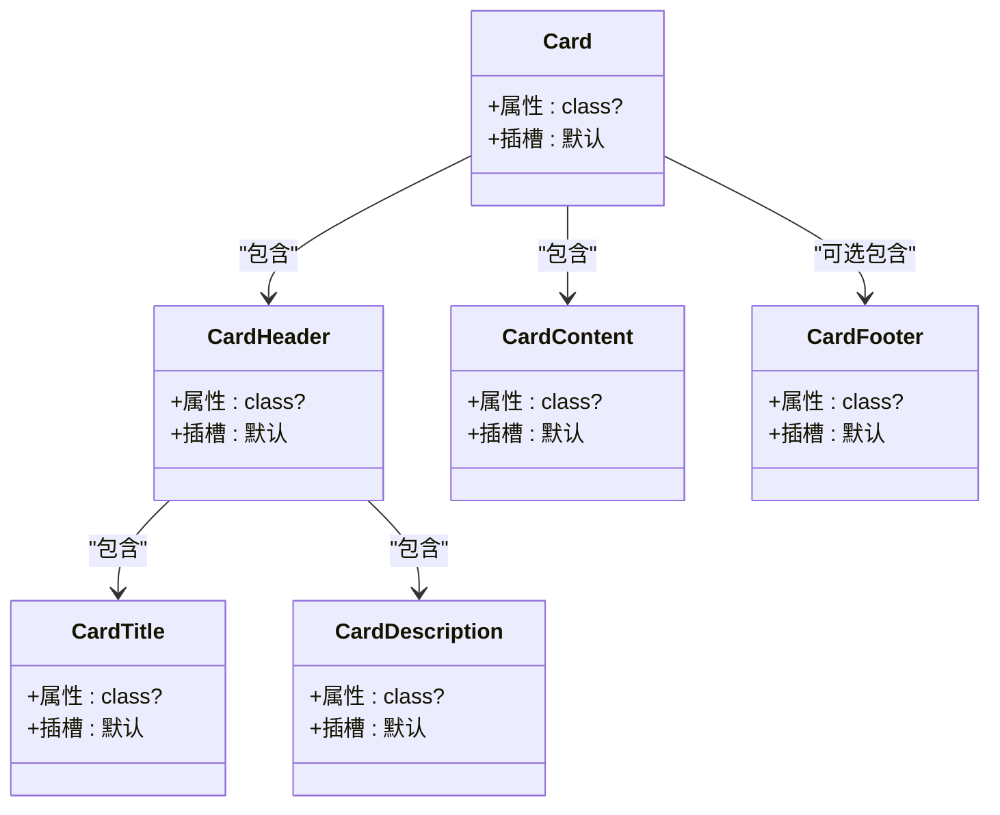
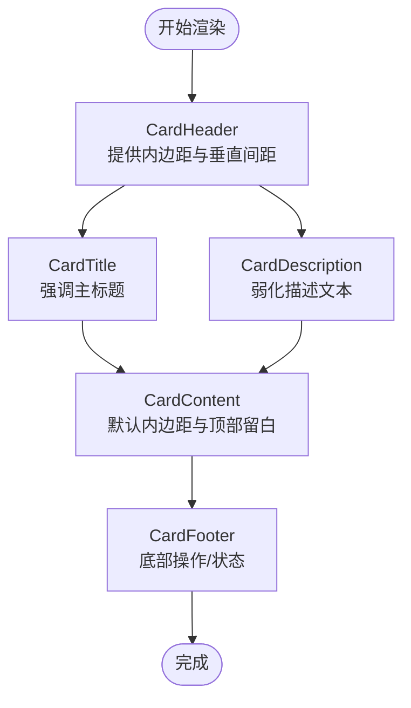
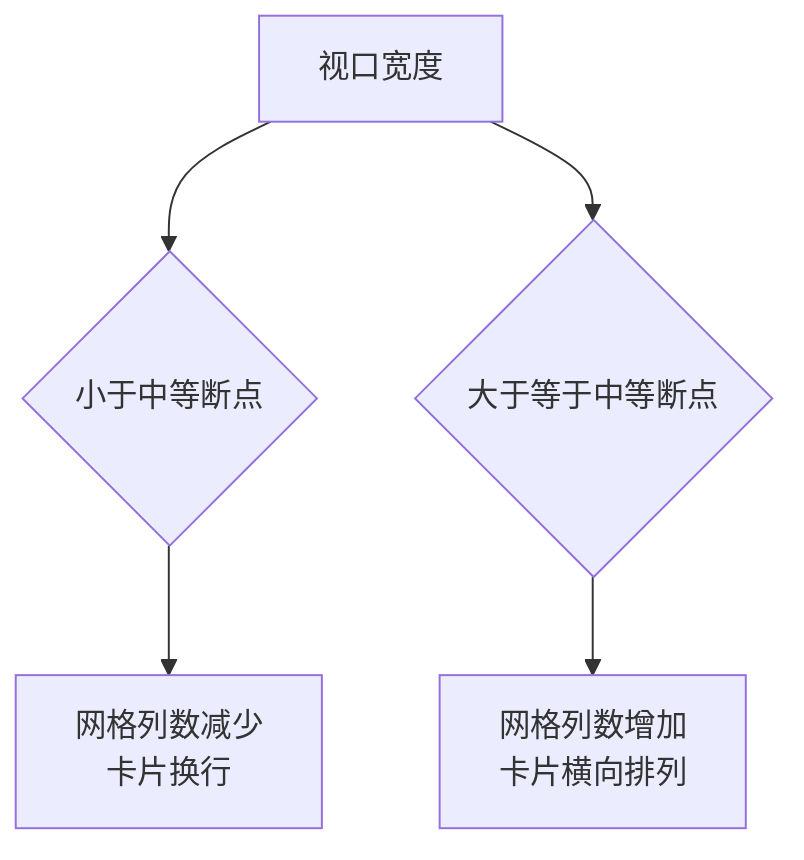
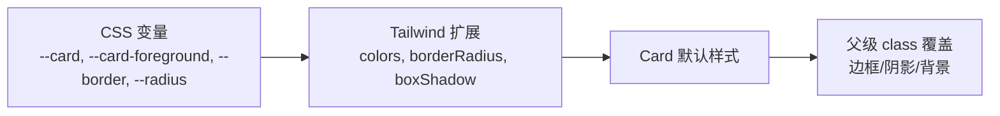
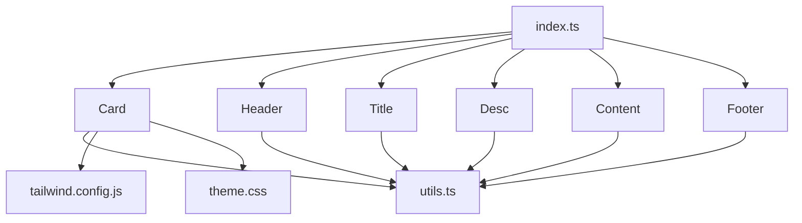

# 布局组件

<cite>
**本文引用的文件**
- [Card.vue](file://apps/frontend/src/components/ui/card/Card.vue)
- [CardContent.vue](file://apps/frontend/src/components/ui/card/CardContent.vue)
- [CardHeader.vue](file://apps/frontend/src/components/ui/card/CardHeader.vue)
- [CardTitle.vue](file://apps/frontend/src/components/ui/card/CardTitle.vue)
- [CardDescription.vue](file://apps/frontend/src/components/ui/card/CardDescription.vue)
- [CardFooter.vue](file://apps/frontend/src/components/ui/card/CardFooter.vue)
- [index.ts](file://apps/frontend/src/components/ui/card/index.ts)
- [utils.ts](file://apps/frontend/src/lib/utils.ts)
- [tailwind.config.js](file://apps/frontend/tailwind.config.js)
- [theme.css](file://apps/frontend/src/styles/theme.css)
- [TodoStatistics.vue](file://apps/frontend/src/features/todo/components/TodoStatistics.vue)
- [McpSettingsView.vue](file://apps/frontend/src/features/mcp/views/McpSettingsView.vue)
</cite>

## 目录

1. [简介](#简介)
2. [项目结构](#项目结构)
3. [核心组件](#核心组件)
4. [架构总览](#架构总览)
5. [详细组件分析](#详细组件分析)
6. [依赖关系分析](#依赖关系分析)
7. [性能考量](#性能考量)
8. [故障排查指南](#故障排查指南)
9. [结论](#结论)
10. [附录](#附录)

## 简介

本文件聚焦 Lumina Todo 前端中的布局 UI 组件“卡片”（Card）体系，系统梳理其设计模式、布局能力、内容组织结构、间距控制与视觉层次，并结合项目中的真实使用场景，说明在不同屏幕尺寸下的自适应行为与响应式策略。同时，给出主题定制、阴影与边框样式的配置方法，以及在任务列表、设置面板、信息展示等场景中的组合使用模式与最佳实践。

## 项目结构

卡片组件位于前端工程的 UI 组件库目录下，采用按功能分层的组织方式：每个子组件独立封装，通过统一的入口导出，便于按需引入与组合使用。整体结构清晰、职责单一，符合 Vue 组合式 API 的组件化风格。



**图表来源**

- [Card.vue:1-15](file://apps/frontend/src/components/ui/card/Card.vue#L1-L15)
- [CardHeader.vue:1-15](file://apps/frontend/src/components/ui/card/CardHeader.vue#L1-L15)
- [CardTitle.vue:1-15](file://apps/frontend/src/components/ui/card/CardTitle.vue#L1-L15)
- [CardDescription.vue:1-15](file://apps/frontend/src/components/ui/card/CardDescription.vue#L1-L15)
- [CardContent.vue:1-15](file://apps/frontend/src/components/ui/card/CardContent.vue#L1-L15)
- [CardFooter.vue:1-15](file://apps/frontend/src/components/ui/card/CardFooter.vue#L1-L15)
- [index.ts:1-7](file://apps/frontend/src/components/ui/card/index.ts#L1-L7)
- [utils.ts:1-33](file://apps/frontend/src/lib/utils.ts#L1-L33)
- [tailwind.config.js:1-303](file://apps/frontend/tailwind.config.js#L1-L303)
- [theme.css:1-170](file://apps/frontend/src/styles/theme.css#L1-L170)

**章节来源**

- [index.ts:1-7](file://apps/frontend/src/components/ui/card/index.ts#L1-L7)
- [utils.ts:1-33](file://apps/frontend/src/lib/utils.ts#L1-L33)
- [tailwind.config.js:1-303](file://apps/frontend/tailwind.config.js#L1-L303)
- [theme.css:1-170](file://apps/frontend/src/styles/theme.css#L1-L170)

## 核心组件

- Card：卡片容器，负责基础边框、背景、圆角与阴影等外观；支持通过 class 扩展样式。
- CardHeader：卡片头部区域，用于标题与描述的分组布局，默认提供合适的内边距与垂直间距。
- CardTitle：卡片标题，强调语义与可读性，适合主标题与副标题的层级区分。
- CardDescription：卡片描述，用于补充说明文字，提供合适的字号与前景色。
- CardContent：卡片内容区，提供默认内边距与顶部留白控制，适配复杂内容布局。
- CardFooter：卡片底部区域，常用于操作按钮或状态提示，支持水平对齐与间距控制。

这些组件均通过统一的 cn 工具函数合并类名，确保与 Tailwind CSS 的原子类协同工作，同时保留用户传入的 class 进行覆盖。

**章节来源**

- [Card.vue:1-15](file://apps/frontend/src/components/ui/card/Card.vue#L1-L15)
- [CardHeader.vue:1-15](file://apps/frontend/src/components/ui/card/CardHeader.vue#L1-L15)
- [CardTitle.vue:1-15](file://apps/frontend/src/components/ui/card/CardTitle.vue#L1-L15)
- [CardDescription.vue:1-15](file://apps/frontend/src/components/ui/card/CardDescription.vue#L1-L15)
- [CardContent.vue:1-15](file://apps/frontend/src/components/ui/card/CardContent.vue#L1-L15)
- [CardFooter.vue:1-15](file://apps/frontend/src/components/ui/card/CardFooter.vue#L1-L15)
- [utils.ts:1-33](file://apps/frontend/src/lib/utils.ts#L1-L33)

## 架构总览

卡片组件的渲染链路简洁明确：父组件通过具名插槽注入内容，子组件仅负责布局与样式，不承担业务逻辑。通过 cn 工具与 Tailwind 类名，组件与主题系统解耦，便于主题切换与样式定制。

```mermaid
sequenceDiagram
participant Parent as "父组件"
participant Card as "Card"
participant Header as "CardHeader"
participant Title as "CardTitle"
participant Desc as "CardDescription"
participant Content as "CardContent"
participant Footer as "CardFooter"
Parent->>Card : 传入 class 扩展样式
Card->>Header : 插槽渲染
Header->>Title : 插槽渲染
Header->>Desc : 插槽渲染
Card->>Content : 插槽渲染
Card->>Footer : 插槽渲染
Note over Card,Footer : 所有子组件均通过 cn 合并类名
```

**图表来源**

- [Card.vue:1-15](file://apps/frontend/src/components/ui/card/Card.vue#L1-L15)
- [CardHeader.vue:1-15](file://apps/frontend/src/components/ui/card/CardHeader.vue#L1-L15)
- [CardTitle.vue:1-15](file://apps/frontend/src/components/ui/card/CardTitle.vue#L1-L15)
- [CardDescription.vue:1-15](file://apps/frontend/src/components/ui/card/CardDescription.vue#L1-L15)
- [CardContent.vue:1-15](file://apps/frontend/src/components/ui/card/CardContent.vue#L1-L15)
- [CardFooter.vue:1-15](file://apps/frontend/src/components/ui/card/CardFooter.vue#L1-L15)
- [utils.ts:1-33](file://apps/frontend/src/lib/utils.ts#L1-L33)

## 详细组件分析

### 设计模式与布局能力

- 组合式设计：每个子组件仅关注自身布局与样式，通过插槽承接父级内容，实现高内聚低耦合。
- 原子类优先：组件内部使用 Tailwind 原子类作为默认样式，保证一致性与可维护性。
- 可扩展性：通过 props.class 允许外部传入额外类名，实现局部覆盖与场景化定制。
- 视觉层次：通过标题、描述、内容区的分层，配合圆角、阴影与背景色，构建清晰的信息层级。



**图表来源**

- [Card.vue:1-15](file://apps/frontend/src/components/ui/card/Card.vue#L1-L15)
- [CardHeader.vue:1-15](file://apps/frontend/src/components/ui/card/CardHeader.vue#L1-L15)
- [CardTitle.vue:1-15](file://apps/frontend/src/components/ui/card/CardTitle.vue#L1-L15)
- [CardDescription.vue:1-15](file://apps/frontend/src/components/ui/card/CardDescription.vue#L1-L15)
- [CardContent.vue:1-15](file://apps/frontend/src/components/ui/card/CardContent.vue#L1-L15)
- [CardFooter.vue:1-15](file://apps/frontend/src/components/ui/card/CardFooter.vue#L1-L15)

**章节来源**

- [Card.vue:1-15](file://apps/frontend/src/components/ui/card/Card.vue#L1-L15)
- [CardHeader.vue:1-15](file://apps/frontend/src/components/ui/card/CardHeader.vue#L1-L15)
- [CardTitle.vue:1-15](file://apps/frontend/src/components/ui/card/CardTitle.vue#L1-L15)
- [CardDescription.vue:1-15](file://apps/frontend/src/components/ui/card/CardDescription.vue#L1-L15)
- [CardContent.vue:1-15](file://apps/frontend/src/components/ui/card/CardContent.vue#L1-L15)
- [CardFooter.vue:1-15](file://apps/frontend/src/components/ui/card/CardFooter.vue#L1-L15)

### 内容组织结构、间距控制与视觉层次

- 头部区域（CardHeader）：提供垂直方向的紧凑排布与默认内边距，适合放置标题与简短描述。
- 标题（CardTitle）：强调字体权重与字距，突出主标题层级。
- 描述（CardDescription）：使用较小字号与“muted”前景色，弱化次要信息。
- 内容区（CardContent）：提供默认内边距与顶部留白控制，适合复杂布局与多组件嵌套。
- 底部区（CardFooter）：常用于操作按钮或状态提示，支持水平对齐与间距控制。
- 容器（Card）：统一的圆角、边框与阴影，作为内容的视觉容器。



**图表来源**

- [CardHeader.vue:1-15](file://apps/frontend/src/components/ui/card/CardHeader.vue#L1-L15)
- [CardTitle.vue:1-15](file://apps/frontend/src/components/ui/card/CardTitle.vue#L1-L15)
- [CardDescription.vue:1-15](file://apps/frontend/src/components/ui/card/CardDescription.vue#L1-L15)
- [CardContent.vue:1-15](file://apps/frontend/src/components/ui/card/CardContent.vue#L1-L15)
- [CardFooter.vue:1-15](file://apps/frontend/src/components/ui/card/CardFooter.vue#L1-L15)

**章节来源**

- [CardHeader.vue:1-15](file://apps/frontend/src/components/ui/card/CardHeader.vue#L1-L15)
- [CardTitle.vue:1-15](file://apps/frontend/src/components/ui/card/CardTitle.vue#L1-L15)
- [CardDescription.vue:1-15](file://apps/frontend/src/components/ui/card/CardDescription.vue#L1-L15)
- [CardContent.vue:1-15](file://apps/frontend/src/components/ui/card/CardContent.vue#L1-L15)
- [CardFooter.vue:1-15](file://apps/frontend/src/components/ui/card/CardFooter.vue#L1-L15)

### 响应式设计与自适应行为

- 断点策略：Tailwind 配置了 xs 到 3xl 的断点，卡片组件本身不直接处理断点，但通过容器类与栅格系统（如示例中的列跨度）实现自适应布局。
- 示例场景：
  - 统计面板中，卡片在大屏上采用多列布局，在小屏上自动换行，保证内容可读性与交互可用性。
  - 设置面板中，卡片在窄屏下仍保持良好的内边距与标题可读性，避免拥挤。



**图表来源**

- [tailwind.config.js:16-24](file://apps/frontend/tailwind.config.js#L16-L24)
- [TodoStatistics.vue:268-294](file://apps/frontend/src/features/todo/components/TodoStatistics.vue#L268-L294)

**章节来源**

- [tailwind.config.js:16-24](file://apps/frontend/tailwind.config.js#L16-L24)
- [TodoStatistics.vue:268-294](file://apps/frontend/src/features/todo/components/TodoStatistics.vue#L268-L294)

### 主题定制、阴影与边框样式

- 主题变量：通过 CSS 变量集中管理颜色与圆角、阴影等视觉参数，支持明/暗两套主题。
- 阴影与圆角：卡片默认使用圆角与阴影，可在父级容器中通过类名覆盖或禁用。
- 边框样式：可通过传入 class 覆盖边框样式，满足不同场景的视觉需求。
- 实战示例：统计面板中使用“无边框 + 浅阴影 + 背景半透 + 模糊”的组合，提升信息卡片的层次感与现代感。



**图表来源**

- [theme.css:1-170](file://apps/frontend/src/styles/theme.css#L1-L170)
- [tailwind.config.js:34-181](file://apps/frontend/tailwind.config.js#L34-L181)
- [Card.vue:1-15](file://apps/frontend/src/components/ui/card/Card.vue#L1-L15)

**章节来源**

- [theme.css:1-170](file://apps/frontend/src/styles/theme.css#L1-L170)
- [tailwind.config.js:34-181](file://apps/frontend/tailwind.config.js#L34-L181)
- [Card.vue:1-15](file://apps/frontend/src/components/ui/card/Card.vue#L1-L15)

### 组合使用模式与最佳实践

- 标准卡片：标题 + 描述 + 内容 + 底部（可选），适用于设置项、信息展示等。
- 信息卡片：在统计面板中，卡片用于承载图表与数据，常配合“无边框 + 浅阴影 + 背景半透 + 模糊”以增强层次。
- 工具卡片：在 MCP 设置面板中，卡片用于展示工具元信息，通过容器类实现圆角与背景半透叠加，提升可读性。
- 最佳实践：
  - 使用 CardHeader 统一头部结构，CardTitle 与 CardDescription 明确层级。
  - 内容区使用 CardContent 并根据场景调整内边距。
  - 通过父级 class 控制阴影、边框与背景，避免在子组件中硬编码样式。
  - 在复杂布局中，将卡片作为容器，内部再嵌套表格、图表或其他组件。

**章节来源**

- [TodoStatistics.vue:268-323](file://apps/frontend/src/features/todo/components/TodoStatistics.vue#L268-L323)
- [McpSettingsView.vue:232-262](file://apps/frontend/src/features/mcp/views/McpSettingsView.vue#L232-L262)

## 依赖关系分析

- 组件间依赖：Card 为根容器，包含 CardHeader、CardContent、CardFooter；CardHeader 包含 CardTitle 与 CardDescription。
- 外部依赖：所有子组件依赖 cn 工具进行类名合并，依赖 Tailwind 原子类与主题变量。
- 导出结构：通过 index.ts 统一导出，便于按需引入与 Tree Shaking。



**图表来源**

- [index.ts:1-7](file://apps/frontend/src/components/ui/card/index.ts#L1-L7)
- [utils.ts:1-33](file://apps/frontend/src/lib/utils.ts#L1-L33)
- [tailwind.config.js:1-303](file://apps/frontend/tailwind.config.js#L1-L303)
- [theme.css:1-170](file://apps/frontend/src/styles/theme.css#L1-L170)

**章节来源**

- [index.ts:1-7](file://apps/frontend/src/components/ui/card/index.ts#L1-L7)
- [utils.ts:1-33](file://apps/frontend/src/lib/utils.ts#L1-L33)
- [tailwind.config.js:1-303](file://apps/frontend/tailwind.config.js#L1-L303)
- [theme.css:1-170](file://apps/frontend/src/styles/theme.css#L1-L170)

## 性能考量

- 类名合并：cn 工具在合并类名时会去重与冲突修复，避免重复样式导致的渲染开销。
- 原子类优先：使用 Tailwind 原子类减少自定义 CSS，提高样式复用效率。
- 组合式组件：子组件职责单一，减少不必要的计算与渲染，提升整体性能。
- 模糊与半透：在统计面板中使用背景半透与模糊时，注意在低端设备上的性能影响，必要时可按需关闭。

## 故障排查指南

- 样式未生效：检查是否正确引入 cn 工具与 Tailwind 原子类；确认父级 class 是否覆盖了默认样式。
- 主题不一致：检查 CSS 变量是否正确加载，确认暗色模式切换逻辑是否生效。
- 响应式异常：检查断点配置与栅格系统使用是否正确，确认卡片容器的列数与间距类名。
- 内容溢出：在内容区使用滚动容器或限制高度，避免卡片被撑破。

## 结论

Lumina Todo 的卡片组件体系以“组合式 + 原子类 + 主题变量”为核心设计思想，既保证了样式的一致性与可维护性，又提供了足够的灵活性以适配多种场景。通过合理的布局组织、间距控制与主题定制，卡片组件能够稳定地支撑任务列表、设置面板与信息展示等界面需求。

## 附录

- 使用建议：
  - 在复杂页面中，优先使用 CardHeader + CardTitle + CardDescription 组织头部信息。
  - 在数据展示场景中，结合 CardContent 的内边距与高度控制，提升可读性。
  - 在设置与工具展示场景中，通过父级 class 覆盖边框、阴影与背景，达到视觉平衡。
- 参考示例：
  - 统计面板卡片组合：[TodoStatistics.vue:268-323](file://apps/frontend/src/features/todo/components/TodoStatistics.vue#L268-L323)
  - MCP 设置工具卡片：[McpSettingsView.vue:232-262](file://apps/frontend/src/features/mcp/views/McpSettingsView.vue#L232-L262)
