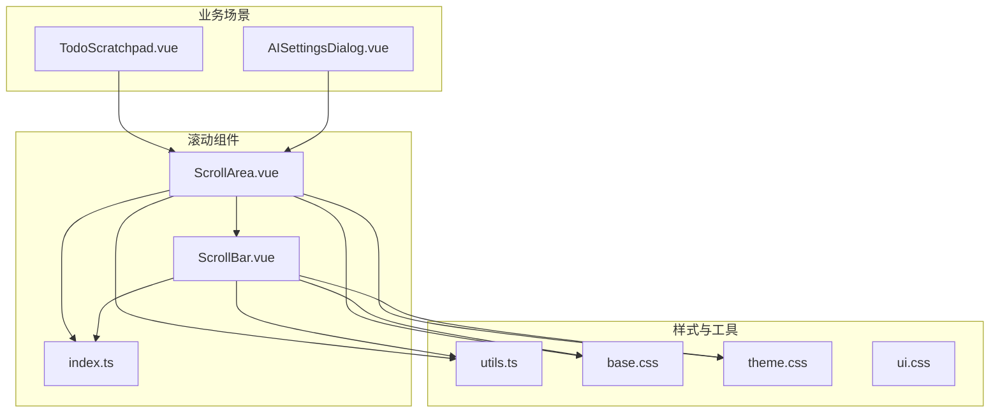
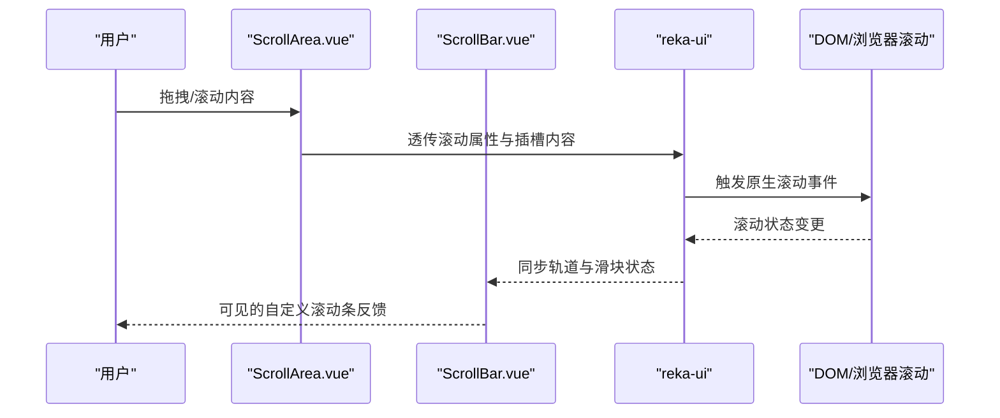
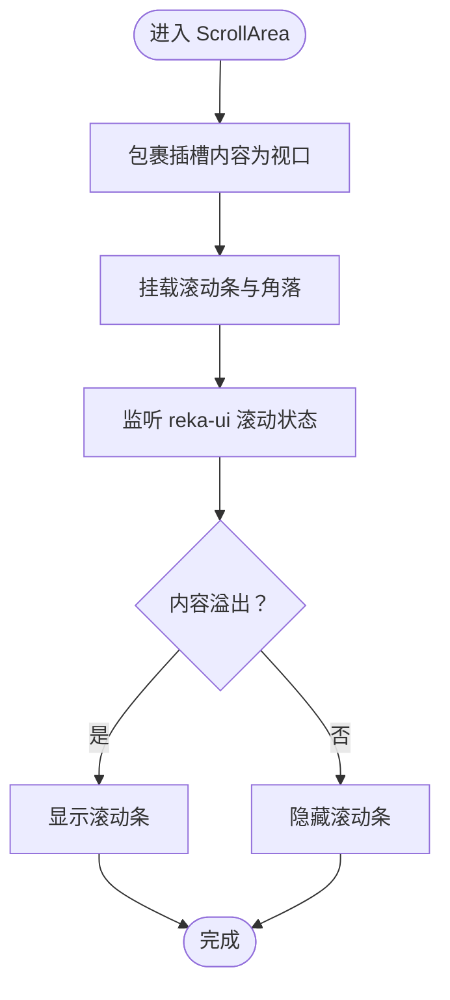
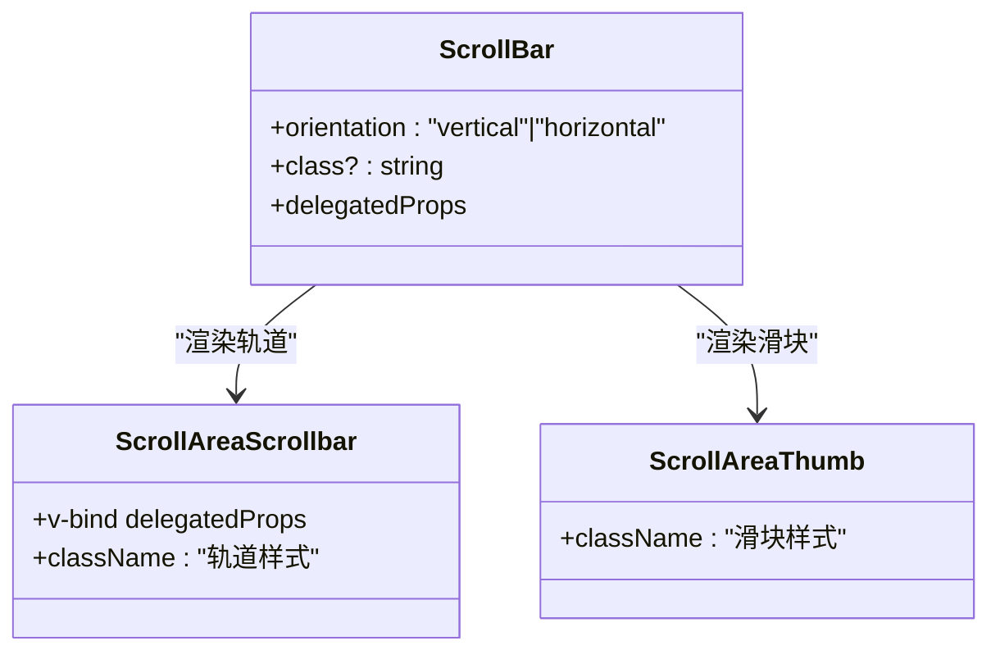
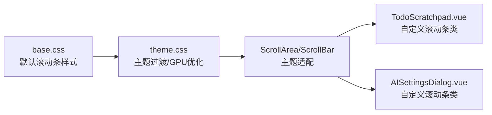
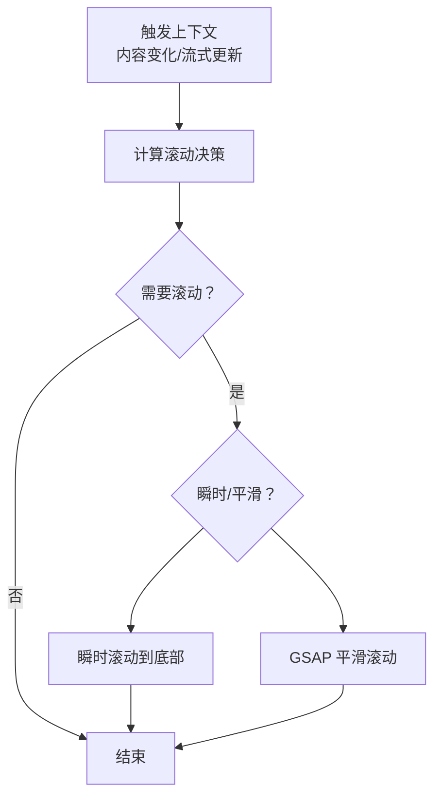
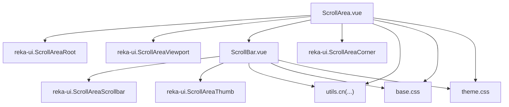

# 滚动组件

<cite>
**本文引用的文件**
- [ScrollArea.vue](file://apps/frontend/src/components/ui/scroll-area/ScrollArea.vue)
- [ScrollBar.vue](file://apps/frontend/src/components/ui/scroll-area/ScrollBar.vue)
- [index.ts](file://apps/frontend/src/components/ui/scroll-area/index.ts)
- [utils.ts](file://apps/frontend/src/lib/utils.ts)
- [base.css](file://apps/frontend/src/styles/base.css)
- [theme.css](file://apps/frontend/src/styles/theme.css)
- [ui.css](file://apps/frontend/src/styles/ui.css)
- [TodoScratchpad.vue](file://apps/frontend/src/features/todo/components/TodoScratchpad.vue)
- [AISettingsDialog.vue](file://apps/frontend/src/features/ai/components/AISettingsDialog.vue)
- [useSmartScroll.ts](file://apps/frontend/src/composables/useSmartScroll.ts)
- [useSmartScroll.internals.ts](file://apps/frontend/src/composables/useSmartScroll.internals.ts)
- [useBodyScrollLock.ts](file://apps/frontend/src/features/todo/composables/useBodyScrollLock.ts)
</cite>

## 目录

1. [简介](#简介)
2. [项目结构](#项目结构)
3. [核心组件](#核心组件)
4. [架构总览](#架构总览)
5. [组件详解](#组件详解)
6. [依赖关系分析](#依赖关系分析)
7. [性能考量](#性能考量)
8. [故障排查指南](#故障排查指南)
9. [结论](#结论)
10. [附录](#附录)

## 简介

本文件系统性梳理 Lumina Todo 前端中的滚动 UI 组件，重点覆盖 ScrollArea（滚动区域）与 ScrollBar（滚动条）两大组件的设计与实现，包括：

- 内容包裹、滚动检测与可见性控制机制
- 自定义滚动条的轨道渲染、滑块定位与交互反馈
- 性能优化策略、虚拟滚动支持现状与扩展建议
- 触摸滚动适配、样式定制与主题适配
- 无障碍访问支持要点
- 在长列表、内容面板、侧边栏等典型场景的应用与体验优化建议

## 项目结构

滚动组件位于前端应用的 UI 组件库目录下，并通过统一出口导出；同时配合主题与基础样式实现一致的视觉与交互体验。

**图示来源**

- [ScrollArea.vue:1-23](file://apps/frontend/src/components/ui/scroll-area/ScrollArea.vue#L1-L23)
- [ScrollBar.vue:1-34](file://apps/frontend/src/components/ui/scroll-area/ScrollBar.vue#L1-L34)
- [index.ts:1-3](file://apps/frontend/src/components/ui/scroll-area/index.ts#L1-L3)
- [utils.ts:1-33](file://apps/frontend/src/lib/utils.ts#L1-L33)
- [base.css:72-88](file://apps/frontend/src/styles/base.css#L72-L88)
- [theme.css:143-149](file://apps/frontend/src/styles/theme.css#L143-L149)
- [ui.css:1-89](file://apps/frontend/src/styles/ui.css#L1-L89)
- [TodoScratchpad.vue:284-299](file://apps/frontend/src/features/todo/components/TodoScratchpad.vue#L284-L299)
- [AISettingsDialog.vue:488-512](file://apps/frontend/src/features/ai/components/AISettingsDialog.vue#L488-L512)

**章节来源**

- [ScrollArea.vue:1-23](file://apps/frontend/src/components/ui/scroll-area/ScrollArea.vue#L1-L23)
- [ScrollBar.vue:1-34](file://apps/frontend/src/components/ui/scroll-area/ScrollBar.vue#L1-L34)
- [index.ts:1-3](file://apps/frontend/src/components/ui/scroll-area/index.ts#L1-L3)
- [utils.ts:1-33](file://apps/frontend/src/lib/utils.ts#L1-L33)
- [base.css:72-88](file://apps/frontend/src/styles/base.css#L72-L88)
- [theme.css:143-149](file://apps/frontend/src/styles/theme.css#L143-L149)
- [ui.css:1-89](file://apps/frontend/src/styles/ui.css#L1-L89)
- [TodoScratchpad.vue:284-299](file://apps/frontend/src/features/todo/components/TodoScratchpad.vue#L284-L299)
- [AISettingsDialog.vue:488-512](file://apps/frontend/src/features/ai/components/AISettingsDialog.vue#L488-L512)

## 核心组件

- ScrollArea（滚动区域）
  - 作为滚动容器根节点，负责将内容包裹在视口内，并挂载滚动条与角落组件。
  - 通过属性透传与类名合并，保证与 reka-ui 的能力对齐且可定制。
- ScrollBar（滚动条）
  - 作为轨道与滑块的组合封装，支持垂直/水平方向切换，提供触控与交互反馈。
  - 通过工具函数合并类名，实现主题与尺寸的灵活适配。

**章节来源**

- [ScrollArea.vue:1-23](file://apps/frontend/src/components/ui/scroll-area/ScrollArea.vue#L1-L23)
- [ScrollBar.vue:1-34](file://apps/frontend/src/components/ui/scroll-area/ScrollBar.vue#L1-L34)
- [index.ts:1-3](file://apps/frontend/src/components/ui/scroll-area/index.ts#L1-L3)
- [utils.ts:5-7](file://apps/frontend/src/lib/utils.ts#L5-L7)

## 架构总览

滚动组件采用“容器 + 自定义滚动条”的分层设计，底层依赖 reka-ui 的原生滚动能力，上层通过轻量封装实现主题化与交互增强。

**图示来源**

- [ScrollArea.vue:14-22](file://apps/frontend/src/components/ui/scroll-area/ScrollArea.vue#L14-L22)
- [ScrollBar.vue:19-33](file://apps/frontend/src/components/ui/scroll-area/ScrollBar.vue#L19-L33)

## 组件详解

### ScrollArea 组件

- 内容包裹
  - 使用滚动根节点包裹视口，视口承载插槽内容，确保滚动区域的尺寸与圆角继承。
- 滚动检测与可见性控制
  - 通过 reka-ui 的滚动状态同步，滚动条仅在内容溢出时显示，避免无意义的 UI 占位。
- 属性与类名
  - 支持透传原生属性与自定义类名，结合工具函数实现类名合并，便于主题与尺寸定制。

**图示来源**

- [ScrollArea.vue:14-22](file://apps/frontend/src/components/ui/scroll-area/ScrollArea.vue#L14-L22)

**章节来源**

- [ScrollArea.vue:1-23](file://apps/frontend/src/components/ui/scroll-area/ScrollArea.vue#L1-L23)

### ScrollBar 组件

- 轨道渲染
  - 垂直轨道宽度固定，水平轨道高度固定；通过边框与内边距实现视觉分隔与触控安全区。
- 滑块定位
  - 滑块基于内容可见比例动态缩放，位置随滚动实时更新，提供直观的滚动进度反馈。
- 交互反馈
  - 通过触控与选择禁用类，确保滚动条在交互过程中的稳定性与一致性。

**图示来源**

- [ScrollBar.vue:8-16](file://apps/frontend/src/components/ui/scroll-area/ScrollBar.vue#L8-L16)
- [ScrollBar.vue:19-33](file://apps/frontend/src/components/ui/scroll-area/ScrollBar.vue#L19-L33)

**章节来源**

- [ScrollBar.vue:1-34](file://apps/frontend/src/components/ui/scroll-area/ScrollBar.vue#L1-L34)

### 样式与主题适配

- 基础滚动条样式
  - 通过全局样式设置默认滚动条宽度、轨道透明与滑块颜色，暗色模式下提供更柔和的对比度。
- 主题过渡与 GPU 加速
  - 主题层提供过渡与 GPU 优化辅助类，提升滚动过程中的流畅度与性能。
- 组件级自定义滚动条
  - 业务组件中可使用自定义滚动条类，针对特定区域（如文本域）提供一致的滚动体验。

**图示来源**

- [base.css:72-88](file://apps/frontend/src/styles/base.css#L72-L88)
- [theme.css:143-149](file://apps/frontend/src/styles/theme.css#L143-L149)
- [ui.css:1-89](file://apps/frontend/src/styles/ui.css#L1-L89)
- [TodoScratchpad.vue:698-723](file://apps/frontend/src/features/todo/components/TodoScratchpad.vue#L698-L723)
- [AISettingsDialog.vue:488-512](file://apps/frontend/src/features/ai/components/AISettingsDialog.vue#L488-L512)

**章节来源**

- [base.css:72-88](file://apps/frontend/src/styles/base.css#L72-L88)
- [theme.css:143-149](file://apps/frontend/src/styles/theme.css#L143-L149)
- [ui.css:1-89](file://apps/frontend/src/styles/ui.css#L1-L89)
- [TodoScratchpad.vue:698-723](file://apps/frontend/src/features/todo/components/TodoScratchpad.vue#L698-L723)
- [AISettingsDialog.vue:488-512](file://apps/frontend/src/features/ai/components/AISettingsDialog.vue#L488-L512)

### 无障碍访问支持

- 基于 reka-ui 的原生滚动能力，滚动条具备标准的键盘与屏幕阅读器可达性。
- 建议在复杂场景中补充：
  - 滚动状态提示（如“已滚动至顶部/底部”）
  - 键盘导航与焦点管理
  - 高对比度与缩放友好性

[本节为通用指导，不直接分析具体文件]

### 性能优化与虚拟滚动支持

- 现状
  - 滚动组件本身依赖 reka-ui 的原生滚动，未内置虚拟滚动实现。
- 优化策略
  - 对超长列表优先采用虚拟滚动（按需渲染可见区域），减少 DOM 节点数量。
  - 结合智能滚动（见下一节）降低频繁重排与重绘。
- 触摸滚动适配
  - 通过工具类与主题层的 GPU 优化，提升移动端滚动流畅度。

[本节为通用指导，不直接分析具体文件]

### 智能滚动与自动粘附

- 智能滚动（useSmartScroll）
  - 根据内容变化、底部阈值、流式更新等上下文，决定是否滚动到底部或瞬时滚动。
  - 通过批处理与节流，避免高频滚动导致的性能问题。
- 用户交互感知
  - 检测用户向上滚动意图，自动暂停自动滚动，提升用户掌控感。
- 流式模式
  - 在消息流等高频更新场景，进入流式模式时强制粘附底部，确保最新内容可见。

**图示来源**

- [useSmartScroll.ts:164-195](file://apps/frontend/src/composables/useSmartScroll.ts#L164-L195)
- [useSmartScroll.ts:100-142](file://apps/frontend/src/composables/useSmartScroll.ts#L100-L142)
- [useSmartScroll.ts:209-240](file://apps/frontend/src/composables/useSmartScroll.ts#L209-L240)

**章节来源**

- [useSmartScroll.ts:1-442](file://apps/frontend/src/composables/useSmartScroll.ts#L1-L442)
- [useSmartScroll.internals.ts:1-200](file://apps/frontend/src/composables/useSmartScroll.internals.ts#L1-L200)

### 场景应用与体验优化

#### 长列表

- 使用 ScrollArea 包裹列表项，结合智能滚动在新增项时自动粘附底部。
- 对超长列表考虑引入虚拟滚动，减少 DOM 节点数量。

**章节来源**

- [TodoScratchpad.vue:284-299](file://apps/frontend/src/features/todo/components/TodoScratchpad.vue#L284-L299)
- [useSmartScroll.ts:182-195](file://apps/frontend/src/composables/useSmartScroll.ts#L182-L195)

#### 内容面板

- 在富文本编辑器或日志面板中，为文本域提供自定义滚动条类，确保一致的滚动体验。
- 配合主题过渡，提升滚动过程中的视觉舒适度。

**章节来源**

- [TodoScratchpad.vue:322-330](file://apps/frontend/src/features/todo/components/TodoScratchpad.vue#L322-L330)
- [TodoScratchpad.vue:461-467](file://apps/frontend/src/features/todo/components/TodoScratchpad.vue#L461-L467)
- [ui.css:1-89](file://apps/frontend/src/styles/ui.css#L1-L89)

#### 侧边栏/抽屉

- 在侧边栏或弹出面板中，结合滚动条与主题样式，确保在窄空间内的可读性与可用性。
- 如需锁定页面滚动，可参考页面滚动锁组合式函数，避免背景滚动影响交互。

**章节来源**

- [useBodyScrollLock.ts:1-52](file://apps/frontend/src/features/todo/composables/useBodyScrollLock.ts#L1-L52)

## 依赖关系分析

- 组件依赖
  - ScrollArea 依赖 reka-ui 的根节点、视口与角落组件，内部组合 ScrollBar。
  - ScrollBar 依赖 reka-ui 的轨道与滑块组件，通过工具函数合并类名。
- 样式依赖
  - 基础滚动条样式与主题过渡由全局样式提供，组件通过类名继承。
- 业务依赖
  - 业务组件通过 ScrollArea 实现内容滚动与交互反馈，部分场景使用自定义滚动条类。

**图示来源**

- [ScrollArea.vue:4-7](file://apps/frontend/src/components/ui/scroll-area/ScrollArea.vue#L4-L7)
- [ScrollBar.vue:4-6](file://apps/frontend/src/components/ui/scroll-area/ScrollBar.vue#L4-L6)
- [utils.ts:5-7](file://apps/frontend/src/lib/utils.ts#L5-L7)
- [base.css:72-88](file://apps/frontend/src/styles/base.css#L72-L88)
- [theme.css:143-149](file://apps/frontend/src/styles/theme.css#L143-L149)

**章节来源**

- [ScrollArea.vue:1-23](file://apps/frontend/src/components/ui/scroll-area/ScrollArea.vue#L1-L23)
- [ScrollBar.vue:1-34](file://apps/frontend/src/components/ui/scroll-area/ScrollBar.vue#L1-L34)
- [utils.ts:1-33](file://apps/frontend/src/lib/utils.ts#L1-L33)
- [base.css:72-88](file://apps/frontend/src/styles/base.css#L72-L88)
- [theme.css:143-149](file://apps/frontend/src/styles/theme.css#L143-L149)

## 性能考量

- 滚动性能
  - 使用 GPU 加速与过渡优化，减少滚动抖动。
  - 对超长列表采用虚拟滚动，限制可见节点数量。
- 交互性能
  - 智能滚动通过批处理与节流，避免高频滚动导致的卡顿。
- 触摸体验
  - 通过主题层与工具类，提升移动端滚动的顺滑度与可预测性。

[本节为通用指导，不直接分析具体文件]

## 故障排查指南

- 滚动条不显示
  - 检查内容是否溢出；确认 ScrollArea 的视口尺寸与内容高度关系。
- 滚动异常或卡顿
  - 检查是否存在大量 DOM 节点；考虑引入虚拟滚动。
  - 确认智能滚动配置（阈值、行为）是否合理。
- 自定义滚动条样式冲突
  - 检查全局样式与组件类名合并逻辑，避免覆盖关键属性。
- 页面背景滚动干扰
  - 在抽屉/模态场景中使用页面滚动锁，避免背景滚动影响交互。

**章节来源**

- [useSmartScroll.ts:245-254](file://apps/frontend/src/composables/useSmartScroll.ts#L245-L254)
- [useSmartScroll.ts:304-342](file://apps/frontend/src/composables/useSmartScroll.ts#L304-L342)
- [useBodyScrollLock.ts:1-52](file://apps/frontend/src/features/todo/composables/useBodyScrollLock.ts#L1-L52)

## 结论

Lumina Todo 的滚动组件以轻量封装的方式集成 reka-ui，实现了主题化、可定制与良好的交互反馈。通过智能滚动与性能优化策略，能够在长列表与复杂场景中维持流畅体验。建议在超长列表场景引入虚拟滚动，并持续完善无障碍与跨平台适配，以进一步提升可用性与可维护性。

## 附录

- 组件导出入口
  - 通过统一出口导出 ScrollArea 与 ScrollBar，便于按需引入与按名称使用。

**章节来源**

- [index.ts:1-3](file://apps/frontend/src/components/ui/scroll-area/index.ts#L1-L3)
