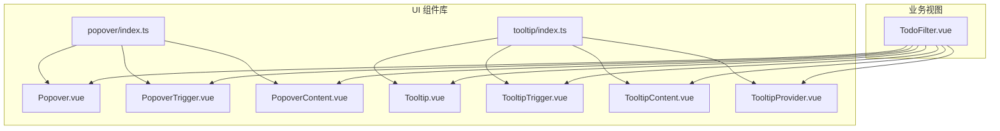
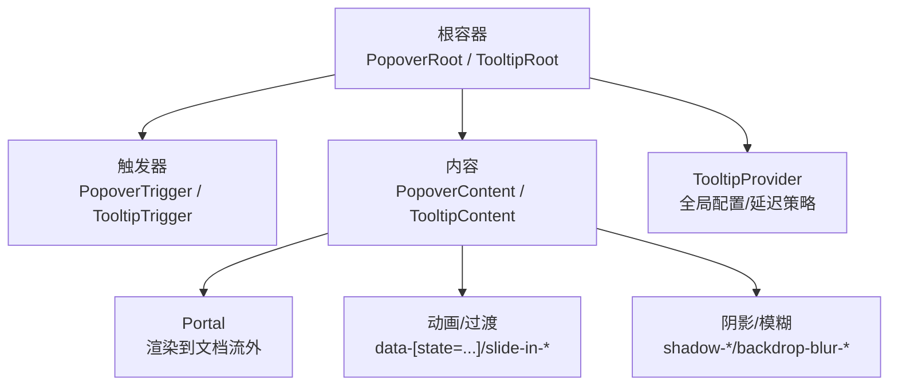
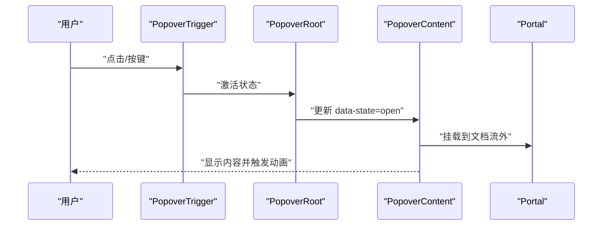
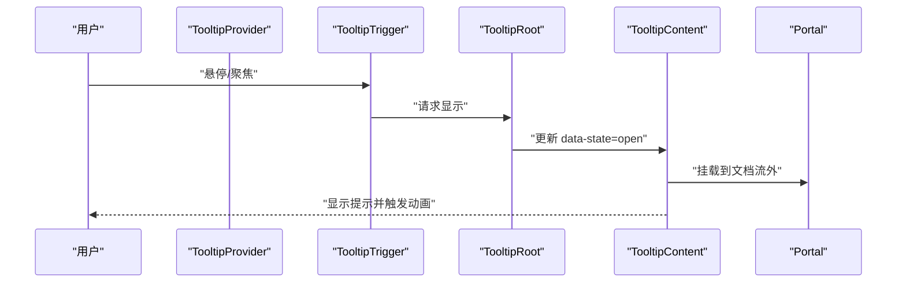
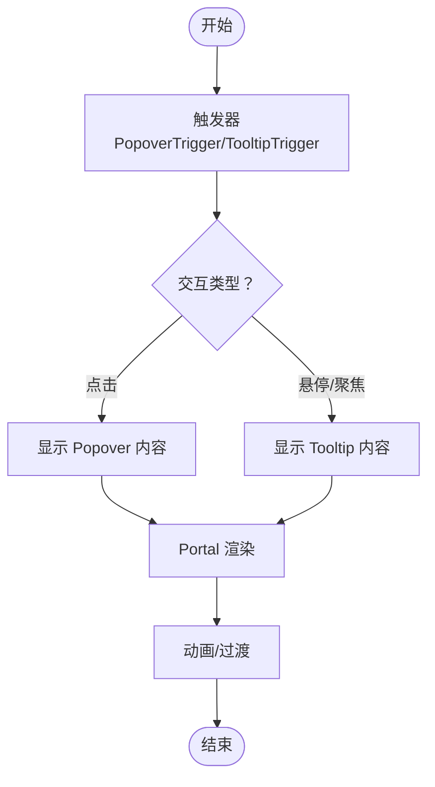
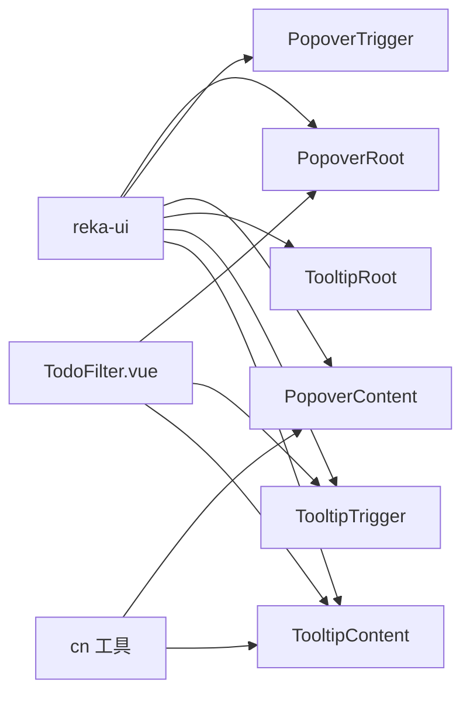

# 覆盖层组件

<cite>
**本文引用的文件**
- [apps/frontend/src/components/ui/popover/index.ts](file://apps/frontend/src/components/ui/popover/index.ts)
- [apps/frontend/src/components/ui/popover/Popover.vue](file://apps/frontend/src/components/ui/popover/Popover.vue)
- [apps/frontend/src/components/ui/popover/PopoverTrigger.vue](file://apps/frontend/src/components/ui/popover/PopoverTrigger.vue)
- [apps/frontend/src/components/ui/popover/PopoverContent.vue](file://apps/frontend/src/components/ui/popover/PopoverContent.vue)
- [apps/frontend/src/components/ui/tooltip/index.ts](file://apps/frontend/src/components/ui/tooltip/index.ts)
- [apps/frontend/src/components/ui/tooltip/Tooltip.vue](file://apps/frontend/src/components/ui/tooltip/Tooltip.vue)
- [apps/frontend/src/components/ui/tooltip/TooltipTrigger.vue](file://apps/frontend/src/components/ui/tooltip/TooltipTrigger.vue)
- [apps/frontend/src/components/ui/tooltip/TooltipContent.vue](file://apps/frontend/src/components/ui/tooltip/TooltipContent.vue)
- [apps/frontend/src/components/ui/tooltip/TooltipProvider.vue](file://apps/frontend/src/components/ui/tooltip/TooltipProvider.vue)
- [apps/frontend/src/features/todo/components/TodoFilter.vue](file://apps/frontend/src/features/todo/components/TodoFilter.vue)
- [apps/frontend/src/lib/utils.ts](file://apps/frontend/src/lib/utils.ts)
- [apps/frontend/package.json](file://apps/frontend/package.json)
</cite>

## 目录
1. [简介](#简介)
2. [项目结构](#项目结构)
3. [核心组件](#核心组件)
4. [架构总览](#架构总览)
5. [详细组件分析](#详细组件分析)
6. [依赖分析](#依赖分析)
7. [性能考虑](#性能考虑)
8. [故障排查指南](#故障排查指南)
9. [结论](#结论)
10. [附录](#附录)

## 简介
本文件聚焦 Lumina Todo 前端覆盖层 UI 组件：Popover（弹出层）与 Tooltip（工具提示）。文档从实现原理、定位算法、显示逻辑、边界检测、Z-index 管理、滚动与触摸适配、动画与阴影、到典型应用场景与交互最佳实践进行系统性梳理，帮助开发者快速理解与正确使用这些组件。

## 项目结构
覆盖层组件位于前端应用的 UI 组件库目录中，并通过 reka-ui 提供底层能力；同时在业务视图中以组合方式使用，例如 TodoFilter 中的 Popover 与 Tooltip 的组合。

**图表来源**
- [apps/frontend/src/components/ui/popover/index.ts:1-4](file://apps/frontend/src/components/ui/popover/index.ts#L1-L4)
- [apps/frontend/src/components/ui/tooltip/index.ts:1-5](file://apps/frontend/src/components/ui/tooltip/index.ts#L1-L5)
- [apps/frontend/src/components/ui/popover/Popover.vue:1-20](file://apps/frontend/src/components/ui/popover/Popover.vue#L1-L20)
- [apps/frontend/src/components/ui/popover/PopoverTrigger.vue:1-12](file://apps/frontend/src/components/ui/popover/PopoverTrigger.vue#L1-L12)
- [apps/frontend/src/components/ui/popover/PopoverContent.vue:1-35](file://apps/frontend/src/components/ui/popover/PopoverContent.vue#L1-L35)
- [apps/frontend/src/components/ui/tooltip/Tooltip.vue:1-16](file://apps/frontend/src/components/ui/tooltip/Tooltip.vue#L1-L16)
- [apps/frontend/src/components/ui/tooltip/TooltipTrigger.vue:1-13](file://apps/frontend/src/components/ui/tooltip/TooltipTrigger.vue#L1-L13)
- [apps/frontend/src/components/ui/tooltip/TooltipContent.vue:1-42](file://apps/frontend/src/components/ui/tooltip/TooltipContent.vue#L1-L42)
- [apps/frontend/src/components/ui/tooltip/TooltipProvider.vue:1-13](file://apps/frontend/src/components/ui/tooltip/TooltipProvider.vue#L1-L13)
- [apps/frontend/src/features/todo/components/TodoFilter.vue:140-204](file://apps/frontend/src/features/todo/components/TodoFilter.vue#L140-L204)

**章节来源**
- [apps/frontend/src/components/ui/popover/index.ts:1-4](file://apps/frontend/src/components/ui/popover/index.ts#L1-L4)
- [apps/frontend/src/components/ui/tooltip/index.ts:1-5](file://apps/frontend/src/components/ui/tooltip/index.ts#L1-L5)

## 核心组件
- Popover：由根容器、触发器与内容组成，内容通过 Portal 渲染至文档流外，支持对齐与偏移配置。
- Tooltip：由提供者、触发器与内容组成，内容同样通过 Portal 渲染，支持方向偏移与动画过渡。
- 共同特性：均使用 reka-ui 的原语，通过 cn 工具类合并 Tailwind 类名，统一动画与阴影风格。

**章节来源**
- [apps/frontend/src/components/ui/popover/Popover.vue:1-20](file://apps/frontend/src/components/ui/popover/Popover.vue#L1-L20)
- [apps/frontend/src/components/ui/popover/PopoverTrigger.vue:1-12](file://apps/frontend/src/components/ui/popover/PopoverTrigger.vue#L1-L12)
- [apps/frontend/src/components/ui/popover/PopoverContent.vue:1-35](file://apps/frontend/src/components/ui/popover/PopoverContent.vue#L1-L35)
- [apps/frontend/src/components/ui/tooltip/Tooltip.vue:1-16](file://apps/frontend/src/components/ui/tooltip/Tooltip.vue#L1-L16)
- [apps/frontend/src/components/ui/tooltip/TooltipTrigger.vue:1-13](file://apps/frontend/src/components/ui/tooltip/TooltipTrigger.vue#L1-L13)
- [apps/frontend/src/components/ui/tooltip/TooltipContent.vue:1-42](file://apps/frontend/src/components/ui/tooltip/TooltipContent.vue#L1-L42)
- [apps/frontend/src/components/ui/tooltip/TooltipProvider.vue:1-13](file://apps/frontend/src/components/ui/tooltip/TooltipProvider.vue#L1-L13)
- [apps/frontend/src/lib/utils.ts:5-7](file://apps/frontend/src/lib/utils.ts#L5-L7)

## 架构总览
覆盖层组件采用“根容器 + 触发器 + 内容 + Portal”的分层架构，根容器负责状态与事件转发，触发器绑定交互，内容承载展示与动画，Portal 解决层级与布局问题。

**图表来源**
- [apps/frontend/src/components/ui/popover/Popover.vue:1-20](file://apps/frontend/src/components/ui/popover/Popover.vue#L1-L20)
- [apps/frontend/src/components/ui/popover/PopoverTrigger.vue:1-12](file://apps/frontend/src/components/ui/popover/PopoverTrigger.vue#L1-L12)
- [apps/frontend/src/components/ui/popover/PopoverContent.vue:1-35](file://apps/frontend/src/components/ui/popover/PopoverContent.vue#L1-L35)
- [apps/frontend/src/components/ui/tooltip/Tooltip.vue:1-16](file://apps/frontend/src/components/ui/tooltip/Tooltip.vue#L1-L16)
- [apps/frontend/src/components/ui/tooltip/TooltipTrigger.vue:1-13](file://apps/frontend/src/components/ui/tooltip/TooltipTrigger.vue#L1-L13)
- [apps/frontend/src/components/ui/tooltip/TooltipContent.vue:1-42](file://apps/frontend/src/components/ui/tooltip/TooltipContent.vue#L1-L42)
- [apps/frontend/src/components/ui/tooltip/TooltipProvider.vue:1-13](file://apps/frontend/src/components/ui/tooltip/TooltipProvider.vue#L1-L13)

## 详细组件分析

### Popover 组件
- 触发方式：通过 PopoverTrigger 包裹目标元素，点击或按键激活根容器状态，进而控制内容显隐。
- 内容承载：PopoverContent 支持自定义宽度、圆角、边框、背景与模糊效果，Slot 承载任意内容。
- 边界检测与定位：通过 reka-ui 的定位算法与侧向偏移（sideOffset）及对齐（align）参数实现自动避障与对齐。
- 动画与过渡：使用 data-state 属性驱动进入/退出动画，结合 slide-in-* 位移与缩放/淡入淡出组合。
- Z-index 管理：内容默认 z-50，确保在大多数场景下覆盖页面元素；业务层可按需提升层级。
- 滚动与触摸：Portal 渲染避免被父级滚动裁剪；触摸设备上保持与桌面一致的触发与定位行为。
- 响应式定位：可通过 props 配置 side 与 align，在不同屏幕尺寸下自动调整方向与对齐。

**图表来源**
- [apps/frontend/src/components/ui/popover/PopoverTrigger.vue:1-12](file://apps/frontend/src/components/ui/popover/PopoverTrigger.vue#L1-L12)
- [apps/frontend/src/components/ui/popover/Popover.vue:1-20](file://apps/frontend/src/components/ui/popover/Popover.vue#L1-L20)
- [apps/frontend/src/components/ui/popover/PopoverContent.vue:1-35](file://apps/frontend/src/components/ui/popover/PopoverContent.vue#L1-L35)

**章节来源**
- [apps/frontend/src/components/ui/popover/Popover.vue:1-20](file://apps/frontend/src/components/ui/popover/Popover.vue#L1-L20)
- [apps/frontend/src/components/ui/popover/PopoverTrigger.vue:1-12](file://apps/frontend/src/components/ui/popover/PopoverTrigger.vue#L1-L12)
- [apps/frontend/src/components/ui/popover/PopoverContent.vue:1-35](file://apps/frontend/src/components/ui/popover/PopoverContent.vue#L1-L35)

### Tooltip 组件
- 触发方式：TooltipTrigger 包裹目标元素，鼠标悬停/键盘聚焦时显示；TooltipProvider 可统一配置延迟、禁用等策略。
- 显示逻辑：基于 reka-ui 的状态机，通过 data-state 控制显示/隐藏；内容默认带小字号、内边距与圆角。
- 定位算法：支持上下左右四个方向与 sideOffset 偏移；内部根据可用空间自动微调方向与对齐。
- 多行文本支持：内容区域使用 overflow-hidden 并配合紧凑内边距，建议在 Slot 中使用段落/列表实现多行。
- 动画与过渡：进入/退出使用淡入淡出与缩放组合，配合 slide-in-* 实现从目标边缘滑入。
- Z-index 管理：默认 z-50，Portal 渲染保证层级覆盖；与业务层其他浮层共同遵循层级规划。
- 滚动与触摸：Portal 与定位算法在滚动与触摸场景下保持稳定；移动端建议结合 TooltipProvider 的禁用策略优化体验。
- 响应式定位：在窄屏下优先选择更安全的方向（如上方/下方），避免遮挡。

**图表来源**
- [apps/frontend/src/components/ui/tooltip/TooltipProvider.vue:1-13](file://apps/frontend/src/components/ui/tooltip/TooltipProvider.vue#L1-L13)
- [apps/frontend/src/components/ui/tooltip/TooltipTrigger.vue:1-13](file://apps/frontend/src/components/ui/tooltip/TooltipTrigger.vue#L1-L13)
- [apps/frontend/src/components/ui/tooltip/Tooltip.vue:1-16](file://apps/frontend/src/components/ui/tooltip/Tooltip.vue#L1-L16)
- [apps/frontend/src/components/ui/tooltip/TooltipContent.vue:1-42](file://apps/frontend/src/components/ui/tooltip/TooltipContent.vue#L1-L42)

**章节来源**
- [apps/frontend/src/components/ui/tooltip/Tooltip.vue:1-16](file://apps/frontend/src/components/ui/tooltip/Tooltip.vue#L1-L16)
- [apps/frontend/src/components/ui/tooltip/TooltipTrigger.vue:1-13](file://apps/frontend/src/components/ui/tooltip/TooltipTrigger.vue#L1-L13)
- [apps/frontend/src/components/ui/tooltip/TooltipContent.vue:1-42](file://apps/frontend/src/components/ui/tooltip/TooltipContent.vue#L1-L42)
- [apps/frontend/src/components/ui/tooltip/TooltipProvider.vue:1-13](file://apps/frontend/src/components/ui/tooltip/TooltipProvider.vue#L1-L13)

### 业务场景与交互最佳实践
- TodoFilter 中的组合使用：在按钮组中，Popover 用于确认对话框，Tooltip 用于悬浮提示，二者通过 TooltipProvider 统一管理。
- 最佳实践要点：
  - 合理设置 sideOffset 与 align，避免遮挡触发器或超出视口。
  - 对于长文本，建议拆分为段落或使用列表，避免超宽导致布局异常。
  - 移动端优先考虑点击触发，避免过长的 hover 时间；必要时通过 TooltipProvider 关闭 hover 行为。
  - 使用 Portal 与 z-50 确保层级覆盖，避免被抽屉/模态框等更高层级遮挡。
  - 为关键操作同时提供 Tooltip 与可见文案，兼顾无障碍与易用性。

**图表来源**
- [apps/frontend/src/features/todo/components/TodoFilter.vue:140-204](file://apps/frontend/src/features/todo/components/TodoFilter.vue#L140-L204)

**章节来源**
- [apps/frontend/src/features/todo/components/TodoFilter.vue:140-204](file://apps/frontend/src/features/todo/components/TodoFilter.vue#L140-L204)

## 依赖分析
- 组件依赖 reka-ui：Popover 与 Tooltip 均基于 reka-ui 的根容器、触发器与内容组件，具备成熟的定位与状态管理能力。
- 工具函数：cn 工具用于合并 Tailwind 类，确保样式覆盖与冲突最小化。
- 业务集成：TodoFilter 将 Popover 与 Tooltip 组合使用，体现覆盖层组件在真实场景中的协作模式。

**图表来源**
- [apps/frontend/package.json:60-60](file://apps/frontend/package.json#L60-L60)
- [apps/frontend/src/lib/utils.ts:5-7](file://apps/frontend/src/lib/utils.ts#L5-L7)
- [apps/frontend/src/components/ui/popover/Popover.vue:1-20](file://apps/frontend/src/components/ui/popover/Popover.vue#L1-L20)
- [apps/frontend/src/components/ui/tooltip/Tooltip.vue:1-16](file://apps/frontend/src/components/ui/tooltip/Tooltip.vue#L1-L16)
- [apps/frontend/src/features/todo/components/TodoFilter.vue:140-204](file://apps/frontend/src/features/todo/components/TodoFilter.vue#L140-L204)

**章节来源**
- [apps/frontend/package.json:60-60](file://apps/frontend/package.json#L60-L60)
- [apps/frontend/src/lib/utils.ts:5-7](file://apps/frontend/src/lib/utils.ts#L5-L7)

## 性能考虑
- 渲染路径：内容通过 Portal 渲染，减少父级布局抖动，提高复杂页面下的稳定性。
- 动画开销：动画使用 CSS 过渡与数据属性驱动，避免频繁 JS 计算；建议在低端设备上适当减少复杂阴影与模糊。
- 事件监听：触发器仅在必要时注册事件，避免全局监听造成性能损耗。
- 响应式与布局：合理设置 sideOffset 与 align，减少重排与回流；在移动端优先使用点击触发，降低 hover 的额外计算。

## 故障排查指南
- 内容未显示
  - 检查是否正确包裹在根容器中（PopoverRoot/TooltipRoot）。
  - 确认触发器是否正确绑定（PopoverTrigger/TooltipTrigger）。
  - 核对 Portal 是否生效（内容是否挂载到文档流外）。
- 定位异常
  - 调整 sideOffset 与 align 参数，避免超出视口或遮挡触发器。
  - 在窄屏或嵌套滚动容器中，优先选择更安全的方向（上方/下方）。
- 层级问题
  - 若被抽屉/模态框遮挡，适当提升 z-index 或调整渲染顺序。
- 动画卡顿
  - 减少复杂阴影与模糊层级；在低端设备上简化动画组合。
- 触摸设备体验差
  - 通过 TooltipProvider 关闭 hover 行为，改用点击触发；或为关键提示提供替代文案。

## 结论
Popover 与 Tooltip 在 Lumina Todo 中承担了重要的上下文信息承载与交互提示职责。通过 reka-ui 的定位与状态管理、Portal 的层级隔离、以及 cn 工具的样式合并，两者实现了稳定的跨平台体验。在实际业务中，建议结合业务场景合理配置定位与动画，并遵循层级与性能的最佳实践，以获得一致且高效的用户体验。

## 附录
- 术语
  - 根容器：负责状态与事件转发的顶层组件（PopoverRoot/TooltipRoot）。
  - 触发器：绑定交互事件的目标元素（PopoverTrigger/TooltipTrigger）。
  - 内容：承载展示内容的面板（PopoverContent/TooltipContent）。
  - Portal：将内容渲染到文档流外的容器，解决层级与布局问题。
- 相关文件索引
  - [apps/frontend/src/components/ui/popover/index.ts:1-4](file://apps/frontend/src/components/ui/popover/index.ts#L1-L4)
  - [apps/frontend/src/components/ui/tooltip/index.ts:1-5](file://apps/frontend/src/components/ui/tooltip/index.ts#L1-L5)
  - [apps/frontend/src/components/ui/popover/Popover.vue:1-20](file://apps/frontend/src/components/ui/popover/Popover.vue#L1-L20)
  - [apps/frontend/src/components/ui/popover/PopoverTrigger.vue:1-12](file://apps/frontend/src/components/ui/popover/PopoverTrigger.vue#L1-L12)
  - [apps/frontend/src/components/ui/popover/PopoverContent.vue:1-35](file://apps/frontend/src/components/ui/popover/PopoverContent.vue#L1-L35)
  - [apps/frontend/src/components/ui/tooltip/Tooltip.vue:1-16](file://apps/frontend/src/components/ui/tooltip/Tooltip.vue#L1-L16)
  - [apps/frontend/src/components/ui/tooltip/TooltipTrigger.vue:1-13](file://apps/frontend/src/components/ui/tooltip/TooltipTrigger.vue#L1-L13)
  - [apps/frontend/src/components/ui/tooltip/TooltipContent.vue:1-42](file://apps/frontend/src/components/ui/tooltip/TooltipContent.vue#L1-L42)
  - [apps/frontend/src/components/ui/tooltip/TooltipProvider.vue:1-13](file://apps/frontend/src/components/ui/tooltip/TooltipProvider.vue#L1-L13)
  - [apps/frontend/src/features/todo/components/TodoFilter.vue:140-204](file://apps/frontend/src/features/todo/components/TodoFilter.vue#L140-L204)
  - [apps/frontend/src/lib/utils.ts:5-7](file://apps/frontend/src/lib/utils.ts#L5-L7)
  - [apps/frontend/package.json:60-60](file://apps/frontend/package.json#L60-L60)