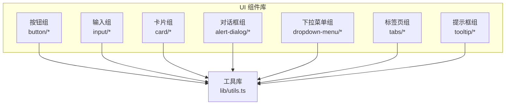
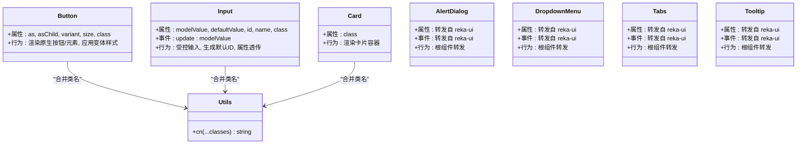
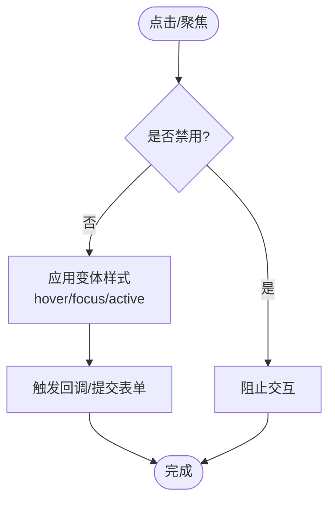
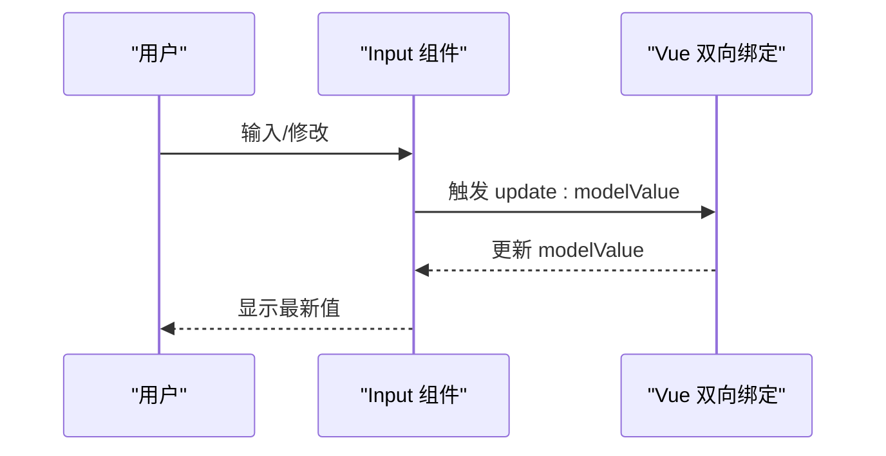
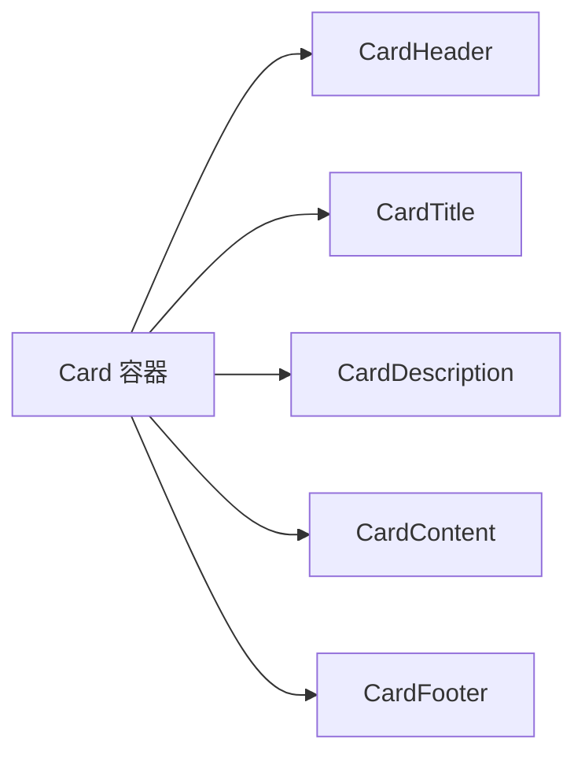
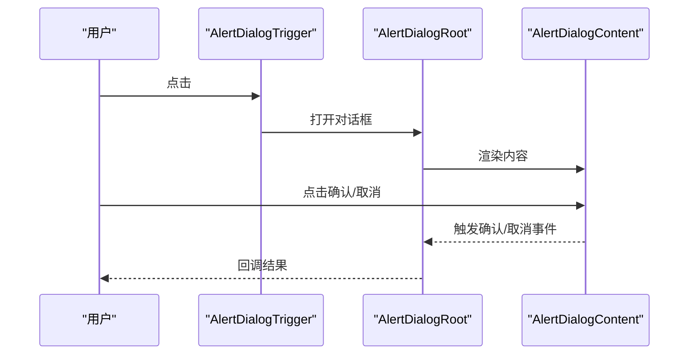
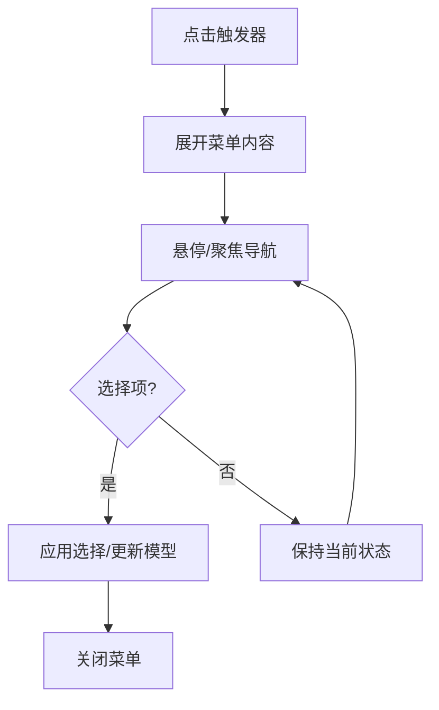
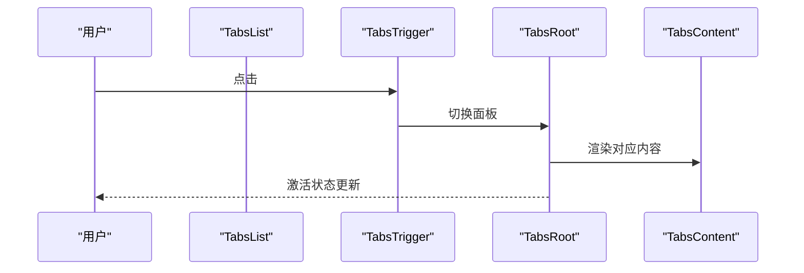
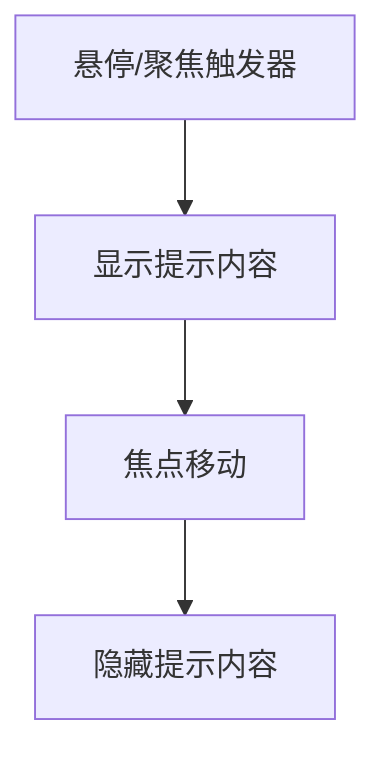
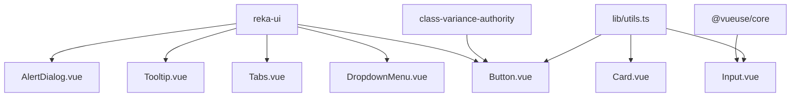

# UI基础组件

<cite>
**本文引用的文件**
- [apps/frontend/src/components/ui/button/Button.vue](file://apps/frontend/src/components/ui/button/Button.vue)
- [apps/frontend/src/components/ui/button/index.ts](file://apps/frontend/src/components/ui/button/index.ts)
- [apps/frontend/src/components/ui/input/Input.vue](file://apps/frontend/src/components/ui/input/Input.vue)
- [apps/frontend/src/components/ui/input/index.ts](file://apps/frontend/src/components/ui/input/index.ts)
- [apps/frontend/src/components/ui/card/Card.vue](file://apps/frontend/src/components/ui/card/Card.vue)
- [apps/frontend/src/components/ui/card/index.ts](file://apps/frontend/src/components/ui/card/index.ts)
- [apps/frontend/src/components/ui/alert-dialog/AlertDialog.vue](file://apps/frontend/src/components/ui/alert-dialog/AlertDialog.vue)
- [apps/frontend/src/components/ui/alert-dialog/index.ts](file://apps/frontend/src/components/ui/alert-dialog/index.ts)
- [apps/frontend/src/components/ui/dropdown-menu/DropdownMenu.vue](file://apps/frontend/src/components/ui/dropdown-menu/DropdownMenu.vue)
- [apps/frontend/src/components/ui/dropdown-menu/index.ts](file://apps/frontend/src/components/ui/dropdown-menu/index.ts)
- [apps/frontend/src/components/ui/tabs/Tabs.vue](file://apps/frontend/src/components/ui/tabs/Tabs.vue)
- [apps/frontend/src/components/ui/tabs/index.ts](file://apps/frontend/src/components/ui/tabs/index.ts)
- [apps/frontend/src/components/ui/tooltip/Tooltip.vue](file://apps/frontend/src/components/ui/tooltip/Tooltip.vue)
- [apps/frontend/src/components/ui/tooltip/index.ts](file://apps/frontend/src/components/ui/tooltip/index.ts)
- [apps/frontend/src/lib/utils.ts](file://apps/frontend/src/lib/utils.ts)
</cite>

## 目录
1. [简介](#简介)
2. [项目结构](#项目结构)
3. [核心组件](#核心组件)
4. [架构总览](#架构总览)
5. [组件详解](#组件详解)
6. [依赖关系分析](#依赖关系分析)
7. [性能与可访问性](#性能与可访问性)
8. [测试与质量保障](#测试与质量保障)
9. [结论](#结论)
10. [附录](#附录)

## 简介
本文件系统化梳理 Lumina Todo 前端应用的 UI 基础组件库，覆盖按钮、输入框、卡片、对话框、下拉菜单、标签页、提示框等核心组件。文档从设计理念、实现架构、属性与样式、主题与可访问性、响应式与跨浏览器兼容性、组合与状态管理、事件处理、开发规范、测试与维护策略等方面进行深入说明，帮助开发者高效、一致地构建用户界面。

## 项目结构
UI 组件集中位于前端应用的组件目录中，采用按功能域分层的组织方式：每个组件族（如 button、input、card 等）独立子目录，内部包含具体组件与统一的入口导出文件。组件普遍遵循“容器组件 + 变体/样式工具”的模式，并通过共享工具函数实现样式合并与主题适配。

图表来源
- [apps/frontend/src/components/ui/button/index.ts:1-38](file://apps/frontend/src/components/ui/button/index.ts#L1-L38)
- [apps/frontend/src/components/ui/input/index.ts:1-2](file://apps/frontend/src/components/ui/input/index.ts#L1-L2)
- [apps/frontend/src/components/ui/card/index.ts:1-7](file://apps/frontend/src/components/ui/card/index.ts#L1-L7)
- [apps/frontend/src/components/ui/alert-dialog/index.ts:1-10](file://apps/frontend/src/components/ui/alert-dialog/index.ts#L1-L10)
- [apps/frontend/src/components/ui/dropdown-menu/index.ts:1-17](file://apps/frontend/src/components/ui/dropdown-menu/index.ts#L1-L17)
- [apps/frontend/src/components/ui/tabs/index.ts:1-5](file://apps/frontend/src/components/ui/tabs/index.ts#L1-L5)
- [apps/frontend/src/components/ui/tooltip/index.ts:1-5](file://apps/frontend/src/components/ui/tooltip/index.ts#L1-L5)
- [apps/frontend/src/lib/utils.ts](file://apps/frontend/src/lib/utils.ts)

章节来源
- [apps/frontend/src/components/ui/button/index.ts:1-38](file://apps/frontend/src/components/ui/button/index.ts#L1-L38)
- [apps/frontend/src/components/ui/input/index.ts:1-2](file://apps/frontend/src/components/ui/input/index.ts#L1-L2)
- [apps/frontend/src/components/ui/card/index.ts:1-7](file://apps/frontend/src/components/ui/card/index.ts#L1-L7)
- [apps/frontend/src/components/ui/alert-dialog/index.ts:1-10](file://apps/frontend/src/components/ui/alert-dialog/index.ts#L1-L10)
- [apps/frontend/src/components/ui/dropdown-menu/index.ts:1-17](file://apps/frontend/src/components/ui/dropdown-menu/index.ts#L1-L17)
- [apps/frontend/src/components/ui/tabs/index.ts:1-5](file://apps/frontend/src/components/ui/tabs/index.ts#L1-L5)
- [apps/frontend/src/components/ui/tooltip/index.ts:1-5](file://apps/frontend/src/components/ui/tooltip/index.ts#L1-L5)

## 核心组件
- 按钮组：提供多种语义与尺寸的按钮，支持原生元素透传与类名合并。
- 输入框：基于 v-model 的受控封装，提供默认 ID 生成与属性透传。
- 卡片组：由卡片容器与标题、描述、内容、页脚等子组件构成，便于结构化展示。
- 对话框组：基于 reka-ui 的根组件转发，提供触发器、内容、标题、描述、页脚等组合部件。
- 下拉菜单组：包含触发器、内容、子菜单、单选/复选项、分隔符、快捷键等丰富子组件。
- 标签页组：提供列表、触发器与内容区的组合，支持多面板切换。
- 提示框组：提供提供者、触发器与内容的组合，用于轻量信息提示。

章节来源
- [apps/frontend/src/components/ui/button/Button.vue:1-32](file://apps/frontend/src/components/ui/button/Button.vue#L1-L32)
- [apps/frontend/src/components/ui/input/Input.vue:1-42](file://apps/frontend/src/components/ui/input/Input.vue#L1-L42)
- [apps/frontend/src/components/ui/card/Card.vue:1-15](file://apps/frontend/src/components/ui/card/Card.vue#L1-L15)
- [apps/frontend/src/components/ui/alert-dialog/AlertDialog.vue:1-16](file://apps/frontend/src/components/ui/alert-dialog/AlertDialog.vue#L1-L16)
- [apps/frontend/src/components/ui/dropdown-menu/DropdownMenu.vue:1-16](file://apps/frontend/src/components/ui/dropdown-menu/DropdownMenu.vue#L1-L16)
- [apps/frontend/src/components/ui/tabs/Tabs.vue:1-16](file://apps/frontend/src/components/ui/tabs/Tabs.vue#L1-L16)
- [apps/frontend/src/components/ui/tooltip/Tooltip.vue:1-16](file://apps/frontend/src/components/ui/tooltip/Tooltip.vue#L1-L16)

## 架构总览
组件库采用“容器 + 变体 + 工具”三层架构：
- 容器组件：负责结构与行为转发，通常直接渲染原生元素或 reka-ui 根组件。
- 变体定义：通过 class-variance-authority 定义不同语义与尺寸的样式集合。
- 工具函数：通过 cn 合并类名，确保默认样式与自定义样式的稳定叠加。

图表来源
- [apps/frontend/src/components/ui/button/Button.vue:1-32](file://apps/frontend/src/components/ui/button/Button.vue#L1-L32)
- [apps/frontend/src/components/ui/input/Input.vue:1-42](file://apps/frontend/src/components/ui/input/Input.vue#L1-L42)
- [apps/frontend/src/components/ui/card/Card.vue:1-15](file://apps/frontend/src/components/ui/card/Card.vue#L1-L15)
- [apps/frontend/src/components/ui/alert-dialog/AlertDialog.vue:1-16](file://apps/frontend/src/components/ui/alert-dialog/AlertDialog.vue#L1-L16)
- [apps/frontend/src/components/ui/dropdown-menu/DropdownMenu.vue:1-16](file://apps/frontend/src/components/ui/dropdown-menu/DropdownMenu.vue#L1-L16)
- [apps/frontend/src/components/ui/tabs/Tabs.vue:1-16](file://apps/frontend/src/components/ui/tabs/Tabs.vue#L1-L16)
- [apps/frontend/src/components/ui/tooltip/Tooltip.vue:1-16](file://apps/frontend/src/components/ui/tooltip/Tooltip.vue#L1-L16)
- [apps/frontend/src/lib/utils.ts](file://apps/frontend/src/lib/utils.ts)

## 组件详解

### 按钮 Button
- 设计理念：通过变体与尺寸控制视觉与交互层级，保持一致的过渡与焦点环样式；支持将任意原生元素作为渲染基元。
- 关键属性
  - as/asChild：控制渲染元素类型与子元素透传。
  - variant：语义风格（如 default、destructive、outline、secondary、ghost、link）。
  - size：尺寸规格（如 default、xs、sm、lg、icon、icon-sm、icon-lg）。
  - class：自定义扩展样式。
- 样式与主题
  - 使用变体工厂定义默认类名集合，结合 cn 合并传入 class，保证主题变量与禁用态的一致表现。
- 事件与可访问性
  - 作为原生按钮时具备默认可访问性；通过 as/asChild 可替换为链接等非按钮元素时需自行补充角色与键盘行为。
- 组合与状态
  - 支持在按钮内嵌入图标与文本；与表单联动时建议配合禁用态与加载态。

图表来源
- [apps/frontend/src/components/ui/button/Button.vue:1-32](file://apps/frontend/src/components/ui/button/Button.vue#L1-L32)
- [apps/frontend/src/components/ui/button/index.ts:7-35](file://apps/frontend/src/components/ui/button/index.ts#L7-L35)

章节来源
- [apps/frontend/src/components/ui/button/Button.vue:1-32](file://apps/frontend/src/components/ui/button/Button.vue#L1-L32)
- [apps/frontend/src/components/ui/button/index.ts:1-38](file://apps/frontend/src/components/ui/button/index.ts#L1-L38)

### 输入框 Input
- 设计理念：提供受控输入能力，自动处理 v-model 与默认 ID，保留所有原生 input 行为并通过 $attrs 透传。
- 关键属性
  - modelValue/defaultValue：受控/非受控值。
  - id/name：标识与语义化标签关联。
  - class：自定义扩展样式。
- 样式与主题
  - 默认包含边框、圆角、占位符颜色、焦点环、禁用态等通用样式，便于快速接入。
- 可访问性与表单集成
  - 自动生成唯一 id，避免重复；与 label 配合提升可访问性。
- 组合与状态
  - 可与按钮、图标、错误提示等组合；在表单校验场景中建议与外部验证库协同。

图表来源
- [apps/frontend/src/components/ui/input/Input.vue:1-42](file://apps/frontend/src/components/ui/input/Input.vue#L1-L42)

章节来源
- [apps/frontend/src/components/ui/input/Input.vue:1-42](file://apps/frontend/src/components/ui/input/Input.vue#L1-L42)
- [apps/frontend/src/components/ui/input/index.ts:1-2](file://apps/frontend/src/components/ui/input/index.ts#L1-L2)

### 卡片 Card
- 设计理念：以容器承载复杂内容，通过头部、标题、描述、内容、页脚等子组件实现清晰的信息层次。
- 关键属性
  - class：自定义扩展样式。
- 样式与主题
  - 默认卡片背景、边框与阴影，适配深浅主题；子组件进一步细化语义区域。
- 组合与状态
  - 建议与按钮、列表、图片等组合使用；在加载/空态场景中可结合骨架屏。

图表来源
- [apps/frontend/src/components/ui/card/Card.vue:1-15](file://apps/frontend/src/components/ui/card/Card.vue#L1-L15)
- [apps/frontend/src/components/ui/card/index.ts:1-7](file://apps/frontend/src/components/ui/card/index.ts#L1-L7)

章节来源
- [apps/frontend/src/components/ui/card/Card.vue:1-15](file://apps/frontend/src/components/ui/card/Card.vue#L1-L15)
- [apps/frontend/src/components/ui/card/index.ts:1-7](file://apps/frontend/src/components/ui/card/index.ts#L1-L7)

### 对话框 AlertDialog
- 设计理念：基于 reka-ui 根组件进行属性与事件转发，提供触发器、内容、标题、描述、页脚、操作/取消等子组件，形成完整的确认/提示对话框体系。
- 关键属性与事件
  - 通过 useForwardPropsEmits 转发来自 reka-ui 的属性与事件，保持 API 一致性。
- 组合与状态
  - 常见模式：触发器打开 -> 内容区渲染 -> 页脚操作按钮 -> 确认/取消回调。

图表来源
- [apps/frontend/src/components/ui/alert-dialog/AlertDialog.vue:1-16](file://apps/frontend/src/components/ui/alert-dialog/AlertDialog.vue#L1-L16)
- [apps/frontend/src/components/ui/alert-dialog/index.ts:1-10](file://apps/frontend/src/components/ui/alert-dialog/index.ts#L1-L10)

章节来源
- [apps/frontend/src/components/ui/alert-dialog/AlertDialog.vue:1-16](file://apps/frontend/src/components/ui/alert-dialog/AlertDialog.vue#L1-L16)
- [apps/frontend/src/components/ui/alert-dialog/index.ts:1-10](file://apps/frontend/src/components/ui/alert-dialog/index.ts#L1-L10)

### 下拉菜单 DropdownMenu
- 设计理念：提供触发器、内容、子菜单、单选/复选项、分隔符、快捷键等丰富子组件，支持多级嵌套与组合使用。
- 关键属性与事件
  - 通过 useForwardPropsEmits 转发来自 reka-ui 的属性与事件，确保行为一致性。
- 组合与状态
  - 常见模式：触发器点击 -> 内容展开 -> 子菜单可选 -> 选择项变更 -> 关闭菜单。

图表来源
- [apps/frontend/src/components/ui/dropdown-menu/DropdownMenu.vue:1-16](file://apps/frontend/src/components/ui/dropdown-menu/DropdownMenu.vue#L1-L16)
- [apps/frontend/src/components/ui/dropdown-menu/index.ts:1-17](file://apps/frontend/src/components/ui/dropdown-menu/index.ts#L1-L17)

章节来源
- [apps/frontend/src/components/ui/dropdown-menu/DropdownMenu.vue:1-16](file://apps/frontend/src/components/ui/dropdown-menu/DropdownMenu.vue#L1-L16)
- [apps/frontend/src/components/ui/dropdown-menu/index.ts:1-17](file://apps/frontend/src/components/ui/dropdown-menu/index.ts#L1-L17)

### 标签页 Tabs
- 设计理念：提供列表、触发器与内容区的组合，支持多面板切换与无障碍键盘导航。
- 关键属性与事件
  - 通过 useForwardPropsEmits 转发来自 reka-ui 的属性与事件，保持 API 一致性。
- 组合与状态
  - 常见模式：点击触发器 -> 切换到对应内容区 -> 更新激活状态。

图表来源
- [apps/frontend/src/components/ui/tabs/Tabs.vue:1-16](file://apps/frontend/src/components/ui/tabs/Tabs.vue#L1-L16)
- [apps/frontend/src/components/ui/tabs/index.ts:1-5](file://apps/frontend/src/components/ui/tabs/index.ts#L1-L5)

章节来源
- [apps/frontend/src/components/ui/tabs/Tabs.vue:1-16](file://apps/frontend/src/components/ui/tabs/Tabs.vue#L1-L16)
- [apps/frontend/src/components/ui/tabs/index.ts:1-5](file://apps/frontend/src/components/ui/tabs/index.ts#L1-L5)

### 提示框 Tooltip
- 设计理念：提供触发器、内容与提供者的组合，用于轻量信息提示，支持延迟与定位策略。
- 关键属性与事件
  - 通过 useForwardPropsEmits 转发来自 reka-ui 的属性与事件，保持 API 一致性。
- 组合与状态
  - 常见模式：悬停/聚焦触发 -> 显示内容 -> 失焦隐藏。

图表来源
- [apps/frontend/src/components/ui/tooltip/Tooltip.vue:1-16](file://apps/frontend/src/components/ui/tooltip/Tooltip.vue#L1-L16)
- [apps/frontend/src/components/ui/tooltip/index.ts:1-5](file://apps/frontend/src/components/ui/tooltip/index.ts#L1-L5)

章节来源
- [apps/frontend/src/components/ui/tooltip/Tooltip.vue:1-16](file://apps/frontend/src/components/ui/tooltip/Tooltip.vue#L1-L16)
- [apps/frontend/src/components/ui/tooltip/index.ts:1-5](file://apps/frontend/src/components/ui/tooltip/index.ts#L1-L5)

## 依赖关系分析
- 组件间耦合度低：各组件独立导出，内部通过 reka-ui 根组件与工具函数解耦。
- 外部依赖
  - reka-ui：提供语义化根组件与事件转发能力。
  - class-variance-authority：提供变体工厂与类型推断。
  - @vueuse/core：提供受控双向绑定工具。
- 入口导出：每个组件族通过 index.ts 统一导出，便于按需引入与 Tree Shaking。

图表来源
- [apps/frontend/src/components/ui/button/Button.vue:1-32](file://apps/frontend/src/components/ui/button/Button.vue#L1-L32)
- [apps/frontend/src/components/ui/input/Input.vue:1-42](file://apps/frontend/src/components/ui/input/Input.vue#L1-L42)
- [apps/frontend/src/components/ui/card/Card.vue:1-15](file://apps/frontend/src/components/ui/card/Card.vue#L1-L15)
- [apps/frontend/src/components/ui/alert-dialog/AlertDialog.vue:1-16](file://apps/frontend/src/components/ui/alert-dialog/AlertDialog.vue#L1-L16)
- [apps/frontend/src/components/ui/dropdown-menu/DropdownMenu.vue:1-16](file://apps/frontend/src/components/ui/dropdown-menu/DropdownMenu.vue#L1-L16)
- [apps/frontend/src/components/ui/tabs/Tabs.vue:1-16](file://apps/frontend/src/components/ui/tabs/Tabs.vue#L1-L16)
- [apps/frontend/src/components/ui/tooltip/Tooltip.vue:1-16](file://apps/frontend/src/components/ui/tooltip/Tooltip.vue#L1-L16)
- [apps/frontend/src/components/ui/button/index.ts:1-38](file://apps/frontend/src/components/ui/button/index.ts#L1-L38)
- [apps/frontend/src/lib/utils.ts](file://apps/frontend/src/lib/utils.ts)

章节来源
- [apps/frontend/src/components/ui/button/index.ts:1-38](file://apps/frontend/src/components/ui/button/index.ts#L1-L38)
- [apps/frontend/src/components/ui/input/index.ts:1-2](file://apps/frontend/src/components/ui/input/index.ts#L1-L2)
- [apps/frontend/src/components/ui/card/index.ts:1-7](file://apps/frontend/src/components/ui/card/index.ts#L1-L7)
- [apps/frontend/src/components/ui/alert-dialog/index.ts:1-10](file://apps/frontend/src/components/ui/alert-dialog/index.ts#L1-L10)
- [apps/frontend/src/components/ui/dropdown-menu/index.ts:1-17](file://apps/frontend/src/components/ui/dropdown-menu/index.ts#L1-L17)
- [apps/frontend/src/components/ui/tabs/index.ts:1-5](file://apps/frontend/src/components/ui/tabs/index.ts#L1-L5)
- [apps/frontend/src/components/ui/tooltip/index.ts:1-5](file://apps/frontend/src/components/ui/tooltip/index.ts#L1-L5)

## 性能与可访问性
- 性能特性
  - 受控输入使用被动更新策略，减少不必要的重渲染。
  - 变体样式通过类名合并一次性计算，避免运行时复杂逻辑。
  - 组件尽量保持最小 DOM 结构，减少层级与样式计算开销。
- 可访问性
  - 输入框自动生成唯一 id，建议与 label 配合使用。
  - 按钮在禁用态下保持可聚焦性以便屏幕阅读器识别。
  - 对话框、下拉菜单、标签页、提示框均基于 reka-ui 提供的无障碍行为，遵循 WAI-ARIA 最佳实践。
- 响应式与跨浏览器
  - 使用原子化样式与主题变量，确保在不同设备与浏览器上的一致表现。
  - 在需要时可通过自定义 class 进一步适配特定场景。

[本节为通用指导，不直接分析具体文件]

## 测试与质量保障
- 单元测试
  - 按组件族划分测试文件，覆盖属性传入、事件触发、默认样式与自定义样式的合并。
  - 对输入组件重点测试 v-model 更新、默认 ID 生成与属性透传。
- 端到端测试
  - 对组合场景（如对话框打开/关闭、下拉菜单选择、标签页切换）进行流程测试。
- 质量规范
  - ESLint/Prettier 规范统一代码风格；组件命名与导出遵循一致约定。
  - 文档与注释同步更新，确保新组件与变更及时记录。

章节来源
- [apps/frontend/src/components/ui/button/Button.vue:1-32](file://apps/frontend/src/components/ui/button/Button.vue#L1-L32)
- [apps/frontend/src/components/ui/input/Input.vue:1-42](file://apps/frontend/src/components/ui/input/Input.vue#L1-L42)
- [apps/frontend/src/components/ui/card/Card.vue:1-15](file://apps/frontend/src/components/ui/card/Card.vue#L1-L15)
- [apps/frontend/src/components/ui/alert-dialog/AlertDialog.vue:1-16](file://apps/frontend/src/components/ui/alert-dialog/AlertDialog.vue#L1-L16)
- [apps/frontend/src/components/ui/dropdown-menu/DropdownMenu.vue:1-16](file://apps/frontend/src/components/ui/dropdown-menu/DropdownMenu.vue#L1-L16)
- [apps/frontend/src/components/ui/tabs/Tabs.vue:1-16](file://apps/frontend/src/components/ui/tabs/Tabs.vue#L1-L16)
- [apps/frontend/src/components/ui/tooltip/Tooltip.vue:1-16](file://apps/frontend/src/components/ui/tooltip/Tooltip.vue#L1-L16)

## 结论
该 UI 组件库以 reka-ui 为基础，结合 class-variance-authority 与工具函数，实现了高内聚、低耦合、可扩展的基础组件体系。组件在样式、可访问性、响应式与跨浏览器兼容方面具备良好基础，适合在 Lumina Todo 中大规模复用。建议在实际业务中遵循统一的变体与样式规范，完善组合场景的测试覆盖，并持续优化无障碍体验。

[本节为总结性内容，不直接分析具体文件]

## 附录
- 开发规范
  - 组件命名：采用帕斯卡命名，文件夹与导出名称一致。
  - 导出策略：每个组件族通过 index.ts 统一导出，支持按需引入。
  - 样式策略：优先使用变体工厂与工具函数合并类名，避免内联样式。
- 维护策略
  - 版本升级时优先检查 reka-ui 与 class-variance-authority 的变更。
  - 新增组件遵循现有目录结构与导出约定，补充单元测试与文档。
  - 对外暴露的属性与事件保持向后兼容，必要时通过别名或迁移指南过渡。

[本节为通用指导，不直接分析具体文件]